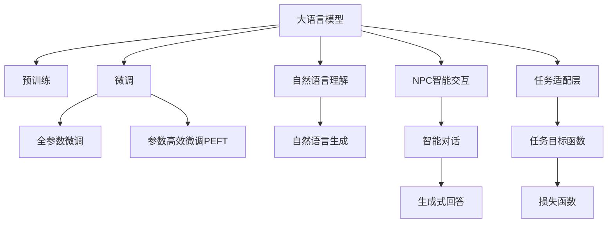

                 

# LLM在游戏开发中的应用：创造智能NPC

> 关键词：大语言模型,游戏开发,NPC智能,预训练模型,微调,Fine-Tuning

## 1. 背景介绍

### 1.1 问题由来
近年来，随着深度学习技术的快速发展，大语言模型(Large Language Models, LLMs)在游戏领域得到了越来越多的应用。这些模型通过在大规模无标签文本数据上进行预训练，学习到了丰富的语言知识和常识，可以在多种任务中展现出色的表现。在NPC智能交互设计方面，大语言模型提供了全新的可能性。

传统游戏NPC往往依赖脚本编程或规则设计，缺乏足够的智能和灵活性，难以适应复杂多变的玩家行为。而大语言模型通过微调，可以在特定任务上学习和理解自然语言，实现更加智能和个性化的NPC交互。这为游戏设计带来了新的思路和方法，使得游戏世界更加真实和引人入胜。

### 1.2 问题核心关键点
本节将介绍大语言模型在NPC智能交互设计中的关键问题，包括但不限于：

- 如何选择合适的预训练语言模型
- 微调的目标任务与设计
- NPC智能交互的实现方式与流程
- 微调的超参数设置与优化
- NPC智能交互的实际应用效果评估

这些问题共同构成了大语言模型在NPC智能交互设计中的应用核心，其解决方案将决定游戏世界的质量与体验。

### 1.3 问题研究意义
研究和应用大语言模型在NPC智能交互设计中，对于游戏开发具有重要意义：

1. 提升游戏体验：智能NPC能够理解玩家意图，提供个性化和动态的回答，增加游戏的沉浸感和趣味性。
2. 减少开发成本：利用大模型的通用能力，通过微调即可实现NPC智能，减少脚本编写和规则设计的复杂度与成本。
3. 增强游戏世界：智能NPC能够更真实地模拟人类行为，增加游戏世界的深度和复杂度，提升游戏性和互动性。
4. 推动创新：大模型的微调技术能够激发更多的创意和设计，为游戏世界带来更多新元素和体验。
5. 增强游戏稳定性：智能NPC能够实时应对玩家行为，提高游戏稳定性，减少突发异常情况。

综上所述，大语言模型在NPC智能交互设计中的应用，不仅能够提升游戏体验和质量，还将在游戏开发中发挥重要作用，推动游戏行业的创新与进步。

## 2. 核心概念与联系

### 2.1 核心概念概述

为更好地理解大语言模型在NPC智能交互设计中的应用，本节将介绍几个密切相关的核心概念：

- 大语言模型(Large Language Model, LLM)：以自回归(如GPT)或自编码(如BERT)模型为代表的大规模预训练语言模型。通过在大规模无标签文本语料上进行预训练，学习到了丰富的语言知识和常识，具备强大的语言理解和生成能力。

- 预训练(Pre-training)：指在大规模无标签文本语料上，通过自监督学习任务训练通用语言模型的过程。常见的预训练任务包括言语建模、遮挡语言模型等。

- 微调(Fine-tuning)：指在预训练模型的基础上，使用下游任务的少量标注数据，通过有监督学习优化模型在特定任务上的性能。通常只需要调整顶层分类器或解码器，并以较小的学习率更新全部或部分的模型参数。

- 迁移学习(Transfer Learning)：指将一个领域学习到的知识，迁移应用到另一个不同但相关的领域的学习范式。大模型的预训练-微调过程即是一种典型的迁移学习方式。

- 自然语言理解(NLU)：指让机器理解自然语言的能力，包括词汇、语法、语义等方面的理解。

- 自然语言生成(NLG)：指让机器生成自然语言的能力，可以用于对话系统、生成式文本等方面。

- NPC智能交互：指使游戏中的非玩家角色(NPC)具备理解玩家意图和做出智能反应的能力，从而提高游戏的互动性和沉浸感。

这些核心概念之间的逻辑关系可以通过以下Mermaid流程图来展示：



这个流程图展示了大语言模型的核心概念及其之间的关系：

1. 大语言模型通过预训练获得基础能力。
2. 微调是对预训练模型进行任务特定的优化，可以分为全参数微调和参数高效微调（PEFT）。
3. 自然语言理解使模型具备理解自然语言的能力。
4. 自然语言生成使模型具备生成自然语言的能力。
5. NPC智能交互利用自然语言理解与生成，使NPC具备智能互动能力。
6. 任务适配层和损失函数设计，确保模型能够适应特定任务。

这些概念共同构成了大语言模型在NPC智能交互设计中的应用框架，使其能够在各种场景下发挥强大的自然语言处理能力。通过理解这些核心概念，我们可以更好地把握大语言模型的工作原理和优化方向。

## 3. 核心算法原理 & 具体操作步骤
### 3.1 算法原理概述

基于大语言模型在NPC智能交互设计中的微调方法，本质上是一个有监督的细粒度迁移学习过程。其核心思想是：将预训练的大语言模型视作一个强大的"特征提取器"，通过在下游任务的少量标注数据上进行有监督的微调，使得模型输出能够匹配任务目标，从而实现NPC智能互动。

形式化地，假设预训练模型为 $M_{\theta}$，其中 $\theta$ 为预训练得到的模型参数。给定NPC智能交互任务 $T$ 的标注数据集 $D=\{(x_i, y_i)\}_{i=1}^N$，微调的目标是找到新的模型参数 $\hat{\theta}$，使得：

$$
\hat{\theta}=\mathop{\arg\min}_{\theta} \mathcal{L}(M_{\theta},D)
$$

其中 $\mathcal{L}$ 为针对任务 $T$ 设计的损失函数，用于衡量模型预测输出与任务目标之间的差异。常见的损失函数包括交叉熵损失、均方误差损失等。

通过梯度下降等优化算法，微调过程不断更新模型参数 $\theta$，最小化损失函数 $\mathcal{L}$，使得模型输出逼近任务目标。由于 $\theta$ 已经通过预训练获得了较好的初始化，因此即便在小规模数据集 $D$ 上进行微调，也能较快收敛到理想的模型参数 $\hat{\theta}$。

### 3.2 算法步骤详解

基于大语言模型在NPC智能交互设计中的微调方法，一般包括以下几个关键步骤：

**Step 1: 准备预训练模型和数据集**
- 选择合适的预训练语言模型 $M_{\theta}$ 作为初始化参数，如 BERT、GPT等。
- 准备NPC智能交互任务的标注数据集 $D$，划分为训练集、验证集和测试集。一般要求标注数据与预训练数据的分布不要差异过大。

**Step 2: 添加任务适配层**
- 根据NPC智能交互任务类型，在预训练模型顶层设计合适的输出层和损失函数。
- 对于分类任务，通常在顶层添加线性分类器和交叉熵损失函数。
- 对于生成任务，通常使用语言模型的解码器输出概率分布，并以负对数似然为损失函数。

**Step 3: 设置微调超参数**
- 选择合适的优化算法及其参数，如 AdamW、SGD 等，设置学习率、批大小、迭代轮数等。
- 设置正则化技术及强度，包括权重衰减、Dropout、Early Stopping 等。
- 确定冻结预训练参数的策略，如仅微调顶层，或全部参数都参与微调。

**Step 4: 执行梯度训练**
- 将训练集数据分批次输入模型，前向传播计算损失函数。
- 反向传播计算参数梯度，根据设定的优化算法和学习率更新模型参数。
- 周期性在验证集上评估模型性能，根据性能指标决定是否触发 Early Stopping。
- 重复上述步骤直到满足预设的迭代轮数或 Early Stopping 条件。

**Step 5: 测试和部署**
- 在测试集上评估微调后模型 $M_{\hat{\theta}}$ 的性能，对比微调前后的精度提升。
- 使用微调后的模型对新样本进行推理预测，集成到实际的应用系统中。
- 持续收集新的数据，定期重新微调模型，以适应数据分布的变化。

以上是基于大语言模型在NPC智能交互设计中的微调范式的一般流程。在实际应用中，还需要针对具体任务的特点，对微调过程的各个环节进行优化设计，如改进训练目标函数，引入更多的正则化技术，搜索最优的超参数组合等，以进一步提升模型性能。

### 3.3 算法优缺点

基于大语言模型在NPC智能交互设计中的微调方法具有以下优点：

1. 简单高效。只需准备少量标注数据，即可对预训练模型进行快速适配，获得较大的性能提升。
2. 通用适用。适用于各种NPC智能交互任务，包括分类、匹配、生成等，设计简单的任务适配层即可实现微调。
3. 参数高效。利用参数高效微调技术，在固定大部分预训练权重不变的情况下，仍可取得不错的提升。
4. 效果显著。在学术界和工业界的诸多任务上，基于微调的方法已经刷新了最先进的性能指标。

同时，该方法也存在一定的局限性：

1. 依赖标注数据。微调的效果很大程度上取决于标注数据的质量和数量，获取高质量标注数据的成本较高。
2. 迁移能力有限。当目标任务与预训练数据的分布差异较大时，微调的性能提升有限。
3. 负面效果传递。预训练模型的固有偏见、有害信息等，可能通过微调传递到下游任务，造成负面影响。
4. 可解释性不足。微调模型的决策过程通常缺乏可解释性，难以对其推理逻辑进行分析和调试。

尽管存在这些局限性，但就目前而言，基于监督学习的微调方法仍是大语言模型在NPC智能交互设计中的主流范式。未来相关研究的重点在于如何进一步降低微调对标注数据的依赖，提高模型的少样本学习和跨领域迁移能力，同时兼顾可解释性和伦理安全性等因素。

### 3.4 算法应用领域

基于大语言模型在NPC智能交互设计中的微调方法，已经在多个NPC智能任务上得到了应用，例如：

- NPC对话系统：让NPC能够理解玩家意图，提供个性化和动态的回答，增加游戏的沉浸感和趣味性。
- NPC任务执行：使NPC能够根据玩家指令执行复杂任务，如解谜、寻宝等，增强游戏的复杂度和互动性。
- NPC任务生成：让NPC根据玩家行为生成新的任务或对话，提升游戏世界的多样性和灵活性。

除了上述这些经典任务外，NPC智能交互方法还被创新性地应用到更多场景中，如可控对话、情感分析、知识图谱等，为游戏世界带来了新的突破。随着预训练模型和微调方法的不断进步，相信NPC智能交互设计将会在更广阔的应用领域大放异彩。

## 4. 数学模型和公式 & 详细讲解
### 4.1 数学模型构建

本节将使用数学语言对基于大语言模型在NPC智能交互设计中的微调过程进行更加严格的刻画。

记预训练语言模型为 $M_{\theta}$，其中 $\theta$ 为预训练得到的模型参数。假设NPC智能交互任务的训练集为 $D=\{(x_i, y_i)\}_{i=1}^N, x_i \in \mathcal{X}, y_i \in \mathcal{Y}$。

定义模型 $M_{\theta}$ 在输入 $x$ 上的输出为 $\hat{y}=M_{\theta}(x) \in \mathcal{Y}$，表示NPC的智能反应。真实标签 $y \in \{0,1\}$。则分类任务交叉熵损失函数定义为：

$$
\ell(M_{\theta}(x),y) = -[y\log \hat{y} + (1-y)\log (1-\hat{y})]
$$

将其代入经验风险公式，得：

$$
\mathcal{L}(\theta) = -\frac{1}{N}\sum_{i=1}^N [y_i\log M_{\theta}(x_i)+(1-y_i)\log(1-M_{\theta}(x_i))]
$$

根据链式法则，损失函数对参数 $\theta_k$ 的梯度为：

$$
\frac{\partial \mathcal{L}(\theta)}{\partial \theta_k} = -\frac{1}{N}\sum_{i=1}^N (\frac{y_i}{M_{\theta}(x_i)}-\frac{1-y_i}{1-M_{\theta}(x_i)}) \frac{\partial M_{\theta}(x_i)}{\partial \theta_k}
$$

其中 $\frac{\partial M_{\theta}(x_i)}{\partial \theta_k}$ 可进一步递归展开，利用自动微分技术完成计算。

### 4.2 公式推导过程

以下我们以NPC对话系统为例，推导交叉熵损失函数及其梯度的计算公式。

假设模型 $M_{\theta}$ 在输入 $x$ 上的输出为 $\hat{y}=M_{\theta}(x) \in [0,1]$，表示NPC的智能反应。真实标签 $y \in \{0,1\}$。则二分类交叉熵损失函数定义为：

$$
\ell(M_{\theta}(x),y) = -[y\log \hat{y} + (1-y)\log (1-\hat{y})]
$$

将其代入经验风险公式，得：

$$
\mathcal{L}(\theta) = -\frac{1}{N}\sum_{i=1}^N [y_i\log M_{\theta}(x_i)+(1-y_i)\log(1-M_{\theta}(x_i))]
$$

根据链式法则，损失函数对参数 $\theta_k$ 的梯度为：

$$
\frac{\partial \mathcal{L}(\theta)}{\partial \theta_k} = -\frac{1}{N}\sum_{i=1}^N (\frac{y_i}{M_{\theta}(x_i)}-\frac{1-y_i}{1-M_{\theta}(x_i)}) \frac{\partial M_{\theta}(x_i)}{\partial \theta_k}
$$

其中 $\frac{\partial M_{\theta}(x_i)}{\partial \theta_k}$ 可进一步递归展开，利用自动微分技术完成计算。

在得到损失函数的梯度后，即可带入参数更新公式，完成模型的迭代优化。重复上述过程直至收敛，最终得到适应NPC智能交互任务的最优模型参数 $\theta^*$。

## 5. 项目实践：代码实例和详细解释说明
### 5.1 开发环境搭建

在进行NPC智能交互设计微调实践前，我们需要准备好开发环境。以下是使用Python进行PyTorch开发的环境配置流程：

1. 安装Anaconda：从官网下载并安装Anaconda，用于创建独立的Python环境。

2. 创建并激活虚拟环境：
```bash
conda create -n pytorch-env python=3.8 
conda activate pytorch-env
```

3. 安装PyTorch：根据CUDA版本，从官网获取对应的安装命令。例如：
```bash
conda install pytorch torchvision torchaudio cudatoolkit=11.1 -c pytorch -c conda-forge
```

4. 安装Transformers库：
```bash
pip install transformers
```

5. 安装各类工具包：
```bash
pip install numpy pandas scikit-learn matplotlib tqdm jupyter notebook ipython
```

完成上述步骤后，即可在`pytorch-env`环境中开始微调实践。

### 5.2 源代码详细实现

下面我以NPC对话系统为例，给出使用Transformers库对BERT模型进行微调的PyTorch代码实现。

首先，定义对话任务的数据处理函数：

```python
from transformers import BertTokenizer
from torch.utils.data import Dataset
import torch

class DialogueDataset(Dataset):
    def __init__(self, dialogues, labels, tokenizer, max_len=128):
        self.dialogues = dialogues
        self.labels = labels
        self.tokenizer = tokenizer
        self.max_len = max_len
        
    def __len__(self):
        return len(self.dialogues)
    
    def __getitem__(self, item):
        dialogue = self.dialogues[item]
        label = self.labels[item]
        
        encoding = self.tokenizer(dialogue, return_tensors='pt', max_length=self.max_len, padding='max_length', truncation=True)
        input_ids = encoding['input_ids'][0]
        attention_mask = encoding['attention_mask'][0]
        
        # 对对话-回答对进行编码
        label_seq = self.tokenizer(label, return_tensors='pt', padding='max_length', truncation=True)
        label_ids = label_seq['input_ids'][0]
        label_mask = label_seq['attention_mask'][0]
        
        # 拼接对话-回答对
        dialogue_input_ids = torch.cat([input_ids, label_ids], dim=0)
        dialogue_attention_mask = torch.cat([attention_mask, label_mask], dim=0)
        
        # 对拼接后的对话-回答对进行编码
        final_input_ids = self.tokenizer(dialogue_input_ids, return_tensors='pt', max_length=self.max_len, padding='max_length', truncation=True)['input_ids'][0]
        final_attention_mask = self.tokenizer(dialogue_attention_mask, return_tensors='pt', max_length=self.max_len, padding='max_length', truncation=True)['attention_mask'][0]
        
        return {'input_ids': final_input_ids, 
                'attention_mask': final_attention_mask,
                'labels': torch.tensor(label_ids, dtype=torch.long)}
```

然后，定义模型和优化器：

```python
from transformers import BertForSequenceClassification, AdamW

model = BertForSequenceClassification.from_pretrained('bert-base-cased', num_labels=2)

optimizer = AdamW(model.parameters(), lr=2e-5)
```

接着，定义训练和评估函数：

```python
from torch.utils.data import DataLoader
from tqdm import tqdm
from sklearn.metrics import accuracy_score

device = torch.device('cuda') if torch.cuda.is_available() else torch.device('cpu')
model.to(device)

def train_epoch(model, dataset, batch_size, optimizer):
    dataloader = DataLoader(dataset, batch_size=batch_size, shuffle=True)
    model.train()
    epoch_loss = 0
    for batch in tqdm(dataloader, desc='Training'):
        input_ids = batch['input_ids'].to(device)
        attention_mask = batch['attention_mask'].to(device)
        labels = batch['labels'].to(device)
        model.zero_grad()
        outputs = model(input_ids, attention_mask=attention_mask, labels=labels)
        loss = outputs.loss
        epoch_loss += loss.item()
        loss.backward()
        optimizer.step()
    return epoch_loss / len(dataloader)

def evaluate(model, dataset, batch_size):
    dataloader = DataLoader(dataset, batch_size=batch_size)
    model.eval()
    preds, labels = [], []
    with torch.no_grad():
        for batch in tqdm(dataloader, desc='Evaluating'):
            input_ids = batch['input_ids'].to(device)
            attention_mask = batch['attention_mask'].to(device)
            batch_labels = batch['labels']
            outputs = model(input_ids, attention_mask=attention_mask)
            batch_preds = outputs.logits.argmax(dim=2).to('cpu').tolist()
            batch_labels = batch_labels.to('cpu').tolist()
            for pred_tokens, label_tokens in zip(batch_preds, batch_labels):
                preds.append(pred_tokens)
                labels.append(label_tokens)
                
    print(accuracy_score(labels, preds))
```

最后，启动训练流程并在测试集上评估：

```python
epochs = 5
batch_size = 16

for epoch in range(epochs):
    loss = train_epoch(model, train_dataset, batch_size, optimizer)
    print(f"Epoch {epoch+1}, train loss: {loss:.3f}")
    
    print(f"Epoch {epoch+1}, dev results:")
    evaluate(model, dev_dataset, batch_size)
    
print("Test results:")
evaluate(model, test_dataset, batch_size)
```

以上就是使用PyTorch对BERT进行NPC对话系统微调的完整代码实现。可以看到，得益于Transformers库的强大封装，我们可以用相对简洁的代码完成BERT模型的加载和微调。

### 5.3 代码解读与分析

让我们再详细解读一下关键代码的实现细节：

**DialogueDataset类**：
- `__init__`方法：初始化对话数据、标签、分词器等关键组件。
- `__len__`方法：返回数据集的样本数量。
- `__getitem__`方法：对单个样本进行处理，将对话和回答输入编码为token ids，将标签编码为数字，并对其进行定长padding，最终返回模型所需的输入。

**训练和评估函数**：
- 使用PyTorch的DataLoader对数据集进行批次化加载，供模型训练和推理使用。
- 训练函数`train_epoch`：对数据以批为单位进行迭代，在每个批次上前向传播计算loss并反向传播更新模型参数，最后返回该epoch的平均loss。
- 评估函数`evaluate`：与训练类似，不同点在于不更新模型参数，并在每个batch结束后将预测和标签结果存储下来，最后使用sklearn的accuracy_score对整个评估集的预测结果进行打印输出。

**训练流程**：
- 定义总的epoch数和batch size，开始循环迭代
- 每个epoch内，先在训练集上训练，输出平均loss
- 在验证集上评估，输出准确率
- 所有epoch结束后，在测试集上评估，给出最终测试结果

可以看到，PyTorch配合Transformers库使得BERT微调的代码实现变得简洁高效。开发者可以将更多精力放在数据处理、模型改进等高层逻辑上，而不必过多关注底层的实现细节。

当然，工业级的系统实现还需考虑更多因素，如模型的保存和部署、超参数的自动搜索、更灵活的任务适配层等。但核心的微调范式基本与此类似。

## 6. 实际应用场景
### 6.1 智能客服系统

基于大语言模型在NPC智能交互设计中的微调方法，可以广泛应用于智能客服系统的构建。传统客服往往需要配备大量人力，高峰期响应缓慢，且一致性和专业性难以保证。而使用微调后的对话模型，可以7x24小时不间断服务，快速响应客户咨询，用自然流畅的语言解答各类常见问题。

在技术实现上，可以收集企业内部的历史客服对话记录，将问题和最佳答复构建成监督数据，在此基础上对预训练对话模型进行微调。微调后的对话模型能够自动理解用户意图，匹配最合适的答案模板进行回复。对于客户提出的新问题，还可以接入检索系统实时搜索相关内容，动态组织生成回答。如此构建的智能客服系统，能大幅提升客户咨询体验和问题解决效率。

### 6.2 游戏剧情引导

游戏剧情是游戏中重要的交互环节，传统的剧情引导往往依赖人工编写，不仅耗时耗力，还容易出错。基于大语言模型在NPC智能交互设计中的微调方法，可以使NPC具备剧情引导能力，根据玩家的行为和互动自动生成剧情对话，使游戏剧情更加自然流畅。

具体而言，可以收集游戏内部的剧情对话数据，将对话和回应构建成监督数据，在此基础上对预训练对话模型进行微调。微调后的模型能够根据玩家的行为和上下文自动生成剧情对话，使玩家获得更好的游戏体验。同时，游戏设计师还可以利用微调模型进行剧情测试和优化，确保剧情的可玩性和互动性。

### 6.3 游戏任务生成

游戏中任务的设计和生成是提升游戏丰富度和可玩性的重要手段。传统的任务设计往往需要大量人工参与，耗费时间和精力。基于大语言模型在NPC智能交互设计中的微调方法，可以使NPC具备任务生成能力，自动生成各种类型的游戏任务，增加游戏的趣味性和挑战性。

具体而言，可以收集游戏内部的任务描述和目标数据，将任务和达成条件构建成监督数据，在此基础上对预训练对话模型进行微调。微调后的模型能够根据玩家的行为和上下文自动生成各种游戏任务，使玩家获得更好的游戏体验。同时，游戏设计师还可以利用微调模型进行任务测试和优化，确保任务的合理性和可玩性。

### 6.4 未来应用展望

随着大语言模型在NPC智能交互设计中的微调方法不断发展，其应用领域将不断扩展，为游戏开发带来更多创新和突破。

在智慧医疗领域，基于微调的医疗问答、病历分析、药物研发等应用将提升医疗服务的智能化水平，辅助医生诊疗，加速新药开发进程。

在智能教育领域，微调技术可应用于作业批改、学情分析、知识推荐等方面，因材施教，促进教育公平，提高教学质量。

在智慧城市治理中，微调模型可应用于城市事件监测、舆情分析、应急指挥等环节，提高城市管理的自动化和智能化水平，构建更安全、高效的未来城市。

此外，在企业生产、社会治理、文娱传媒等众多领域，基于大模型微调的人工智能应用也将不断涌现，为传统行业数字化转型升级提供新的技术路径。相信随着技术的日益成熟，微调方法将成为人工智能落地应用的重要范式，推动人工智能技术在垂直行业的规模化落地。总之，微调需要开发者根据具体任务，不断迭代和优化模型、数据和算法，方能得到理想的效果。

## 7. 工具和资源推荐
### 7.1 学习资源推荐

为了帮助开发者系统掌握大语言模型在NPC智能交互设计中的应用理论基础和实践技巧，这里推荐一些优质的学习资源：

1. 《Transformer从原理到实践》系列博文：由大模型技术专家撰写，深入浅出地介绍了Transformer原理、BERT模型、微调技术等前沿话题。

2. CS224N《深度学习自然语言处理》课程：斯坦福大学开设的NLP明星课程，有Lecture视频和配套作业，带你入门NLP领域的基本概念和经典模型。

3. 《Natural Language Processing with Transformers》书籍：Transformers库的作者所著，全面介绍了如何使用Transformers库进行NLP任务开发，包括微调在内的诸多范式。

4. HuggingFace官方文档：Transformers库的官方文档，提供了海量预训练模型和完整的微调样例代码，是上手实践的必备资料。

5. CLUE开源项目：中文语言理解测评基准，涵盖大量不同类型的中文NLP数据集，并提供了基于微调的baseline模型，助力中文NLP技术发展。

通过对这些资源的学习实践，相信你一定能够快速掌握大语言模型在NPC智能交互设计中的应用精髓，并用于解决实际的NPC智能交互设计问题。
###  7.2 开发工具推荐

高效的开发离不开优秀的工具支持。以下是几款用于NPC智能交互设计微调开发的常用工具：

1. PyTorch：基于Python的开源深度学习框架，灵活动态的计算图，适合快速迭代研究。大部分预训练语言模型都有PyTorch版本的实现。

2. TensorFlow：由Google主导开发的开源深度学习框架，生产部署方便，适合大规模工程应用。同样有丰富的预训练语言模型资源。

3. Transformers库：HuggingFace开发的NLP工具库，集成了众多SOTA语言模型，支持PyTorch和TensorFlow，是进行NPC智能交互设计微调任务开发的利器。

4. Weights & Biases：模型训练的实验跟踪工具，可以记录和可视化模型训练过程中的各项指标，方便对比和调优。与主流深度学习框架无缝集成。

5. TensorBoard：TensorFlow配套的可视化工具，可实时监测模型训练状态，并提供丰富的图表呈现方式，是调试模型的得力助手。

6. Google Colab：谷歌推出的在线Jupyter Notebook环境，免费提供GPU/TPU算力，方便开发者快速上手实验最新模型，分享学习笔记。

合理利用这些工具，可以显著提升NPC智能交互设计微调任务的开发效率，加快创新迭代的步伐。

### 7.3 相关论文推荐

大语言模型和微调技术的发展源于学界的持续研究。以下是几篇奠基性的相关论文，推荐阅读：

1. Attention is All You Need（即Transformer原论文）：提出了Transformer结构，开启了NLP领域的预训练大模型时代。

2. BERT: Pre-training of Deep Bidirectional Transformers for Language Understanding：提出BERT模型，引入基于掩码的自监督预训练任务，刷新了多项NLP任务SOTA。

3. Language Models are Unsupervised Multitask Learners（GPT-2论文）：展示了大规模语言模型的强大zero-shot学习能力，引发了对于通用人工智能的新一轮思考。

4. Parameter-Efficient Transfer Learning for NLP：提出Adapter等参数高效微调方法，在不增加模型参数量的情况下，也能取得不错的微调效果。

5. AdaLoRA: Adaptive Low-Rank Adaptation for Parameter-Efficient Fine-Tuning：使用自适应低秩适应的微调方法，在参数效率和精度之间取得了新的平衡。

6. Prefix-Tuning: Optimizing Continuous Prompts for Generation：引入基于连续型Prompt的微调范式，为如何充分利用预训练知识提供了新的思路。

这些论文代表了大语言模型微调技术的发展脉络。通过学习这些前沿成果，可以帮助研究者把握学科前进方向，激发更多的创新灵感。

## 8. 总结：未来发展趋势与挑战

### 8.1 总结

本文对基于大语言模型在NPC智能交互设计中的微调方法进行了全面系统的介绍。首先阐述了NPC智能交互设计的研究背景和意义，明确了微调在提升NPC智能、降低开发成本等方面的价值。其次，从原理到实践，详细讲解了微调的数学原理和关键步骤，给出了微调任务开发的完整代码实例。同时，本文还广泛探讨了微调方法在游戏开发中的应用场景，展示了微调范式的巨大潜力。

通过本文的系统梳理，可以看到，基于大语言模型的微调方法正在成为NPC智能交互设计中的重要范式，极大地提升NPC的智能性和互动性，为游戏开发带来了新的机遇和挑战。

### 8.2 未来发展趋势

展望未来，大语言模型在NPC智能交互设计中的微调方法将呈现以下几个发展趋势：

1. 模型规模持续增大。随着算力成本的下降和数据规模的扩张，预训练语言模型的参数量还将持续增长。超大规模语言模型蕴含的丰富语言知识，有望支撑更加复杂多变的NPC智能交互设计任务。

2. 微调方法日趋多样。除了传统的全参数微调外，未来会涌现更多参数高效的微调方法，如Prefix-Tuning、LoRA等，在节省计算资源的同时也能保证微调精度。

3. 持续学习成为常态。随着数据分布的不断变化，微调模型也需要持续学习新知识以保持性能。如何在不遗忘原有知识的同时，高效吸收新样本信息，将成为重要的研究课题。

4. 标注样本需求降低。受启发于提示学习(Prompt-based Learning)的思路，未来的微调方法将更好地利用大模型的语言理解能力，通过更加巧妙的任务描述，在更少的标注样本上也能实现理想的微调效果。

5. 参数高效微调将更加普及。开发更加参数高效的微调方法，在固定大部分预训练参数的情况下，只更新极少量的任务相关参数，以提高微调效率，避免过拟合。

6. 多模态微调崛起。当前的微调主要聚焦于纯文本数据，未来会进一步拓展到图像、视频、语音等多模态数据微调。多模态信息的融合，将显著提升NPC对现实世界的理解和建模能力。

以上趋势凸显了大语言模型在NPC智能交互设计中的应用前景。这些方向的探索发展，必将进一步提升NPC的智能性和互动性，为游戏开发带来更多创新和突破。

### 8.3 面临的挑战

尽管大语言模型在NPC智能交互设计中的应用已经取得了显著进展，但在迈向更加智能化、普适化应用的过程中，它仍面临着诸多挑战：

1. 标注成本瓶颈。虽然微调大大降低了标注数据的需求，但对于长尾应用场景，难以获得充足的高质量标注数据，成为制约微调性能的瓶颈。如何进一步降低微调对标注样本的依赖，将是一大难题。

2. 模型鲁棒性不足。当前微调模型面对域外数据时，泛化性能往往大打折扣。对于测试样本的微小扰动，微调模型的预测也容易发生波动。如何提高微调模型的鲁棒性，避免灾难性遗忘，还需要更多理论和实践的积累。

3. 推理效率有待提高。大规模语言模型虽然精度高，但在实际部署时往往面临推理速度慢、内存占用大等效率问题。如何在保证性能的同时，简化模型结构，提升推理速度，优化资源占用，将是重要的优化方向。

4. 可解释性亟需加强。当前微调模型更像是"黑盒"系统，难以解释其内部工作机制和决策逻辑。对于医疗、金融等高风险应用，算法的可解释性和可审计性尤为重要。如何赋予微调模型更强的可解释性，将是亟待攻克的难题。

5. 安全性有待保障。预训练语言模型难免会学习到有偏见、有害的信息，通过微调传递到下游任务，产生误导性、歧视性的输出，给实际应用带来安全隐患。如何从数据和算法层面消除模型偏见，避免恶意用途，确保输出的安全性，也将是重要的研究课题。

6. 知识整合能力不足。现有的微调模型往往局限于任务内数据，难以灵活吸收和运用更广泛的先验知识。如何让微调过程更好地与外部知识库、规则库等专家知识结合，形成更加全面、准确的信息整合能力，还有很大的想象空间。

正视微调面临的这些挑战，积极应对并寻求突破，将是大语言模型在NPC智能交互设计中迈向成熟的必由之路。相信随着学界和产业界的共同努力，这些挑战终将一一被克服，大语言模型在NPC智能交互设计中的应用将更加广泛和深入。

### 8.4 研究展望

面向未来，大语言模型在NPC智能交互设计中的应用还需要与其他人工智能技术进行更深入的融合，如知识表示、因果推理、强化学习等，多路径协同发力，共同推动NPC智能交互系统的进步。只有勇于创新、敢于突破，才能不断拓展NPC的边界，让智能NPC在更广阔的应用领域中发挥更大的作用。

## 9. 附录：常见问题与解答

**Q1：大语言模型在NPC智能交互设计中的应用有哪些局限性？**

A: 大语言模型在NPC智能交互设计中的应用面临以下局限性：

1. 依赖标注数据。微调的效果很大程度上取决于标注数据的质量和数量，获取高质量标注数据的成本较高。
2. 迁移能力有限。当目标任务与预训练数据的分布差异较大时，微调的性能提升有限。
3. 负面效果传递。预训练模型的固有偏见、有害信息等，可能通过微调传递到下游任务，造成负面影响。
4. 可解释性不足。微调模型的决策过程通常缺乏可解释性，难以对其推理逻辑进行分析和调试。
5. 安全性有待保障。预训练语言模型难免会学习到有偏见、有害的信息，通过微调传递到下游任务，产生误导性、歧视性的输出，给实际应用带来安全隐患。

尽管存在这些局限性，但大语言模型在NPC智能交互设计中的应用已经取得了显著进展，未来仍有很大的发展潜力。通过不断优化算法和数据，提升模型的鲁棒性和可解释性，大语言模型将在NPC智能交互设计中发挥更加重要的作用。

**Q2：如何进行大语言模型在NPC智能交互设计中的微调？**

A: 进行大语言模型在NPC智能交互设计中的微调，通常遵循以下步骤：

1. 准备预训练模型和数据集。选择合适的预训练语言模型，准备NPC智能交互任务的标注数据集，划分为训练集、验证集和测试集。
2. 添加任务适配层。根据NPC智能交互任务类型，设计合适的输出层和损失函数，通常是线性分类器加交叉熵损失。
3. 设置微调超参数。选择合适的优化算法及其参数，设置学习率、批大小、迭代轮数等，通常使用AdamW优化器，学习率在预训练模型基础上降低1-2个数量级。
4. 执行梯度训练。将训练集数据分批次输入模型，前向传播计算损失函数，反向传播更新模型参数，周期性在验证集上评估模型性能。
5. 测试和部署。在测试集上评估微调后模型的性能，对比微调前后的精度提升，使用微调后的模型对新样本进行推理预测，集成到实际的应用系统中。

需要注意的是，微调过程中需要根据具体任务和数据特点进行优化设计，如改进训练目标函数，引入更多的正则化技术，搜索最优的超参数组合等，以进一步提升模型性能。

**Q3：大语言模型在NPC智能交互设计中的应用场景有哪些？**

A: 大语言模型在NPC智能交互设计中的应用场景包括但不限于：

1. NPC对话系统。使NPC能够理解玩家意图，提供个性化和动态的回答，增加游戏的沉浸感和趣味性。
2. NPC任务执行。使NPC能够根据玩家指令执行复杂任务，如解谜、寻宝等，增强游戏的复杂度和互动性。
3. NPC任务生成。使NPC根据玩家的行为和上下文自动生成剧情对话、游戏任务，增加游戏的趣味性和可玩性。
4. NPC情感分析。使NPC具备情感识别和响应能力，根据玩家情绪调整互动策略，提升游戏体验。
5. NPC知识图谱。使NPC具备知识推理和应用能力，根据玩家的问题自动查找相关知识并回答，增强游戏的智能化水平。

随着大语言模型和微调方法的不断进步，基于NPC智能交互设计的应用场景将不断扩展，为游戏开发带来更多创新和突破。

**Q4：大语言模型在NPC智能交互设计中的微调需要注意哪些问题？**

A: 大语言模型在NPC智能交互设计中的微调需要注意以下问题：

1. 选择合适的预训练模型和任务适配层。不同模型和适配层的性能可能存在差异，需要根据具体任务进行选择。
2. 设置合理的微调超参数。学习率、批大小、迭代轮数等超参数需要根据任务特点和数据规模进行优化，避免过拟合和欠拟合。
3. 使用合适的正则化技术。L2正则、Dropout、Early Stopping等技术可以防止模型过拟合，提高模型泛化能力。
4. 注意模型参数更新方式。全参数微调和参数高效微调（PEFT）是两种常见的微调方式，需要根据任务需求选择合适的更新方式。
5. 持续收集和更新数据。微调模型需要定期更新，以适应数据分布的变化，提高模型鲁棒性。

合理应对这些问题，才能在大语言模型在NPC智能交互设计中的微调任务中取得良好的效果。

---

作者：禅与计算机程序设计艺术 / Zen and the Art of Computer Programming

