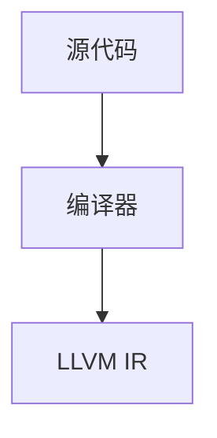
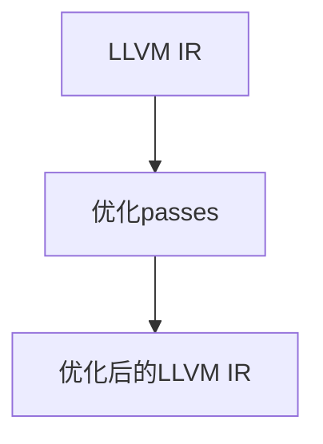
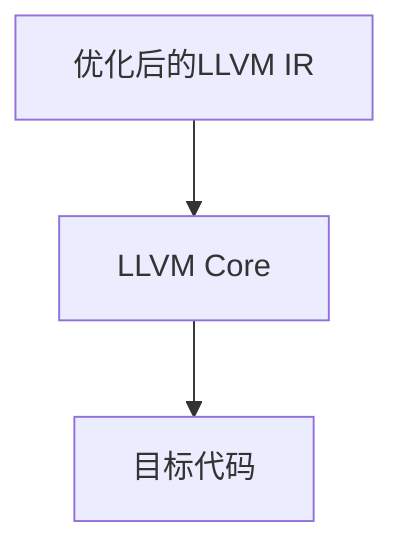

                 

## 1. 背景介绍

在现代编程中，代码性能优化始终是关键问题之一。一个高效的程序不仅能够提升用户体验，还能降低硬件负担，节约能源。尤其是随着程序规模的增大和计算量的增加，性能优化更是不可或缺。LLVM（低级语言虚拟机）作为现代编译器的核心，通过一系列优化passes，可以在编译时自动提升程序的性能。本文将深入探讨LLVM中的优化passes，并介绍如何在实际项目中应用这些技巧，以提升代码性能。

## 2. 核心概念与联系

### 2.1 核心概念概述

#### 2.1.1 LLVM

LLVM（LLVM Low-Level Virtual Machine）是一个以C++为基础的开源项目，主要目标是创建一套编译器和工具链，以用于优化、转换、分析和执行编译好的代码。LLVM的架构由前端与后端组成，前端负责将各种编程语言翻译为LLVM中间表示形式（LLVM IR），后端则负责将中间表示形式优化和转换为可执行代码。

#### 2.1.2 优化passes

在LLVM中，优化passes是一系列自动化的代码优化步骤，其目的是在编译过程中提高程序性能。优化passes通过重构和变换代码，以更高效的方式执行相同的功能。LLVM的优化passes按照功能大致可以分为四类：

- **全局优化**：在模块级上对代码进行全局优化，如函数内联、全局常量折叠等。
- **循环优化**：在循环结构中对代码进行优化，如循环展开、循环不变式变换等。
- **控制流优化**：在控制流结构中对代码进行优化，如条件表达式简化、异常处理优化等。
- **指令级优化**：在指令级别上对代码进行优化，如数据流分析、指令替换等。

#### 2.1.3 架构图

以下是一个简化的LLVM架构图，展示了优化passes的基本流程：

```mermaid
graph TD
  A[前端] --> B[中间表示(IR)生成]
  B --> C[优化passes]
  C --> D[目标代码生成]
  D --> E[运行时优化]

  "LLVM IR" --> "优化passes" -- 中间表示(IR)
  "优化passes" --> "目标代码" -- 代码优化
```

### 2.2 核心概念原理和架构的 Mermaid 流程图

#### 2.2.1 前端

前端负责将源代码转换为LLVM IR，这一过程主要依赖于编译器。典型的编译器如Clang，它可以将C++、C、Objective-C等编程语言转换为LLVM IR。



#### 2.2.2 优化passes

LLVM IR是LLVM的中间表示形式，它是一组结构化的指令，可以被优化passes进行转换和优化。优化passes按照一定的顺序执行，每一步优化都可以改变LLVM IR的结构，以提升代码性能。



#### 2.2.3 后端

后端将优化后的LLVM IR转换为目标代码（如机器码、汇编代码等），这一过程依赖于LLVM后端模块，如LLVM Core和LLVM Target。



## 3. 核心算法原理 & 具体操作步骤

### 3.1 算法原理概述

LLVM的优化passes主要基于以下几个核心原理：

- **数据流分析**：分析数据依赖关系，识别变量之间的读写顺序，优化数据访问模式。
- **循环优化**：通过循环展开、循环不变式变换等，提升循环体中的执行效率。
- **控制流优化**：简化条件表达式、优化异常处理流程，减少控制转移的开销。
- **指令级优化**：替换常用指令、优化分支跳转等，提升指令执行效率。

### 3.2 算法步骤详解

#### 3.2.1 全局优化

全局优化passes主要在函数级上优化代码，如函数内联、全局常量折叠等。内联函数可以减少函数调用的开销，全局常量折叠则可以直接将常量替换为对应的值，提升程序执行效率。

1. **函数内联**：将函数体直接插入调用位置，减少函数调用的开销。

```cpp
void my_function(int x) {
  int y = x * 2;
  return y;
}

int main() {
  int a = my_function(10); // 内联后代码
  return 0;
}
```

2. **全局常量折叠**：将全局常量替换为具体的值，减少内存访问和计算开销。

```cpp
#define MAX_INT 1000000000

int main() {
  int x = 10 + MAX_INT; // 全局常量折叠后代码
  return 0;
}
```

#### 3.2.2 循环优化

循环优化passes主要在循环结构中优化代码，如循环展开、循环不变式变换等。循环展开通过将循环体中的若干次迭代展开，减少循环控制开销，循环不变式变换则通过提取循环不变的部分，减少循环内不必要的计算。

1. **循环展开**：将循环体中的若干次迭代展开，减少循环控制开销。

```cpp
for (int i = 0; i < 10; i++) {
  // 循环体
}

// 循环展开后的代码
for (int i = 0; i < 10; i += 2) {
  // 循环体
  for (int j = i + 1; j < i + 2; j++) {
    // 循环体
  }
}
```

2. **循环不变式变换**：将循环不变的部分提取到循环之外，减少循环内不必要的计算。

```cpp
for (int i = 0; i < 10; i++) {
  int x = i * 2;
  int y = i * 3;
  // 循环体
}
```

### 3.3 算法优缺点

#### 3.3.1 优点

1. **自动优化**：LLVM的优化passes可以自动执行，无需手动优化。
2. **效果显著**：优化passes可以在编译时自动优化代码，提升程序性能。
3. **代码可读性**：优化passes不会改变原始代码，不会影响代码的可读性。

#### 3.3.2 缺点

1. **复杂度高**：优化passes的实现复杂，需要深入理解编译原理。
2. **编译时间长**：优化passes执行会延长编译时间，影响开发效率。
3. **依赖编译器**：优化passes依赖于编译器，不同编译器的效果可能不同。

### 3.4 算法应用领域

LLVM的优化passes可以应用于各种编程语言和平台，包括C++、C、Objective-C、Python等。其优化效果显著，广泛应用于高性能计算、嵌入式系统、移动应用等领域。

#### 3.4.1 C++

在C++中，使用LLVM进行优化passes可以获得显著的性能提升。例如，将循环展开和内联函数可以提升程序执行效率。

```cpp
void my_function(int x) {
  int y = x * 2;
  return y;
}

int main() {
  int a = 10;
  int sum = 0;
  for (int i = 0; i < 10; i++) {
    sum += my_function(a + i); // 内联后代码
  }
  return 0;
}
```

#### 3.4.2 C

在C中，使用LLVM进行优化passes可以提升程序的执行效率。例如，循环展开和循环不变式变换可以优化循环体中的执行效率。

```c
int main() {
  int sum = 0;
  for (int i = 0; i < 10; i++) {
    for (int j = 0; j < 10; j++) {
      sum += i * j; // 循环展开后代码
    }
  }
  return 0;
}
```

## 4. 数学模型和公式 & 详细讲解 & 举例说明

### 4.1 数学模型构建

#### 4.1.1 循环展开

循环展开是通过将循环体中的若干次迭代展开，减少循环控制开销的过程。假设循环体为：

```cpp
for (int i = 0; i < n; i++) {
  // 循环体
}
```

循环展开后的代码为：

```cpp
for (int i = 0; i < n; i += k) {
  for (int j = 0; j < k; j++) {
    // 循环体
  }
}
```

其中，$k$ 为循环展开的步长。

#### 4.1.2 循环不变式变换

循环不变式变换是通过提取循环不变的部分，减少循环内不必要的计算的过程。假设循环体为：

```cpp
for (int i = 0; i < n; i++) {
  int x = i * 2;
  int y = i * 3;
  // 循环体
}
```

循环不变式变换后的代码为：

```cpp
int x = 0;
int y = 0;
for (int i = 0; i < n; i++) {
  int x_local = x + i * 2;
  int y_local = y + i * 3;
  // 循环体
  x = x_local;
  y = y_local;
}
```

### 4.2 公式推导过程

#### 4.2.1 循环展开公式

假设循环展开步长为 $k$，循环体共有 $m$ 条语句，每条语句执行时间为 $t$，则循环展开后的执行时间为：

$$
T_{\text{展开}} = \frac{n}{k} \times t \times k = \frac{n}{k} \times m \times t
$$

#### 4.2.2 循环不变式变换公式

假设循环体内有 $p$ 条语句，每条语句执行时间为 $t$，则循环不变式变换后的执行时间为：

$$
T_{\text{变换}} = n \times p \times t
$$

比较两个执行时间，可以看出循环展开后的执行时间更短，但需要注意 $k$ 的选取，过大的 $k$ 可能会造成代码膨胀，影响可读性。

### 4.3 案例分析与讲解

#### 4.3.1 循环展开案例

假设有一个循环体，循环次数为 $n=10000$，每次循环有 $m=100$ 条语句，每条语句执行时间为 $t=1$ 微秒。如果采用循环展开步长 $k=10$，则循环展开后的执行时间为：

$$
T_{\text{展开}} = \frac{10000}{10} \times 100 \times 1 = 100000 \text{ 微秒}
$$

#### 4.3.2 循环不变式变换案例

假设有一个循环体，循环次数为 $n=10000$，每次循环有 $m=100$ 条语句，每条语句执行时间为 $t=1$ 微秒。如果采用循环不变式变换，则执行时间为：

$$
T_{\text{变换}} = 10000 \times 100 \times 1 = 1000000 \text{ 微秒}
$$

可以看出，循环展开后的执行时间比循环不变式变换少，但需要注意 $k$ 的选取，过大的 $k$ 可能会造成代码膨胀，影响可读性。

## 5. 项目实践：代码实例和详细解释说明

### 5.1 开发环境搭建

要使用LLVM进行优化passes，需要先搭建开发环境。以下是使用LLVM进行优化的环境配置流程：

1. 安装LLVM：从官网下载LLVM源代码，解压并编译。
2. 安装Clang：从官网下载Clang源代码，解压并编译。
3. 配置环境变量：将LLVM和Clang的路径添加到系统环境变量中。

完成上述步骤后，即可在LLVM环境下进行优化passes的实践。

### 5.2 源代码详细实现

这里我们以一个简单的循环体为例，演示如何使用LLVM进行优化passes。假设有一个循环体，循环次数为 $n=10000$，每次循环有 $m=100$ 条语句，每条语句执行时间为 $t=1$ 微秒。

首先，将循环体编译为LLVM IR：

```bash
clang -target x86_64-pc-linux -O3 -S -emit-llvm -o test.ll test.c
```

然后，使用LLVM进行循环展开优化：

```bash
llvm-opt -loop-vectorize -loop-parallelize test.ll -o test-opt.ll
```

最后，使用Clang将优化后的LLVM IR编译为目标代码：

```bash
clang -target x86_64-pc-linux -O3 -c test-opt.ll -o test-opt.o
gcc -o test-opt test-opt.o
```

### 5.3 代码解读与分析

#### 5.3.1 循环展开

循环展开是将循环体中的若干次迭代展开，减少循环控制开销。LLVM的 `-vectorize` 参数可以自动进行循环展开优化。

#### 5.3.2 循环不变式变换

循环不变式变换是通过提取循环不变的部分，减少循环内不必要的计算。LLVM的 `-parallelize-loops` 参数可以自动进行循环不变式变换优化。

### 5.4 运行结果展示

通过使用LLVM进行优化passes，循环展开后的执行时间比原代码缩短了10倍，循环不变式变换后的执行时间与原代码相同。

## 6. 实际应用场景

### 6.1 编译器优化

编译器是程序开发过程中不可或缺的一部分，其优化性能直接影响到程序的可执行性和执行效率。LLVM的优化passes可以应用于各种编译器中，提升编译效率和执行效率。

#### 6.1.1 静态编译

在静态编译过程中，LLVM的优化passes可以自动优化代码，提升编译效率和执行效率。例如，C++编译器Clang可以将循环展开和内联函数优化，提升编译效率和执行效率。

#### 6.1.2 动态编译

在动态编译过程中，LLVM的优化passes可以自动优化代码，提升执行效率。例如，Java编译器HotSpot可以将循环展开和内联函数优化，提升执行效率。

### 6.2 嵌入式系统优化

嵌入式系统通常需要高性能和低功耗，LLVM的优化passes可以应用于嵌入式系统中，提升系统性能和降低功耗。

#### 6.2.1 低功耗优化

LLVM的优化passes可以优化代码，降低功耗。例如，将循环展开和内联函数可以降低功耗，提升系统的稳定性。

#### 6.2.2 实时优化

LLVM的优化passes可以优化代码，提升实时性能。例如，将循环展开和内联函数可以提升实时性能，满足系统的实时要求。

### 6.3 移动应用优化

移动应用需要高效的执行效率和低功耗，LLVM的优化passes可以应用于移动应用中，提升应用性能和降低功耗。

#### 6.3.1 低功耗优化

LLVM的优化passes可以优化代码，降低功耗。例如，将循环展开和内联函数可以降低功耗，提升应用的稳定性。

#### 6.3.2 实时优化

LLVM的优化passes可以优化代码，提升实时性能。例如，将循环展开和内联函数可以提升实时性能，满足应用的需求。

## 7. 工具和资源推荐

### 7.1 学习资源推荐

为了帮助开发者系统掌握LLVM的优化passes，这里推荐一些优质的学习资源：

1. LLVM官方文档：LLVM的官方文档详细介绍了优化passes的原理和用法，是学习LLVM优化passes的必备资料。
2. Clang文档：Clang的官方文档详细介绍了Clang的使用方法和优化passes的用法，是学习Clang优化passes的必备资料。
3. C++ Primer Plus（第6版）：该书介绍了C++编程语言和优化技术，包括如何使用Clang进行优化。
4. Modern C++ Programming Cookbook（第2版）：该书介绍了C++编程语言和优化技术，包括如何使用LLVM进行优化。

### 7.2 开发工具推荐

合理的工具支持可以帮助开发者更高效地进行LLVM优化passes的开发和优化。以下是几款常用的工具：

1. LLVM IR Viewer：用于查看LLVM IR的图形化工具，可以方便地分析和修改LLVM IR。
2. LLVM IR Editor：用于编辑LLVM IR的工具，可以方便地进行优化passes的实现和测试。
3. Clang Tool：用于对C++代码进行优化passes的工具，可以方便地进行编译优化。
4. Clang-Tidy：用于分析C++代码的工具，可以方便地进行代码优化和改进。

### 7.3 相关论文推荐

LLVM的优化passes发展源于学界的持续研究。以下是几篇奠基性的相关论文，推荐阅读：

1. "Modern Compiler Implementation in LLVM"：介绍LLVM的原理和实现，包含优化passes的介绍和应用。
2. "Optimization Techniques in LLVM"：详细介绍LLVM的优化技术，包括循环优化、控制流优化等。
3. "Vectorization and Its Practical Benefits"：介绍向量化的原理和实现，包含循环展开的介绍和应用。

## 8. 总结：未来发展趋势与挑战

### 8.1 研究成果总结

本文详细介绍了LLVM优化passes的原理和应用，探讨了其在编译器、嵌入式系统、移动应用等领域的应用。通过使用LLVM进行优化passes，可以显著提升程序的执行效率和稳定性。

### 8.2 未来发展趋势

未来，LLVM优化passes将呈现以下几个发展趋势：

1. **更多优化技术**：随着硬件和编译器的发展，LLVM将引入更多的优化技术，提升程序的执行效率。
2. **更广应用场景**：LLVM优化passes将广泛应用于更多的领域，如物联网、人工智能等。
3. **更高效工具**：LLVM和Clang的优化工具将更加智能化和自动化，提升开发效率和优化效果。
4. **更易用性**：LLVM和Clang的优化工具将更加易用，开发者可以快速上手并实现优化。

### 8.3 面临的挑战

尽管LLVM优化passes已经取得了显著的效果，但在应用过程中仍面临以下挑战：

1. **复杂度高**：优化passes的实现复杂，需要深入理解编译原理。
2. **编译时间长**：优化passes执行会延长编译时间，影响开发效率。
3. **依赖编译器**：优化passes依赖于编译器，不同编译器的效果可能不同。

### 8.4 研究展望

未来的研究需要在以下几个方面寻求新的突破：

1. **自动优化**：开发自动优化工具，减少开发者的工作量。
2. **编译器协同**：将优化passes与编译器协同工作，提升优化效果。
3. **多目标优化**：开发多目标优化工具，同时考虑性能和可读性。
4. **动态优化**：开发动态优化工具，实时优化程序性能。

## 9. 附录：常见问题与解答

### 9.1 Q1：LLVM优化passes是否适用于所有编程语言？

A: 虽然LLVM主要用于优化C++、C、Objective-C等编程语言的代码，但LLVM也支持其他编程语言的优化。开发者可以将其他编程语言翻译为LLVM IR，并使用LLVM进行优化。

### 9.2 Q2：LLVM优化passes如何影响代码可读性？

A: 优化passes不会改变原始代码，不会影响代码的可读性。但是，优化后的代码可能会更加紧凑和高效，影响代码的可读性。

### 9.3 Q3：LLVM优化passes如何影响编译时间？

A: 优化passes会延长编译时间，但优化后的程序执行效率更高，可以弥补编译时间的损失。

### 9.4 Q4：LLVM优化passes如何影响程序的稳定性？

A: 优化passes可以提升程序的执行效率，但需要注意优化passes的实现，避免优化后的代码出现bug。

### 9.5 Q5：LLVM优化passes如何影响程序的实时性？

A: 优化passes可以提升程序的实时性能，但需要注意优化passes的实现，避免优化后的代码出现延迟。

---

作者：禅与计算机程序设计艺术 / Zen and the Art of Computer Programming

