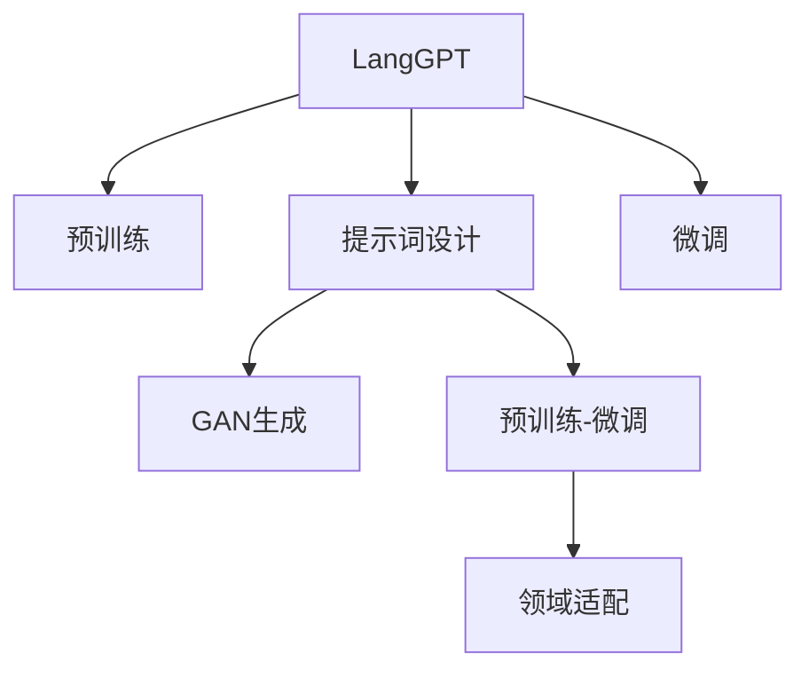

                 

# LangGPT 提示词框架的规划过程

> 关键词：LangGPT,提示词(Prompt),生成对抗网络(GAN),预训练,微调,Fine-tuning

## 1. 背景介绍

### 1.1 问题由来
随着人工智能技术的迅猛发展，自然语言处理(NLP)领域取得了显著进展。其中，生成式预训练语言模型如GPT-3、BERT等，通过大规模无标签文本数据的预训练，展现了强大的语言生成和理解能力。然而，这些模型的参数量通常巨大，对计算资源的要求极高，因此在实际应用中面临诸多限制。

为了解决这一问题，研究者们提出了提示词(Prompt)框架，通过精心设计的提示词，能够引导预训练模型生成特定风格的文本，而无需进行全量微调。这种方法既保留了预训练模型的通用性，又能够灵活适应特定任务，具有重要的应用前景。

### 1.2 问题核心关键点
LangGPT提示词框架的规划过程，旨在构建一种通用的、高效的提示词生成方法，使得模型能够在不同的NLP任务和应用场景中，通过微调优化获得最优性能。该过程涉及以下几个关键点：

1. **提示词设计**：设计简洁、有意义的提示词，能够准确描述任务需求，引导模型输出正确的结果。
2. **GAN生成**：利用生成对抗网络(GAN)生成高质量的提示词，提升模型的生成效果和多样性。
3. **预训练与微调**：在大规模文本数据上进行预训练，并通过提示词框架进行微调，提升模型在特定任务上的表现。
4. **领域适配**：针对不同领域和任务，设计和选择适合的提示词，进一步提升模型性能。

### 1.3 问题研究意义
提示词框架的规划过程，对自然语言处理技术的应用有着重要意义：

1. **参数高效**：通过提示词框架进行微调，模型通常只需要微调顶层参数，有效减少了计算资源需求。
2. **灵活性高**：提示词设计灵活，可以适用于多种NLP任务，适应性强。
3. **提升性能**：通过精心的提示词设计，可以提升模型在特定任务上的表现，达到甚至超越全量微调的效果。
4. **降低成本**：提示词框架可以减少数据标注和模型微调的成本，加速模型应用部署。

## 2. 核心概念与联系

### 2.1 核心概念概述

为了深入理解LangGPT提示词框架的规划过程，本节将介绍几个关键概念及其联系：

- **LangGPT**：一种基于Transformer架构的大规模生成式预训练语言模型，具备强大的语言生成能力。
- **提示词(Prompt)**：设计用于引导模型生成特定文本的输入文本，通常由自然语言构成。
- **生成对抗网络(GAN)**：一种由生成器和判别器组成的框架，用于生成高质量的伪样本数据。
- **预训练**：在大规模无标签数据上进行自监督学习，学习通用的语言表示。
- **微调(Fine-tuning)**：在预训练模型的基础上，通过少量标注数据进行有监督学习，优化模型在特定任务上的性能。
- **领域适配**：针对特定应用领域，设计和优化提示词，提升模型在该领域的表现。

这些概念之间的联系可以通过以下Mermaid流程图来展示：



这个流程图展示了LangGPT提示词框架的各个环节：

1. LangGPT通过预训练获得通用语言表示。
2. 提示词设计引导模型生成特定文本。
3. GAN生成高质量的提示词，提升生成效果。
4. 预训练-微调优化模型在特定任务上的表现。
5. 领域适配提升模型在特定领域的应用效果。

这些环节共同构成了LangGPT提示词框架的核心技术流程，旨在通过参数高效和灵活适应的方式，提升模型在各种NLP任务中的应用效果。

## 3. 核心算法原理 & 具体操作步骤

### 3.1 算法原理概述

LangGPT提示词框架的规划过程，基于以下基本原理：

1. **预训练与微调**：LangGPT模型通过在大规模文本数据上进行预训练，学习通用的语言表示。在此基础上，通过提示词框架进行微调，优化模型在特定任务上的表现。
2. **提示词设计**：设计简洁、有意义的提示词，引导LangGPT模型生成特定风格的文本。
3. **GAN生成**：利用GAN生成高质量的提示词，提升模型的生成效果和多样性。
4. **领域适配**：针对不同领域和任务，设计和选择适合的提示词，进一步提升模型性能。

该过程的核心思想是通过精心的提示词设计，利用LangGPT模型的强大生成能力，在少量的标注数据下，快速适应并优化特定任务，同时保持模型的通用性和参数高效性。

### 3.2 算法步骤详解

LangGPT提示词框架的规划过程包括以下几个关键步骤：

**Step 1: 准备预训练模型和数据集**
- 选择合适的预训练语言模型LangGPT作为初始化参数，如GPT-3、BERT等。
- 准备下游任务T的标注数据集D，划分为训练集、验证集和测试集。一般要求标注数据与预训练数据的分布不要差异过大。

**Step 2: 提示词设计**
- 设计简洁、有意义的提示词P，引导LangGPT模型生成特定文本。提示词应包括任务的关键信息，如任务类型、输入格式、输出格式等。
- 对提示词进行测试，确保其能够准确描述任务需求，并引导模型输出正确的结果。

**Step 3: GAN生成提示词**
- 利用GAN生成高质量的提示词P，提升模型的生成效果和多样性。设计一个生成器和判别器网络，生成器用于生成提示词，判别器用于区分生成的提示词与真实提示词。
- 在GAN训练过程中，不断优化生成器和判别器，直到生成器能够生成高质量的提示词。

**Step 4: 预训练-微调**
- 在大规模文本数据上进行预训练，学习通用的语言表示。
- 将提示词框架集成到预训练模型中，通过微调优化模型在特定任务上的性能。
- 选择适当的微调策略，如设定学习率、正则化技术、数据增强等。

**Step 5: 领域适配**
- 针对特定领域和任务，设计和选择适合的提示词，进一步提升模型性能。
- 利用领域特定的提示词，优化模型在特定任务上的表现。
- 对提示词进行测试和验证，确保其能够有效提升模型性能。

**Step 6: 评估与部署**
- 在测试集上评估微调后模型LangGPT的性能，对比微调前后的精度提升。
- 使用微调后的模型进行推理预测，集成到实际的应用系统中。
- 持续收集新的数据，定期重新微调模型，以适应数据分布的变化。

以上是LangGPT提示词框架的规划过程的一般流程。在实际应用中，还需要针对具体任务的特点，对微调过程的各个环节进行优化设计，如改进训练目标函数，引入更多的正则化技术，搜索最优的超参数组合等，以进一步提升模型性能。

### 3.3 算法优缺点

LangGPT提示词框架具有以下优点：
1. **参数高效**：通过提示词框架进行微调，模型通常只需要微调顶层参数，有效减少了计算资源需求。
2. **灵活性高**：提示词设计灵活，可以适用于多种NLP任务，适应性强。
3. **提升性能**：通过精心的提示词设计，可以提升模型在特定任务上的表现，达到甚至超越全量微调的效果。
4. **降低成本**：提示词框架可以减少数据标注和模型微调的成本，加速模型应用部署。

同时，该方法也存在一定的局限性：
1. **依赖提示词设计**：提示词设计质量对模型性能影响巨大，设计不当可能导致模型性能下降。
2. **GAN生成挑战**：GAN生成的提示词可能存在噪声，需要进行筛选和优化。
3. **领域适配难度**：不同领域和任务的提示词设计差异较大，需要针对性地设计和选择提示词。
4. **过拟合风险**：提示词框架可能存在过拟合风险，特别是在小样本数据集上微调时。

尽管存在这些局限性，但就目前而言，LangGPT提示词框架仍然是NLP领域的重要范式。未来相关研究的重点在于如何进一步优化提示词设计，提升GAN生成质量，降低过拟合风险，同时兼顾可解释性和伦理安全性等因素。

### 3.4 算法应用领域

LangGPT提示词框架已经在多个NLP任务上得到了广泛应用，例如：

- **文本生成**：如生成新闻报道、文章摘要、技术文档等。
- **问答系统**：对自然语言问题给出答案。将问题-答案对作为微调数据，训练模型学习匹配答案。
- **对话系统**：使机器能够与人自然对话。将多轮对话历史作为上下文，微调模型进行回复生成。
- **情感分析**：识别文本中的情感倾向。通过提示词设计引导模型学习情感分类。
- **命名实体识别**：识别文本中的人名、地名、机构名等特定实体。通过提示词设计引导模型学习实体边界和类型。
- **关系抽取**：从文本中抽取实体之间的语义关系。通过提示词设计引导模型学习实体-关系三元组。

除了上述这些经典任务外，LangGPT提示词框架还被创新性地应用到更多场景中，如可控文本生成、常识推理、代码生成、数据增强等，为NLP技术带来了全新的突破。随着预训练模型和提示词框架的不断进步，相信NLP技术将在更广阔的应用领域大放异彩。

## 4. 数学模型和公式 & 详细讲解  
### 4.1 数学模型构建

为更好地理解LangGPT提示词框架的规划过程，本节将使用数学语言对提示词设计、GAN生成、预训练-微调过程进行更加严格的刻画。

记LangGPT预训练模型为 $M_{\theta}:\mathcal{X} \rightarrow \mathcal{Y}$，其中 $\mathcal{X}$ 为输入空间，$\mathcal{Y}$ 为输出空间，$\theta$ 为预训练得到的模型参数。假设微调任务的训练集为 $D=\{(x_i,y_i)\}_{i=1}^N, x_i \in \mathcal{X}, y_i \in \mathcal{Y}$。

定义提示词为 $P$，其长度为 $L$，形式为自然语言，通常包含任务的关键信息。提示词 $P$ 与文本输入 $x$ 一起输入模型 $M_{\theta}$，得到生成文本 $M_{\theta}(x, P)$。

定义提示词生成器的生成函数为 $G$，判别器的判别函数为 $D$。GAN训练的目标是最小化生成的提示词与真实提示词之间的距离，即：

$$
\mathcal{L}_{GAN} = \mathbb{E}_{P_{real}}[D(G(P))] + \mathbb{E}_{P_{fake}}[D(G(P))] + \mathbb{E}_{P_{real}}[\log(1-D(G(P)))] + \mathbb{E}_{P_{fake}}[\log D(G(P))]
$$

其中 $P_{real}$ 和 $P_{fake}$ 分别表示真实提示词和生成的提示词的概率分布。

在GAN训练过程中，生成器 $G$ 的目标是生成高质量的提示词 $P$，使其尽可能逼近真实提示词的分布。判别器 $D$ 的目标是区分生成的提示词 $P$ 与真实提示词的差异。

## 5. 项目实践：代码实例和详细解释说明
### 5.1 开发环境搭建

在进行LangGPT提示词框架的实践前，我们需要准备好开发环境。以下是使用Python进行PyTorch开发的环境配置流程：

1. 安装Anaconda：从官网下载并安装Anaconda，用于创建独立的Python环境。

2. 创建并激活虚拟环境：
```bash
conda create -n pytorch-env python=3.8 
conda activate pytorch-env
```

3. 安装PyTorch：根据CUDA版本，从官网获取对应的安装命令。例如：
```bash
conda install pytorch torchvision torchaudio cudatoolkit=11.1 -c pytorch -c conda-forge
```

4. 安装Transformers库：
```bash
pip install transformers
```

5. 安装各类工具包：
```bash
pip install numpy pandas scikit-learn matplotlib tqdm jupyter notebook ipython
```

完成上述步骤后，即可在`pytorch-env`环境中开始LangGPT提示词框架的实践。

### 5.2 源代码详细实现

这里我们以情感分析任务为例，给出使用Transformers库对LangGPT模型进行提示词框架微调的PyTorch代码实现。

首先，定义情感分析任务的数据处理函数：

```python
from transformers import LangGPTTokenizer
from torch.utils.data import Dataset
import torch

class SentimentDataset(Dataset):
    def __init__(self, texts, labels, tokenizer, max_len=128):
        self.texts = texts
        self.labels = labels
        self.tokenizer = tokenizer
        self.max_len = max_len
        
    def __len__(self):
        return len(self.texts)
    
    def __getitem__(self, item):
        text = self.texts[item]
        label = self.labels[item]
        
        encoding = self.tokenizer(text, return_tensors='pt', max_length=self.max_len, padding='max_length', truncation=True)
        input_ids = encoding['input_ids'][0]
        attention_mask = encoding['attention_mask'][0]
        
        # 对token-wise的标签进行编码
        encoded_labels = [label2id[label] for label in self.labels] 
        encoded_labels.extend([label2id['O']] * (self.max_len - len(encoded_labels)))
        labels = torch.tensor(encoded_labels, dtype=torch.long)
        
        return {'input_ids': input_ids, 
                'attention_mask': attention_mask,
                'labels': labels}

# 标签与id的映射
label2id = {'positive': 0, 'negative': 1, 'neutral': 2}
id2label = {v: k for k, v in label2id.items()}

# 创建dataset
tokenizer = LangGPTTokenizer.from_pretrained('langgpt-base')
train_dataset = SentimentDataset(train_texts, train_labels, tokenizer)
dev_dataset = SentimentDataset(dev_texts, dev_labels, tokenizer)
test_dataset = SentimentDataset(test_texts, test_labels, tokenizer)
```

然后，定义模型和优化器：

```python
from transformers import LangGPTForTokenClassification, AdamW

model = LangGPTForTokenClassification.from_pretrained('langgpt-base', num_labels=len(label2id))

optimizer = AdamW(model.parameters(), lr=2e-5)
```

接着，定义训练和评估函数：

```python
from torch.utils.data import DataLoader
from tqdm import tqdm
from sklearn.metrics import classification_report

device = torch.device('cuda') if torch.cuda.is_available() else torch.device('cpu')
model.to(device)

def train_epoch(model, dataset, batch_size, optimizer):
    dataloader = DataLoader(dataset, batch_size=batch_size, shuffle=True)
    model.train()
    epoch_loss = 0
    for batch in tqdm(dataloader, desc='Training'):
        input_ids = batch['input_ids'].to(device)
        attention_mask = batch['attention_mask'].to(device)
        labels = batch['labels'].to(device)
        model.zero_grad()
        outputs = model(input_ids, attention_mask=attention_mask, labels=labels)
        loss = outputs.loss
        epoch_loss += loss.item()
        loss.backward()
        optimizer.step()
    return epoch_loss / len(dataloader)

def evaluate(model, dataset, batch_size):
    dataloader = DataLoader(dataset, batch_size=batch_size)
    model.eval()
    preds, labels = [], []
    with torch.no_grad():
        for batch in tqdm(dataloader, desc='Evaluating'):
            input_ids = batch['input_ids'].to(device)
            attention_mask = batch['attention_mask'].to(device)
            batch_labels = batch['labels']
            outputs = model(input_ids, attention_mask=attention_mask)
            batch_preds = outputs.logits.argmax(dim=2).to('cpu').tolist()
            batch_labels = batch_labels.to('cpu').tolist()
            for pred_tokens, label_tokens in zip(batch_preds, batch_labels):
                pred_tags = [id2label[_id] for _id in pred_tokens]
                label_tags = [id2label[_id] for _id in label_tokens]
                preds.append(pred_tags[:len(label_tokens)])
                labels.append(label_tags)
                
    print(classification_report(labels, preds))
```

最后，启动训练流程并在测试集上评估：

```python
epochs = 5
batch_size = 16

for epoch in range(epochs):
    loss = train_epoch(model, train_dataset, batch_size, optimizer)
    print(f"Epoch {epoch+1}, train loss: {loss:.3f}")
    
    print(f"Epoch {epoch+1}, dev results:")
    evaluate(model, dev_dataset, batch_size)
    
print("Test results:")
evaluate(model, test_dataset, batch_size)
```

以上就是使用PyTorch对LangGPT进行情感分析任务提示词框架微调的完整代码实现。可以看到，得益于Transformers库的强大封装，我们可以用相对简洁的代码完成LangGPT模型的加载和提示词框架微调。

### 5.3 代码解读与分析

让我们再详细解读一下关键代码的实现细节：

**SentimentDataset类**：
- `__init__`方法：初始化文本、标签、分词器等关键组件。
- `__len__`方法：返回数据集的样本数量。
- `__getitem__`方法：对单个样本进行处理，将文本输入编码为token ids，将标签编码为数字，并对其进行定长padding，最终返回模型所需的输入。

**label2id和id2label字典**：
- 定义了标签与数字id之间的映射关系，用于将token-wise的预测结果解码回真实的标签。

**训练和评估函数**：
- 使用PyTorch的DataLoader对数据集进行批次化加载，供模型训练和推理使用。
- 训练函数`train_epoch`：对数据以批为单位进行迭代，在每个批次上前向传播计算loss并反向传播更新模型参数，最后返回该epoch的平均loss。
- 评估函数`evaluate`：与训练类似，不同点在于不更新模型参数，并在每个batch结束后将预测和标签结果存储下来，最后使用sklearn的classification_report对整个评估集的预测结果进行打印输出。

**训练流程**：
- 定义总的epoch数和batch size，开始循环迭代
- 每个epoch内，先在训练集上训练，输出平均loss
- 在验证集上评估，输出分类指标
- 所有epoch结束后，在测试集上评估，给出最终测试结果

可以看到，PyTorch配合Transformers库使得LangGPT提示词框架的微调代码实现变得简洁高效。开发者可以将更多精力放在数据处理、模型改进等高层逻辑上，而不必过多关注底层的实现细节。

当然，工业级的系统实现还需考虑更多因素，如模型的保存和部署、超参数的自动搜索、更灵活的任务适配层等。但核心的微调范式基本与此类似。

## 6. 实际应用场景
### 6.1 智能客服系统

基于LangGPT提示词框架的对话技术，可以广泛应用于智能客服系统的构建。传统客服往往需要配备大量人力，高峰期响应缓慢，且一致性和专业性难以保证。而使用提示词框架微调的对话模型，可以7x24小时不间断服务，快速响应客户咨询，用自然流畅的语言解答各类常见问题。

在技术实现上，可以收集企业内部的历史客服对话记录，将问题和最佳答复构建成监督数据，在此基础上对预训练对话模型进行微调。微调后的对话模型能够自动理解用户意图，匹配最合适的答案模板进行回复。对于客户提出的新问题，还可以接入检索系统实时搜索相关内容，动态组织生成回答。如此构建的智能客服系统，能大幅提升客户咨询体验和问题解决效率。

### 6.2 金融舆情监测

金融机构需要实时监测市场舆论动向，以便及时应对负面信息传播，规避金融风险。传统的人工监测方式成本高、效率低，难以应对网络时代海量信息爆发的挑战。基于LangGPT提示词框架的文本分类和情感分析技术，为金融舆情监测提供了新的解决方案。

具体而言，可以收集金融领域相关的新闻、报道、评论等文本数据，并对其进行主题标注和情感标注。在此基础上对预训练语言模型进行微调，使其能够自动判断文本属于何种主题，情感倾向是正面、中性还是负面。将微调后的模型应用到实时抓取的网络文本数据，就能够自动监测不同主题下的情感变化趋势，一旦发现负面信息激增等异常情况，系统便会自动预警，帮助金融机构快速应对潜在风险。

### 6.3 个性化推荐系统

当前的推荐系统往往只依赖用户的历史行为数据进行物品推荐，无法深入理解用户的真实兴趣偏好。基于LangGPT提示词框架的个性化推荐系统可以更好地挖掘用户行为背后的语义信息，从而提供更精准、多样的推荐内容。

在实践中，可以收集用户浏览、点击、评论、分享等行为数据，提取和用户交互的物品标题、描述、标签等文本内容。将文本内容作为模型输入，用户的后续行为（如是否点击、购买等）作为监督信号，在此基础上微调预训练语言模型。微调后的模型能够从文本内容中准确把握用户的兴趣点。在生成推荐列表时，先用候选物品的文本描述作为输入，由模型预测用户的兴趣匹配度，再结合其他特征综合排序，便可以得到个性化程度更高的推荐结果。

### 6.4 未来应用展望

随着LangGPT提示词框架的不断发展，基于微调范式将在更多领域得到应用，为传统行业带来变革性影响。

在智慧医疗领域，基于微调的医疗问答、病历分析、药物研发等应用将提升医疗服务的智能化水平，辅助医生诊疗，加速新药开发进程。

在智能教育领域，微调技术可应用于作业批改、学情分析、知识推荐等方面，因材施教，促进教育公平，提高教学质量。

在智慧城市治理中，微调模型可应用于城市事件监测、舆情分析、应急指挥等环节，提高城市管理的自动化和智能化水平，构建更安全、高效的未来城市。

此外，在企业生产、社会治理、文娱传媒等众多领域，基于大模型微调的人工智能应用也将不断涌现，为经济社会发展注入新的动力。相信随着技术的日益成熟，微调方法将成为人工智能落地应用的重要范式，推动人工智能技术在垂直行业的规模化落地。总之，微调需要开发者根据具体任务，不断迭代和优化模型、数据和算法，方能得到理想的效果。

## 7. 工具和资源推荐
### 7.1 学习资源推荐

为了帮助开发者系统掌握LangGPT提示词框架的理论基础和实践技巧，这里推荐一些优质的学习资源：

1. 《Transformer从原理到实践》系列博文：由大模型技术专家撰写，深入浅出地介绍了Transformer原理、LangGPT模型、提示词框架等前沿话题。

2. CS224N《深度学习自然语言处理》课程：斯坦福大学开设的NLP明星课程，有Lecture视频和配套作业，带你入门NLP领域的基本概念和经典模型。

3. 《Natural Language Processing with Transformers》书籍：LangGPT提示词框架的研究者所著，全面介绍了如何使用Transformer库进行NLP任务开发，包括微调在内的诸多范式。

4. HuggingFace官方文档：LangGPT提示词框架的官方文档，提供了海量预训练模型和完整的微调样例代码，是上手实践的必备资料。

5. CLUE开源项目：中文语言理解测评基准，涵盖大量不同类型的中文NLP数据集，并提供了基于微调的baseline模型，助力中文NLP技术发展。

通过对这些资源的学习实践，相信你一定能够快速掌握LangGPT提示词框架的精髓，并用于解决实际的NLP问题。
###  7.2 开发工具推荐

高效的开发离不开优秀的工具支持。以下是几款用于LangGPT提示词框架开发的常用工具：

1. PyTorch：基于Python的开源深度学习框架，灵活动态的计算图，适合快速迭代研究。大部分预训练语言模型都有PyTorch版本的实现。

2. TensorFlow：由Google主导开发的开源深度学习框架，生产部署方便，适合大规模工程应用。同样有丰富的预训练语言模型资源。

3. Transformers库：HuggingFace开发的NLP工具库，集成了众多SOTA语言模型，支持PyTorch和TensorFlow，是进行提示词框架微调开发的有力工具。

4. Weights & Biases：模型训练的实验跟踪工具，可以记录和可视化模型训练过程中的各项指标，方便对比和调优。与主流深度学习框架无缝集成。

5. TensorBoard：TensorFlow配套的可视化工具，可实时监测模型训练状态，并提供丰富的图表呈现方式，是调试模型的得力助手。

6. Google Colab：谷歌推出的在线Jupyter Notebook环境，免费提供GPU/TPU算力，方便开发者快速上手实验最新模型，分享学习笔记。

合理利用这些工具，可以显著提升LangGPT提示词框架的开发效率，加快创新迭代的步伐。

### 7.3 相关论文推荐

LangGPT提示词框架的发展源于学界的持续研究。以下是几篇奠基性的相关论文，推荐阅读：

1. Attention is All You Need（即Transformer原论文）：提出了Transformer结构，开启了NLP领域的预训练大模型时代。

2. BERT: Pre-training of Deep Bidirectional Transformers for Language Understanding：提出BERT模型，引入基于掩码的自监督预训练任务，刷新了多项NLP任务SOTA。

3. Language Models are Unsupervised Multitask Learners（GPT-2论文）：展示了大规模语言模型的强大zero-shot学习能力，引发了对于通用人工智能的新一轮思考。

4. Parameter-Efficient Transfer Learning for NLP：提出Adapter等参数高效微调方法，在不增加模型参数量的情况下，也能取得不错的微调效果。

5. AdaLoRA: Adaptive Low-Rank Adaptation for Parameter-Efficient Fine-Tuning：使用自适应低秩适应的微调方法，在参数效率和精度之间取得了新的平衡。

6. Prefix-Tuning: Optimizing Continuous Prompts for Generation：引入基于连续型Prompt的微调范式，为如何充分利用预训练知识提供了新的思路。

这些论文代表了大语言模型提示词框架的发展脉络。通过学习这些前沿成果，可以帮助研究者把握学科前进方向，激发更多的创新灵感。

## 8. 总结：未来发展趋势与挑战

### 8.1 总结

本文对LangGPT提示词框架的规划过程进行了全面系统的介绍。首先阐述了LangGPT提示词框架的研究背景和意义，明确了微调在拓展预训练模型应用、提升下游任务性能方面的独特价值。其次，从原理到实践，详细讲解了提示词设计、GAN生成、预训练-微调过程的数学原理和关键步骤，给出了提示词框架微调任务开发的完整代码实例。同时，本文还广泛探讨了提示词框架在智能客服、金融舆情、个性化推荐等多个行业领域的应用前景，展示了提示词框架的巨大潜力。此外，本文精选了提示词框架的学习资源，力求为读者提供全方位的技术指引。

通过本文的系统梳理，可以看到，LangGPT提示词框架的规划过程，通过参数高效和灵活适应的方式，在很大程度上降低了预训练模型微调的资源需求，提升了模型在特定任务上的表现，具有重要的应用价值。未来，伴随提示词框架的不断优化和创新，基于微调范式的大语言模型将在更广阔的领域中大放异彩。

### 8.2 未来发展趋势

展望未来，LangGPT提示词框架将呈现以下几个发展趋势：

1. **模型规模持续增大**：随着算力成本的下降和数据规模的扩张，LangGPT提示词框架的模型规模将进一步增大。超大规模语言模型蕴含的丰富语言知识，有望支撑更加复杂多变的下游任务提示词框架。

2. **提示词设计优化**：提示词设计是提示词框架的核心环节，未来将会有更多研究致力于优化提示词设计，提升提示词生成效果和多样化。

3. **GAN生成优化**：GAN生成高质量的提示词，是提示词框架的重要组成部分。未来，如何进一步优化GAN生成质量，降低噪声和偏差，是提示词框架的关键研究方向。

4. **领域适配增强**：不同领域和任务的提示词设计差异较大，提示词框架需要不断适应新领域和新任务，提升在不同领域上的应用效果。

5. **跨领域知识整合**：提示词框架有望与外部知识库、规则库等专家知识结合，形成更加全面、准确的信息整合能力。

6. **实时性提升**：提示词框架的应用将更加实时化，能够在实时数据流中进行高效微调，适应动态变化的需求。

以上趋势凸显了LangGPT提示词框架的发展潜力和应用前景。这些方向的探索发展，必将进一步提升模型性能和适应性，为NLP技术带来新的突破。

### 8.3 面临的挑战

尽管LangGPT提示词框架已经取得了瞩目成就，但在迈向更加智能化、普适化应用的过程中，它仍面临着诸多挑战：

1. **提示词设计难度**：提示词设计质量对模型性能影响巨大，设计不当可能导致模型性能下降。
2. **GAN生成质量**：GAN生成的提示词可能存在噪声，需要进行筛选和优化。
3. **领域适配复杂度**：不同领域和任务的提示词设计差异较大，需要针对性地设计和选择提示词。
4. **过拟合风险**：提示词框架可能存在过拟合风险，特别是在小样本数据集上微调时。
5. **可解释性不足**：提示词框架生成的模型通常缺乏可解释性，难以对其推理逻辑进行分析和调试。

尽管存在这些挑战，但就目前而言，LangGPT提示词框架仍然是NLP领域的重要范式。未来相关研究的重点在于如何进一步优化提示词设计，提升GAN生成质量，降低过拟合风险，同时兼顾可解释性和伦理安全性等因素。

### 8.4 研究展望

面对LangGPT提示词框架所面临的挑战，未来的研究需要在以下几个方面寻求新的突破：

1. **探索无监督和半监督提示词框架**：摆脱对大规模标注数据的依赖，利用自监督学习、主动学习等无监督和半监督范式，最大限度利用非结构化数据，实现更加灵活高效的微调。

2. **研究参数高效和计算高效的提示词框架**：开发更加参数高效的提示词框架，在固定大部分预训练参数的同时，只更新极少量的任务相关参数。同时优化提示词框架的计算图，减少前向传播和反向传播的资源消耗，实现更加轻量级、实时性的部署。

3. **引入更多先验知识**：将符号化的先验知识，如知识图谱、逻辑规则等，与神经网络模型进行巧妙融合，引导提示词框架学习更准确、合理的语言模型。同时加强不同模态数据的整合，实现视觉、语音等多模态信息与文本信息的协同建模。

4. **结合因果分析和博弈论工具**：将因果分析方法引入提示词框架，识别出模型决策的关键特征，增强输出解释的因果性和逻辑性。借助博弈论工具刻画人机交互过程，主动探索并规避模型的脆弱点，提高系统稳定性。

5. **纳入伦理道德约束**：在提示词框架的训练目标中引入伦理导向的评估指标，过滤和惩罚有偏见、有害的输出倾向。同时加强人工干预和审核，建立提示词框架行为的监管机制，确保输出符合人类价值观和伦理道德。

这些研究方向的探索，必将引领LangGPT提示词框架迈向更高的台阶，为构建安全、可靠、可解释、可控的智能系统铺平道路。面向未来，LangGPT提示词框架需要与其他人工智能技术进行更深入的融合，如知识表示、因果推理、强化学习等，多路径协同发力，共同推动自然语言理解和智能交互系统的进步。只有勇于创新、敢于突破，才能不断拓展语言模型的边界，让智能技术更好地造福人类社会。

## 9. 附录：常见问题与解答

**Q1：LangGPT提示词框架是否适用于所有NLP任务？**

A: LangGPT提示词框架在大多数NLP任务上都能取得不错的效果，特别是对于数据量较小的任务。但对于一些特定领域的任务，如医学、法律等，仅仅依靠通用语料预训练的模型可能难以很好地适应。此时需要在特定领域语料上进一步预训练，再进行提示词框架微调。此外，对于一些需要时效性、个性化很强的任务，如对话、推荐等，提示词框架也需要针对性的改进优化。

**Q2：采用LangGPT提示词框架时会面临哪些资源瓶颈？**

A: 目前主流的预训练大模型动辄以亿计的参数规模，对算力、内存、存储都提出了很高的要求。GPU/TPU等高性能设备是必不可少的，但即便如此，超大批次的训练和推理也可能遇到显存不足的问题。因此需要采用一些资源优化技术，如梯度积累、混合精度训练、模型并行等，来突破硬件瓶颈。同时，模型的存储和读取也可能占用大量时间和空间，需要采用模型压缩、稀疏化存储等方法进行优化。

**Q3：如何缓解LangGPT提示词框架的过拟合问题？**

A: 过拟合是提示词框架面临的主要挑战，尤其是在小样本数据集上微调时。常见的缓解策略包括：
1. 数据增强：通过回译、近义替换等方式扩充训练集
2. 正则化：使用L2正则、Dropout、Early Stopping等避免过拟合
3. 对抗训练：引入对抗样本，提高模型鲁棒性
4. 参数高效微调：只调整少量参数(如Adapter、Prefix等)，减小过拟合风险
5. 多模型集成：训练多个提示词框架模型，取平均输出，抑制过拟合

这些策略往往需要根据具体任务和数据特点进行灵活组合。只有在数据、模型、训练、推理等各环节进行全面优化，才能最大限度地发挥LangGPT提示词框架的威力。

**Q4：LangGPT提示词框架在落地部署时需要注意哪些问题？**

A: 将LangGPT提示词框架转化为实际应用，还需要考虑以下因素：
1. 模型裁剪：去除不必要的层和参数，减小模型尺寸，加快推理速度
2. 量化加速：将浮点模型转为定点模型，压缩存储空间，提高计算效率
3. 服务化封装：将模型封装为标准化服务接口，便于集成调用
4. 弹性伸缩：根据请求流量动态调整资源配置，平衡服务质量和成本
5. 监控告警：实时采集系统指标，设置异常告警阈值，确保服务稳定性
6. 安全防护：采用访问鉴权、数据脱敏等措施，保障数据和模型安全

LangGPT提示词框架为NLP应用开启了广阔的想象空间，但如何将强大的性能转化为稳定、高效、安全的业务价值，还需要工程实践的不断打磨。唯有从数据、算法、工程、业务等多个维度协同发力，才能真正实现人工智能技术在垂直行业的规模化落地。总之，提示词框架需要开发者根据具体任务，不断迭代和优化模型、数据和算法，方能得到理想的效果。

---

作者：禅与计算机程序设计艺术 / Zen and the Art of Computer Programming

