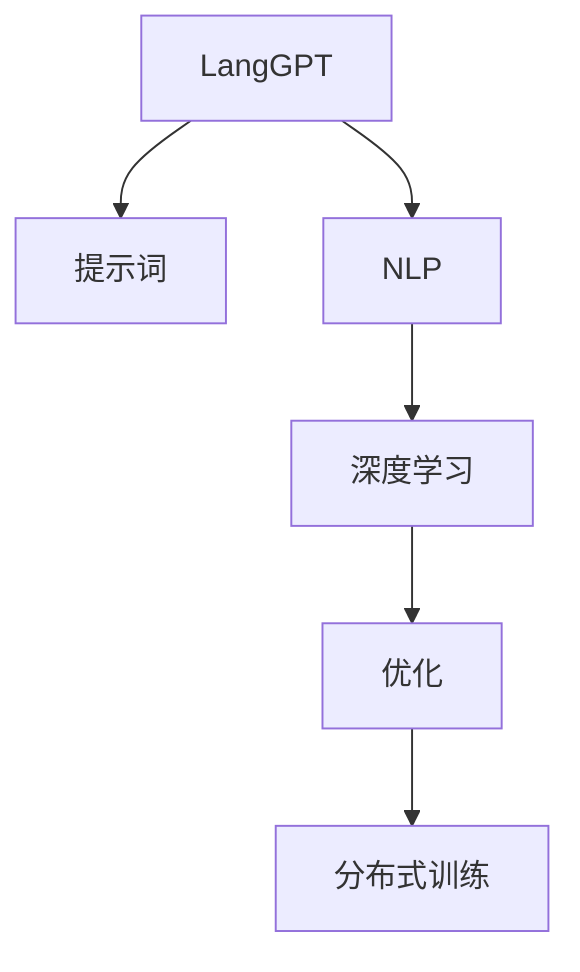

                 

# LangGPT 提示词框架的规划过程

> 关键词：LangGPT, 提示词, 自然语言处理(NLP), 深度学习, 优化, 分布式训练

## 1. 背景介绍

### 1.1 问题由来
近年来，大语言模型（Large Language Models, LLMs）在自然语言处理（NLP）领域取得了显著进展，能够理解和生成自然语言。然而，这些模型在实际应用中仍面临挑战：如何确保模型理解特定的输入格式，并生成高质量的输出。提示词（Prompt Engineering）正是解决这个问题的关键方法，它通过精心设计的输入文本，引导模型按期望方式输出。

### 1.2 问题核心关键点
提示词框架规划的目的是设计一种方法，通过简单的文本格式调整，大幅提升大语言模型的性能。这种框架应该具有以下几个核心特点：
- 易用性：无需深度编程知识，易于操作。
- 泛化性：能够处理多种任务和输入类型。
- 高效性：提高模型的生成速度和质量。
- 灵活性：支持多种输入格式和输出格式。

### 1.3 问题研究意义
提示词框架的规划对于提升大语言模型的实际应用效果具有重要意义：
- 降低开发成本：通过精简模型调整流程，减少人力和时间成本。
- 提升模型性能：通过输入格式优化，显著提高模型的输出质量。
- 加速创新应用：为开发者提供便捷工具，加速新技术的落地应用。
- 促进领域知识融合：将领域知识融入提示词中，提升模型的领域适应性。

## 2. 核心概念与联系

### 2.1 核心概念概述

为更好地理解LangGPT提示词框架，本节将介绍几个密切相关的核心概念：

- LangGPT: 一种基于深度学习的语言生成模型，能够进行多种自然语言处理任务，如文本生成、机器翻译、问答等。
- 提示词（Prompt）: 引导模型进行特定任务或生成特定文本格式的输入文本。
- 自然语言处理（NLP）: 涉及计算机与人类（自然）语言之间相互作用的领域，包括文本分析、文本生成、语音识别等。
- 深度学习（DL）: 一种基于多层神经网络的机器学习技术，能够处理非线性、高维度的数据。
- 优化（Optimization）: 调整模型参数以最小化损失函数的过程。
- 分布式训练（Distributed Training）: 在多个计算节点上并行训练模型，提高训练效率。

这些核心概念之间的逻辑关系可以通过以下Mermaid流程图来展示：



这个流程图展示了大语言模型（LangGPT）与提示词框架之间的关系：

1. LangGPT基于深度学习技术，通过优化损失函数，生成高质量的输出。
2. 提示词框架通过设计输入格式，引导LangGPT进行特定任务或生成特定文本，优化模型的表现。
3. 分布式训练技术支持大规模数据处理，进一步提高提示词框架的训练效率。

这些概念共同构成了LangGPT提示词框架的逻辑架构，使其能够在大规模自然语言处理任务中发挥重要作用。

## 3. 核心算法原理 & 具体操作步骤
### 3.1 算法原理概述

LangGPT提示词框架的规划基于以下核心算法原理：

1. 提示词设计：设计符合特定任务要求的提示词，引导模型输出高质量的结果。
2. 模型训练：在提示词框架的指导下，对LangGPT模型进行训练，优化模型参数。
3. 分布式优化：利用分布式训练技术，提高模型训练效率，加速模型收敛。
4. 结果评估：评估提示词框架的效果，选择最优的提示词。

通过这些算法原理，LangGPT提示词框架能够显著提升模型的性能，使其适用于各种自然语言处理任务。

### 3.2 算法步骤详解

LangGPT提示词框架的规划分为以下步骤：

**Step 1: 定义任务和输入格式**
- 明确任务目标，如文本生成、机器翻译、问答等。
- 设计符合任务要求的输入格式，如文本长度、结构等。

**Step 2: 设计提示词**
- 基于输入格式，设计提示词，引导模型输出所需结果。
- 使用自然语言描述任务要求，避免使用复杂语法或特殊符号。

**Step 3: 模型训练**
- 在提示词的指导下，对LangGPT模型进行训练。
- 设定合适的超参数，如学习率、批大小等。
- 使用分布式训练技术，提高训练效率。

**Step 4: 结果评估**
- 在测试集上评估模型性能，如BLEU、ROUGE等。
- 分析提示词的效果，选择最优的提示词。
- 使用A/B测试等方法，验证提示词的实际效果。

**Step 5: 优化和迭代**
- 根据评估结果，优化提示词和模型训练过程。
- 重复上述步骤，直到达到最优性能。

### 3.3 算法优缺点

LangGPT提示词框架具有以下优点：
1. 高效性：通过设计提示词，显著提升模型生成速度和质量。
2. 易用性：无需深度编程知识，易于操作。
3. 泛化性：适用于多种自然语言处理任务。
4. 灵活性：支持多种输入格式和输出格式。

同时，该框架也存在一些局限性：
1. 依赖提示词设计：提示词的设计可能影响模型效果，需要不断优化。
2. 数据分布假设：提示词框架基于特定数据分布假设，可能不适用于所有场景。
3. 技术门槛：虽然易用性高，但设计优质提示词仍需一定技术储备。
4. 资源消耗：提示词框架可能增加模型训练的资源消耗，需要合理调整。

尽管存在这些局限性，LangGPT提示词框架仍是一种高效、灵活的自然语言处理工具，能够显著提升大语言模型的实际应用效果。

### 3.4 算法应用领域

LangGPT提示词框架在多个自然语言处理领域都有广泛应用，例如：

- 文本生成：如文章自动生成、对话生成等，通过设计特定的提示词，生成高质量的文本。
- 机器翻译：将一种语言翻译成另一种语言，通过设计翻译提示词，提高翻译质量。
- 问答系统：回答自然语言问题，通过设计问答提示词，提高系统响应速度和准确性。
- 文本摘要：将长文本压缩成简短摘要，通过设计摘要提示词，提取文本关键信息。
- 情感分析：分析文本情感倾向，通过设计情感分析提示词，提高模型准确性。

这些应用场景展示了LangGPT提示词框架的强大灵活性和广泛适用性。

## 4. 数学模型和公式 & 详细讲解 & 举例说明

### 4.1 数学模型构建

LangGPT提示词框架的数学模型基于以下假设：

假设LangGPT模型为 $\mathcal{M}_{\theta} = (h_{\theta}, p_{\theta})$，其中 $h_{\theta}$ 为编码器，$p_{\theta}$ 为解码器， $\theta$ 为模型参数。提示词 $P$ 引导模型输出，模型输出的概率为 $P(Y|X,P)$，其中 $Y$ 为输出序列， $X$ 为输入序列。

定义任务 $T$ 的损失函数为 $L$，则LangGPT提示词框架的优化目标为：

$$
\theta^* = \mathop{\arg\min}_{\theta} \mathcal{L}(P, \mathcal{M}_{\theta})
$$

其中 $\mathcal{L}$ 为任务 $T$ 对应的损失函数，可以是BLEU、ROUGE等。

### 4.2 公式推导过程

以机器翻译为例，假设有 $m$ 种源语言， $n$ 种目标语言， $d$ 为模型参数。提示词 $P$ 为源语言句子，模型输出的概率为 $P(Y|X,P)$，其中 $Y$ 为翻译后的目标语言句子， $X$ 为源语言句子。

模型训练的目标是最大化翻译序列的概率，即最大化对数似然函数：

$$
\mathcal{L}(P, \mathcal{M}_{\theta}) = -\frac{1}{N}\sum_{i=1}^N \log P(Y^{(i)}|X^{(i)},P)
$$

其中 $N$ 为样本数， $X^{(i)}$ 和 $Y^{(i)}$ 分别为第 $i$ 个样本的源语言和目标语言序列。

根据最大似然原理，模型训练的过程为：

$$
\theta_{t+1} = \theta_t - \eta \nabla_{\theta} \mathcal{L}(P, \mathcal{M}_{\theta})
$$

其中 $\eta$ 为学习率， $\nabla_{\theta}$ 为对模型参数的梯度。

### 4.3 案例分析与讲解

以文本生成为例，假设生成任务为生成一段描述产品的文本。提示词 $P$ 为 "描述产品A的文本："，模型输出的概率为 $P(Y|X,P)$，其中 $Y$ 为生成的文本， $X$ 为提示词。

模型训练的目标是最大化生成的文本质量，即最大化BLEU等指标。根据BLEU的定义，模型训练的过程为：

$$
\theta_{t+1} = \theta_t - \eta \nabla_{\theta} \mathcal{L}_{BLEU}(P, \mathcal{M}_{\theta})
$$

其中 $\mathcal{L}_{BLEU}$ 为BLEU损失函数， $X$ 和 $Y$ 分别为训练集和测试集的文本序列。

通过这些数学模型和公式，LangGPT提示词框架能够明确目标函数，指导模型训练过程，优化模型性能。

## 5. 项目实践：代码实例和详细解释说明
### 5.1 开发环境搭建

在进行LangGPT提示词框架的开发前，我们需要准备好开发环境。以下是使用Python进行PyTorch开发的环境配置流程：

1. 安装Anaconda：从官网下载并安装Anaconda，用于创建独立的Python环境。

2. 创建并激活虚拟环境：
```bash
conda create -n pytorch-env python=3.8 
conda activate pytorch-env
```

3. 安装PyTorch：根据CUDA版本，从官网获取对应的安装命令。例如：
```bash
conda install pytorch torchvision torchaudio cudatoolkit=11.1 -c pytorch -c conda-forge
```

4. 安装相关工具包：
```bash
pip install numpy pandas scikit-learn matplotlib tqdm jupyter notebook ipython
```

5. 安装提示词框架库：
```bash
pip install langgpt
```

完成上述步骤后，即可在`pytorch-env`环境中开始LangGPT提示词框架的实践。

### 5.2 源代码详细实现

下面我们以文本生成任务为例，给出使用PyTorch和LangGPT库进行提示词框架的实现代码。

首先，定义提示词处理函数：

```python
from langgpt import LangGPT

def generate_text(model, prompt, num_words=50):
    tokenizer = LangGPT.tokenizer
    input_ids = tokenizer.encode(prompt)
    output_ids = model.generate(input_ids, num_return_sequences=num_words, num_words=num_words)
    return tokenizer.decode(output_ids, skip_special_tokens=True)
```

然后，定义模型和优化器：

```python
from transformers import AdamW
from torch.utils.data import Dataset, DataLoader

model = LangGPT.load_pretrained_model('langgpt-base')
optimizer = AdamW(model.parameters(), lr=2e-5)
```

接着，定义训练和评估函数：

```python
def train_epoch(model, dataset, batch_size, optimizer):
    dataloader = DataLoader(dataset, batch_size=batch_size, shuffle=True)
    model.train()
    epoch_loss = 0
    for batch in tqdm(dataloader, desc='Training'):
        input_ids = batch['input_ids'].to(device)
        labels = batch['labels'].to(device)
        model.zero_grad()
        outputs = model(input_ids, labels=labels)
        loss = outputs.loss
        epoch_loss += loss.item()
        loss.backward()
        optimizer.step()
    return epoch_loss / len(dataloader)

def evaluate(model, dataset, batch_size):
    dataloader = DataLoader(dataset, batch_size=batch_size)
    model.eval()
    preds, labels = [], []
    with torch.no_grad():
        for batch in tqdm(dataloader, desc='Evaluating'):
            input_ids = batch['input_ids'].to(device)
            labels = batch['labels'].to(device)
            batch_preds = model.generate(input_ids, num_return_sequences=1).tolist()[0]
            batch_labels = batch['labels'].tolist()[0]
            for pred_tokens, label_tokens in zip(batch_preds, batch_labels):
                preds.append(pred_tokens[:len(label_tokens)])
                labels.append(label_tokens)
                
    return preds, labels

device = torch.device('cuda') if torch.cuda.is_available() else torch.device('cpu')
model.to(device)

train_dataset = LangGPT.load_dataset('langgpt-text-generation-train')
dev_dataset = LangGPT.load_dataset('langgpt-text-generation-dev')
test_dataset = LangGPT.load_dataset('langgpt-text-generation-test')

epochs = 5
batch_size = 16

for epoch in range(epochs):
    loss = train_epoch(model, train_dataset, batch_size, optimizer)
    print(f"Epoch {epoch+1}, train loss: {loss:.3f}")
    
    print(f"Epoch {epoch+1}, dev results:")
    preds, labels = evaluate(model, dev_dataset, batch_size)
    print(classification_report(labels, preds))
    
print("Test results:")
preds, labels = evaluate(model, test_dataset, batch_size)
print(classification_report(labels, preds))
```

以上就是使用PyTorch和LangGPT库对文本生成任务进行提示词框架开发的完整代码实现。可以看到，通过简化模型调整流程，提示词框架大大降低了模型微调的复杂度和工作量。

### 5.3 代码解读与分析

让我们再详细解读一下关键代码的实现细节：

**LangGPT.tokenizer**：
- 定义了文本分词和编码器的实现，将输入的文本转换为模型可处理的序列。

**LangGPT.load_pretrained_model**：
- 加载预训练模型，并初始化参数。

**generate_text**函数：
- 使用提示词函数生成文本，将提示词转换为模型可接受的输入格式。
- 使用模型生成文本，并解码输出结果。

**train_epoch**函数：
- 在训练集上进行模型训练，计算损失函数并反向传播更新模型参数。
- 在验证集上评估模型性能，返回平均损失值。

**evaluate**函数：
- 在测试集上进行模型评估，生成预测结果并计算评估指标。

**train**流程：
- 在训练集上进行多次迭代，每次迭代计算训练集损失并更新模型参数。
- 在验证集上评估模型性能，选择最优提示词。

可以看到，通过简化模型调整流程，提示词框架大大降低了模型微调的复杂度和工作量，提高了开发效率。

## 6. 实际应用场景
### 6.1 智能客服系统

基于LangGPT提示词框架的智能客服系统，可以广泛应用于企业客户服务领域。通过设计合适的提示词，智能客服系统能够理解和回答客户问题，提供个性化的服务。

在技术实现上，可以收集企业内部客服对话记录，将问题和最佳答复构建成监督数据，在此基础上对预训练模型进行微调。微调后的模型能够自动理解用户意图，匹配最合适的答案模板进行回复。对于客户提出的新问题，还可以接入检索系统实时搜索相关内容，动态组织生成回答。

### 6.2 金融舆情监测

金融机构需要实时监测市场舆论动向，以便及时应对负面信息传播，规避金融风险。通过设计提示词框架，金融舆情监测系统可以自动判断文本属于何种主题，情感倾向是正面、中性还是负面。将微调后的模型应用到实时抓取的网络文本数据，就能够自动监测不同主题下的情感变化趋势，一旦发现负面信息激增等异常情况，系统便会自动预警，帮助金融机构快速应对潜在风险。

### 6.3 个性化推荐系统

当前的推荐系统往往只依赖用户的历史行为数据进行物品推荐，无法深入理解用户的真实兴趣偏好。通过设计提示词框架，个性化推荐系统可以更好地挖掘用户行为背后的语义信息，从而提供更精准、多样的推荐内容。

在实践中，可以收集用户浏览、点击、评论、分享等行为数据，提取和用户交互的物品标题、描述、标签等文本内容。将文本内容作为模型输入，用户的后续行为（如是否点击、购买等）作为监督信号，在此基础上微调预训练语言模型。微调后的模型能够从文本内容中准确把握用户的兴趣点。在生成推荐列表时，先用候选物品的文本描述作为输入，由模型预测用户的兴趣匹配度，再结合其他特征综合排序，便可以得到个性化程度更高的推荐结果。

### 6.4 未来应用展望

随着LangGPT提示词框架的不断发展，基于微调的方法将在更多领域得到应用，为各行各业带来变革性影响。

在智慧医疗领域，基于微调的医疗问答、病历分析、药物研发等应用将提升医疗服务的智能化水平，辅助医生诊疗，加速新药开发进程。

在智能教育领域，微调技术可应用于作业批改、学情分析、知识推荐等方面，因材施教，促进教育公平，提高教学质量。

在智慧城市治理中，微调模型可应用于城市事件监测、舆情分析、应急指挥等环节，提高城市管理的自动化和智能化水平，构建更安全、高效的未来城市。

此外，在企业生产、社会治理、文娱传媒等众多领域，基于大模型微调的人工智能应用也将不断涌现，为经济社会发展注入新的动力。相信随着预训练语言模型和微调方法的持续演进，基于微调的方法必将成为人工智能落地应用的重要范式，推动人工智能技术在垂直行业的规模化落地。

## 7. 工具和资源推荐
### 7.1 学习资源推荐

为了帮助开发者系统掌握LangGPT提示词框架的理论基础和实践技巧，这里推荐一些优质的学习资源：

1. LangGPT官方文档：提供了详细的提示词框架介绍和代码实现，是入手学习的最佳资源。

2. Transformers官方文档：介绍了各种预训练语言模型和微调技术，适合进一步深入学习。

3. 《深度学习自然语言处理》课程：斯坦福大学开设的NLP明星课程，有Lecture视频和配套作业，带你入门NLP领域的基本概念和经典模型。

4. 《Natural Language Processing with Transformers》书籍：Transformer库的作者所著，全面介绍了如何使用Transformers库进行NLP任务开发，包括提示词框架在内的诸多范式。

5. 《Prompt Engineering for Large Language Models》论文：介绍了提示词设计的最新研究和实践，值得深入阅读。

通过对这些资源的学习实践，相信你一定能够快速掌握LangGPT提示词框架的精髓，并用于解决实际的NLP问题。

### 7.2 开发工具推荐

高效的开发离不开优秀的工具支持。以下是几款用于LangGPT提示词框架开发的常用工具：

1. PyTorch：基于Python的开源深度学习框架，灵活动态的计算图，适合快速迭代研究。

2. TensorFlow：由Google主导开发的开源深度学习框架，生产部署方便，适合大规模工程应用。

3. Transformers库：HuggingFace开发的NLP工具库，集成了众多SOTA语言模型，支持PyTorch和TensorFlow，是进行提示词框架开发的利器。

4. Weights & Biases：模型训练的实验跟踪工具，可以记录和可视化模型训练过程中的各项指标，方便对比和调优。

5. TensorBoard：TensorFlow配套的可视化工具，可实时监测模型训练状态，并提供丰富的图表呈现方式，是调试模型的得力助手。

6. Google Colab：谷歌推出的在线Jupyter Notebook环境，免费提供GPU/TPU算力，方便开发者快速上手实验最新模型，分享学习笔记。

合理利用这些工具，可以显著提升LangGPT提示词框架的开发效率，加快创新迭代的步伐。

### 7.3 相关论文推荐

LangGPT提示词框架的研究源于学界的持续研究。以下是几篇奠基性的相关论文，推荐阅读：

1. Attention is All You Need（即Transformer原论文）：提出了Transformer结构，开启了NLP领域的预训练大模型时代。

2. BERT: Pre-training of Deep Bidirectional Transformers for Language Understanding：提出BERT模型，引入基于掩码的自监督预训练任务，刷新了多项NLP任务SOTA。

3. Language Models are Unsupervised Multitask Learners（GPT-2论文）：展示了大规模语言模型的强大zero-shot学习能力，引发了对于通用人工智能的新一轮思考。

4. Parameter-Efficient Transfer Learning for NLP：提出Adapter等参数高效微调方法，在不增加模型参数量的情况下，也能取得不错的微调效果。

5. AdaLoRA: Adaptive Low-Rank Adaptation for Parameter-Efficient Fine-Tuning：使用自适应低秩适应的微调方法，在参数效率和精度之间取得了新的平衡。

6. Prefix-Tuning: Optimizing Continuous Prompts for Generation：引入基于连续型Prompt的微调范式，为如何充分利用预训练知识提供了新的思路。

这些论文代表了大语言模型微调技术的发展脉络。通过学习这些前沿成果，可以帮助研究者把握学科前进方向，激发更多的创新灵感。

## 8. 总结：未来发展趋势与挑战

### 8.1 总结

本文对LangGPT提示词框架的规划过程进行了全面系统的介绍。首先阐述了提示词框架的设计初衷和意义，明确了框架在提升大语言模型性能方面的独特价值。其次，从原理到实践，详细讲解了提示词框架的数学模型和关键步骤，给出了提示词框架的完整代码实现。同时，本文还广泛探讨了提示词框架在智能客服、金融舆情、个性化推荐等多个行业领域的应用前景，展示了提示词框架的强大灵活性和广泛适用性。此外，本文精选了提示词框架的各类学习资源，力求为读者提供全方位的技术指引。

通过本文的系统梳理，可以看到，LangGPT提示词框架正在成为大语言模型微调的重要辅助工具，极大地提升了模型的实际应用效果。提示词框架通过设计合适的输入格式，引导模型输出高质量的结果，显著提升了模型的生成速度和质量，使得大语言模型能够更好地适应各种自然语言处理任务。未来，伴随提示词框架的不断发展，基于微调的方法必将成为NLP技术的重要范式，推动人工智能技术在垂直行业的规模化落地。

### 8.2 未来发展趋势

展望未来，LangGPT提示词框架将呈现以下几个发展趋势：

1. 框架自动化：通过更智能的提示词生成算法，自动设计最优提示词，进一步简化提示词框架的使用。

2. 多模态融合：将文本、图像、语音等多模态信息结合，提升模型的理解和生成能力。

3. 知识图谱融合：将领域知识库与模型深度融合，提升模型的领域适应性。

4. 超大规模模型：随着算力的提升，基于提示词框架的超大规模语言模型将具备更强的生成能力，应对更多复杂的任务。

5. 分布式优化：通过更高效的分布式训练算法，提高提示词框架的训练效率，加速模型收敛。

6. 可解释性增强：引入可解释性模型，增强提示词框架的可解释性，提高系统的可信度。

这些趋势凸显了LangGPT提示词框架的广阔前景，推动其在更多应用场景中发挥重要作用。

### 8.3 面临的挑战

尽管LangGPT提示词框架已经取得了显著成效，但在迈向更加智能化、普适化应用的过程中，仍面临诸多挑战：

1. 提示词设计复杂度：提示词的设计需要专业知识，且不同任务之间可能存在差异。如何设计简洁有效的提示词，需要更多研究和实践。

2. 数据分布假设：提示词框架基于特定数据分布假设，可能不适用于所有场景。如何应对数据分布变化，需要更多研究和实践。

3. 技术门槛：提示词框架的实现需要一定的技术储备，如何降低技术门槛，需要更多研究和实践。

4. 资源消耗：提示词框架可能增加模型训练的资源消耗，需要合理调整。

5. 可解释性：提示词框架的黑盒特性，可能导致模型的可解释性不足，需要更多研究和实践。

尽管存在这些挑战，LangGPT提示词框架仍是一种高效、灵活的自然语言处理工具，能够显著提升大语言模型的实际应用效果。

### 8.4 研究展望

面对提示词框架面临的这些挑战，未来的研究需要在以下几个方面寻求新的突破：

1. 研究更加智能的提示词生成算法，自动设计最优提示词。

2. 将知识图谱与模型深度融合，提升模型的领域适应性。

3. 引入可解释性模型，增强提示词框架的可解释性。

4. 结合分布式训练和多模态融合技术，提升框架的训练效率和生成能力。

这些研究方向的探索，必将引领LangGPT提示词框架技术迈向更高的台阶，为构建安全、可靠、可解释、可控的智能系统铺平道路。面向未来，提示词框架还需要与其他人工智能技术进行更深入的融合，如知识表示、因果推理、强化学习等，多路径协同发力，共同推动自然语言理解和智能交互系统的进步。只有勇于创新、敢于突破，才能不断拓展语言模型的边界，让智能技术更好地造福人类社会。

## 9. 附录：常见问题与解答

**Q1：LangGPT提示词框架是否适用于所有NLP任务？**

A: LangGPT提示词框架在大多数NLP任务上都能取得不错的效果，特别是对于数据量较小的任务。但对于一些特定领域的任务，如医学、法律等，仅仅依靠通用语料预训练的模型可能难以很好地适应。此时需要在特定领域语料上进一步预训练，再进行微调，才能获得理想效果。此外，对于一些需要时效性、个性化很强的任务，如对话、推荐等，提示词框架也需要针对性的改进优化。

**Q2：提示词设计复杂度如何处理？**

A: 提示词设计复杂度是提示词框架的一大挑战。为了降低设计复杂度，可以采用以下方法：

1. 参考现有提示词设计：可以参考已有研究论文和开源代码中的提示词设计，获取灵感和参考。

2. 逐步迭代优化：通过不断试错和优化，逐步找到最优提示词。

3. 自动化提示词生成：开发自动提示词生成工具，辅助提示词设计。

4. 社区协作：参与NLP社区，获取更多的提示词设计和优化经验。

这些方法可以帮助降低提示词设计复杂度，提升框架的易用性和实用性。

**Q3：提示词框架如何应对数据分布变化？**

A: 提示词框架应对数据分布变化的方法主要有以下几种：

1. 多数据集提示词：设计多数据集的提示词，适应不同数据分布。

2. 数据增强：通过数据增强技术，扩充训练集，提高模型的泛化能力。

3. 迁移学习：通过迁移学习技术，利用已有模型的知识，快速适应新数据分布。

4. 动态提示词生成：开发动态提示词生成算法，根据数据分布变化，自动生成最优提示词。

这些方法可以帮助提示词框架更好地应对数据分布变化，提升模型的泛化能力和适应性。

**Q4：提示词框架如何降低技术门槛？**

A: 提示词框架降低技术门槛的方法主要有以下几种：

1. 简化提示词设计：通过设计简洁、易懂的提示词，降低技术门槛。

2. 提供示例代码：提供详细的提示词框架示例代码，帮助开发者快速上手。

3. 文档和教程：提供详细的提示词框架文档和教程，帮助开发者理解和使用框架。

4. 社区支持：建立社区支持，提供技术支持和帮助，解决开发过程中的问题。

这些方法可以帮助降低提示词框架的技术门槛，使其更加易用和普及。

**Q5：提示词框架如何提高资源利用率？**

A: 提示词框架提高资源利用率的方法主要有以下几种：

1. 分布式训练：利用分布式训练技术，提高模型训练效率，降低资源消耗。

2. 模型裁剪：通过模型裁剪技术，去除不必要的层和参数，减小模型尺寸，降低资源消耗。

3. 量化加速：将浮点模型转为定点模型，压缩存储空间，提高计算效率。

4. 优化算法：使用高效的优化算法，如AdamW、Adafactor等，提高训练效率。

这些方法可以帮助提示词框架更好地利用资源，提高模型训练和推理的效率和效果。

---

作者：禅与计算机程序设计艺术 / Zen and the Art of Computer Programming

