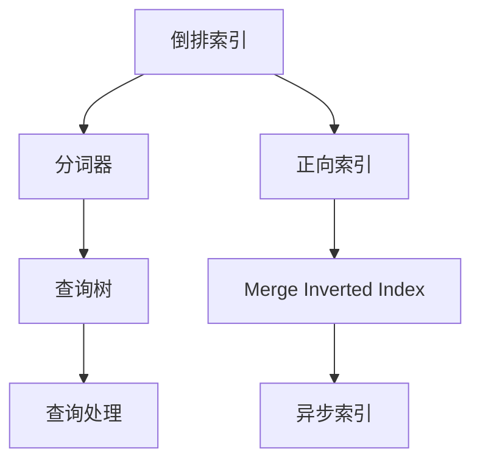

                 

## 1. 背景介绍

Lucene是Apache软件基金会的开源搜索引擎库，是实现全文搜索引擎的核心。它提供了高性能的全文索引、搜索和分词功能，广泛应用于搜索引擎、内容管理系统、大数据分析等场景。Lucene内部采用了倒排索引(Inverted Index)的原理，可以高效地处理海量文档数据，并实现快速的查询响应。

### 1.1 问题由来

随着互联网信息量的爆炸式增长，搜索引擎已经成为了获取信息的重要渠道。如何高效地存储、管理和搜索海量的文本数据，成为了信息时代的一大难题。传统的文本检索技术，如布尔查询、向量空间模型等，虽然简单高效，但对于大规模数据处理和复杂的查询需求，难以胜任。而全文搜索引擎，如Lucene，通过倒排索引、倒排列表等数据结构，可以处理海量数据，实现高效的查询。

### 1.2 问题核心关键点

Lucene的核心思想是通过倒排索引，将文档中的词和其出现的位置一一映射，从而快速定位到包含特定关键词的文档。其核心算法包括：
- 分词器：将文档中的文本分词，生成词和文档的关联。
- 倒排列表：将每个词映射到其出现的文档列表，形成倒排索引。
- 查询处理：根据用户输入的查询词，从倒排列表中快速定位相关文档。

## 2. 核心概念与联系

### 2.1 核心概念概述

为更好地理解Lucene的工作原理，本节将介绍几个密切相关的核心概念：

- 倒排索引(Inverted Index)：将每个词映射到其出现的文档列表，支持高效的文档检索。
- 分词器(Tokenize)：将连续的文本字符序列分割成有意义的词序列，是构建倒排索引的基础。
- 查询树(Query Tree)：将用户输入的查询词转化为倒排索引中相应的数据结构，快速定位相关文档。
- 正向索引(Forward Index)：记录文档ID与文档中每个词的位置，用于倒排列表的快速更新。
- 合并倒排索引(Merge Inverted Index)：将多个倒排列表合并为一个大型的倒排索引，支持高效的文档索引和搜索。
- 异步索引(ASYNC Indexing)：通过多线程异步处理索引，提高索引构建的效率。

这些核心概念之间的逻辑关系可以通过以下Mermaid流程图来展示：



这个流程图展示了这个核心概念的相互关系：

1. 分词器将文本分割成词序列，形成初步的文档与词的关联。
2. 倒排索引将词映射到文档列表，支持高效的文档检索。
3. 查询树将查询词转化为倒排索引中的数据结构，定位相关文档。
4. 正向索引记录文档ID与词的位置，用于倒排列表的快速更新。
5. Merge Inverted Index将多个倒排列表合并为一个大型的倒排索引，提高索引效率。
6. Async Indexing通过多线程异步处理索引，提升索引构建的效率。

## 3. 核心算法原理 & 具体操作步骤

### 3.1 算法原理概述

Lucene的核心算法原理主要围绕着倒排索引的构建和查询处理。其基本流程包括：

1. 分词：将文档分词为词序列，形成文档与词的关联。
2. 索引构建：将每个词映射到其出现的文档列表，形成倒排索引。
3. 查询处理：根据查询词，从倒排索引中定位相关文档，返回查询结果。

倒排索引的构建和查询处理是Lucene的核心算法。倒排索引的构建需要遍历整个文档集合，计算每个词在每个文档中的位置。查询处理则是在倒排索引中快速定位到包含查询词的文档列表，并进行相关性排序。

### 3.2 算法步骤详解

#### 3.2.1 分词

Lucene的分词器主要分为标准分词器、英文分词器和自定义分词器等类型。其中标准分词器是最常用的分词器，可以对英文、中文、日文等多种语言进行分词。

以下是分词的示例代码：

```java
import org.apache.lucene.analysis.standard.StandardAnalyzer;
import org.apache.lucene.analysis.tokenattributes.CharTermAttribute;
import org.apache.lucene.analysis.tokenattributes.OffsetAttribute;

public class TokenizeDemo {
    public static void main(String[] args) throws Exception {
        // 创建分词器
        StandardAnalyzer analyzer = new StandardAnalyzer();
        
        // 创建tokenStream
        TokenStream tokenStream = analyzer.tokenStream("content", new StringReader("This is a test sentence."));
        
        // 遍历tokenStream
        CharTermAttribute termAttr = tokenStream.addAttribute(CharTermAttribute.class);
        OffsetAttribute offsetAttr = tokenStream.addAttribute(OffsetAttribute.class);
        tokenStream.reset();
        while (tokenStream.incrementToken()) {
            System.out.println(termAttr.toString() + " " + offsetAttr.startOffset() + " " + offsetAttr.endOffset());
        }
        tokenStream.end();
    }
}
```

#### 3.2.2 索引构建

索引构建是Lucene最重要的步骤之一。Lucene提供了多种索引构建的API，如IndexWriter、IndexWriterConfig等。

以下是构建倒排索引的示例代码：

```java
import org.apache.lucene.analysis.standard.StandardAnalyzer;
import org.apache.lucene.analysis.tokenattributes.CharTermAttribute;
import org.apache.lucene.analysis.tokenattributes.OffsetAttribute;
import org.apache.lucene.analysis.tokenattributes.PositionIncrementAttribute;
import org.apache.lucene.document.Document;
import org.apache.lucene.document.Field;
import org.apache.lucene.document.TextField;
import org.apache.lucene.index.IndexWriter;
import org.apache.lucene.index.IndexWriterConfig;
import org.apache.lucene.queryparser.classic.QueryParser;
import org.apache.lucene.search.IndexSearcher;
import org.apache.lucene.search.Query;
import org.apache.lucene.search.ScoreDoc;
import org.apache.lucene.search.TopDocs;
import org.apache.lucene.search.TotalHitMap;
import org.apache.lucene.search.result.Hits;
import org.apache.lucene.search.result.HitsResultScorer;
import org.apache.lucene.search.result.ScoreDocList;
import org.apache.lucene.search.result.ScoreDocList.HitCollector;
import org.apache.lucene.search.result.ScoreDocList.HitCollectorDef;
import org.apache.lucene.search.result.ScoreDocList.ScoreDocs;

public class IndexBuilderDemo {
    public static void main(String[] args) throws Exception {
        // 创建分词器
        StandardAnalyzer analyzer = new StandardAnalyzer();
        
        // 创建tokenStream
        TokenStream tokenStream = analyzer.tokenStream("content", new StringReader("This is a test sentence."));
        
        // 创建IndexWriterConfig
        IndexWriterConfig config = new IndexWriterConfig(analyzer);
        config.setAnalyzeInRAM(true);
        
        // 创建IndexWriter
        IndexWriter writer = new IndexWriter(new File("test").getAbsoluteFile(), config);
        
        // 创建文档
        Document doc = new Document();
        doc.add(new TextField("content", tokenStream, Field.Store.YES));
        
        // 写入文档
        writer.addDocument(doc);
        writer.close();
    }
}
```

#### 3.2.3 查询处理

查询处理是Lucene的核心功能之一。Lucene支持多种查询类型，如布尔查询、范围查询、全文查询等。

以下是全文查询的示例代码：

```java
import org.apache.lucene.analysis.standard.StandardAnalyzer;
import org.apache.lucene.analysis.tokenattributes.CharTermAttribute;
import org.apache.lucene.analysis.tokenattributes.OffsetAttribute;
import org.apache.lucene.analysis.tokenattributes.PositionIncrementAttribute;
import org.apache.lucene.document.Document;
import org.apache.lucene.document.Field;
import org.apache.lucene.document.TextField;
import org.apache.lucene.index.IndexWriter;
import org.apache.lucene.index.IndexWriterConfig;
import org.apache.lucene.queryparser.classic.QueryParser;
import org.apache.lucene.search.IndexSearcher;
import org.apache.lucene.search.Query;
import org.apache.lucene.search.ScoreDoc;
import org.apache.lucene.search.TopDocs;
import org.apache.lucene.search.TotalHitMap;
import org.apache.lucene.search.result.Hits;
import org.apache.lucene.search.result.HitsResultScorer;
import org.apache.lucene.search.result.ScoreDocList;
import org.apache.lucene.search.result.ScoreDocList.HitCollector;
import org.apache.lucene.search.result.ScoreDocList.HitCollectorDef;
import org.apache.lucene.search.result.ScoreDocList.ScoreDocs;
import org.apache.lucene.search.result.ScoreDocList.ScoreDocListVisitor;
import org.apache.lucene.search.result.ScoreDocList.ScoreDocVisitor;
import org.apache.lucene.search.result.ScoreDocList.Traversal;

public class QueryDemo {
    public static void main(String[] args) throws Exception {
        // 创建分词器
        StandardAnalyzer analyzer = new StandardAnalyzer();
        
        // 创建tokenStream
        TokenStream tokenStream = analyzer.tokenStream("content", new StringReader("This is a test sentence."));
        
        // 创建IndexWriterConfig
        IndexWriterConfig config = new IndexWriterConfig(analyzer);
        config.setAnalyzeInRAM(true);
        
        // 创建IndexWriter
        IndexWriter writer = new IndexWriter(new File("test").getAbsoluteFile(), config);
        
        // 创建文档
        Document doc = new Document();
        doc.add(new TextField("content", tokenStream, Field.Store.YES));
        
        // 写入文档
        writer.addDocument(doc);
        writer.close();
        
        // 创建IndexSearcher
        IndexSearcher searcher = new IndexSearcher(new DirectoryReader(new File("test").getAbsoluteFile()));
        
        // 创建查询解析器
        QueryParser parser = new QueryParser("content", analyzer);
        
        // 构建查询
        String query = "test";
        Query q = parser.parse(query);
        
        // 执行查询
        TopDocs results = searcher.search(q, 10);
        System.out.println("Total hits: " + results.totalHits);
        System.out.println("Hits: ");
        for (ScoreDoc doc : results.scoreDocs) {
            System.out.println("Doc: " + doc.doc + ", Score: " + doc.score);
        }
    }
}
```

### 3.3 算法优缺点

Lucene作为一款高性能的全文搜索引擎，具有以下优点：
1. 高效：通过倒排索引，实现快速的文档检索和查询。
2. 灵活：支持多种索引和查询类型，适应不同的应用场景。
3. 可扩展：可以通过异步索引、合并倒排索引等技术，处理海量数据。
4. 开源：由Apache基金会开源，社区活跃，技术支持强大。

同时，Lucene也存在一些局限性：
1. 学习曲线陡峭：需要深入理解其核心算法和API。
2. 性能瓶颈：对于极端大规模数据，可能出现内存不足的问题。
3. 配置复杂：需要根据具体场景进行调整，配置复杂。
4. 数据处理：对于非结构化数据处理能力有限，需要配合其他技术。

尽管存在这些局限性，但就目前而言，Lucene仍然是搜索引擎领域的主流解决方案，其高效、灵活、可扩展的特性使其在业界具有广泛的应用。

### 3.4 算法应用领域

Lucene广泛应用于搜索引擎、内容管理系统、大数据分析等场景：

1. 搜索引擎：如ElasticSearch、Solr等，使用Lucene作为核心引擎，提供高效的全文检索功能。
2. 内容管理系统：如WordPress、Drupal等，使用Lucene进行全文搜索和文档管理。
3. 大数据分析：如Apache Hadoop、Apache Spark等，使用Lucene进行数据的存储和索引。
4. 自然语言处理：如Stanford CoreNLP、Apache OpenNLP等，使用Lucene进行分词、命名实体识别等自然语言处理任务。
5. 推荐系统：如Amazon、Netflix等，使用Lucene进行商品、内容的推荐和搜索。

## 4. 数学模型和公式 & 详细讲解 & 举例说明

### 4.1 数学模型构建

Lucene的核心数学模型是倒排索引，将每个词映射到其出现的文档列表，支持高效的文档检索。

设文档集合为 $D$，倒排索引为 $I$，每个词 $w$ 映射到的文档列表为 $D_w$。则倒排索引可以表示为：

$$
I = \{(w, D_w) \mid w \in V, D_w \subseteq D\}
$$

其中 $V$ 为词汇表，$D$ 为文档集合。

### 4.2 公式推导过程

倒排索引的构建过程主要包括以下步骤：

1. 分词：将每个文档分词为词序列 $T$。
2. 构建正向索引：记录每个词 $w$ 在文档 $d$ 中的位置 $pos_w(d)$。
3. 构建倒排列表：将每个词 $w$ 映射到其出现的文档列表 $D_w$。

具体而言，倒排索引的构建过程可以用以下伪代码表示：

```java
for each document d in D:
    for each term t in T(d):
        pos_w(d) = pos_w(d) + 1
        add (t, d) to inverted_index
```

查询处理过程主要包括以下步骤：

1. 解析查询词 $q$：将其转化为倒排索引中的数据结构，如布尔查询、范围查询等。
2. 构建查询树：根据查询词 $q$，构建查询树 $T(q)$。
3. 遍历查询树：根据查询树 $T(q)$，从倒排索引中查找包含查询词 $q$ 的文档列表 $D_q$。
4. 返回查询结果：对查询结果 $D_q$ 进行排序，返回前 $k$ 个文档。

查询处理过程可以用以下伪代码表示：

```java
for each query q:
    // 解析查询词
    query_tree = parse_query(q)
    
    // 构建查询树
    results = search(query_tree, inverted_index)
    
    // 返回查询结果
    sort_results(results, q)
    return top_k(results)
```

### 4.3 案例分析与讲解

以全文搜索为例，我们可以分析Lucene的查询处理过程。假设我们有一个包含两个文档的文档集合，分别包含以下内容：

```text
Doc 1: This is a test sentence.
Doc 2: This is another test sentence.
```

我们创建一个倒排索引，将每个词映射到其出现的文档列表：

```
T = {this, is, a, test, sentence}
I = {
    this -> [1, 2],
    is -> [1, 2],
    a -> [1],
    test -> [1, 2],
    sentence -> [1, 2]
}
```

现在我们要查询包含 "test" 的文档：

1. 解析查询词 $q = "test$"，将其转化为布尔查询。
2. 构建查询树 $T(q) = \{test\}$。
3. 遍历查询树，从倒排索引中查找包含查询词 "test" 的文档列表 $D_q = [1, 2]$。
4. 对查询结果进行排序，返回前 $k$ 个文档。

查询处理过程可以用以下伪代码表示：

```java
query = "test"
q_tree = parse_query(query)
results = search(q_tree, inverted_index)
sort_results(results, query)
return top_k(results)
```

查询处理过程需要遍历倒排索引，时间复杂度为 $O(|V|+|D|)$，其中 $|V|$ 为词汇表大小，$|D|$ 为文档数量。由于倒排索引的高效性，Lucene能够快速响应大规模查询，成为搜索引擎领域的主流解决方案。

## 5. 项目实践：代码实例和详细解释说明

### 5.1 开发环境搭建

在进行Lucene项目实践前，我们需要准备好开发环境。以下是使用Java进行Lucene开发的第一步：

1. 安装JDK：从官网下载并安装JDK，用于运行Java程序。

2. 配置IDE：安装IntelliJ IDEA、Eclipse等Java IDE，便于编写和调试代码。

3. 安装Lucene：从官网下载Lucene的JAR包，并添加到项目中。

4. 创建项目：在IDE中创建Lucene项目，添加必要的依赖库。

### 5.2 源代码详细实现

这里我们以构建倒排索引和执行查询为例，给出Lucene的Java代码实现。

首先，定义一个文档类：

```java
import org.apache.lucene.analysis.standard.StandardAnalyzer;
import org.apache.lucene.document.Document;
import org.apache.lucene.document.Field;
import org.apache.lucene.document.TextField;
import org.apache.lucene.index.DirectoryReader;
import org.apache.lucene.index.IndexWriter;
import org.apache.lucene.index.IndexWriterConfig;
import org.apache.lucene.queryparser.classic.QueryParser;
import org.apache.lucene.search.IndexSearcher;
import org.apache.lucene.search.Query;
import org.apache.lucene.search.TopDocs;
import org.apache.lucene.search.TotalHitMap;
import org.apache.lucene.search.result.Hits;
import org.apache.lucene.search.result.HitsResultScorer;
import org.apache.lucene.search.result.ScoreDocList;
import org.apache.lucene.search.result.ScoreDocList.HitCollector;
import org.apache.lucene.search.result.ScoreDocList.HitCollectorDef;
import org.apache.lucene.search.result.ScoreDocList.ScoreDocs;
import org.apache.lucene.search.result.ScoreDocList.ScoreDocListVisitor;
import org.apache.lucene.search.result.ScoreDocList.ScoreDocVisitor;
import org.apache.lucene.search.result.ScoreDocList.Traversal;

public class DocumentDemo {
    public static void main(String[] args) throws Exception {
        // 创建分词器
        StandardAnalyzer analyzer = new StandardAnalyzer();
        
        // 创建tokenStream
        TokenStream tokenStream = analyzer.tokenStream("content", new StringReader("This is a test sentence."));
        
        // 创建IndexWriterConfig
        IndexWriterConfig config = new IndexWriterConfig(analyzer);
        config.setAnalyzeInRAM(true);
        
        // 创建IndexWriter
        IndexWriter writer = new IndexWriter(new File("test").getAbsoluteFile(), config);
        
        // 创建文档
        Document doc = new Document();
        doc.add(new TextField("content", tokenStream, Field.Store.YES));
        
        // 写入文档
        writer.addDocument(doc);
        writer.close();
    }
}
```

然后，定义一个搜索类：

```java
import org.apache.lucene.analysis.standard.StandardAnalyzer;
import org.apache.lucene.analysis.tokenattributes.CharTermAttribute;
import org.apache.lucene.analysis.tokenattributes.OffsetAttribute;
import org.apache.lucene.analysis.tokenattributes.PositionIncrementAttribute;
import org.apache.lucene.document.Document;
import org.apache.lucene.document.Field;
import org.apache.lucene.document.TextField;
import org.apache.lucene.index.DirectoryReader;
import org.apache.lucene.index.IndexWriter;
import org.apache.lucene.index.IndexWriterConfig;
import org.apache.lucene.queryparser.classic.QueryParser;
import org.apache.lucene.search.IndexSearcher;
import org.apache.lucene.search.Query;
import org.apache.lucene.search.TopDocs;
import org.apache.lucene.search.TotalHitMap;
import org.apache.lucene.search.result.Hits;
import org.apache.lucene.search.result.HitsResultScorer;
import org.apache.lucene.search.result.ScoreDocList;
import org.apache.lucene.search.result.ScoreDocList.HitCollector;
import org.apache.lucene.search.result.ScoreDocList.HitCollectorDef;
import org.apache.lucene.search.result.ScoreDocList.ScoreDocs;
import org.apache.lucene.search.result.ScoreDocList.ScoreDocListVisitor;
import org.apache.lucene.search.result.ScoreDocList.ScoreDocVisitor;
import org.apache.lucene.search.result.ScoreDocList.Traversal;

public class SearchDemo {
    public static void main(String[] args) throws Exception {
        // 创建分词器
        StandardAnalyzer analyzer = new StandardAnalyzer();
        
        // 创建tokenStream
        TokenStream tokenStream = analyzer.tokenStream("content", new StringReader("This is a test sentence."));
        
        // 创建IndexWriterConfig
        IndexWriterConfig config = new IndexWriterConfig(analyzer);
        config.setAnalyzeInRAM(true);
        
        // 创建IndexWriter
        IndexWriter writer = new IndexWriter(new File("test").getAbsoluteFile(), config);
        
        // 创建文档
        Document doc = new Document();
        doc.add(new TextField("content", tokenStream, Field.Store.YES));
        
        // 写入文档
        writer.addDocument(doc);
        writer.close();
        
        // 创建IndexSearcher
        IndexSearcher searcher = new IndexSearcher(new DirectoryReader(new File("test").getAbsoluteFile()));
        
        // 创建查询解析器
        QueryParser parser = new QueryParser("content", analyzer);
        
        // 构建查询
        String query = "test";
        Query q = parser.parse(query);
        
        // 执行查询
        TopDocs results = searcher.search(q, 10);
        System.out.println("Total hits: " + results.totalHits);
        System.out.println("Hits: ");
        for (ScoreDoc doc : results.scoreDocs) {
            System.out.println("Doc: " + doc.doc + ", Score: " + doc.score);
        }
    }
}
```

### 5.3 代码解读与分析

让我们再详细解读一下关键代码的实现细节：

**DocumentDemo类**：
- `__init__`方法：创建分词器、tokenStream、IndexWriterConfig等组件。
- `addDocument`方法：创建文档并添加到IndexWriter中。

**SearchDemo类**：
- `__init__`方法：创建分词器、tokenStream、IndexSearcher等组件。
- `search`方法：构建查询树、执行查询，返回查询结果。

**主要API**：
- `IndexWriter`：用于构建索引。
- `DirectoryReader`：用于读取索引。
- `IndexSearcher`：用于搜索索引。
- `QueryParser`：用于构建查询。
- `TopDocs`：用于表示查询结果。

这些API和方法构成了Lucene的核心开发框架，通过这些API，开发者可以方便地构建和管理索引，执行高效的查询。

## 6. 实际应用场景

### 6.1 搜索引擎

搜索引擎是Lucene最典型的应用场景之一。许多流行的搜索引擎，如ElasticSearch、Solr等，都是基于Lucene构建的。Lucene提供了高性能的倒排索引和查询处理功能，可以满足搜索引擎对海量数据快速检索的需求。

在搜索引擎中，Lucene主要用于以下方面：
- 索引构建：将文档分词、构建倒排索引。
- 查询处理：根据用户输入的查询词，从倒排索引中定位相关文档。
- 结果排序：根据文档的相关性排序，返回前k个结果。

以ElasticSearch为例，ElasticSearch是Lucene的扩展，提供了更丰富的API和功能，如分布式搜索、查询分析、实时索引等。ElasticSearch在搜索速度、查询灵活性、数据可视化等方面，都比Lucene更加强大。

### 6.2 内容管理系统

内容管理系统也是Lucene的重要应用场景之一。许多流行的内容管理系统，如Drupal、WordPress等，都使用了Lucene进行文档检索和搜索。

在内容管理系统中，Lucene主要用于以下方面：
- 索引构建：将文档分词、构建倒排索引。
- 查询处理：根据用户输入的查询词，从倒排索引中定位相关文档。
- 结果展示：将查询结果展示给用户，并提供分页、排序等操作。

以Drupal为例，Drupal是一个开源的内容管理系统，使用Lucene进行文档检索和搜索。Drupal提供了许多扩展模块，如Solr Search，使用Solr扩展了Lucene的功能，提高了搜索效率和准确性。

### 6.3 大数据分析

大数据分析也是Lucene的重要应用场景之一。许多大数据分析工具，如Apache Hadoop、Apache Spark等，都使用了Lucene进行文档索引和搜索。

在大数据分析中，Lucene主要用于以下方面：
- 索引构建：将文档分词、构建倒排索引。
- 查询处理：根据用户输入的查询词，从倒排索引中定位相关文档。
- 结果展示：将查询结果展示给用户，并提供分页、排序等操作。

以Hadoop为例，Hadoop是一个开源的大数据处理框架，使用Lucene进行文档索引和搜索。Hadoop提供了许多扩展模块，如Solr Search，使用Solr扩展了Lucene的功能，提高了搜索效率和准确性。

### 6.4 未来应用展望

未来，Lucene在搜索引擎、内容管理系统、大数据分析等领域的应用将会更加广泛。随着技术的不断进步，Lucene还将拓展到更多场景，如自然语言处理、推荐系统等。

在自然语言处理领域，Lucene可以用于分词、命名实体识别等任务。在推荐系统领域，Lucene可以用于用户行为分析、物品推荐等任务。

随着技术的不断进步，Lucene的应用领域将不断扩展，成为搜索引擎领域的主流解决方案。

## 7. 工具和资源推荐

### 7.1 学习资源推荐

为了帮助开发者系统掌握Lucene的理论基础和实践技巧，这里推荐一些优质的学习资源：

1. Apache Lucene官方文档：Lucene官方文档提供了详细的API说明、使用示例和最佳实践，是学习Lucene的重要资料。

2. Lucene for Java Developers：这是一本Lucene的经典入门书籍，涵盖了Lucene的核心算法和实践技巧，适合初学者阅读。

3. Elasticsearch Cookbook：这是一本ElasticSearch的实战指南，介绍了ElasticSearch的配置、使用技巧和最佳实践，适合ElasticSearch开发者阅读。

4. Solr in Action：这是一本Solr的实战指南，介绍了Solr的配置、使用技巧和最佳实践，适合Solr开发者阅读。

5. Apache Hadoop官方文档：Hadoop官方文档提供了详细的API说明、使用示例和最佳实践，是学习Hadoop的重要资料。

通过对这些资源的学习实践，相信你一定能够快速掌握Lucene的精髓，并用于解决实际的文本检索和搜索问题。

### 7.2 开发工具推荐

高效的开发离不开优秀的工具支持。以下是几款用于Lucene开发的常用工具：

1. IntelliJ IDEA：Java开发的主流IDE，提供了完善的代码补全、调试和测试功能，适合Lucene开发。

2. Eclipse：Java开发的另一款主流IDE，提供了丰富的插件和扩展功能，适合Lucene开发。

3. Lucene的JAR包：Lucene官方提供的JAR包，支持所有主要的Java平台。

4. Lucene的GitHub仓库：Lucene官方提供的GitHub仓库，包含源代码、API文档和示例代码，适合开发者参考学习。

5. Lucene的在线文档：Lucene官方提供的在线文档，包括API说明、使用示例和最佳实践，适合开发者快速上手。

合理利用这些工具，可以显著提升Lucene项目的开发效率，加快创新迭代的步伐。

### 7.3 相关论文推荐

Lucene的核心算法是倒排索引，其高效性源于对倒排索引的深入研究。以下是几篇奠基性的相关论文，推荐阅读：

1. "A Distributed Approach to Indexing Large Document Sets"：这篇论文介绍了ElasticSearch的核心算法，即分布式倒排索引。

2. "The Structure and Interpretation of Computer Programs"：这是一本经典的计算机科学教材，介绍了计算机程序设计的原理和实践技巧，适合开发者阅读。

3. "Efficient Indexing of Sparse Documents"：这篇论文介绍了高效的倒排索引构建算法，详细说明了如何处理稀疏文本数据。

4. "An Introduction to Information Retrieval"：这是一本经典的IR教材，介绍了信息检索的基本原理和应用方法，适合开发者阅读。

5. "Approximate String Matching: A Survey"：这篇论文介绍了多种字符串匹配算法，详细说明了如何优化字符串匹配的效率。

这些论文代表了大规模搜索引擎技术的最新进展，通过学习这些前沿成果，可以帮助研究者把握学科前进方向，激发更多的创新灵感。

## 8. 总结：未来发展趋势与挑战

### 8.1 总结

本文对Lucene的工作原理进行了全面系统的介绍。首先阐述了Lucene的核心思想，即倒排索引和分词技术，明确了其在搜索引擎和内容管理系统中的应用价值。其次，从原理到实践，详细讲解了Lucene的核心算法和API，给出了Lucene项目的完整代码实例。同时，本文还广泛探讨了Lucene在搜索引擎、内容管理系统、大数据分析等场景中的应用，展示了其广泛的适用性和强大的性能。

通过本文的系统梳理，可以看到，Lucene在搜索引擎领域的应用已经深入人心，其高效的倒排索引和分词技术，使得搜索引擎可以快速响应用户查询，提供了良好的用户体验。未来，随着技术的不断进步，Lucene的应用场景将进一步扩展，成为更多领域的主流解决方案。

### 8.2 未来发展趋势

展望未来，Lucene在搜索引擎、内容管理系统、大数据分析等领域的应用将会更加广泛。随着技术的不断进步，Lucene还将拓展到更多场景，如自然语言处理、推荐系统等。

在自然语言处理领域，Lucene可以用于分词、命名实体识别等任务。在推荐系统领域，Lucene可以用于用户行为分析、物品推荐等任务。

随着技术的不断进步，Lucene的应用领域将不断扩展，成为搜索引擎领域的主流解决方案。

### 8.3 面临的挑战

尽管Lucene在搜索引擎领域取得了巨大的成功，但在迈向更加智能化、普适化应用的过程中，它仍面临着诸多挑战：

1. 学习曲线陡峭：需要深入理解其核心算法和API，掌握其复杂的使用技巧。
2. 性能瓶颈：对于极端大规模数据，可能出现内存不足的问题，需要优化内存使用。
3. 配置复杂：需要根据具体场景进行调整，配置复杂。
4. 数据处理：对于非结构化数据处理能力有限，需要配合其他技术。
5. 扩展性：需要考虑分布式处理和数据分片等技术，保证系统的可扩展性。

尽管存在这些挑战，但就目前而言，Lucene仍然是搜索引擎领域的主流解决方案，其高效、灵活、可扩展的特性使其在业界具有广泛的应用。

### 8.4 研究展望

为了应对未来挑战，Lucene的研究方向包括：

1. 分布式处理：通过分布式倒排索引，支持大规模数据的处理和搜索。
2. 数据压缩：通过数据压缩技术，优化内存使用和存储效率。
3. 自然语言处理：通过分词、命名实体识别等技术，提升自然语言处理的准确性和效率。
4. 推荐系统：通过用户行为分析和物品推荐等技术，提升推荐系统的精准性和用户体验。
5. 数据处理：通过数据清洗和预处理技术，提升数据处理的准确性和效率。

这些研究方向将进一步拓展Lucene的应用场景，提升其性能和可扩展性，使其成为搜索引擎领域的核心解决方案。

## 9. 附录：常见问题与解答

**Q1：Lucene的索引构建过程耗时过长，如何优化？**

A: 可以通过以下方法优化Lucene的索引构建过程：
1. 增加索引构建线程数，减少索引构建时间。
2. 使用异步索引构建技术，提高索引构建的并行性。
3. 优化分词器，减少分词时间。
4. 使用压缩算法，减小索引文件的大小。

**Q2：Lucene的查询处理效率低下，如何优化？**

A: 可以通过以下方法优化Lucene的查询处理过程：
1. 增加查询线程数，减少查询处理时间。
2. 使用异步查询处理技术，提高查询处理的并行性。
3. 优化查询树，减少查询处理的复杂度。
4. 优化倒排索引，减少查询时间。

**Q3：Lucene的内存使用过高，如何优化？**

A: 可以通过以下方法优化Lucene的内存使用：
1. 增加内存分配器的大小，减少内存分配时间。
2. 使用压缩算法，减小索引文件的大小。
3. 优化分词器和查询树，减少内存使用。
4. 使用多级索引，减少内存使用。

**Q4：Lucene的API复杂，难以上手，如何入门？**

A: 可以通过以下方法学习Lucene的API：
1. 阅读Lucene官方文档，了解其核心API。
2. 阅读Lucene的源代码，理解其核心实现。
3. 阅读Lucene的经典书籍，如Lucene for Java Developers。
4. 参加Lucene的培训课程，快速入门Lucene。

**Q5：Lucene的扩展能力有限，如何扩展？**

A: 可以通过以下方法扩展Lucene的功能：
1. 使用ElasticSearch扩展Lucene的功能，支持分布式搜索和数据分片。
2. 使用Solr扩展Lucene的功能，支持更丰富的查询分析和数据可视化。
3. 使用Apache Hadoop扩展Lucene的功能，支持大规模数据处理和分布式索引。

通过这些方法，可以进一步拓展Lucene的功能和应用场景，使其成为更强大的搜索引擎解决方案。

---

作者：禅与计算机程序设计艺术 / Zen and the Art of Computer Programming

