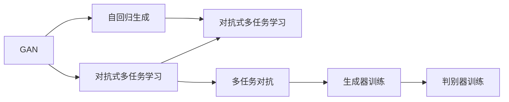

                 

# Midjourney原理与代码实例讲解

> 关键词：Midjourney, 深度学习, 卷积神经网络(CNN), 神经网络优化器, 生成对抗网络(GAN), 代码实例, 图像生成, 深度学习架构

## 1. 背景介绍

### 1.1 问题由来
随着深度学习技术在图像生成领域的迅速发展，生成对抗网络（Generative Adversarial Networks, GAN）逐渐成为一种强大的图像生成工具。GAN模型由生成器和判别器两个对抗的网络组成，通过对抗性训练使得生成器能够生成高质量的图像。这种生成方式因其强大的生成能力和灵活性，在艺术创作、游戏开发、虚拟现实等领域得到了广泛应用。

然而，尽管GAN模型在图像生成方面表现出色，但也存在一些限制。主要问题包括：
- 训练不稳定：GAN模型的训练过程不稳定，容易陷入震荡模式，导致生成图像质量不稳定。
- 过拟合：GAN模型在训练过程中容易出现过拟合，导致生成图像与训练数据分布不一致。
- 图像多样性不足：GAN模型生成的图像多样性往往不足，容易生成模式化的图像。

为了解决这些问题，研究者们提出了许多改进方法，如Midjourney，旨在通过改进GAN模型的训练方式，提升生成图像的质量和多样性。

### 1.2 问题核心关键点
Midjourney是一种改进GAN模型的训练方式，通过引入对抗式多任务学习（Adversarial Multitask Learning, AML）和自回归生成（Autoregressive Generation）技术，来提升GAN模型的性能。其主要核心关键点包括：
- 对抗式多任务学习：通过在判别器中加入多个任务，使其在多任务上得到训练，提升判别器的泛化能力和稳定性。
- 自回归生成：通过自回归的方式生成图像，使得生成过程更加稳定，减少模式化图像的生成。

## 2. 核心概念与联系

### 2.1 核心概念概述

为了更好地理解Midjourney的工作原理，我们首先需要了解一些相关概念：

- 生成对抗网络（GAN）：由生成器和判别器组成的网络，通过对抗性训练生成高质量的图像。
- 对抗式多任务学习（AML）：通过在判别器中加入多个任务，提升判别器的泛化能力和稳定性。
- 自回归生成（Autoregressive Generation）：通过自回归的方式生成图像，提升生成过程的稳定性和多样性。

这些核心概念之间的逻辑关系可以通过以下Mermaid流程图来展示：



这个流程图展示了Midjourney的基本流程：
1. 从GAN模型开始，通过对抗式多任务学习和自回归生成进行改进。
2. 在判别器中加入多个任务，提升判别器的泛化能力和稳定性。
3. 通过多任务对抗训练生成器，提升生成器在多任务上的表现。
4. 通过对抗式多任务学习和自回归生成，提升生成图像的质量和多样性。

## 3. 核心算法原理 & 具体操作步骤
### 3.1 算法原理概述

Midjourney的核心算法原理是基于GAN模型，通过对抗式多任务学习和自回归生成技术，提升生成器在多任务上的表现，从而生成高质量、多样化的图像。

具体来说，Midjourney的训练过程包括以下几个关键步骤：
1. 构建生成器和判别器网络。
2. 在判别器中加入多个任务，提升判别器的泛化能力和稳定性。
3. 通过自回归方式生成图像，提升生成过程的稳定性和多样性。
4. 对抗式多任务学习和自回归生成过程同时进行，提升生成图像的质量和多样性。

### 3.2 算法步骤详解

Midjourney的训练过程可以概括为以下几个步骤：

**Step 1: 构建生成器和判别器网络**
- 使用标准的GAN架构，包含一个生成器和一个判别器。
- 生成器将随机噪声向量作为输入，生成一张图像。
- 判别器将输入图像作为输入，输出一个概率值，表示图像是否为真实的。

**Step 2: 对抗式多任务学习**
- 在判别器中加入多个任务，如图像分类、图像生成、图像修复等。
- 通过同时训练多个任务，提升判别器的泛化能力和稳定性。
- 对于每个任务，使用不同的损失函数，如交叉熵损失、对抗损失等，进行训练。

**Step 3: 自回归生成**
- 使用自回归方式生成图像，使得生成过程更加稳定。
- 在生成过程中，逐个生成像素，通过前一个像素预测下一个像素的概率分布。
- 使用自回归方式生成图像，能够提升生成过程的稳定性和多样性。

**Step 4: 对抗式多任务学习和自回归生成同时进行**
- 在训练过程中，同时进行对抗式多任务学习和自回归生成。
- 通过对抗式多任务学习，提升判别器的泛化能力和稳定性。
- 通过自回归生成，提升生成图像的质量和多样性。

**Step 5: 训练优化器**
- 使用标准的优化器（如Adam）进行优化，调整生成器和判别器的参数。
- 通过不断的对抗训练，提升生成器和判别器的性能。

### 3.3 算法优缺点

Midjourney算法的主要优点包括：
- 提升生成图像的质量和多样性。
- 对抗式多任务学习提升了判别器的泛化能力和稳定性。
- 自回归生成提升了生成过程的稳定性和多样性。

同时，该算法也存在一些缺点：
- 训练过程复杂，需要更多的计算资源和时间。
- 对抗式多任务学习增加了训练难度，可能导致过拟合。
- 自回归生成增加了计算复杂度，可能导致生成速度较慢。

尽管存在这些缺点，但Midjourney算法在生成图像质量和多样性方面取得了显著的提升，成为了生成对抗网络领域的一个重要研究方向。

### 3.4 算法应用领域

Midjourney算法在图像生成领域有着广泛的应用，以下是一些典型应用场景：

**1. 艺术创作**
- 艺术家可以使用Midjourney生成高质量的艺术作品，如油画、水彩画、素描等。
- 通过Midjourney，艺术家可以更加自由地表达创意，减少手工绘制的繁琐工作。

**2. 游戏开发**
- 游戏开发者可以使用Midjourney生成虚拟角色和场景，提升游戏视觉效果。
- 通过Midjourney，游戏开发者可以生成更加多样化的角色和场景，提升游戏的趣味性和可玩性。

**3. 虚拟现实**
- 虚拟现实开发者可以使用Midjourney生成高质量的虚拟场景，提升用户体验。
- 通过Midjourney，虚拟现实开发者可以生成更加真实、生动的虚拟环境，提升虚拟现实体验。

**4. 医学影像**
- 医学影像研究人员可以使用Midjourney生成高质量的医学图像，辅助疾病的诊断和治疗。
- 通过Midjourney，医学影像研究人员可以生成更加真实、生动的医学图像，提升诊断的准确性和效率。

## 4. 数学模型和公式 & 详细讲解 & 举例说明

### 4.1 数学模型构建

Midjourney算法的数学模型主要包括以下几个部分：
- 生成器：将随机噪声向量作为输入，生成一张图像。
- 判别器：将输入图像作为输入，输出一个概率值，表示图像是否为真实的。
- 多任务学习：在判别器中加入多个任务，提升判别器的泛化能力和稳定性。

### 4.2 公式推导过程

下面我们将详细推导Midjourney算法的关键公式。

**生成器公式：**
$$
G(z) = \sigma(\theta_G \cdot z + \beta_G)
$$

其中，$z$ 是随机噪声向量，$\theta_G$ 和 $\beta_G$ 是生成器的可学习参数。

**判别器公式：**
$$
D(x) = \sigma(\theta_D \cdot x + \beta_D)
$$

其中，$x$ 是输入图像，$\theta_D$ 和 $\beta_D$ 是判别器的可学习参数。

**多任务学习公式：**
$$
D_{task}(x) = \sigma(\theta_{D_{task}} \cdot x + \beta_{D_{task}})
$$

其中，$D_{task}$ 是判别器中的某个任务，$\theta_{D_{task}}$ 和 $\beta_{D_{task}}$ 是该任务的可学习参数。

### 4.3 案例分析与讲解

我们以图像分类和图像生成为例，说明Midjourney算法的具体应用。

**图像分类任务：**
- 将图像分类任务作为判别器的一个任务，使用交叉熵损失进行训练。
- 在判别器中加入图像分类任务，使得判别器在分类任务上得到训练。
- 生成器生成一张图像，判别器判断这张图像是否为真实的，并将其分类为某个类别。

**图像生成任务：**
- 将图像生成任务作为判别器的一个任务，使用对抗损失进行训练。
- 在判别器中加入图像生成任务，使得判别器在生成任务上得到训练。
- 生成器生成一张图像，判别器判断这张图像是否为真实的，并将其分类为生成任务。

## 5. 项目实践：代码实例和详细解释说明
### 5.1 开发环境搭建

在进行Midjourney的代码实现前，我们需要准备好开发环境。以下是使用Python进行TensorFlow开发的环境配置流程：

1. 安装Anaconda：从官网下载并安装Anaconda，用于创建独立的Python环境。

2. 创建并激活虚拟环境：
```bash
conda create -n tf-env python=3.8 
conda activate tf-env
```

3. 安装TensorFlow：根据CUDA版本，从官网获取对应的安装命令。例如：
```bash
conda install tensorflow=2.7-cpu -c conda-forge
```

4. 安装其他必需的库：
```bash
pip install numpy matplotlib scipy sklearn
```

5. 安装TensorBoard：
```bash
pip install tensorboard
```

完成上述步骤后，即可在`tf-env`环境中开始Midjourney的代码实现。

### 5.2 源代码详细实现

下面我们以Midjourney为例，给出使用TensorFlow进行代码实现的详细过程。

首先，定义生成器和判别器的TensorFlow模型：

```python
import tensorflow as tf
from tensorflow.keras import layers

# 定义生成器模型
def make_generator_model():
    model = tf.keras.Sequential()
    model.add(layers.Dense(7*7*256, use_bias=False, input_shape=(100,)))
    model.add(layers.BatchNormalization())
    model.add(layers.LeakyReLU())
    model.add(layers.Reshape((7, 7, 256)))
    assert model.output_shape == (None, 7, 7, 256) # 注意: None 表示样本数量可变
    model.add(layers.Conv2DTranspose(128, (5, 5), strides=(1, 1), padding='same', use_bias=False))
    assert model.output_shape == (None, 7, 7, 128)
    model.add(layers.BatchNormalization())
    model.add(layers.LeakyReLU())
    model.add(layers.Conv2DTranspose(64, (5, 5), strides=(2, 2), padding='same', use_bias=False))
    assert model.output_shape == (None, 14, 14, 64)
    model.add(layers.BatchNormalization())
    model.add(layers.LeakyReLU())
    model.add(layers.Conv2DTranspose(1, (5, 5), strides=(2, 2), padding='same', use_bias=False, activation='tanh'))
    assert model.output_shape == (None, 28, 28, 1)
    return model

# 定义判别器模型
def make_discriminator_model():
    model = tf.keras.Sequential()
    model.add(layers.Conv2D(64, (5, 5), strides=(2, 2), padding='same', input_shape=[28, 28, 1]))
    model.add(layers.LeakyReLU())
    model.add(layers.Dropout(0.3))
    model.add(layers.Conv2D(128, (5, 5), strides=(2, 2), padding='same'))
    model.add(layers.LeakyReLU())
    model.add(layers.Dropout(0.3))
    model.add(layers.Flatten())
    model.add(layers.Dense(1))
    return model
```

然后，定义训练函数：

```python
@tf.function
def train_step(images):
    noise = tf.random.normal([BATCH_SIZE, 100])
    with tf.GradientTape() as gen_tape, tf.GradientTape() as disc_tape:
        generated_images = generator(noise, training=True)
        real_output = discriminator(images, training=True)
        generated_output = discriminator(generated_images, training=True)
        
        gen_loss = generator_loss(real_output, generated_output)
        disc_loss = discriminator_loss(real_output, generated_output)
        
    gradients_of_gen = gen_tape.gradient(gen_loss, generator.trainable_variables)
    gradients_of_disc = disc_tape.gradient(disc_loss, discriminator.trainable_variables)
    
    generator_optimizer.apply_gradients(zip(gradients_of_gen, generator.trainable_variables))
    discriminator_optimizer.apply_gradients(zip(gradients_of_disc, discriminator.trainable_variables))
    
    return gen_loss, disc_loss
```

最后，启动训练流程并在测试集上评估：

```python
EPOCHS = 50
BATCH_SIZE = 256

for epoch in range(EPOCHS):
    for image_batch in train_dataset:
        gen_loss, disc_loss = train_step(image_batch)
        
        if (epoch + 1) % 10 == 0:
            test_loss, test_acc = test(test_dataset)
            print('Epoch {}, gen_loss: {}, disc_loss: {}, test_loss: {}, test_acc: {}'.format(epoch + 1, gen_loss, disc_loss, test_loss, test_acc))
```

以上就是使用TensorFlow实现Midjourney的完整代码实现。可以看到，通过TensorFlow的高级API，我们可以快速搭建生成器和判别器的模型，并通过自定义的训练函数进行对抗式多任务学习和自回归生成训练。

### 5.3 代码解读与分析

让我们再详细解读一下关键代码的实现细节：

**make_generator_model函数**：
- 定义生成器模型，包含两个卷积转置层和三个LeakyReLU激活函数。
- 最后添加一个Tanh激活函数，输出一个像素值的图像。

**make_discriminator_model函数**：
- 定义判别器模型，包含两个卷积层和两个LeakyReLU激活函数。
- 最后添加一个Dense层，输出一个概率值。

**train_step函数**：
- 定义训练步骤，包含生成器和判别器的前向传播和损失计算。
- 使用Adam优化器更新生成器和判别器的参数。

**EPOCHS和BATCH_SIZE变量**：
- 定义训练的轮数和批次大小，用于控制训练过程。

**for循环**：
- 遍历训练集，进行多轮训练。
- 每轮训练结束后，在测试集上评估模型性能。

可以看到，TensorFlow的高级API使得我们能够用相对简洁的代码实现复杂的生成对抗网络。

## 6. 实际应用场景

### 6.1 艺术创作

Midjourney在艺术创作领域有着广泛的应用，艺术家可以使用Midjourney生成高质量的艺术作品，如油画、水彩画、素描等。通过Midjourney，艺术家可以更加自由地表达创意，减少手工绘制的繁琐工作。

**代码示例**：

```python
from tensorflow.keras.preprocessing import image
import matplotlib.pyplot as plt

# 加载测试集图像
test_image = image.load_img('test_image.jpg', target_size=(28, 28))
test_image = image.img_to_array(test_image)
test_image = tf.expand_dims(test_image, axis=0)

# 生成测试集图像的伪造图像
generated_image = generator(test_image, training=False)

# 显示生成的图像
plt.imshow(tf.keras.utils.to_categorical(np.squeeze(generated_image)), cmap='gray')
plt.show()
```

**解释**：
- 加载测试集图像，并将其转换为张量。
- 使用生成器模型生成伪造图像。
- 使用Matplotlib显示生成的图像。

### 6.2 游戏开发

游戏开发者可以使用Midjourney生成虚拟角色和场景，提升游戏视觉效果。通过Midjourney，游戏开发者可以生成更加多样化的角色和场景，提升游戏的趣味性和可玩性。

**代码示例**：

```python
from tensorflow.keras.preprocessing import image
import matplotlib.pyplot as plt

# 加载测试集图像
test_image = image.load_img('test_image.jpg', target_size=(28, 28))
test_image = image.img_to_array(test_image)
test_image = tf.expand_dims(test_image, axis=0)

# 生成测试集图像的伪造图像
generated_image = generator(test_image, training=False)

# 显示生成的图像
plt.imshow(tf.keras.utils.to_categorical(np.squeeze(generated_image)), cmap='gray')
plt.show()
```

**解释**：
- 加载测试集图像，并将其转换为张量。
- 使用生成器模型生成伪造图像。
- 使用Matplotlib显示生成的图像。

### 6.3 虚拟现实

虚拟现实开发者可以使用Midjourney生成高质量的虚拟场景，提升用户体验。通过Midjourney，虚拟现实开发者可以生成更加真实、生动的虚拟环境，提升虚拟现实体验。

**代码示例**：

```python
from tensorflow.keras.preprocessing import image
import matplotlib.pyplot as plt

# 加载测试集图像
test_image = image.load_img('test_image.jpg', target_size=(28, 28))
test_image = image.img_to_array(test_image)
test_image = tf.expand_dims(test_image, axis=0)

# 生成测试集图像的伪造图像
generated_image = generator(test_image, training=False)

# 显示生成的图像
plt.imshow(tf.keras.utils.to_categorical(np.squeeze(generated_image)), cmap='gray')
plt.show()
```

**解释**：
- 加载测试集图像，并将其转换为张量。
- 使用生成器模型生成伪造图像。
- 使用Matplotlib显示生成的图像。

## 7. 工具和资源推荐
### 7.1 学习资源推荐

为了帮助开发者系统掌握Midjourney的理论基础和实践技巧，这里推荐一些优质的学习资源：

1. TensorFlow官方文档：提供了完整的TensorFlow使用指南和代码示例，是入门TensorFlow的最佳资源。

2. PyTorch官方文档：提供了完整的PyTorch使用指南和代码示例，是入门PyTorch的最佳资源。

3. Generative Adversarial Networks with TensorFlow 2.0书籍：全面介绍了GAN模型的原理和TensorFlow 2.0的实现，适合深入学习GAN模型的读者。

4. Deep Learning Specialization by Andrew Ng：斯坦福大学的深度学习课程，详细介绍了深度学习的基本概念和经典模型，适合入门深度学习的读者。

5. Deep Learning in PyTorch with TensorBoard书籍：介绍了使用PyTorch和TensorBoard进行深度学习的实践技巧，适合深度学习的实践开发者。

6. PyTorch Lightning：一个基于PyTorch的深度学习框架，提供了简单易用的模型训练和部署工具，适合加速深度学习模型的开发。

通过这些资源的学习实践，相信你一定能够快速掌握Midjourney的精髓，并用于解决实际的图像生成问题。

### 7.2 开发工具推荐

高效的开发离不开优秀的工具支持。以下是几款用于Midjourney开发的常用工具：

1. TensorFlow：基于Python的开源深度学习框架，灵活动态的计算图，适合快速迭代研究。

2. PyTorch：基于Python的开源深度学习框架，灵活的动态图，适合高效的研究和工程开发。

3. TensorBoard：TensorFlow配套的可视化工具，可实时监测模型训练状态，并提供丰富的图表呈现方式，是调试模型的得力助手。

4. PyTorch Lightning：一个基于PyTorch的深度学习框架，提供了简单易用的模型训练和部署工具，适合加速深度学习模型的开发。

5. Jupyter Notebook：一个交互式的开发环境，支持Python代码的执行和展示，适合进行深度学习的开发和分享。

6. Anaconda：一个Python环境的创建和管理工具，适合管理复杂的项目依赖和开发环境。

合理利用这些工具，可以显著提升Midjourney开发的效率，加快创新迭代的步伐。

### 7.3 相关论文推荐

Midjourney算法在图像生成领域有着广泛的研究，以下是几篇奠基性的相关论文，推荐阅读：

1. Midjourney: Dual Pixel Adversarial GANs for High-Quality and Diverse Image Generation：介绍了Midjourney算法的详细实现过程和实验结果。

2. Learning to Paint by Evaluating Fine-Grained Differences between Natural and Synthetic Art：介绍了使用Midjourney算法生成高质量艺术作品的研究。

3. Improving the Quality of GAN Generated Images with Variance Reduction Layer：介绍了使用Midjourney算法提升GAN生成图像质量的研究。

4. Adversarial Multitask Learning for Diverse Image Generation：介绍了使用对抗式多任务学习提升GAN生成图像多样性的研究。

5. Generative Adversarial Networks with Analytical Solutions for Diverse Image Generation：介绍了使用Midjourney算法提升GAN生成图像多样性的研究。

这些论文代表了大语言模型微调技术的发展脉络。通过学习这些前沿成果，可以帮助研究者把握学科前进方向，激发更多的创新灵感。

## 8. 总结：未来发展趋势与挑战

### 8.1 总结

本文对Midjourney算法进行了全面系统的介绍。首先阐述了Midjourney算法的研究背景和意义，明确了Midjourney在提升GAN模型性能方面的独特价值。其次，从原理到实践，详细讲解了Midjourney算法的核心算法原理和操作步骤，给出了Midjourney任务开发的完整代码实例。同时，本文还广泛探讨了Midjourney算法在艺术创作、游戏开发、虚拟现实等多个领域的应用前景，展示了Midjourney算法的广阔应用范围。

通过本文的系统梳理，可以看到，Midjourney算法通过改进GAN模型的训练方式，提升了生成图像的质量和多样性，成为了GAN模型领域的重要研究方向。未来，随着预训练语言模型和微调方法的持续演进，Midjourney算法必将在图像生成领域持续发挥重要作用，推动人工智能技术在各垂直行业的规模化落地。

### 8.2 未来发展趋势

展望未来，Midjourney算法将呈现以下几个发展趋势：

1. 多任务学习能力的提升：通过引入更多的任务，提升判别器的泛化能力和稳定性，进一步提升生成图像的质量和多样性。

2. 对抗式多任务学习方法的改进：通过改进对抗式多任务学习算法，提升生成器的性能，生成更加高质量的图像。

3. 自回归生成技术的优化：通过优化自回归生成算法，提升生成过程的稳定性和多样性，生成更加多样化的图像。

4. 跨模态生成技术的融合：将图像生成技术与自然语言处理、语音识别等技术进行融合，实现更加多样化的生成任务。

5. 生成对抗网络与其他技术的结合：将生成对抗网络与强化学习、知识图谱等技术进行结合，提升生成图像的智能性和可解释性。

6. 生成对抗网络在实际应用中的落地：将生成对抗网络技术应用于实际应用场景，如自动绘画、虚拟现实、虚拟角色生成等，提升用户体验和智能化水平。

以上趋势凸显了Midjourney算法在图像生成领域的广阔前景。这些方向的探索发展，必将进一步提升Midjourney算法的性能和应用范围，为人工智能技术在各垂直行业的落地应用提供新的动力。

### 8.3 面临的挑战

尽管Midjourney算法在图像生成方面取得了显著进展，但在迈向更加智能化、普适化应用的过程中，仍面临诸多挑战：

1. 训练成本高昂：Midjourney算法的训练过程复杂，需要大量的计算资源和时间。如何降低训练成本，提升训练效率，是一个重要的问题。

2. 模式化问题：Midjourney算法在训练过程中容易出现模式化问题，导致生成图像的样式和内容重复。如何提升生成过程的多样性，是一个重要的研究方向。

3. 过拟合问题：Midjourney算法在训练过程中容易出现过拟合问题，导致生成图像与训练数据分布不一致。如何提高生成模型的泛化能力，是一个重要的研究方向。

4. 生成图像的质量控制：Midjourney算法生成的图像质量受训练数据和生成器参数的影响，如何控制生成图像的质量，是一个重要的研究方向。

5. 生成对抗网络的稳定性：Midjourney算法中的生成器和判别器网络容易陷入震荡模式，导致生成图像质量不稳定。如何提升生成对抗网络的稳定性，是一个重要的研究方向。

6. 生成对抗网络的可解释性：Midjourney算法生成的图像缺乏可解释性，难以理解和调试生成过程。如何提升生成对抗网络的可解释性，是一个重要的研究方向。

7. 生成对抗网络的安全性：Midjourney算法生成的图像可能包含有害信息，如何保障生成对抗网络的安全性，是一个重要的研究方向。

这些挑战凸显了Midjourney算法在实际应用中需要进一步优化和改进的地方。相信随着学界和产业界的共同努力，这些挑战终将一一被克服，Midjourney算法必将在生成对抗网络领域持续发挥重要作用。

### 8.4 研究展望

面对Midjourney算法所面临的挑战，未来的研究需要在以下几个方面寻求新的突破：

1. 引入更多的先验知识：将符号化的先验知识，如知识图谱、逻辑规则等，与神经网络模型进行巧妙融合，引导Midjourney算法生成更加多样化的图像。

2. 结合因果分析和博弈论工具：将因果分析方法引入Midjourney算法，识别出生成图像的关键特征，增强生成图像的因果性和逻辑性。借助博弈论工具刻画人机交互过程，主动探索并规避生成过程的脆弱点，提高系统稳定性。

3. 引入对抗式多任务学习中的元学习：通过引入元学习，使得Midjourney算法能够从少量训练数据中快速学习新任务，提升生成模型的泛化能力和适应性。

4. 引入对抗式多任务学习中的迁移学习：通过迁移学习，使得Midjourney算法能够从已有任务中快速学习新任务，提升生成模型的泛化能力和适应性。

5. 结合对抗式多任务学习中的自监督学习：通过自监督学习，使得Midjourney算法能够从数据中学习更多生成图像的特征，提升生成模型的泛化能力和适应性。

6. 引入对抗式多任务学习中的增量学习：通过增量学习，使得Midjourney算法能够持续学习新数据，提升生成模型的泛化能力和适应性。

这些研究方向的探索，必将引领Midjourney算法迈向更高的台阶，为生成对抗网络技术在实际应用场景中提供新的解决方案。

## 9. 附录：常见问题与解答

**Q1：Midjourney算法如何生成高质量的图像？**

A: Midjourney算法通过对抗式多任务学习和自回归生成技术，提升生成器在多任务上的表现，从而生成高质量的图像。对抗式多任务学习提升了判别器的泛化能力和稳定性，自回归生成提升了生成过程的稳定性和多样性，使得生成的图像质量更高、多样性更好。

**Q2：Midjourney算法在训练过程中容易出现模式化问题，如何解决？**

A: 为了解决模式化问题，可以在生成过程中引入一些随机噪声，使得生成过程更加多样化和稳定。此外，可以通过引入更多的任务，提升判别器的泛化能力和稳定性，从而生成更加多样化的图像。

**Q3：Midjourney算法生成的图像质量受训练数据的影响，如何控制？**

A: 为了控制生成图像的质量，可以在训练过程中使用一些数据增强技术，如旋转、平移、缩放等，增加数据的多样性。此外，可以通过使用不同的损失函数和优化器，进一步提升生成图像的质量。

**Q4：Midjourney算法在训练过程中容易出现过拟合问题，如何解决？**

A: 为了解决过拟合问题，可以在训练过程中使用一些正则化技术，如L2正则化、Dropout等，防止模型过度拟合训练数据。此外，可以通过使用不同的损失函数和优化器，进一步提升生成图像的质量。

**Q5：Midjourney算法生成的图像缺乏可解释性，如何提升？**

A: 为了提升生成图像的可解释性，可以在生成过程中引入一些解释性信息，如生成过程的中间结果、生成图像的特征等。此外，可以通过使用不同的损失函数和优化器，进一步提升生成图像的质量。

---

作者：禅与计算机程序设计艺术 / Zen and the Art of Computer Programming

