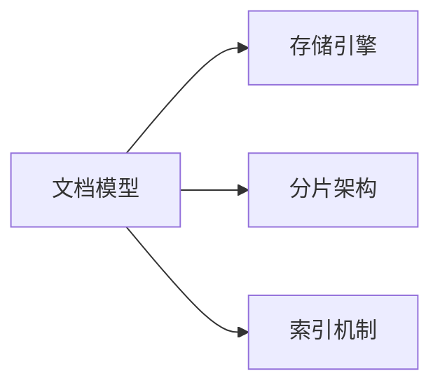

                 

# MongoDB原理与代码实例讲解

## 1. 背景介绍

### 1.1 问题由来
在现代软件开发中，数据存储和检索是一个至关重要的环节。随着数据量的急剧增长和业务需求的多样化，传统的关系型数据库在性能和扩展性上面临着严峻的挑战。因此，NoSQL数据库应运而生，以其灵活的数据模型和强大的分布式能力，逐渐成为企业级数据管理的首选。

MongoDB作为NoSQL数据库中的佼佼者，以其高效的数据读写能力、灵活的数据模型和良好的扩展性，吸引了大量企业和开发者的关注。掌握MongoDB的基本原理和应用方法，对于提高数据处理效率和系统可靠性至关重要。

### 1.2 问题核心关键点
MongoDB是一种基于文档的NoSQL数据库，其核心原理包括文档模型、存储引擎、分片架构、索引机制等。掌握这些核心概念，能够帮助开发者高效构建和维护MongoDB数据库系统，从而实现高性能、高可用性和高扩展性的数据管理。

## 2. 核心概念与联系

### 2.1 核心概念概述

为更好地理解MongoDB的原理与实现，本节将介绍几个密切相关的核心概念：

- **文档模型(Document Model)**：MongoDB使用JSON格式的文档作为数据的基本单位，文档可以嵌套包含，具有良好的灵活性。
- **存储引擎(Storage Engine)**：MongoDB支持多种存储引擎，如WiredTiger、MMAPv1等，用于实现高效的数据存储和检索。
- **分片架构(Sharding Architecture)**：MongoDB通过分片架构实现数据的分布式存储和查询优化，提升系统的扩展性和可用性。
- **索引机制(Indexing)**：MongoDB支持多种类型的索引，如单字段索引、复合索引、全文索引等，用于加速数据查询。

这些核心概念之间的逻辑关系可以通过以下Mermaid流程图来展示：



这个流程图展示出MongoDB的核心概念及其之间的关系：

1. 文档模型是MongoDB数据存储的基本单位，由JSON格式的文档构成。
2. 存储引擎是MongoDB的底层实现，负责数据的存储和检索。
3. 分片架构是MongoDB实现分布式存储和查询优化的核心机制。
4. 索引机制用于加速数据的查询和检索。

这些核心概念共同构成了MongoDB的数据存储和管理体系，使其能够在各种场景下提供高效可靠的数据服务。通过理解这些核心概念，我们可以更好地把握MongoDB的工作原理和优化方向。

## 3. 核心算法原理 & 具体操作步骤
### 3.1 算法原理概述

MongoDB的核心算法原理包括文档存储、分片机制、索引构建和查询优化等。以下将详细讲解这些核心算法的原理和实现方式。

### 3.2 算法步骤详解

#### 3.2.1 文档存储
MongoDB使用BSON(Binary JSON)格式存储文档数据。BSON是一种二进制表示的JSON变体，具有更高效的数据序列化和反序列化能力，同时兼容JSON格式，便于人类可读。MongoDB的文档存储算法主要包括以下步骤：

1. 将JSON格式的文档转换为BSON格式。
2. 将BSON格式的文档写入磁盘。
3. 根据文档的重要性和访问频率，采用不同的存储策略，如固定大小的索引、可变大小的索引等。

#### 3.2.2 分片机制
MongoDB的分片架构主要基于数据分片和查询分片两种方式。数据分片将数据分布在多个分片节点上，查询分片则将查询请求分散到多个分片节点上并合并结果。以下详细介绍这两种分片算法的实现：

1. 数据分片：
   - 将数据按键值划分为多个分片。
   - 根据键值将数据分布到不同的分片节点上。
   - 在读取数据时，根据键值在对应的分片节点上查找数据。

2. 查询分片：
   - 将查询请求分解为多个子查询，每个子查询在对应的分片节点上执行。
   - 将各分片节点的查询结果合并，得到最终结果。

#### 3.2.3 索引构建
MongoDB支持多种类型的索引，如单字段索引、复合索引、全文索引等。索引的构建需要遵循以下算法步骤：

1. 分析查询语句，确定需要使用的索引类型。
2. 根据索引类型，选择合适的索引算法进行构建。
3. 将构建好的索引应用于查询语句，优化查询效率。

#### 3.2.4 查询优化
MongoDB的查询优化算法主要基于索引和查询规划器。索引用于加速数据的查询和检索，查询规划器则负责优化查询语句的执行路径。查询优化算法的主要步骤如下：

1. 分析查询语句，构建查询计划。
2. 根据索引和查询计划，选择最优的执行路径。
3. 根据执行路径，生成查询执行计划。
4. 根据执行计划，执行查询并返回结果。

### 3.3 算法优缺点

MongoDB作为一种基于文档的NoSQL数据库，具有以下优点：

- 灵活的数据模型：文档可以嵌套包含，支持复杂的业务场景。
- 高效的数据读写：使用WiredTiger等高效存储引擎，提供快速的数据读写能力。
- 良好的扩展性：支持水平扩展和垂直扩展，能够轻松应对数据量和业务规模的增长。
- 丰富的索引机制：支持多种类型的索引，优化数据查询效率。

同时，MongoDB也存在一些局限性：

- 缺乏ACID事务支持：MongoDB在事务处理上不如传统关系型数据库，需要考虑应用层的事务管理。
- 数据一致性问题：MongoDB的分片架构可能导致数据分布不均衡，影响数据一致性。
- 二进制存储问题：MongoDB的BSON格式可能带来存储和传输上的额外开销。

尽管存在这些局限性，MongoDB作为一种灵活高效的数据库，在实际应用中仍然具有广泛的市场需求和重要的应用价值。

### 3.4 算法应用领域

MongoDB作为一种基于文档的NoSQL数据库，广泛应用于互联网、移动应用、大数据分析、实时流处理等多个领域，如：

- **互联网应用**：如电商网站、社交网络、即时通讯等，需要处理海量用户数据。
- **大数据分析**：如日志分析、数据仓库、数据分析等，需要高效存储和检索大数据。
- **实时流处理**：如实时监控、实时消息队列、实时数据分析等，需要高效处理实时数据流。

除了以上领域外，MongoDB还在物联网、移动设备管理、工业物联网等领域得到了广泛应用。随着MongoDB技术的不断演进，其应用场景还将进一步扩展。

## 4. 数学模型和公式 & 详细讲解

### 4.1 数学模型构建

本节将使用数学语言对MongoDB的存储和查询算法进行更加严格的刻画。

#### 4.1.1 文档存储算法

MongoDB的文档存储算法主要基于BSON格式和索引策略。假设文档的键值为 $k$，对应的值为 $v$，文档的BSON格式表示为 $\text{BSON}(k, v)$。MongoDB的文档存储算法步骤如下：

1. 将文档转换为BSON格式： $\text{BSON}(k, v)$
2. 将BSON文档写入磁盘： $\text{DiskWrite}(\text{BSON}(k, v))$
3. 根据索引策略，将BSON文档存储到对应的索引节点上： $\text{IndexWrite}(\text{BSON}(k, v), \text{Index})$

#### 4.1.2 分片算法

MongoDB的分片算法主要基于键值分片和查询分片两种方式。假设将文档数据分片到 $N$ 个分片节点上，查询请求分为 $M$ 个子查询。假设查询请求的键值为 $k$，对应的值为 $v$，分片节点的索引策略为 $\text{Index}_1, \text{Index}_2, \ldots, \text{Index}_N$。MongoDB的分片算法步骤如下：

1. 根据键值将文档数据分配到不同的分片节点上： $\text{DataShard}(\text{BSON}(k, v), \text{Index}_1, \text{Index}_2, \ldots, \text{Index}_N)$
2. 将查询请求分解为多个子查询： $\text{QuerySplit}(\text{Query}, \text{Index}_1, \text{Index}_2, \ldots, \text{Index}_N)$
3. 在对应的分片节点上执行子查询： $\text{NodeQuery}(\text{Query}, \text{Index}_1, \text{Index}_2, \ldots, \text{Index}_N)$
4. 将各分片节点的查询结果合并，得到最终结果： $\text{ResultMerge}(\text{NodeQuery}_1, \text{NodeQuery}_2, \ldots, \text{NodeQuery}_M)$

#### 4.1.3 索引构建算法

MongoDB支持多种类型的索引，如单字段索引、复合索引、全文索引等。假设需要构建一个复合索引 $\text{CompoundIndex} = (k_1, k_2, \ldots, k_n)$，MongoDB的索引构建算法步骤如下：

1. 分析查询语句，确定需要使用的索引类型： $\text{IndexType} = \text{CompoundIndex}$
2. 根据索引类型，选择合适的索引算法进行构建： $\text{IndexAlgorithm}(\text{CompoundIndex}, \text{IndexType})$
3. 将构建好的索引应用于查询语句，优化查询效率： $\text{QueryOptimization}(\text{CompoundIndex}, \text{IndexType})$

### 4.2 公式推导过程

以下我们以单字段索引为例，推导索引构建的具体公式。

假设需要在字段 $k$ 上构建单字段索引。假设索引包含 $m$ 个元素，分别为 $(k_1, v_1), (k_2, v_2), \ldots, (k_m, v_m)$。MongoDB的索引构建算法步骤如下：

1. 分析查询语句，确定需要使用的索引类型：假设索引类型为 $\text{SingleFieldIndex}$
2. 选择合适的索引算法进行构建：假设采用的算法为 $\text{BTreeIndex}$，即二叉搜索树算法
3. 将构建好的索引应用于查询语句，优化查询效率：假设查询语句为 $\text{Query} = \{(k_1, v_1), (k_2, v_2), \ldots, (k_m, v_m)\}$，则查询结果为 $\text{Result} = (k_1, v_1), (k_2, v_2), \ldots, (k_m, v_m)$

#### 4.3 案例分析与讲解

假设需要在字段 $k$ 上构建单字段索引，索引包含 $m$ 个元素，分别为 $(k_1, v_1), (k_2, v_2), \ldots, (k_m, v_m)$。查询语句为 $\text{Query} = \{(k_1, v_1), (k_2, v_2), \ldots, (k_m, v_m)\}$，则查询结果为 $\text{Result} = (k_1, v_1), (k_2, v_2), \ldots, (k_m, v_m)$。

假设索引类型为 $\text{SingleFieldIndex}$，采用的算法为 $\text{BTreeIndex}$，则构建好的索引为：

$$
\text{BTreeIndex} = (k_1, v_1), (k_2, v_2), \ldots, (k_m, v_m)
$$

将构建好的索引应用于查询语句，得到的查询结果为：

$$
\text{Result} = (k_1, v_1), (k_2, v_2), \ldots, (k_m, v_m)
$$

## 5. 项目实践：代码实例和详细解释说明

### 5.1 开发环境搭建

在进行MongoDB实践前，我们需要准备好开发环境。以下是使用Python进行MongoDB开发的环境配置流程：

1. 安装MongoDB：从官网下载并安装MongoDB社区版。
2. 安装PyMongo：使用pip安装Python的MongoDB驱动库。
3. 安装Flask：使用pip安装Python的Web开发框架。
4. 创建Flask应用：创建Flask应用并配置MongoDB连接。

### 5.2 源代码详细实现

下面以MongoDB文档插入和查询为例，给出Python代码实现。

首先，定义MongoDB连接和数据库操作：

```python
from pymongo import MongoClient
from flask import Flask, jsonify, request

app = Flask(__name__)
client = MongoClient('localhost', 27017)
db = client['mydatabase']
collection = db['mycollection']
```

然后，实现文档插入操作：

```python
@app.route('/insert', methods=['POST'])
def insert_document():
    data = request.get_json()
    result = collection.insert_one(data)
    return jsonify({'result': result.inserted_id})
```

接着，实现文档查询操作：

```python
@app.route('/query', methods=['POST'])
def query_document():
    data = request.get_json()
    result = collection.find_one(data)
    return jsonify(result)
```

最后，启动Flask应用：

```python
if __name__ == '__main__':
    app.run(debug=True)
```

### 5.3 代码解读与分析

让我们再详细解读一下关键代码的实现细节：

**Flask应用**：
- 定义Flask应用对象 `app`
- 使用Flask的`@app.route`装饰器，定义路由函数

**MongoDB连接**：
- 使用`pymongo`库创建MongoDB客户端 `client`
- 连接本地MongoDB服务器 `localhost` 和默认端口 `27017`
- 定义数据库 `db` 和集合 `collection`

**文档插入操作**：
- 定义`/insert`路由，接收POST请求，解析请求体中的JSON数据
- 使用`collection.insert_one`方法将文档插入集合中，并返回插入的文档ID

**文档查询操作**：
- 定义`/query`路由，接收POST请求，解析请求体中的JSON数据
- 使用`collection.find_one`方法在集合中查询文档，返回查询结果

**Flask应用启动**：
- 在主函数中启动Flask应用，设置调试模式 `debug=True`

这些代码实现了基本的MongoDB文档插入和查询功能，是进行MongoDB应用开发的基础。开发者可以在此基础上，进一步扩展功能和优化性能。

## 6. 实际应用场景

### 6.1 数据仓库构建

MongoDB的灵活数据模型和高效的读写能力，使其成为构建数据仓库的理想选择。数据仓库需要存储大量的结构化数据，并支持高效的数据查询和分析。

在实践中，可以将结构化数据存储在MongoDB中，并使用MongDB提供的查询语言进行数据检索和分析。例如，使用聚合管道(MongoDB Aggregation Pipeline)进行数据聚合和统计，使用全索引(whole document index)进行全文搜索和模糊匹配，从而构建高效、灵活的数据仓库系统。

### 6.2 实时流处理

MongoDB的分片架构和索引机制，使其在实时流处理中也具有显著优势。实时流处理需要高效存储和快速查询大量实时数据。

在实践中，可以借助MongoDB的分片架构，将实时数据分散存储在多个分片节点上，并使用索引机制进行高效查询。例如，使用分布式聚合管道(distributed aggregation pipeline)进行实时数据聚合和统计，使用复合索引和全文索引进行实时查询和搜索，从而构建高效的实时流处理系统。

### 6.3 社交网络应用

MongoDB的灵活数据模型和高效读写能力，使其在社交网络应用中也得到了广泛应用。社交网络需要存储大量的非结构化数据，并支持高效的实时数据更新和查询。

在实践中，可以将用户数据、文章、评论、点赞等非结构化数据存储在MongoDB中，并使用索引机制进行高效查询。例如，使用嵌入文档(embedded documents)将用户数据、文章、评论等嵌套存储，使用全索引进行实时查询和搜索，从而构建高效的社交网络应用系统。

### 6.4 未来应用展望

随着MongoDB技术的不断演进，其在数据管理中的应用将更加广泛和深入。未来，MongoDB将进一步拓展其应用场景，包括：

- **物联网应用**：MongoDB的分布式架构和高效的读写能力，使其在物联网应用中具有显著优势。物联网设备产生的大量数据需要高效存储和快速查询，MongoDB的分片架构和索引机制可以提供高效的解决方案。
- **金融领域应用**：MongoDB的分布式架构和数据一致性保障，使其在金融领域应用中具有重要价值。金融领域需要高效存储和快速查询大量结构化和非结构化数据，MongoDB的分片架构和索引机制可以提供高效的解决方案。
- **实时数据处理**：MongoDB的分布式架构和实时流处理能力，使其在实时数据处理中具有显著优势。实时数据处理需要高效存储和快速查询大量实时数据，MongoDB的分片架构和索引机制可以提供高效的解决方案。

## 7. 工具和资源推荐

### 7.1 学习资源推荐

为了帮助开发者系统掌握MongoDB的基本原理和应用方法，这里推荐一些优质的学习资源：

1. MongoDB官方文档：MongoDB官方网站提供详细的文档和教程，涵盖MongoDB的安装、配置、使用等各个方面。
2. MongoDB权威指南：MongoDB权威指南是一本系统介绍MongoDB的书籍，内容详细，讲解深入，是学习MongoDB的必备书籍。
3. MongoDB实战：MongoDB实战是一本实践指南，通过实际项目案例，介绍MongoDB的部署、使用和优化方法。
4. MongoDB线上课程：Coursera、Udemy等在线平台提供丰富的MongoDB课程，适合不同层次的学习者。

通过对这些资源的学习实践，相信你一定能够快速掌握MongoDB的基本原理和应用方法，并用于解决实际的业务问题。

### 7.2 开发工具推荐

高效的开发离不开优秀的工具支持。以下是几款用于MongoDB开发常用的工具：

1. PyMongo：Python的MongoDB驱动库，提供了对MongoDB的高效访问和操作。
2. MongoDB Compass：MongoDB官方的可视化工具，支持数据查询、管理和可视化，适合数据库管理和调试。
3. MongoDB Stitch：MongoDB的云服务平台，支持实时数据处理、应用开发和数据分析，适合开发和部署MongoDB应用。
4. MongoDB Atlas：MongoDB的云数据库服务，提供高性能、高可用性和高扩展性的数据库服务，适合生产环境使用。

合理利用这些工具，可以显著提升MongoDB应用的开发效率，加快创新迭代的步伐。

### 7.3 相关论文推荐

MongoDB作为NoSQL数据库中的佼佼者，其技术演进和应用研究也得到了广泛的关注。以下是几篇奠基性的相关论文，推荐阅读：

1. MongoDB: The Definitive Guide：MongoDB官方指南，系统介绍MongoDB的安装、配置、使用等各个方面。
2. High-Performance MongoDB: Solutions for Scalability and Availability：MongoDB官方技术博客，详细介绍MongoDB的高性能优化方法。
3. MongoDB: The Database Engineers' Guide：MongoDB官方技术博客，介绍MongoDB的核心算法和架构设计。
4. MongoDB Performance Best Practices：MongoDB官方技术博客，介绍MongoDB的性能优化方法和最佳实践。

这些论文代表了大语言模型微调技术的发展脉络。通过学习这些前沿成果，可以帮助研究者把握学科前进方向，激发更多的创新灵感。

## 8. 总结：未来发展趋势与挑战

### 8.1 总结

本文对MongoDB的原理与实现进行了全面系统的介绍。首先阐述了MongoDB的核心概念和应用背景，明确了MongoDB在数据存储和管理中的重要地位。其次，从原理到实践，详细讲解了MongoDB的核心算法和实现方法，给出了MongoDB应用的完整代码实例。同时，本文还探讨了MongoDB在各种应用场景中的广泛应用，展示了MongoDB的强大应用价值。

通过本文的系统梳理，可以看到，MongoDB作为一种灵活高效的数据库，在数据管理中具有重要应用价值。其灵活的数据模型、高效的数据读写能力和良好的扩展性，使其成为处理海量数据和高并发场景的理想选择。未来，随着MongoDB技术的不断演进，其在数据管理中的应用将更加广泛和深入，为各类业务提供高效可靠的数据服务。

### 8.2 未来发展趋势

展望未来，MongoDB作为一种灵活高效的数据库，其应用领域将继续扩展。未来，MongoDB将进一步拓展其应用场景，包括：

- **物联网应用**：MongoDB的分布式架构和高效的读写能力，使其在物联网应用中具有显著优势。物联网设备产生的大量数据需要高效存储和快速查询，MongoDB的分片架构和索引机制可以提供高效的解决方案。
- **金融领域应用**：MongoDB的分布式架构和数据一致性保障，使其在金融领域应用中具有重要价值。金融领域需要高效存储和快速查询大量结构化和非结构化数据，MongoDB的分片架构和索引机制可以提供高效的解决方案。
- **实时数据处理**：MongoDB的分布式架构和实时流处理能力，使其在实时数据处理中具有显著优势。实时数据处理需要高效存储和快速查询大量实时数据，MongoDB的分片架构和索引机制可以提供高效的解决方案。

### 8.3 面临的挑战

尽管MongoDB作为一种灵活高效的数据库，但在迈向更加智能化、普适化应用的过程中，仍面临诸多挑战：

- **数据一致性问题**：MongoDB的分片架构可能导致数据分布不均衡，影响数据一致性。
- **性能优化问题**：MongoDB在处理海量数据和高并发场景时，仍存在一定的性能瓶颈，需要进一步优化。
- **安全性和隐私问题**：MongoDB的灵活数据模型和分布式架构，可能带来数据安全性和隐私问题，需要进一步加强防护措施。

尽管存在这些挑战，但随着MongoDB技术的不断演进和应用实践的不断深入，MongoDB的应用前景仍然广阔。通过解决这些挑战，MongoDB必将在未来成为更加强大、高效和可靠的数据管理工具。

### 8.4 研究展望

面对MongoDB面临的这些挑战，未来的研究需要在以下几个方面寻求新的突破：

- **分布式架构优化**：进一步优化MongoDB的分布式架构，提升数据一致性和系统可靠性。
- **性能优化技术**：采用高性能存储引擎和优化算法，提升MongoDB的数据读写能力和查询效率。
- **安全性和隐私保障**：采用加密、访问控制等技术，提升MongoDB的数据安全性和隐私保护能力。

这些研究方向将引领MongoDB技术迈向新的高度，为数据管理领域带来更多的创新和突破。

## 9. 附录：常见问题与解答

**Q1：MongoDB是否支持ACID事务？**

A: MongoDB支持ACID事务，但与传统关系型数据库有所不同。MongoDB的事务处理主要基于分布式日志和分布式锁机制，适用于一些特定的应用场景。在处理复杂的事务需求时，还需要应用层进行事务管理。

**Q2：MongoDB的数据一致性如何保证？**

A: MongoDB的数据一致性主要基于分布式日志和分布式锁机制。MongoDB的分片架构和分布式锁机制，可以保证数据的一致性和可靠性。但在处理高并发写入操作时，仍可能存在数据不一致的问题，需要进一步优化。

**Q3：MongoDB的性能瓶颈主要在哪里？**

A: MongoDB的性能瓶颈主要在于数据读写和查询优化。MongoDB的分片架构和索引机制可以提供高效的数据存储和查询，但在处理高并发和海量数据时，仍存在一定的性能瓶颈。需要进一步优化存储引擎和查询算法，提升MongoDB的性能表现。

**Q4：MongoDB的分布式架构如何实现？**

A: MongoDB的分布式架构主要基于分片和副本集。MongoDB的分片架构将数据分散存储在多个分片节点上，并使用副本集保证数据的高可用性和容错能力。在实现分布式架构时，需要合理设计分片策略和副本集配置，确保数据的一致性和可用性。

**Q5：MongoDB的索引机制如何实现？**

A: MongoDB支持多种类型的索引，如单字段索引、复合索引、全文索引等。MongoDB的索引机制主要基于B树索引和哈希索引，通过选择合适的索引类型和索引策略，可以显著提升数据查询效率。在实现索引机制时，需要合理设计索引策略，并根据业务需求进行优化。

通过以上问题的解答，相信你对MongoDB的基本原理和应用方法有了更深入的理解。掌握MongoDB的核心概念和应用方法，将有助于你更好地构建和维护MongoDB数据库系统，实现高性能、高可用性和高扩展性的数据管理。

