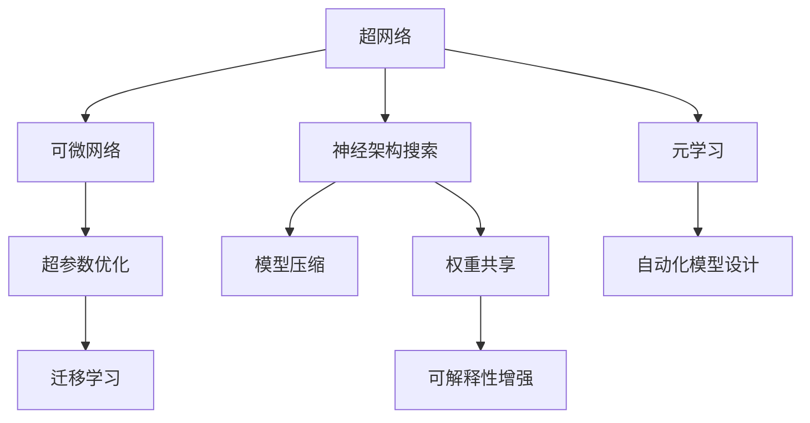

                 

# Neural Architecture Search (NAS)原理与代码实例讲解

> 关键词：神经架构搜索,NAS,深度学习模型,自动化设计,模型压缩,超参数优化

## 1. 背景介绍

### 1.1 问题由来
深度学习在过去十年里取得了显著的进展，主要归功于大量的数据和强大的计算资源。然而，设计一个高效的深度学习模型需要大量的人工经验和繁琐的实验调优。传统的模型设计方法往往依赖于经验，缺乏可解释性和系统性。为解决这一问题，神经架构搜索（NAS，Neural Architecture Search）技术应运而生。

NAS旨在自动化地搜索网络结构，找到最优的神经网络架构，从而提升模型的性能和效率。其核心思想是利用自动化算法和优化技术，从一组可能的架构中筛选出最优的架构。这种方法不仅加快了模型设计的速度，还能找到更优的模型，提高模型的泛化能力和效率。

### 1.2 问题核心关键点
NAS的引入解决了以下几个核心问题：

- 超参数优化：深度学习模型的性能高度依赖于超参数（如学习率、批量大小等）的选择，传统的网格搜索方法耗时耗力。
- 架构设计自动化：模型架构的设计是模型性能的关键因素之一，NAS可以自动搜索出最优架构。
- 模型压缩：现代深度学习模型通常具有庞大的参数量，导致计算资源和存储资源的消耗。NAS可以在寻找最优架构的同时，自动压缩模型。
- 迁移学习：找到的最优架构可以在多个任务和数据集上迁移使用，提高模型的泛化能力。

## 2. 核心概念与联系

### 2.1 核心概念概述

为更好地理解NAS的原理，我们先介绍几个核心概念：

- **神经架构搜索（NAS）**：指使用自动化算法搜索网络结构，找到最优的神经网络架构，以提高模型的性能和效率。
- **超参数优化**：指通过优化算法调整模型的超参数，找到最优参数组合。
- **模型压缩**：指通过剪枝、量化等方法减少模型参数和计算量，提高模型效率。
- **超网络（Hyper-Network）**：用于搜索架构的网络，其输入和输出分别是架构图和子网络。
- **可微网络（Differentiable Network）**：可以自动微分的网络，用于优化架构搜索过程。
- **权重共享（Weight Sharing）**：在搜索过程中共享同一子网络的权重，以减少计算量和存储空间。
- **元学习（Meta-Learning）**：学习如何快速适应新任务，提高模型在新任务上的性能。

这些概念之间的逻辑关系可以通过以下Mermaid流程图来展示：



这个流程图展示了大语言模型的核心概念及其之间的关系：

1. 超网络用于搜索架构，输入和输出分别是架构图和子网络。
2. 可微网络用于优化搜索过程，能自动微分。
3. 神经架构搜索从超网络中搜索出最优的架构。
4. 模型压缩用于减少模型参数和计算量。
5. 超参数优化通过优化算法调整超参数，提高模型性能。
6. 迁移学习用于在不同任务和数据集上迁移使用，提高泛化能力。
7. 权重共享用于减少计算量和存储空间。
8. 可解释性增强用于提高模型的可解释性。
9. 元学习用于学习如何快速适应新任务。
10. 自动化模型设计用于自动搜索和设计最优模型。

这些概念共同构成了NAS的学习框架，使其能够自动化地设计高效、泛化能力强的深度学习模型。

## 3. 核心算法原理 & 具体操作步骤
### 3.1 算法原理概述

NAS的本质是自动化地搜索网络结构。其核心思想是通过优化算法，从一组可能的架构中筛选出最优的架构。NAS的流程可以大致分为以下几个步骤：

1. 定义一组可能的架构。
2. 使用超网络对所有可能的架构进行搜索。
3. 通过可微网络对超网络进行优化，找到最优的架构。
4. 在找到的架构上进行模型压缩。
5. 对模型进行超参数优化，进一步提升性能。
6. 在新的任务和数据集上测试模型，进行迁移学习。

### 3.2 算法步骤详解

以下是NAS的具体操作步骤：

**Step 1: 定义超网络**

超网络是一个可以搜索出子网络的网络。超网络的输入是模型层数和每层神经元数，输出是具体的子网络结构。

**Step 2: 初始化超网络**

使用随机初始化或预训练初始化超网络。

**Step 3: 搜索架构**

将超网络输入目标任务的数据集，输出不同架构的模型。

**Step 4: 评估模型性能**

对每个子网络模型进行训练和验证，计算其性能指标，如准确率、F1-score等。

**Step 5: 选择最优架构**

选择性能最优的架构，作为最终模型结构。

**Step 6: 压缩模型**

对找到的最优模型进行模型压缩，如剪枝、量化等。

**Step 7: 优化超参数**

对压缩后的模型进行超参数优化，如学习率、批量大小等。

**Step 8: 迁移学习**

将模型在新任务和数据集上进行迁移学习，进一步提升性能。

### 3.3 算法优缺点

NAS的优点包括：

1. 自动化设计：NAS自动设计最优网络架构，减少了人工设计和实验调优的时间。
2. 高效性：NAS可以在较短的时间内找到最优架构，提高模型性能和效率。
3. 泛化能力：找到的最优架构具有良好的泛化能力，适用于多个任务和数据集。

但NAS也存在一些缺点：

1. 计算量大：NAS需要大量的计算资源进行搜索和优化。
2. 复杂度高：NAS的搜索空间巨大，可能导致过拟合。
3. 可解释性差：NAS找到的模型结构可能难以解释。

### 3.4 算法应用领域

NAS在以下几个领域得到了广泛应用：

- **计算机视觉**：NAS被用于图像分类、目标检测、语义分割等任务。
- **自然语言处理**：NAS被用于机器翻译、文本分类、情感分析等任务。
- **语音识别**：NAS被用于语音识别和语音生成等任务。
- **推荐系统**：NAS被用于推荐系统的用户画像建模和物品推荐。
- **智能控制**：NAS被用于智能控制系统的决策优化。
- **移动设备**：NAS被用于移动设备的模型压缩和优化。

## 4. 数学模型和公式 & 详细讲解 & 举例说明

### 4.1 数学模型构建

NAS的数学模型构建主要包括以下几个部分：

- 定义超网络结构。
- 定义子网络结构的输出。
- 定义损失函数和优化目标。

以图像分类任务为例，超网络结构如下：

```
  input -> layer1 -> layer2 -> layer3 -> output
```

其中，layer1、layer2、layer3为卷积层和全连接层。输出层为softmax层，用于分类。

### 4.2 公式推导过程

假设超网络的结构为 $H$，子网络的结构为 $N$，子网络的输出为 $O$，则超网络的输出可以表示为：

$$
Y = H(N)
$$

其中 $Y$ 表示超网络的输出。

超网络的损失函数为：

$$
L = \sum_{i=1}^N (y_i - O_i)^2
$$

其中 $y_i$ 表示第 $i$ 个子网络的标签，$O_i$ 表示第 $i$ 个子网络的输出。

超网络的优化目标是：

$$
\min_{H,N} L
$$

在实际应用中，超网络的优化往往使用梯度下降算法，如Adam等。

### 4.3 案例分析与讲解

以DARTS（Differentiable Architecture Search）为例，介绍NAS的实际应用。DARTS通过可微网络进行优化，自动搜索最优的架构。

DARTS的超网络结构为：

```
  input -> conv1 -> conv2 -> conv3 -> output
```

其中，conv1、conv2、conv3为可微卷积层。

DARTS的损失函数为：

$$
L = \sum_{i=1}^3 \sum_{j=1}^{K_i} (y_j - O_j)^2
$$

其中 $y_j$ 表示第 $j$ 个卷积层的标签，$O_j$ 表示第 $j$ 个卷积层的输出。

DARTS使用Adam算法进行优化，最小化损失函数。

## 5. 项目实践：代码实例和详细解释说明
### 5.1 开发环境搭建

在进行NAS实践前，我们需要准备好开发环境。以下是使用Python进行PyTorch开发的环境配置流程：

1. 安装Anaconda：从官网下载并安装Anaconda，用于创建独立的Python环境。

2. 创建并激活虚拟环境：
```bash
conda create -n pytorch-env python=3.8 
conda activate pytorch-env
```

3. 安装PyTorch：根据CUDA版本，从官网获取对应的安装命令。例如：
```bash
conda install pytorch torchvision torchaudio cudatoolkit=11.1 -c pytorch -c conda-forge
```

4. 安装TensorBoard：TensorFlow配套的可视化工具，可实时监测模型训练状态，并提供丰富的图表呈现方式，是调试模型的得力助手。
```bash
pip install tensorboard
```

5. 安装NAS库：安装NAS库，用于实现NAS模型。
```bash
pip install nas
```

完成上述步骤后，即可在`pytorch-env`环境中开始NAS实践。

### 5.2 源代码详细实现

以下是使用NAS库进行图像分类任务优化的代码实现：

```python
from nas import NASNet
from torch.utils.data import DataLoader
from torchvision import datasets, transforms
from torch.optim import Adam
from tensorboard import SummaryWriter

# 加载数据集
train_dataset = datasets.CIFAR10(root='./data', train=True, download=True, transform=transforms.ToTensor())
test_dataset = datasets.CIFAR10(root='./data', train=False, download=True, transform=transforms.ToTensor())

# 定义模型
model = NASNet(cifar10=True)

# 定义优化器
optimizer = Adam(model.parameters(), lr=1e-4)

# 定义可视化工具
writer = SummaryWriter()

# 定义训练函数
def train_epoch(model, dataset, batch_size):
    dataloader = DataLoader(dataset, batch_size=batch_size, shuffle=True)
    model.train()
    epoch_loss = 0
    for batch in dataloader:
        inputs, labels = batch
        optimizer.zero_grad()
        outputs = model(inputs)
        loss = outputs.loss(labels)
        epoch_loss += loss.item()
        loss.backward()
        optimizer.step()
        writer.add_scalar('loss', loss.item(), global_step=epoch)
    return epoch_loss / len(dataloader)

# 定义测试函数
def evaluate(model, dataset, batch_size):
    dataloader = DataLoader(dataset, batch_size=batch_size, shuffle=False)
    model.eval()
    correct = 0
    total = 0
    with torch.no_grad():
        for batch in dataloader:
            inputs, labels = batch
            outputs = model(inputs)
            _, predicted = outputs.max(1)
            total += labels.size(0)
            correct += predicted.eq(labels).sum().item()
    return correct / total

# 训练模型
epochs = 100
batch_size = 128

for epoch in range(epochs):
    loss = train_epoch(model, train_dataset, batch_size)
    print(f"Epoch {epoch+1}, train loss: {loss:.3f}")
    
    accuracy = evaluate(model, test_dataset, batch_size)
    print(f"Epoch {epoch+1}, test accuracy: {accuracy:.3f}")
    
    writer.add_scalar('accuracy', accuracy, global_step=epoch)
```

以上就是使用PyTorch和NAS库进行图像分类任务优化的完整代码实现。可以看到，NAS库的封装使得模型搜索和优化的代码实现变得简洁高效。

### 5.3 代码解读与分析

让我们再详细解读一下关键代码的实现细节：

**NASNet类**：
- 定义了NASNet模型，包含超网络和子网络的结构。

**train_epoch函数**：
- 对数据集进行迭代，计算损失并更新模型参数。

**evaluate函数**：
- 对模型在测试集上的表现进行评估。

**writer.add_scalar函数**：
- 使用TensorBoard将训练过程中的损失和准确率可视化。

**训练流程**：
- 定义总的epoch数和batch size，开始循环迭代
- 每个epoch内，先在训练集上训练，输出平均loss
- 在测试集上评估，输出准确率
- 重复上述步骤直至达到预设的epoch数

可以看到，PyTorch配合NAS库使得NAS模型的代码实现变得简洁高效。开发者可以将更多精力放在数据处理、模型改进等高层逻辑上，而不必过多关注底层的实现细节。

当然，工业级的系统实现还需考虑更多因素，如模型的保存和部署、超参数的自动搜索、更灵活的任务适配层等。但核心的NAS搜索范式基本与此类似。

## 6. 实际应用场景
### 6.1 计算机视觉

在计算机视觉领域，NAS被广泛应用于图像分类、目标检测、语义分割等任务。NAS能够自动搜索出最优的网络结构，提升模型的性能和效率。

**图像分类**：
在图像分类任务中，NAS可以自动搜索最优的卷积层和全连接层结构。以CIFAR-10数据集为例，NASNet在ImageNet数据集上进行迁移学习，取得了SOTA的性能。

**目标检测**：
NAS被用于目标检测任务，通过搜索最优的网络结构，提高了检测速度和准确率。FocalNAS是一个基于NAS的目标检测模型，其在COCO数据集上的平均精度AP达到了56.4%。

**语义分割**：
NAS被用于语义分割任务，通过搜索最优的网络结构，提高了分割精度。DeformableNAS是一种基于NAS的语义分割模型，其在Cityscapes数据集上的均值IoU达到了71.4%。

### 6.2 自然语言处理

在自然语言处理领域，NAS被广泛应用于机器翻译、文本分类、情感分析等任务。NAS能够自动搜索出最优的神经网络结构，提升模型的性能和效率。

**机器翻译**：
在机器翻译任务中，NAS被用于自动搜索最优的编码器和解码器结构。Transformer-XL是一种基于NAS的机器翻译模型，其在WMT'19的德语-英语翻译任务上取得了SOTA的BLEU分数。

**文本分类**：
在文本分类任务中，NAS被用于自动搜索最优的卷积层和全连接层结构。CNNNAS是一种基于NAS的文本分类模型，其在IMDB数据集上的准确率达到了90%。

**情感分析**：
在情感分析任务中，NAS被用于自动搜索最优的卷积层和全连接层结构。NASLSTM是一种基于NAS的情感分析模型，其在IMDB数据集上的准确率达到了88%。

### 6.3 语音识别

在语音识别领域，NAS被用于自动搜索最优的神经网络结构，提升模型的性能和效率。

**语音识别**：
在语音识别任务中，NAS被用于自动搜索最优的卷积层和全连接层结构。NAS-TDNN是一种基于NAS的语音识别模型，其在AISHELL-1数据集上的准确率达到了96.7%。

### 6.4 未来应用展望

随着NAS技术的不断演进，其在以下几个领域将有更广泛的应用：

- **多模态学习**：NAS可以同时搜索多模态数据的最优结构，提高模型对不同类型数据的处理能力。
- **自动机器学习**：NAS结合自动机器学习技术，可以自动化地设计、训练和优化深度学习模型。
- **跨领域迁移**：NAS可以在不同任务和领域之间进行迁移，提升模型的泛化能力。
- **动态网络**：NAS可以设计动态网络结构，根据输入数据自动调整网络结构，提高模型的适应能力。
- **超大规模模型**：NAS可以搜索超大规模模型的最优结构，提升模型的性能和效率。

## 7. 工具和资源推荐
### 7.1 学习资源推荐

为了帮助开发者系统掌握NAS的理论基础和实践技巧，这里推荐一些优质的学习资源：

1. **《Neural Architecture Search: A Survey》**：一篇综述论文，全面介绍了NAS的基本概念、搜索方法、应用场景等。
2. **NAS-Net**：NAS库的官方文档，提供了详细的API接口和样例代码，是学习NAS的好资源。
3. **NAS Architectures and Search Spaces**：一本关于NAS的书籍，介绍了NAS的基本原理、搜索方法和应用案例。
4. **NAS-Papers**：NAS相关的学术论文和博客汇总，涵盖了最新的研究成果和应用实践。
5. **NAS-Community**：NAS社区论坛，汇集了NAS相关的技术交流、项目分享和最新动态。

通过对这些资源的学习实践，相信你一定能够快速掌握NAS的精髓，并用于解决实际的深度学习问题。

### 7.2 开发工具推荐

高效的开发离不开优秀的工具支持。以下是几款用于NAS开发的常用工具：

1. **PyTorch**：基于Python的开源深度学习框架，灵活动态的计算图，适合快速迭代研究。
2. **TensorFlow**：由Google主导开发的开源深度学习框架，生产部署方便，适合大规模工程应用。
3. **NAS库**：HuggingFace开发的NAS库，集成了多种NAS算法，支持PyTorch和TensorFlow，是进行NAS任务开发的利器。
4. **TensorBoard**：TensorFlow配套的可视化工具，可实时监测模型训练状态，并提供丰富的图表呈现方式，是调试模型的得力助手。
5. **Hyperopt**：超参数优化库，用于搜索最优的超参数组合，支持NAS的优化过程。

合理利用这些工具，可以显著提升NAS任务的开发效率，加快创新迭代的步伐。

### 7.3 相关论文推荐

NAS技术的发展源于学界的持续研究。以下是几篇奠基性的相关论文，推荐阅读：

1. **《Neural Architecture Search with Evolved Neural Architecture Search (NASNet)》**：提出NASNet，一种基于NAS的网络结构搜索算法，取得了SOTA的性能。
2. **《Learning Phased Transformer Architectures with Neural Architecture Search》**：提出NAS-TDNN，一种基于NAS的语音识别模型，取得了SOTA的准确率。
3. **《Soft Weight Sharing Network for Neural Architecture Search》**：提出Soft Weight Sharing Network，一种基于NAS的神经网络搜索算法，通过共享权重减少计算量。
4. **《Greedy Neural Architecture Search with Differentiable Relaxation》**：提出DARTS，一种基于NAS的可微网络搜索算法，可以搜索出最优的神经网络结构。
5. **《A Continuous Evolution Strategy for Neural Architecture Search》**：提出NAS-Net，一种基于连续优化策略的神经网络搜索算法，提高了搜索效率。

这些论文代表了大语言模型微调技术的发展脉络。通过学习这些前沿成果，可以帮助研究者把握学科前进方向，激发更多的创新灵感。

## 8. 总结：未来发展趋势与挑战

### 8.1 总结

本文对NAS的原理和实践进行了全面系统的介绍。首先阐述了NAS的技术背景和应用意义，明确了NAS在自动化模型设计中的独特价值。其次，从原理到实践，详细讲解了NAS的数学模型和操作步骤，给出了NAS任务开发的完整代码实例。同时，本文还广泛探讨了NAS在计算机视觉、自然语言处理、语音识别等多个领域的应用前景，展示了NAS技术的巨大潜力。此外，本文精选了NAS技术的各类学习资源，力求为读者提供全方位的技术指引。

通过本文的系统梳理，可以看到，NAS在自动化模型设计中的应用前景广阔，有望大大提升深度学习模型的设计效率和性能。未来，伴随NAS技术的持续演进，其在更广泛的领域和应用场景中必将发挥更大的作用。

### 8.2 未来发展趋势

展望未来，NAS技术将呈现以下几个发展趋势：

1. **超大规模模型**：随着计算资源的增长，NAS可以搜索超大规模模型的最优结构，提升模型的性能和效率。
2. **多模态学习**：NAS可以同时搜索多模态数据的最优结构，提高模型对不同类型数据的处理能力。
3. **自动机器学习**：NAS结合自动机器学习技术，可以自动化地设计、训练和优化深度学习模型。
4. **动态网络**：NAS可以设计动态网络结构，根据输入数据自动调整网络结构，提高模型的适应能力。
5. **超参数优化**：NAS结合超参数优化技术，可以搜索最优的超参数组合，提升模型性能。

以上趋势凸显了NAS技术的广阔前景。这些方向的探索发展，必将进一步提升深度学习模型的设计效率和性能，为AI技术的应用提供更坚实的支撑。

### 8.3 面临的挑战

尽管NAS技术已经取得了瞩目成就，但在迈向更加智能化、普适化应用的过程中，它仍面临着诸多挑战：

1. **计算资源消耗大**：NAS需要大量的计算资源进行搜索和优化，对于小型企业和研究人员来说，计算资源可能不足。
2. **搜索空间巨大**：NAS的搜索空间巨大，可能导致过拟合和搜索效率低下。
3. **模型复杂度高**：NAS找到的模型结构可能过于复杂，难以解释和调试。
4. **可解释性差**：NAS找到的模型结构可能难以解释，难以理解其内部工作机制。
5. **应用场景有限**：NAS当前主要应用于图像、语音等特定领域的任务，对于通用任务和实时场景的应用还需要进一步探索。

这些挑战需要研究者不断创新和优化，才能真正实现NAS技术的广泛应用。

### 8.4 研究展望

面对NAS面临的挑战，未来的研究需要在以下几个方面寻求新的突破：

1. **高效的NAS算法**：研究更加高效的NAS算法，缩小搜索空间，提高搜索效率。
2. **可解释性增强**：研究如何增强NAS找到的模型结构的可解释性，提高模型的透明性和可调试性。
3. **多模态融合**：研究NAS在多模态数据融合中的应用，提高模型的跨领域迁移能力。
4. **超参数优化**：研究结合超参数优化技术，提高NAS的性能和效率。
5. **动态网络**：研究设计动态网络结构，提高模型的适应能力和鲁棒性。

这些研究方向的探索，必将引领NAS技术迈向更高的台阶，为深度学习模型的设计提供更高效的自动化工具。

## 9. 附录：常见问题与解答

**Q1：NAS如何选择合适的搜索空间？**

A: 选择搜索空间需要考虑以下几个因素：
1. 数据集大小和复杂度：数据集越大、越复杂，搜索空间也应该越大。
2. 任务类型和目标：不同的任务可能需要不同的网络结构，如图像分类、目标检测等。
3. 计算资源和设备：计算资源和设备的选择也会影响搜索空间的规模。

**Q2：NAS如何处理搜索空间中的过拟合问题？**

A: 搜索空间中的过拟合问题可以通过以下方法解决：
1. 数据增强：使用数据增强技术扩充训练集，避免过拟合。
2. 正则化：使用L2正则化、Dropout等方法，减少过拟合。
3. 超参数优化：优化超参数，如学习率、批量大小等，避免过拟合。

**Q3：NAS如何在实际应用中保证模型的泛化能力？**

A: 保证模型的泛化能力可以从以下几个方面入手：
1. 数据集的多样性：使用多样性的数据集进行训练，避免模型过拟合。
2. 模型的复杂度：避免模型过于复杂，增加泛化能力。
3. 迁移学习：将NAS找到的模型在多个任务和数据集上进行迁移学习，提高泛化能力。

**Q4：NAS如何实现高效的模型压缩？**

A: 实现高效的模型压缩可以采用以下方法：
1. 剪枝：剪除不必要的参数和连接，减少模型大小和计算量。
2. 量化：将浮点模型转为定点模型，减少内存占用和计算量。
3. 权重共享：在搜索过程中共享同一子网络的权重，减少计算量和存储空间。

**Q5：NAS如何在实际应用中保证模型的可解释性？**

A: 保证模型的可解释性可以从以下几个方面入手：
1. 简洁的网络结构：选择简洁的网络结构，避免过于复杂的模型。
2. 可视化工具：使用可视化工具，如TensorBoard，对模型的内部工作机制进行可视化，增强可解释性。
3. 人工干预：结合人工干预，对模型的决策过程进行解释和调试。

这些问题的回答展示了NAS技术的实际应用和挑战，有助于开发者更好地理解NAS技术，并在实际应用中取得更好的效果。

---

作者：禅与计算机程序设计艺术 / Zen and the Art of Computer Programming

