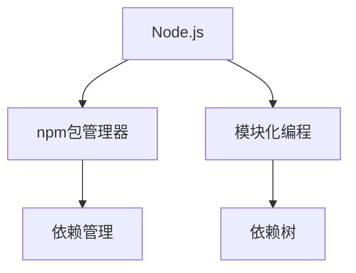

                 

# Node.js 模块化编程实践：管理大型项目和依赖

> 关键词：Node.js, 模块化编程, 依赖管理, 大型项目, npm, 模块生命周期

## 1. 背景介绍

### 1.1 问题由来
Node.js以其高效的事件驱动和非阻塞I/O模型，成为Web应用、微服务、后端API开发等领域的首选技术之一。然而，随着应用的规模不断扩大，项目的复杂度也在急剧上升。如何高效地管理大量的模块依赖、代码复用和项目维护，成为开发团队面临的一项重大挑战。

### 1.2 问题核心关键点
Node.js的模块化编程通过npm包管理机制，使得开发者可以轻松引入和维护第三方模块，但如何高效、安全地管理这些模块，确保项目的稳定性、可维护性和可扩展性，是一个复杂的系统工程。

### 1.3 问题研究意义
深入理解Node.js的模块化编程和依赖管理机制，对于构建高质量、高效率的Node.js应用，具有重要意义。模块化编程不仅能够提升代码的可维护性，还能促进代码的重用和团队协作，加速项目开发进度。

## 2. 核心概念与联系

### 2.1 核心概念概述

为更好地理解Node.js的模块化编程和依赖管理，本节将介绍几个关键概念：

- Node.js：基于Chrome V8引擎开发的JavaScript运行环境，支持异步I/O、事件驱动等特性，广泛应用于Web开发、API开发、实时通信等领域。
- 模块化编程：将应用拆分为多个独立的模块，通过npm包管理器管理模块的引入、版本控制和依赖关系。
- npm包管理器：Node.js社区维护的模块包仓库，提供海量的第三方模块和工具，简化模块引入和维护过程。
- 依赖树：描述模块之间的依赖关系，通过`package.json`文件进行配置。
- 依赖管理：在开发过程中，根据项目需求，选择和引入模块，避免重复引入，同时管理模块的版本兼容性，确保项目稳定运行。

这些概念之间的逻辑关系可以通过以下Mermaid流程图来展示：



这个流程图展示了大语言模型的核心概念及其之间的关系：

1. Node.js通过npm包管理器引入第三方模块，实现代码复用。
2. 模块化编程将应用拆分为多个独立的模块，便于代码维护和团队协作。
3. npm包管理器维护模块的依赖关系，确保模块的引用顺序和版本兼容性。
4. 依赖管理通过`package.json`文件配置项目依赖，提升项目的可维护性和可扩展性。

这些概念共同构成了Node.js模块化编程的核心，使得开发者能够高效、安全地构建和管理复杂的Node.js应用。

## 3. 核心算法原理 & 具体操作步骤
### 3.1 算法原理概述

Node.js的模块化编程和依赖管理，本质上是一个动态模块加载和依赖解析的过程。其核心思想是：

- 模块通过`require`或`import`机制加载，以动态的方式引入所需的模块依赖。
- npm包管理器在模块加载时，根据`package.json`文件中定义的依赖关系，自动下载并安装所需的模块及其依赖。
- 依赖树描述模块之间的依赖关系，通过`package.json`文件进行配置，确保模块的引用顺序和版本兼容性。

在Node.js应用中，通常会存在多层依赖关系，例如：

- 应用依赖核心模块A
- A依赖模块B
- B依赖模块C

这样的一个依赖树，可以通过`package.json`文件进行配置，确保在加载模块时，按照依赖关系自动下载和安装所需的模块。

### 3.2 算法步骤详解

Node.js模块化编程和依赖管理的核心步骤包括：

**Step 1: 初始化npm项目**

在项目根目录下运行`npm init`，按照提示填写项目信息，生成`package.json`文件。这个文件是Node.js项目的配置文件，包含了项目的依赖、脚本、发布信息等关键信息。

**Step 2: 安装模块依赖**

在项目中安装所需的模块依赖。可以通过`npm install`命令，在项目根目录下全局安装模块，也可以指定安装本地模块。例如：

```bash
npm install express
npm install --save express
```

`--save`参数会将模块依赖添加到`package.json`文件中，方便管理和维护。

**Step 3: 引入模块**

在项目代码中使用`require`或`import`语句引入所需的模块依赖。例如：

```javascript
const express = require('express');
const app = express();
```

或

```javascript
import express from 'express';
const app = express();
```

**Step 4: 处理模块依赖**

Node.js模块加载器（如Node.js内置的`fs`模块）负责解析依赖树，确保模块的引用顺序和版本兼容性。在项目代码中，无需关注具体的模块加载和解析过程，只需按照约定引入所需的模块即可。

### 3.3 算法优缺点

Node.js模块化编程和依赖管理的优点包括：

- 代码复用：通过npm包管理器引入第三方模块，实现代码复用，提升开发效率。
- 可维护性：模块化编程将应用拆分为多个独立的模块，便于代码维护和团队协作。
- 版本控制：通过`package.json`文件配置模块依赖，确保模块的引用顺序和版本兼容性，提升项目的稳定性。

然而，该方法也存在一定的局限性：

- 依赖冲突：当不同模块依赖冲突时，可能导致加载失败。
- 版本兼容性：模块的版本升级可能导致现有功能的破坏。
- 依赖链过长：多层的依赖关系可能导致加载速度变慢。

尽管存在这些局限性，但就目前而言，npm包管理器仍是管理Node.js模块依赖的最主流方式。未来相关研究的重点在于如何进一步优化依赖解析和版本控制，减少依赖冲突，提高模块加载效率，以进一步提升Node.js应用开发的效率和稳定性。

### 3.4 算法应用领域

Node.js模块化编程和依赖管理已经在Web应用、微服务、后端API开发、实时通信、数据处理等诸多领域得到了广泛的应用。具体应用场景包括：

- 网站后端：通过引入第三方模块，实现快速开发和功能增强。
- 实时通信：使用WebSocket或Socket.io模块，实现实时数据交互。
- 数据处理：使用Pandas、D3.js等模块，实现高效的数据处理和可视化。
- 微服务架构：使用HTTP请求、RESTful API等模块，实现微服务架构的构建。
- 机器学习：使用TensorFlow、scikit-learn等模块，实现机器学习应用的开发。

除了上述这些经典场景外，Node.js模块化编程和依赖管理也被创新性地应用到更多领域中，如物联网、区块链、人工智能等，为传统行业数字化转型升级提供新的技术路径。

## 4. 数学模型和公式 & 详细讲解  
### 4.1 数学模型构建

Node.js的模块化编程和依赖管理，可以通过数学模型进行建模。以下是一个简化的模块依赖模型：

- 应用依赖核心模块A
- A依赖模块B
- B依赖模块C

该模型可以表示为依赖树的形式：

```
A
 ├── B
 └── C
```

其中，A为应用模块，B和C为依赖模块。

### 4.2 公式推导过程

为了描述依赖关系，我们可以使用有向无环图(DAG)来表示模块之间的依赖关系。在DAG中，节点表示模块，有向边表示依赖关系。例如，上面的依赖树可以表示为以下DAG：

```
A
 ├── B
 └── C
```

在DAG中，可以通过拓扑排序算法，确定模块的加载顺序，避免依赖冲突。拓扑排序算法的基本思路是：

1. 从DAG中选择一个没有前驱的节点，输出该节点。
2. 从DAG中删除该节点及其所有出边。
3. 重复步骤1和2，直到DAG为空。

在Node.js中，npm包管理器会使用拓扑排序算法，确保模块的引用顺序和版本兼容性。

### 4.3 案例分析与讲解

假设我们有一个Web应用，依赖关系如下：

- 应用依赖`express`模块
- `express`依赖`body-parser`模块
- `body-parser`依赖`multer`模块

我们可以使用`package.json`文件配置这些依赖关系：

```json
{
  "name": "myapp",
  "version": "1.0.0",
  "dependencies": {
    "express": "^4.17.1",
    "body-parser": "^1.19.0",
    "multer": "^1.4.2"
  }
}
```

在应用代码中，可以按照依赖关系引入所需的模块：

```javascript
const express = require('express');
const bodyParser = require('body-parser');
const multer = require('multer');

const app = express();
app.use(bodyParser.urlencoded({ extended: true }));
app.use(multer());
```

npm包管理器会自动下载和安装所需的模块，并按照依赖关系进行加载。

## 5. 项目实践：代码实例和详细解释说明
### 5.1 开发环境搭建

在进行Node.js项目开发前，我们需要准备好开发环境。以下是使用Node.js进行项目开发的常见步骤：

1. 安装Node.js和npm：从官网下载并安装Node.js和npm。
2. 初始化npm项目：在项目根目录下运行`npm init`，按照提示填写项目信息，生成`package.json`文件。
3. 安装依赖：在项目根目录下运行`npm install`，安装所需的模块依赖。

完成上述步骤后，即可在`package.json`文件中管理项目的依赖和配置，在项目代码中使用`require`或`import`语句引入所需的模块。

### 5.2 源代码详细实现

以下是一个使用Express框架搭建Web应用的代码实例：

```javascript
const express = require('express');
const bodyParser = require('body-parser');
const multer = require('multer');
const app = express();

// 解析请求体
app.use(bodyParser.urlencoded({ extended: true }));

// 文件上传
const upload = multer();

// 路由处理
app.get('/', (req, res) => {
  res.send('Hello World!');
});

app.post('/upload', upload.single('file'), (req, res) => {
  res.send(req.file.path);
});

// 启动服务
app.listen(3000, () => {
  console.log('Server started on port 3000');
});
```

在这个示例中，我们通过`npm install`命令安装了`express`、`body-parser`和`multer`模块。在代码中，我们使用`require`语句引入了这些模块，并通过`body-parser`和`multer`模块实现了请求体解析和文件上传功能。

### 5.3 代码解读与分析

让我们再详细解读一下关键代码的实现细节：

**require语句**：
- 使用`require`语句引入所需的模块依赖。`require`语句会根据`package.json`文件中定义的依赖关系，自动下载并安装所需的模块。
- 在加载模块时，Node.js会自动解析依赖树，确保模块的引用顺序和版本兼容性。

**body-parser模块**：
- `body-parser`模块用于解析HTTP请求体，支持多种格式的请求体（如JSON、URL-encoded、multipart/form-data等）。
- 通过调用`app.use`方法，将`body-parser`模块应用于全局路由。

**multer模块**：
- `multer`模块用于处理文件上传，支持单个文件或多文件的上传。
- 通过调用`app.post`方法，实现文件上传路由，并使用`upload.single`方法处理文件上传。

**app.listen方法**：
- 使用`app.listen`方法启动HTTP服务器，监听指定端口。
- 在启动服务器时，可以在控制台上输出提示信息，记录服务器的运行状态。

通过这个代码示例，可以看到，Node.js的模块化编程和依赖管理机制，使得项目开发变得非常简单和高效。开发者只需要关注业务逻辑的实现，无需关注模块的加载和解析过程。

### 5.4 运行结果展示

运行上述代码，可以在浏览器中访问`http://localhost:3000`，看到输出`Hello World!`的信息。同时，可以通过文件上传接口，上传文件并查看上传路径。

## 6. 实际应用场景
### 6.1 大型Web应用

在大型Web应用的开发中，模块化编程和依赖管理是不可或缺的。一个大型Web应用通常包含多个模块和层次，如何高效、安全地管理这些模块，确保项目的稳定性、可维护性和可扩展性，是一个重要的系统工程。

通过npm包管理器，开发者可以轻松引入和管理第三方模块，实现代码复用和功能增强。同时，通过`package.json`文件配置项目依赖，确保模块的引用顺序和版本兼容性，提升项目的稳定性。

### 6.2 微服务架构

微服务架构是一种分布式架构风格，将应用拆分为多个独立的微服务，每个微服务运行在自己的进程中，通过RESTful API进行通信。在微服务架构中，模块化编程和依赖管理同样重要。

通过npm包管理器，开发者可以引入所需的微服务依赖，实现微服务的独立部署和更新。同时，通过`package.json`文件配置微服务依赖，确保微服务的版本兼容性和依赖关系，提升系统的稳定性和可扩展性。

### 6.3 实时通信

在实时通信应用中，如WebSocket、Socket.io等，模块化编程和依赖管理同样重要。通过npm包管理器，开发者可以引入所需的实时通信模块，实现高效的数据交互和实时推送。同时，通过`package.json`文件配置依赖关系，确保模块的引用顺序和版本兼容性，提升系统的稳定性和可扩展性。

## 7. 工具和资源推荐
### 7.1 学习资源推荐

为了帮助开发者系统掌握Node.js的模块化编程和依赖管理，这里推荐一些优质的学习资源：

1. Node.js官方文档：Node.js的官方文档，提供了全面的API文档和开发指南，是学习Node.js的重要资源。
2. npm官方文档：npm的官方文档，提供了详细的npm包管理器使用指南和命令介绍，是学习npm包管理器的必备资料。
3. Node.js设计模式：Node.js设计模式一书，深入探讨了Node.js的模块化编程和依赖管理，适合进阶学习。
4. Udemy Node.js课程：Udemy上提供的Node.js课程，覆盖了Node.js的各个方面，适合初学者和进阶学习者。
5. GitHub Node.js项目：GitHub上提供的Node.js项目，包括Web应用、API、微服务、实时通信等多个领域的实践案例，适合学习和参考。

通过对这些资源的学习实践，相信你一定能够快速掌握Node.js的模块化编程和依赖管理，并用于解决实际的开发问题。

### 7.2 开发工具推荐

Node.js的模块化编程和依赖管理，离不开工具的支持。以下是几款用于Node.js开发的工具：

1. VS Code：微软提供的开发环境，支持丰富的Node.js插件和扩展，适合Node.js开发。
2. WebStorm：JetBrains提供的开发环境，支持Node.js、React、Angular等多个开发环境，适合Web应用开发。
3. npm：npm包管理器，用于管理项目的依赖和配置，是Node.js开发的核心工具。
4. PM2：进程管理器，用于管理Node.js应用进程，支持进程热更新、负载均衡等功能。
5. Docker：容器化工具，用于构建和管理Node.js应用的运行环境，适合分布式部署和运维。

合理利用这些工具，可以显著提升Node.js应用的开发效率，加快项目开发进度。

### 7.3 相关论文推荐

Node.js的模块化编程和依赖管理，在学术界和工业界得到了广泛的研究。以下是几篇奠基性的相关论文，推荐阅读：

1. JavaScript快速原型和应用框架Node.js：介绍Node.js的核心特性和设计思想，适合入门学习。
2. npm包管理器：npm的创建背景和应用场景，适合理解npm的核心思想和设计。
3. 模块化编程与依赖管理：深入探讨模块化编程和依赖管理的原理和实现，适合进阶学习。
4. Node.js微服务架构：探讨Node.js在微服务架构中的应用，适合理解和应用微服务架构。
5. Node.js实时通信：探讨WebSocket、Socket.io等实时通信模块的应用，适合理解和应用实时通信。

这些论文代表了大语言模型微调技术的发展脉络。通过学习这些前沿成果，可以帮助研究者把握学科前进方向，激发更多的创新灵感。

## 8. 总结：未来发展趋势与挑战
### 8.1 总结

本文对Node.js的模块化编程和依赖管理进行了全面系统的介绍。首先阐述了Node.js的模块化编程和依赖管理的背景和意义，明确了模块化编程在提升代码复用性、可维护性和可扩展性方面的独特价值。其次，从原理到实践，详细讲解了模块化编程的数学模型和实现步骤，给出了模块化编程任务开发的完整代码实例。同时，本文还广泛探讨了模块化编程在大型Web应用、微服务架构、实时通信等诸多领域的应用前景，展示了模块化编程范式的巨大潜力。此外，本文精选了模块化编程技术的各类学习资源，力求为读者提供全方位的技术指引。

通过本文的系统梳理，可以看到，模块化编程和依赖管理技术正在成为Node.js应用开发的重要范式，极大地提升了代码的可维护性和开发效率。Node.js模块化编程通过npm包管理器的强大功能，使得开发者能够高效、安全地构建和管理复杂的Node.js应用。未来，伴随npm包管理器的不断优化和完善，Node.js模块化编程必将在更广阔的应用领域大放异彩，深刻影响Node.js应用的开发模式和生态系统。

### 8.2 未来发展趋势

展望未来，Node.js模块化编程和依赖管理将呈现以下几个发展趋势：

1. 模块生态扩展：随着Node.js应用的不断发展，新的模块和工具将不断涌现，提升Node.js模块生态的丰富度和多样性。
2. 包管理自动化：npm包管理器将进一步自动化和智能化，自动检测和修复依赖冲突，提升Node.js应用的可维护性。
3. 版本兼容优化：通过新的版本控制策略，确保模块的兼容性和稳定性，减少版本升级带来的风险。
4. 模块热更新：通过热更新技术，实现模块的快速部署和更新，提升Node.js应用的部署效率和性能。
5. 微服务治理：结合微服务架构，实现模块间的依赖管理、服务治理和监控告警，提升微服务架构的可扩展性和稳定性。
6. 分布式部署：结合容器化技术，实现模块的分布式部署和运维，提升Node.js应用的性能和可扩展性。

这些趋势展示了Node.js模块化编程和依赖管理技术的未来方向，为开发者提供了更多选择和优化空间。

### 8.3 面临的挑战

尽管Node.js模块化编程和依赖管理技术已经取得了显著进展，但在迈向更加智能化、普适化应用的过程中，它仍面临诸多挑战：

1. 依赖冲突：当不同模块依赖冲突时，可能导致加载失败。未来需要进一步优化依赖解析和版本控制，减少依赖冲突。
2. 版本兼容性：模块的版本升级可能导致现有功能的破坏。需要引入新的版本控制策略，确保模块的兼容性和稳定性。
3. 依赖链过长：多层的依赖关系可能导致加载速度变慢。需要通过模块热更新、分布式部署等技术，提升模块加载效率。
4. 模块热更新：模块热更新技术仍存在一定的不稳定性，需要在实践中不断优化和完善。
5. 微服务治理：微服务架构中，模块间的依赖管理和服务治理是一项复杂的工作，需要结合多种技术手段，提升微服务架构的可扩展性和稳定性。
6. 分布式部署：分布式部署和运维需要更多的时间和资源投入，需要在实践中不断优化和完善。

尽管存在这些挑战，但Node.js模块化编程和依赖管理技术的进步，将继续推动Node.js应用的开发模式和生态系统的发展。

### 8.4 研究展望

面对Node.js模块化编程和依赖管理所面临的挑战，未来的研究需要在以下几个方面寻求新的突破：

1. 探索无监督和半监督模块化编程方法。摆脱对大量标签数据的依赖，利用自监督学习、主动学习等无监督和半监督范式，最大限度利用非结构化数据，实现更加灵活高效的模块化编程。
2. 研究参数高效和计算高效的模块化编程范式。开发更加参数高效的模块化编程方法，在固定大部分模块依赖的情况下，只更新极少量的任务相关依赖。同时优化模块加载的计算图，减少前向传播和反向传播的资源消耗，实现更加轻量级、实时性的部署。
3. 融合因果和对比学习范式。通过引入因果推断和对比学习思想，增强模块化编程建立稳定因果关系的能力，学习更加普适、鲁棒的语言表征，从而提升模块化编程的泛化性和抗干扰能力。
4. 引入更多先验知识。将符号化的先验知识，如知识图谱、逻辑规则等，与模块化编程进行巧妙融合，引导模块化编程过程学习更准确、合理的语言模型。同时加强不同模态数据的整合，实现视觉、语音等多模态信息与文本信息的协同建模。
5. 结合因果分析和博弈论工具。将因果分析方法引入模块化编程，识别出模块化编程决策的关键特征，增强输出解释的因果性和逻辑性。借助博弈论工具刻画模块化编程过程的人机交互过程，主动探索并规避模块化编程的脆弱点，提高系统稳定性。
6. 纳入伦理道德约束。在模块化编程训练目标中引入伦理导向的评估指标，过滤和惩罚有偏见、有害的输出倾向。同时加强人工干预和审核，建立模块化编程行为的监管机制，确保输出符合人类价值观和伦理道德。

这些研究方向的探索，必将引领Node.js模块化编程和依赖管理技术迈向更高的台阶，为构建安全、可靠、可解释、可控的智能系统铺平道路。面向未来，Node.js模块化编程和依赖管理技术还需要与其他人工智能技术进行更深入的融合，如知识表示、因果推理、强化学习等，多路径协同发力，共同推动自然语言理解和智能交互系统的进步。只有勇于创新、敢于突破，才能不断拓展模块化编程的边界，让智能技术更好地造福人类社会。

## 9. 附录：常见问题与解答
**Q1：Node.js模块化编程是否适用于所有Web应用？**

A: 是的，Node.js模块化编程适用于大多数Web应用，特别是对于使用Express、Koa、Hapi等框架的应用。然而，对于实时通信、微服务架构等特殊场景，可能需要结合特定的模块化编程技术进行优化。

**Q2：如何处理模块依赖冲突？**

A: 在npm包管理器中，使用`--save`参数将依赖添加到`package.json`文件中，可以避免依赖冲突。同时，使用`npm install --save-dev`参数安装开发依赖，可以避免开发依赖冲突。

**Q3：模块热更新是否会影响应用的稳定性？**

A: 模块热更新技术在实践中仍存在一定的不稳定性，可能导致应用重启或异常。因此，在实际应用中，需要结合缓存、负载均衡等技术，确保模块热更新的稳定性。

**Q4：微服务架构中如何管理模块依赖？**

A: 在微服务架构中，可以使用`npm install --save-dev`命令安装开发依赖，使用`npm install --production`命令安装生产依赖，避免依赖冲突。同时，使用Docker等容器化工具，实现微服务的独立部署和更新。

**Q5：如何提升模块加载效率？**

A: 可以通过模块热更新、分布式部署、缓存技术等手段，提升模块加载效率。同时，合理使用npm包管理器，自动解析依赖树，确保模块的引用顺序和版本兼容性。

这些问题的解答，展示了Node.js模块化编程和依赖管理的最佳实践和优化策略，为开发者提供了宝贵的参考和指导。

