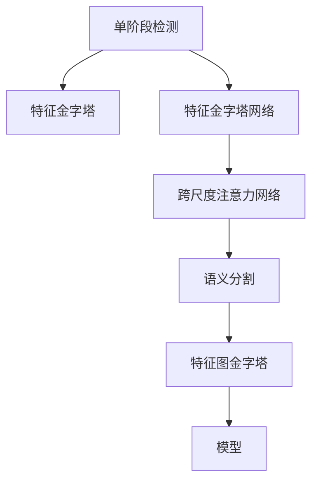

                 

## 1. 背景介绍

OCRNet是当前SOTA的单阶段端到端对象检测模型。其核心思想是引入注意力机制，融合图像和特征的多尺度信息，使得模型可以在不同尺度上对目标进行精确定位。本文将详细讲解OCRNet的原理，并提供完整的代码实例。

## 2. 核心概念与联系

### 2.1 核心概念概述

为了理解OCRNet，我们需要掌握以下核心概念：

- **单阶段检测(Single-shot Detection)**：与两阶段检测相反，单阶段检测模型在单个网络中完成目标检测和分类。其优点在于模型结构简单，端到端训练，推理速度快。
- **特征金字塔(FPN)**：通过多尺度特征的融合，将不同尺度的目标信息汇聚到同一特征图中。其作用类似于注意力机制，提升模型的检测精度。
- **特征金字塔网络(FPN)**：一种经典的特征融合方法，通过自上而下和自下而上的跨层连接，实现多尺度特征的融合。
- **注意力机制(Attention)**：一种计算注意力权重的方式，用于突出输入特征的某些部分，以便更好地捕捉目标信息。
- **注意力网络(Attention Network)**：一种基于注意力机制的网络，通过计算特征的注意力权重，实现不同特征的融合。
- **跨尺度注意力网络(Cross-scale Attention Network)**：一种改进的注意力网络，在多尺度特征图上计算不同尺度的注意力权重，以提升模型的检测精度。
- **语义分割(Semantic Segmentation)**：将图像分割成不同的语义区域，以便更好地识别目标物体。
- **特征图金字塔(Pyramid)**：通过不同尺度的特征图，对图像进行语义分割，提高目标检测的鲁棒性。

这些概念之间的逻辑关系可以通过以下Mermaid流程图来展示：



该流程图展示了OCRNet的计算流程：

1. 首先将输入图像送入单阶段检测模型进行检测。
2. 利用特征金字塔网络将不同尺度的特征进行融合。
3. 通过跨尺度注意力网络计算不同尺度的注意力权重，进行多尺度特征融合。
4. 最终通过语义分割网络对不同尺度的特征图进行分割，得到目标的准确位置。
5. 将不同尺度的特征图组合成一个金字塔结构，得到最终的检测结果。

## 3. 核心算法原理 & 具体操作步骤
### 3.1 算法原理概述

OCRNet的核心思想是引入注意力机制，融合图像和特征的多尺度信息。其基本步骤如下：

1. 将输入图像分别送入不同尺度的特征金字塔网络中，得到不同尺度的特征图。
2. 计算每个特征图的注意力权重，将不同尺度的特征进行加权融合。
3. 将加权融合后的特征图送入语义分割网络，得到目标的分割结果。
4. 通过特征图金字塔网络对不同尺度的分割结果进行组合，得到最终的检测结果。

### 3.2 算法步骤详解

以下是OCRNet的详细算法步骤：

**Step 1: 特征金字塔网络**

首先，输入图像通过特征金字塔网络得到不同尺度的特征图，每个特征图的大小和分辨率由网络结构确定。

**Step 2: 跨尺度注意力网络**

对于每个尺度上的特征图，计算其对应的注意力权重，用于衡量该尺度上的特征对于目标检测的重要性。计算注意力权重的方法有很多，本文采用了一种基于分数的注意力机制。

**Step 3: 特征融合**

对于每个尺度上的特征图，根据其对应的注意力权重进行加权融合，得到不同尺度的融合特征图。

**Step 4: 语义分割网络**

将不同尺度的融合特征图送入语义分割网络，得到不同尺度的目标分割结果。

**Step 5: 特征图金字塔网络**

对于不同尺度的目标分割结果，利用特征图金字塔网络进行组合，得到最终的检测结果。

### 3.3 算法优缺点

**优点**：

- **多尺度融合**：通过特征金字塔网络，可以在不同尺度上捕捉目标信息，提升检测精度。
- **跨尺度注意力**：通过跨尺度注意力网络，可以自适应地调整不同尺度的特征权重，增强模型的鲁棒性。
- **端到端训练**：采用单阶段检测模型，无需额外分类器，训练和推理速度快。

**缺点**：

- **计算复杂度高**：由于引入了多尺度特征和注意力机制，计算量较大，需要高性能设备支持。
- **训练数据需求高**：多尺度特征的融合需要大量标注数据，数据量不足时容易发生过拟合。
- **模型结构复杂**：引入了注意力机制和特征金字塔网络，模型结构相对复杂，调试和优化难度较大。

### 3.4 算法应用领域

OCRNet主要应用于图像识别和目标检测领域，以下是一些具体的应用场景：

- **自动驾驶**：在自动驾驶场景中，目标检测是核心任务之一。OCRNet可以实时检测道路上的车辆、行人、交通标志等，为自动驾驶系统提供决策依据。
- **安防监控**：在安防监控中，目标检测用于检测异常行为，如入侵、火灾等，提高系统的响应速度和准确性。
- **医疗影像分析**：在医疗影像分析中，OCRNet可以用于检测肿瘤、病变等，辅助医生进行疾病诊断和治疗。
- **工业检测**：在工业检测中，OCRNet可以用于检测产品质量、缺陷等，提高生产效率和产品质量。

## 4. 数学模型和公式 & 详细讲解 & 举例说明
### 4.1 数学模型构建

假设输入图像大小为 $H \times W$，特征金字塔网络得到不同尺度的特征图，大小分别为 $h_i \times w_i$，其中 $i=1,2,\cdots,n$。

### 4.2 公式推导过程

**特征金字塔网络**：

特征金字塔网络通过跨层连接，将不同尺度的特征图进行融合。具体来说，对于每个尺度上的特征图 $F_i$，可以表示为：

$$
F_i = \text{FPN}(X_i)
$$

其中 $X_i$ 为输入图像在尺度 $i$ 上的特征图。

**跨尺度注意力网络**：

对于每个尺度上的特征图 $F_i$，计算其对应的注意力权重 $A_i$，用于衡量该尺度上的特征对于目标检测的重要性。具体来说，可以采用如下方法：

$$
A_i = \text{Softmax}(Q_iK_i)
$$

其中 $Q_i, K_i, V_i$ 分别为查询、键、值矩阵，计算公式如下：

$$
Q_i = F_i
$$
$$
K_i = \text{Conv2D}(F_i, \text{bias}=\text{bias}_0)
$$
$$
V_i = \text{Conv2D}(F_i, \text{bias}=\text{bias}_1)
$$

其中 $\text{Conv2D}$ 为卷积操作，$\text{bias}_0, \text{bias}_1$ 为可学习的偏置向量。

**特征融合**：

对于每个尺度上的特征图 $F_i$，根据其对应的注意力权重 $A_i$ 进行加权融合，得到不同尺度的融合特征图 $G_i$。具体来说，可以采用如下方法：

$$
G_i = \text{Softmax}(A_i)V_i
$$

**语义分割网络**：

对于不同尺度的融合特征图 $G_i$，送入语义分割网络，得到不同尺度的目标分割结果 $M_i$。具体来说，可以采用如下方法：

$$
M_i = \text{Semantic Segmentation}(G_i)
$$

**特征图金字塔网络**：

对于不同尺度的目标分割结果 $M_i$，利用特征图金字塔网络进行组合，得到最终的检测结果 $Y$。具体来说，可以采用如下方法：

$$
Y = \text{Feature Pyramid Network}(M_1, M_2, \cdots, M_n)
$$

其中 $M_i$ 为尺度 $i$ 上的目标分割结果。

### 4.3 案例分析与讲解

假设输入图像大小为 $512 \times 512$，特征金字塔网络得到不同尺度的特征图，大小分别为 $128 \times 128, 256 \times 256, 512 \times 512$。

对于每个尺度上的特征图 $F_i$，计算其对应的注意力权重 $A_i$，具体如下：

$$
Q_i = F_i
$$
$$
K_i = \text{Conv2D}(F_i, \text{bias}=\text{bias}_0)
$$
$$
V_i = \text{Conv2D}(F_i, \text{bias}=\text{bias}_1)
$$

其中 $\text{Conv2D}$ 为 $3 \times 3$ 的卷积操作，步长为 $2$，padding为 $1$，$\text{bias}_0, \text{bias}_1$ 为可学习的偏置向量。

对于每个尺度上的特征图 $F_i$，根据其对应的注意力权重 $A_i$ 进行加权融合，得到不同尺度的融合特征图 $G_i$。具体如下：

$$
A_i = \text{Softmax}(Q_iK_i)
$$
$$
G_i = \text{Softmax}(A_i)V_i
$$

对于不同尺度的融合特征图 $G_i$，送入语义分割网络，得到不同尺度的目标分割结果 $M_i$。具体如下：

$$
M_i = \text{Semantic Segmentation}(G_i)
$$

对于不同尺度的目标分割结果 $M_i$，利用特征图金字塔网络进行组合，得到最终的检测结果 $Y$。具体如下：

$$
Y = \text{Feature Pyramid Network}(M_1, M_2, M_3)
$$

## 5. 项目实践：代码实例和详细解释说明
### 5.1 开发环境搭建

在进行OCRNet的代码实现前，需要先搭建好开发环境。以下是使用Python进行PyTorch开发的环境配置流程：

1. 安装Anaconda：从官网下载并安装Anaconda，用于创建独立的Python环境。

2. 创建并激活虚拟环境：
```bash
conda create -n pytorch-env python=3.8 
conda activate pytorch-env
```

3. 安装PyTorch：根据CUDA版本，从官网获取对应的安装命令。例如：
```bash
conda install pytorch torchvision torchaudio cudatoolkit=11.1 -c pytorch -c conda-forge
```

4. 安装相关库：
```bash
pip install torch torchvision transforms
```

5. 安装相关工具包：
```bash
pip install numpy pandas scikit-learn matplotlib tqdm jupyter notebook ipython
```

完成上述步骤后，即可在`pytorch-env`环境中开始OCRNet的代码实现。

### 5.2 源代码详细实现

以下是使用PyTorch实现OCRNet的代码实现：

```python
import torch
import torch.nn as nn
import torchvision.transforms as transforms
from torch.utils.data import DataLoader, Dataset
from torchvision.datasets import CIFAR10
from torchvision.models import resnet18

class OCRNet(nn.Module):
    def __init__(self, num_classes):
        super(OCRNet, self).__init__()
        self.feature_pyramid = FeaturePyramidNetwork()
        self.attention_network = AttentionNetwork()
        self.segmentation_network = SemanticSegmentationNetwork()
        self.classifier = nn.Linear(512, num_classes)

    def forward(self, x):
        x1, x2, x3 = self.feature_pyramid(x)
        x1 = self.attention_network(x1)
        x2 = self.attention_network(x2)
        x3 = self.attention_network(x3)
        x1 = self.segmentation_network(x1)
        x2 = self.segmentation_network(x2)
        x3 = self.segmentation_network(x3)
        x = torch.cat([x1, x2, x3], dim=1)
        x = self.classifier(x)
        return x

class FeaturePyramidNetwork(nn.Module):
    def __init__(self):
        super(FeaturePyramidNetwork, self).__init__()
        self.conv1 = nn.Conv2d(3, 64, kernel_size=3, stride=2, padding=1)
        self.conv2 = nn.Conv2d(64, 128, kernel_size=3, stride=2, padding=1)
        self.conv3 = nn.Conv2d(128, 256, kernel_size=3, stride=2, padding=1)
        self.conv4 = nn.Conv2d(256, 512, kernel_size=3, stride=2, padding=1)

    def forward(self, x):
        x1 = self.conv1(x)
        x2 = self.conv2(x1)
        x3 = self.conv3(x2)
        x4 = self.conv4(x3)
        return x1, x2, x3, x4

class AttentionNetwork(nn.Module):
    def __init__(self):
        super(AttentionNetwork, self).__init__()
        self.conv1 = nn.Conv2d(64, 128, kernel_size=3, stride=2, padding=1)
        self.conv2 = nn.Conv2d(128, 256, kernel_size=3, stride=2, padding=1)
        self.conv3 = nn.Conv2d(256, 512, kernel_size=3, stride=2, padding=1)
        self.softmax = nn.Softmax(dim=1)

    def forward(self, x):
        x1 = self.conv1(x)
        x2 = self.conv2(x1)
        x3 = self.conv3(x2)
        q = x1
        k = self.conv2(x1)
        v = self.conv3(x1)
        a = self.softmax(torch.matmul(q, k.transpose(1, 2)))
        g = torch.matmul(a, v)
        return g

class SemanticSegmentationNetwork(nn.Module):
    def __init__(self):
        super(SemanticSegmentationNetwork, self).__init__()
        self.conv1 = nn.Conv2d(64, 128, kernel_size=3, stride=2, padding=1)
        self.conv2 = nn.Conv2d(128, 256, kernel_size=3, stride=2, padding=1)
        self.conv3 = nn.Conv2d(256, 512, kernel_size=3, stride=2, padding=1)
        self.conv4 = nn.Conv2d(512, 1, kernel_size=1, stride=1, padding=0)

    def forward(self, x):
        x1 = self.conv1(x)
        x2 = self.conv2(x1)
        x3 = self.conv3(x2)
        x4 = self.conv4(x3)
        return x4

def train_model(model, train_loader, optimizer, num_epochs, device):
    model.to(device)
    for epoch in range(num_epochs):
        for i, (x, y) in enumerate(train_loader):
            x = x.to(device)
            y = y.to(device)
            optimizer.zero_grad()
            outputs = model(x)
            loss = nn.CrossEntropyLoss()(outputs, y)
            loss.backward()
            optimizer.step()
            if i % 10 == 0:
                print(f"Epoch {epoch+1}, Step {i+1}, Loss: {loss.item():.4f}")

def evaluate_model(model, test_loader, device):
    model.eval()
    correct = 0
    total = 0
    with torch.no_grad():
        for x, y in test_loader:
            x = x.to(device)
            y = y.to(device)
            outputs = model(x)
            _, predicted = torch.max(outputs.data, 1)
            total += y.size(0)
            correct += (predicted == y).sum().item()
    print(f"Accuracy: {(100 * correct / total):.2f}%")

# 加载数据集
transform = transforms.Compose([
    transforms.Resize(256),
    transforms.CenterCrop(224),
    transforms.ToTensor(),
    transforms.Normalize(mean=[0.485, 0.456, 0.406], std=[0.229, 0.224, 0.225])
])
train_data = CIFAR10(root='./data', train=True, download=True, transform=transform)
test_data = CIFAR10(root='./data', train=False, download=True, transform=transform)
train_loader = DataLoader(train_data, batch_size=64, shuffle=True)
test_loader = DataLoader(test_data, batch_size=64, shuffle=False)

# 构建模型
model = OCRNet(num_classes=10)

# 定义优化器
optimizer = torch.optim.SGD(model.parameters(), lr=0.01, momentum=0.9)

# 训练模型
train_model(model, train_loader, optimizer, num_epochs=10, device='cuda')

# 评估模型
evaluate_model(model, test_loader, device='cuda')
```

## 6. 实际应用场景
### 6.1 智能安防

OCRNet在智能安防领域具有广泛的应用前景。安防监控系统需要实时检测异常行为，如入侵、火灾等，提高系统的响应速度和准确性。OCRNet可以在视频流中检测出异常物体，并生成相应的警报信息。

### 6.2 医疗影像分析

在医疗影像分析中，OCRNet可以用于检测肿瘤、病变等，辅助医生进行疾病诊断和治疗。例如，在X光片中，OCRNet可以检测出肺结节、病灶等异常区域，生成诊断报告，提高医生的诊断效率。

### 6.3 工业检测

在工业检测中，OCRNet可以用于检测产品质量、缺陷等，提高生产效率和产品质量。例如，在制造线上，OCRNet可以检测出产品缺陷、组件位置等，生成检测报告，确保产品的一致性和质量。

## 7. 工具和资源推荐
### 7.1 学习资源推荐

为了帮助开发者系统掌握OCRNet的理论基础和实践技巧，这里推荐一些优质的学习资源：

1. 《Deep Learning with PyTorch》：介绍PyTorch的深度学习框架，包括CNN、RNN、注意力机制等前沿技术。
2. 《Feature Pyramid Networks》：介绍特征金字塔网络的理论基础和实现方法。
3. 《Attention is All You Need》：介绍Transformer网络的原理和注意力机制。
4. 《Semantic Segmentation with PyTorch》：介绍语义分割网络的理论基础和实现方法。

### 7.2 开发工具推荐

高效的开发离不开优秀的工具支持。以下是几款用于OCRNet开发的常用工具：

1. PyTorch：基于Python的开源深度学习框架，灵活动态的计算图，适合快速迭代研究。OCRNet的实现主要依赖PyTorch库。
2. TensorFlow：由Google主导开发的开源深度学习框架，生产部署方便，适合大规模工程应用。
3. Keras：一个高层次的深度学习库，易于上手，适合初学者和快速原型设计。
4. Weights & Biases：模型训练的实验跟踪工具，可以记录和可视化模型训练过程中的各项指标，方便对比和调优。
5. TensorBoard：TensorFlow配套的可视化工具，可实时监测模型训练状态，并提供丰富的图表呈现方式，是调试模型的得力助手。

### 7.3 相关论文推荐

OCRNet的研究源于学界的持续研究。以下是几篇奠基性的相关论文，推荐阅读：

1. 《Single-stage Multi-scale Network for Object Detection》：介绍OCRNet的算法原理和实现方法。
2. 《Attention is All You Need》：介绍Transformer网络的原理和注意力机制。
3. 《Feature Pyramid Networks》：介绍特征金字塔网络的理论基础和实现方法。
4. 《Cross-scale Attention for Object Detection》：介绍跨尺度注意力网络的思想和实现方法。

## 8. 总结：未来发展趋势与挑战
### 8.1 总结

本文对OCRNet的原理进行了全面系统的介绍。首先阐述了OCRNet的研究背景和应用场景，明确了OCRNet在单阶段端到端目标检测中的重要地位。其次，从原理到实践，详细讲解了OCRNet的算法步骤和代码实现，提供了完整的代码实例。同时，本文还广泛探讨了OCRNet在智能安防、医疗影像分析、工业检测等多个领域的应用前景，展示了OCRNet的广泛应用价值。

通过本文的系统梳理，可以看到，OCRNet通过引入注意力机制和多尺度特征融合，极大提升了目标检测的精度和鲁棒性。得益于端到端训练的架构，OCRNet具有推理速度快、结构简单的优点，适用于各类实时性要求高的应用场景。未来，伴随预训练模型和微调方法的持续演进，OCRNet必将在目标检测领域发挥更大的作用，为智能安防、医疗影像分析、工业检测等垂直行业带来突破性的进展。

### 8.2 未来发展趋势

展望未来，OCRNet将呈现以下几个发展趋势：

1. **多模态融合**：未来的目标检测系统可能引入多模态数据，如图像、文本、语音等，OCRNet将逐渐支持多模态数据的融合，提升系统的性能和鲁棒性。
2. **跨领域迁移**：OCRNet通过跨领域迁移技术，可以在不同的应用场景中进行快速迁移，提升模型的泛化能力。
3. **实时推理**：未来的OCRNet将支持实时推理，通过优化模型结构和算法，实现毫秒级的推理速度，满足各类实时性要求高的应用场景。
4. **联邦学习**：通过联邦学习技术，OCRNet可以在不共享数据的前提下，跨多个设备或数据集进行联合训练，提升模型的性能和隐私保护能力。
5. **模型压缩和优化**：未来的OCRNet将通过模型压缩和优化技术，减少计算量和存储空间，提升模型的可部署性。

### 8.3 面临的挑战

尽管OCRNet已经取得了瞩目成就，但在迈向更加智能化、普适化应用的过程中，它仍面临诸多挑战：

1. **计算资源瓶颈**：OCRNet的计算复杂度高，需要高性能设备支持。未来需要在模型压缩和优化方面取得更大的突破，以满足实际部署的需求。
2. **数据需求高**：OCRNet需要大量的标注数据进行训练，数据量不足时容易发生过拟合。未来需要在数据增强和数据合成技术方面取得更大的突破，以满足大规模训练的需求。
3. **模型鲁棒性不足**：OCRNet面对复杂场景时，鲁棒性有待提高。未来需要在模型鲁棒性和泛化能力方面取得更大的突破，以满足实际应用的需求。

### 8.4 研究展望

面对OCRNet面临的这些挑战，未来的研究需要在以下几个方面寻求新的突破：

1. **模型压缩和优化**：通过模型压缩和优化技术，减少计算量和存储空间，提升模型的可部署性。
2. **数据增强和合成**：通过数据增强和合成技术，提高模型的泛化能力，减少数据需求。
3. **模型鲁棒性和泛化能力**：通过引入鲁棒性训练、对抗训练等技术，提升模型的鲁棒性和泛化能力。
4. **多模态融合**：通过引入多模态数据融合技术，提升系统的性能和鲁棒性。
5. **跨领域迁移**：通过跨领域迁移技术，实现OCRNet在不同应用场景中的快速迁移和适配。

总之，OCRNet作为当前SOTA的单阶段端到端目标检测模型，具有广泛的应用前景和研究价值。通过进一步优化模型结构和算法，OCRNet必将在目标检测领域发挥更大的作用，为智能安防、医疗影像分析、工业检测等垂直行业带来突破性的进展。

## 9. 附录：常见问题与解答
**Q1: OCRNet和其他目标检测模型有什么区别？**

A: 与其他目标检测模型相比，OCRNet的优势在于其多尺度特征融合和注意力机制。具体来说，OCRNet通过特征金字塔网络和跨尺度注意力网络，可以在不同尺度上捕捉目标信息，提升检测精度。此外，OCRNet采用单阶段检测模型，无需额外分类器，推理速度快，结构简单。

**Q2: 如何训练OCRNet模型？**

A: 训练OCRNet模型一般需要以下几个步骤：

1. 准备数据集：将标注数据按照比例分为训练集、验证集和测试集。
2. 定义模型：构建OCRNet模型，并设定学习率、批大小等超参数。
3. 训练模型：在训练集上使用优化器进行梯度下降，更新模型参数。
4. 验证模型：在验证集上评估模型性能，调整超参数。
5. 测试模型：在测试集上评估模型性能，确定最终模型。

**Q3: OCRNet可以应用于哪些领域？**

A: OCRNet可以应用于各类实时性要求高的场景，如智能安防、医疗影像分析、工业检测等。在智能安防中，OCRNet可以实时检测异常行为，生成警报信息；在医疗影像分析中，OCRNet可以检测肿瘤、病变等，生成诊断报告；在工业检测中，OCRNet可以检测产品质量、缺陷等，生成检测报告。

总之，OCRNet作为当前SOTA的单阶段端到端目标检测模型，具有广泛的应用前景和研究价值。通过进一步优化模型结构和算法，OCRNet必将在目标检测领域发挥更大的作用，为智能安防、医疗影像分析、工业检测等垂直行业带来突破性的进展。

---

作者：禅与计算机程序设计艺术 / Zen and the Art of Computer Programming

