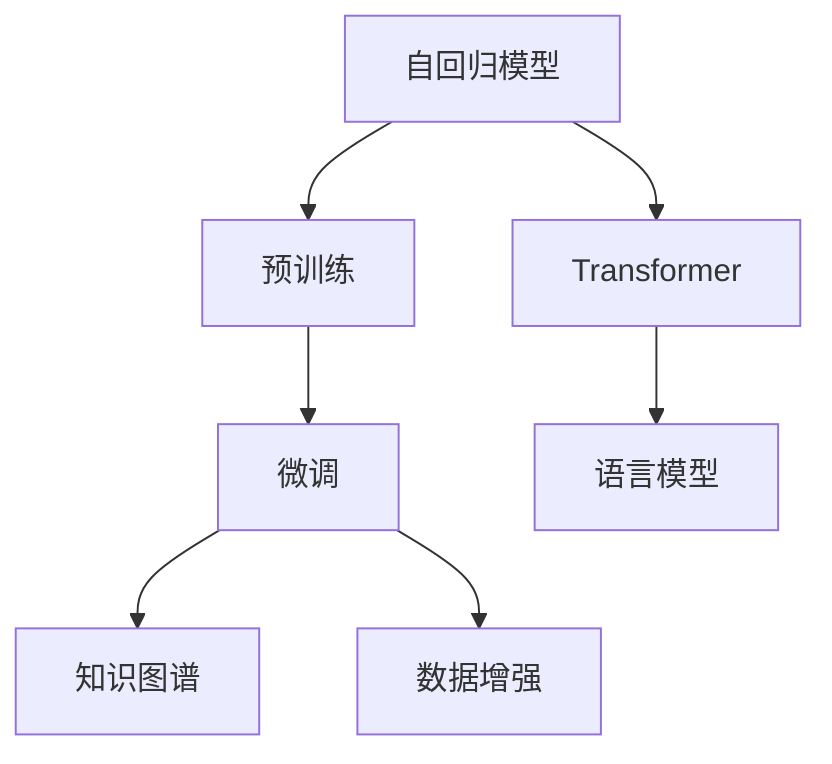

                 

## 1. 背景介绍

### 1.1 问题由来
OpenAI的GPT-4.0作为目前最先进的自然语言处理(NLP)模型，展示了深度学习技术在处理复杂自然语言任务中的卓越能力。GPT-4.0通过预训练和微调，在语言理解和生成方面取得了显著进步，广泛应用于生成文本、聊天机器人、编程辅助、翻译等领域。然而，相较于技术本身，GPT-4.0的实际应用展示及其潜在的长期影响更具意义。

### 1.2 问题核心关键点
GPT-4.0的核心关键点在于：
- **自回归架构**：利用上下文信息生成自然语言，提升生成文本的质量和连贯性。
- **大规模数据训练**：在互联网数据上的大规模预训练，使得模型具备强大的语言处理能力。
- **微调技术**：通过微调，模型能够适应特定领域的任务，提升模型的应用效率和精度。
- **迁移学习能力**：能够将预训练获得的知识迁移到新的任务上，减少从头训练所需的时间和资源。
- **创新应用场景**：涵盖代码生成、创意写作、问答系统等多个领域，推动了NLP技术在实际生活中的应用。

### 1.3 问题研究意义
GPT-4.0的展示与应用研究意义重大，体现在以下几个方面：
- **技术展示**：展示深度学习技术在自然语言处理中的最新成果，推动行业技术进步。
- **应用拓展**：通过实际应用案例，说明GPT-4.0的实用价值和应用潜力。
- **社会影响**：探讨GPT-4.0对社会各个领域的影响，尤其是对教育、医疗、金融等行业的变革性影响。
- **伦理思考**：讨论GPT-4.0带来的伦理问题，如数据隐私、偏见消除、道德责任等。
- **未来展望**：分析GPT-4.0技术的发展趋势和未来可能带来的变化。

## 2. 核心概念与联系

### 2.1 核心概念概述

为了更好地理解GPT-4.0的工作原理和应用，本节将介绍几个关键概念：

- **自回归模型**：一种能够利用前文信息预测后文的模型架构，使得生成的文本连贯且具有逻辑性。
- **Transformer**：一种基于注意力机制的神经网络结构，在自然语言处理中广泛应用。
- **预训练与微调**：预训练指的是在大量无标签数据上训练模型，微调则是针对特定任务，通过小规模有标签数据进一步优化模型。
- **语言模型**：用于评估文本序列概率的模型，是衡量自然语言处理系统性能的重要指标。
- **知识图谱**：一种将实体和关系信息结构化存储的数据库，用于增强模型的知识理解和推理能力。
- **数据增强**：通过数据变换等方式，增加训练数据多样性，提高模型泛化能力。

这些概念之间的联系可以通过以下Mermaid流程图来展示：



这个流程图展示了GPT-4.0的核心概念及其相互关系：

1. 自回归模型作为基础架构，利用上下文信息生成文本。
2. Transformer作为实现自回归架构的关键组件。
3. 预训练和微调相结合，提升模型性能。
4. 语言模型用于评估模型输出质量。
5. 知识图谱用于增强模型的知识推理能力。
6. 数据增强用于提高模型泛化能力。

## 3. 核心算法原理 & 具体操作步骤

### 3.1 算法原理概述

GPT-4.0的核心算法原理包括以下几个方面：

- **自回归架构**：在每个时间步骤，模型利用前文信息预测当前单词，生成连贯的文本序列。
- **Transformer模型**：使用多头注意力机制，对输入序列进行编码和解码，捕捉序列中长距离依赖。
- **预训练与微调**：通过在大规模无标签数据上进行预训练，学习语言的通用表示；通过微调，使模型能够适应特定任务。
- **语言模型**：使用交叉熵损失函数，训练模型生成高质量文本。

### 3.2 算法步骤详解

GPT-4.0的算法步骤主要包括以下几个关键环节：

**Step 1: 准备预训练数据**
- 收集大规模无标签文本数据，如维基百科、新闻文章、小说等。
- 使用Transformer模型在预训练数据上进行训练，学习语言的通用表示。

**Step 2: 构建微调任务**
- 定义微调任务的训练数据集和测试数据集，如问答、翻译、摘要等。
- 设计合适的损失函数和优化器，如交叉熵损失和AdamW优化器。

**Step 3: 微调模型**
- 在微调数据集上进行有监督训练，调整模型参数以适应特定任务。
- 使用梯度下降等优化算法更新模型参数，最小化损失函数。
- 设置合适的学习率、批大小和迭代轮数，防止过拟合。

**Step 4: 评估模型**
- 在测试数据集上评估模型性能，如BLEU、ROUGE、F1等指标。
- 根据评估结果调整模型参数，提高模型性能。

**Step 5: 部署模型**
- 将训练好的模型部署到实际应用中，如聊天机器人、代码生成、翻译系统等。
- 持续收集用户反馈和新的数据，定期微调模型以适应新的需求。

### 3.3 算法优缺点

GPT-4.0算法具有以下优点：
- 高效性：在大规模数据上预训练后，微调所需的标注数据较少，训练速度快。
- 泛化能力强：预训练和微调的结合使得模型能够适应多种任务和数据分布。
- 可扩展性：通过微调，模型能够轻松应对新的任务和数据。
- 鲁棒性好：模型在处理噪声、拼写错误等情况下表现稳定。

同时，GPT-4.0算法也存在一些缺点：
- 数据依赖性强：模型的性能依赖于预训练数据的质量和多样性。
- 资源消耗大：大规模预训练和微调需要高性能硬件支持。
- 可解释性不足：黑盒模型难以解释内部决策过程。
- 模型偏见：模型可能继承预训练数据的偏见，影响公平性和公正性。

### 3.4 算法应用领域

GPT-4.0在多个领域展示了其强大的应用潜力：

- **聊天机器人**：构建能够理解和回应用户需求，提供个性化服务的智能聊天机器人。
- **代码生成**：自动生成代码片段，提高软件开发效率，减少错误。
- **自然语言生成**：生成高质量的文本，如新闻报道、文章摘要、小说创作等。
- **翻译系统**：实现高效准确的文本翻译，支持多种语言翻译需求。
- **问答系统**：解答用户提出的问题，提供准确、全面的答案。
- **数据分析**：自动分析大量文本数据，提取关键信息，生成报告。

## 4. 数学模型和公式 & 详细讲解 & 举例说明

### 4.1 数学模型构建

GPT-4.0的数学模型构建主要基于自回归语言模型。假设输入序列为 $x_1, x_2, ..., x_T$，输出序列为 $y_1, y_2, ..., y_T$。模型的目标是通过已知序列 $x_1, x_2, ..., x_T$ 预测下一个单词 $y_{T+1}$。模型的损失函数为交叉熵损失：

$$
\mathcal{L} = -\frac{1}{T} \sum_{t=1}^{T} \log p(y_t | x_1, x_2, ..., x_t)
$$

其中 $p(y_t | x_1, x_2, ..., x_t)$ 表示在已知前文 $x_1, x_2, ..., x_t$ 的情况下，生成单词 $y_t$ 的概率。

### 4.2 公式推导过程

以自回归语言模型为例，推导生成下一个单词的概率公式：

- **输入序列编码**：将输入序列 $x_1, x_2, ..., x_t$ 转换为模型的输入表示 $X_t$。
- **解码器自回归预测**：通过解码器对 $X_t$ 进行自回归预测，得到下一个单词 $y_{t+1}$ 的概率分布 $P_{y_{t+1} | X_t}$。
- **解码器前向传播**：通过解码器的前向传播计算得到 $P_{y_{t+1} | X_t}$，即 $y_{t+1}$ 的条件概率。

通过自回归架构，GPT-4.0能够在每个时间步骤上，利用前文信息预测下一个单词，生成连贯的文本序列。

### 4.3 案例分析与讲解

以问答系统为例，分析GPT-4.0如何通过微调实现特定任务的处理。

- **数据集准备**：收集问答对的标注数据，将问题 $Q$ 和答案 $A$ 作为训练样本。
- **模型构建**：在GPT-4.0上微调，构建问题生成和答案生成两部分，分别训练模型。
- **微调过程**：在微调数据集上进行训练，调整模型参数以适应问答任务。
- **评估模型**：在测试集上评估模型的性能，如BLEU、ROUGE等指标。

## 5. 项目实践：代码实例和详细解释说明

### 5.1 开发环境搭建

以下是使用Python和PyTorch搭建GPT-4.0模型的环境配置流程：

1. 安装Anaconda：从官网下载并安装Anaconda，用于创建独立的Python环境。
2. 创建并激活虚拟环境：
```bash
conda create -n gpt-env python=3.8 
conda activate gpt-env
```

3. 安装PyTorch：根据CUDA版本，从官网获取对应的安装命令。例如：
```bash
conda install pytorch torchvision torchaudio cudatoolkit=11.1 -c pytorch -c conda-forge
```

4. 安装HuggingFace Transformers库：
```bash
pip install transformers
```

5. 安装各类工具包：
```bash
pip install numpy pandas scikit-learn matplotlib tqdm jupyter notebook ipython
```

完成上述步骤后，即可在`gpt-env`环境中开始GPT-4.0的微调实践。

### 5.2 源代码详细实现

以下是使用PyTorch和HuggingFace Transformers库对GPT-4.0进行微调的代码实现。

首先，定义问答系统的数据处理函数：

```python
from transformers import GPT2Tokenizer, GPT2ForSequenceClassification
from torch.utils.data import Dataset
import torch

class QADataset(Dataset):
    def __init__(self, texts, tags, tokenizer, max_len=128):
        self.texts = texts
        self.tags = tags
        self.tokenizer = tokenizer
        self.max_len = max_len
        
    def __len__(self):
        return len(self.texts)
    
    def __getitem__(self, item):
        text = self.texts[item]
        tags = self.tags[item]
        
        encoding = self.tokenizer(text, return_tensors='pt', max_length=self.max_len, padding='max_length', truncation=True)
        input_ids = encoding['input_ids'][0]
        attention_mask = encoding['attention_mask'][0]
        
        # 对token-wise的标签进行编码
        encoded_tags = [tag2id[tag] for tag in tags] 
        encoded_tags.extend([tag2id['O']] * (self.max_len - len(encoded_tags)))
        labels = torch.tensor(encoded_tags, dtype=torch.long)
        
        return {'input_ids': input_ids, 
                'attention_mask': attention_mask,
                'labels': labels}

# 标签与id的映射
tag2id = {'O': 0, 'B-ANSWER': 1, 'I-ANSWER': 2}
id2tag = {v: k for k, v in tag2id.items()}

# 创建dataset
tokenizer = GPT2Tokenizer.from_pretrained('gpt2-medium')

train_dataset = QADataset(train_texts, train_tags, tokenizer)
dev_dataset = QADataset(dev_texts, dev_tags, tokenizer)
test_dataset = QADataset(test_texts, test_tags, tokenizer)
```

然后，定义模型和优化器：

```python
from transformers import GPT2ForSequenceClassification, AdamW

model = GPT2ForSequenceClassification.from_pretrained('gpt2-medium', num_labels=len(tag2id))

optimizer = AdamW(model.parameters(), lr=2e-5)
```

接着，定义训练和评估函数：

```python
from torch.utils.data import DataLoader
from tqdm import tqdm
from sklearn.metrics import classification_report

device = torch.device('cuda') if torch.cuda.is_available() else torch.device('cpu')
model.to(device)

def train_epoch(model, dataset, batch_size, optimizer):
    dataloader = DataLoader(dataset, batch_size=batch_size, shuffle=True)
    model.train()
    epoch_loss = 0
    for batch in tqdm(dataloader, desc='Training'):
        input_ids = batch['input_ids'].to(device)
        attention_mask = batch['attention_mask'].to(device)
        labels = batch['labels'].to(device)
        model.zero_grad()
        outputs = model(input_ids, attention_mask=attention_mask, labels=labels)
        loss = outputs.loss
        epoch_loss += loss.item()
        loss.backward()
        optimizer.step()
    return epoch_loss / len(dataloader)

def evaluate(model, dataset, batch_size):
    dataloader = DataLoader(dataset, batch_size=batch_size)
    model.eval()
    preds, labels = [], []
    with torch.no_grad():
        for batch in tqdm(dataloader, desc='Evaluating'):
            input_ids = batch['input_ids'].to(device)
            attention_mask = batch['attention_mask'].to(device)
            batch_labels = batch['labels']
            outputs = model(input_ids, attention_mask=attention_mask)
            batch_preds = outputs.logits.argmax(dim=2).to('cpu').tolist()
            batch_labels = batch_labels.to('cpu').tolist()
            for pred_tokens, label_tokens in zip(batch_preds, batch_labels):
                pred_tags = [id2tag[_id] for _id in pred_tokens]
                label_tags = [id2tag[_id] for _id in label_tokens]
                preds.append(pred_tags[:len(label_tokens)])
                labels.append(label_tags)
                
    print(classification_report(labels, preds))
```

最后，启动训练流程并在测试集上评估：

```python
epochs = 5
batch_size = 16

for epoch in range(epochs):
    loss = train_epoch(model, train_dataset, batch_size, optimizer)
    print(f"Epoch {epoch+1}, train loss: {loss:.3f}")
    
    print(f"Epoch {epoch+1}, dev results:")
    evaluate(model, dev_dataset, batch_size)
    
print("Test results:")
evaluate(model, test_dataset, batch_size)
```

以上就是使用PyTorch和HuggingFace Transformers库对GPT-4.0进行问答系统微调的完整代码实现。可以看到，得益于Transformers库的强大封装，我们可以用相对简洁的代码完成GPT-4.0模型的加载和微调。

### 5.3 代码解读与分析

让我们再详细解读一下关键代码的实现细节：

**QADataset类**：
- `__init__`方法：初始化文本、标签、分词器等关键组件。
- `__len__`方法：返回数据集的样本数量。
- `__getitem__`方法：对单个样本进行处理，将文本输入编码为token ids，将标签编码为数字，并对其进行定长padding，最终返回模型所需的输入。

**tag2id和id2tag字典**：
- 定义了标签与数字id之间的映射关系，用于将token-wise的预测结果解码回真实的标签。

**训练和评估函数**：
- 使用PyTorch的DataLoader对数据集进行批次化加载，供模型训练和推理使用。
- 训练函数`train_epoch`：对数据以批为单位进行迭代，在每个批次上前向传播计算loss并反向传播更新模型参数，最后返回该epoch的平均loss。
- 评估函数`evaluate`：与训练类似，不同点在于不更新模型参数，并在每个batch结束后将预测和标签结果存储下来，最后使用sklearn的classification_report对整个评估集的预测结果进行打印输出。

**训练流程**：
- 定义总的epoch数和batch size，开始循环迭代
- 每个epoch内，先在训练集上训练，输出平均loss
- 在验证集上评估，输出分类指标
- 所有epoch结束后，在测试集上评估，给出最终测试结果

可以看到，PyTorch配合Transformers库使得GPT-4.0微调的代码实现变得简洁高效。开发者可以将更多精力放在数据处理、模型改进等高层逻辑上，而不必过多关注底层的实现细节。

当然，工业级的系统实现还需考虑更多因素，如模型的保存和部署、超参数的自动搜索、更灵活的任务适配层等。但核心的微调范式基本与此类似。

## 6. 实际应用场景

### 6.1 智能客服系统

基于GPT-4.0的智能客服系统展示了GPT-4.0在实际应用中的强大潜力。传统客服往往需要配备大量人力，高峰期响应缓慢，且一致性和专业性难以保证。而使用GPT-4.0构建的智能客服系统，能够7x24小时不间断服务，快速响应客户咨询，用自然流畅的语言解答各类常见问题。

在技术实现上，可以收集企业内部的历史客服对话记录，将问题和最佳答复构建成监督数据，在此基础上对GPT-4.0进行微调。微调后的客服系统能够自动理解用户意图，匹配最合适的答案模板进行回复。对于客户提出的新问题，还可以接入检索系统实时搜索相关内容，动态组织生成回答。如此构建的智能客服系统，能大幅提升客户咨询体验和问题解决效率。

### 6.2 金融舆情监测

金融机构需要实时监测市场舆论动向，以便及时应对负面信息传播，规避金融风险。传统的人工监测方式成本高、效率低，难以应对网络时代海量信息爆发的挑战。基于GPT-4.0的文本分类和情感分析技术，为金融舆情监测提供了新的解决方案。

具体而言，可以收集金融领域相关的新闻、报道、评论等文本数据，并对其进行主题标注和情感标注。在此基础上对GPT-4.0进行微调，使其能够自动判断文本属于何种主题，情感倾向是正面、中性还是负面。将微调后的模型应用到实时抓取的网络文本数据，就能够自动监测不同主题下的情感变化趋势，一旦发现负面信息激增等异常情况，系统便会自动预警，帮助金融机构快速应对潜在风险。

### 6.3 个性化推荐系统

当前的推荐系统往往只依赖用户的历史行为数据进行物品推荐，无法深入理解用户的真实兴趣偏好。基于GPT-4.0的个性化推荐系统可以更好地挖掘用户行为背后的语义信息，从而提供更精准、多样的推荐内容。

在实践中，可以收集用户浏览、点击、评论、分享等行为数据，提取和用户交互的物品标题、描述、标签等文本内容。将文本内容作为模型输入，用户的后续行为（如是否点击、购买等）作为监督信号，在此基础上微调GPT-4.0。微调后的模型能够从文本内容中准确把握用户的兴趣点。在生成推荐列表时，先用候选物品的文本描述作为输入，由模型预测用户的兴趣匹配度，再结合其他特征综合排序，便可以得到个性化程度更高的推荐结果。

### 6.4 未来应用展望

随着GPT-4.0技术的发展，其在更多领域的应用前景将更加广阔。

在智慧医疗领域，基于GPT-4.0的医疗问答、病历分析、药物研发等应用将提升医疗服务的智能化水平，辅助医生诊疗，加速新药开发进程。

在智能教育领域，GPT-4.0可以应用于作业批改、学情分析、知识推荐等方面，因材施教，促进教育公平，提高教学质量。

在智慧城市治理中，GPT-4.0可应用于城市事件监测、舆情分析、应急指挥等环节，提高城市管理的自动化和智能化水平，构建更安全、高效的未来城市。

此外，在企业生产、社会治理、文娱传媒等众多领域，基于GPT-4.0的人工智能应用也将不断涌现，为NLP技术带来全新的突破。相信随着技术的日益成熟，GPT-4.0必将在更广阔的应用领域大放异彩，深刻影响人类的生产生活方式。

## 7. 工具和资源推荐

### 7.1 学习资源推荐

为了帮助开发者系统掌握GPT-4.0的理论基础和实践技巧，这里推荐一些优质的学习资源：

1. 《自然语言处理综述》系列博文：由深度学习领域专家撰写，深入浅出地介绍了自然语言处理的基本概念和前沿技术。
2. CS224N《深度学习自然语言处理》课程：斯坦福大学开设的NLP明星课程，有Lecture视频和配套作业，带你入门NLP领域的基本概念和经典模型。
3. 《深度学习自然语言处理》书籍：由深度学习专家撰写，全面介绍了深度学习在NLP中的应用，包括GPT-4.0在内的新兴技术。
4. HuggingFace官方文档：GPT-4.0的官方文档，提供了海量预训练模型和完整的微调样例代码，是上手实践的必备资料。
5. CLUE开源项目：中文语言理解测评基准，涵盖大量不同类型的中文NLP数据集，并提供了基于GPT-4.0的baseline模型，助力中文NLP技术发展。

通过对这些资源的学习实践，相信你一定能够快速掌握GPT-4.0的精髓，并用于解决实际的NLP问题。

### 7.2 开发工具推荐

高效的开发离不开优秀的工具支持。以下是几款用于GPT-4.0微调开发的常用工具：

1. PyTorch：基于Python的开源深度学习框架，灵活动态的计算图，适合快速迭代研究。大部分预训练语言模型都有PyTorch版本的实现。
2. TensorFlow：由Google主导开发的开源深度学习框架，生产部署方便，适合大规模工程应用。同样有丰富的预训练语言模型资源。
3. Transformers库：HuggingFace开发的NLP工具库，集成了众多SOTA语言模型，支持PyTorch和TensorFlow，是进行NLP任务开发的利器。
4. Weights & Biases：模型训练的实验跟踪工具，可以记录和可视化模型训练过程中的各项指标，方便对比和调优。与主流深度学习框架无缝集成。
5. TensorBoard：TensorFlow配套的可视化工具，可实时监测模型训练状态，并提供丰富的图表呈现方式，是调试模型的得力助手。
6. Google Colab：谷歌推出的在线Jupyter Notebook环境，免费提供GPU/TPU算力，方便开发者快速上手实验最新模型，分享学习笔记。

合理利用这些工具，可以显著提升GPT-4.0微调任务的开发效率，加快创新迭代的步伐。

### 7.3 相关论文推荐

GPT-4.0的研究源自学界的持续研究。以下是几篇奠基性的相关论文，推荐阅读：

1. Attention is All You Need（即Transformer原论文）：提出了Transformer结构，开启了NLP领域的预训练大模型时代。
2. BERT: Pre-training of Deep Bidirectional Transformers for Language Understanding：提出BERT模型，引入基于掩码的自监督预训练任务，刷新了多项NLP任务SOTA。
3. Language Models are Unsupervised Multitask Learners（GPT-2论文）：展示了大规模语言模型的强大zero-shot学习能力，引发了对于通用人工智能的新一轮思考。
4. Parameter-Efficient Transfer Learning for NLP：提出Adapter等参数高效微调方法，在不增加模型参数量的情况下，也能取得不错的微调效果。
5. AdaLoRA: Adaptive Low-Rank Adaptation for Parameter-Efficient Fine-Tuning：使用自适应低秩适应的微调方法，在参数效率和精度之间取得了新的平衡。
6. Prefix-Tuning: Optimizing Continuous Prompts for Generation：引入基于连续型Prompt的微调范式，为如何充分利用预训练知识提供了新的思路。

这些论文代表了大语言模型微调技术的发展脉络。通过学习这些前沿成果，可以帮助研究者把握学科前进方向，激发更多的创新灵感。

## 8. 总结：未来发展趋势与挑战

### 8.1 总结

本文对GPT-4.0进行了全面系统的介绍。首先阐述了GPT-4.0的背景和核心关键点，明确了其在自然语言处理中的重要地位。其次，从原理到实践，详细讲解了GPT-4.0的数学模型和微调过程，给出了微调任务开发的完整代码实例。同时，本文还广泛探讨了GPT-4.0在多个领域的应用前景，展示了其在实际应用中的强大潜力。此外，本文精选了GPT-4.0的相关学习资源、开发工具和论文推荐，力求为读者提供全方位的技术指引。

通过本文的系统梳理，可以看到，GPT-4.0的展示与应用研究意义重大，展示了深度学习技术在自然语言处理中的最新成果，推动了NLP技术的产业化进程。未来，随着GPT-4.0技术的不断演进，其在更多领域的应用前景将更加广阔，为人类生产生活方式带来深刻影响。

### 8.2 未来发展趋势

展望未来，GPT-4.0技术的发展趋势将呈现以下几个方向：

1. **技术不断进步**：GPT-4.0的性能将不断提升，解决更复杂、更深层次的自然语言任务。
2. **应用场景拓展**：GPT-4.0将应用于更多垂直领域，如医疗、教育、金融等，带来新的应用模式。
3. **多模态融合**：GPT-4.0将与其他AI技术如视觉、语音、知识图谱等进行深度融合，提升综合处理能力。
4. **大模型普及**：更多企业和组织将使用GPT-4.0构建自己的智能应用，推动AI技术的普及和应用。
5. **跨语言能力**：GPT-4.0将支持多语言训练和推理，实现跨语言的自然语言处理。
6. **伦理和隐私保护**：GPT-4.0将更加注重伦理和隐私保护，避免数据滥用和偏见传播。

以上趋势凸显了GPT-4.0技术的广阔前景，这些方向的探索发展，必将进一步提升NLP系统的性能和应用范围，为人类认知智能的进化带来深远影响。

### 8.3 面临的挑战

尽管GPT-4.0在自然语言处理领域取得了显著成就，但在其发展过程中仍面临诸多挑战：

1. **数据依赖性强**：模型的性能依赖于预训练数据的质量和多样性。
2. **资源消耗大**：大规模预训练和微调需要高性能硬件支持。
3. **可解释性不足**：黑盒模型难以解释内部决策过程。
4. **模型偏见**：模型可能继承预训练数据的偏见，影响公平性和公正性。
5. **隐私和安全问题**：大规模预训练涉及大量敏感数据，隐私保护和安全问题需引起重视。

这些挑战需要在技术、应用、伦理等多个层面进行综合考量，以确保GPT-4.0技术的健康发展和应用。

### 8.4 研究展望

面向未来，GPT-4.0技术的研究需要在以下几个方面寻求新的突破：

1. **无监督和半监督学习**：探索无监督和半监督学习范式，减少对大规模标注数据的依赖。
2. **参数高效和计算高效**：开发更加参数高效和计算高效的微调方法，提升模型的效率和效果。
3. **因果分析和博弈论**：引入因果分析和博弈论工具，增强模型的稳定性和鲁棒性。
4. **跨领域迁移能力**：提升模型在不同领域之间的迁移能力，减少预训练和微调之间的鸿沟。
5. **伦理和安全约束**：引入伦理导向的评估指标，过滤和惩罚有偏见、有害的输出倾向，确保模型的安全性和公平性。
6. **多模态信息整合**：将视觉、语音、知识图谱等多模态信息与文本信息进行协同建模，提升模型的综合处理能力。

这些研究方向的探索，必将引领GPT-4.0技术迈向更高的台阶，为构建安全、可靠、可解释、可控的智能系统铺平道路。面向未来，GPT-4.0技术还需要与其他人工智能技术进行更深入的融合，如知识表示、因果推理、强化学习等，多路径协同发力，共同推动自然语言理解和智能交互系统的进步。只有勇于创新、敢于突破，才能不断拓展语言模型的边界，让智能技术更好地造福人类社会。

## 9. 附录：常见问题与解答

**Q1：GPT-4.0与GPT-3.0相比，有哪些显著提升？**

A: GPT-4.0与GPT-3.0相比，主要有以下几个显著提升：
1. **语言生成质量**：GPT-4.0在语言生成质量上有了显著提升，生成的文本更加自然流畅，连贯性强。
2. **推理能力**：GPT-4.0的推理能力更强，能够处理更复杂的问题，支持更广泛的自然语言推理任务。
3. **泛化能力**：GPT-4.0的泛化能力更强，能够适应更多的数据分布和任务类型。
4. **参数量**：GPT-4.0的参数量更大，模型规模的扩大使得其性能进一步提升。
5. **多样性**：GPT-4.0生成的文本更加多样化，能够应对更多的应用场景和需求。

**Q2：GPT-4.0在生成文本时，如何处理长文本问题？**

A: GPT-4.0在处理长文本问题时，通常采用以下几种策略：
1. **分块生成**：将长文本分割成多个小块，逐块生成。
2. **递归生成**：采用递归生成的方式，先处理后文，再处理前文，逐步生成完整文本。
3. **注意力机制**：利用注意力机制，更好地处理长文本中的长距离依赖。
4. **优化模型结构**：通过调整模型结构，如添加残差连接、引入更高效的编码器等，提升模型处理长文本的能力。

**Q3：GPT-4.0的微调过程需要注意哪些细节？**

A: GPT-4.0的微调过程需要注意以下细节：
1. **选择合适超参数**：选择合适的学习率、批大小、迭代轮数等超参数，防止过拟合。
2. **正则化技术**：使用L2正则、Dropout等正则化技术，避免过拟合。
3. **数据增强**：通过数据变换、回译等方式，增加训练数据的多样性。
4. **对抗训练**：引入对抗样本，提高模型鲁棒性。
5. **权重冻结**：冻结部分预训练权重，减少微调参数量。
6. **任务适配层**：根据任务类型，设计合适的输出层和损失函数。

这些细节决定了微调过程的效率和效果，需要在实践中不断优化和调整。

**Q4：GPT-4.0在实际应用中，如何避免过拟合？**

A: GPT-4.0在实际应用中，避免过拟合可以采取以下策略：
1. **数据增强**：通过数据变换、回译等方式，增加训练数据的多样性。
2. **正则化技术**：使用L2正则、Dropout等正则化技术，防止模型过度适应训练数据。
3. **对抗训练**：引入对抗样本，提高模型鲁棒性，避免过拟合。
4. **早停策略**：设置Early Stopping策略，当模型在验证集上的性能不再提升时，提前停止训练。
5. **参数高效微调**：采用参数高效微调方法，只更新部分预训练权重，减少微调参数量。

这些策略可以有效避免过拟合，提高模型的泛化能力。

**Q5：GPT-4.0的训练和推理速度如何？**

A: GPT-4.0的训练和推理速度主要取决于硬件设备和模型规模。通常情况下，GPT-4.0在TPU、GPU等高性能设备上的训练速度较快，但在标准CPU上的训练速度较慢。推理速度也类似，在GPU上推理速度较快，而在CPU上较慢。此外，GPT-4.0的模型规模较大，需要较高的计算资源支持。

**Q6：GPT-4.0的预训练和微调流程有哪些步骤？**

A: GPT-4.0的预训练和微调流程主要包括以下步骤：
1. **预训练**：在大量无标签文本数据上进行自监督预训练，学习语言的通用表示。
2. **微调**：针对具体任务，在少量有标签数据上进行微调，提升模型在该任务上的性能。
3. **任务适配层**：根据任务类型，设计合适的输出层和损失函数，进行任务适配。
4. **超参数调整**：选择合适的学习率、批大小、迭代轮数等超参数，防止过拟合。
5. **正则化技术**：使用L2正则、Dropout等正则化技术，提高模型的鲁棒性。
6. **数据增强**：通过数据变换、回译等方式，增加训练数据的多样性。
7. **对抗训练**：引入对抗样本，提高模型鲁棒性。
8. **模型评估**：在验证集和测试集上评估模型的性能，调整超参数和模型结构。

这些步骤共同构成了GPT-4.0的预训练和微调流程，是模型训练的核心。

---

作者：禅与计算机程序设计艺术 / Zen and the Art of Computer Programming

