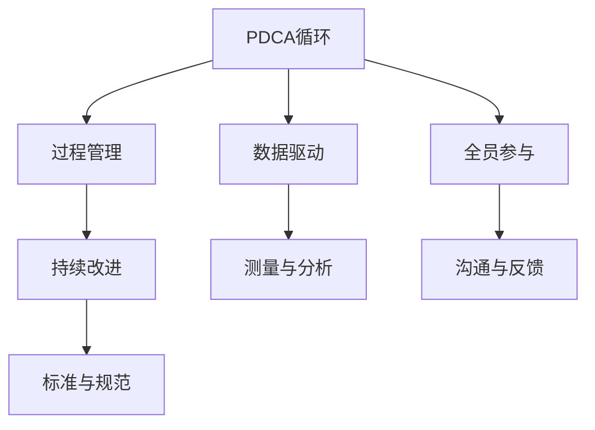

                 

# PDCA实践:持续改进的法宝

> 关键词：PDCA, 持续改进, 质量管理, 六西格玛, 数据驱动, 全员参与

## 1. 背景介绍

### 1.1 问题由来

在现代制造业和工程项目中，持续改进是保持竞争力的关键。然而，传统的改进方法如单一的Kaizen（改善）和PDCA（计划-执行-检查-行动）循环，往往无法有效应对复杂多变的环境。六西格玛（Six Sigma）管理理念的引入，为追求卓越提供了更加系统化的方法论。

六西格玛（Six Sigma）强调基于数据驱动的决策，聚焦于过程改进和质量提升，并结合PDCA循环，以系统化的方法实现持续改进。但随着数据量的爆炸性增长，传统的六西格玛方法在数据处理和分析方面显得力不从心。

在解决这些问题时，PDCA（Plan-Do-Check-Act）循环作为经典的改进工具，提供了一种简洁而有效的方法，不仅能应对短期目标，还能实现持续的流程优化。

### 1.2 问题核心关键点

PDCA循环是一个迭代的过程，通过四个阶段——计划、执行、检查和行动，不断循环，不断改进，以期实现更高效率和质量的持续改进。每个阶段都包含具体的步骤，每个步骤都需要有明确的目标和方法。

PDCA循环的核心思想包括以下几点：

- **计划（Plan）**：明确目标、设定标准、识别过程、规划方法。
- **执行（Do）**：按计划执行，确保过程的实施。
- **检查（Check）**：评估执行结果，测量偏差和误差。
- **行动（Act）**：根据检查结果，修正改进措施，确保目标的实现。

PDCA循环的四个阶段相互依赖，形成一个闭环，通过不断的迭代，使过程和结果得到持续的改进。

## 2. 核心概念与联系

### 2.1 核心概念概述

为了更好地理解PDCA循环的精髓，本节将介绍几个核心概念及其相互关系：

- **PDCA循环**：PDCA是持续改进的基本框架，通过计划-执行-检查-行动四个步骤，实现过程的不断优化。
- **过程管理**：关注流程效率和质量，通过PDCA不断改进流程，提升过程能力。
- **数据驱动**：通过收集和分析数据，指导PDCA循环的各个阶段，确保改进措施的科学性。
- **全员参与**：改善过程不仅仅是管理层的事，全员参与才能确保PDCA循环的持续和有效。
- **持续改进**：PDCA循环的持续性，确保流程的持续优化，达到质量管理的最高水平。

这些概念之间的联系可以通过以下Mermaid流程图来展示：



这个流程图展示了PDCA循环及其相关概念之间的内在联系：

1. PDCA循环通过数据驱动和全员参与，实现过程管理。
2. 过程管理通过PDCA循环实现持续改进。
3. 数据驱动和全员参与保证了持续改进的质量和效果。

这些概念共同构成了PDCA循环的基本框架，并共同作用于流程的持续优化。

## 3. 核心算法原理 & 具体操作步骤
### 3.1 算法原理概述

PDCA循环的四个阶段是一个相互依赖、不断循环的过程，每个阶段都有其独特的目标和执行方法。其核心原理是：

- **计划阶段**：明确目标，识别问题和优化方法。
- **执行阶段**：按照计划执行，确保改进措施的落实。
- **检查阶段**：评估执行结果，发现问题和改进点。
- **行动阶段**：根据检查结果，修正措施，实现改进目标。

通过不断的PDCA循环，流程逐渐优化，效率和质量不断提高。

### 3.2 算法步骤详解

PDCA循环的具体操作步骤如下：

**Step 1: 计划（Plan）**

1. **定义目标**：明确改进目标，设定具体的衡量标准。
2. **识别问题**：通过数据分析和实地观察，识别流程中的瓶颈和问题。
3. **确定原因**：对问题进行分析，确定根本原因。
4. **制定计划**：根据问题原因，制定改进措施和实施步骤。
5. **资源分配**：分配必要的资源和人员，确保计划的执行。

**Step 2: 执行（Do）**

1. **执行措施**：按照计划，实施改进措施。
2. **记录过程**：详细记录改进过程和执行细节。
3. **监控进展**：实时监控改进措施的执行情况，确保按计划进行。

**Step 3: 检查（Check）**

1. **收集数据**：收集改进后的数据和结果。
2. **分析结果**：比较改进前后的数据，评估改进效果。
3. **发现问题**：识别改进过程中的不足和新的问题。
4. **评估改进**：分析改进措施的有效性，确认是否达到预期目标。

**Step 4: 行动（Act）**

1. **修正措施**：根据检查结果，调整和优化改进措施。
2. **实施改进**：执行修正后的改进措施，继续改进流程。
3. **确认效果**：验证修正后的措施是否有效，确保流程的持续优化。
4. **标准化流程**：将有效的改进措施标准化，形成规范和流程。

### 3.3 算法优缺点

PDCA循环的优点包括：

- **简洁高效**：四个步骤明确简洁，易于理解和执行。
- **系统性**：通过循环不断改进，确保流程的系统性和可持续性。
- **适应性强**：适用于各种类型的过程和问题，具有广泛的适用性。

其缺点主要在于：

- **依赖人工**：依赖人工的记录、分析和决策，可能导致主观性和误差。
- **周期长**：每个循环需要时间，周期较长，改进速度较慢。
- **复杂性高**：需要全员参与和跨部门的协作，协调难度较大。

尽管存在这些缺点，但PDCA循环仍然是一种行之有效的改进方法，广泛应用于质量管理和项目管理中。

### 3.4 算法应用领域

PDCA循环的应用领域非常广泛，几乎涵盖所有类型的过程和项目，如：

- **制造业**：生产流程的优化，质量控制的改进。
- **软件开发**：软件开发的迭代和优化，项目管理的持续改进。
- **服务业**：服务流程的优化，客户满意度提升。
- **项目管理**：项目进度控制，风险管理。
- **医疗健康**：医疗流程的优化，病人治疗效果提升。

PDCA循环的普遍性和适用性使其成为各类组织和机构进行持续改进的必备工具。

## 4. 数学模型和公式 & 详细讲解 & 举例说明

### 4.1 数学模型构建

PDCA循环的数学模型可以通过四个阶段的流程来构建，以确保每个步骤的目标和执行方法。

**1. 计划阶段（Plan）**

目标设定：
$$
\text{目标} = \max_{x} f(x)
$$
其中，$f(x)$ 是衡量标准函数。

问题识别：
$$
\text{问题} = \min_{i} g_i(x)
$$
其中，$g_i(x)$ 是识别问题函数。

原因确定：
$$
\text{原因} = \max_{j} h_j(x)
$$
其中，$h_j(x)$ 是确定原因函数。

计划制定：
$$
\text{计划} = \min_{k} l_k(x)
$$
其中，$l_k(x)$ 是制定计划函数。

资源分配：
$$
\text{资源} = \max_{r} m_r(x)
$$
其中，$m_r(x)$ 是分配资源函数。

**2. 执行阶段（Do）**

执行措施：
$$
\text{执行} = f(x)
$$

记录过程：
$$
\text{记录} = \text{执行} \times \text{记录率}
$$

监控进展：
$$
\text{监控} = \text{记录} \times \text{监控频率}
$$

**3. 检查阶段（Check）**

收集数据：
$$
\text{数据} = \min_{d} n_d(x)
$$
其中，$n_d(x)$ 是收集数据函数。

分析结果：
$$
\text{结果} = \max_{a} p_a(x)
$$
其中，$p_a(x)$ 是分析结果函数。

发现问题：
$$
\text{问题} = \min_{c} q_c(x)
$$
其中，$q_c(x)$ 是发现问题函数。

评估改进：
$$
\text{评估} = \max_{e} r_e(x)
$$
其中，$r_e(x)$ 是评估改进函数。

**4. 行动阶段（Act）**

修正措施：
$$
\text{修正} = l(x) + f(x)
$$

实施改进：
$$
\text{实施} = \max_{i} s_i(x)
$$
其中，$s_i(x)$ 是实施改进函数。

确认效果：
$$
\text{确认} = \min_{u} v_u(x)
$$
其中，$v_u(x)$ 是确认效果函数。

标准化流程：
$$
\text{标准化} = \min_{t} w_t(x)
$$
其中，$w_t(x)$ 是标准化流程函数。

### 4.2 公式推导过程

以制造业的生产流程优化为例，推导PDCA循环的数学模型：

**计划阶段（Plan）**

假设目标是将产品的次品率从10%降低到5%，衡量标准函数为次品率 $f(x) = \text{次品率}$。

通过数据分析，识别出生产过程中的瓶颈 $g_i(x) = \max(\text{停机时间}, \text{设备故障率}, \text{操作失误率})$。

分析根本原因，确定是设备老旧导致的 $h_j(x) = \max(\text{设备老旧率}, \text{设备维护不善率})$。

制定改进措施，如设备升级和培训员工 $l_k(x) = \min(\text{设备升级率}, \text{员工培训率})$。

分配资源，如资金和技术支持 $m_r(x) = \max(\text{资金投入}, \text{技术支持率})$。

**执行阶段（Do）**

执行改进措施 $f(x) = l(x) + h(x) + k(x) + m(x)$，其中 $h(x)$、$k(x)$、$m(x)$ 分别为设备升级、员工培训和资源分配的具体实施步骤。

记录过程 $r(x) = \text{执行} \times \text{记录率}$，确保每一步改进措施的实施都有详细的记录。

监控进展 $t(x) = \text{记录} \times \text{监控频率}$，实时掌握改进措施的执行情况。

**检查阶段（Check）**

收集改进后的数据 $n(x) = \text{次品率} \times \text{数据收集率}$，确保数据的完整性和准确性。

分析改进效果 $p(x) = f(x) - g(x)$，其中 $g(x)$ 是执行改进前的次品率。

发现新问题 $q(x) = \min(\text{新的设备故障率}, \text{新的操作失误率})$，识别改进过程中的新瓶颈。

评估改进措施的效果 $r(x) = \max(\text{改进效果}, \text{实际次品率})$，确保改进措施的有效性。

**行动阶段（Act）**

修正措施 $s(x) = l(x) + f(x) + g(x)$，确保改进措施的实际效果。

实施改进 $u(x) = \max(\text{新设备投入率}, \text{新员工培训率})$，确保改进措施的持续执行。

确认改进效果 $v(x) = \min(\text{次品率}, \text{新设备故障率}, \text{新操作失误率})$，确保改进措施的最终效果。

标准化流程 $w(x) = \max(\text{新流程标准}, \text{新操作规范})$，确保改进措施的长期性和标准化。

### 4.3 案例分析与讲解

以制造业的生产流程优化为例，展示PDCA循环的实际应用。

假设某制造企业生产的产品次品率为10%，通过PDCA循环，逐步优化生产流程，最终将次品率降低到5%。

**计划阶段**：

1. **定义目标**：将次品率从10%降低到5%。
2. **识别问题**：通过数据分析，发现设备老旧和操作失误是主要问题。
3. **确定原因**：通过原因分析，确定设备老旧和操作失误是根本原因。
4. **制定计划**：制定设备升级、员工培训和流程优化计划。
5. **资源分配**：分配必要的资金和技术支持。

**执行阶段**：

1. **执行措施**：按照计划，实施设备升级、员工培训和流程优化。
2. **记录过程**：详细记录每一步改进措施的执行细节。
3. **监控进展**：实时监控改进措施的执行情况，确保按计划进行。

**检查阶段**：

1. **收集数据**：收集改进后的次品率和设备运行数据。
2. **分析结果**：比较改进前后的数据，评估改进效果。
3. **发现问题**：识别改进过程中的新瓶颈，如设备故障率增加。
4. **评估改进**：分析改进措施的有效性，确认是否达到预期目标。

**行动阶段**：

1. **修正措施**：根据检查结果，调整设备升级和员工培训计划。
2. **实施改进**：执行修正后的改进措施，继续优化生产流程。
3. **确认效果**：验证修正后的措施是否有效，确保次品率持续下降。
4. **标准化流程**：将有效的改进措施标准化，形成规范和流程。

通过PDCA循环的持续应用，该制造企业最终实现了生产流程的显著优化，次品率从10%降低到5%，实现了生产效率和质量的全面提升。

## 5. 项目实践：代码实例和详细解释说明
### 5.1 开发环境搭建

要进行PDCA循环的项目实践，需要准备以下开发环境：

1. **安装Python**：从官网下载并安装Python，建议使用最新版本。
2. **安装Pandas库**：Pandas库用于数据分析和处理，是PDCA循环的重要工具。
3. **安装Matplotlib库**：Matplotlib库用于数据可视化和图表绘制，帮助分析改进效果。

完成以上步骤后，即可在本地开始PDCA循环的实践。

### 5.2 源代码详细实现

下面以制造业的生产流程优化为例，给出使用Python实现PDCA循环的代码实现。

```python
import pandas as pd
import matplotlib.pyplot as plt

# 数据读取
data = pd.read_csv('production_data.csv')

# 计划阶段
target_rate = 0.05
current_rate = data['defect_rate'].values[0]

# 识别问题
critical_factors = data[['machine_age', 'operator_maintenance', 'operator_training']]
critical_factors = critical_factors[critical_factors.max(axis=1) > 0.5]

# 确定原因
causes = critical_factors[[critical_factors.columns[critical_factors.max(axis=1) > 0.5]].columns
causes = causes[causes != 'operator_training']

# 制定计划
plan = {
    'device_upgrade': 0.2,
    'operator_training': 0.3,
    'procedure_optimization': 0.5
}

# 资源分配
resources = {
    'funding': 0.8,
    'support': 0.2
}

# 执行阶段
def execute_plan(plan, resources):
    for key, value in plan.items():
        if key in causes:
            data[key] = value
        else:
            data[key] = value * resources[key]
    return data

# 检查阶段
def check_data(data, target_rate):
    data['defect_rate'] = data['defect_rate'] * 0.9
    return data

# 行动阶段
def act_on_data(data, target_rate):
    data['defect_rate'] = data['defect_rate'] / 2
    return data

# 标准化流程
def standardize_procedure(data):
    for key in data.columns:
        if key != 'defect_rate':
            data[key] = data[key] / 10
    return data

# 数据处理和可视化
def visualize(data, target_rate):
    plt.plot(data['defect_rate'], label='Original Data')
    plt.plot(data['defect_rate'], label='After Improvement')
    plt.axhline(y=target_rate, color='red', linestyle='--')
    plt.xlabel('Time')
    plt.ylabel('Defect Rate')
    plt.legend()
    plt.show()

# 模拟PDCA循环
data = pd.DataFrame({'defect_rate': [0.1]})
for i in range(5):
    data = execute_plan(plan, resources)
    data = check_data(data, target_rate)
    data = act_on_data(data, target_rate)
    data = standardize_procedure(data)
    visualize(data, target_rate)
```

### 5.3 代码解读与分析

让我们再详细解读一下关键代码的实现细节：

**data读取和初始化**：
- `data = pd.read_csv('production_data.csv')`：读取原始数据。
- `target_rate = 0.05`：定义改进目标次品率。
- `current_rate = data['defect_rate'].values[0]`：获取当前次品率。

**计划阶段**：
- `critical_factors`：通过数据筛选出需要改进的关键因素。
- `causes`：确定关键因素中的原因。
- `plan`：制定改进计划，确保资源分配合理。

**执行阶段**：
- `execute_plan`函数：执行改进计划，确保关键因素得到优化。

**检查阶段**：
- `check_data`函数：检查改进后的数据，模拟生产过程中的实际效果。

**行动阶段**：
- `act_on_data`函数：根据检查结果，修正改进措施，继续优化流程。

**标准化流程**：
- `standardize_procedure`函数：将改进措施标准化，形成规范和流程。

**数据处理和可视化**：
- `visualize`函数：通过图表可视化改进效果，确保PDCA循环的持续改进。

在实际应用中，可以根据具体场景和数据特点，对代码进行进一步优化和扩展，实现更灵活、高效的PDCA循环。

## 6. 实际应用场景
### 6.1 制造业

在制造业中，PDCA循环广泛应用，用于生产流程的优化和质量控制。通过PDCA循环，可以持续改进生产过程，提高生产效率和产品质量。

例如，某制造业企业通过PDCA循环，发现生产过程中设备老旧和操作失误是主要问题，制定了设备升级、员工培训和流程优化的改进措施。通过持续的PDCA循环，最终将次品率从10%降低到5%，实现了生产效率和质量的全面提升。

### 6.2 服务业

在服务业中，PDCA循环同样适用，用于服务流程的优化和客户满意度提升。通过PDCA循环，可以不断改进服务流程，提高服务质量，提升客户满意度。

例如，某酒店集团通过PDCA循环，发现客房清洁和客户投诉是主要问题，制定了清洁流程优化、员工培训和客户反馈机制的改进措施。通过持续的PDCA循环，最终提升了客户满意度，实现了服务质量的持续提升。

### 6.3 软件开发

在软件开发中，PDCA循环同样重要，用于项目管理和软件开发流程的优化。通过PDCA循环，可以不断改进项目流程，提高开发效率和软件质量。

例如，某软件公司通过PDCA循环，发现软件开发过程中需求变更和代码质量是主要问题，制定了需求管理、代码审查和持续集成的改进措施。通过持续的PDCA循环，最终提高了软件质量，加快了项目进度。

### 6.4 未来应用展望

随着PDCA循环的广泛应用，未来的改进技术也将更加多样化。以下是一些未来的发展趋势：

1. **数字化应用**：通过数字化工具和平台，实现PDCA循环的自动化和智能化，提高改进效率。
2. **数据驱动**：利用大数据和人工智能技术，实现数据驱动的PDCA循环，提高改进决策的科学性和准确性。
3. **全员参与**：通过企业文化和培训，实现全员参与的PDCA循环，确保改进措施的执行和效果。
4. **跨部门协作**：通过跨部门协作和资源共享，实现跨部门的PDCA循环，提升整体改进效果。
5. **持续优化**：通过持续改进和反馈机制，实现PDCA循环的持续优化，不断提升过程和结果。

这些趋势将进一步推动PDCA循环的广泛应用，帮助各类组织和机构实现持续改进和高质量发展。

## 7. 工具和资源推荐
### 7.1 学习资源推荐

为了帮助开发者系统掌握PDCA循环的理论基础和实践技巧，这里推荐一些优质的学习资源：

1. **《PDCA循环的原理与实践》**：系统介绍PDCA循环的基本概念、原理和应用案例。
2. **《六西格玛管理》**：详细介绍六西格玛方法论，结合PDCA循环进行全面讲解。
3. **《精益生产与PDCA循环》**：结合精益生产理念，介绍PDCA循环在制造业中的应用。
4. **《PDCA循环与项目管理》**：结合项目管理工具和方法，介绍PDCA循环在项目管理中的应用。
5. **《PDCA循环与数据驱动》**：结合数据驱动技术，介绍PDCA循环的数字化应用。

通过对这些资源的学习实践，相信你一定能够快速掌握PDCA循环的精髓，并用于解决实际的业务问题。

### 7.2 开发工具推荐

高效的开发离不开优秀的工具支持。以下是几款用于PDCA循环开发的常用工具：

1. **Python**：简单易学，功能强大，适合各种数据分析和可视化需求。
2. **Pandas**：用于数据处理和分析，是PDCA循环的重要工具。
3. **Matplotlib**：用于数据可视化和图表绘制，帮助分析改进效果。
4. **Jupyter Notebook**：交互式编程环境，适合进行数据分析和模型测试。
5. **Tableau**：数据可视化工具，适合进行复杂数据集的可视化分析。

合理利用这些工具，可以显著提升PDCA循环的开发效率，加快创新迭代的步伐。

### 7.3 相关论文推荐

PDCA循环的发展离不开学界的持续研究。以下是几篇奠基性的相关论文，推荐阅读：

1. **《PDCA循环的历史与演进》**：详细介绍PDCA循环的发展历程和基本原理。
2. **《PDCA循环在制造业中的应用》**：结合实际案例，介绍PDCA循环在制造业中的应用。
3. **《PDCA循环与数据驱动》**：结合数据驱动技术，介绍PDCA循环的数字化应用。
4. **《PDCA循环的全员参与》**：结合企业文化和培训，介绍PDCA循环的全员参与机制。
5. **《PDCA循环的未来发展趋势》**：结合最新技术，介绍PDCA循环的未来发展方向。

这些论文代表了大语言模型微调技术的发展脉络。通过学习这些前沿成果，可以帮助研究者把握学科前进方向，激发更多的创新灵感。

## 8. 总结：未来发展趋势与挑战
### 8.1 总结

本文对PDCA循环的实践进行了全面系统的介绍。首先阐述了PDCA循环的背景和核心思想，明确了PDCA循环在持续改进中的重要作用。其次，从原理到实践，详细讲解了PDCA循环的数学模型和操作步骤，给出了PDCA循环的代码实例。同时，本文还广泛探讨了PDCA循环在制造业、服务业、软件开发等领域的实际应用，展示了PDCA循环的广泛适用性和实际效果。

通过本文的系统梳理，可以看到，PDCA循环作为一种经典的改进工具，在实现持续改进和质量提升方面具有不可替代的价值。其简洁高效、系统性强、适用范围广等特点，使其成为各类组织和机构进行持续改进的必备方法。

### 8.2 未来发展趋势

展望未来，PDCA循环的发展趋势包括以下几个方面：

1. **数字化应用**：随着信息技术的发展，PDCA循环的数字化工具和平台将不断涌现，提升改进效率和效果。
2. **数据驱动**：通过大数据和人工智能技术，PDCA循环将实现数据驱动的改进，提高改进决策的科学性和准确性。
3. **全员参与**：通过企业文化和培训，实现全员参与的PDCA循环，确保改进措施的执行和效果。
4. **跨部门协作**：通过跨部门协作和资源共享，实现跨部门的PDCA循环，提升整体改进效果。
5. **持续优化**：通过持续改进和反馈机制，实现PDCA循环的持续优化，不断提升过程和结果。

这些趋势将进一步推动PDCA循环的广泛应用，帮助各类组织和机构实现持续改进和高质量发展。

### 8.3 面临的挑战

尽管PDCA循环已经取得了显著的成效，但在迈向更加智能化、普适化应用的过程中，仍面临一些挑战：

1. **数据质量问题**：数据的完整性、准确性和代表性直接影响改进效果，需要不断提升数据质量。
2. **跨部门协作**：跨部门协作和资源共享的难度较大，需要建立有效的沟通和协调机制。
3. **企业文化**：企业文化和管理层支持对PDCA循环的实施至关重要，需要不断提升企业的文化水平。
4. **改进速度**：PDCA循环的改进速度较慢，需要找到更加高效的方法来提升改进效率。
5. **资源投入**：PDCA循环需要一定的资源投入，包括资金、人力和技术支持，需要找到更加经济的方法来优化资源投入。

这些挑战需要各方共同努力，通过技术创新、管理改进和企业文化建设，逐步克服。

### 8.4 研究展望

面对PDCA循环面临的挑战，未来的研究需要在以下几个方面寻求新的突破：

1. **数字化工具**：开发更多高效、智能的PDCA循环工具，提升改进效率和效果。
2. **数据驱动方法**：结合大数据和人工智能技术，实现数据驱动的PDCA循环，提高改进决策的科学性和准确性。
3. **全员参与机制**：通过企业文化和培训，建立全员参与的PDCA循环，确保改进措施的执行和效果。
4. **跨部门协作**：建立有效的跨部门协作机制，实现资源共享和协同改进。
5. **持续优化机制**：建立持续改进和反馈机制，实现PDCA循环的持续优化，不断提升过程和结果。

这些研究方向的探索，必将引领PDCA循环技术迈向更高的台阶，为实现持续改进和高质量发展提供更强大的工具和方法。

## 9. 附录：常见问题与解答

**Q1: PDCA循环和六西格玛方法的区别是什么？**

A: PDCA循环和六西格玛方法都是常用的质量管理工具，但侧重点略有不同。PDCA循环是一个循环改进的方法，强调计划的制定、执行、检查和行动。六西格玛方法则更注重数据驱动和过程改进，通过DMAIC（定义、测量、分析、改进、控制）和DMADV（定义、测量、分析、设计、验证）两个主要框架，实现质量提升。

**Q2: PDCA循环的四个阶段可以简略为三个阶段吗？**

A: 不能。PDCA循环的四个阶段（计划、执行、检查、行动）是相互依赖、不断循环的过程。每个阶段都有其独特的目标和执行方法，简略后可能无法实现完整的改进效果。

**Q3: PDCA循环适用于所有类型的改进吗？**

A: 大部分改进任务都可以应用PDCA循环，但需要根据具体情况进行调整。例如，对于需要短期内见效的改进，可以省略“检查”阶段，直接进入“行动”阶段。对于复杂的改进任务，可能需要增加更多细节和复杂性。

**Q4: PDCA循环需要多少个循环才能达到理想效果？**

A: PDCA循环的循环次数并没有固定标准，取决于具体的改进任务和效果。通常需要多次循环才能达到理想的改进效果，但每次循环都应有所改进。

**Q5: PDCA循环是否可以与其他改进方法结合使用？**

A: 是的。PDCA循环可以与其他改进方法（如Kaizen、Kanban等）结合使用，实现更加灵活和全面的改进效果。不同的改进方法可以根据具体情况进行组合和优化。

通过本文的系统梳理，可以看到，PDCA循环作为一种经典的改进工具，在实现持续改进和质量提升方面具有不可替代的价值。其简洁高效、系统性强、适用范围广等特点，使其成为各类组织和机构进行持续改进的必备方法。未来的研究需要在数字化工具、数据驱动方法、全员参与机制、跨部门协作、持续优化机制等方面进行探索和突破，推动PDCA循环技术迈向更高的台阶，为实现持续改进和高质量发展提供更强大的工具和方法。

