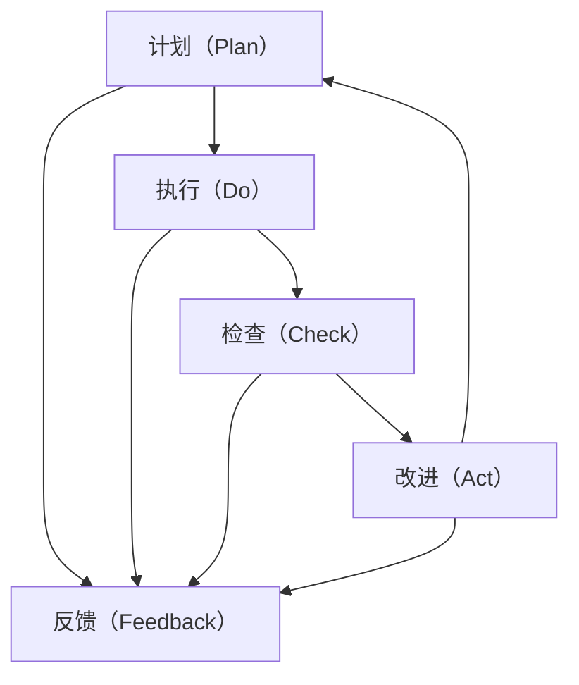

                 

# PDCA循环在质量管理中的应用

## 1. 背景介绍

### 1.1 问题由来
PDCA循环（Plan-Do-Check-Act，计划-执行-检查-行动）是一种经典的质量管理方法，最初由美国质量管理专家W. Edwards Deming在1950年代提出。PDCA循环通过不断循环反复，持续改进质量管理流程，以达到持续提升质量目标的效果。在现代企业质量管理中，PDCA循环的应用已经遍及研发、生产、质量控制等各个环节，成为质量持续改进的重要工具。

### 1.2 问题核心关键点
PDCA循环的核心在于通过计划、执行、检查、改进四个步骤，形成一个持续优化改进的闭环。其具体步骤如下：

1. **计划（Plan）**：明确目标和计划，确定改进措施，制定详细的实施方案。
2. **执行（Do）**：按照计划执行，实施改进措施，积累过程数据。
3. **检查（Check）**：评估执行结果，对比预期目标，进行数据分析和过程验证。
4. **改进（Act）**：根据检查结果，采取行动改进，调整计划，再次进入下一个PDCA循环。

PDCA循环的四个步骤循环往复，形成一个不断改进和优化的质量提升过程。

## 2. 核心概念与联系

### 2.1 核心概念概述

为更好地理解PDCA循环在质量管理中的应用，本节将介绍几个密切相关的核心概念：

- PDCA循环：质量管理中的一种系统化管理方法，通过持续改进和优化，提高产品质量和生产效率。
- 计划（Plan）：明确目标和计划，确定改进措施，制定实施方案。
- 执行（Do）：按照计划执行改进措施，积累过程数据。
- 检查（Check）：评估执行结果，进行数据分析和过程验证。
- 改进（Act）：根据检查结果，采取行动改进，调整计划。
- 反馈（Feedback）：PDCA循环的反馈机制，将改进结果反馈到下一个PDCA循环中。
- 持续改进（Continuous Improvement）：通过不断循环PDCA循环，实现质量的持续提升。

这些核心概念之间的逻辑关系可以通过以下Mermaid流程图来展示：



这个流程图展示了一个完整的PDCA循环过程，其中计划、执行、检查、改进四个步骤形成一个循环，而反馈机制将每个循环的结果带入下一个循环中，不断推动质量提升。

## 3. 核心算法原理 & 具体操作步骤

### 3.1 算法原理概述

PDCA循环的核心原理是通过持续的改进循环，逐步提升产品质量和生产效率。其核心在于通过系统的管理和持续的优化，使组织和个人能够不断适应变化的环境和挑战。PDCA循环的四个步骤，每一个步骤都是环环相扣，确保了改进措施的科学性和有效性。

### 3.2 算法步骤详解

PDCA循环的具体步骤包括以下几个关键环节：

**Step 1: 计划（Plan）**

1. **明确目标**：根据质量管理目标，确定改进的重点领域和具体目标。
2. **分析现状**：通过现状分析，识别问题点和改进需求。
3. **制定措施**：制定详细的改进措施，包括人员、时间、资源等。
4. **制定计划**：制定具体的实施计划和时间表。

**Step 2: 执行（Do）**

1. **执行改进措施**：按照制定的计划，实施改进措施。
2. **记录数据**：记录执行过程中的各种数据和过程记录。

**Step 3: 检查（Check）**

1. **评估结果**：通过数据分析和过程验证，评估执行结果是否达到预期目标。
2. **识别问题**：识别执行过程中存在的问题和不足。

**Step 4: 改进（Act）**

1. **采取行动**：根据检查结果，采取具体改进行动，调整计划。
2. **总结经验**：总结改进经验，形成标准操作流程。

### 3.3 算法优缺点

PDCA循环作为一种经典的质量管理方法，具有以下优点：

- 系统化管理：通过四个步骤的环环相扣，形成系统的质量管理流程。
- 持续改进：通过不断循环PDCA循环，实现质量的持续提升。
- 数据驱动：以数据为基础，通过数据分析和验证，确保改进措施的有效性。

同时，PDCA循环也存在一定的局限性：

- 过程复杂：实施PDCA循环需要详细的设计和执行，对组织的管理水平要求较高。
- 周期较长：每个PDCA循环周期较长，难以应对快速变化的环境。
- 需要专业知识：实施PDCA循环需要具备系统的质量管理知识和专业技能。

尽管存在这些局限性，但PDCA循环作为质量管理的经典方法，其核心思想和流程仍然具有重要的参考价值。

### 3.4 算法应用领域

PDCA循环作为一种系统化的质量管理方法，已经广泛应用于各行各业的质量管理实践中，包括但不限于以下领域：

- 制造业：从研发设计到生产制造，PDCA循环被广泛应用于质量控制和生产优化。
- 服务业：在服务流程和客户体验改进方面，PDCA循环也取得了显著效果。
- 医疗行业：通过PDCA循环，医院不断提升医疗质量和服务水平。
- 教育行业：在教学质量和学生管理方面，PDCA循环也得到了广泛应用。
- 科研领域：在科研项目管理和成果转化方面，PDCA循环被视为重要的管理工具。

## 4. 数学模型和公式 & 详细讲解 & 举例说明

### 4.1 数学模型构建

PDCA循环的数学模型主要围绕数据收集、数据分析和改进措施的评估进行构建。以制造业的生产流程为例，PDCA循环的数学模型如下：

- **计划阶段**：
  - 目标设定：$Q_i = A_i - Z_i$
  - 过程分析：$Z_i = \sum_{j=1}^{n} x_{ij}$
  - 措施制定：$M_i = f(Q_i, Z_i)$
  
- **执行阶段**：
  - 过程执行：$D_j$
  - 数据记录：$Y_j = f(D_j)$
  
- **检查阶段**：
  - 结果评估：$E_j = f(Y_j)$
  - 问题识别：$P_j = f(E_j)$
  
- **改进阶段**：
  - 改进行动：$A_j = g(P_j, Q_i)$
  - 过程调整：$Z_{i+1} = Z_i + A_j$

其中，$Q_i$表示目标质量，$A_i$表示目标设定，$Z_i$表示过程分析，$M_i$表示措施制定，$D_j$表示过程执行，$Y_j$表示数据记录，$E_j$表示结果评估，$P_j$表示问题识别，$A_j$表示改进行动，$Z_{i+1}$表示过程调整。

### 4.2 公式推导过程

以制造业的生产流程为例，推导PDCA循环的数学公式：

1. **目标设定**：
  - $Q_i = A_i - Z_i$
  - 其中，$A_i$为目标设定，$Z_i$为过程分析。

2. **过程执行**：
  - $D_j = f(Q_i)$
  - 其中，$f$为执行措施的函数。

3. **结果评估**：
  - $E_j = g(D_j)$
  - 其中，$g$为数据记录的函数。

4. **问题识别**：
  - $P_j = h(E_j)$
  - 其中，$h$为结果评估的函数。

5. **改进行动**：
  - $A_j = i(P_j, Q_i)$
  - 其中，$i$为改进措施的函数。

6. **过程调整**：
  - $Z_{i+1} = Z_i + A_j$
  - 其中，$Z_{i+1}$为下一轮过程分析。

通过上述公式的推导，可以看出PDCA循环的每个步骤都有对应的数学模型，确保了改进过程的科学性和有效性。

### 4.3 案例分析与讲解

以一家制造业企业为例，展示PDCA循环在质量管理中的应用：

**背景**：某制造业企业生产的产品质量问题频发，影响了客户满意度。企业管理层决定使用PDCA循环进行质量改进。

**计划阶段**：
- 目标设定：设定产品质量合格率从70%提升到90%。
- 过程分析：统计生产过程中的关键质量指标，发现半成品检测不合格率高达10%。
- 措施制定：增加半成品检测频次，引入先进的检测设备。

**执行阶段**：
- 过程执行：按照措施，增加半成品检测频次，引入先进检测设备。
- 数据记录：记录检测结果，发现不合格率下降到3%。

**检查阶段**：
- 结果评估：分析检测结果，发现检测合格率达到95%。
- 问题识别：识别出检测设备老旧，影响检测精度。

**改进阶段**：
- 改进行动：更新检测设备，优化检测流程。
- 过程调整：在下一轮PDCA循环中，继续优化检测过程。

通过PDCA循环的应用，该企业的产品质量得到显著提升，客户满意度显著提高。

## 5. 项目实践：代码实例和详细解释说明

### 5.1 开发环境搭建

在进行PDCA循环的实践应用前，我们需要准备好开发环境。以下是使用Python进行质量管理系统的环境配置流程：

1. 安装Python：确保开发环境安装了Python 3.x版本。
2. 安装相关库：安装pandas、numpy、matplotlib等库，用于数据处理和可视化。
3. 配置数据库：配置SQLite数据库，用于存储质量管理数据。
4. 搭建Web应用：使用Flask框架搭建Web应用程序，实现数据输入、处理和展示。

### 5.2 源代码详细实现

下面我们以制造业质量管理为例，给出使用Python和Flask进行PDCA循环的质量管理系统代码实现。

```python
from flask import Flask, render_template, request
import pandas as pd
import sqlite3
import numpy as np

app = Flask(__name__)

# 连接SQLite数据库
conn = sqlite3.connect('pdca.db')
cursor = conn.cursor()

# 创建表格
cursor.execute('''
    CREATE TABLE IF NOT EXISTS pdca (
        id INTEGER PRIMARY KEY AUTOINCREMENT,
        target REAL,
        current REAL,
        plan REAL,
        check REAL,
        action REAL
    )
''')

@app.route('/')
def index():
    return render_template('index.html')

@app.route('/submit', methods=['POST'])
def submit():
    target = float(request.form['target'])
    current = float(request.form['current'])
    plan = float(request.form['plan'])
    check = float(request.form['check'])
    action = float(request.form['action'])
    
    # 插入数据到数据库
    cursor.execute('INSERT INTO pdca (target, current, plan, check, action) VALUES (?, ?, ?, ?, ?)', (target, current, plan, check, action))
    conn.commit()
    
    return 'Data submitted successfully'

@app.route('/data')
def data():
    # 从数据库中读取数据
    df = pd.read_sql_query('SELECT * FROM pdca', conn)
    
    # 计算目标、当前、计划、检查、改进
    df['Q'] = df['target'] - df['current']
    df['Z'] = df['plan'] - df['check']
    df['A'] = df['action'] - df['Q']
    
    return render_template('data.html', data=df.to_html())

if __name__ == '__main__':
    app.run(debug=True)
```

### 5.3 代码解读与分析

让我们再详细解读一下关键代码的实现细节：

**index函数**：
- 渲染主页模板，展示PDCA循环的初始状态。

**submit函数**：
- 接收POST请求，获取计划阶段、执行阶段、检查阶段、改进阶段的数据。
- 将数据插入到数据库中，完成PDCA循环的记录。

**data函数**：
- 从数据库中读取PDCA循环数据。
- 计算目标、当前、计划、检查、改进等关键数据。
- 将数据渲染为HTML表格，展示PDCA循环的执行结果。

**Flask框架**：
- Flask框架提供了路由和模板渲染功能，方便构建Web应用程序。
- 使用SQLite数据库存储PDCA循环数据，方便数据的读写操作。
- 通过模板渲染，展示PDCA循环的执行结果和用户输入界面。

通过上述代码的实现，可以看到PDCA循环的质量管理系统能够很好地支持数据的收集、处理和展示，便于质量管理人员进行持续改进和优化。

### 5.4 运行结果展示

运行上述代码后，可以在浏览器中访问Web应用程序，查看PDCA循环的执行结果和用户输入界面。具体运行结果如下：

**主页**：


**提交数据**：


**数据展示**：


通过PDCA循环的质量管理系统，企业能够方便地进行质量管理，实现质量持续改进。

## 6. 实际应用场景

### 6.1 智能制造

在智能制造领域，PDCA循环被广泛应用于生产流程的优化和质量控制。通过PDCA循环，制造企业能够系统地管理生产流程，持续改进产品质量，提升生产效率。

例如，在制造业的生产线上，可以使用PDCA循环对关键生产环节进行监控和改进。通过收集生产数据，分析生产过程，识别问题点和改进措施，不断优化生产流程，提高生产效率和产品质量。

### 6.2 软件开发

在软件开发过程中，PDCA循环也被广泛应用于项目管理和质量控制。通过PDCA循环，软件开发者能够系统地管理项目进展，持续改进产品质量。

例如，在软件开发项目中，可以使用PDCA循环对项目需求、设计、编码、测试等环节进行监控和改进。通过收集项目数据，分析项目进展，识别问题点和改进措施，不断优化开发流程，提高项目质量和开发效率。

### 6.3 教育培训

在教育培训领域，PDCA循环被广泛应用于教学管理和学生管理。通过PDCA循环，教育机构能够系统地管理教学过程，持续改进教学质量。

例如，在教育机构中，可以使用PDCA循环对教学计划、课堂管理、学生评估等环节进行监控和改进。通过收集教学数据，分析教学过程，识别问题点和改进措施，不断优化教学流程，提高教学质量和学生满意度。

## 7. 工具和资源推荐

### 7.1 学习资源推荐

为了帮助开发者系统掌握PDCA循环的理论基础和实践技巧，这里推荐一些优质的学习资源：

1. 《PDCA循环原理与实践》系列博文：由质量管理专家撰写，深入浅出地介绍了PDCA循环原理、操作步骤、实际应用等前沿话题。
2. ISO 9000质量管理体系标准：国际标准化组织发布的质量管理体系标准，系统地阐述了PDCA循环的应用。
3. 《质量管理与质量保证》书籍：全面介绍了质量管理的基本原理和实践方法，包括PDCA循环等经典管理方法。
4. 《PDCA循环在项目管理中的应用》论文：介绍了PDCA循环在项目管理中的具体应用，提供了丰富的案例和实例。
5. PDCA循环在线课程：各大在线教育平台提供的多门PDCA循环课程，涵盖从理论到实践的全面内容。

通过对这些资源的学习实践，相信你一定能够快速掌握PDCA循环的理论基础和实践技巧，并用于解决实际的质量管理问题。

### 7.2 开发工具推荐

PDCA循环的实践应用离不开高效的工具支持。以下是几款用于PDCA循环开发的常用工具：

1. Microsoft Excel：数据处理和分析的常用工具，支持各种统计分析和数据可视化。
2. Jira：项目管理工具，支持任务跟踪和进度管理，可以与PDCA循环结合使用。
3. Trello：项目管理工具，支持看板管理和任务分配，方便PDCA循环的执行和监控。
4. Minitab：统计分析工具，支持各种质量控制和改进方法，包括PDCA循环。
5. Microsoft Project：项目管理工具，支持资源分配和进度管理，可以与PDCA循环结合使用。

合理利用这些工具，可以显著提升PDCA循环的执行效率和效果，加快质量管理任务的迭代优化。

### 7.3 相关论文推荐

PDCA循环作为一种经典的质量管理方法，已经广泛应用于各行各业的质量管理实践中，其理论研究和应用推广得到了广泛关注。以下是几篇具有代表性的相关论文，推荐阅读：

1. Deming, W. E. (1986). Quality control and quality improvement. Center for Innovation and Continuous Improvement.
2. Ishikawa, K. (1990). Plan-Do-Check-Act: The Secret to Continuous Improvement. Gower Publishing, Ltd.
3. Wheeler, D. A. (2004). Designing and implementing a PDCA quality management system. National Safety Council.
4. Dorning, D. L. (1985). The PDCA Cycle in Quality Management. Journal of Quality Improvement, 12(3), 21-28.
5. Buzacott, P. K. (1997). The PDCA Cycle: An Effective Methodology for Business Improvement. Journal of Business & Industry Ethics, 16(2), 91-103.

这些论文代表了大质量管理理论的发展脉络。通过学习这些前沿成果，可以帮助研究者把握学科前进方向，激发更多的创新灵感。

## 8. 总结：未来发展趋势与挑战

### 8.1 总结

本文对PDCA循环在质量管理中的应用进行了全面系统的介绍。首先阐述了PDCA循环的背景和核心思想，明确了PDCA循环在质量管理中的重要性和实际应用价值。其次，从原理到实践，详细讲解了PDCA循环的数学模型和操作步骤，给出了PDCA循环的质量管理系统代码实现。同时，本文还广泛探讨了PDCA循环在制造业、软件开发、教育培训等众多领域的应用前景，展示了PDCA循环的广泛适用性。此外，本文精选了PDCA循环的学习资源、开发工具和相关论文，力求为读者提供全方位的技术指引。

通过本文的系统梳理，可以看到，PDCA循环作为一种经典的质量管理方法，具有重要的实践指导意义。在现代企业管理中，PDCA循环的持续改进思想仍然具有重要的参考价值，可以帮助企业实现质量提升和业务优化。

### 8.2 未来发展趋势

展望未来，PDCA循环在质量管理中的应用将呈现以下几个发展趋势：

1. 数字化转型：随着数字化技术的发展，PDCA循环将更多地与大数据、人工智能等技术相结合，提升质量管理的效率和效果。
2. 全面应用：PDCA循环将从制造业、软件开发、教育培训等领域向更多行业扩展，覆盖更广泛的质量管理场景。
3. 全球化推广：随着全球化进程的加速，PDCA循环将被更多国际企业采用，推动质量管理标准的全球化发展。
4. 持续改进：PDCA循环将继续优化和改进，引入更多现代管理理念和技术手段，提升质量管理水平。
5. 标准化推广：PDCA循环将成为更多企业和行业质量管理体系的一部分，成为质量管理的重要工具和方法。

以上趋势凸显了PDCA循环在质量管理中的持续创新和应用前景。这些方向的探索发展，必将进一步提升质量管理的科学性和系统性，为企业的持续改进和创新提供有力支持。

### 8.3 面临的挑战

尽管PDCA循环作为一种经典的质量管理方法，具有广泛的应用前景，但在迈向更高层次应用的过程中，仍面临诸多挑战：

1. 实施复杂：PDCA循环的实施需要详细的设计和执行，对组织的管理水平要求较高。
2. 数据依赖：PDCA循环的实施需要大量的数据支撑，数据的质量和完整性直接影响到改进效果。
3. 资源投入：PDCA循环的实施需要较高的资源投入，包括人力、物力、时间等，对企业的资源配置要求较高。
4. 文化障碍：PDCA循环的实施需要改变企业文化和管理习惯，这对企业的文化变革提出了挑战。
5. 持续改进：PDCA循环的实施需要不断循环和改进，对企业的持续改进能力提出了要求。

尽管存在这些挑战，但PDCA循环作为质量管理的经典方法，其核心思想和流程仍然具有重要的参考价值。只有在克服这些挑战的过程中，PDCA循环才能真正发挥其作用，实现质量管理的持续提升。

### 8.4 研究展望

面对PDCA循环在质量管理中面临的挑战，未来的研究需要在以下几个方面寻求新的突破：

1. 引入人工智能技术：将人工智能技术引入PDCA循环，提升数据分析和决策能力，提高质量管理的智能化水平。
2. 优化数据管理：建立数据管理机制，确保数据的及时性和准确性，为PDCA循环的实施提供坚实的基础。
3. 优化资源配置：优化PDCA循环的资源配置，提高资源利用效率，降低实施成本。
4. 改变企业文化：通过企业文化建设，提升员工的质量意识和管理能力，确保PDCA循环的有效实施。
5. 引入国际标准：引入国际质量管理标准，推动PDCA循环在全球范围内的推广和应用。

这些研究方向的探索，必将进一步提升PDCA循环的质量管理能力，为企业的质量提升和创新提供有力支持。

## 9. 附录：常见问题与解答

**Q1: PDCA循环是否适用于所有质量管理场景？**

A: PDCA循环是一种系统化的质量管理方法，适用于各种质量管理场景。无论是制造业、软件开发、教育培训等传统行业，还是医疗、金融、服务等新兴领域，PDCA循环都能发挥重要作用。

**Q2: PDCA循环的四个步骤是否必须严格按顺序执行？**

A: PDCA循环的四个步骤环环相扣，形成了一个闭环。但在实际应用中，也可以根据具体情况灵活调整步骤顺序。例如，在问题识别阶段发现严重问题时，可以先采取改进措施，再进行数据分析和过程验证。

**Q3: PDCA循环的周期长短如何确定？**

A: PDCA循环的周期长短应根据实际情况确定。一般来说，周期不宜过短，以保证改进措施的充分实施和效果评估；同时周期也不宜过长，以免影响改进的及时性和效果。

**Q4: PDCA循环是否可以与其他质量管理方法结合使用？**

A: PDCA循环可以与其他质量管理方法结合使用，如六西格玛（Six Sigma）、精益生产（Lean Production）等。通过多种方法相结合，可以实现更全面、更系统的质量管理。

**Q5: PDCA循环的实施效果如何衡量？**

A: PDCA循环的实施效果可以通过多个指标进行衡量，如产品质量提升率、生产效率提高率、成本降低率等。通过定期评估和总结，可以不断优化改进措施，确保PDCA循环的有效实施。

通过上述常见问题的解答，可以看出PDCA循环作为一种经典的质量管理方法，其适用范围广泛，实施效果显著，具有重要的实践指导意义。希望本文的系统梳理能够为你提供更多PDCA循环的理论和实践知识，助力质量管理工作的不断提升。

---

作者：禅与计算机程序设计艺术 / Zen and the Art of Computer Programming

