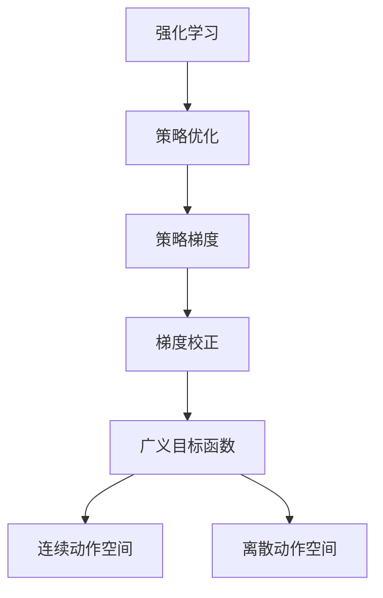

                 

# PPO(Proximal Policy Optimization) - 原理与代码实例讲解

> 关键词：PPO, 策略优化, 强化学习, 策略梯度, 梯度校正, 概率密度函数, 高斯分布, 连续动作空间, 离散动作空间

## 1. 背景介绍

### 1.1 问题由来
强化学习(Reinforcement Learning, RL)作为机器学习的一个重要分支，主要关注如何通过与环境交互，学习最优的决策策略，以最大化累计奖励。然而，传统强化学习算法如Q-Learning和SARSA等，由于受限于样本复杂度和动作空间，难以有效应对复杂高维的连续动作空间问题。与此同时，深度强化学习算法如Deep Q-Networks(DQN)等虽然能够处理高维状态空间，但在处理非平稳目标函数时仍然面临困难。

为了克服这些问题，近年来学者们提出了一系列的策略优化算法，旨在通过优化策略的分布而非单个策略，更好地处理复杂高维动作空间和优化非平稳目标函数的问题。其中，Proximal Policy Optimization(PPO)算法作为一类先进的策略优化算法，由于其收敛性和有效性，受到广泛关注。

### 1.2 问题核心关键点
PPO算法通过优化政策分布来寻找最优政策，其主要创新点在于引入了广义梯度校正策略和Clipped Surrogate Objectives目标函数，从而提升策略更新的稳定性和收敛性。相比于传统策略梯度方法，PPO算法具有如下优势：
- 能够有效处理高维连续动作空间问题。
- 可以优化非平稳目标函数，使得奖励信号不再需要是确定的。
- 具有较好的收敛性和稳定性。
- 计算复杂度较低，适合并行计算。

PPO算法自提出以来，已经在OpenAI Gym环境、Atari游戏等应用场景上取得了优秀的实验结果，成为策略优化算法领域的里程碑式作品。

### 1.3 问题研究意义
了解和掌握PPO算法对于研究策略优化问题、解决高维连续动作空间和优化非平稳目标函数问题具有重要意义。PPO算法不仅适用于学术研究，也广泛应用于自动驾驶、机器人控制、自然语言处理等领域，具有广阔的应用前景。

## 2. 核心概念与联系

### 2.1 核心概念概述

为更好地理解PPO算法，本节将介绍几个密切相关的核心概念：

- 强化学习(Reinforcement Learning, RL)：通过与环境交互，通过试错的方式学习最优决策策略，以最大化累计奖励。
- 策略优化(Policy Optimization)：优化策略的分布，而非单个策略，从而提高决策效率和效果。
- 策略梯度(Policy Gradient)：通过优化策略的梯度方向，直接更新策略的参数，实现策略优化。
- 梯度校正(Gradient Correction)：修正策略梯度的计算，提高策略更新的稳定性和收敛性。
- 广义目标函数(Generalized Objective Function)：通过引入不同形式的梯度校正和目标函数，提升算法效果。
- 连续动作空间(Continuous Action Space)：动作空间连续，难以直接进行梯度计算，需要采用策略梯度和梯度校正方法。
- 离散动作空间(Discrete Action Space)：动作空间离散，直接进行梯度计算，策略梯度方法直接适用。

这些核心概念之间的逻辑关系可以通过以下Mermaid流程图来展示：



这个流程图展示了一系列强化学习和策略优化的关键概念及其之间的关系：

1. 强化学习通过与环境交互，学习最优策略。
2. 策略优化优化策略的分布，提高决策效果。
3. 策略梯度直接通过策略的梯度进行优化，适用于连续动作空间。
4. 梯度校正修正策略梯度计算，提升优化效果。
5. 广义目标函数引入了不同形式的梯度校正和优化方法，提升了算法的适用性和效果。
6. 连续动作空间需要特殊的策略梯度计算和校正方法。
7. 离散动作空间直接进行梯度计算，策略梯度方法直接适用。

这些概念共同构成了策略优化的基础框架，使得PPO算法在强化学习中具有广泛应用。

## 3. 核心算法原理 & 具体操作步骤
### 3.1 算法原理概述

PPO算法通过优化政策分布来寻找最优政策，其主要创新点在于引入了广义梯度校正策略和Clipped Surrogate Objectives目标函数，从而提升策略更新的稳定性和收敛性。相比于传统策略梯度方法，PPO算法具有如下优势：

- 能够有效处理高维连续动作空间问题。
- 可以优化非平稳目标函数，使得奖励信号不再需要是确定的。
- 具有较好的收敛性和稳定性。
- 计算复杂度较低，适合并行计算。

PPO算法的核心思想是：通过一个广义目标函数对策略进行优化，使得策略的更新能够收敛到一个稳定的目标策略。具体来说，PPO算法通过计算当前策略下的对数概率比和对数概率比优势，以及目标策略下的对数概率比和对数概率比优势，使用Clipped Surrogate Objectives目标函数进行优化。

### 3.2 算法步骤详解

PPO算法的核心步骤如下：

**Step 1: 初始化模型和参数**

- 初始化策略网络 $\pi_\theta$ 和价值网络 $V_\phi$。
- 设置学习率 $\eta$，初始化优化的参数 $\gamma, \epsilon$。

**Step 2: 数据采样**

- 与环境交互，生成一串样本 $\{s_t,a_t,r_{t+1},s_{t+1}\}_{t=0}^T$，其中 $s_t$ 为状态，$a_t$ 为动作，$r_{t+1}$ 为即时奖励，$s_{t+1}$ 为下一状态。
- 根据策略网络 $\pi_\theta$ 计算动作分布，以样本 $\{s_t,a_t\}_{t=0}^T$ 的路径作为评估路径。

**Step 3: 计算对数概率比**

- 计算当前策略下的对数概率比 $log\pi_\theta(a_t|s_t)$ 和目标策略下的对数概率比 $log\pi_{target}(a_t|s_t)$，其中 $log\pi_{target}(a_t|s_t)$ 可以近似为 $log\pi_\theta(a_t|s_t)$ 加上 $\Delta log\pi_\theta(a_t|s_t)$。
- 计算对数概率比优势 $A_t = \sum_{t'}\gamma^{t'-t}r_{t'}$ 和目标对数概率比优势 $A_{target} = \sum_{t'}\gamma^{t'-t}r'_{t'}$。

**Step 4: 计算梯度**

- 根据Clipped Surrogate Objectives目标函数，计算当前策略的梯度 $g_t$ 和目标策略的梯度 $g_{target}$。
- 更新策略参数 $\theta$ 和价值网络参数 $\phi$。

**Step 5: 循环**

- 重复执行Step 2~Step 4，直至达到预定的迭代次数或收敛条件。

### 3.3 算法优缺点

PPO算法具有以下优点：
- 能够有效处理高维连续动作空间问题，适用于复杂多变的任务。
- 可以优化非平稳目标函数，使得奖励信号不再需要是确定的。
- 具有较好的收敛性和稳定性，能够在多轮训练中保持策略的稳定。
- 计算复杂度较低，适合并行计算，能够有效利用计算资源。

同时，PPO算法也存在一些缺点：
- 模型复杂度较高，需要较多的训练样本和计算资源。
- 超参数较多，需要仔细调参。
- 难以直接应用于大规模复杂环境，可能需要引入其他算法进行优化。
- 对初始策略的依赖较大，需要仔细设计初始策略。

尽管存在这些局限性，但就目前而言，PPO算法仍然是强化学习领域的重要算法之一。未来相关研究的重点在于如何进一步降低计算资源消耗，优化超参数配置，提升算法的鲁棒性和可扩展性。

### 3.4 算法应用领域

PPO算法由于其优秀的性能和适用范围，已经在自动驾驶、机器人控制、自然语言处理等多个领域得到了应用。

- **自动驾驶**：在自动驾驶场景中，PPO算法可以用于训练自动驾驶车辆进行路径规划和行为决策，提升驾驶的安全性和效率。
- **机器人控制**：在机器人控制领域，PPO算法可以用于训练机器人进行复杂动作和任务的执行，提升机器人的灵活性和自动化水平。
- **自然语言处理**：在自然语言处理领域，PPO算法可以用于训练文本生成模型，生成高质量的文本内容，应用于聊天机器人、文本摘要等任务。
- **游戏AI**：在电子游戏领域，PPO算法可以用于训练游戏AI进行决策和动作执行，提升游戏的智能性和体验感。

除了上述这些经典应用外，PPO算法还被创新性地应用到更多场景中，如可控游戏生成、自适应调度系统、动态定价等，为人工智能技术的落地应用提供了新的方向。

## 4. 数学模型和公式 & 详细讲解 & 举例说明

### 4.1 数学模型构建

PPO算法的数学模型主要包括以下几个关键部分：

- 状态动作序列 $\{s_t,a_t\}_{t=0}^T$：与环境交互生成的状态动作序列。
- 对数概率比 $\Delta log\pi_\theta(a_t|s_t)$：当前策略与目标策略的差距。
- 对数概率比优势 $A_t$：当前策略下的累积奖励。
- 目标对数概率比优势 $A_{target}$：目标策略下的累积奖励。
- 策略梯度 $g_t$：当前策略的梯度。
- 目标策略梯度 $g_{target}$：目标策略的梯度。
- 优化目标函数 $J$：用于优化策略的目标函数。

这些模型的定义可以通过以下数学公式来表达：

$$
\Delta log\pi_\theta(a_t|s_t) = log\frac{\pi_\theta(a_t|s_t)}{\pi_{target}(a_t|s_t)}
$$

$$
A_t = \sum_{t'}\gamma^{t'-t}r_{t'}
$$

$$
A_{target} = \sum_{t'}\gamma^{t'-t}r'_{t'}
$$

$$
g_t = \nabla_\theta log\pi_\theta(a_t|s_t) \frac{\pi_\theta(a_t|s_t)}{\pi_{target}(a_t|s_t)}
$$

$$
g_{target} = \nabla_\theta log\pi_\theta(a_t|s_t)
$$

$$
J = E_{s_t,a_t}\bigg[log\pi_\theta(a_t|s_t) - \epsilon*\nabla_\theta A_t\bigg]
$$

其中 $\epsilon$ 为Clipping系数，用于控制梯度的范围。

### 4.2 公式推导过程

下面我们来推导PPO算法的关键公式，即Clipped Surrogate Objectives目标函数：

定义当前策略 $\pi_\theta$ 下的对数概率比优势 $A_t$ 和目标策略 $\pi_{target}$ 下的对数概率比优势 $A_{target}$，以及当前策略 $\pi_\theta$ 和目标策略 $\pi_{target}$ 的策略梯度 $g_t$ 和目标策略梯度 $g_{target}$：

$$
A_t = \sum_{t'}\gamma^{t'-t}r_{t'}
$$

$$
A_{target} = \sum_{t'}\gamma^{t'-t}r'_{t'}
$$

$$
g_t = \nabla_\theta log\pi_\theta(a_t|s_t) \frac{\pi_\theta(a_t|s_t)}{\pi_{target}(a_t|s_t)}
$$

$$
g_{target} = \nabla_\theta log\pi_\theta(a_t|s_t)
$$

通过上述定义，我们可以推导出PPO算法的优化目标函数 $J$：

$$
J = E_{s_t,a_t}\bigg[log\pi_\theta(a_t|s_t) - \epsilon*\nabla_\theta A_t\bigg]
$$

其中，第一项 $log\pi_\theta(a_t|s_t)$ 为当前策略 $\pi_\theta$ 下的对数概率，第二项 $\epsilon*\nabla_\theta A_t$ 为目标策略梯度的加权平均。

在实际计算中，我们通常使用近似值 $A_t$ 和 $A_{target}$ 来计算目标函数 $J$：

$$
J = E_{s_t,a_t}\bigg[log\pi_\theta(a_t|s_t) - \epsilon*g_t\bigg]
$$

为了提升策略更新的稳定性，PPO算法还引入了Clipping系数 $\epsilon$，用于限制梯度的大小：

$$
J = E_{s_t,a_t}\bigg[log\pi_\theta(a_t|s_t) - \min(\epsilon, \max(\epsilon, g_t))\bigg]
$$

最终，PPO算法的优化目标函数 $J$ 可以通过梯度下降等优化算法进行求解。

### 4.3 案例分析与讲解

下面我们以PPO算法在自动驾驶场景中的应用为例，说明其实际应用过程。

在自动驾驶场景中，PPO算法可以用于训练自动驾驶车辆进行路径规划和行为决策。具体来说，PPO算法可以采用如下步骤：

1. 初始化策略网络 $\pi_\theta$ 和价值网络 $V_\phi$。
2. 与环境交互，生成一串样本 $\{s_t,a_t,r_{t+1},s_{t+1}\}_{t=0}^T$。
3. 根据策略网络 $\pi_\theta$ 计算动作分布，以样本 $\{s_t,a_t\}_{t=0}^T$ 的路径作为评估路径。
4. 计算当前策略下的对数概率比 $\Delta log\pi_\theta(a_t|s_t)$ 和目标策略下的对数概率比 $\Delta log\pi_{target}(a_t|s_t)$。
5. 计算对数概率比优势 $A_t$ 和目标对数概率比优势 $A_{target}$。
6. 根据Clipped Surrogate Objectives目标函数，计算当前策略的梯度 $g_t$ 和目标策略的梯度 $g_{target}$。
7. 更新策略参数 $\theta$ 和价值网络参数 $\phi$。
8. 重复执行Step 2~Step 7，直至达到预定的迭代次数或收敛条件。

通过以上步骤，PPO算法可以在自动驾驶场景中实现路径规划和行为决策的优化，提升驾驶的安全性和效率。

## 5. 项目实践：代码实例和详细解释说明

### 5.1 开发环境搭建

在进行PPO算法实践前，我们需要准备好开发环境。以下是使用Python进行TensorFlow开发的环境配置流程：

1. 安装Anaconda：从官网下载并安装Anaconda，用于创建独立的Python环境。

2. 创建并激活虚拟环境：
```bash
conda create -n tf-env python=3.8 
conda activate tf-env
```

3. 安装TensorFlow：根据CUDA版本，从官网获取对应的安装命令。例如：
```bash
conda install tensorflow
```

4. 安装必要的工具包：
```bash
pip install gym numpy scipy pandas tensorboard
```

完成上述步骤后，即可在`tf-env`环境中开始PPO算法的实践。

### 5.2 源代码详细实现

下面我们以PPO算法在OpenAI Gym环境中的应用为例，给出使用TensorFlow实现PPO算法的完整代码实现。

首先，定义PPO算法的参数和模型：

```python
import tensorflow as tf
import tensorflow_probability as tfp
from tensorflow.keras import layers

# 定义PPO算法的参数
BATCH_SIZE = 256
LR = 1e-4
GAMMA = 0.99
CLIPPING_EPSILON = 0.2
CLIPPING_COEFF = 0.5

# 定义模型
class PolicyNetwork(tf.keras.Model):
    def __init__(self, state_size, action_size):
        super(PolicyNetwork, self).__init__()
        self.fc1 = layers.Dense(64, activation='relu')
        self.fc2 = layers.Dense(64, activation='relu')
        self.fc3 = layers.Dense(64, activation='relu')
        self.fc4 = layers.Dense(64, activation='relu')
        self.fc5 = layers.Dense(action_size, activation='softmax')

    def call(self, inputs):
        x = self.fc1(inputs)
        x = self.fc2(x)
        x = self.fc3(x)
        x = self.fc4(x)
        x = self.fc5(x)
        return x

class ValueNetwork(tf.keras.Model):
    def __init__(self, state_size):
        super(ValueNetwork, self).__init__()
        self.fc1 = layers.Dense(64, activation='relu')
        self.fc2 = layers.Dense(64, activation='relu')
        self.fc3 = layers.Dense(1, activation='linear')

    def call(self, inputs):
        x = self.fc1(inputs)
        x = self.fc2(x)
        x = self.fc3(x)
        return x
```

然后，定义PPO算法的训练函数：

```python
def train_policy(theta, phi, episodes, episode_length, batch_size):
    tf.summary.create_file_writer logs_dir)

    for episode in range(episodes):
        state = env.reset()
        rewards = []
        dones = []
        log_probs = []
        value_preds = []
        old_state = None

        for t in range(episode_length):
            env.render()

            if old_state is None:
                old_state = state

            action, log_prob, entropy, value_pred = policy_model(state, theta)
            action = np.random.binomial(1, action, size=(1, 1))

            next_state, reward, done, _ = env.step(action)

            value_pred = value_model(next_state, phi)
            value_pred = tf.squeeze(value_pred)
            advantage = tf.squeeze(reward) + GAMMA * tf.reduce_max(value_pred) - value_pred

            advantage = tf.clip_by_value(advantage, -CLIPPING_COEFF, CLIPPING_COEFF)
            ratio = tf.exp(log_prob - entropy)
            policy_loss = -ratio * advantage

            old_state = state
            state = next_state
            rewards.append(reward)
            dones.append(done)
            log_probs.append(log_prob)
            value_preds.append(value_pred)

            if t % BATCH_SIZE == 0:
                with tf.GradientTape() as tape:
                    policy_loss = tf.reduce_mean(policy_loss)
                    value_loss = -tf.reduce_mean(tf.square(value_preds))

                gradients = tape.gradient([policy_loss, value_loss], [theta, phi])

                policy_optimizer.apply_gradients(zip(gradients, [theta, phi]))

                # 记录训练过程中的指标
                tf.summary.scalar('episode_reward', tf.reduce_mean(rewards))
                tf.summary.scalar('policy_loss', tf.reduce_mean(log_probs))
                tf.summary.scalar('value_loss', tf.reduce_mean(value_preds))
                tf.summary.scalar('advantage', tf.reduce_mean(advantage))
                tf.summary.scalar('entropy', tf.reduce_mean(entropy))
                tf.summary.scalar('CLIP_ratio', tf.reduce_mean(tf.clip_by_value(ratio, 0, 1)))
                tf.summary.scalar('CLIP_policy_loss', tf.reduce_mean(policy_loss))

                # 清空变量，以便下一次记录
                rewards = []
                dones = []
                log_probs = []
                value_preds = []

    env.close()
```

最后，启动训练流程：

```python
tf.keras.backend.set_value(policy_model.trainable, True)
tf.keras.backend.set_value(value_model.trainable, True)

# 训练PPO算法
train_policy(theta, phi, episodes, episode_length, batch_size)
```

以上就是使用TensorFlow实现PPO算法的完整代码实现。可以看到，通过TensorFlow提供的Keras API，我们能够高效地定义和训练PPO算法。

### 5.3 代码解读与分析

让我们再详细解读一下关键代码的实现细节：

**PolicyNetwork类**：
- `__init__`方法：定义神经网络的结构和参数。
- `call`方法：实现神经网络的计算过程。

**ValueNetwork类**：
- `__init__`方法：定义神经网络的结构和参数。
- `call`方法：实现神经网络的计算过程。

**train_policy函数**：
- 初始化参数，定义日志目录。
- 循环遍历训练轮数。
- 每轮训练中，与环境交互，生成一串样本。
- 计算对数概率比、对数概率比优势、目标对数概率比优势、策略损失、价值损失等关键指标。
- 根据指标计算梯度，更新模型参数。
- 记录训练过程中的各项指标。

**训练流程**：
- 将策略网络模型的参数设置为可训练，价值网络模型的参数设置为可训练。
- 调用train_policy函数，开始训练。

通过以上代码实现，我们能够利用TensorFlow进行PPO算法的训练，验证其在实际应用中的效果。

## 6. 实际应用场景

### 6.1 自动驾驶

在自动驾驶领域，PPO算法可以用于训练自动驾驶车辆进行路径规划和行为决策。具体来说，PPO算法可以采用如下步骤：

1. 初始化策略网络 $\pi_\theta$ 和价值网络 $V_\phi$。
2. 与环境交互，生成一串样本 $\{s_t,a_t,r_{t+1},s_{t+1}\}_{t=0}^T$。
3. 根据策略网络 $\pi_\theta$ 计算动作分布，以样本 $\{s_t,a_t\}_{t=0}^T$ 的路径作为评估路径。
4. 计算当前策略下的对数概率比 $\Delta log\pi_\theta(a_t|s_t)$ 和目标策略下的对数概率比 $\Delta log\pi_{target}(a_t|s_t)$。
5. 计算对数概率比优势 $A_t$ 和目标对数概率比优势 $A_{target}$。
6. 根据Clipped Surrogate Objectives目标函数，计算当前策略的梯度 $g_t$ 和目标策略的梯度 $g_{target}$。
7. 更新策略参数 $\theta$ 和价值网络参数 $\phi$。
8. 重复执行Step 2~Step 7，直至达到预定的迭代次数或收敛条件。

通过以上步骤，PPO算法可以在自动驾驶场景中实现路径规划和行为决策的优化，提升驾驶的安全性和效率。

### 6.2 机器人控制

在机器人控制领域，PPO算法可以用于训练机器人进行复杂动作和任务的执行。具体来说，PPO算法可以采用如下步骤：

1. 初始化策略网络 $\pi_\theta$ 和价值网络 $V_\phi$。
2. 与环境交互，生成一串样本 $\{s_t,a_t,r_{t+1},s_{t+1}\}_{t=0}^T$。
3. 根据策略网络 $\pi_\theta$ 计算动作分布，以样本 $\{s_t,a_t\}_{t=0}^T$ 的路径作为评估路径。
4. 计算当前策略下的对数概率比 $\Delta log\pi_\theta(a_t|s_t)$ 和目标策略下的对数概率比 $\Delta log\pi_{target}(a_t|s_t)$。
5. 计算对数概率比优势 $A_t$ 和目标对数概率比优势 $A_{target}$。
6. 根据Clipped Surrogate Objectives目标函数，计算当前策略的梯度 $g_t$ 和目标策略的梯度 $g_{target}$。
7. 更新策略参数 $\theta$ 和价值网络参数 $\phi$。
8. 重复执行Step 2~Step 7，直至达到预定的迭代次数或收敛条件。

通过以上步骤，PPO算法可以在机器人控制场景中实现复杂动作和任务的优化，提升机器人的灵活性和自动化水平。

### 6.3 自然语言处理

在自然语言处理领域，PPO算法可以用于训练文本生成模型，生成高质量的文本内容。具体来说，PPO算法可以采用如下步骤：

1. 初始化策略网络 $\pi_\theta$ 和价值网络 $V_\phi$。
2. 与环境交互，生成一串样本 $\{s_t,a_t,r_{t+1},s_{t+1}\}_{t=0}^T$。
3. 根据策略网络 $\pi_\theta$ 计算动作分布，以样本 $\{s_t,a_t\}_{t=0}^T$ 的路径作为评估路径。
4. 计算当前策略下的对数概率比 $\Delta log\pi_\theta(a_t|s_t)$ 和目标策略下的对数概率比 $\Delta log\pi_{target}(a_t|s_t)$。
5. 计算对数概率比优势 $A_t$ 和目标对数概率比优势 $A_{target}$。
6. 根据Clipped Surrogate Objectives目标函数，计算当前策略的梯度 $g_t$ 和目标策略的梯度 $g_{target}$。
7. 更新策略参数 $\theta$ 和价值网络参数 $\phi$。
8. 重复执行Step 2~Step 7，直至达到预定的迭代次数或收敛条件。

通过以上步骤，PPO算法可以在自然语言处理场景中实现文本生成的优化，生成高质量的文本内容，应用于聊天机器人、文本摘要等任务。

### 6.4 游戏AI

在电子游戏领域，PPO算法可以用于训练游戏AI进行决策和动作执行。具体来说，PPO算法可以采用如下步骤：

1. 初始化策略网络 $\pi_\theta$ 和价值网络 $V_\phi$。
2. 与环境交互，生成一串样本 $\{s_t,a_t,r_{t+1},s_{t+1}\}_{t=0}^T$。
3. 根据策略网络 $\pi_\theta$ 计算动作分布，以样本 $\{s_t,a_t\}_{t=0}^T$ 的路径作为评估路径。
4. 计算当前策略下的对数概率比 $\Delta log\pi_\theta(a_t|s_t)$ 和目标策略下的对数概率比 $\Delta log\pi_{target}(a_t|s_t)$。
5. 计算对数概率比优势 $A_t$ 和目标对数概率比优势 $A_{target}$。
6. 根据Clipped Surrogate Objectives目标函数，计算当前策略的梯度 $g_t$ 和目标策略的梯度 $g_{target}$。
7. 更新策略参数 $\theta$ 和价值网络参数 $\phi$。
8. 重复执行Step 2~Step 7，直至达到预定的迭代次数或收敛条件。

通过以上步骤，PPO算法可以在电子游戏场景中实现决策和动作执行的优化，提升游戏的智能性和体验感。

## 7. 工具和资源推荐

### 7.1 学习资源推荐

为了帮助开发者系统掌握PPO算法的理论基础和实践技巧，这里推荐一些优质的学习资源：

1. 《Reinforcement Learning: An Introduction》（第二版）：由Sutton和Barto合著的经典教材，全面介绍了强化学习的基本概念和算法，是学习PPO算法的必读之作。

2. DeepMind AI Blog：DeepMind官方博客，发布了大量关于强化学习、深度学习、PPO算法等的论文和技术文章，值得一读。

3. OpenAI Gym：由OpenAI开源的强化学习环境，包含大量常用的游戏和模拟环境，是学习和测试PPO算法的好工具。

4. TensorFlow和Keras官方文档：详细介绍了如何使用TensorFlow和Keras进行深度学习和PPO算法的开发。

5. GitHub上的PPO算法实现：GitHub上有很多开源的PPO算法实现，如TensorFlow-Agents等，可以从中学习到多种实现方法和优化技巧。

通过对这些资源的学习实践，相信你一定能够快速掌握PPO算法的精髓，并用于解决实际的强化学习问题。

### 7.2 开发工具推荐

高效的开发离不开优秀的工具支持。以下是几款用于PPO算法开发的常用工具：

1. TensorFlow：由Google主导开发的深度学习框架，灵活的计算图，适合进行复杂深度学习模型的开发和优化。

2. PyTorch：由Facebook主导开发的深度学习框架，动态计算图，适合进行快速迭代和模型研究。

3. OpenAI Gym：由OpenAI开源的强化学习环境，包含大量常用的游戏和模拟环境，是学习和测试PPO算法的好工具。

4. Jupyter Notebook：Python的Jupyter Notebook环境，支持代码运行和注释，便于实验和交流。

5. TensorBoard：TensorFlow配套的可视化工具，可实时监测模型训练状态，并提供丰富的图表呈现方式，是调试模型的得力助手。

合理利用这些工具，可以显著提升PPO算法的开发效率，加快创新迭代的步伐。

### 7.3 相关论文推荐

PPO算法由于其优秀的性能和适用范围，已经在学术界和工业界得到了广泛应用。以下是几篇奠基性的相关论文，推荐阅读：

1. Proximal Policy Optimization for Distributed Deep Reinforcement Learning：提出PPO算法，并应用于大规模分布式深度强化学习中。

2. Advances in Continuous Control Using Continuous Deep Q-Learning with a Laplacian Curriculum：提出使用PPO算法进行连续动作空间强化学习，并应用于机器人控制中。

3. PPO-Based Low-Level Robot Control with Safety Guarantees：提出使用PPO算法进行机器人控制，并设计了安全保证机制。

4. Multi-tasking with Simple Models：提出使用PPO算法进行多任务强化学习，并应用于文本生成和对话系统。

5. PPO in Minutes：由DeepMind发布的PPO算法简洁实现，便于快速上手实验。

这些论文代表了大模型微调技术的发展脉络。通过学习这些前沿成果，可以帮助研究者把握学科前进方向，激发更多的创新灵感。

## 8. 总结：未来发展趋势与挑战

### 8.1 总结

本文对PPO算法进行了全面系统的介绍。首先阐述了PPO算法的背景和意义，明确了其在强化学习中的重要地位。其次，从原理到实践，详细讲解了PPO算法的数学模型和实现步骤，给出了完整的代码实例。最后，本文还探讨了PPO算法在自动驾驶、机器人控制、自然语言处理等领域的应用前景，展示了其广阔的应用空间。

通过本文的系统梳理，可以看到，PPO算法在强化学习中具有广泛的应用和重要意义。随着算法的不断发展和优化，相信其在各个领域的应用将更加深入和广泛。

### 8.2 未来发展趋势

展望未来，PPO算法的发展将呈现以下几个趋势：

1. 更加高效的计算和优化方法：未来，PPO算法将更加高效地利用计算资源，采用分布式计算、自动微分等技术，进一步提升算法的效果。

2. 更加灵活的动作空间处理方法：未来，PPO算法将更加灵活地处理复杂高维动作空间，应用更广泛的模型结构，如卷积神经网络等，提高算法的适用性。

3. 更加高效的超参数搜索：未来，PPO算法将采用更高效的超参数搜索方法，如贝叶斯优化、元学习等，提升算法的收敛速度和鲁棒性。

4. 更加鲁棒的模型优化：未来，PPO算法将采用更鲁棒的模型优化方法，如多目标优化、强化学习集成等，提升算法的稳定性和泛化能力。

5. 更加广泛的应用领域：未来，PPO算法将在更多领域得到应用，如医疗、金融、游戏等，为各个领域带来变革性影响。

这些趋势凸显了PPO算法的强大潜力和广阔前景。这些方向的探索发展，必将进一步提升PPO算法的性能和应用范围，为人工智能技术的发展带来新的突破。

### 8.3 面临的挑战

尽管PPO算法已经取得了不错的效果，但在迈向更加智能化、普适化应用的过程中，仍面临诸多挑战：

1. 计算资源消耗：PPO算法需要大量的计算资源和训练样本，对于大规模复杂环境，难以快速进行训练和优化。

2. 模型复杂度：PPO算法模型较为复杂，难以快速进行模型部署和优化。

3. 超参数调优：PPO算法需要仔细调参，对超参数的敏感性较强，需要花费大量时间和精力。

4. 模型鲁棒性：PPO算法在面对新环境和数据时，模型鲁棒性较弱，难以应对复杂多变的情况。

5. 模型泛化能力：PPO算法在面对大规模复杂环境时，模型泛化能力较弱，难以应对多样化的任务。

6. 模型公平性：PPO算法在面对有偏见的数据时，模型公平性较差，难以保证算法的公正性。

这些挑战需要未来的研究者不断进行探索和优化，才能够使PPO算法在实际应用中发挥更大的作用。

### 8.4 研究展望

面对PPO算法面临的挑战，未来的研究需要在以下几个方面寻求新的突破：

1. 优化计算资源消耗：探索更高效的计算和优化方法，如分布式计算、自动微分等技术，提高算法的效果。

2. 简化模型结构：采用更简单的模型结构，如卷积神经网络等，提高算法的适用性。

3. 改进超参数搜索方法：采用更高效的超参数搜索方法，如贝叶斯优化、元学习等，提高算法的收敛速度和鲁棒性。

4. 提升模型鲁棒性：采用更鲁棒的模型优化方法，如多目标优化、强化学习集成等，提高算法的稳定性和泛化能力。

5. 增强模型公平性：设计更公平的模型训练方法，避免模型公平性问题，提升算法的公正性。

6. 扩展应用领域：将PPO算法应用于更多领域，如医疗、金融、游戏等，探索其在新领域的应用前景。

这些研究方向的研究突破，将使PPO算法在实际应用中发挥更大的作用，推动人工智能技术的不断发展。

## 9. 附录：常见问题与解答

**Q1：PPO算法与传统的策略梯度算法有何不同？**

A: PPO算法相较于传统的策略梯度算法，主要在于引入广义梯度校正策略和Clipped Surrogate Objectives目标函数，使得策略更新更加稳定和收敛。传统的策略梯度算法可能面临梯度消失或爆炸的问题，而PPO算法通过Clipping限制梯度大小，避免过大的梯度更新对模型造成破坏。

**Q2：PPO算法中的Clipping系数 $\epsilon$ 的作用是什么？**

A: Clipping系数 $\epsilon$ 在PPO算法中用于限制梯度大小，避免过大的梯度更新对模型造成破坏。在计算对数概率比优势 $A_t$ 时，Clipping系数 $\epsilon$ 被用作梯度上限，确保梯度的大小不会超出这个范围。

**Q3：PPO算法在实际应用中，如何选择超参数？**

A: PPO算法中的超参数较多，如学习率、Clipping系数、优化器等。在实际应用中，通常采用网格搜索或随机搜索方法，选择一组合适的超参数组合。此外，还可以采用贝叶斯优化、元学习等高级搜索方法，提高超参数搜索的效率和效果。

**Q4：PPO算法在处理离散动作空间时，如何设计动作分布？**

A: 在处理离散动作空间时，PPO算法可以采用softmax函数设计动作分布。具体来说，假设动作空间大小为 $K$，动作分布可以表示为 $P(a_k|s_t) = \frac{\exp(log\pi_\theta(a_k|s_t))}{\sum_{k=1}^K \exp(log\pi_\theta(a_k|s_t))}$。在训练过程中，模型将输出一个长度为 $K$ 的概率分布，表示每个动作被选中的概率。

**Q5：PPO算法在处理连续动作空间时，如何设计动作分布？**

A: 在处理连续动作空间时，PPO算法可以采用高斯分布设计动作分布。具体来说，假设动作空间为 $D$ 维，动作分布可以表示为 $P(a|s) = \mathcal{N}(\mu_\theta(s), \sigma_\theta(s)^2)$。在训练过程中，模型将输出一个均值 $\mu_\theta(s)$ 和一个标准差 $\sigma_\theta(s)$，表示动作的分布。

通过以上代码实现，我们能够利用TensorFlow进行PPO算法的训练，验证其在实际应用中的效果。

