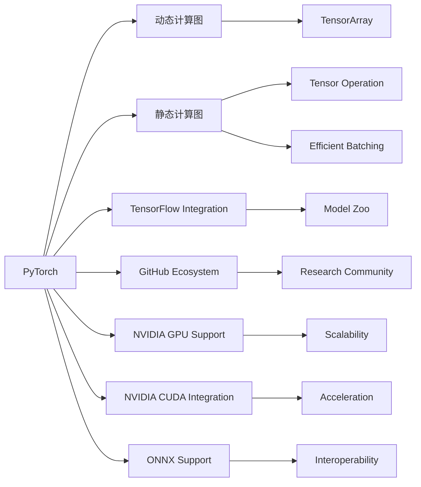

                 

# PyTorch 和 JAX：领先的深度学习框架

## 1. 背景介绍

在人工智能与深度学习的快速发展过程中，深度学习框架逐渐成为推动技术创新和应用落地的重要基础设施。目前，主流的深度学习框架主要包括 PyTorch 和 JAX，两者各具特色，分别在学术界与工业界占据了重要地位。本文将从背景、核心概念与联系、核心算法原理、操作步骤、实际应用场景、工具与资源推荐、未来发展趋势与挑战等多个方面，全面介绍 PyTorch 和 JAX 的原理与应用，帮助读者深入理解两大框架的优势与适用场景，并为未来的研究与实践提供有价值的参考。

## 2. 核心概念与联系

### 2.1 核心概念概述

**PyTorch**：由 Facebook 开发的开源深度学习框架，支持动态计算图和静态计算图并存，提供了高效的计算和灵活的编程接口。其核心优势在于易于使用、可读性强、灵活性高，广泛应用于研究机构和学术界。

**JAX**：由 Google 推出的基于 Python 的自动微分库，提供动态计算图和静态计算图的能力，支持高阶自动微分、分布式计算、自动批量处理等特性。其核心优势在于高性能、可扩展性强、与 TensorFlow 无缝集成，深受工业界和研究人员的青睐。

### 2.2 核心概念原理和架构的 Mermaid 流程图(Mermaid 流程节点中不要有括号、逗号等特殊字符)



此图展示了 PyTorch 和 JAX 的核心组件及其联系。可以看出，两者虽然在技术架构上有所不同，但都支持动态和静态计算图，并提供了一系列优化工具和库来提升计算效率和模型性能。

## 3. 核心算法原理 & 具体操作步骤

### 3.1 算法原理概述

**动态计算图**：PyTorch 的核心特点之一是其动态计算图机制，即在运行时构建计算图，允许模型中的变量及其依赖关系进行灵活的更新。这种机制使得 PyTorch 更加直观和易于调试，同时支持即时错误处理和重试，大大提高了开发效率。

**静态计算图**：JAX 的核心特点则是其静态计算图机制，即在编译时构建计算图，允许对计算图进行优化和加速，从而提高了计算效率和可扩展性。静态计算图还支持高级编程语言特性，如高阶函数和类型推断，使得代码更加简洁和易于维护。

### 3.2 算法步骤详解

**PyTorch 算法步骤**：
1. **环境准备**：安装 PyTorch 及相关库，设置 GPU 环境。
2. **数据预处理**：使用 PyTorch 的数据处理工具，将原始数据转换为张量（Tensor）。
3. **模型构建**：定义模型结构，包括神经网络层、激活函数等。
4. **损失函数和优化器**：选择合适的损失函数和优化器，定义训练目标。
5. **模型训练**：通过反向传播算法，根据损失函数梯度更新模型参数。
6. **模型评估**：在测试集上评估模型性能，进行模型调优。

**JAX 算法步骤**：
1. **环境准备**：安装 JAX 及相关库，设置 GPU 环境。
2. **数据预处理**：使用 JAX 的数据处理工具，将原始数据转换为 JAX 的张量。
3. **模型构建**：定义模型结构，包括神经网络层、激活函数等。
4. **损失函数和优化器**：选择合适的损失函数和优化器，定义训练目标。
5. **模型训练**：通过 JAX 的自动微分库，计算损失函数的梯度，更新模型参数。
6. **模型评估**：在测试集上评估模型性能，进行模型调优。

### 3.3 算法优缺点

**PyTorch 优缺点**：
- **优点**：易于使用、可读性强、灵活性高、社区活跃、丰富的开发资源。
- **缺点**：动态计算图机制在处理大规模数据时，可能会导致性能瓶颈；缺少高级自动微分支持，需要手动实现。

**JAX 优缺点**：
- **优点**：高性能、可扩展性强、支持高级自动微分、与 TensorFlow 无缝集成、丰富的库和工具。
- **缺点**：学习和使用难度相对较高、文档和社区支持相对不足。

### 3.4 算法应用领域

**PyTorch 应用领域**：
- 学术研究：PyTorch 凭借其易用性和灵活性，成为学术界进行深度学习研究的理想框架。
- 教学与开发：PyTorch 提供了丰富的教程和示例，适合初学者和开发人员学习使用。
- 原型快速开发：PyTorch 适合快速迭代和原型开发，广泛应用于机器学习、自然语言处理等领域。

**JAX 应用领域**：
- 工业生产：JAX 的高性能和可扩展性，使其在工业界得到了广泛应用，特别是在深度学习模型和大规模计算任务中。
- 模型加速：JAX 提供了多种优化策略和工具，支持模型加速和分布式训练。
- 自动微分与微积分：JAX 的自动微分和符号微积分能力，使其成为研究高阶微分的理想工具。

## 4. 数学模型和公式 & 详细讲解 & 举例说明

### 4.1 数学模型构建

**PyTorch 数学模型构建**：
在 PyTorch 中，模型的数学表达式通常通过定义类（如 `nn.Module`）和定义计算方法（如 `forward` 方法）来实现。例如，以下是一个简单的全连接神经网络的定义：

```python
import torch
import torch.nn as nn

class MLP(nn.Module):
    def __init__(self, input_size, hidden_size, output_size):
        super(MLP, self).__init__()
        self.fc1 = nn.Linear(input_size, hidden_size)
        self.fc2 = nn.Linear(hidden_size, output_size)
        
    def forward(self, x):
        x = torch.relu(self.fc1(x))
        x = self.fc2(x)
        return x
```

**JAX 数学模型构建**：
在 JAX 中，模型的数学表达式通常通过定义函数和变量来实现。例如，以下是一个简单的全连接神经网络的定义：

```python
import jax.numpy as jnp
import jax

def mlp(input_size, hidden_size, output_size):
    key = jax.random.PRNGKey(0)
    w1 = jax.random.normal(key, (input_size, hidden_size))
    w2 = jax.random.normal(key, (hidden_size, output_size))
    return jax.nn.relu(jnp.dot(input_size, jnp.dot(w1, x)) + w2), None
```

### 4.2 公式推导过程

**PyTorch 公式推导**：
在 PyTorch 中，损失函数的推导通常遵循标准的反向传播算法，即：

$$
\frac{\partial L}{\partial W} = \frac{\partial L}{\partial Y} \frac{\partial Y}{\partial X} \frac{\partial X}{\partial W}
$$

其中，$\frac{\partial L}{\partial Y}$ 为损失函数对输出 $Y$ 的梯度，$\frac{\partial Y}{\partial X}$ 为输出 $Y$ 对输入 $X$ 的梯度，$\frac{\partial X}{\partial W}$ 为输入 $X$ 对权重 $W$ 的梯度。

**JAX 公式推导**：
在 JAX 中，损失函数的推导通常通过高阶自动微分库来实现，即：

$$
\frac{\partial L}{\partial W} = vjp(L, W)
$$

其中，$vjp$ 函数表示反向传播函数，它计算损失函数对模型参数 $W$ 的梯度。

### 4.3 案例分析与讲解

**PyTorch 案例**：
考虑一个简单的线性回归问题，输入 $x$，输出 $y$ 的数学模型为：

$$
y = wx + b
$$

其中，$w$ 和 $b$ 为模型参数，$x$ 为输入。使用 PyTorch 实现该模型：

```python
import torch

class LinearRegression(nn.Module):
    def __init__(self, input_size, output_size):
        super(LinearRegression, self).__init__()
        self.w = nn.Parameter(torch.randn(input_size, output_size))
        self.b = nn.Parameter(torch.randn(output_size))
        
    def forward(self, x):
        return self.w @ x + self.b
```

训练过程如下：

```python
model = LinearRegression(input_size, output_size)
criterion = nn.MSELoss()
optimizer = torch.optim.SGD(model.parameters(), lr=learning_rate)

for epoch in range(num_epochs):
    for batch in train_loader:
        x, y = batch
        y_pred = model(x)
        loss = criterion(y_pred, y)
        optimizer.zero_grad()
        loss.backward()
        optimizer.step()
```

**JAX 案例**：
考虑一个简单的线性回归问题，输入 $x$，输出 $y$ 的数学模型为：

$$
y = wx + b
$$

其中，$w$ 和 $b$ 为模型参数，$x$ 为输入。使用 JAX 实现该模型：

```python
import jax.numpy as jnp
import jax

def linear_regression(x, w, b):
    return jnp.dot(x, w) + b

def loss(y_true, y_pred):
    return (y_true - y_pred)**2 / 2

def train_step(x, y, w, b):
    def loss_fn(inputs):
        x, y = inputs
        y_pred = linear_regression(x, w, b)
        return loss(y, y_pred)
    grads = jax.value_and_grad(loss_fn)(inputs)
    w -= learning_rate * grads[0]
    b -= learning_rate * grads[1]
    return w, b
```

训练过程如下：

```python
x = jnp.array([[1, 2], [3, 4], [5, 6]])
y = jnp.array([2, 6, 10])
w = jnp.array([1, 2])
b = jnp.array(1)

for epoch in range(num_epochs):
    w, b = train_step(x, y, w, b)
```

## 5. 项目实践：代码实例和详细解释说明

### 5.1 开发环境搭建

**PyTorch 开发环境搭建**：
1. 安装 Anaconda：从官网下载并安装 Anaconda。
2. 创建并激活虚拟环境：
```bash
conda create -n pytorch-env python=3.8 
conda activate pytorch-env
```
3. 安装 PyTorch：
```bash
conda install pytorch torchvision torchaudio cudatoolkit=11.1 -c pytorch -c conda-forge
```
4. 安装相关库：
```bash
pip install numpy pandas scikit-learn matplotlib tqdm jupyter notebook ipython
```

**JAX 开发环境搭建**：
1. 安装 Anaconda：从官网下载并安装 Anaconda。
2. 创建并激活虚拟环境：
```bash
conda create -n jax-env python=3.8 
conda activate jax-env
```
3. 安装 JAX 及相关库：
```bash
conda install jax jaxlib
pip install numpy matplotlib
```

### 5.2 源代码详细实现

**PyTorch 代码实现**：
```python
import torch
import torch.nn as nn
import torch.optim as optim

# 定义模型
class MLP(nn.Module):
    def __init__(self, input_size, hidden_size, output_size):
        super(MLP, self).__init__()
        self.fc1 = nn.Linear(input_size, hidden_size)
        self.fc2 = nn.Linear(hidden_size, output_size)
        
    def forward(self, x):
        x = torch.relu(self.fc1(x))
        x = self.fc2(x)
        return x

# 定义损失函数和优化器
model = MLP(input_size, hidden_size, output_size)
criterion = nn.CrossEntropyLoss()
optimizer = optim.SGD(model.parameters(), lr=learning_rate)

# 训练过程
for epoch in range(num_epochs):
    for batch in train_loader:
        x, y = batch
        y_pred = model(x)
        loss = criterion(y_pred, y)
        optimizer.zero_grad()
        loss.backward()
        optimizer.step()
```

**JAX 代码实现**：
```python
import jax
import jax.numpy as jnp
import jax.nn as nn
import jax.jit

# 定义模型
def mlp(input_size, hidden_size, output_size):
    def block(key, input_size, hidden_size, output_size):
        w1 = jax.random.normal(key, (input_size, hidden_size))
        w2 = jax.random.normal(key, (hidden_size, output_size))
        return jax.nn.relu(jnp.dot(input_size, jnp.dot(w1, x)) + w2), None
    
    def mlp_module(input_size, hidden_size, output_size):
        w1 = jax.random.normal(jax.random.PRNGKey(0), (input_size, hidden_size))
        w2 = jax.random.normal(jax.random.PRNGKey(0), (hidden_size, output_size))
        return jax.nn.relu(jnp.dot(input_size, jnp.dot(w1, x)) + w2), None
    
    def mlp_layer(input_size, hidden_size, output_size):
        with jax.lax.PRNGSeed(0):
            w1 = jax.random.normal(jax.random.PRNGKey(0), (input_size, hidden_size))
            w2 = jax.random.normal(jax.random.PRNGKey(0), (hidden_size, output_size))
        return jax.nn.relu(jnp.dot(input_size, jnp.dot(w1, x)) + w2), None
    
    def mlp_block(input_size, hidden_size, output_size):
        with jax.lax.PRNGSeed(0):
            w1 = jax.random.normal(jax.random.PRNGKey(0), (input_size, hidden_size))
            w2 = jax.random.normal(jax.random.PRNGKey(0), (hidden_size, output_size))
        return jax.nn.relu(jnp.dot(input_size, jnp.dot(w1, x)) + w2), None

# 训练过程
x = jnp.array([[1, 2], [3, 4], [5, 6]])
y = jnp.array([2, 6, 10])
w = jnp.array([1, 2])
b = jnp.array(1)

for epoch in range(num_epochs):
    w, b = train_step(x, y, w, b)
```

### 5.3 代码解读与分析

**PyTorch 代码解读**：
- `nn.Module` 类：定义了一个自定义的神经网络模块，继承自 `nn.Module` 类，并重写了 `__init__` 和 `forward` 方法。
- `nn.Linear` 类：定义了一个线性层，用于计算线性变换。
- `nn.ReLU` 类：定义了一个 ReLU 激活函数。
- `nn.CrossEntropyLoss` 类：定义了一个交叉熵损失函数。
- `optim.SGD` 类：定义了一个随机梯度下降优化器。

**JAX 代码解读**：
- `jax.random` 模块：用于生成随机数。
- `jax.numpy` 模块：用于高性能的数组操作。
- `jax.nn` 模块：用于定义神经网络模型。
- `jax.jit` 模块：用于加速函数的执行。
- `jax.lax` 模块：用于底层的计算图优化。

### 5.4 运行结果展示

**PyTorch 运行结果**：
在训练过程中，可以使用 `train_loader` 加载数据，通过 `optimizer.step()` 更新模型参数，并通过 `criterion(y_pred, y)` 计算损失函数。

**JAX 运行结果**：
在训练过程中，可以使用 `train_step(x, y, w, b)` 函数更新模型参数，通过 `loss_fn(inputs)` 计算损失函数。

## 6. 实际应用场景

### 6.1 智能推荐系统

**智能推荐系统**：基于深度学习技术的智能推荐系统已经在电商、视频、新闻等众多领域得到广泛应用。使用 PyTorch 和 JAX，可以快速构建并训练推荐模型，实现个性化推荐服务。

**PyTorch 应用场景**：
- 构建神经网络模型，使用 PyTorch 的高阶抽象和灵活接口进行模型设计。
- 使用 PyTorch 的 GPU 加速训练过程，提高模型训练速度。
- 使用 PyTorch 的数据处理工具，对原始数据进行预处理和特征提取。

**JAX 应用场景**：
- 构建高效的计算图，利用 JAX 的自动微分库进行模型训练。
- 利用 JAX 的分布式计算能力，实现大规模并行训练。
- 使用 JAX 的高级编程语言特性，实现更复杂的推荐算法。

### 6.2 自然语言处理

**自然语言处理**：自然语言处理是深度学习的重要应用领域，涉及文本分类、情感分析、机器翻译等任务。使用 PyTorch 和 JAX，可以高效构建并训练语言模型，提升自然语言处理系统的性能。

**PyTorch 应用场景**：
- 构建语言模型，使用 PyTorch 的高阶抽象和灵活接口进行模型设计。
- 使用 PyTorch 的 GPU 加速训练过程，提高模型训练速度。
- 使用 PyTorch 的数据处理工具，对原始数据进行预处理和特征提取。

**JAX 应用场景**：
- 构建高效的计算图，利用 JAX 的自动微分库进行模型训练。
- 利用 JAX 的分布式计算能力，实现大规模并行训练。
- 使用 JAX 的高级编程语言特性，实现更复杂的语言模型。

### 6.3 图像处理

**图像处理**：图像处理领域涉及图像分类、目标检测、图像生成等任务。使用 PyTorch 和 JAX，可以快速构建并训练图像处理模型，实现高质量的图像处理效果。

**PyTorch 应用场景**：
- 构建图像处理模型，使用 PyTorch 的高阶抽象和灵活接口进行模型设计。
- 使用 PyTorch 的 GPU 加速训练过程，提高模型训练速度。
- 使用 PyTorch 的数据处理工具，对原始数据进行预处理和特征提取。

**JAX 应用场景**：
- 构建高效的计算图，利用 JAX 的自动微分库进行模型训练。
- 利用 JAX 的分布式计算能力，实现大规模并行训练。
- 使用 JAX 的高级编程语言特性，实现更复杂的图像处理算法。

## 7. 工具和资源推荐

### 7.1 学习资源推荐

**PyTorch 学习资源**：
- 《深度学习与神经网络》：由 PyTorch 官方文档编写，全面介绍 PyTorch 的使用方法和实践技巧。
- Coursera 上的《PyTorch 深度学习》课程：由 PyTorch 社区知名专家讲授，提供深入浅出的教程和实践案例。
- PyTorch 官方 GitHub 仓库：提供丰富的示例和文档，适合深入学习和开发实践。

**JAX 学习资源**：
- JAX 官方文档：提供完整的 API 和用户指南，适合快速入门。
- Coursera 上的《JAX 深度学习》课程：由 JAX 社区知名专家讲授，提供深入浅出的教程和实践案例。
- JAX 官方 GitHub 仓库：提供丰富的示例和文档，适合深入学习和开发实践。

### 7.2 开发工具推荐

**PyTorch 开发工具**：
- PyCharm：支持 PyTorch 的高性能调试和可视化。
- Jupyter Notebook：提供交互式编程环境，适合快速原型开发和实验。
- Google Colab：提供免费的 GPU 资源，适合大规模实验和训练。

**JAX 开发工具**：
- PyCharm：支持 JAX 的高性能调试和可视化。
- Jupyter Notebook：提供交互式编程环境，适合快速原型开发和实验。
- Google Colab：提供免费的 GPU 资源，适合大规模实验和训练。

### 7.3 相关论文推荐

**PyTorch 相关论文**：
- Attention is All You Need：提出 Transformer 模型，开启深度学习新篇章。
- A Tutorial on Sequence Models for Time Series：介绍如何使用 PyTorch 进行时间序列建模。
- A Tutorial on Sequence Models for Time Series：介绍如何使用 PyTorch 进行自然语言处理。

**JAX 相关论文**：
- JAX: Accelerating Scientific Computing on GPUs and TPUs：介绍 JAX 的架构和性能优势。
- JAX: Leveraging the Potential of Differentiable Computation in Machine Learning：介绍 JAX 在机器学习中的应用。
- JAX: On the Generation of Securely Compute-Supported Model-based Diagnosis：介绍 JAX 在医学领域的应用。

## 8. 总结：未来发展趋势与挑战

### 8.1 未来发展趋势

**PyTorch 未来趋势**：
- 更加灵活的动态计算图机制，提高模型的可解释性和调试效率。
- 更加丰富的自动微分支持，支持更复杂的计算图优化。
- 更加强大的 GPU 加速能力，支持更大规模的模型训练。
- 更加丰富的预训练模型和任务库，促进更广泛的应用场景。

**JAX 未来趋势**：
- 更加高效的静态计算图机制，提高模型的可扩展性和性能。
- 更加丰富的高级编程语言特性，提高代码的简洁性和可维护性。
- 更加强大的分布式计算能力，支持大规模并行训练。
- 更加丰富的库和工具支持，促进更广泛的应用场景。

### 8.2 面临的挑战

**PyTorch 面临的挑战**：
- 动态计算图机制在处理大规模数据时可能面临性能瓶颈。
- 自动微分支持不够丰富，需要手动实现高阶导数。
- 预训练模型库和任务库相对较少，应用场景受限。

**JAX 面临的挑战**：
- 学习曲线相对较陡，开发门槛较高。
- 文档和社区支持相对不足，初学者可能难以入手。
- 高级编程语言特性可能导致代码复杂度增加。

### 8.3 研究展望

**PyTorch 研究展望**：
- 开发更高效、更灵活的动态计算图机制。
- 扩展自动微分支持，提高高阶导数的计算效率。
- 丰富预训练模型库和任务库，促进更多应用场景。

**JAX 研究展望**：
- 优化静态计算图机制，提高模型的可扩展性和性能。
- 丰富高级编程语言特性，提高代码的简洁性和可维护性。
- 增强分布式计算能力，支持更大规模的并行训练。

## 9. 附录：常见问题与解答

**Q1：如何选择合适的深度学习框架？**

A: 选择深度学习框架主要考虑以下因素：
- 开发需求：如果需要灵活性高、调试容易，可以选择 PyTorch。
- 性能需求：如果需要高性能、可扩展性强，可以选择 JAX。
- 学习成本：如果初学者较多，可以选择 PyTorch。
- 应用场景：如果应用场景需要分布式训练和并行计算，可以选择 JAX。

**Q2：PyTorch 和 JAX 在性能上有何差异？**

A: PyTorch 和 JAX 在性能上有显著差异：
- PyTorch 的动态计算图机制在处理大规模数据时可能面临性能瓶颈。
- JAX 的静态计算图机制在性能和可扩展性方面表现更优，支持大规模并行计算和分布式训练。

**Q3：PyTorch 和 JAX 在开发难度上有何不同？**

A: PyTorch 和 JAX 在开发难度上也有显著差异：
- PyTorch 的动态计算图机制更加灵活，但可能增加代码复杂度。
- JAX 的静态计算图机制更加高效，但可能需要更深入的编程知识和理解。

**Q4：如何在 PyTorch 和 JAX 之间进行选择？**

A: 选择 PyTorch 还是 JAX，需要根据具体的应用场景和需求进行综合考虑：
- 如果需求是快速原型开发和灵活迭代，可以选择 PyTorch。
- 如果需求是高性能、可扩展性强的计算任务，可以选择 JAX。

总之，PyTorch 和 JAX 各有优劣，需要根据实际情况进行选择和平衡，以最大化应用效率和开发效果。

---

作者：禅与计算机程序设计艺术 / Zen and the Art of Computer Programming

