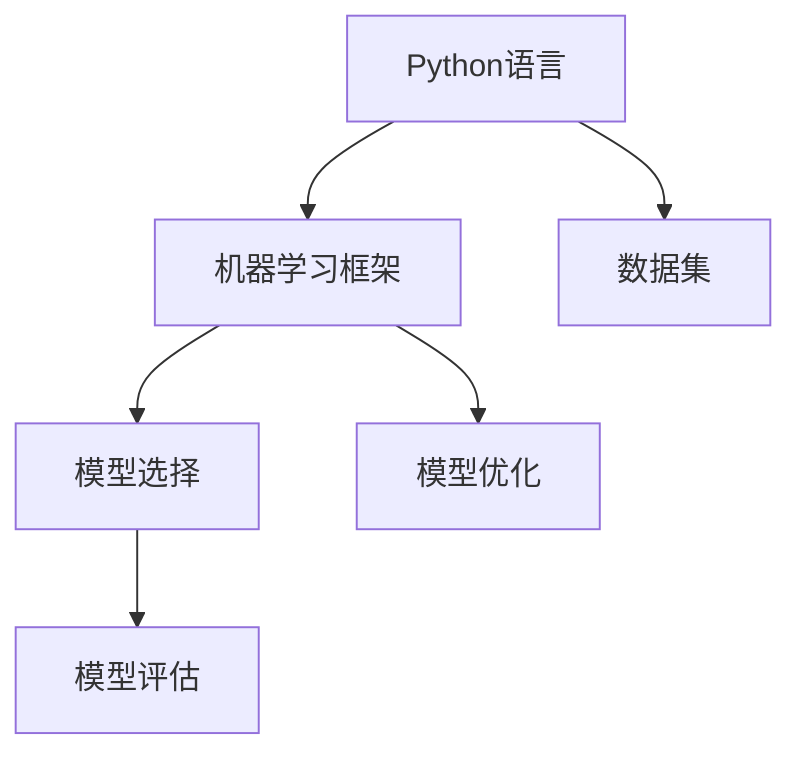

                 

# Python机器学习实战：从零开始构建机器学习环境

## 1. 背景介绍

### 1.1 问题由来
随着人工智能技术的飞速发展，机器学习在各个行业中的应用越来越广泛，从推荐系统、语音识别、图像识别，到医疗诊断、金融风控、无人驾驶等。但机器学习的门槛并不低，它涉及概率论、统计学、线性代数、微积分、计算机编程等诸多知识。对于初学者来说，从入门到精通无疑是一个巨大的挑战。

因此，本文将从零开始，详细介绍如何构建机器学习环境，并以此为依托，开展一系列实战项目。通过系统地学习机器学习基础理论与实践操作，读者将逐步掌握构建、训练和评估机器学习模型的全流程，并在实战中提升对机器学习算法与工具的运用能力。

### 1.2 问题核心关键点
构建机器学习环境的核心关键点在于选择合适的开发框架、理解关键算法原理、积累实战项目经验。本文将围绕这三个方面展开详细介绍，并给出相应的操作代码与实践案例，帮助读者切实掌握构建机器学习环境的能力。

## 2. 核心概念与联系

### 2.1 核心概念概述

为了更好地理解构建机器学习环境的具体步骤和流程，本节将介绍几个密切相关的核心概念：

- **Python语言**：Python语言因其简单易学、库丰富、支持科学计算等优点，成为了数据科学和机器学习领域的主流编程语言。
- **机器学习框架**：如Scikit-Learn、TensorFlow、PyTorch等，是开发者用来构建、训练和评估机器学习模型的重要工具。
- **数据集**：包括训练集、验证集和测试集，是模型学习与评估的基础。
- **模型选择与优化**：包括选择适当的模型结构、优化算法、超参数调优等，是构建高性能机器学习模型的关键。
- **模型评估**：通过性能指标如准确率、召回率、F1值、AUC等，评估模型在实际应用中的表现。

这些核心概念之间的逻辑关系可以通过以下Mermaid流程图来展示：



这个流程图展示了一些关键概念之间的关系：

1. Python语言为机器学习提供了编程平台。
2. 机器学习框架用于构建、训练和评估机器学习模型。
3. 数据集是训练模型的输入。
4. 模型选择和优化决定了模型的性能。
5. 模型评估是模型质量评估的依据。

## 3. 核心算法原理 & 具体操作步骤
### 3.1 算法原理概述

构建机器学习环境的核心在于选择合适的Python机器学习框架，并利用这些框架实现模型的构建、训练和评估。这通常包括选择合适的算法、设置合适的参数、进行交叉验证等步骤。

### 3.2 算法步骤详解

**Step 1: 准备数据集**
- 收集和处理训练、验证和测试数据集，包括数据清洗、特征提取、标准化等预处理工作。
- 使用机器学习框架内置的数据集处理工具，如Scikit-Learn的`train_test_split`。

**Step 2: 选择合适的机器学习框架**
- 根据具体任务选择合适的框架。如线性回归、分类、聚类等任务，可使用Scikit-Learn；深度学习任务，可使用TensorFlow或PyTorch。
- 安装相应的机器学习库。

**Step 3: 定义模型结构**
- 选择合适的模型结构。如线性回归、决策树、支持向量机、神经网络等。
- 设置模型的超参数。如学习率、正则化系数、批次大小等。

**Step 4: 训练模型**
- 使用训练集对模型进行训练。如TensorFlow的`tf.estimator.Estimator`、PyTorch的`torch.nn.Module`等。
- 使用交叉验证等技术对模型进行验证，调整超参数。

**Step 5: 模型评估**
- 使用测试集对模型进行评估。计算模型的精度、召回率、F1值、AUC等指标。
- 根据评估结果优化模型结构与超参数。

### 3.3 算法优缺点

使用机器学习框架构建机器学习模型的优点在于：

- 代码简洁高效，降低了开发门槛。
- 提供了丰富的算法库和工具，便于快速实现各种模型。
- 模型训练过程自动化，减少了手工调参的工作量。

然而，这些框架也有一些缺点：

- 框架本身的学习曲线较陡峭，需要一定的时间与精力来熟悉。
- 不同框架之间的差异较大，转换成本较高。
- 部分框架的性能与功能可能不如手写代码，对于复杂任务需要额外的优化。

### 3.4 算法应用领域

基于机器学习框架构建的模型，已经广泛应用于金融、医疗、教育、电商等多个领域。以下是几个典型的应用场景：

- **金融风控**：利用机器学习模型预测客户信用风险，优化风险管理。
- **医疗诊断**：通过深度学习模型进行疾病诊断，提升医疗水平。
- **智能推荐**：使用机器学习模型进行个性化推荐，提升用户体验。
- **自然语言处理**：通过语言模型进行文本分类、情感分析、机器翻译等。
- **图像识别**：使用卷积神经网络(CNN)进行图像识别、图像分类等任务。

## 4. 数学模型和公式 & 详细讲解 & 举例说明

### 4.1 数学模型构建

在本节中，我们将通过一个简单的线性回归问题，来介绍如何使用Python的机器学习框架Scikit-Learn构建和训练模型。

首先，我们需要导入必要的库：

```python
import numpy as np
from sklearn.linear_model import LinearRegression
from sklearn.model_selection import train_test_split
from sklearn.metrics import mean_squared_error, r2_score
```

接着，我们定义一个简单的线性回归问题，生成一些数据：

```python
# 生成数据
X = np.linspace(0, 10, 100)[:, np.newaxis]
y = 2 * X + np.random.randn(*X.shape) * 0.5 + 1
```

然后，我们将数据集划分为训练集和测试集：

```python
X_train, X_test, y_train, y_test = train_test_split(X, y, test_size=0.2, random_state=0)
```

接下来，我们实例化一个线性回归模型，并拟合训练数据：

```python
# 实例化模型
model = LinearRegression()

# 拟合训练数据
model.fit(X_train, y_train)
```

最后，我们使用测试集对模型进行评估：

```python
# 预测测试集
y_pred = model.predict(X_test)

# 计算评估指标
mse = mean_squared_error(y_test, y_pred)
r2 = r2_score(y_test, y_pred)

print(f"MSE: {mse}, R2: {r2}")
```

### 4.2 公式推导过程

在线性回归问题中，我们使用以下公式表示数据与模型之间的关系：

$$
y = \theta_0 + \theta_1x_1 + \theta_2x_2 + \cdots + \theta_nx_n
$$

其中，$y$ 是目标变量，$x_1, x_2, \cdots, x_n$ 是输入变量，$\theta_0, \theta_1, \theta_2, \cdots, \theta_n$ 是模型的参数。

在线性回归模型中，我们的目标是找到一组最优的参数 $\theta$，使得模型能够最小化预测误差。具体地，我们使用以下损失函数：

$$
L(\theta) = \frac{1}{2N}\sum_{i=1}^N (y_i - \theta_0 - \theta_1x_{1i} - \theta_2x_{2i} - \cdots - \theta_nx_{ni})^2
$$

其中，$N$ 是样本数量，$y_i$ 是第 $i$ 个样本的目标值，$x_{1i}, x_{2i}, \cdots, x_{ni}$ 是第 $i$ 个样本的输入值。

我们的目标是最小化损失函数 $L(\theta)$，可以通过求解梯度下降等优化算法来实现。

### 4.3 案例分析与讲解

在本节中，我们将通过一个实际的机器学习项目，来详细介绍如何构建和训练机器学习模型。

项目：房价预测

首先，我们导入必要的库：

```python
import pandas as pd
from sklearn.model_selection import train_test_split
from sklearn.linear_model import LinearRegression
from sklearn.metrics import mean_squared_error, r2_score
```

然后，我们加载数据集：

```python
# 加载数据
df = pd.read_csv('housing.csv')

# 数据预处理
df = df.drop(['MEDV'], axis=1)  # 删除目标变量
X = df.drop(['LSTAT'], axis=1)  # 删除不需要的特征
y = df['LSTAT']  # 目标变量
```

接着，我们将数据集划分为训练集和测试集：

```python
X_train, X_test, y_train, y_test = train_test_split(X, y, test_size=0.2, random_state=0)
```

然后，我们实例化一个线性回归模型，并拟合训练数据：

```python
model = LinearRegression()
model.fit(X_train, y_train)
```

最后，我们使用测试集对模型进行评估：

```python
y_pred = model.predict(X_test)
mse = mean_squared_error(y_test, y_pred)
r2 = r2_score(y_test, y_pred)

print(f"MSE: {mse}, R2: {r2}")
```

## 5. 项目实践：代码实例和详细解释说明

### 5.1 开发环境搭建

在开始项目实践之前，我们需要搭建好Python开发环境。以下是详细的步骤：

1. **安装Python**：
   - 访问[Python官网](https://www.python.org/)，下载安装包并按照指示安装。
   - 确保安装最新版本。

2. **安装虚拟环境**：
   - 打开命令行，输入 `python -m venv env`，在当前目录创建一个虚拟环境。
   - 激活虚拟环境：在Windows下，输入 `env\Scripts\activate`；在Linux/Unix下，输入 `source env/bin/activate`。

3. **安装必要库**：
   - 使用 `pip` 安装Python机器学习库，如Scikit-Learn、TensorFlow、PyTorch等。

4. **配置IDE**：
   - 安装Python IDE，如Jupyter Notebook、PyCharm、Visual Studio Code等。
   - 将虚拟环境与IDE进行配置，以便IDE能够正确识别虚拟环境中的库。

### 5.2 源代码详细实现

在本节中，我们将以房价预测项目为例，详细介绍如何使用Scikit-Learn构建和训练线性回归模型。

首先，我们导入必要的库：

```python
import numpy as np
import pandas as pd
from sklearn.model_selection import train_test_split
from sklearn.linear_model import LinearRegression
from sklearn.metrics import mean_squared_error, r2_score
```

然后，我们加载数据集：

```python
# 加载数据
df = pd.read_csv('housing.csv')

# 数据预处理
df = df.drop(['MEDV'], axis=1)  # 删除目标变量
X = df.drop(['LSTAT'], axis=1)  # 删除不需要的特征
y = df['LSTAT']  # 目标变量
```

接着，我们将数据集划分为训练集和测试集：

```python
X_train, X_test, y_train, y_test = train_test_split(X, y, test_size=0.2, random_state=0)
```

然后，我们实例化一个线性回归模型，并拟合训练数据：

```python
model = LinearRegression()
model.fit(X_train, y_train)
```

最后，我们使用测试集对模型进行评估：

```python
y_pred = model.predict(X_test)
mse = mean_squared_error(y_test, y_pred)
r2 = r2_score(y_test, y_pred)

print(f"MSE: {mse}, R2: {r2}")
```

### 5.3 代码解读与分析

在本节中，我们将对上述代码进行详细解读和分析。

**数据预处理**：

在房价预测项目中，我们首先对数据进行了预处理。具体来说，我们删除了目标变量 `MEDV`，因为它是我们想要预测的房价，不需要作为模型的输入。同时，我们删除了特征 `LSTAT`，因为它与房价的预测值关系不大。

**模型实例化**：

我们使用 `LinearRegression` 类实例化了一个线性回归模型。这个类提供了拟合数据和预测数据的功能。

**模型拟合**：

我们使用 `fit` 方法对模型进行了拟合。在拟合过程中，我们传入了训练数据 `X_train` 和对应的目标变量 `y_train`。

**模型评估**：

我们使用 `predict` 方法对测试集进行了预测。然后，我们使用 `mean_squared_error` 和 `r2_score` 方法计算了模型的预测误差和拟合优度。

## 6. 实际应用场景

### 6.1 金融风控

金融风控是机器学习在金融领域的一个典型应用。通过构建机器学习模型，金融机构可以预测客户的信用风险，优化风险管理策略。具体来说，可以使用逻辑回归、支持向量机等算法对客户的信用评分、历史交易数据等进行建模，预测客户是否会违约。

### 6.2 医疗诊断

在医疗领域，机器学习模型可以帮助医生进行疾病诊断，提升医疗水平。例如，可以使用卷积神经网络(CNN)对医学影像进行分类，识别出肿瘤等病变；或者使用决策树、支持向量机等算法对患者的症状、病历进行建模，预测疾病的风险。

### 6.3 智能推荐

智能推荐是机器学习在电商、媒体等领域的典型应用。通过构建推荐模型，推荐系统可以根据用户的兴趣和行为数据，推荐相关的商品、文章、视频等。具体来说，可以使用协同过滤、矩阵分解等算法对用户和物品进行建模，预测用户对物品的评分和兴趣。

### 6.4 自然语言处理

自然语言处理是机器学习在NLP领域的典型应用。通过构建语言模型，NLP系统可以实现文本分类、情感分析、机器翻译等任务。具体来说，可以使用循环神经网络(RNN)、卷积神经网络(CNN)等算法对文本进行建模，预测文本的类别、情感倾向等。

## 7. 工具和资源推荐

### 7.1 学习资源推荐

为了帮助读者系统掌握Python机器学习，这里推荐一些优质的学习资源：

1. 《Python机器学习实战》系列书籍：由机器学习专家撰写，详细介绍Python机器学习的基础理论和实践操作。

2. 《深度学习》课程：斯坦福大学开设的深度学习课程，涵盖深度学习的基本概念和前沿算法。

3. Kaggle平台：数据科学竞赛平台，提供大量的机器学习竞赛和公开数据集，适合实战练习。

4. Coursera平台：提供众多数据科学和机器学习课程，由世界顶尖大学和专家主讲。

5. Scikit-Learn官方文档：提供完整的Scikit-Learn库文档和样例代码，适合入门学习。

通过对这些资源的学习，相信读者可以系统地掌握Python机器学习的基本理论和实践操作。

### 7.2 开发工具推荐

以下是一些常用的Python机器学习开发工具：

1. Jupyter Notebook：Python的交互式开发环境，适合做数据探索和模型实验。

2. PyCharm：功能强大的Python IDE，支持数据可视化、调试等。

3. Visual Studio Code：轻量级代码编辑器，支持Python开发。

4. Google Colab：免费的在线Jupyter Notebook环境，适合快速做实验和共享笔记。

5. Anaconda：Python的科学计算环境，支持虚拟环境、包管理等。

合理利用这些工具，可以显著提升Python机器学习的开发效率，加快创新迭代的步伐。

### 7.3 相关论文推荐

以下是一些经典的Python机器学习论文，推荐阅读：

1. 《An Introduction to Statistical Learning》：机器学习领域的经典教材，涵盖统计学和机器学习的基础理论和算法。

2. 《Deep Learning》：深度学习领域的经典教材，涵盖深度学习的基本概念和前沿算法。

3. 《Python Data Science Handbook》：Python数据科学的入门指南，涵盖数据处理、可视化、机器学习等内容。

4. 《Pattern Recognition and Machine Learning》：机器学习领域的经典教材，涵盖模式识别和机器学习的基础理论和算法。

5. 《Hands-On Machine Learning with Scikit-Learn, Keras, and TensorFlow》：Python机器学习的实践指南，涵盖Scikit-Learn、Keras和TensorFlow等库的使用方法。

这些论文代表了大数据、机器学习、深度学习等领域的最新进展，有助于读者了解前沿理论和技术。

## 8. 总结：未来发展趋势与挑战

### 8.1 研究成果总结

本文系统介绍了Python机器学习的基础理论和实践操作，通过实际项目的详细代码实例，帮助读者掌握构建、训练和评估机器学习模型的全流程。通过实战项目，读者将逐步掌握Python机器学习的基础算法、模型选择与优化、模型评估等关键技能，并积累丰富的项目经验。

### 8.2 未来发展趋势

展望未来，Python机器学习将在以下几个方向进一步发展：

1. **自动化机器学习**：机器学习自动化是未来的发展趋势，包括自动化模型选择、超参数调优、数据预处理等，将极大降低数据科学家的工作量。

2. **模型可解释性**：随着模型复杂度的提高，模型的可解释性变得越来越重要。未来的研究将更加注重模型的透明性和可理解性，以便更好地应用到实际场景中。

3. **模型集成**：模型集成是提升机器学习效果的重要手段。未来的研究将更加注重多模型融合、混合模型等方法，以获得更优的性能。

4. **深度学习与强化学习**：深度学习、强化学习等前沿技术将继续拓展机器学习的边界，应用于更多复杂问题，如自动驾驶、机器人控制等。

5. **边缘计算与云计算**：边缘计算和云计算将继续推动机器学习应用的普及和深化，带来更高的计算效率和更低的成本。

### 8.3 面临的挑战

尽管Python机器学习已经取得了巨大的进展，但在未来的发展中，仍面临着诸多挑战：

1. **数据隐私与安全**：在机器学习模型训练和应用过程中，如何保护数据隐私和安全是一个重要的挑战。未来的研究需要进一步加强数据加密和匿名化技术。

2. **模型泛化性**：当前的机器学习模型往往依赖于大量标注数据，难以泛化到新场景和新任务。未来的研究需要探索无监督学习、半监督学习等方法，以提升模型的泛化能力。

3. **模型鲁棒性**：机器学习模型在面对对抗样本和噪声数据时，往往表现出脆弱性。未来的研究需要加强模型的鲁棒性，提高模型的鲁棒性。

4. **计算资源限制**：超大规模机器学习模型的训练和推理需要大量的计算资源。未来的研究需要探索高效计算方法，如模型压缩、量化加速等。

### 8.4 研究展望

面向未来，Python机器学习的研究方向将更加多样化和前沿化。以下是几个可能的研究方向：

1. **模型压缩与加速**：通过模型压缩、量化加速等技术，实现更高性能、更高效能的机器学习模型。

2. **多模态学习**：将文本、图像、语音等多模态数据融合，提升机器学习的理解和建模能力。

3. **因果推断与可解释性**：通过引入因果推断方法和可解释性技术，增强机器学习模型的透明性和可理解性。

4. **对抗性与鲁棒性**：探索对抗样本生成与防御方法，提升机器学习模型的鲁棒性和安全性。

5. **混合模型与模型融合**：通过混合模型与模型融合方法，提升机器学习模型的性能和稳定性。

## 9. 附录：常见问题与解答

**Q1：如何选择合适的机器学习框架？**

A: 选择合适的机器学习框架需要考虑以下几个因素：

- **任务类型**：不同的任务可能需要不同的框架。例如，线性回归和分类任务可以使用Scikit-Learn；深度学习任务可以使用TensorFlow或PyTorch。
- **数据规模**：如果数据规模较大，可以使用分布式训练的框架，如Dask。
- **开发效率**：开发效率是一个重要的考虑因素。Python库通常提供较高的开发效率，但可能不如C++等语言高效。

**Q2：机器学习模型如何进行超参数调优？**

A: 超参数调优是机器学习模型训练的重要环节，以下是一些常用的方法：

- **网格搜索**：通过设置超参数的范围，生成所有可能的超参数组合，然后选择最优的组合。
- **随机搜索**：从超参数空间中随机抽取一组超参数，然后根据性能评估结果不断优化超参数。
- **贝叶斯优化**：使用贝叶斯方法对超参数空间进行优化，可以快速找到最优超参数组合。

**Q3：机器学习模型如何进行特征选择？**

A: 特征选择是机器学习模型的关键环节，以下是一些常用的方法：

- **方差选择法**：删除方差较小的特征，保留对目标变量有贡献的特征。
- **相关系数法**：计算特征与目标变量之间的相关性，删除相关性较低的特征。
- **L1正则化**：通过L1正则化方法，对特征进行筛选和降维。

**Q4：机器学习模型如何进行模型评估？**

A: 模型评估是机器学习模型的重要环节，以下是一些常用的方法：

- **准确率**：分类任务中最常用的评估指标。
- **召回率**：分类任务中的另一个重要指标，用于衡量模型的召回能力。
- **F1值**：准确率和召回率的调和平均数，用于综合评估模型性能。
- **AUC**：用于评估分类模型的性能，特别适用于样本不平衡的情况。

**Q5：机器学习模型如何进行模型调优？**

A: 模型调优是机器学习模型的关键环节，以下是一些常用的方法：

- **数据增强**：通过对训练数据进行扩充，提升模型的泛化能力。
- **正则化**：通过L2正则、Dropout等方法，避免过拟合。
- **集成学习**：通过集成多个模型，提升模型的性能和稳定性。

通过以上学习资源、开发工具和研究方向，相信读者可以全面掌握Python机器学习的核心知识和技能，并应用于实际项目中。相信在未来的学习和工作中，Python机器学习将继续发挥其巨大的价值，为人工智能技术的进一步发展提供坚实的技术基础。

---

作者：禅与计算机程序设计艺术 / Zen and the Art of Computer Programming

