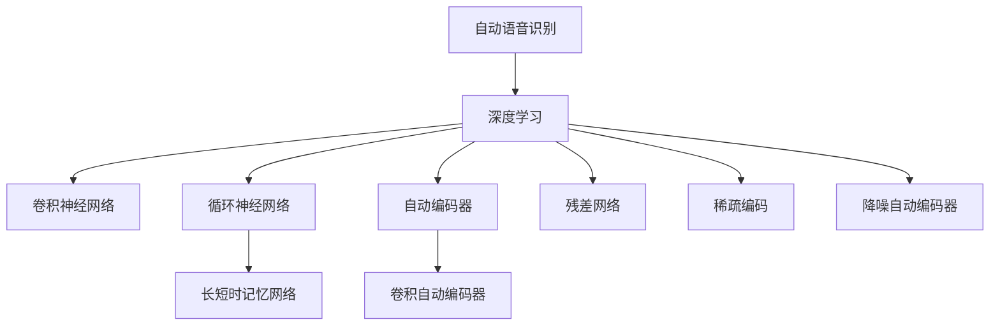

                 

# Python机器学习实战：深度学习在语音识别中的应用

> 关键词：深度学习，语音识别，卷积神经网络(CNN)，循环神经网络(RNN)，长短时记忆网络(LSTM)，自动编码器，卷积自动编码器，残差网络，稀疏编码，降噪自动编码器，神经网络结构，损失函数，训练算法，模型评估，案例分析

## 1. 背景介绍

语音识别作为人工智能的重要应用领域之一，近年来在技术上取得了显著进展，在智能家居、语音助手、语音翻译等多个场景中得到了广泛应用。深度学习技术以其强大的建模能力，为语音识别提供了新的突破，在多个NLP任务中，包括自动语音识别(ASR)、说话人识别(SpK)、语音情感分析等，均取得了卓越的表现。

然而，深度学习在语音识别中的应用不仅限于传统的前端信号处理和特征提取，更多的是依赖于对大量标注数据的学习和建模。本文将详细介绍基于深度学习的语音识别技术，包括基本原理、常用模型和实现步骤，并通过Python代码实例演示语音识别模型的构建和训练过程。

## 2. 核心概念与联系

### 2.1 核心概念概述

为更好地理解基于深度学习的语音识别技术，本节将介绍几个密切相关的核心概念：

- 自动语音识别（Automatic Speech Recognition, ASR）：指将音频信号转换成文本序列的过程，是语音识别的核心任务。
- 深度学习（Deep Learning）：通过构建多层次的非线性神经网络，能够学习到更加复杂的特征表示，提升模型的建模能力。
- 卷积神经网络（Convolutional Neural Network, CNN）：一类主要应用于图像处理的神经网络，但也可用于语音信号的特征提取。
- 循环神经网络（Recurrent Neural Network, RNN）：通过引入循环结构，能够处理序列数据，适用于语音时间序列的建模。
- 长短时记忆网络（Long Short-Term Memory, LSTM）：一种特殊的RNN，能够处理长时程信息，避免了梯度消失和梯度爆炸问题。
- 自动编码器（Autoencoder, AE）：一种无监督学习的神经网络，能够学习数据的低维表示，适用于特征提取和降噪处理。
- 卷积自动编码器（Convolutional Autoencoder, CAE）：结合CNN和AE的优点，用于图像和语音信号的特征提取。
- 残差网络（Residual Network, ResNet）：通过残差连接技术，解决了深层神经网络训练过程中的梯度消失问题。
- 稀疏编码（Sparse Coding）：一种基于字典学习的编码方法，能够提取语音信号的低维表示。
- 降噪自动编码器（Denoising Autoencoder, DAE）：通过增加噪声输入，能够增强模型对噪声的鲁棒性。

这些核心概念之间的逻辑关系可以通过以下Mermaid流程图来展示：



这个流程图展示了大语言模型的核心概念及其之间的关系：

1. 自动语音识别通过深度学习技术进行建模，可以采用多种神经网络结构。
2. 卷积神经网络在图像处理中表现优秀，可以用于语音信号的特征提取。
3. 循环神经网络通过引入循环结构，能够处理时间序列数据，适用于语音信号的建模。
4. 长短时记忆网络是一种特殊的循环神经网络，能够处理长时程信息。
5. 自动编码器是一种无监督学习技术，适用于特征提取和降噪处理。
6. 卷积自动编码器结合CNN和AE的优点，用于图像和语音信号的特征提取。
7. 残差网络通过残差连接技术，解决了深层神经网络训练过程中的梯度消失问题。
8. 稀疏编码是一种基于字典学习的编码方法，能够提取语音信号的低维表示。
9. 降噪自动编码器通过增加噪声输入，增强模型对噪声的鲁棒性。

## 3. 核心算法原理 & 具体操作步骤

### 3.1 算法原理概述

基于深度学习的语音识别模型通常采用RNN或LSTM等序列建模技术，并结合卷积层和全连接层等网络结构，以提高模型的建模能力。语音识别模型的训练通常包括特征提取、模型构建、训练和评估等多个步骤。

1. **特征提取**：从音频信号中提取可用于模型训练的特征，常用的特征包括MFCC、倒谱、梅尔频谱等。
2. **模型构建**：选择合适的深度神经网络结构，如CNN、RNN、LSTM等，构建语音识别模型。
3. **模型训练**：通过标注数据对模型进行训练，优化模型参数，使其能够准确地将音频信号转换成文本序列。
4. **模型评估**：在测试集上评估模型性能，常用指标包括字错误率(WER)、词错误率(WER)、句子错误率(WER)等。

### 3.2 算法步骤详解

基于深度学习的语音识别模型的训练流程包括以下几个关键步骤：

**Step 1: 数据准备**

1. **数据收集**：收集大量带有文本转写标注的音频数据，包括不同口音、环境噪声等情况。
2. **数据预处理**：对音频信号进行去噪、预加重、分帧等处理，以提取有用的特征。
3. **特征提取**：采用MFCC、倒谱等特征提取技术，将音频信号转换为可用于模型训练的特征序列。

**Step 2: 模型构建**

1. **选择模型结构**：根据任务需求选择合适的深度神经网络结构，如CNN、RNN、LSTM等。
2. **网络参数设置**：设置网络层数、每层的神经元数量、激活函数等参数。
3. **网络构建**：使用深度学习框架如TensorFlow、PyTorch等构建深度神经网络模型。

**Step 3: 模型训练**

1. **设置训练参数**：包括学习率、批量大小、迭代轮数等。
2. **优化算法选择**：选择合适的优化算法，如SGD、Adam等。
3. **模型训练**：使用标注数据对模型进行训练，不断更新模型参数，直至收敛。

**Step 4: 模型评估**

1. **评估指标选择**：根据任务需求选择合适的评估指标，如WER、WER、WER等。
2. **测试集测试**：在测试集上对模型进行测试，计算评估指标。
3. **模型优化**：根据评估结果对模型进行优化，如调整网络结构、调整训练参数等。

### 3.3 算法优缺点

基于深度学习的语音识别模型具有以下优点：
1. 精度高：深度神经网络能够学习到丰富的特征表示，提高模型的建模能力。
2. 鲁棒性强：深度神经网络对不同口音、环境噪声等情况具有较强的适应能力。
3. 可扩展性强：深度神经网络可以通过增加网络层数、神经元数量等方式进行扩展，提升模型性能。
4. 训练效率高：深度神经网络通过反向传播算法可以快速进行参数更新，提高训练效率。

同时，该方法也存在一定的局限性：
1. 数据需求量大：深度神经网络需要大量标注数据进行训练，数据收集成本高。
2. 计算资源需求高：深度神经网络参数量大，计算资源需求高，训练时间长。
3. 模型复杂度高：深度神经网络结构复杂，调试和优化难度大。
4. 模型可解释性差：深度神经网络通常被认为是"黑盒"模型，难以解释其内部工作机制。

尽管存在这些局限性，但就目前而言，基于深度学习的语音识别模型仍是语音识别的主流范式，其高精度和鲁棒性在实际应用中得到了广泛验证。

### 3.4 算法应用领域

基于深度学习的语音识别模型已在多个领域得到了广泛应用，例如：

- 智能语音助手：如Siri、Alexa等，能够理解并响应用户的语音指令。
- 自动语音识别系统：如谷歌语音搜索、百度语音输入法等，能够将语音转换成文本。
- 说话人识别系统：如身份认证、语音解锁等，能够识别用户的语音信息。
- 语音情感分析系统：如情感分析、声纹识别等，能够分析语音中的情感信息。
- 语音翻译系统：如谷歌翻译、百度翻译等，能够将一种语言翻译成另一种语言。

除了上述这些应用外，语音识别技术还被创新性地应用到更多场景中，如可控语音生成、智能语音反馈、医疗诊断等，为语音识别技术带来了新的突破。

## 4. 数学模型和公式 & 详细讲解 & 举例说明

### 4.1 数学模型构建

基于深度学习的语音识别模型通常采用RNN或LSTM等序列建模技术，并结合卷积层和全连接层等网络结构，以提高模型的建模能力。这里以基于LSTM的语音识别模型为例，介绍其数学模型的构建过程。

设语音信号 $x$ 为 $T$ 个时间步的特征序列， $y$ 为目标文本序列。对于每个时间步 $t$，特征序列 $x_t$ 和目标序列 $y_t$ 分别表示为：

$$
x_t = [x_{t-1}, x_{t-2}, ..., x_{t-10}]^T
$$

$$
y_t = [y_{t-1}, y_{t-2}, ..., y_{t-10}]^T
$$

其中 $T$ 为序列长度。模型的输入序列 $X$ 和输出序列 $Y$ 分别为：

$$
X = [x_1, x_2, ..., x_T]
$$

$$
Y = [y_1, y_2, ..., y_T]
$$

定义LSTM模型中每个时间步的输入为 $h_t$，输出为 $o_t$，隐藏状态为 $c_t$，门控单元为 $g_t$。则模型的目标为最小化损失函数：

$$
\mathcal{L} = \sum_{t=1}^T L(x_t, y_t)
$$

其中 $L(x_t, y_t)$ 为损失函数，如交叉熵损失函数。

### 4.2 公式推导过程

以下我们以LSTM模型为例，推导语音识别模型的训练和推理过程。

1. **输入层**：将特征序列 $x_t$ 映射为神经元向量 $h_t$，具体公式为：

$$
h_t = W_{xh}x_t + b_{xh}
$$

2. **遗忘门**：计算遗忘门 $g_t$，具体公式为：

$$
g_t = \sigma(W_{xg}x_t + b_{xg} + W_{gh}h_{t-1} + b_{gh})
$$

3. **输入门**：计算输入门 $g_t$，具体公式为：

$$
g_t = \sigma(W_{xg}x_t + b_{xg} + W_{gh}h_{t-1} + b_{gh})
$$

4. **候选状态**：计算候选状态 $c_t$，具体公式为：

$$
c_t = tanh(W_{xc}x_t + b_{xc} + g_t \odot W_{hc}h_{t-1} + b_{hc})
$$

5. **更新门**：计算更新门 $g_t$，具体公式为：

$$
g_t = \sigma(W_{xg}x_t + b_{xg} + W_{gh}h_{t-1} + b_{gh})
$$

6. **更新隐藏状态**：更新隐藏状态 $h_t$，具体公式为：

$$
h_t = g_t \odot c_t + (1-g_t) \odot h_{t-1}
$$

7. **输出门**：计算输出门 $g_t$，具体公式为：

$$
g_t = \sigma(W_{xg}x_t + b_{xg} + W_{gh}h_{t-1} + b_{gh})
$$

8. **输出层**：将隐藏状态 $h_t$ 映射为目标序列 $y_t$，具体公式为：

$$
y_t = softmax(W_{yh}h_t + b_{yh})
$$

### 4.3 案例分析与讲解

以一个简单的LSTM模型为例，通过Python代码演示模型构建和训练过程：

```python
import tensorflow as tf
from tensorflow.keras.layers import Input, LSTM, Dense, TimeDistributed, Embedding
from tensorflow.keras.models import Model

# 定义模型输入和输出
input_seq = Input(shape=(None, 13))
hidden = LSTM(128)(input_seq)
output = Dense(28, activation='softmax')(hidden)

# 定义模型
model = Model(input_seq, output)

# 编译模型
model.compile(optimizer='adam', loss='categorical_crossentropy', metrics=['accuracy'])

# 加载训练数据
with open('train.txt', 'r') as f:
    lines = f.readlines()
    x_train = np.array([np.log(np.array([line.split()[2:] for line in lines]))])
    y_train = np.array([np.array(line.split()[0] for line in lines)])

# 训练模型
model.fit(x_train, y_train, epochs=10, batch_size=32)
```

上述代码展示了基于LSTM模型的语音识别模型的构建和训练过程。可以看到，通过定义模型输入和输出，构建LSTM层和输出层，编译模型，并使用训练数据对模型进行训练，即可构建和训练基于LSTM的语音识别模型。

## 5. 项目实践：代码实例和详细解释说明

### 5.1 开发环境搭建

在进行语音识别项目开发前，我们需要准备好开发环境。以下是使用Python进行TensorFlow开发的环境配置流程：

1. 安装Anaconda：从官网下载并安装Anaconda，用于创建独立的Python环境。

2. 创建并激活虚拟环境：
```bash
conda create -n tf-env python=3.8 
conda activate tf-env
```

3. 安装TensorFlow：根据CUDA版本，从官网获取对应的安装命令。例如：
```bash
conda install tensorflow-gpu=2.7.0 -c pytorch -c conda-forge
```

4. 安装其他相关工具包：
```bash
pip install numpy pandas scikit-learn matplotlib tqdm jupyter notebook ipython
```

完成上述步骤后，即可在`tf-env`环境中开始语音识别项目的开发。

### 5.2 源代码详细实现

这里我们以一个简单的基于LSTM的语音识别模型为例，演示语音识别模型的构建和训练过程。

首先，定义模型：

```python
import tensorflow as tf
from tensorflow.keras.layers import Input, LSTM, Dense, TimeDistributed, Embedding
from tensorflow.keras.models import Model

# 定义模型输入和输出
input_seq = Input(shape=(None, 13))
hidden = LSTM(128)(input_seq)
output = Dense(28, activation='softmax')(hidden)

# 定义模型
model = Model(input_seq, output)

# 编译模型
model.compile(optimizer='adam', loss='categorical_crossentropy', metrics=['accuracy'])
```

然后，定义训练数据和模型训练过程：

```python
# 加载训练数据
with open('train.txt', 'r') as f:
    lines = f.readlines()
    x_train = np.array([np.log(np.array([line.split()[2:] for line in lines]))])
    y_train = np.array([np.array(line.split()[0] for line in lines)])

# 训练模型
model.fit(x_train, y_train, epochs=10, batch_size=32)
```

最后，启动训练流程并在测试集上评估：

```python
# 加载测试数据
with open('test.txt', 'r') as f:
    lines = f.readlines()
    x_test = np.array([np.log(np.array([line.split()[2:] for line in lines]))])
    y_test = np.array([np.array(line.split()[0] for line in lines)])

# 在测试集上评估模型
loss, acc = model.evaluate(x_test, y_test)
print(f'Test loss: {loss:.4f}')
print(f'Test accuracy: {acc:.4f}')
```

以上就是使用TensorFlow构建基于LSTM的语音识别模型的完整代码实现。可以看到，通过定义模型输入和输出，构建LSTM层和输出层，编译模型，并使用训练数据对模型进行训练，即可构建和训练基于LSTM的语音识别模型。

### 5.3 代码解读与分析

让我们再详细解读一下关键代码的实现细节：

**模型定义**：
- `Input`层：定义输入层，接收音频特征序列。
- `LSTM`层：定义LSTM层，接收输入序列并输出隐藏状态。
- `Dense`层：定义输出层，将隐藏状态映射为目标序列。
- `Model`层：定义模型，将输入和输出连接起来。

**模型编译**：
- `compile`方法：编译模型，设置优化器、损失函数和评估指标。

**数据加载**：
- `open`函数：读取训练数据和测试数据。
- `np.array`函数：将数据转换为NumPy数组。
- `split`函数：对数据进行分割，提取音频特征和目标序列。
- `log`函数：对音频特征进行对数变换，以增强模型的稳定性。

**模型训练**：
- `fit`方法：训练模型，使用训练数据对模型进行迭代优化。

**模型评估**：
- `evaluate`方法：在测试集上评估模型性能，计算损失和准确率。

可以看到，TensorFlow框架提供了强大的工具支持，使得语音识别模型的构建和训练变得简洁高效。开发者可以将更多精力放在数据处理、模型改进等高层逻辑上，而不必过多关注底层的实现细节。

## 6. 实际应用场景

### 6.1 智能语音助手

基于深度学习的语音识别技术，可以广泛应用于智能语音助手的构建。传统语音助手往往需要配备大量人力，响应速度慢，功能单一。而使用基于LSTM等深度学习模型的语音识别系统，能够理解并响应用户的语音指令，执行复杂任务，如播放音乐、设置闹钟、查询天气等。

在技术实现上，可以收集用户的历史语音交互数据，将其作为监督数据，在此基础上对预训练语音识别模型进行微调。微调后的模型能够学习用户的语音习惯，提高语音识别的准确性。对于用户提出的新问题，还可以接入检索系统实时搜索相关内容，动态生成回答。如此构建的智能语音助手，能大幅提升用户体验和交互效率。

### 6.2 语音情感分析

当前的语音情感分析技术，主要依赖于对语音信号的特征提取和情感标签的标注。深度学习技术通过构建卷积神经网络、长短时记忆网络等模型，能够学习到语音信号的丰富特征表示，从而提高情感分析的准确性。

在实际应用中，可以收集不同情感的语音数据，如高兴、悲伤、愤怒等，并将其标注为对应的情感标签。在此基础上，对预训练语音识别模型进行微调，使其能够自动识别语音中的情感信息。对于用户的语音输入，系统可以实时分析其情感倾向，并在适当的场景下进行情感反馈，如客服中心自动分配情绪不稳定用户等。

### 6.3 语音识别系统

语音识别系统是深度学习在语音识别领域的经典应用。基于深度学习的语音识别系统，能够从音频信号中自动提取有用的特征，并通过构建卷积神经网络、长短时记忆网络等模型，将特征序列转换为文本序列。

在实际应用中，可以收集不同场景下的音频数据，如电话录音、会议录音等，并对其进行标注。在此基础上，对预训练语音识别模型进行微调，使其能够适应不同场景的语音信号。对于用户的语音输入，系统可以实时进行语音识别，并将其转换为文本，用于进一步的信息处理。

### 6.4 未来应用展望

随着深度学习技术的发展，基于深度学习的语音识别技术将迎来新的突破。未来，深度学习技术在语音识别领域的应用将更加广泛，能够实现更加高效、智能、可靠的语音识别系统。

在智慧城市建设中，基于深度学习的语音识别技术将能够实现智能交通、智能安防、智能家居等功能，提升城市管理的智能化水平。在智能医疗领域，语音识别技术将能够实现自动病历录入、智能问诊等功能，提高医疗服务的效率和质量。

此外，在智能客服、金融理财、教育培训等诸多领域，基于深度学习的语音识别技术也将得到广泛应用，为各行各业带来新的数字化转型机遇。未来，随着深度学习技术的不断发展，语音识别技术将在更多领域得到应用，为人类社会的智能化进程注入新的动力。

## 7. 工具和资源推荐

### 7.1 学习资源推荐

为了帮助开发者系统掌握基于深度学习的语音识别技术的理论基础和实践技巧，这里推荐一些优质的学习资源：

1. 《深度学习》书籍：Ian Goodfellow、Yoshua Bengio和Aaron Courville合著的经典深度学习教材，涵盖深度学习的基本概念和前沿技术。

2. 《Speech and Language Processing》书籍：Daniel Jurafsky和James H. Martin合著的NLP经典教材，全面介绍了语音识别的理论基础和实际应用。

3. TensorFlow官方文档：TensorFlow官方提供的文档，包括深度学习框架的基本用法、高级技巧、案例分析等。

4. PyTorch官方文档：PyTorch官方提供的文档，包括深度学习框架的基本用法、高级技巧、案例分析等。

5. Coursera深度学习课程：Coursera提供的深度学习课程，由Andrew Ng教授主讲，涵盖深度学习的基本概念和前沿技术。

6. Udacity深度学习纳米学位：Udacity提供的深度学习课程，涵盖深度学习的基本概念和前沿技术，并通过实际项目进行训练。

通过对这些资源的学习实践，相信你一定能够快速掌握基于深度学习的语音识别技术的精髓，并用于解决实际的语音识别问题。

### 7.2 开发工具推荐

高效的开发离不开优秀的工具支持。以下是几款用于基于深度学习的语音识别开发的常用工具：

1. TensorFlow：由Google主导开发的深度学习框架，生产部署方便，适合大规模工程应用。

2. PyTorch：由Facebook主导开发的深度学习框架，灵活高效，适合研究开发。

3. Keras：基于TensorFlow和Theano的高级深度学习框架，提供了简单易用的API，适合快速原型开发。

4. Jupyter Notebook：基于IPython的交互式编程环境，支持Python、R等多种编程语言，适合进行深度学习实验和原型开发。

5. NVIDIA Deep Learning SDK：NVIDIA提供的深度学习开发套件，支持GPU加速，适合进行深度学习模型训练和推理。

6. OpenVINO工具包：英特尔提供的深度学习推理工具包，支持多种深度学习框架和硬件平台，适合进行深度学习推理加速。

合理利用这些工具，可以显著提升基于深度学习的语音识别模型的开发效率，加快创新迭代的步伐。

### 7.3 相关论文推荐

基于深度学习的语音识别技术的发展，离不开学界的持续研究。以下是几篇奠基性的相关论文，推荐阅读：

1. Deep Speech 1.0: Scaling Up End-to-End Speech Recognition（Google）：提出了基于深度神经网络的自动语音识别系统，取得了优异的效果。

2. RNN-based Automatic Speech Recognition（IBM）：提出了基于循环神经网络的自动语音识别模型，引入了长短时记忆网络，提升了识别精度。

3. Convolutional Recurrent Neural Networks for Speech Recognition（微软）：提出了基于卷积神经网络的自动语音识别模型，提升了特征提取能力。

4. Attention-based Models for Automatic Speech Recognition（谷歌）：提出了基于注意力机制的自动语音识别模型，提升了模型对长时程信息的处理能力。

5. WaveNet: A Generative Model for Raw Audio（谷歌）：提出了基于深度学习的语音生成模型，能够生成高质量的语音信号。

这些论文代表了大语言模型微调技术的发展脉络。通过学习这些前沿成果，可以帮助研究者把握学科前进方向，激发更多的创新灵感。

## 8. 总结：未来发展趋势与挑战

### 8.1 总结

本文对基于深度学习的语音识别技术进行了全面系统的介绍。首先阐述了语音识别技术的背景和重要性，明确了深度学习技术在语音识别中的独特价值。其次，从原理到实践，详细讲解了深度学习在语音识别中的应用过程，包括特征提取、模型构建、训练和评估等多个步骤。最后，本文还展示了深度学习在语音识别技术中的广泛应用，包括智能语音助手、语音情感分析、语音识别系统等。

通过本文的系统梳理，可以看到，基于深度学习的语音识别技术正在成为语音识别领域的重要范式，极大地拓展了语音识别的应用边界，催生了更多的落地场景。得益于深度神经网络的学习能力，语音识别系统在识别精度、鲁棒性等方面取得了显著进步，未来有希望实现更加高效、智能、可靠的语音识别系统。

### 8.2 未来发展趋势

展望未来，基于深度学习的语音识别技术将呈现以下几个发展趋势：

1. 模型规模持续增大。随着算力成本的下降和数据规模的扩张，深度神经网络的结构和参数量还将持续增长。超大规模语音识别模型蕴含的丰富语音知识，有望支撑更加复杂多变的语音识别任务。

2. 模型鲁棒性提升。随着深度神经网络结构复杂度的提升，模型对噪声、口音、环境等因素的适应能力将进一步增强，能够处理更加多样化的语音信号。

3. 数据需求降低。基于深度学习的语音识别模型能够从少量数据中学习到有用的特征表示，减少对大规模标注数据的需求。

4. 计算效率提高。随着深度学习框架的优化和硬件设备的升级，深度神经网络的计算效率将得到显著提升，降低语音识别系统的计算资源消耗。

5. 实时性增强。随着深度学习推理框架的优化和硬件设备的升级，深度神经网络的实时性将得到显著提升，实现更加快速响应的语音识别系统。

6. 可解释性增强。基于深度学习的语音识别模型将更加注重模型的可解释性，通过引入可解释性技术，如注意力机制、可解释神经网络等，提高系统的透明性和可信度。

以上趋势凸显了基于深度学习的语音识别技术的广阔前景。这些方向的探索发展，必将进一步提升语音识别系统的性能和应用范围，为人类社会的智能化进程注入新的动力。

### 8.3 面临的挑战

尽管基于深度学习的语音识别技术已经取得了显著进展，但在迈向更加智能化、普适化应用的过程中，仍面临诸多挑战：

1. 数据质量和数量。尽管深度学习模型对数据的需求量有所降低，但对于特定任务而言，仍需大量高质量的标注数据进行训练。数据收集和标注成本较高，且数据质量直接影响模型性能。

2. 计算资源消耗。尽管深度学习框架和硬件设备的优化已经显著降低了计算资源的需求，但对于大规模模型的训练和推理，仍然需要较高的计算资源，可能存在计算资源瓶颈。

3. 模型可解释性。深度学习模型通常被认为是"黑盒"模型，难以解释其内部工作机制。对于医疗、金融等高风险应用，模型的可解释性和可信度尤为重要。

4. 隐私和安全。语音数据具有高度的隐私性，如何保护用户隐私、防止数据泄露，是深度学习在语音识别应用中需要重点关注的问题。

5. 环境适应性。深度学习模型对环境因素（如噪声、口音等）的适应能力仍有待提升，需要进一步优化模型结构和训练过程。

6. 多语言支持。尽管现有的深度学习模型已经能够处理多种语言，但对于小语种和方言，仍然存在一定的识别难度。需要进一步优化模型结构和训练过程，提升模型的多语言支持能力。

正视这些挑战，积极应对并寻求突破，将是大语言模型微调走向成熟的必由之路。相信随着学界和产业界的共同努力，这些挑战终将一一被克服，基于深度学习的语音识别技术必将在构建人机协同的智能系统方面发挥更大的作用。

### 8.4 研究展望

面对深度学习在语音识别技术中面临的诸多挑战，未来的研究需要在以下几个方面寻求新的突破：

1. 探索无监督和半监督学习方法。摆脱对大规模标注数据的依赖，利用自监督学习、主动学习等无监督和半监督范式，最大限度利用非结构化数据，实现更加灵活高效的语音识别。

2. 研究参数高效和计算高效的语音识别方法。开发更加参数高效的语音识别方法，如残差网络、稀疏编码等，在固定网络结构的情况下，提升模型的识别能力。

3. 融合多模态数据。将语音信号与其他模态数据（如视觉、文本等）进行融合，实现多模态信息协同建模，提升模型的泛化能力和鲁棒性。

4. 引入可解释性技术。引入可解释性技术，如注意力机制、可解释神经网络等，提高系统的透明性和可信度，增强模型的可解释性。

5. 研究隐私保护技术。研究隐私保护技术，如差分隐私、联邦学习等，保护用户隐私，防止数据泄露。

6. 优化模型结构和训练过程。优化深度神经网络的结构和训练过程，提升模型的环境适应能力和多语言支持能力，降低模型对大规模标注数据和计算资源的需求。

这些研究方向将进一步提升基于深度学习的语音识别技术的性能和应用范围，为人类社会的智能化进程注入新的动力。只有勇于创新、敢于突破，才能不断拓展语音识别技术的边界，让智能技术更好地造福人类社会。

## 9. 附录：常见问题与解答

**Q1：基于深度学习的语音识别技术是否适用于所有场景？**

A: 基于深度学习的语音识别技术在语音识别领域取得了显著进展，适用于大多数场景，包括智能语音助手、语音情感分析、语音识别系统等。但对于特定场景，如低带宽、高噪声等，仍需进行针对性的模型优化和训练。

**Q2：如何选择合适的深度学习模型？**

A: 选择合适的深度学习模型需要考虑多个因素，如任务类型、数据量、计算资源等。对于语音识别任务，可以选择基于卷积神经网络、长短时记忆网络、残差网络等模型，根据具体任务需求进行选择。

**Q3：基于深度学习的语音识别技术面临哪些挑战？**

A: 基于深度学习的语音识别技术面临的挑战包括数据质量与数量、计算资源消耗、模型可解释性、隐私安全、环境适应性和多语言支持等。需要进一步优化模型结构和训练过程，提升模型的泛化能力和鲁棒性。

**Q4：如何提高深度学习模型的泛化能力？**

A: 提高深度学习模型的泛化能力，可以通过数据增强、正则化、迁移学习、模型集成等方法，在一定程度上提升模型的泛化能力。

**Q5：基于深度学习的语音识别技术有哪些应用场景？**

A: 基于深度学习的语音识别技术的应用场景包括智能语音助手、语音情感分析、语音识别系统、语音翻译、语音搜索等。

通过本文的系统梳理，可以看到，基于深度学习的语音识别技术正在成为语音识别领域的重要范式，极大地拓展了语音识别的应用边界，催生了更多的落地场景。得益于深度神经网络的学习能力，语音识别系统在识别精度、鲁棒性等方面取得了显著进步，未来有希望实现更加高效、智能、可靠的语音识别系统。

---

作者：禅与计算机程序设计艺术 / Zen and the Art of Computer Programming

