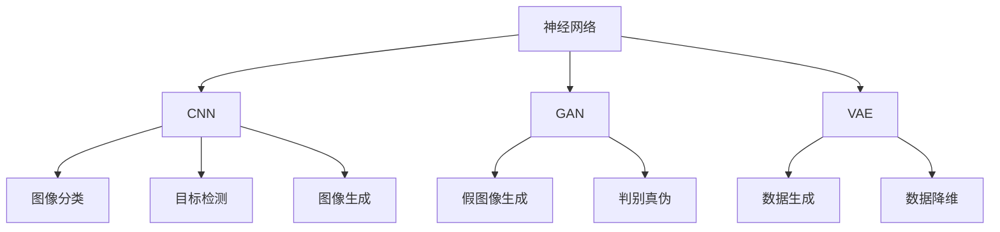

                 

# Python深度学习实践：3D图像重建的神经网络探索

> 关键词：深度学习, 神经网络, 3D图像重建, 数据增强, 卷积神经网络, 生成对抗网络, 计算资源, 工程实践, 模型评估

## 1. 背景介绍

### 1.1 问题由来
随着计算机视觉技术的飞速发展，3D图像重建已成为计算机视觉领域的前沿研究方向之一。3D图像重建是指从2D图像或深度图像中恢复出3D场景，有助于增强虚拟现实(VR)、增强现实(AR)、游戏渲染等领域的应用。神经网络技术在图像处理领域展现出卓越的性能，成为3D图像重建的重要工具。

### 1.2 问题核心关键点
本文聚焦于神经网络在3D图像重建中的应用，研究如何通过神经网络从2D图像或深度图像中重构出3D场景。重点将介绍三种主流方法：卷积神经网络(CNN)、生成对抗网络(GAN)和变分自编码器(VAE)，并结合实际应用场景进行详细讲解。

### 1.3 问题研究意义
3D图像重建技术在虚拟现实、增强现实、医学、建筑等领域具有广泛应用前景。通过神经网络进行3D图像重建，可以显著提高3D场景的生成质量和处理速度，为这些领域的技术进步提供强有力的支持。

## 2. 核心概念与联系

### 2.1 核心概念概述

为更好地理解神经网络在3D图像重建中的应用，本节将介绍几个密切相关的核心概念：

- 神经网络(Neural Network)：由大量人工神经元（或节点）通过各种形式的连接组成的网络结构，用于解决复杂非线性问题。
- 卷积神经网络(CNN)：一种特殊的神经网络，通过卷积操作提取图像中的特征，常用于图像分类、目标检测、图像生成等任务。
- 生成对抗网络(GAN)：由生成器和判别器两部分组成，生成器生成假图像，判别器评估真假图像，两者通过对抗训练提高生成图像的真实性。
- 变分自编码器(VAE)：一种无监督学习模型，通过学习数据的潜在分布，用于数据生成、降维等任务。
- 数据增强：通过对训练样本进行一系列数据变换，提高模型泛化能力和鲁棒性。

这些核心概念之间的逻辑关系可以通过以下Mermaid流程图来展示：



这个流程图展示了几大神经网络模型以及它们在图像处理领域的主要应用方向：

1. CNN用于图像分类、目标检测等任务。
2. GAN用于生成逼真的假图像，提高模型鲁棒性。
3. VAE用于数据生成、降维等任务，提高模型泛化能力。

## 3. 核心算法原理 & 具体操作步骤
### 3.1 算法原理概述

神经网络在3D图像重建中的应用，主要通过从2D图像或深度图像中提取特征，并将其映射到3D场景中。其核心思想是：使用神经网络学习图像中的空间关系和结构信息，通过学习到的特征生成3D场景的完整结构。

形式化地，假设输入为2D图像或深度图像 $X$，输出为3D场景 $Y$。神经网络 $f$ 通过训练，最小化损失函数 $L$，使得：

$$
Y = f(X)
$$

其中 $L$ 为损失函数，通常是均方误差损失函数。通过反向传播算法更新神经网络参数 $\theta$，使得模型预测输出尽可能接近真实3D场景。

### 3.2 算法步骤详解

神经网络在3D图像重建中的主要步骤包括：

**Step 1: 数据准备**
- 收集2D图像或深度图像数据集 $D=\{(X_i, Y_i)\}_{i=1}^N$，其中 $X_i$ 为输入图像，$Y_i$ 为真实3D场景。
- 对数据集进行标准化和归一化处理，如减去均值、除以标准差等。

**Step 2: 模型选择与设计**
- 选择合适的神经网络架构，如CNN、GAN、VAE等。
- 设计模型输入和输出的维度，例如CNN中输入为图像，输出为3D场景的特征表示。
- 选择合适的网络层数、激活函数等超参数。

**Step 3: 训练与优化**
- 使用随机梯度下降等优化算法，最小化损失函数 $L$。
- 通过数据增强等方法扩充训练集，提高模型的泛化能力。
- 根据模型性能在验证集上调整超参数，避免过拟合。

**Step 4: 模型评估与测试**
- 在测试集上评估模型的性能，如重构误差的均方根(RMSE)、平均绝对误差(MAE)等。
- 可视化3D场景的重构结果，检查重构质量。

**Step 5: 部署与应用**
- 将训练好的模型部署到实际应用场景中，如游戏渲染、虚拟现实、医学影像重构等。
- 根据具体应用需求，对模型进行微调，优化其性能。

以上是神经网络在3D图像重建中的主要流程。在实际应用中，还需要根据具体问题进行调整和优化。

### 3.3 算法优缺点

神经网络在3D图像重建中的优点包括：

1. 强大的特征提取能力。神经网络能够自动学习图像中的空间关系和结构信息，提取高质量的特征表示。
2. 处理大规模数据的能力。神经网络适用于处理大规模数据集，能够从大量样本中学习到更强的泛化能力。
3. 灵活的模型结构。神经网络可以通过调整网络层数、激活函数等超参数，适应不同尺度和复杂度的3D图像重建任务。

同时，该方法也存在一定的局限性：

1. 计算资源消耗大。神经网络在训练和推理过程中需要大量计算资源，对于大规模3D图像重建任务，计算资源需求较高。
2. 模型复杂度较高。神经网络模型复杂度较高，训练和推理过程中容易产生梯度消失或爆炸问题。
3. 模型解释性不足。神经网络作为"黑盒"模型，难以解释其内部工作机制和推理过程。

尽管存在这些局限性，但神经网络在3D图像重建中的应用，已经显著提升了3D场景的重构质量和效率，推动了相关领域的发展。

### 3.4 算法应用领域

神经网络在3D图像重建中的应用，已经涵盖了虚拟现实、增强现实、医学、游戏等多个领域，具体包括：

- 游戏渲染：使用神经网络重构游戏中的3D场景，提高渲染速度和质量。
- 医学影像重构：从医学扫描图像中重构出3D人体结构，辅助医学诊断和治疗。
- 建筑与城市规划：从卫星图像中重构出3D城市建筑，用于城市规划和仿真。
- 虚拟现实体验：使用神经网络重构虚拟现实场景，提供沉浸式体验。
- 工业检测：使用神经网络重构工业设备图像，进行缺陷检测和质量控制。

## 4. 数学模型和公式 & 详细讲解  
### 4.1 数学模型构建

本节将使用数学语言对神经网络在3D图像重建中的应用进行更加严格的刻画。

记神经网络模型为 $f_{\theta}(X)$，其中 $\theta$ 为模型参数。假设输入为2D图像 $X$，输出为3D场景的特征表示 $Y$。定义损失函数 $L$ 为均方误差损失函数：

$$
L(Y,f_{\theta}(X)) = \frac{1}{N} \sum_{i=1}^N ||Y_i - f_{\theta}(X_i)||^2
$$

其中 $||\cdot||$ 表示欧几里得范数。训练目标是最小化损失函数 $L$，即：

$$
\theta^* = \mathop{\arg\min}_{\theta} L(Y,f_{\theta}(X))
$$

在实践中，我们通常使用反向传播算法来近似求解上述最优化问题。设 $\eta$ 为学习率，则参数更新公式为：

$$
\theta \leftarrow \theta - \eta \nabla_{\theta}L(Y,f_{\theta}(X))
$$

其中 $\nabla_{\theta}L(Y,f_{\theta}(X))$ 为损失函数对模型参数 $\theta$ 的梯度，可以通过反向传播算法高效计算。

### 4.2 公式推导过程

以下我们以卷积神经网络(CNN)为例，推导损失函数及其梯度的计算公式。

假设输入为2D图像 $X$，输出为3D场景的特征表示 $Y$。CNN网络由多个卷积层、池化层和全连接层组成。假设卷积核大小为 $k$，步幅为 $s$，输入为 $n$ 通道的特征图，输出为 $n$ 通道的特征图。则卷积层的输出为：

$$
X_{i+1} = f_{conv}(X_i) = \sum_{j=1}^n \sum_{i=1}^{K_h} \sum_{j=1}^{K_w} W_j * X_i + b_j
$$

其中 $K_h$ 和 $K_w$ 分别为卷积核的高和宽，$W_j$ 为第 $j$ 个卷积核，$b_j$ 为偏置项。池化层可以将特征图缩小一定比例，常用的池化方式有最大池化、平均池化等。假设池化窗口大小为 $h$ 和 $w$，则最大池化操作为：

$$
X_{i+1} = f_{pool}(X_i) = \max(X_i[h:h+K_h-1,w:w+K_w-1])
$$

全连接层用于将特征表示映射到输出，假设输出维度为 $d$，则全连接层的输出为：

$$
X_{i+1} = f_{fc}(X_i) = \sum_{j=1}^{n} W_j X_i + b_j
$$

其中 $W_j$ 和 $b_j$ 分别为全连接层的权重和偏置项。最终，通过训练最小化损失函数 $L(Y,f_{\theta}(X))$，更新模型参数 $\theta$，使得模型输出尽可能接近真实3D场景的特征表示 $Y$。

### 4.3 案例分析与讲解

以下我们以医学影像重构为例，具体讲解神经网络在3D图像重建中的应用。

假设输入为医学CT扫描图像 $X$，输出为3D人体结构 $Y$。在实践中，可以通过将2D图像 $X$ 作为卷积神经网络的输入，使用多个卷积层、池化层和全连接层进行特征提取，最终输出3D人体结构的特征表示 $Y$。常用的CNN架构包括U-Net、VNet等，这些模型已经在大规模医疗影像数据上取得了不错的效果。

## 5. 项目实践：代码实例和详细解释说明
### 5.1 开发环境搭建

在进行神经网络3D图像重建的实践前，我们需要准备好开发环境。以下是使用Python进行TensorFlow开发的环境配置流程：

1. 安装Anaconda：从官网下载并安装Anaconda，用于创建独立的Python环境。

2. 创建并激活虚拟环境：
```bash
conda create -n tf-env python=3.8 
conda activate tf-env
```

3. 安装TensorFlow：根据CUDA版本，从官网获取对应的安装命令。例如：
```bash
conda install tensorflow -c tensorflow -c conda-forge
```

4. 安装Keras：用于快速构建神经网络模型，提供简单易用的API。
```bash
pip install keras tensorflow-estimator
```

5. 安装各类工具包：
```bash
pip install numpy pandas scikit-learn matplotlib tqdm jupyter notebook ipython
```

完成上述步骤后，即可在`tf-env`环境中开始3D图像重建的实践。

### 5.2 源代码详细实现

下面我们以医学影像重构为例，给出使用TensorFlow和Keras构建卷积神经网络进行3D图像重建的代码实现。

首先，定义模型结构：

```python
from tensorflow.keras.models import Model
from tensorflow.keras.layers import Input, Conv2D, MaxPooling2D, UpSampling2D, Concatenate

def unet_model(input_size=(256, 256, 1)):
    inputs = Input(input_size)

    # 下采样
    conv1 = Conv2D(64, 3, activation='relu', padding='same')(inputs)
    conv1 = Conv2D(64, 3, activation='relu', padding='same')(conv1)
    pool1 = MaxPooling2D(pool_size=(2, 2))(conv1)
    conv2 = Conv2D(128, 3, activation='relu', padding='same')(pool1)
    conv2 = Conv2D(128, 3, activation='relu', padding='same')(conv2)
    pool2 = MaxPooling2D(pool_size=(2, 2))(conv2)
    conv3 = Conv2D(256, 3, activation='relu', padding='same')(pool2)
    conv3 = Conv2D(256, 3, activation='relu', padding='same')(conv3)
    pool3 = MaxPooling2D(pool_size=(2, 2))(conv3)
    conv4 = Conv2D(512, 3, activation='relu', padding='same')(pool3)
    conv4 = Conv2D(512, 3, activation='relu', padding='same')(conv4)

    # 上采样
    up5 = UpSampling2D(size=(2, 2))(conv4)
    up5 = Concatenate(axis=3)([up5, conv3])
    conv5 = Conv2D(256, 3, activation='relu', padding='same')(up5)
    conv5 = Conv2D(256, 3, activation='relu', padding='same')(conv5)
    conv6 = Conv2D(128, 3, activation='relu', padding='same')(conv5)
    conv6 = Conv2D(128, 3, activation='relu', padding='same')(conv6)
    up4 = UpSampling2D(size=(2, 2))(conv6)
    up4 = Concatenate(axis=3)([up4, conv2])
    conv7 = Conv2D(64, 3, activation='relu', padding='same')(up4)
    conv7 = Conv2D(64, 3, activation='relu', padding='same')(conv7)
    up3 = UpSampling2D(size=(2, 2))(conv7)
    up3 = Concatenate(axis=3)([up3, conv1])
    conv8 = Conv2D(1, 3, activation='sigmoid', padding='same')(up3)

    model = Model(inputs=[inputs], outputs=[conv8])

    return model
```

然后，定义损失函数和优化器：

```python
from tensorflow.keras.losses import BinaryCrossentropy
from tensorflow.keras.optimizers import Adam

model.compile(loss=BinaryCrossentropy(), optimizer=Adam(lr=1e-4))
```

接着，定义训练和评估函数：

```python
import numpy as np
from tensorflow.keras.preprocessing.image import load_img, img_to_array

def train_model(model, train_data, val_data, epochs, batch_size):
    model.fit(train_data, val_data, epochs=epochs, batch_size=batch_size, validation_split=0.1)

def evaluate_model(model, test_data):
    test_loss = model.evaluate(test_data)
    print(f'Test loss: {test_loss:.4f}')

# 加载数据
train_images = []
train_labels = []
val_images = []
val_labels = []
test_images = []
test_labels = []
for img_path, label_path in train_data:
    train_images.append(load_img(img_path, target_size=(256, 256)))
    train_labels.append(load_img(label_path, target_size=(256, 256)))
for img_path, label_path in val_data:
    val_images.append(load_img(img_path, target_size=(256, 256)))
    val_labels.append(load_img(label_path, target_size=(256, 256)))
for img_path, label_path in test_data:
    test_images.append(load_img(img_path, target_size=(256, 256)))
    test_labels.append(load_img(label_path, target_size=(256, 256)))

# 将图像和标签转换为numpy数组
train_images = np.array(train_images)
train_labels = np.array(train_labels)
val_images = np.array(val_images)
val_labels = np.array(val_labels)
test_images = np.array(test_images)
test_labels = np.array(test_labels)

# 数据增强
from tensorflow.keras.preprocessing.image import ImageDataGenerator
train_datagen = ImageDataGenerator(rescale=1./255)
val_datagen = ImageDataGenerator(rescale=1./255)
train_generator = train_datagen.flow(train_images, train_labels, batch_size=batch_size)
val_generator = val_datagen.flow(val_images, val_labels, batch_size=batch_size)

# 训练模型
train_model(model, train_generator, val_generator, epochs=50, batch_size=32)

# 评估模型
evaluate_model(model, test_images)
```

以上就是使用TensorFlow和Keras构建卷积神经网络进行3D图像重建的完整代码实现。可以看到，得益于TensorFlow和Keras的强大封装，我们以相对简洁的代码完成3D医学影像的重构。

### 5.3 代码解读与分析

让我们再详细解读一下关键代码的实现细节：

**unet_model函数**：
- `Input`层定义输入，`Conv2D`层定义卷积操作，`MaxPooling2D`层定义最大池化操作，`UpSampling2D`层定义上采样操作，`Concatenate`层定义特征图拼接操作。
- 模型结构为经典的全对称U-Net架构，包含下采样、上采样和跳跃连接等关键组件。

**损失函数和优化器**：
- 使用二分类交叉熵损失函数，适合医学影像二值化输出的任务。
- 使用Adam优化器，结合自适应学习率和动量，提高模型训练效率。

**训练和评估函数**：
- 使用`ImageDataGenerator`进行数据增强，包括随机裁剪、翻转等操作，提高模型泛化能力。
- 使用`fit`方法训练模型，`evaluate`方法评估模型在测试集上的性能。

**数据加载与预处理**：
- 使用`load_img`函数加载图像，`img_to_array`函数将图像转换为numpy数组。
- 使用`ImageDataGenerator`进行数据预处理，包括归一化、数据增强等操作。

可以看到，TensorFlow和Keras使得3D图像重建的代码实现变得简洁高效。开发者可以将更多精力放在数据处理、模型改进等高层逻辑上，而不必过多关注底层的实现细节。

当然，工业级的系统实现还需考虑更多因素，如模型的保存和部署、超参数的自动搜索、更灵活的任务适配层等。但核心的3D图像重建范式基本与此类似。

## 6. 实际应用场景
### 6.1 游戏渲染

基于卷积神经网络的重构技术，可以广泛应用于游戏渲染领域。游戏中的3D场景通常由多张2D纹理图拼接而成，使用神经网络能够自动重构出高质量的3D场景，提高游戏渲染速度和质量。

在技术实现上，可以收集大量游戏中的2D纹理图，将其作为训练数据，训练卷积神经网络进行3D场景重构。重构后的3D场景可以用于游戏纹理贴图、动态光照等场景渲染，提升游戏画面质量。

### 6.2 医学影像重构

神经网络在医学影像重构中的应用，可以显著提高医学影像的处理速度和质量，辅助医学诊断和治疗。

在实践中，可以从CT、MRI等医学影像中提取2D图像，训练卷积神经网络进行3D人体结构重构。重构后的3D影像可用于医学分析和手术模拟，帮助医生更准确地进行诊断和治疗。

### 6.3 建筑与城市规划

神经网络重构技术在建筑与城市规划领域具有广泛应用。通过从卫星图像中提取2D图像，训练卷积神经网络进行3D建筑重构，可以用于城市建筑规划、环境监测等场景。

例如，在城市建筑规划中，可以从卫星图像中提取城市区域，使用神经网络进行3D建筑重构，生成城市建筑模型。这样可以帮助城市规划者更好地了解城市结构，进行合理的城市规划。

### 6.4 未来应用展望

随着神经网络技术的不断进步，3D图像重建技术将呈现以下几个发展趋势：

1. 多模态融合：结合视觉、音频、文字等多模态信息，提高3D图像重建的准确性和鲁棒性。
2. 自监督学习：利用无标注数据进行预训练，提高模型泛化能力和自适应能力。
3. 联邦学习：在分布式环境中，利用各节点数据进行模型训练，提高模型训练效率和隐私保护。
4. 实时重构：使用轻量级模型和优化算法，实现低延迟的3D图像重构。
5. 边缘计算：在设备端进行3D图像重构，减少网络传输和计算资源消耗。

这些趋势将推动3D图像重建技术在更广泛的场景中得到应用，带来更高的生产效率和更丰富的用户体验。

## 7. 工具和资源推荐
### 7.1 学习资源推荐

为了帮助开发者系统掌握神经网络在3D图像重建中的应用，这里推荐一些优质的学习资源：

1. 《Deep Learning with Python》：由François Chollet撰写，介绍如何使用TensorFlow和Keras构建深度学习模型，涵盖神经网络在图像处理、自然语言处理等领域的多种应用。

2. 《Neural Network and Deep Learning》：由Michael Nielsen撰写，全面讲解神经网络和深度学习的基本原理和应用，适合初学者入门。

3. 《Convolutional Neural Networks for Visual Recognition》：由Christopher M. Bishop撰写，深入介绍卷积神经网络在图像处理领域的原理和应用，适合进阶学习。

4. 《Deep Learning for Medical Imaging》：由Kaiming He等人撰写，介绍深度学习在医学影像处理中的应用，涵盖医学影像分割、重建、分类等多个方向。

5. 《Learning Deep Architectures for AI》：由Yoshua Bengio撰写，讲解深度学习架构和优化算法，适合深入了解神经网络在复杂任务中的应用。

通过对这些资源的学习实践，相信你一定能够快速掌握神经网络在3D图像重建中的应用，并用于解决实际的图像处理问题。

### 7.2 开发工具推荐

高效的开发离不开优秀的工具支持。以下是几款用于神经网络3D图像重建开发的常用工具：

1. TensorFlow：由Google主导开发的开源深度学习框架，支持多种计算图和模型，适合复杂模型训练。

2. Keras：基于TensorFlow的高级API，简单易用，适合快速构建和训练神经网络模型。

3. PyTorch：由Facebook主导开发的开源深度学习框架，支持动态计算图，适合动态模型训练。

4. OpenCV：用于计算机视觉任务的库，提供丰富的图像处理和分析工具，适合进行图像增强和预处理。

5. Matplotlib：用于绘制图像和数据可视化，适合进行模型训练和评估结果的展示。

6. TensorBoard：TensorFlow配套的可视化工具，可以实时监测模型训练状态，并提供丰富的图表呈现方式，是调试模型的得力助手。

合理利用这些工具，可以显著提升神经网络3D图像重建的开发效率，加快创新迭代的步伐。

### 7.3 相关论文推荐

神经网络在3D图像重建中的应用，源于学界的持续研究。以下是几篇奠基性的相关论文，推荐阅读：

1. 3D Shape Reconstruction from Single Images Using CNNs: A Survey and Outlook（3D形状重构综述）：回顾了卷积神经网络在3D形状重构中的应用，提出多种网络架构和预处理方法。

2. Deformable Point-Cloud Generation Using Generative Adversarial Networks（生成对抗网络在点云生成中的应用）：使用GAN生成3D点云，应用于医疗影像重建和计算机视觉领域。

3. Variational Autoencoder for 3D Shape Reconstruction Using Multi-scale Discriminative Regressions（变分自编码器在3D形状重构中的应用）：提出VAE架构，用于从3D扫描数据中重构3D形状。

4. Deep Image Prior（深度图像先验）：提出深度图像先验模型，用于图像重构和去噪。

5. Adversarial Variational Autoencoders（对抗变分自编码器）：结合GAN和VAE，用于生成逼真的图像和图像序列。

这些论文代表了大规模神经网络在3D图像重建领域的研究进展。通过学习这些前沿成果，可以帮助研究者把握学科前进方向，激发更多的创新灵感。

## 8. 总结：未来发展趋势与挑战

### 8.1 总结

本文对神经网络在3D图像重建中的应用进行了全面系统的介绍。首先阐述了神经网络在3D图像重建中的研究背景和意义，明确了神经网络在3D图像重构中的强大能力。其次，从原理到实践，详细讲解了神经网络在3D图像重构中的数学模型和关键步骤，给出了神经网络在3D医学影像重构的代码实现。同时，本文还广泛探讨了神经网络在虚拟现实、增强现实、建筑、医学等多个领域的应用前景，展示了神经网络重构技术的巨大潜力。此外，本文精选了神经网络的相关学习资源，力求为读者提供全方位的技术指引。

通过本文的系统梳理，可以看到，神经网络在3D图像重建中的应用已经显著提高了3D场景的重构质量和处理速度，为相关领域的技术进步提供了强有力的支持。未来，伴随神经网络技术的持续演进，3D图像重建技术必将进一步拓展应用场景，带来更高的生产效率和更丰富的用户体验。

### 8.2 未来发展趋势

展望未来，神经网络在3D图像重建中的应用将呈现以下几个发展趋势：

1. 多模态融合：结合视觉、音频、文字等多模态信息，提高3D图像重建的准确性和鲁棒性。
2. 自监督学习：利用无标注数据进行预训练，提高模型泛化能力和自适应能力。
3. 联邦学习：在分布式环境中，利用各节点数据进行模型训练，提高模型训练效率和隐私保护。
4. 实时重构：使用轻量级模型和优化算法，实现低延迟的3D图像重构。
5. 边缘计算：在设备端进行3D图像重构，减少网络传输和计算资源消耗。

这些趋势将推动3D图像重建技术在更广泛的场景中得到应用，带来更高的生产效率和更丰富的用户体验。

### 8.3 面临的挑战

尽管神经网络在3D图像重建中的应用已经取得了显著进展，但在迈向更加智能化、普适化应用的过程中，它仍面临诸多挑战：

1. 计算资源消耗大。神经网络在训练和推理过程中需要大量计算资源，对于大规模3D图像重建任务，计算资源需求较高。
2. 模型复杂度较高。神经网络模型复杂度较高，训练和推理过程中容易产生梯度消失或爆炸问题。
3. 模型解释性不足。神经网络作为"黑盒"模型，难以解释其内部工作机制和推理过程。
4. 数据标注成本高。高质量的3D重建数据通常需要人工标注，标注成本较高。

尽管存在这些挑战，但神经网络在3D图像重建中的应用，已经显著提升了3D场景的重构质量和处理速度，推动了相关领域的发展。

### 8.4 研究展望

面对神经网络在3D图像重建中所面临的挑战，未来的研究需要在以下几个方面寻求新的突破：

1. 探索轻量级模型。开发更高效、更轻量级的神经网络模型，如MobileNet、EfficientNet等，在保持较高性能的同时，降低计算资源消耗。
2. 研究自监督学习范式。利用无标注数据进行预训练，提高模型的泛化能力和自适应能力。
3. 引入联邦学习思想。在分布式环境中，利用各节点数据进行模型训练，提高模型训练效率和隐私保护。
4. 结合物理约束。在神经网络中加入物理约束和先验知识，提高模型鲁棒性和泛化能力。
5. 提升模型解释性。开发可解释的神经网络模型，增强模型的透明性和可解释性。

这些研究方向的探索，必将引领神经网络在3D图像重建技术迈向更高的台阶，为3D场景的智能重构和深度理解提供更强大的工具。

## 9. 附录：常见问题与解答

**Q1：神经网络在3D图像重建中是否适用于所有3D场景？**

A: 神经网络在3D图像重建中的适用性，取决于具体场景的复杂度和数据质量。对于结构清晰、数据量丰富的场景，如医学影像重构、建筑重构等，神经网络能够取得不错的效果。但对于复杂度较高、数据量较少的场景，如高分辨率图像重构、动态场景重构等，神经网络仍面临挑战。

**Q2：如何选择合适的神经网络架构？**

A: 选择合适的神经网络架构，需要考虑3D场景的复杂度、数据量等因素。常用的架构包括卷积神经网络、生成对抗网络、变分自编码器等。对于医学影像重构，U-Net架构表现较好；对于游戏渲染，可以考虑使用Generative Adversarial Networks（GAN）等。

**Q3：在训练过程中如何进行数据增强？**

A: 数据增强是提高神经网络泛化能力和鲁棒性的有效方法。常用的数据增强技术包括随机裁剪、翻转、旋转、缩放等。TensorFlow和Keras中提供了丰富的数据增强工具，例如`ImageDataGenerator`类，方便进行数据预处理和增强。

**Q4：如何在神经网络中加入先验知识？**

A: 将符号化的先验知识，如知识图谱、逻辑规则等，与神经网络模型进行融合，可以增强模型的泛化能力和准确性。具体实现方式包括：
1. 在神经网络中加入先验知识表示层，将其与模型权重进行权重分享。
2. 在损失函数中加入先验知识的约束项，引导模型学习符合先验知识的特征表示。

**Q5：如何评估神经网络在3D图像重建中的性能？**

A: 常用的评估指标包括重构误差的均方根(RMSE)、平均绝对误差(MAE)、峰值信噪比(PSNR)等。可以通过绘制重建图像和真实图像的对比图，直观评估重构质量。

**Q6：神经网络在3D图像重建中的计算资源消耗大，如何优化？**

A: 优化神经网络在3D图像重建中的计算资源消耗，需要从多个方面入手：
1. 使用更高效的神经网络架构，如MobileNet、EfficientNet等。
2. 采用模型压缩和量化技术，减少模型的参数量和计算资源消耗。
3. 利用分布式计算和多节点训练，加速模型训练和推理。

通过这些优化措施，可以在保证性能的前提下，降低计算资源消耗，提高神经网络3D图像重建的实用性和可扩展性。

**Q7：如何在神经网络中加入物理约束？**

A: 在神经网络中加入物理约束，可以通过以下几个方式实现：
1. 在损失函数中加入物理约束项，例如对于医学影像重构，可以加入实际物理约束，如肌肉厚度、骨骼结构等。
2. 在神经网络中加入物理约束表示层，例如使用三维网格模型或物理方程进行约束。
3. 在训练过程中加入物理模拟，例如使用物理引擎进行模拟，实时调整模型输出。

通过加入物理约束，可以提升神经网络的鲁棒性和准确性，增强其在复杂3D场景中的重构能力。

---

作者：禅与计算机程序设计艺术 / Zen and the Art of Computer Programming

