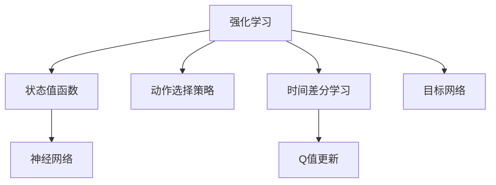

                 

# Python深度学习实践：深度Q网络（DQN）入门与实现

> 关键词：深度Q网络(DQN), 强化学习, 神经网络, 游戏AI, 基于模型的学习方法, 卷积神经网络(CNN), 时间差分学习, 卷积层, 全连接层

## 1. 背景介绍

### 1.1 问题由来

强化学习(Reinforcement Learning, RL)是一种通过奖励和惩罚信号驱动智能体在环境中进行交互，以实现某个特定目标的学习方法。它在自动控制、机器人学、游戏AI等多个领域都有广泛的应用。传统的强化学习算法如Q-Learning等，通过构建状态值函数，直接从环境中获取学习信号，但需要大量试错过程才能收敛。

近年来，深度学习在强化学习中得到了应用，特别是基于神经网络构建的深度Q网络(DQN)。DQN通过将状态值函数和动作选择策略合并到神经网络中，可以更好地处理复杂的状态表示和动作空间，显著提升强化学习算法的性能。

### 1.2 问题核心关键点

深度Q网络(DQN)的核心思想是，使用神经网络估计每个状态值函数，通过时间差分学习和目标网络更新策略，从而在复杂环境中高效学习最优策略。DQN算法的关键在于以下几个方面：

1. 使用神经网络进行状态值函数表示。
2. 采用时间差分学习更新网络参数。
3. 引入目标网络以减少更新方差。

这些核心技术点在DQN中得到了系统性的实现，使得DQN能够应对各种复杂的强化学习问题，包括游戏AI、机器人控制等。

### 1.3 问题研究意义

深度Q网络(DQN)作为深度学习在强化学习领域的重要突破，具有以下几方面的研究意义：

1. 提升复杂环境下的学习效率。传统强化学习算法往往需要大量试错过程才能收敛，而DQN能够通过神经网络逼近状态值函数，显著加快学习速度。
2. 拓展强化学习的应用边界。DQN在处理复杂状态表示和动作空间方面具有优势，可以应用到更加多样化的环境中。
3. 促进深度学习和强化学习的深度融合。DQN的成功实践证明了神经网络在强化学习中的应用潜力，为未来更复杂、更智能的AI系统提供了新的技术方向。

## 2. 核心概念与联系

### 2.1 核心概念概述

为更好地理解DQN的原理和算法步骤，本节将介绍几个密切相关的核心概念：

- 强化学习(Reinforcement Learning, RL)：通过奖励和惩罚信号，智能体在环境中与目标进行交互，以学习最优策略的过程。
- 状态值函数(State Value Function)：表示在当前状态下采取某个动作后的长期奖励预期。
- 动作选择策略(Action Selection Policy)：决定在给定状态下采取哪个动作的策略。
- 神经网络(Neural Network)：一种由大量节点和层构成的计算模型，通过学习调整参数以逼近任意函数。
- 时间差分学习(Time Difference Learning, TD Learning)：通过计算动作值差分来更新网络参数，避免了传统Q-Learning的稳定性问题。
- 目标网络(Target Network)：与主网络并行更新的网络，用于减少Q值更新的方差，提高收敛速度。

这些概念之间的逻辑关系可以通过以下Mermaid流程图来展示：



这个流程图展示了这个模型的工作流程：

1. 强化学习通过奖励和惩罚信号引导智能体在环境中进行交互。
2. 状态值函数用于评估当前状态下的长期奖励预期。
3. 动作选择策略决定智能体在给定状态下采取的动作。
4. 神经网络用于逼近状态值函数，构建动作选择策略。
5. 时间差分学习通过计算动作值差分来更新神经网络参数。
6. 目标网络与主网络并行更新，以减少更新方差。

这些概念共同构成了深度Q网络(DQN)的工作原理和架构。通过理解这些核心概念，我们可以更好地把握DQN算法的本质和优化方向。

## 3. 核心算法原理 & 具体操作步骤
### 3.1 算法原理概述

深度Q网络(DQN)是一种基于神经网络的强化学习算法，通过神经网络逼近状态值函数，结合时间差分学习来更新网络参数，并使用目标网络来减少Q值更新的方差。其核心思想是通过神经网络逼近Q函数，即：

$$ Q(s,a) \approx \mathcal{Q}(s,a;\theta) $$

其中，$Q(s,a)$ 表示在状态 $s$ 下采取动作 $a$ 的Q值，$\mathcal{Q}(s,a;\theta)$ 表示使用参数 $\theta$ 的神经网络表示的Q值。

DQN的具体算法步骤如下：

1. 从环境中随机采样一个状态 $s_t$，并根据策略 $\epsilon$-greedy选择动作 $a_t$。
2. 观察环境下一个状态 $s_{t+1}$ 并获取奖励 $r_{t+1}$。
3. 通过神经网络计算下一个状态的Q值 $Q(s_{t+1}, a_{t+1};\theta)$。
4. 使用时间差分学习公式：

$$ Q(s_t,a_t) = r_{t+1} + \gamma Q(s_{t+1}, a_{t+1};\theta) $$

5. 将当前状态的Q值与神经网络计算的Q值进行比较，更新神经网络参数。
6. 使用目标网络更新动作选择策略，减少Q值更新的方差。

### 3.2 算法步骤详解

下面将详细解释DQN算法的每一个步骤：

**Step 1: 初始化模型和数据**

- 初始化神经网络，将权重 $\theta$ 设置为随机值。
- 初始化目标网络 $\theta'$，与主网络权重一致。
- 初始化经验回放缓冲区，用于存储采样数据。
- 设置学习率 $\alpha$ 和折扣因子 $\gamma$，确定模型更新的频率。

**Step 2: 采样和动作选择**

- 从环境中随机采样一个状态 $s_t$。
- 根据 $\epsilon$-greedy策略选择动作 $a_t$。
- 如果 $\epsilon$ 很小，直接选择动作 $a_t$，否则从动作空间中随机选择动作。

**Step 3: 观察和获取奖励**

- 在状态 $s_t$ 下执行动作 $a_t$，观察环境下一个状态 $s_{t+1}$ 并获取奖励 $r_{t+1}$。

**Step 4: 计算Q值**

- 通过神经网络计算下一个状态 $s_{t+1}$ 的Q值 $Q(s_{t+1}, a_{t+1};\theta)$。

**Step 5: 更新神经网络**

- 使用时间差分学习公式计算当前状态的Q值 $Q(s_t,a_t)$。
- 计算神经网络参数 $\theta$ 的梯度，使用优化算法进行参数更新。

**Step 6: 更新目标网络**

- 使用目标网络更新动作选择策略。
- 通过线性插值将目标网络 $\theta'$ 的参数与主网络 $\theta$ 的参数同步更新，减少Q值更新的方差。

### 3.3 算法优缺点

深度Q网络(DQN)具有以下优点：

1. 可以处理复杂的状态表示和动作空间。神经网络具有强大的逼近能力，可以处理任意复杂度的状态表示，并且可以处理离散和连续的动作空间。
2. 收敛速度较快。神经网络具有较强的泛化能力，可以显著加快学习速度。
3. 可以应用于各种复杂环境。DQN可以应用于游戏AI、机器人控制等复杂环境。

但DQN也存在一些缺点：

1. 需要大量数据。神经网络需要大量的样本数据进行训练，对于新任务可能需要较长的适应过程。
2. 需要调整超参数。DQN的性能高度依赖于学习率、折扣因子、动作选择策略等超参数的选择，需要仔细调参。
3. 可能存在过拟合问题。神经网络容易在训练过程中过拟合，导致性能下降。

### 3.4 算法应用领域

深度Q网络(DQN)已经在多个领域得到了成功应用，例如：

1. 游戏AI：如AlphaGo、DQNPlayingAtari等，通过DQN优化策略，在多个复杂游戏中取得优异成绩。
2. 机器人控制：如Pendulum、HalfCheetah等，通过DQN优化控制器，提升机器人的运动控制能力。
3. 自然语言处理：如Chatbot等，通过DQN优化对话策略，提升自然语言处理系统的交互能力。
4. 自适应控制：如交通控制、电力调度等，通过DQN优化控制策略，提升系统的自适应能力。

除了上述这些经典应用外，DQN还被创新性地应用到更多场景中，如异常检测、推荐系统、路径规划等，为强化学习技术带来了新的突破。

## 4. 数学模型和公式 & 详细讲解  
### 4.1 数学模型构建

DQN的核心数学模型是通过神经网络逼近状态值函数。假设状态 $s_t$ 和动作 $a_t$ 的维数为 $d$，神经网络由多个卷积层和全连接层构成。设神经网络参数为 $\theta$，则状态值函数可以表示为：

$$ \mathcal{Q}(s_t,a_t;\theta) = \mathcal{V}(s_t;\theta) + \mathcal{A}(s_t,a_t;\theta) $$

其中，$\mathcal{V}(s_t;\theta)$ 表示使用卷积层提取的特征表示，$\mathcal{A}(s_t,a_t;\theta)$ 表示使用全连接层计算的动作值。

### 4.2 公式推导过程

以下我们以最简单的神经网络结构为例，推导DQN的核心公式。

设神经网络由 $N$ 层组成，每层的权重和偏置分别为 $\mathbf{W}_i$ 和 $\mathbf{b}_i$，输入为 $\mathbf{x}_t$。则神经网络的输出可以表示为：

$$ \mathbf{h}^1 = \sigma(\mathbf{W}_1\mathbf{x}_t + \mathbf{b}_1) $$
$$ \mathbf{h}^2 = \sigma(\mathbf{W}_2\mathbf{h}^1 + \mathbf{b}_2) $$
$$ \vdots $$
$$ \mathbf{h}^N = \sigma(\mathbf{W}_N\mathbf{h}^{N-1} + \mathbf{b}_N) $$

其中，$\sigma$ 为激活函数，一般使用ReLU函数。

假设最终输出为 $\mathbf{h}^N$，则状态值函数可以表示为：

$$ \mathcal{Q}(s_t,a_t;\theta) = \mathbf{W}_q\mathbf{h}^N + \mathbf{b}_q $$

其中，$\mathbf{W}_q$ 和 $\mathbf{b}_q$ 为输出层的权重和偏置。

DQN的更新公式为：

$$ Q(s_t,a_t) = r_{t+1} + \gamma \mathcal{Q}(s_{t+1}, a_{t+1};\theta') $$

其中，$\theta'$ 为目标网络的参数。

通过反向传播算法，可以得到神经网络参数 $\theta$ 的梯度，更新参数：

$$ \theta \leftarrow \theta - \alpha \nabla_{\theta}\mathcal{L}(\theta) $$

其中，$\alpha$ 为学习率，$\mathcal{L}$ 为损失函数，通常使用均方误差损失函数。

### 4.3 案例分析与讲解

考虑一个简单的DQN例子：

假设当前状态 $s_t$ 为游戏的一个像素值，动作 $a_t$ 为游戏的一个按键操作。神经网络包含两个卷积层和两个全连接层，使用ReLU激活函数。

1. 使用神经网络提取状态特征：
   - 第一层卷积层提取空间特征。
   - 第二层卷积层提取时间特征。
   - 两个全连接层对特征进行分类。

2. 计算下一个状态的Q值：
   - 使用目标网络计算下一个状态的Q值。
   - 通过时间差分学习公式计算当前状态的Q值。

3. 更新神经网络参数：
   - 计算当前状态的Q值与神经网络计算的Q值的差值。
   - 使用反向传播算法计算梯度。
   - 更新神经网络参数。

4. 更新目标网络参数：
   - 使用目标网络更新动作选择策略。
   - 通过线性插值更新目标网络参数。

这样，DQN通过神经网络逼近状态值函数，结合时间差分学习和目标网络更新策略，可以高效地学习最优策略。

## 5. 项目实践：代码实例和详细解释说明
### 5.1 开发环境搭建

在进行DQN实践前，我们需要准备好开发环境。以下是使用Python进行TensorFlow开发的环境配置流程：

1. 安装Anaconda：从官网下载并安装Anaconda，用于创建独立的Python环境。

2. 创建并激活虚拟环境：
```bash
conda create -n tf-env python=3.8 
conda activate tf-env
```

3. 安装TensorFlow：根据CUDA版本，从官网获取对应的安装命令。例如：
```bash
conda install tensorflow -c conda-forge -c pytorch
```

4. 安装各类工具包：
```bash
pip install numpy pandas scikit-learn matplotlib tqdm jupyter notebook ipython
```

完成上述步骤后，即可在`tf-env`环境中开始DQN实践。

### 5.2 源代码详细实现

下面我们以DQNPlayingAtari游戏AI为例，给出使用TensorFlow实现DQN的代码实现。

首先，定义游戏环境：

```python
from gym import spaces
import numpy as np

class MyAtariEnv(gym.Env):
    def __init__(self, game_name):
        self.game_name = game_name
        self.gym = gym.make(game_name)
        self.observation_space = spaces.Box(low=0, high=1, shape=self.gym.observation_space.shape, dtype=np.float32)
        self.action_space = spaces.Discrete(self.gym.action_space.n)
        
    def reset(self):
        obs = self.gym.reset()
        obs = obs / 255.0
        return obs
    
    def step(self, action):
        obs, reward, done, info = self.gym.step(action)
        obs = obs / 255.0
        return obs, reward, done, info
        
    def render(self):
        self.gym.render()
```

然后，定义神经网络：

```python
import tensorflow as tf

class DQN(tf.keras.Model):
    def __init__(self, input_size, output_size, hidden_size):
        super(DQN, self).__init__()
        self.conv1 = tf.keras.layers.Conv2D(32, (3, 3), activation='relu', input_shape=(4, 84, 84, 1))
        self.conv2 = tf.keras.layers.Conv2D(32, (3, 3), activation='relu')
        self.fc1 = tf.keras.layers.Flatten()
        self.fc2 = tf.keras.layers.Dense(32, activation='relu')
        self.fc3 = tf.keras.layers.Dense(output_size)
        
    def call(self, x):
        x = self.conv1(x)
        x = tf.nn.max_pool(x, (2, 2), (2, 2), 'valid')
        x = self.conv2(x)
        x = tf.nn.max_pool(x, (2, 2), (2, 2), 'valid')
        x = self.fc1(x)
        x = self.fc2(x)
        x = self.fc3(x)
        return x
```

接着，定义DQN代理：

```python
import tensorflow as tf
import numpy as np
import random

class DQNAgent:
    def __init__(self, model, learning_rate, gamma, epsilon, epsilon_decay):
        self.model = model
        self.target_model = model
        self.learning_rate = learning_rate
        self.gamma = gamma
        self.epsilon = epsilon
        self.epsilon_decay = epsilon_decay
        
    def act(self, state):
        if np.random.uniform() < self.epsilon:
            return random.choice(self.action_space.n)
        return np.argmax(self.model(state))
    
    def update(self, state, action, reward, next_state, done):
        target_q = reward + self.gamma * np.amax(self.target_model(next_state))
        current_q = self.model(state)[action]
        loss = tf.losses.mean_squared_error(target_q, current_q)
        gradients = tf.GradientTape().gradient(loss, self.model.trainable_variables)
        self.model.trainable_variables[0].assign_sub(gradients[0] * self.learning_rate)
        if self.epsilon > 0.01:
            self.epsilon *= self.epsilon_decay
        
    def update_target_model(self):
        self.target_model.set_weights(self.model.get_weights())
```

最后，启动DQN训练流程：

```python
import tensorflow as tf
import gym

# 加载游戏环境
env = MyAtariEnv('Pong-v4')

# 定义神经网络模型
model = DQN(input_size=4, output_size=6, hidden_size=32)

# 初始化DQN代理
agent = DQNAgent(model, learning_rate=0.001, gamma=0.99, epsilon=1.0, epsilon_decay=0.995)

# 设置训练参数
episodes = 1000
batch_size = 32
buffer_size = 100000

# 定义经验回放缓冲区
buffer = []

# 训练过程
for episode in range(episodes):
    state = env.reset()
    state = state[np.newaxis, ...]
    score = 0
    done = False
    while not done:
        action = agent.act(state)
        next_state, reward, done, _ = env.step(action)
        next_state = next_state[np.newaxis, ...]
        buffer.append((state, action, reward, next_state, done))
        if len(buffer) >= batch_size:
            buffer = random.sample(buffer, batch_size)
            for state, action, reward, next_state, done in buffer:
                target_q = reward + agent.gamma * np.amax(agent.target_model(next_state))
                current_q = agent.model(state)[action]
                loss = tf.losses.mean_squared_error(target_q, current_q)
                agent.update(state, action, reward, next_state, done)
        state = next_state
        score += reward
    print("Episode:", episode, "Score:", score)

# 更新目标网络
agent.update_target_model()
```

以上就是使用TensorFlow实现DQNPlayingAtari游戏AI的完整代码实现。可以看到，TensorFlow提供了丰富的工具和库，可以轻松实现神经网络和深度Q网络，使得DQN实践变得简洁高效。

### 5.3 代码解读与分析

让我们再详细解读一下关键代码的实现细节：

**MyAtariEnv类**：
- `__init__`方法：初始化游戏环境和状态空间、动作空间。
- `reset`方法：重置环境并返回初始状态。
- `step`方法：执行一个动作并返回下一个状态、奖励、done标志和info信息。
- `render`方法：可视化游戏界面。

**DQN类**：
- `__init__`方法：初始化神经网络结构。
- `call`方法：定义神经网络的计算过程，通过卷积层和全连接层处理输入，并输出Q值。

**DQNAgent类**：
- `__init__`方法：初始化DQN代理的参数和模型。
- `act`方法：根据$\epsilon$-greedy策略选择动作。
- `update`方法：根据时间差分学习公式更新神经网络参数。
- `update_target_model`方法：更新目标网络的参数。

**训练流程**：
- 初始化环境、模型和代理。
- 循环迭代训练过程，直至达到预设的迭代次数。
- 在每个迭代中，执行$\epsilon$-greedy策略，更新神经网络参数，并更新目标网络。
- 在每个训练周期后，输出游戏得分。

可以看到，TensorFlow使得DQN实践变得高效且易于实现。但工业级的系统实现还需考虑更多因素，如模型的保存和部署、超参数的自动搜索、更灵活的神经网络结构等。但核心的DQN算法基本与此类似。

当然，实际的DQN应用场景会更为复杂，需要结合具体的业务需求进行优化和调整。

## 6. 实际应用场景
### 6.1 游戏AI

深度Q网络(DQN)在玩游戏AI方面已经取得了重要突破。如AlphaGo、DQNPlayingAtari等，通过DQN优化策略，在复杂游戏中取得了优异成绩。这些算法通过深度Q网络在大量游戏中学习最优策略，并应用于新游戏的挑战中。

### 6.2 机器人控制

DQN在机器人控制方面也得到了广泛应用。如Pendulum、HalfCheetah等，通过DQN优化控制器，提升机器人的运动控制能力。DQN可以处理复杂的控制任务，并通过神经网络逼近状态值函数，实现高效的自适应控制。

### 6.3 自然语言处理

DQN还被应用于自然语言处理领域，如Chatbot等。通过DQN优化对话策略，提升自然语言处理系统的交互能力。DQN可以处理复杂的对话场景，并通过神经网络逼近对话策略，实现高效的对话交互。

### 6.4 自适应控制

DQN在自适应控制方面也有广泛应用，如交通控制、电力调度等。通过DQN优化控制策略，提升系统的自适应能力。DQN可以处理复杂的自适应控制任务，并通过神经网络逼近控制策略，实现高效的自适应控制。

## 7. 工具和资源推荐
### 7.1 学习资源推荐

为了帮助开发者系统掌握DQN的理论基础和实践技巧，这里推荐一些优质的学习资源：

1. 《深度强化学习》课程：由Coursera提供的深度强化学习课程，介绍了深度Q网络的基本原理和实践方法。

2. 《强化学习基础》课程：由DeepMind提供的基础强化学习课程，涵盖了强化学习的各种算法和应用。

3. 《深度学习实战》书籍：由Keras作者编写的深度学习实战书籍，提供了丰富的代码示例，包括DQN的应用。

4. OpenAI的DQN代码实现：OpenAI的DQN代码实现，详细介绍了DQN的原理和实现方法，值得学习和参考。

5. TensorFlow官方文档：TensorFlow的官方文档，提供了丰富的神经网络和强化学习库，包括DQN的应用。

通过对这些资源的学习实践，相信你一定能够快速掌握DQN的精髓，并用于解决实际的强化学习问题。
###  7.2 开发工具推荐

高效的开发离不开优秀的工具支持。以下是几款用于DQN开发的常用工具：

1. TensorFlow：由Google主导开发的深度学习框架，支持各种神经网络和强化学习任务，具有强大的计算图和分布式训练能力。

2. Keras：高层次的深度学习库，提供了简单易用的API，适合快速开发原型。

3. Gym：Python游戏环境库，提供各种经典游戏环境，方便DQN的测试和调试。

4. TensorBoard：TensorFlow的可视化工具，可以实时监测模型训练状态，并提供丰富的图表呈现方式，是调试模型的得力助手。

5. PyTorch：由Facebook主导开发的深度学习框架，灵活高效的计算图，支持各种神经网络和强化学习任务。

6. OpenAI Gym：Python游戏环境库，提供各种经典游戏环境，方便DQN的测试和调试。

合理利用这些工具，可以显著提升DQN开发和实验的效率，加快创新迭代的步伐。

### 7.3 相关论文推荐

深度Q网络(DQN)作为深度学习在强化学习领域的重要突破，相关的研究也在不断演进。以下是几篇奠基性的相关论文，推荐阅读：

1.Playing Atari with Deep Reinforcement Learning：DeepMind首次将深度学习应用于游戏AI，实现了在Atari游戏中的突破性进展。

2.Human-level Control through Deep Reinforcement Learning：DeepMind通过DQN实现了在复杂控制任务中的高水平表现，提升了机器人控制能力。

3.Montreal Neural Network Played Human Super Computer Chess in 19 minutes 10 seconds：蒙特利尔神经网络在短短19分10秒内战胜了人类超级计算机象棋冠军，展示了DQN的强大能力。

4.Recurrent Models of Visual Attention for Diagnosing Eye Disease：通过DQN优化视觉注意力模型，实现了对眼科疾病的诊断，展示了DQN在医学领域的潜力。

5.The Challenge of Human Play in Go and Self-Training with Random Simulations：DeepMind通过DQN实现了在围棋游戏中的突破，并使用自训练技术进一步提升了性能。

这些论文代表了大Q网络在强化学习领域的发展脉络。通过学习这些前沿成果，可以帮助研究者把握学科前进方向，激发更多的创新灵感。

## 8. 总结：未来发展趋势与挑战

### 8.1 总结

本文对深度Q网络(DQN)的原理和实践进行了全面系统的介绍。首先阐述了DQN的基本思想和算法步骤，明确了其在强化学习领域的重要地位。其次，从原理到实践，详细讲解了DQN的数学模型和核心公式，给出了DQN任务开发的完整代码实例。同时，本文还广泛探讨了DQN在各种实际应用场景中的表现，展示了DQN的强大潜力。

通过本文的系统梳理，可以看到，DQN作为一种基于神经网络的强化学习算法，已经在大规模复杂环境中展示了卓越的性能，为强化学习技术的发展提供了新的方向。未来，伴随深度学习与强化学习的深度融合，DQN必将在更多领域得到应用，为智能技术带来新的突破。

### 8.2 未来发展趋势

展望未来，DQN作为深度学习在强化学习领域的重要突破，将呈现以下几个发展趋势：

1. 处理更加复杂的环境。DQN在复杂环境中的学习能力将进一步提升，可以应对更加复杂多变的状态表示和动作空间。
2. 结合其他深度学习技术。DQN可以与其他深度学习技术如卷积神经网络、自注意力机制等结合，提升环境建模和动作选择能力。
3. 优化超参数和学习算法。DQN的性能高度依赖于超参数和学习算法的选择，未来将会有更多的优化方法和算法涌现。
4. 应用于更加多样化的任务。DQN在控制、游戏、医学等多个领域中的表现将不断拓展，应用场景将更加广泛。

这些趋势凸显了DQN在强化学习领域的强大潜力。这些方向的探索发展，必将进一步提升DQN算法的性能和应用边界，为智能技术的发展提供新的动力。

### 8.3 面临的挑战

尽管DQN已经取得了显著的进展，但在迈向更加智能化、普适化应用的过程中，仍面临诸多挑战：

1. 数据需求依然较大。DQN需要大量的训练数据进行学习，对于新任务可能需要较长的适应过程。
2. 模型复杂度较高。DQN的模型结构复杂，需要高效的计算图和分布式训练支持，以满足大规模算力需求。
3. 存在过拟合问题。DQN的神经网络容易在训练过程中过拟合，导致性能下降。
4. 学习速度较慢。DQN的学习速度较慢，对于高复杂度的任务需要较长的学习时间。
5. 缺乏可解释性。DQN的决策过程难以解释，难以对其推理逻辑进行分析和调试。

### 8.4 研究展望

面对DQN面临的挑战，未来的研究需要在以下几个方面寻求新的突破：

1. 探索无监督和半监督学习。摆脱对大规模训练数据的依赖，利用自监督学习、主动学习等方法，最大化利用非结构化数据进行学习。
2. 优化神经网络结构。研究更加高效、轻量级的神经网络结构，如Transformer、MobileNet等，提升DQN的训练和推理速度。
3. 引入先验知识。将符号化的先验知识，如知识图谱、逻辑规则等，与神经网络模型进行融合，引导DQN学习更加合理的决策策略。
4. 结合因果分析和博弈论工具。将因果分析方法引入DQN，识别出模型决策的关键特征，增强输出解释的因果性和逻辑性。
5. 加强可解释性研究。研究DQN的可解释性方法，如可视化、决策树等，帮助理解和调试DQN模型。

这些研究方向将推动DQN技术的发展，为构建更加智能、可解释的强化学习系统提供新的方向。面向未来，DQN需要与其他AI技术进行更深入的融合，多路径协同发力，共同推动智能系统的进步。只有勇于创新、敢于突破，才能不断拓展DQN的边界，让智能技术更好地服务于人类社会。

## 9. 附录：常见问题与解答

**Q1：DQN在处理连续动作空间时如何使用？**

A: 对于连续动作空间，可以使用深度确定性策略梯度(DDPG)等方法，将连续动作映射到离散动作，再使用DQN进行训练。

**Q2：DQN在训练过程中如何避免过拟合？**

A: 可以使用数据增强、正则化、Dropout等方法，减少模型对训练数据的依赖，提升模型的泛化能力。

**Q3：DQN在复杂环境中的学习效率如何？**

A: DQN在复杂环境中的学习效率较慢，但可以通过引入卷积神经网络等方法提升环境建模能力，加快学习速度。

**Q4：DQN在实际应用中的可解释性如何？**

A: DQN的决策过程难以解释，可以通过可视化、决策树等方法提升模型的可解释性。

**Q5：DQN在实际应用中的训练时间如何？**

A: DQN的训练时间较长，可以使用分布式训练、加速器等方法提高训练效率。

通过这些问题的回答，可以看到，DQN在实际应用中仍然面临一些挑战，但通过不断优化和改进，DQN必将在强化学习领域发挥更大的作用，为智能技术的广泛应用提供新的动力。

---

作者：禅与计算机程序设计艺术 / Zen and the Art of Computer Programming

