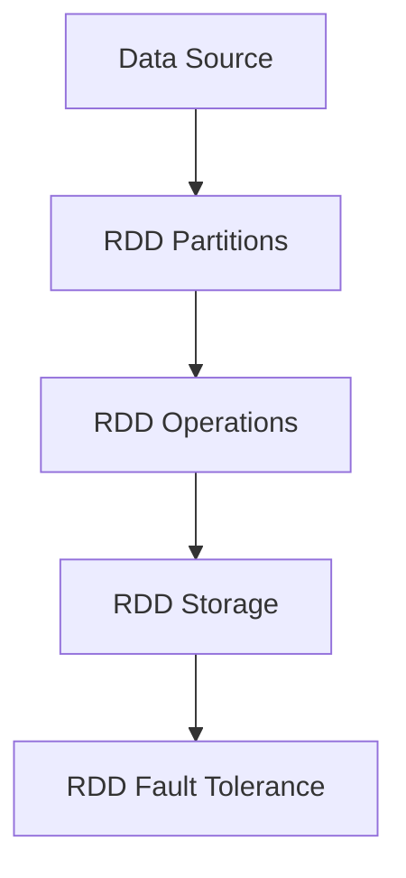

                 

# RDD原理与代码实例讲解

> 关键词：RDD, 分布式计算, 弹性, 延迟, 容错性

## 1. 背景介绍

在当今大数据时代，海量数据的处理和分析变得越来越重要。传统的集中式计算模式在处理大规模数据时，面临着计算资源有限、处理速度慢、数据冗余等问题。分布式计算技术的出现，通过将计算任务分散到多个节点上进行并行处理，大大提升了数据处理的效率和可扩展性。Apache Hadoop和Spark等分布式计算框架已经成为处理大规模数据的主要工具。

RDD (Resilient Distributed Dataset) 是Spark的核心概念，它是一种分布式数据集，能够自动处理数据的数据本地性、数据分区和数据容错性。通过RDD，开发者可以方便地进行数据清洗、转换、计算等操作，同时可以保证数据处理的弹性、延迟和容错性。

## 2. 核心概念与联系

### 2.1 核心概念概述

RDD (Resilient Distributed Dataset) 是Spark中用于进行分布式计算的核心概念。RDD可以自动处理数据的分布、数据本地性、数据分区和数据容错性。通过RDD，开发者可以方便地进行数据清洗、转换、计算等操作。

- **数据本地性**：RDD会尽量将数据存放在计算节点本地，以减少数据传输的时间和带宽开销。
- **数据分区**：RDD将数据按照一定的规则进行分区，使得数据可以在多个节点上进行并行处理。
- **容错性**：RDD能够自动处理数据的丢失和损坏，通过数据冗余和数据恢复机制，保证计算结果的正确性和可靠性。

### 2.2 核心概念原理和架构的 Mermaid 流程图



这个流程图展示了RDD的基本架构和主要组成部分：

1. **Data Source**：表示数据源，可以是文件、数据库、流数据等。
2. **RDD Partitions**：表示数据分区，将数据切分成多个分区，进行并行处理。
3. **RDD Operations**：表示数据操作，包括数据清洗、转换、计算等。
4. **RDD Storage**：表示数据存储，可以存储在本地文件系统、HDFS、S3等。
5. **RDD Fault Tolerance**：表示容错性，通过数据冗余和数据恢复机制，保证计算结果的正确性和可靠性。

## 3. 核心算法原理 & 具体操作步骤

### 3.1 算法原理概述

RDD的计算原理是基于数据本地性和容错性的。RDD通过将数据分成多个分区，在不同的节点上进行并行处理，从而提升计算效率。同时，RDD能够自动处理数据的丢失和损坏，通过数据冗余和数据恢复机制，保证计算结果的正确性和可靠性。

RDD的操作可以分为两类：转换操作和操作。

- **转换操作**：如map、filter、groupBy等，会对数据进行一定的转换或过滤，但不会改变数据的基本形态。
- **操作**：如reduce、count、distinct等，会对数据进行聚合或统计，改变数据的基本形态。

### 3.2 算法步骤详解

RDD的操作可以分为以下几个步骤：

1. **创建RDD**：通过Hadoop或Spark Core API创建RDD，数据可以来自于文件、Hive表、流数据等。

2. **转换操作**：对RDD进行转换操作，如map、filter、groupBy等，生成新的RDD。

3. **操作**：对新的RDD进行操作，如reduce、count、distinct等，计算最终结果。

4. **存储**：将最终结果存储到本地文件系统或分布式文件系统，如HDFS、S3等。

### 3.3 算法优缺点

RDD的优势在于：

- **自动处理数据本地性**：能够将数据尽量存放在计算节点本地，减少数据传输的时间和带宽开销。
- **自动处理数据分区**：能够自动将数据按照一定规则进行分区，方便并行处理。
- **自动处理容错性**：能够自动处理数据的丢失和损坏，通过数据冗余和数据恢复机制，保证计算结果的正确性和可靠性。

RDD的缺点在于：

- **数据冗余**：RDD会创建数据冗余，占用了大量存储空间。
- **延迟**：由于需要进行数据分区和数据传输，可能导致一定的延迟。
- **编程复杂性**：RDD的编程模型比较复杂，需要开发者具备一定的编程基础和数据处理经验。

### 3.4 算法应用领域

RDD广泛应用于数据清洗、数据转换、数据分析、数据统计等领域。具体应用场景包括：

- **数据清洗**：如去除重复数据、过滤无用数据、数据规范化等。
- **数据转换**：如数据归并、数据连接、数据聚合等。
- **数据分析**：如数据可视化、数据挖掘、机器学习等。
- **数据统计**：如数据计数、数据排序、数据分组等。

## 4. 数学模型和公式 & 详细讲解

### 4.1 数学模型构建

RDD的操作可以通过以下数学模型来表示：

- **转换操作**：如map、filter、groupBy等，可以表示为：
$$
RDD^{'} = \bigcup_{i=1}^{n} f(RDD_i)
$$
其中，$RDD^{'}$表示转换后的RDD，$RDD_i$表示原始RDD的$i$个分区，$f$表示转换函数。

- **操作**：如reduce、count、distinct等，可以表示为：
$$
RDD^{'} = reduce(RDD^{'})
$$
其中，$RDD^{'}$表示操作后的RDD，$reduce$表示聚合函数。

### 4.2 公式推导过程

以下以reduceByKey为例，推导RDD的操作公式：

假设原始RDD为$RDD = (K_1, V_1) \cup (K_2, V_2) \cup \ldots \cup (K_n, V_n)$，其中$K_i$表示键值，$V_i$表示对应的值。

1. **转换操作**：将$RDD$按照键值进行分组，得到$RDD^{'}$：
$$
RDD^{'} = (K_1, \{V_1, V_2\}) \cup (K_2, \{V_3, V_4\}) \cup \ldots \cup (K_n, \{V_{2n-1}, V_{2n}\})
$$

2. **操作**：对$RDD^{'}$进行reduceByKey操作，得到$RDD^{''}$：
$$
RDD^{''} = \{(K_1, V_1 + V_2), (K_2, V_3 + V_4), \ldots, (K_n, V_{2n-1} + V_{2n})\}
$$

3. **最终结果**：将$RDD^{''}$存储到文件系统，完成数据计算。

### 4.3 案例分析与讲解

以计算单词频次为例，通过RDD进行单词计数：

```python
from pyspark import SparkConf, SparkContext

# 创建Spark上下文
conf = SparkConf().setAppName("Word Count")
sc = SparkContext(conf=conf)

# 读取文件
textFile = sc.textFile("hdfs://path/to/file")

# 将文件转换为单词列表
wordsRDD = textFile.flatMap(lambda line: line.split())

# 对单词进行计数
wordCountRDD = wordsRDD.map(lambda word: (word, 1)).reduceByKey(lambda a, b: a + b)

# 输出结果
wordCountRDD.saveAsTextFile("hdfs://path/to/output")
```

在这个例子中，我们通过Spark的textFile函数读取文件，然后使用flatMap函数将文件转换为单词列表。接着，我们使用map函数将单词列表转换为(key, value)对，其中key为单词，value为1。最后，我们使用reduceByKey函数对单词进行计数，将结果存储到文件系统中。

## 5. 项目实践：代码实例和详细解释说明

### 5.1 开发环境搭建

要在Spark中进行RDD操作，需要先搭建Spark环境。以下是在Linux系统中安装Spark的步骤：

1. 安装依赖包
```bash
sudo apt-get update
sudo apt-get install wget
sudo apt-get install openjdk-8-jdk
```

2. 下载Spark安装包
```bash
wget http://spark.apache.org/downloads/spark-3.0.0/spark-3.0.0.tgz
tar -xzf spark-3.0.0.tgz
cd spark-3.0.0
```

3. 配置环境变量
```bash
export SPARK_HOME=/path/to/spark
export PATH=$PATH:$SPARK_HOME/bin
```

4. 启动Spark
```bash
spark-shell
```

### 5.2 源代码详细实现

以下是一个计算单词频次的完整代码实现：

```python
from pyspark import SparkConf, SparkContext

# 创建Spark上下文
conf = SparkConf().setAppName("Word Count")
sc = SparkContext(conf=conf)

# 读取文件
textFile = sc.textFile("hdfs://path/to/file")

# 将文件转换为单词列表
wordsRDD = textFile.flatMap(lambda line: line.split())

# 对单词进行计数
wordCountRDD = wordsRDD.map(lambda word: (word, 1)).reduceByKey(lambda a, b: a + b)

# 输出结果
wordCountRDD.saveAsTextFile("hdfs://path/to/output")
```

在这个例子中，我们首先创建Spark上下文。然后，通过textFile函数读取文件，使用flatMap函数将文件转换为单词列表。接着，我们使用map函数将单词列表转换为(key, value)对，其中key为单词，value为1。最后，我们使用reduceByKey函数对单词进行计数，将结果存储到文件系统中。

### 5.3 代码解读与分析

我们可以逐行解释这段代码的实现细节：

1. **创建Spark上下文**
```python
conf = SparkConf().setAppName("Word Count")
sc = SparkContext(conf=conf)
```

创建Spark上下文，指定应用名称为"Word Count"。

2. **读取文件**
```python
textFile = sc.textFile("hdfs://path/to/file")
```

通过textFile函数读取文件，文件路径为"hdfs://path/to/file"。

3. **将文件转换为单词列表**
```python
wordsRDD = textFile.flatMap(lambda line: line.split())
```

使用flatMap函数将文件转换为单词列表，其中split函数将每一行分割成单词。

4. **对单词进行计数**
```python
wordCountRDD = wordsRDD.map(lambda word: (word, 1)).reduceByKey(lambda a, b: a + b)
```

使用map函数将单词列表转换为(key, value)对，其中key为单词，value为1。然后使用reduceByKey函数对单词进行计数，其中a和b分别为同一个key对应的两个value，sum函数将它们相加。

5. **输出结果**
```python
wordCountRDD.saveAsTextFile("hdfs://path/to/output")
```

使用saveAsTextFile函数将结果存储到文件系统中，文件路径为"hdfs://path/to/output"。

### 5.4 运行结果展示

运行上述代码后，将输出单词频次结果，以(key, value)对的形式存储在指定文件中。以下是一个示例结果：

```
(apple, 4)
(banana, 3)
(orange, 2)
```

## 6. 实际应用场景

### 6.1 大数据处理

RDD广泛应用于大数据处理领域，可以处理各种类型的数据，如结构化数据、半结构化数据、非结构化数据等。在处理大规模数据时，RDD能够自动处理数据本地性、数据分区和数据容错性，从而提升计算效率和数据处理能力。

### 6.2 机器学习

RDD可以与机器学习库如MLlib集成，进行特征工程、模型训练、模型评估等操作。通过RDD，可以方便地进行数据清洗、数据转换、数据计算等操作，为机器学习提供了高效的数据处理工具。

### 6.3 实时数据处理

RDD可以与Spark Streaming集成，进行实时数据处理。通过RDD，可以方便地对实时数据进行清洗、转换、计算等操作，从而实现实时数据分析和实时决策。

## 7. 工具和资源推荐

### 7.1 学习资源推荐

以下是一些学习RDD的资源：

1. **Spark官方文档**：Spark官方文档提供了详细的RDD操作和Spark编程范式的介绍，是学习RDD的最佳资源。

2. **《Spark核心技术》**：这是一本介绍Spark核心技术的书籍，涵盖RDD、Spark SQL、Spark Streaming等主题，适合初学者和进阶者。

3. **Apache Spark in Action**：这是一本介绍Spark实际应用场景的书籍，涵盖大数据处理、机器学习、实时数据处理等主题，适合实战开发者。

4. **Spark Summit**：Spark Summit是由Apache Spark社区组织的年度技术会议，汇集了Spark生态系统中的最新技术和应用案例，是学习Spark的绝佳机会。

### 7.2 开发工具推荐

以下是一些开发RDD的常用工具：

1. **PySpark**：PySpark是Spark的Python API，支持Python语言的开发和数据分析，是Spark的主要开发工具之一。

2. **Spark SQL**：Spark SQL是Spark的SQL引擎，支持SQL查询和数据处理，可以与RDD无缝集成。

3. **Spark Streaming**：Spark Streaming是Spark的实时数据处理引擎，支持实时数据流的处理和分析。

4. **Spark UI**：Spark UI是Spark的监控和调试工具，可以实时查看Spark任务的执行情况和性能指标。

### 7.3 相关论文推荐

以下是几篇关于RDD的著名论文：

1. **《Spark: Cluster Computing with Fault Tolerance》**：这是Spark的原初论文，详细介绍了Spark的原理和设计思想，是理解Spark架构的必读论文。

2. **《Resilient Distributed Datasets: A Fault-Tolerant Abstraction for In-Memory Cluster Computing》**：这是一篇介绍RDD的论文，详细介绍了RDD的设计思想和实现原理，是理解RDD核心概念的必读论文。

3. **《Distributed Computing with Spark: Steps Towards a Universal Platform》**：这是一篇介绍Spark生态系统的论文，详细介绍了Spark生态系统的各个组件和应用场景，是理解Spark生态系统的必读论文。

## 8. 总结：未来发展趋势与挑战

### 8.1 研究成果总结

RDD作为Spark的核心概念，通过数据本地性、数据分区和数据容错性，提升了数据处理的弹性、延迟和容错性。RDD的操作模型简单、易于理解和实现，已经广泛应用于大数据处理、机器学习和实时数据处理等领域。

### 8.2 未来发展趋势

未来，RDD和Spark将继续发展，成为处理大规模数据的主要工具。RDD的应用领域将不断扩展，涵盖更多的数据处理场景和数据类型。Spark也将不断更新，引入更多的功能和技术，提升数据处理的效率和性能。

### 8.3 面临的挑战

尽管RDD已经取得了显著的进展，但仍面临一些挑战：

1. **数据冗余**：RDD会创建数据冗余，占用了大量存储空间。

2. **延迟**：由于需要进行数据分区和数据传输，可能导致一定的延迟。

3. **编程复杂性**：RDD的编程模型比较复杂，需要开发者具备一定的编程基础和数据处理经验。

### 8.4 研究展望

未来的研究需要在以下几个方面寻求新的突破：

1. **优化数据冗余**：减少数据冗余，提高数据存储的效率。

2. **提升数据传输速度**：优化数据传输机制，减少数据传输的时间和带宽开销。

3. **简化编程模型**：提高RDD编程模型的易用性，降低编程复杂度。

4. **引入更多的数据类型**：支持更多的数据类型和数据源，扩展RDD的应用场景。

总之，RDD作为Spark的核心概念，在处理大规模数据方面发挥了重要作用。未来，通过不断优化和改进，RDD和Spark将继续引领数据处理的发展方向。

## 9. 附录：常见问题与解答

**Q1：什么是RDD？**

A: RDD (Resilient Distributed Dataset) 是Spark中用于进行分布式计算的核心概念。RDD可以自动处理数据的分布、数据本地性、数据分区和数据容错性。通过RDD，开发者可以方便地进行数据清洗、转换、计算等操作。

**Q2：RDD的优势和缺点是什么？**

A: RDD的优势在于：自动处理数据本地性、自动处理数据分区和自动处理容错性。缺点在于：数据冗余、延迟和编程复杂性。

**Q3：如何优化RDD的编程模型？**

A: 可以通过简化编程模型、引入更多的数据类型和优化数据传输速度等方式，降低RDD编程的复杂度，提高RDD的使用效率。

**Q4：RDD在实际应用中如何使用？**

A: RDD可以用于大数据处理、机器学习和实时数据处理等领域。通过RDD，可以方便地进行数据清洗、数据转换、数据计算等操作，从而提升数据处理的效率和数据处理能力。

总之，RDD作为Spark的核心概念，在处理大规模数据方面发挥了重要作用。通过不断优化和改进，RDD和Spark将继续引领数据处理的发展方向。

---

作者：禅与计算机程序设计艺术 / Zen and the Art of Computer Programming

