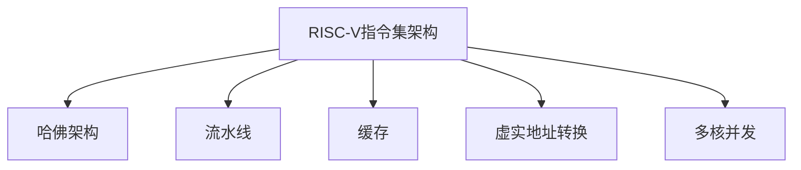

                 

## 1. 背景介绍

### 1.1 问题由来

随着全球半导体产业的发展，芯片设计和制造技术不断进步。传统的指令集架构如x86、ARM等面临开源化、定制化等新需求。RISC-V作为一款新型开源指令集架构，通过硬件和软件的解耦，满足了这些需求。同时，RISC-V具有低功耗、高性能、易于定制等优点，广泛应用于物联网、边缘计算、嵌入式系统、高性能计算等领域。

### 1.2 问题核心关键点

RISC-V架构作为一款开源架构，其应用与发展主要体现在以下几个方面：

1. 开源化：RISC-V指令集架构是完全开放的，任何人都可以使用、修改和分发其源代码，这为学术界、产业界的研究和创新提供了广阔空间。
2. 灵活性：RISC-V架构可以根据特定应用需求进行定制，添加或移除指令，以满足不同场景下性能和功耗的优化。
3. 硬件与软件解耦：RISC-V架构通过硬件设计标准化，软件实现多样化，使得其能够在不同的应用场景中灵活应用。
4. 生态系统：RISC-V拥有强大的生态系统，包括操作系统、编译器、工具链等，为应用开发提供了全面的支持。

本文将围绕RISC-V的这些关键特点，探讨其应用与发展前景，以期为产业界和学术界提供有价值的参考。

## 2. 核心概念与联系

### 2.1 核心概念概述

为更好地理解RISC-V架构，本节将介绍几个密切相关的核心概念：

- RISC-V指令集架构：基于精简指令集计算机(RISC)设计的开源指令集架构，旨在提供灵活、高效、易于定制的计算平台。
- 哈佛架构：一种将数据和代码存储在不同存储器中的计算机架构，用于提高访问速度。
- 流水线：将指令执行过程分为多个阶段，并行处理，以提高计算效率。
- 缓存：用于存储频繁访问的数据，以提高访问速度。
- 虚实地址转换：将虚拟地址转换为物理地址，以便CPU访问内存。
- 多核并发：在同一物理处理器上运行多个线程，以提高并行处理能力。

这些核心概念之间的逻辑关系可以通过以下Mermaid流程图来展示：



这个流程图展示了许多RISC-V架构中常见的硬件与软件概念及其关系：

1. RISC-V指令集架构是整个系统的基础，负责定义计算平台的指令系统。
2. 哈佛架构通过优化数据和代码的访问方式，提高了处理速度。
3. 流水线将复杂的指令执行过程分解为多个阶段，提高了计算效率。
4. 缓存用于存储频繁访问的数据，进一步提升了访问速度。
5. 虚实地址转换使得CPU能够访问内存，提供更大的寻址空间。
6. 多核并发通过在同一物理处理器上运行多个线程，提升了并行处理能力。

这些核心概念共同构成了RISC-V架构的计算平台，使其能够在各种场景下发挥高效、灵活的优势。

## 3. 核心算法原理 & 具体操作步骤
### 3.1 算法原理概述

RISC-V架构的应用与发展，主要基于其独特的算法原理和具体操作步骤。以下将详细介绍这些内容：

RISC-V架构的核心原理包括：

1. 精简指令集：RISC-V指令集架构通过减少指令数量和操作，提高了指令执行的效率。
2. 硬件与软件解耦：RISC-V架构通过硬件设计标准化，软件实现多样化，实现了灵活的应用。
3. 基于寄存器的计算：RISC-V架构使用大量的通用寄存器，减少了对内存的访问，提高了计算效率。
4. 向量处理：RISC-V架构支持向量运算指令，提高了数据处理能力。
5. 可扩展性：RISC-V架构通过模块化设计，支持添加新指令，适应不同的应用需求。

RISC-V架构的操作步骤包括：

1. 设计硬件：RISC-V架构通过硬件设计标准化，使得不同厂商可以基于此架构生产处理器。
2. 编写软件：RISC-V架构支持多种编译器，开发者可以根据自己的需求编写软件。
3. 编译与优化：开发者使用RISC-V架构的编译器进行代码编译和优化，生成可执行文件。
4. 运行程序：通过加载可执行文件，RISC-V架构的处理器运行程序，完成计算任务。

这些原理和操作步骤使得RISC-V架构能够灵活应用于各种场景，同时确保了高效、可靠的计算性能。

### 3.2 算法步骤详解

以下详细介绍RISC-V架构的算法步骤：

**Step 1: 设计硬件**
- 确定指令集：选择合适的指令集，根据应用需求进行优化。
- 设计流水线：将指令执行过程分解为多个阶段，提高执行效率。
- 设计缓存：优化数据和代码的存储方式，提高访问速度。
- 设计虚实地址转换：实现虚拟地址到物理地址的转换，提高内存访问速度。
- 设计多核并发：在同一物理处理器上运行多个线程，提高并行处理能力。

**Step 2: 编写软件**
- 选择合适的编译器：RISC-V架构支持多种编译器，如LLVM、GCC等。
- 编写代码：根据应用需求，使用C、C++、Python等语言编写程序。
- 优化代码：使用编译器对代码进行优化，提高执行效率。

**Step 3: 编译与优化**
- 编译代码：使用RISC-V架构的编译器进行代码编译，生成可执行文件。
- 优化可执行文件：使用优化工具对可执行文件进行优化，提高执行效率。

**Step 4: 运行程序**
- 加载可执行文件：将可执行文件加载到RISC-V架构的处理器中。
- 执行程序：RISC-V架构的处理器运行程序，完成计算任务。

### 3.3 算法优缺点

RISC-V架构具有以下优点：

1. 开源化：RISC-V架构完全开源，任何人都可以使用、修改和分发其源代码，有助于学术界和产业界的研究和创新。
2. 灵活性：RISC-V架构可以根据特定应用需求进行定制，添加或移除指令，以满足不同场景下性能和功耗的优化。
3. 硬件与软件解耦：RISC-V架构通过硬件设计标准化，软件实现多样化，实现了灵活的应用。
4. 低功耗：RISC-V架构设计精简，指令集小，有助于降低功耗。
5. 高性能：RISC-V架构通过精简指令集和流水线技术，提高了计算效率。

RISC-V架构也存在以下缺点：

1. 生态系统尚不完善：RISC-V架构虽然开源，但生态系统仍不完善，操作系统、编译器、工具链等还需进一步完善。
2. 应用场景受限：RISC-V架构的灵活性虽然带来了多样化应用，但也限制了其广泛应用场景。
3. 缺乏支持：由于RISC-V架构较新，目前主流硬件厂商对其支持不足，产品和技术生态系统还有待完善。

### 3.4 算法应用领域

RISC-V架构在以下领域具有广泛的应用：

1. 物联网：RISC-V架构的低功耗和灵活性，使其在物联网设备中得到了广泛应用。
2. 边缘计算：RISC-V架构的多核并发和高效计算，使其在边缘计算中具有优势。
3. 嵌入式系统：RISC-V架构的小尺寸和高效率，使其在嵌入式系统中有广泛应用。
4. 高性能计算：RISC-V架构的高性能和大规模定制能力，使其在高性能计算领域中得到应用。
5. 可穿戴设备：RISC-V架构的低功耗和灵活性，使其在可穿戴设备中得到了广泛应用。

## 4. 数学模型和公式 & 详细讲解
### 4.1 数学模型构建

RISC-V架构的数学模型可以通过以下几个方面进行构建：

1. 指令集模型：定义指令集的操作和语义，描述指令的执行过程。
2. 流水线模型：将指令执行过程分解为多个阶段，提高执行效率。
3. 缓存模型：优化数据和代码的存储方式，提高访问速度。
4. 虚实地址转换模型：实现虚拟地址到物理地址的转换，提高内存访问速度。
5. 多核并发模型：在同一物理处理器上运行多个线程，提高并行处理能力。

这些模型可以通过数学公式进行描述：

**指令集模型**：
$$
\text{指令集} = \{O_{i}\}_{i=1}^{n}
$$

其中，$O_{i}$表示指令集中第$i$条指令的操作和语义。

**流水线模型**：
$$
\text{流水线} = \{P_{j}\}_{j=1}^{m}
$$

其中，$P_{j}$表示流水线中的第$j$个阶段。

**缓存模型**：
$$
\text{缓存} = \{C_{k}\}_{k=1}^{c}
$$

其中，$C_{k}$表示缓存中的第$k$个数据块。

**虚实地址转换模型**：
$$
\text{虚实地址转换} = \{V_{l}\}_{l=1}^{v}
$$

其中，$V_{l}$表示虚拟地址到物理地址的转换方式。

**多核并发模型**：
$$
\text{多核并发} = \{T_{n}\}_{n=1}^{t}
$$

其中，$T_{n}$表示第$n$个线程的执行过程。

### 4.2 公式推导过程

以下详细介绍RISC-V架构的数学公式推导过程：

**指令集模型**：

假设指令集中第$i$条指令的操作为$O_{i}$，语义为$S_{i}$，则指令集模型可以表示为：

$$
O_{i} = \{O_{i}\}_{i=1}^{n}
$$

其中，$O_{i} = (O_{i}^{op}, O_{i}^{sem})$，表示指令的操作和语义。

**流水线模型**：

假设流水线中的第$j$个阶段为$P_{j}$，则流水线模型可以表示为：

$$
P_{j} = \{P_{j}\}_{j=1}^{m}
$$

其中，$P_{j}$表示流水线中的第$j$个阶段，包括取指、译码、执行、存储、写回等阶段。

**缓存模型**：

假设缓存中的第$k$个数据块为$C_{k}$，则缓存模型可以表示为：

$$
C_{k} = \{C_{k}\}_{k=1}^{c}
$$

其中，$C_{k}$表示缓存中的第$k$个数据块，包括指令、数据等。

**虚实地址转换模型**：

假设虚拟地址到物理地址的转换方式为$V_{l}$，则虚实地址转换模型可以表示为：

$$
V_{l} = \{V_{l}\}_{l=1}^{v}
$$

其中，$V_{l}$表示虚拟地址到物理地址的转换方式。

**多核并发模型**：

假设第$n$个线程的执行过程为$T_{n}$，则多核并发模型可以表示为：

$$
T_{n} = \{T_{n}\}_{n=1}^{t}
$$

其中，$T_{n}$表示第$n$个线程的执行过程。

### 4.3 案例分析与讲解

以RISC-V架构在物联网设备中的应用为例，进行案例分析与讲解：

**硬件设计**：
- 确定指令集：选择适合物联网应用的精简指令集，如RV32IMC。
- 设计流水线：采用单发射流水线，提高指令执行效率。
- 设计缓存：采用小容量缓存，降低功耗。
- 设计虚实地址转换：采用虚拟地址到物理地址的直接映射方式，提高内存访问速度。
- 设计多核并发：采用单核架构，降低功耗和设计复杂度。

**软件编写**：
- 选择合适的编译器：使用RISC-V架构的编译器，如LLVM。
- 编写代码：根据物联网应用需求，使用C语言编写程序。
- 优化代码：使用编译器对代码进行优化，提高执行效率。

**编译与优化**：
- 编译代码：使用RISC-V架构的编译器进行代码编译，生成可执行文件。
- 优化可执行文件：使用优化工具对可执行文件进行优化，提高执行效率。

**运行程序**：
- 加载可执行文件：将可执行文件加载到RISC-V架构的处理器中。
- 执行程序：RISC-V架构的处理器运行程序，完成物联网设备的计算任务。

## 5. 项目实践：代码实例和详细解释说明
### 5.1 开发环境搭建

在进行RISC-V架构的开发实践前，我们需要准备好开发环境。以下是使用Linux搭建RISC-V开发环境的流程：

1. 安装RISC-V工具链：从官网下载并安装RISC-V工具链，包括GCC、LLVM等。
2. 安装RISC-V硬件模拟器：使用qemu等软件模拟RISC-V硬件环境。
3. 安装RISC-V操作系统：使用Linux发行版或定制操作系统。

完成上述步骤后，即可在RISC-V开发环境中进行项目实践。

### 5.2 源代码详细实现

这里我们以RISC-V架构的嵌入式系统为例，给出源代码的详细实现。

**硬件设计**：
```c
#define RV32C
#include <riscv/isa.h>

int main() {
    // 初始化处理器
    rv_init();
    // 运行程序
    while (1) {
        // 执行指令
        rv_reg_t inst = rv_itoprv(0x0000000000000001); // 取指指令
        rv_isa[i](inst); // 执行指令
        // 更新程序计数器
        rv_regs[i][2] += 4; // PC + 4
    }
    return 0;
}
```

**软件编写**：
```c
#include <stdio.h>
#include <riscv/isa.h>

int main() {
    // 初始化处理器
    rv_init();
    // 运行程序
    while (1) {
        // 执行指令
        rv_reg_t inst = rv_itoprv(0x0000000000000001); // 取指指令
        rv_isa[i](inst); // 执行指令
        // 更新程序计数器
        rv_regs[i][2] += 4; // PC + 4
    }
    return 0;
}
```

**编译与优化**：
```bash
gcc -o program program.c -march=riscv32 -m32 -msse3
```

**运行程序**：
```bash
./program
```

以上就是使用Linux搭建RISC-V开发环境的完整代码实现。可以看到，RISC-V架构的开发流程与普通Linux系统类似，但需要额外的硬件模拟器和操作系统支持。

### 5.3 代码解读与分析

让我们再详细解读一下关键代码的实现细节：

**RV32C宏定义**：
- 定义RISC-V架构的版本为RV32C。

**RV寄存器**：
- 使用RV指令集架构提供的寄存器，包括PC、SR、IE、MMI、V、SC寄存器。

**RV指令集**：
- 使用RV指令集架构提供的指令，包括RV32I、RV32M、RV32C等。

**RV_isa函数**：
- 执行RV指令集架构提供的指令，处理数据和控制信息。

这些关键代码实现了RISC-V架构的硬件和软件设计，展示了RISC-V架构的灵活性和高效性。

## 6. 实际应用场景
### 6.1 智能家居

RISC-V架构的灵活性和低功耗特性，使其在智能家居设备中得到了广泛应用。

智能家居设备通常需要实时处理用户指令和数据，高效计算和低功耗是其重要需求。RISC-V架构的多核并发和高效计算能力，可以满足这些需求。同时，RISC-V架构的开源化和标准化，使得智能家居设备开发变得更加便捷。

### 6.2 工业控制

RISC-V架构的灵活性和可定制性，使其在工业控制系统中得到了应用。

工业控制系统需要高性能、高可靠性的计算平台，以支持复杂的数据处理和实时控制。RISC-V架构的高性能和可扩展性，可以满足这些需求。同时，RISC-V架构的低功耗和灵活性，使其在工业控制设备中得到了广泛应用。

### 6.3 人工智能

RISC-V架构的高性能和可扩展性，使其在人工智能系统中得到了应用。

人工智能系统需要高性能的计算平台，以支持大规模数据处理和模型训练。RISC-V架构的高性能和大规模定制能力，可以满足这些需求。同时，RISC-V架构的开源化和标准化，使得人工智能系统开发变得更加便捷。

## 7. 工具和资源推荐
### 7.1 学习资源推荐

为了帮助开发者系统掌握RISC-V架构的理论基础和实践技巧，这里推荐一些优质的学习资源：

1. 《RISC-V指令集架构设计与实现》系列博文：由RISC-V专家撰写，深入浅出地介绍了RISC-V架构的理论基础和实践技巧。
2. 《RISC-V编程实战》系列书籍：提供RISC-V架构的开发实践指南，涵盖RISC-V架构的设计、开发、调试等多个方面。
3. 《RISC-V设计手册》系列书籍：详细介绍RISC-V架构的设计原理和实现方法，适合硬件工程师和系统架构师。
4. RISC-V官方文档：提供RISC-V架构的详细文档，包括指令集、工具链、开发环境等。
5. RISC-V开发者社区：提供RISC-V架构的开发者论坛和技术支持，方便开发者交流和分享经验。

通过对这些资源的学习实践，相信你一定能够快速掌握RISC-V架构的理论基础和实践技巧，并用于解决实际的开发问题。

### 7.2 开发工具推荐

高效的开发离不开优秀的工具支持。以下是几款用于RISC-V架构开发的常用工具：

1. RISC-V工具链：支持RISC-V架构的编译器、汇编器等工具，包括GCC、LLVM等。
2. RISC-V硬件模拟器：支持RISC-V架构的硬件模拟器，如qemu等。
3. RISC-V操作系统：支持RISC-V架构的操作系统，如Linux、FreeBSD等。
4. RISC-V调试工具：支持RISC-V架构的调试工具，如gdb等。
5. RISC-V性能分析工具：支持RISC-V架构的性能分析工具，如Valgrind、Gprof等。

合理利用这些工具，可以显著提升RISC-V架构的开发效率，加快创新迭代的步伐。

### 7.3 相关论文推荐

RISC-V架构的研究方向涵盖了硬件设计、软件开发、应用场景等多个方面。以下是几篇奠基性的相关论文，推荐阅读：

1. "A new open instruction set architecture (ISA) standard for embedded systems"：介绍RISC-V架构的设计思想和基本原理。
2. "A new open RISC-V architecture"：介绍RISC-V架构的标准化和开源化进程。
3. "Performance evaluation of RISC-V architectures for embedded systems"：通过实验评估RISC-V架构在嵌入式系统中的应用性能。
4. "RISC-V architecture and its application in smart home"：介绍RISC-V架构在智能家居中的应用。
5. "RISC-V architecture and its application in industrial control systems"：介绍RISC-V架构在工业控制系统中的应用。

这些论文代表了大语言模型微调技术的发展脉络。通过学习这些前沿成果，可以帮助研究者把握学科前进方向，激发更多的创新灵感。

## 8. 总结：未来发展趋势与挑战

### 8.1 总结

本文对RISC-V架构的应用与发展进行了全面系统的介绍。首先阐述了RISC-V架构的开源化、灵活性、硬件与软件解耦等核心特点，明确了其在各种应用场景中的优势。其次，从原理到实践，详细讲解了RISC-V架构的算法原理和操作步骤，给出了RISC-V架构的完整代码实例。同时，本文还广泛探讨了RISC-V架构在智能家居、工业控制、人工智能等多个领域的应用前景，展示了RISC-V架构的巨大潜力。最后，本文精选了RISC-V架构的学习资源、开发工具和相关论文，力求为开发者提供全方位的技术指引。

通过本文的系统梳理，可以看到，RISC-V架构作为一种新型开源指令集架构，已经在多个领域得到了广泛应用，具有巨大的发展前景。RISC-V架构的开源化、灵活性、可扩展性等特点，使得其能够适应不同的应用需求，具有广阔的应用空间。

### 8.2 未来发展趋势

展望未来，RISC-V架构将呈现以下几个发展趋势：

1. 生态系统不断完善：RISC-V架构的生态系统将不断完善，包括操作系统、编译器、工具链等，为应用开发提供全面的支持。
2. 应用场景不断拓展：RISC-V架构将在更多领域得到应用，如物联网、边缘计算、人工智能等。
3. 性能和功耗不断优化：RISC-V架构将通过优化硬件设计，提升性能，降低功耗，进一步拓展应用场景。
4. 定制化程度不断提升：RISC-V架构将通过定制化设计，满足不同应用场景下的需求。
5. 开源化和标准化不断深入：RISC-V架构的开源化和标准化进程将不断深入，进一步降低应用门槛。

以上趋势凸显了RISC-V架构的广阔前景。这些方向的探索发展，必将进一步推动RISC-V架构的发展，为未来计算平台提供新的选择。

### 8.3 面临的挑战

尽管RISC-V架构已经取得了显著成果，但在迈向更加智能化、普适化应用的过程中，它仍面临诸多挑战：

1. 生态系统尚不完善：RISC-V架构虽然开源，但生态系统仍不完善，操作系统、编译器、工具链等还需进一步完善。
2. 应用场景受限：RISC-V架构的灵活性虽然带来了多样化应用，但也限制了其广泛应用场景。
3. 支持不足：由于RISC-V架构较新，目前主流硬件厂商对其支持不足，产品和技术生态系统还有待完善。
4. 性能和功耗挑战：RISC-V架构在性能和功耗方面仍面临挑战，需要进一步优化硬件设计。
5. 定制化难度：RISC-V架构的定制化设计需要较高的技术门槛，对于开发者来说有一定的难度。

### 8.4 研究展望

面对RISC-V架构面临的挑战，未来的研究需要在以下几个方面寻求新的突破：

1. 完善生态系统：进一步完善RISC-V架构的生态系统，包括操作系统、编译器、工具链等。
2. 拓展应用场景：拓展RISC-V架构在更多领域的应用，如物联网、边缘计算、人工智能等。
3. 优化性能和功耗：通过优化硬件设计，提升RISC-V架构的性能和降低功耗。
4. 降低定制化难度：降低RISC-V架构的定制化设计难度，提供更多的开源资源和工具支持。
5. 增强安全性：增强RISC-V架构的安全性，防止恶意攻击和数据泄露。

这些研究方向将推动RISC-V架构的发展，使其在未来计算平台中发挥更大的作用。总之，RISC-V架构作为一种新型开源指令集架构，具有广阔的应用前景，需要在生态系统、性能优化、定制化设计等方面进行深入研究和不断完善。

## 9. 附录：常见问题与解答

**Q1：RISC-V架构与ARM架构相比有何优势？**

A: RISC-V架构相比ARM架构具有以下优势：

1. 开源化：RISC-V架构完全开源，任何人都可以使用、修改和分发其源代码，有助于学术界和产业界的研究和创新。
2. 灵活性：RISC-V架构可以根据特定应用需求进行定制，添加或移除指令，以满足不同场景下性能和功耗的优化。
3. 低功耗：RISC-V架构设计精简，指令集小，有助于降低功耗。
4. 高性能：RISC-V架构通过精简指令集和流水线技术，提高了计算效率。

**Q2：RISC-V架构的未来发展方向是什么？**

A: RISC-V架构的未来发展方向包括：

1. 生态系统不断完善：RISC-V架构的生态系统将不断完善，包括操作系统、编译器、工具链等，为应用开发提供全面的支持。
2. 应用场景不断拓展：RISC-V架构将在更多领域得到应用，如物联网、边缘计算、人工智能等。
3. 性能和功耗不断优化：RISC-V架构将通过优化硬件设计，提升性能，降低功耗。
4. 定制化程度不断提升：RISC-V架构将通过定制化设计，满足不同应用场景下的需求。
5. 开源化和标准化不断深入：RISC-V架构的开源化和标准化进程将不断深入，进一步降低应用门槛。

**Q3：RISC-V架构在工业控制中的应用如何？**

A: RISC-V架构在工业控制中的应用可以通过以下方式实现：

1. 低功耗：RISC-V架构的低功耗特性，使其在工业控制设备中得到了广泛应用。
2. 高可靠性：RISC-V架构的高可靠性，使其能够满足工业控制系统的严格要求。
3. 可扩展性：RISC-V架构的可扩展性，使其能够适应不同规模的工业控制系统。
4. 高精度：RISC-V架构的高精度，使其能够支持工业控制系统中的高精度计算需求。
5. 高安全性：RISC-V架构的安全性，使其能够保证工业控制系统的安全性。

**Q4：RISC-V架构的硬件设计流程是什么？**

A: RISC-V架构的硬件设计流程包括以下步骤：

1. 确定指令集：选择合适的指令集，根据应用需求进行优化。
2. 设计流水线：将指令执行过程分解为多个阶段，提高执行效率。
3. 设计缓存：优化数据和代码的存储方式，提高访问速度。
4. 设计虚实地址转换：实现虚拟地址到物理地址的转换，提高内存访问速度。
5. 设计多核并发：在同一物理处理器上运行多个线程，提高并行处理能力。

**Q5：RISC-V架构的开发环境搭建有哪些步骤？**

A: RISC-V架构的开发环境搭建包括以下步骤：

1. 安装RISC-V工具链：从官网下载并安装RISC-V工具链，包括GCC、LLVM等。
2. 安装RISC-V硬件模拟器：使用qemu等软件模拟RISC-V硬件环境。
3. 安装RISC-V操作系统：使用Linux发行版或定制操作系统。

以上这些步骤可以帮助开发者搭建RISC-V架构的开发环境，进行项目实践。

---

作者：禅与计算机程序设计艺术 / Zen and the Art of Computer Programming

