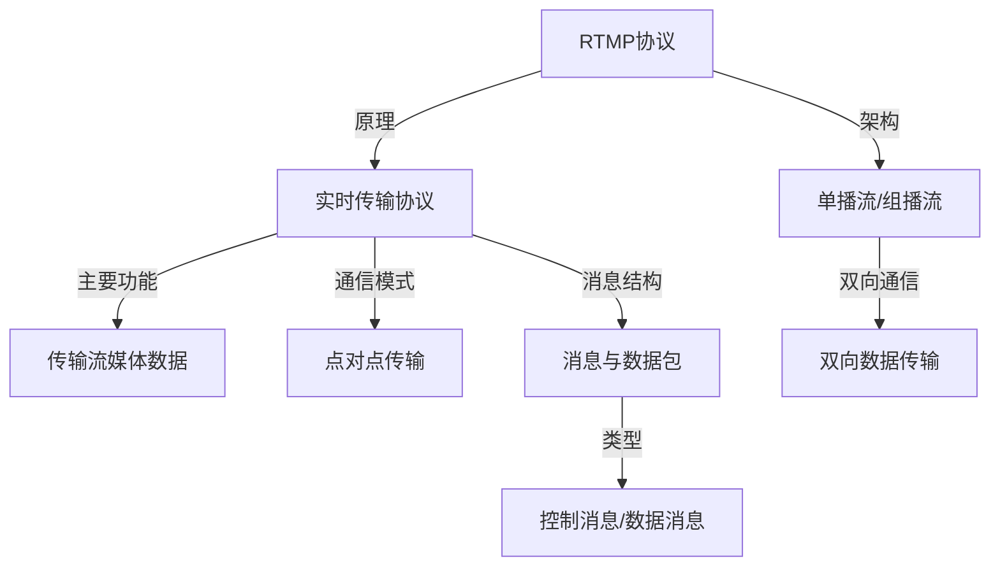

                 

# RTMP协议：直播系统开发必备知识

## 1. 背景介绍

直播系统是互联网时代重要的信息传输形式之一，能够即时、连续地将视频、音频等信息源传输给观众，具有高度的互动性和沉浸感。RTMP协议作为直播系统中最常用的流媒体传输协议，具有实时性高、传输稳定、适应性好等优点，广泛应用于WebRTC、Adobe Flash Player、流媒体广播等多个场景。

直播系统涉及前端页面渲染、流媒体编码、协议传输、服务端处理等多个环节。RTMP协议作为一种高效稳定的实时通信协议，是整个直播系统架构中不可或缺的组成部分。因此，掌握RTMP协议的基本原理和应用方法，对于直播系统开发人员来说是必不可少的技能。

## 2. 核心概念与联系

### 2.1 核心概念概述

为了深入理解RTMP协议的工作原理，首先需要掌握几个关键概念：

1. **实时传输协议(Real-Time Messaging Protocol, RTMP)**：一种专门用于流媒体应用的传输协议，支持多种数据类型（如视频、音频、元数据等）的传输。RTMP基于TCP协议，能够实现双向数据传输，适用于客户端和服务器之间的点对点通信。

2. **流媒体流(Stream)**：指将多媒体数据（如视频、音频）连续地传输给接收者，形成实时流。流媒体流可以分为单播流和组播流。

3. **数据包(Chunk)**：RTMP协议中，将多媒体数据切割成固定大小的块，每个块称为一个数据包（Chunk）。每个数据包包含头部信息（Chunk Header）和数据（Chunk Body）两部分。

4. **消息(Message)**：RTMP协议使用消息（Message）的形式进行数据传输，消息可以是控制消息或数据消息。

5. **控制消息(Control Message)**：RTMP协议定义了多种控制消息（如C0、C1、C2等），用于协议状态管理和通信控制。

6. **数据消息(Data Message)**：RTMP协议中的数据消息用于传输多媒体数据，分为单播数据消息和组播数据消息。

### 2.2 核心概念原理和架构的 Mermaid 流程图



### 2.3 RTMP协议工作原理

RTMP协议的工作原理可以简单概括为以下几个步骤：

1. **建立连接**：客户端向服务器发送连接请求，服务器接收请求后，返回连接响应，建立TCP连接。
2. **交换控制消息**：在连接建立后，客户端和服务器通过交换控制消息进行状态同步和参数配置。
3. **传输数据包**：客户端将多媒体数据切割成数据包，并通过TCP连接将数据包传输给服务器。服务器在接收到数据包后，进行相应的处理和转发。
4. **接收确认**：客户端在发送数据包后，会接收服务器返回的确认消息（ACK），以确保数据传输的可靠性。
5. **关闭连接**：在数据传输完成后，客户端和服务器可以协商关闭连接，释放资源。

RTMP协议通过TCP连接的可靠性和控制消息的通信机制，保证了流媒体数据的实时传输和稳定传输。

## 3. 核心算法原理 & 具体操作步骤

### 3.1 算法原理概述

RTMP协议的核心在于数据的封装、传输和确认机制。其算法原理主要包括：

1. **数据包的分割和组装**：将多媒体数据切割成固定大小的数据包，每个数据包包含头部信息（Chunk Header）和数据（Chunk Body）。
2. **消息的封装与解析**：将数据包封装成消息（Message），消息分为控制消息和数据消息，并根据消息类型进行解析和处理。
3. **流量控制与重传机制**：通过控制消息进行流量控制和重传机制的实现，确保数据传输的可靠性和实时性。

### 3.2 算法步骤详解

#### 3.2.1 数据包的封装

RTMP协议中，多媒体数据被封装成固定大小的数据包（Chunk），每个数据包包含头部信息（Chunk Header）和数据（Chunk Body）。头部信息包括消息类型、数据包长度、数据包序列号、时间戳等。数据包封装的流程图如下：


#### 3.2.2 消息的封装

RTMP协议使用消息（Message）的形式进行数据传输，消息分为控制消息和数据消息。控制消息用于协议状态管理和通信控制，数据消息用于传输多媒体数据。消息的封装流程如下：


#### 3.2.3 流量控制与重传机制

RTMP协议使用控制消息进行流量控制和重传机制的实现，确保数据传输的可靠性和实时性。流量控制机制包括接收方告诉发送方可以接收的数据量、发送方根据接收方的反馈调整发送速率等。重传机制包括数据包丢失重传、超时重传等。流量控制与重传机制的流程图如下：


### 3.3 算法优缺点

RTMP协议的优点在于其传输稳定、实时性高、支持双向通信等。然而，RTMP协议也有一些缺点，如数据传输效率不高、协议复杂度较高、不适用于WebRTC等新兴技术等。

### 3.4 算法应用领域

RTMP协议主要应用于以下领域：

1. **流媒体传输**：广泛应用于WebRTC、Adobe Flash Player等流媒体平台，支持音频、视频等媒体数据的实时传输。
2. **视频会议系统**：如WebRTC、SIP等协议中，RTMP用于传输视频、音频等多媒体数据。
3. **游戏直播**：用于游戏直播平台，支持游戏主播与观众之间的实时互动。
4. **网络广播**：用于网络广播平台，支持广播节目与观众之间的实时互动。

## 4. 数学模型和公式 & 详细讲解 & 举例说明

### 4.1 数学模型构建

RTMP协议的数学模型主要涉及数据包封装、消息封装和流量控制等过程。以下以数据包封装为例，构建其数学模型。

假设多媒体数据长度为 $D$，每个数据包长度为 $L$，则需要进行 $\frac{D}{L}$ 次数据包封装。假设数据包序列号从 $0$ 开始，则第 $i$ 个数据包的头部信息为：

$$
H_i = \begin{cases}
0x9C & \text{消息类型} \\
i & \text{数据包序列号} \\
L & \text{数据包长度} \\
D & \text{多媒体数据长度} \\
0 & \text{保留位} \\
0 & \text{保留位} \\
\end{cases}
$$

数据包封装后，组合成消息，其头部信息为：

$$
M = \begin{cases}
0xF9B4DBD8 & \text{消息头} \\
i & \text{消息序列号} \\
L & \text{消息长度} \\
H_i & \text{数据包头部信息} \\
D & \text{多媒体数据长度} \\
\end{cases}
$$

### 4.2 公式推导过程

以数据包封装的公式为例，进行推导：

假设多媒体数据长度为 $D$，每个数据包长度为 $L$，则需要进行 $\frac{D}{L}$ 次数据包封装。假设数据包序列号从 $0$ 开始，则第 $i$ 个数据包的头部信息为：

$$
H_i = \begin{cases}
0x9C & \text{消息类型} \\
i & \text{数据包序列号} \\
L & \text{数据包长度} \\
D & \text{多媒体数据长度} \\
0 & \text{保留位} \\
0 & \text{保留位} \\
\end{cases}
$$

数据包封装后，组合成消息，其头部信息为：

$$
M = \begin{cases}
0xF9B4DBD8 & \text{消息头} \\
i & \text{消息序列号} \\
L & \text{消息长度} \\
H_i & \text{数据包头部信息} \\
D & \text{多媒体数据长度} \\
\end{cases}
$$

### 4.3 案例分析与讲解

以WebRTC中使用RTMP协议的案例为例，进行分析：

1. **连接建立**：WebRTC客户端通过ICE协议获取与服务器之间的连接信息，并通过RTCPeerConnection对象建立TCP连接。
2. **消息交换**：客户端和服务器通过交换控制消息进行状态同步和参数配置，如RTCPeerConnection对象的配置、音频/视频流的配置等。
3. **数据传输**：客户端将多媒体数据切割成数据包，并通过TCP连接将数据包传输给服务器。服务器在接收到数据包后，进行相应的处理和转发。
4. **接收确认**：客户端在发送数据包后，会接收服务器返回的确认消息（ACK），以确保数据传输的可靠性。

## 5. 项目实践：代码实例和详细解释说明

### 5.1 开发环境搭建

为了进行RTMP协议的开发和测试，需要搭建完整的WebRTC开发环境，包括以下组件：

1. **WebRTC库**：如WebRTC v1.0.0，用于实现流媒体通信。
2. **RTMP库**：如FlashMediaServer，用于实现流媒体服务器功能。
3. **调试工具**：如Wireshark，用于网络抓包和协议分析。

### 5.2 源代码详细实现

以下是WebRTC中使用RTMP协议的代码示例：

```python
import-webrtc
import-webrtc-data-channel
import-webrtc-peerconnection

# 创建WebRTC连接
conn = RTCPeerConnection()

# 添加数据通道
dataChannel = conn.addDataChannel('dataChannel')

# 设置音频/视频流
#...

# 发送多媒体数据
data = 'RTMP视频流数据'
dataChannel.send(data)

# 接收确认消息
ack = dataChannel.receive()

# 处理确认消息
#...
```

### 5.3 代码解读与分析

以上代码示例展示了WebRTC中使用RTMP协议的基本流程，包括建立连接、添加数据通道、设置流媒体、发送数据、接收确认消息等。通过WebRTC库，开发者可以方便地实现流媒体通信，利用RTMP协议进行数据传输。

## 6. 实际应用场景

### 6.1 实时视频直播

RTMP协议在实时视频直播中的应用广泛，如WebRTC、Adobe Flash Player等平台。直播过程中，用户通过前端页面向服务器发送视频流，服务器再将视频流传输给其他观众，实现了实时互动。

### 6.2 游戏直播

在游戏直播中，RTMP协议用于传输游戏主播的视频流和音频流，观众通过前端页面接收直播内容，实现了主播与观众之间的实时互动。

### 6.3 网络广播

网络广播平台通常使用RTMP协议进行音频、视频的传输，听众通过前端页面接收广播内容，实现了广播节目与听众之间的实时互动。

### 6.4 未来应用展望

随着WebRTC等新兴技术的普及，RTMP协议的应用前景将逐渐被边缘化。未来，流媒体传输将更多依赖WebRTC等技术，实现更高效、更稳定、更安全的流媒体通信。

## 7. 工具和资源推荐

### 7.1 学习资源推荐

为了深入学习RTMP协议，以下是一些推荐的学习资源：

1. **WebRTC官方文档**：详细介绍了WebRTC协议的使用方法和最佳实践，适合WebRTC开发人员参考。
2. **RTMP协议标准**：IEEE 1574.2标准，详细描述了RTMP协议的各个细节和实现方法。
3. **RTMP协议详解**：一些书籍和博客文章，深入浅出地讲解了RTMP协议的工作原理和实现方法。

### 7.2 开发工具推荐

以下是一些常用的RTMP协议开发工具：

1. **FlashMediaServer**：功能强大的流媒体服务器，支持RTMP协议，适用于WebRTC、Adobe Flash Player等流媒体平台。
2. **nginx-rtmp**：轻量级的流媒体服务器，支持RTMP协议，适用于WebRTC、WebRTC等流媒体平台。
3. **OBS Studio**：开源的直播软件，支持RTMP协议，适用于游戏直播、网络广播等场景。

### 7.3 相关论文推荐

以下是一些与RTMP协议相关的研究论文，推荐阅读：

1. **Real-Time Messaging Protocol (RTMP) Specification**：RTMP协议的标准文档，详细描述了RTMP协议的各个细节和实现方法。
2. **RTMP: A Real-Time Transport Protocol for streaming Media**：介绍RTMP协议的设计思路和实现方法，适合了解RTMP协议的基础知识。
3. **RTMP Live Streaming with WebRTC and FFmpeg**：介绍WebRTC中使用RTMP协议进行流媒体通信的方法，适合WebRTC开发人员参考。

## 8. 总结：未来发展趋势与挑战

### 8.1 研究成果总结

RTMP协议作为一种稳定的实时通信协议，在流媒体传输中发挥了重要作用。其高效的封装和传输机制、双向通信特点，使其成为直播系统开发中不可或缺的组成部分。通过掌握RTMP协议的原理和应用方法，开发者能够更好地开发和优化流媒体通信系统。

### 8.2 未来发展趋势

RTMP协议的未来发展趋势主要包括：

1. **WebRTC普及**：WebRTC作为新兴的流媒体协议，逐步取代RTMP成为主流。
2. **协议优化**：RTMP协议需要不断优化，提高传输效率和可靠性。
3. **多协议融合**：RTMP协议需要与其他协议（如WebRTC、SIP等）进行更好的融合，实现更灵活、更高效的流媒体通信。
4. **安全性增强**：RTMP协议需要增强安全性，防止数据泄露和攻击。

### 8.3 面临的挑战

RTMP协议在未来的发展中，仍面临以下挑战：

1. **协议复杂性**：RTMP协议的实现较为复杂，需要开发人员具备较高的技术水平。
2. **传输效率低**：RTMP协议的传输效率较低，尤其是在数据量较大的情况下。
3. **兼容性问题**：RTMP协议与其他协议的兼容性问题需要解决。
4. **安全漏洞**：RTMP协议存在一些安全漏洞，需要不断改进。

### 8.4 研究展望

未来，RTMP协议需要在以下方面进行深入研究：

1. **协议优化**：提高RTMP协议的传输效率和可靠性，增强其性能。
2. **多协议融合**：实现RTMP协议与其他协议的更好融合，提供更灵活的流媒体通信方案。
3. **安全性增强**：增强RTMP协议的安全性，防止数据泄露和攻击。
4. **应用扩展**：拓展RTMP协议在更多场景中的应用，如物联网、智慧城市等。

## 9. 附录：常见问题与解答

**Q1: RTMP协议与其他流媒体协议（如WebRTC）的区别是什么？**

A: RTMP协议是一种专门的流媒体协议，基于TCP协议，适用于客户端和服务器之间的点对点通信。WebRTC是一种新兴的流媒体协议，基于ICE协议，支持多对多通信，适用于点对点、P2P等多种传输模式。

**Q2: 如何优化RTMP协议的传输效率？**

A: 优化RTMP协议的传输效率，可以从以下几个方面入手：

1. **数据包分割和组装**：合理设置数据包大小，避免过小或过大的数据包。
2. **流量控制**：使用流量控制机制，避免数据包丢失和超时重传。
3. **传输格式**：选择合适的传输格式，如H.264、AAC等，提高传输效率。
4. **网络优化**：优化网络环境，减少网络延迟和丢包率。

**Q3: RTMP协议在实际应用中如何保证实时性？**

A: RTMP协议在实际应用中，保证实时性主要通过以下措施：

1. **低延迟传输**：使用小数据包和高效压缩算法，减少传输延迟。
2. **流量控制**：通过控制消息进行流量控制，避免数据包丢失和超时重传。
3. **冗余传输**：使用冗余传输技术，提高数据包的可靠性。

通过以上措施，RTMP协议能够在实时性要求较高的应用场景中发挥重要作用。

---

作者：禅与计算机程序设计艺术 / Zen and the Art of Computer Programming

