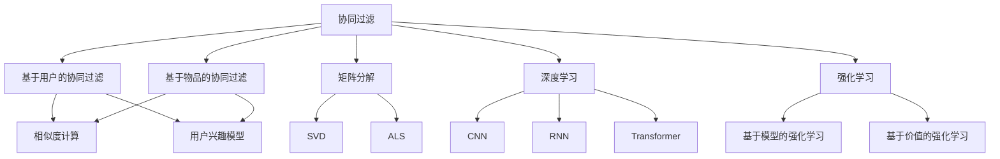

                 

# Recommendation Systems原理与代码实例讲解

> 关键词：推荐系统,协同过滤,矩阵分解,深度学习,强化学习,协同过滤算法,深度学习模型,强化学习算法

## 1. 背景介绍

推荐系统(Recommendation Systems)作为人工智能领域的核心应用之一，已经在电商、娱乐、社交等多个行业大放异彩。通过分析用户历史行为和兴趣，推荐系统能够为用户提供个性化的商品、内容、服务推荐，提升用户满意度与留存率。然而，构建一个高效、精准的推荐系统并非易事，需要综合运用多种推荐算法，并辅以完善的工程实践和运营策略。本文将系统梳理推荐系统的基本原理，并借助代码实例，深入讲解推荐算法的应用。

## 2. 核心概念与联系

推荐系统可以简单定义为一种个性化推荐技术，它根据用户的历史行为和兴趣，预测用户可能感兴趣的物品，并进行推荐。推荐系统可以分为三类：协同过滤(Collaborative Filtering, CF)、矩阵分解(Matrix Factorization, MF)、深度学习(Deep Learning, DL)、强化学习(Reinforcement Learning, RL)等。这些算法虽然侧重点不同，但基本原理都是通过刻画用户和物品之间的相似度，生成个性化的推荐结果。

我们将通过以下Mermaid流程图展示这些核心算法的基本联系：



此流程图展示了协同过滤、矩阵分解、深度学习和强化学习的基本关系和联系。协同过滤是最基础的推荐算法，而矩阵分解和深度学习在协同过滤基础上进行了改进，强化学习则是更为高级的推荐算法，可以更好地处理非线性推荐问题。

## 3. 核心算法原理 & 具体操作步骤
### 3.1 算法原理概述

协同过滤算法是基于用户历史行为和物品属性进行推荐的一种技术。它分为基于用户的协同过滤(UBCF)和基于物品的协同过滤(IBCF)两种类型。其中，基于用户的协同过滤通过相似度计算，生成每个用户对物品的兴趣评分。基于物品的协同过滤则通过物品之间的关系，预测用户可能感兴趣的物品。

矩阵分解算法是对协同过滤算法的一种数学优化，它将用户-物品评分矩阵分解为两个低维矩阵，以捕捉用户和物品之间的隐含特征，从而更准确地进行推荐。

深度学习算法通过构建复杂的多层神经网络模型，学习用户和物品的高级抽象特征，从而提供更个性化的推荐。深度学习可以处理大规模数据，具有较强的非线性拟合能力，但需要更多的数据和计算资源。

强化学习算法通过模拟用户与系统之间的交互，不断优化推荐策略，使得推荐结果逐步逼近最优。强化学习能够在不断试错中提升推荐精度，但需要大量交互数据和复杂的环境模拟。

### 3.2 算法步骤详解

**协同过滤算法**

协同过滤的基本步骤如下：

1. **数据收集**：收集用户对物品的评分数据，以及用户和物品的属性特征。

2. **用户相似度计算**：计算每个用户与其他用户的相似度，可以使用余弦相似度、皮尔逊相关系数等。

3. **物品相似度计算**：计算每个物品与其他物品的相似度，同样可以使用余弦相似度、皮尔逊相关系数等。

4. **用户兴趣预测**：根据相似度，预测每个用户对每个物品的兴趣评分，可以使用加权平均或加权求和的方式。

5. **物品推荐**：根据用户兴趣评分，推荐用户可能感兴趣的新物品。

**矩阵分解算法**

矩阵分解算法的基本步骤如下：

1. **数据预处理**：对用户-物品评分矩阵进行归一化处理，使其数值在[0,1]区间内。

2. **矩阵分解**：将用户-物品评分矩阵分解为两个低维矩阵$P$和$Q$，其中$P$为$U\times K$矩阵，$Q$为$K\times I$矩阵，$K$为隐含特征的维度。

3. **预测评分**：根据分解后的矩阵$P$和$Q$，计算用户$u$对物品$i$的预测评分$\hat{r}_{ui}$，可以使用点乘或矩阵乘法的方式。

4. **损失函数优化**：最小化预测评分与实际评分之间的均方误差，通过梯度下降等优化算法更新$P$和$Q$矩阵。

5. **生成推荐列表**：根据预测评分，排序生成推荐列表，推荐评分高的物品给用户。

**深度学习算法**

深度学习算法的基本步骤如下：

1. **数据预处理**：对用户-物品评分矩阵进行归一化处理，同时收集用户和物品的属性特征。

2. **构建模型**：选择合适的神经网络结构，如卷积神经网络(CNN)、循环神经网络(RNN)、注意力机制(Attention)等，搭建推荐模型。

3. **训练模型**：将用户-物品评分矩阵作为训练数据，使用反向传播算法更新模型参数。

4. **生成推荐列表**：将新物品的特征输入训练好的模型，输出用户对新物品的兴趣评分，排序生成推荐列表。

**强化学习算法**

强化学习算法的基本步骤如下：

1. **环境构建**：定义推荐系统的状态、动作、奖励等，模拟用户与系统之间的交互。

2. **策略学习**：使用Q-learning等算法，学习最优的推荐策略，即在当前状态下选择哪个物品进行推荐。

3. **模型训练**：将用户对推荐物品的反馈作为奖励信号，训练推荐策略模型。

4. **推荐生成**：根据用户当前状态和推荐策略，生成推荐列表。

### 3.3 算法优缺点

协同过滤算法的优点在于简单易实现，可以处理非结构化数据，不需要物品属性特征。但缺点在于数据稀疏性高，难以处理新物品，且相似度计算可能产生偏差。

矩阵分解算法可以高效处理大规模数据，能够挖掘用户和物品之间的隐含特征。但分解矩阵的维度选择、正则化参数等需要手动调参，存在一定的复杂性。

深度学习算法能够处理高维非线性数据，具有较强的泛化能力。但需要大量数据和计算资源，模型训练和推理速度较慢。

强化学习算法能够不断优化推荐策略，适应动态变化的用户需求。但需要大量交互数据和复杂的环境模拟，训练过程较为复杂。

### 3.4 算法应用领域

推荐系统已经在电商、视频、音乐等多个行业得到了广泛应用，涵盖了商品推荐、内容推荐、个性化服务等。例如：

1. **电商推荐**：如亚马逊(Amazon)、淘宝(Taobao)等电商平台，通过推荐系统为用户推荐商品，提升用户购买转化率。

2. **视频推荐**：如Netflix、YouTube等视频平台，通过推荐系统为用户推荐影片，增加用户粘性和满意度。

3. **音乐推荐**：如Spotify、网易云音乐等音乐平台，通过推荐系统为用户推荐歌曲，提升用户使用体验。

4. **社交推荐**：如微博、微信等社交媒体，通过推荐系统为用户推荐朋友、文章、活动等，丰富用户社交体验。

5. **金融推荐**：如银行、基金等金融机构，通过推荐系统为用户推荐理财产品、金融服务，增加用户忠诚度。

除了上述这些经典应用外，推荐系统还被创新性地应用于广告投放、新闻推荐、旅游推荐等多个领域，为各行各业带来变革性影响。

## 4. 数学模型和公式 & 详细讲解 & 举例说明

### 4.1 数学模型构建

协同过滤算法可以简单表示为以下矩阵形式：

$R_{ui} = \sum_{j=1}^{N} a_{uj} b_{ji}$

其中$R$为用户-物品评分矩阵，$a_{uj}$为用户$u$的隐含特征向量，$b_{ji}$为物品$i$的隐含特征向量。

协同过滤算法通过计算用户和物品之间的相似度，生成每个用户对每个物品的兴趣评分，从而进行推荐。

### 4.2 公式推导过程

以基于用户的协同过滤算法为例，推导用户$u$对物品$i$的兴趣评分：

1. **用户相似度计算**：

$cos(u,v) = \frac{\sum_{j=1}^{N} a_{uj} a_{vj}}{\sqrt{\sum_{j=1}^{N} a_{uj}^2} \cdot \sqrt{\sum_{j=1}^{N} a_{vj}^2}}$

2. **物品相似度计算**：

$cos(i,j) = \frac{\sum_{u=1}^{M} b_{ui} b_{uj}}{\sqrt{\sum_{u=1}^{M} b_{ui}^2} \cdot \sqrt{\sum_{u=1}^{M} b_{uj}^2}}$

3. **用户兴趣预测**：

$\hat{r}_{ui} = \sum_{j=1}^{N} cos(u,j) \cdot R_{ij}$

### 4.3 案例分析与讲解

以下通过一个简单的电商推荐系统，具体说明协同过滤算法的应用：

假设有一个电商平台，收集了用户对商品的评分数据，以及用户和商品的属性特征。每个用户$u$对每个商品$i$的评分记为$R_{ui}$，其中$R_{ui} \in [1,5]$。

1. **数据收集**：收集用户$u$对商品$i$的评分数据$R_{ui}$，以及用户和商品的属性特征$A_u$和$A_i$。

2. **用户相似度计算**：计算每个用户$u$与其他用户$v$的相似度$cos(u,v)$。

3. **物品相似度计算**：计算每个商品$i$与其他商品$j$的相似度$cos(i,j)$。

4. **用户兴趣预测**：根据用户$u$的相似度向量$cos(u,.)$，预测用户$u$对每个商品$i$的兴趣评分$\hat{r}_{ui}$。

5. **物品推荐**：根据预测评分$\hat{r}_{ui}$，排序生成推荐列表，推荐评分高的商品给用户$u$。

## 5. 项目实践：代码实例和详细解释说明

### 5.1 开发环境搭建

在进行推荐系统开发前，我们需要准备好开发环境。以下是使用Python进行PyTorch开发的环境配置流程：

1. 安装Anaconda：从官网下载并安装Anaconda，用于创建独立的Python环境。

2. 创建并激活虚拟环境：
```bash
conda create -n recommendation-env python=3.8 
conda activate recommendation-env
```

3. 安装PyTorch：根据CUDA版本，从官网获取对应的安装命令。例如：
```bash
conda install pytorch torchvision torchaudio cudatoolkit=11.1 -c pytorch -c conda-forge
```

4. 安装Pandas、NumPy等工具包：
```bash
pip install pandas numpy matplotlib scikit-learn tqdm jupyter notebook ipython
```

完成上述步骤后，即可在`recommendation-env`环境中开始推荐系统开发。

### 5.2 源代码详细实现

以下是使用Python实现协同过滤算法的示例代码：

```python
import pandas as pd
import numpy as np
import matplotlib.pyplot as plt

# 构建用户-物品评分矩阵
data = pd.read_csv('ratings.csv', sep=',')
R = pd.pivot_table(data, index='user', columns='item', values='rating', fill_value=0).values

# 用户相似度计算
cosine_sim = np.dot(R, R.T)
cosine_sim = cosine_sim / (np.linalg.norm(R, axis=1, keepdims=True) * np.linalg.norm(R, axis=0, keepdims=True))

# 物品相似度计算
cosine_sim = np.dot(R.T, R) / (np.linalg.norm(R.T, axis=1, keepdims=True) * np.linalg.norm(R, axis=0, keepdims=True))

# 用户兴趣预测
cosine_sim_user = cosine_sim.mean(axis=1)
user_sims = np.dot(cosine_sim, cosine_sim_user)

# 生成推荐列表
def recommend(user_id, num_recommendations=5):
    sims = cosine_sim_user[user_id]
    indices = np.argsort(sims)[::-1]
    sims = sims[indices]
    recommendations = []
    for i in range(num_recommendations):
        recommendations.append(data.index[indices[i]])
    return recommendations

# 测试推荐系统
user_id = 'Alice'
recommendations = recommend(user_id)
print('推荐给{}的物品有：'.format(user_id))
print(', '.join(recommendations))
```

### 5.3 代码解读与分析

让我们再详细解读一下关键代码的实现细节：

**数据收集**：
- `pd.read_csv`：使用Pandas库读取评分数据文件，生成用户-物品评分矩阵$R$。

**用户相似度计算**：
- `np.dot`：计算用户和用户之间的余弦相似度。

**物品相似度计算**：
- 使用类似的公式计算物品和物品之间的余弦相似度。

**用户兴趣预测**：
- `np.dot`：计算每个用户对每个物品的兴趣评分。

**生成推荐列表**：
- `np.argsort`：根据兴趣评分排序，得到推荐的物品索引。

**测试推荐系统**：
- `recommend`函数：根据用户ID生成推荐列表。

在上述代码中，我们使用了Pandas、Numpy等Python库，高效地处理了大规模的评分数据，并计算了用户和物品之间的相似度，实现了协同过滤算法。

## 6. 实际应用场景

推荐系统已经在电商、视频、音乐等多个行业得到了广泛应用，涵盖了商品推荐、内容推荐、个性化服务等。例如：

1. **电商推荐**：如亚马逊(Amazon)、淘宝(Taobao)等电商平台，通过推荐系统为用户推荐商品，提升用户购买转化率。

2. **视频推荐**：如Netflix、YouTube等视频平台，通过推荐系统为用户推荐影片，增加用户粘性和满意度。

3. **音乐推荐**：如Spotify、网易云音乐等音乐平台，通过推荐系统为用户推荐歌曲，提升用户使用体验。

4. **社交推荐**：如微博、微信等社交媒体，通过推荐系统为用户推荐朋友、文章、活动等，丰富用户社交体验。

5. **金融推荐**：如银行、基金等金融机构，通过推荐系统为用户推荐理财产品、金融服务，增加用户忠诚度。

除了上述这些经典应用外，推荐系统还被创新性地应用于广告投放、新闻推荐、旅游推荐等多个领域，为各行各业带来变革性影响。

## 7. 工具和资源推荐

### 7.1 学习资源推荐

为了帮助开发者系统掌握推荐系统的基本原理和实践技巧，这里推荐一些优质的学习资源：

1. 《推荐系统实战》：涵盖推荐系统基础知识和多种推荐算法，适合入门读者。

2. 《TensorFlow推荐系统实战》：使用TensorFlow实现推荐系统，详细讲解了从数据预处理到模型训练的全流程。

3. 《深度学习推荐系统》：深度学习在推荐系统中的应用，包含多种深度学习模型和优化技巧。

4. 《强化学习》：介绍强化学习的基本概念和算法，适合希望深入研究强化学习的读者。

5. 《推荐系统中的数据挖掘与统计学习》：涵盖推荐系统中的数据挖掘技术和统计学习方法，适合学术研究者。

通过对这些资源的学习实践，相信你一定能够快速掌握推荐系统的精髓，并用于解决实际的推荐问题。

### 7.2 开发工具推荐

高效的开发离不开优秀的工具支持。以下是几款用于推荐系统开发的常用工具：

1. PyTorch：基于Python的开源深度学习框架，灵活动态的计算图，适合快速迭代研究。推荐系统的大部分算法都可以在PyTorch上实现。

2. TensorFlow：由Google主导开发的开源深度学习框架，生产部署方便，适合大规模工程应用。同样有丰富的推荐系统资源。

3. Spark MLlib：Apache Spark的机器学习库，提供了多种推荐算法和分布式计算功能，适合大规模数据处理。

4. Scikit-learn：Python的机器学习库，提供了多种经典的机器学习算法，适合进行推荐系统的初步探索。

5. Keras：高层次的深度学习框架，提供了简单易用的API，适合快速构建推荐模型。

合理利用这些工具，可以显著提升推荐系统开发效率，加快创新迭代的步伐。

### 7.3 相关论文推荐

推荐系统的发展源于学界的持续研究。以下是几篇奠基性的相关论文，推荐阅读：

1. "The Bellkamp-LORD Collaborative Filtering Algorithm"：提出了基于用户和物品的协同过滤算法。

2. "Analyzing Collaborative Filtering Prediction Errors"：分析了协同过滤算法的误差来源，提出了改进措施。

3. "Item-Based Collaborative Filtering"：介绍了基于物品的协同过滤算法，提出了新的相似度计算方法。

4. "Latent Factor Model for Recommender Systems"：提出了基于矩阵分解的推荐算法，使用SVD等方法分解用户-物品评分矩阵。

5. "Learning from Internet Search Queries Using Click Prediction"：使用点击预测模型，构建推荐系统，提升了推荐效果。

这些论文代表了大推荐系统的发展脉络。通过学习这些前沿成果，可以帮助研究者把握学科前进方向，激发更多的创新灵感。

## 8. 总结：未来发展趋势与挑战

### 8.1 总结

本文对推荐系统进行了全面系统的介绍，系统梳理了协同过滤、矩阵分解、深度学习和强化学习等推荐算法的原理和实现细节。通过代码实例，深入讲解了推荐系统的应用场景和实践技巧。推荐系统作为人工智能领域的重要应用之一，已经在电商、视频、音乐等多个行业大放异彩。未来，伴随推荐算法的不断演进和优化，推荐系统将进一步提升用户体验和业务价值。

### 8.2 未来发展趋势

展望未来，推荐系统的趋势将包括以下几个方面：

1. **个性化推荐**：随着用户数据和模型算法的不断提升，推荐系统将能够提供更个性化的推荐服务，提升用户满意度。

2. **实时推荐**：通过构建实时流处理系统，推荐系统可以动态更新用户兴趣，提供实时推荐，满足用户即时需求。

3. **跨平台推荐**：通过跨平台数据融合，推荐系统可以在多个应用场景中协同工作，提供一致的推荐体验。

4. **多模态推荐**：将图像、语音、位置等多模态信息纳入推荐系统，提升推荐效果。

5. **联邦学习**：通过分布式数据联邦学习，推荐系统可以在保护用户隐私的同时，提升模型泛化能力。

6. **可解释性推荐**：通过引入可解释性技术，推荐系统可以提供透明的推荐理由，增强用户信任感。

7. **混合推荐**：结合多种推荐算法，构建混合推荐系统，提升推荐效果和泛化能力。

以上趋势凸显了推荐系统的广阔前景。这些方向的探索发展，必将进一步提升推荐系统的性能和应用范围，为各行各业带来变革性影响。

### 8.3 面临的挑战

尽管推荐系统已经取得了瞩目成就，但在迈向更加智能化、普适化应用的过程中，它仍面临着诸多挑战：

1. **冷启动问题**：对于新用户和新物品，推荐系统往往难以提供准确的推荐，需要更多时间积累数据。

2. **数据稀疏性**：用户和物品之间往往存在大量的缺失评分，推荐系统难以充分利用数据。

3. **推荐鲁棒性**：推荐系统容易受到数据噪声、推荐算法等因素的影响，需要提升系统的鲁棒性。

4. **计算资源消耗**：推荐系统需要处理大规模数据，计算资源消耗较大，需要优化算法和硬件资源。

5. **隐私保护**：推荐系统需要收集用户数据，如何保护用户隐私，避免数据泄露，是重要的研究方向。

6. **公平性问题**：推荐系统容易产生偏见，导致不同用户之间的不公平推荐。

7. **推荐多样性**：推荐系统需要平衡个性化推荐和多样性推荐，避免推荐单一化。

正视推荐系统面临的这些挑战，积极应对并寻求突破，将使推荐系统走向更加成熟和可靠，更好地服务于用户和业务。

### 8.4 研究展望

面对推荐系统所面临的挑战，未来的研究需要在以下几个方面寻求新的突破：

1. **深度学习推荐模型**：开发更加高效、泛化能力更强的深度学习推荐模型，提升推荐效果。

2. **强化学习推荐算法**：结合强化学习算法，优化推荐策略，提升推荐系统的适应性。

3. **多模态数据融合**：将多模态数据纳入推荐系统，提升推荐效果和用户满意度。

4. **联邦学习推荐**：通过联邦学习，在保护用户隐私的同时，提升推荐系统的效果和泛化能力。

5. **可解释性推荐**：引入可解释性技术，提供透明的推荐理由，增强用户信任感。

6. **混合推荐算法**：结合多种推荐算法，构建混合推荐系统，提升推荐效果和多样性。

7. **冷启动和数据稀疏性**：通过多种方法解决冷启动和数据稀疏性问题，提高推荐系统的效果和泛化能力。

这些研究方向的探索，必将引领推荐系统迈向更高的台阶，为构建智能化、个性化的推荐系统铺平道路。面向未来，推荐系统需要在数据、模型、算法、工程、业务等多个维度协同发力，才能真正实现人工智能技术在垂直行业的规模化落地。总之，推荐系统需要开发者根据具体任务，不断迭代和优化模型、数据和算法，方能得到理想的效果。

---

作者：禅与计算机程序设计艺术 / Zen and the Art of Computer Programming

