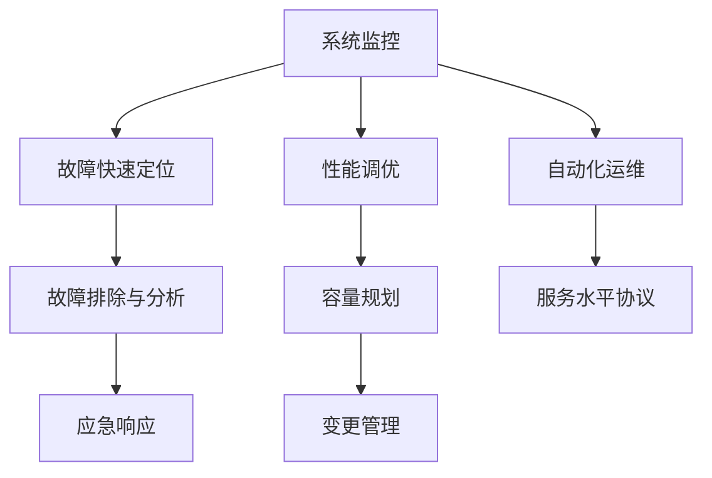

                 

## 1. 背景介绍

在现代社会，互联网已经成为基础设施，站点可靠性和服务稳定性的重要性日益凸显。随着数字化转型的加速，各行各业都越来越依赖于在线服务和数据中心的稳定运行，这使得站点可靠性工程（Site Reliability Engineering，SRE）成为了一种不可或缺的职业。SRE工程师负责监控、运维和管理大规模系统的稳定性，确保服务能够持续、高效地为用户提供价值。

### 1.1 问题由来

互联网的迅猛发展带来了巨大的挑战。高度动态的业务场景、复杂的技术栈、庞大的用户流量，都对系统的稳定性和可靠性提出了极高的要求。同时，由于系统的高度复杂性，传统的运维方式已经难以满足需求，运维效率低下、事故响应迟缓等问题频发。SRE的兴起正是为了应对这些挑战，通过运用现代工程思维和工具，提高运维效率，提升系统可靠性。

### 1.2 问题核心关键点

SRE的核心在于通过系统化的工程方法，确保在线服务的稳定运行。SRE的核心理念包括以下几个关键点：

1. **持续监控与自动化**：实时监控系统性能和状态，使用自动化工具进行日常维护和故障排除。
2. **故障快速定位与恢复**：通过快速识别和定位故障点，实施有效的应急恢复策略，最小化服务中断时间。
3. **可靠性设计与优化**：在架构设计和开发过程中，融入可靠性和容错性考量，构建健壮的系统。
4. **性能调优与优化**：通过监控和分析性能瓶颈，不断优化系统性能，提高用户体验。
5. **服务水平协议与保证**：制定明确的服务水平协议（SLA），确保服务质量符合业务需求。
6. **开发运维一体化**：推动DevOps文化，实现开发与运维的紧密协作，加速产品的迭代和交付。

这些关键点构成了SRE工程的核心框架，旨在通过系统化的方法提升系统的可靠性和运维效率。

## 2. 核心概念与联系

### 2.1 核心概念概述

为了更好地理解SRE的工作原理，本节将介绍几个密切相关的核心概念：

- **系统监控**：实时跟踪系统性能、资源使用情况等指标，及时发现潜在问题。
- **自动化运维**：通过脚本和工具自动化执行常见的运维任务，减少人工干预，提高效率。
- **应急响应流程**：建立详细的故障诊断和应急恢复流程，确保快速定位和解决故障。
- **故障排除与分析**：通过日志、告警、性能数据等工具，分析和定位故障根本原因。
- **服务水平协议（SLA）**：制定明确的SLA，确保服务质量符合业务需求，明确责任和指标。
- **容量规划与优化**：通过分析历史数据和未来需求，合理规划系统容量，优化资源利用。
- **变更管理**：制定变更计划，实施变更验证和回滚策略，确保变更过程的可靠性。

这些核心概念之间的逻辑关系可以通过以下Mermaid流程图来展示：



这个流程图展示了SRE工程的主要环节：

1. 实时监控系统性能和资源使用情况。
2. 通过监控结果快速定位故障点。
3. 分析和排除故障，实施应急恢复策略。
4. 性能优化和容量规划，确保系统稳定运行。
5. 制定并执行变更管理流程，保障系统稳定。
6. 自动化运维和SLA制定，提升运维效率和质量。

这些概念共同构成了SRE工程的整体框架，确保了系统的稳定性和可靠性。

## 3. 核心算法原理 & 具体操作步骤
### 3.1 算法原理概述

SRE工程的核心在于通过系统化的工程方法，确保在线服务的稳定运行。其核心思想是：通过实时监控、自动化运维、故障排除与分析、性能调优、变更管理等手段，构建一个高效、健壮、可靠的系统。

形式化地，假设有一个包含多个组件的系统 $S$，我们需要确保系统在运行期间能够持续提供服务。SRE工程师通过以下步骤实现目标：

1. 实时监控系统性能和资源使用情况，获取系统健康状况的数据。
2. 根据监控数据，快速定位故障点，实施应急响应策略。
3. 分析和排除故障，实施故障排除与恢复流程。
4. 通过性能调优和容量规划，优化系统性能，提高资源利用率。
5. 制定并执行变更管理流程，确保变更过程的可靠性。
6. 自动化运维和SLA制定，提升运维效率和质量。

最终目标是确保系统在各种情况下都能够稳定运行，满足业务需求。

### 3.2 算法步骤详解

SRE工程的核心算法步骤包括：

**Step 1: 系统监控**

- 使用性能监控工具，实时收集系统性能指标，如CPU使用率、内存占用、网络流量等。
- 设置告警阈值，当指标超出正常范围时，触发告警通知。
- 使用日志记录系统状态，保留故障发生时的上下文信息。

**Step 2: 故障快速定位**

- 通过监控和告警数据，快速定位故障点。
- 分析日志和性能数据，查找异常的模块或组件。
- 使用分布式追踪工具，如Zipkin、Jaeger等，追踪请求路径，定位问题源头。

**Step 3: 故障排除与分析**

- 使用故障排除工具，如ELK Stack、Grafana等，进行故障分析。
- 结合日志和性能数据，进行故障原因排查。
- 记录故障信息，建立故障库，为未来类似问题提供参考。

**Step 4: 应急响应**

- 根据故障性质，制定应急响应策略，包括立即通知相关人员、暂停相关服务、恢复备份数据等。
- 实施应急响应措施，并记录响应过程。
- 评估应急响应的效果，制定改进措施。

**Step 5: 性能调优与优化**

- 使用性能分析工具，识别系统瓶颈。
- 针对瓶颈进行优化，如调整配置、重构代码、升级硬件等。
- 定期进行性能测试和监控，确保优化措施的有效性。

**Step 6: 容量规划与优化**

- 分析历史数据和未来需求，规划系统容量。
- 使用负载均衡和弹性伸缩技术，优化资源利用。
- 实施容量测试，验证容量规划的正确性。

**Step 7: 变更管理**

- 制定变更计划，评估变更风险。
- 实施变更验证，确保变更对系统影响最小。
- 实施回滚策略，提供变更失败后的快速恢复手段。

**Step 8: 自动化运维和SLA制定**

- 开发自动化运维脚本，实现常见运维任务的自动化。
- 制定服务水平协议（SLA），明确服务质量指标。
- 定期评估SLA执行情况，提出改进建议。

### 3.3 算法优缺点

SRE工程的优点在于：

1. 提升运维效率：通过自动化运维和监控，减少了人工干预，提高了运维效率。
2. 快速故障定位与恢复：通过快速定位和故障排除流程，最小化服务中断时间。
3. 系统可靠性提升：通过可靠性设计和性能优化，构建健壮的系统。
4. 变更管理保证：通过规范的变更流程，确保变更过程的可靠性。
5. 服务质量保障：通过SLA制定和监控，确保服务质量符合业务需求。

同时，SRE工程也存在一些局限性：

1. 复杂性高：系统越复杂，监控和运维的难度越大，需要高度专业的知识和技能。
2. 技术栈多：需要掌握多种监控和运维工具，学习成本较高。
3. 应急响应压力大：在突发故障时，需要快速响应，SRE工程师的工作压力较大。
4. 成本投入高：高水平SRE团队需要较高的薪资和培训成本，增加了运营成本。
5. 流程规范难以落实：复杂流程需要高度规范和协作，执行难度较大。

尽管存在这些局限性，但SRE的工程思维和工具方法在实践中已经被证明是有效的，能够显著提升系统的可靠性和运维效率。

### 3.4 算法应用领域

SRE工程在各种大型系统中都得到了广泛应用，主要涵盖以下几个领域：

1. **互联网服务**：如电子商务、社交网络、在线视频等。这些服务对用户稳定性和服务质量有极高的要求。
2. **金融服务**：如银行、证券、保险等。这些服务对数据准确性和交易稳定性有严格要求。
3. **医疗服务**：如电子病历、医疗影像等。这些服务对系统可靠性和隐私保护有高标准。
4. **政府服务**：如政府网站、电子政务等。这些服务需要确保24小时不间断服务。
5. **物联网（IoT）**：如智能家居、工业物联网等。这些系统需要对传感器和设备的稳定运行进行监控。

除了上述领域，SRE工程在其他高可用性、高性能的系统中也有广泛应用，如数据中心、云计算平台、大型分布式系统等。

## 4. 数学模型和公式 & 详细讲解
### 4.1 数学模型构建

本节将使用数学语言对SRE工程的核心算法进行更加严格的刻画。

假设有一个包含 $N$ 个组件的系统 $S$，其可靠性 $R$ 定义为系统在一定时间内能够持续提供服务的概率。我们可以用以下数学模型来描述SRE工程的主要流程：

1. **系统监控模型**：假设系统有 $M$ 个监控指标，每个指标的状态为正常（1）或异常（0）。系统监控的目标是实时监测这些指标，及时发现异常情况。
2. **故障快速定位模型**：假设系统故障点为 $F$，通过监控和日志数据，能够快速定位到故障点 $f_i$。
3. **故障排除与分析模型**：假设故障排除与分析流程为 $P$，故障排除的时间为 $t_P$。
4. **应急响应模型**：假设应急响应流程为 $E$，应急响应的时间为 $t_E$。
5. **性能调优与优化模型**：假设性能调优的时间为 $t_O$。
6. **容量规划与优化模型**：假设容量规划的时间为 $t_C$。
7. **变更管理模型**：假设变更验证的时间为 $t_V$。
8. **自动化运维模型**：假设自动化运维的时间为 $t_A$。
9. **SLA制定与监控模型**：假设SLA监控的时间为 $t_S$。

通过以上模型，我们可以定义系统的可靠性模型为：

$$
R = R_0 \times R_M \times R_P \times R_E \times R_O \times R_C \times R_V \times R_A \times R_S
$$

其中 $R_0$ 为系统初始可靠性，$R_M$ 为监控可靠性，$R_P$ 为故障定位和排除可靠性，$R_E$ 为应急响应可靠性，$R_O$ 为性能调优可靠性，$R_C$ 为容量规划可靠性，$R_V$ 为变更管理可靠性，$R_A$ 为自动化运维可靠性，$R_S$ 为SLA监控可靠性。

### 4.2 公式推导过程

为了更好地理解可靠性模型的构建，我们以二元系统为例进行推导。

假设系统有两个组件 $A$ 和 $B$，每个组件的可靠性分别为 $R_A$ 和 $R_B$。系统的可靠性 $R$ 可以通过以下公式计算：

$$
R = R_A \times R_B
$$

这是因为，系统可靠性的计算是基于组件可靠性的乘积。如果两个组件都可靠，那么整个系统也是可靠的。

进一步地，如果系统有 $N$ 个组件，那么系统的可靠性 $R$ 可以通过以下公式计算：

$$
R = \prod_{i=1}^N R_i
$$

其中 $R_i$ 为第 $i$ 个组件的可靠性。

在实际应用中，系统可靠性 $R$ 的计算还需要考虑故障排除、性能调优、容量规划等环节的可靠性。这些环节的可靠性可以通过引入时间因素进行建模，如 $R_E = 1 - P(E)$，其中 $P(E)$ 为应急响应失败的概率。

### 4.3 案例分析与讲解

以电商平台为例，分析SRE工程的应用过程：

1. **系统监控**：使用Grafana等工具，实时监控网站性能、服务器负载、数据库连接等指标。当服务器负载过高时，触发告警通知。
2. **故障快速定位**：通过日志分析和请求追踪，定位到导致系统故障的SQL语句。
3. **故障排除与分析**：使用ELK Stack等工具，分析日志和请求数据，发现数据库连接超时导致的问题。
4. **应急响应**：立即通知运维团队，暂停相关服务，迁移数据到备份数据库。
5. **性能调优**：分析性能瓶颈，优化SQL查询，增加服务器资源。
6. **容量规划**：根据历史数据和未来需求，规划网站容量，增加云服务器。
7. **变更管理**：实施新版本的部署，进行回滚测试，确保新版本无故障。
8. **自动化运维**：使用Ansible等工具，自动化执行系统配置和部署。
9. **SLA制定与监控**：定义SLA，确保网站响应时间不超过10秒，每天监控SLA执行情况，分析性能瓶颈。

通过以上步骤，电商平台的SRE工程师确保了系统的稳定性和可靠性，保障了用户体验。

## 5. 项目实践：代码实例和详细解释说明
### 5.1 开发环境搭建

在进行SRE实践前，我们需要准备好开发环境。以下是使用Python进行Grafana和ELK Stack开发的环境配置流程：

1. 安装Anaconda：从官网下载并安装Anaconda，用于创建独立的Python环境。

2. 创建并激活虚拟环境：
```bash
conda create -n elk-stack python=3.8 
conda activate elk-stack
```

3. 安装Elastic Stack：从官网下载并安装Elastic Stack，包含Elasticsearch、Logstash和Kibana。

4. 安装Grafana：从官网下载并安装Grafana。

5. 配置ELK Stack与Grafana：安装Kibana的Elasticsearch插件，使用Kibana配置Elasticsearch和Logstash。

6. 配置Grafana的数据源：使用Grafana的Prometheus数据源插件，连接Prometheus。

完成上述步骤后，即可在`elk-stack`环境中开始SRE实践。

### 5.2 源代码详细实现

这里我们以监控系统性能为例，给出使用Python进行Grafana开发的代码实现。

首先，定义监控任务和指标：

```python
from prometheus_client import CollectorRegistry, Gauge, Counter, Histogram

# 定义监控指标
prometheus_registry = CollectorRegistry()
cpu_usage = Gauge('cpu_usage', 'CPU使用率')
disk_usage = Gauge('disk_usage', '磁盘使用率')
memory_usage = Gauge('memory_usage', '内存使用率')

# 初始化监控指标
cpu_usage.set(0)
disk_usage.set(0)
memory_usage.set(0)

# 定义计数器和直方图
request_count = Counter('request_count', '请求次数')
request_duration = Histogram('request_duration', '请求持续时间')
```

然后，定义监控数据收集器：

```python
import os
import psutil
import time

def collect_data():
    # 获取CPU使用率
    cpu_percent = psutil.cpu_percent(interval=1)
    cpu_usage.set(cpu_percent)
    
    # 获取磁盘使用率
    disk_usage.set(psutil.disk_usage('/').percent)
    
    # 获取内存使用率
    memory_percent = psutil.virtual_memory().percent
    memory_usage.set(memory_percent)
    
    # 统计请求次数和持续时间
    request_count.inc()
    request_duration.observe(time.time() - start_time)

# 定时收集数据
while True:
    collect_data()
    time.sleep(5)
```

最后，启动Grafana仪表盘：

```python
from flask import Flask, render_template

app = Flask(__name__)

@app.route('/')
def index():
    return render_template('index.html')

if __name__ == '__main__':
    app.run(host='0.0.0.0', port=3000)
```

以上就是使用Python进行Grafana监控系统性能的完整代码实现。可以看到，通过简单的代码实现，我们能够实时监控CPU使用率、磁盘使用率和内存使用率，并通过Grafana进行可视化展示。

### 5.3 代码解读与分析

让我们再详细解读一下关键代码的实现细节：

**定义监控指标**：
- 使用Prometheus客户端库定义了三个Gauge指标，分别用于监控CPU使用率、磁盘使用率和内存使用率。
- 使用Counter和Histogram分别统计请求次数和持续时间。

**数据收集器**：
- 使用psutil库获取CPU使用率、磁盘使用率和内存使用率。
- 使用Counter和Histogram统计请求次数和持续时间。
- 使用定时器循环，每5秒收集一次数据。

**Grafana仪表盘**：
- 使用Flask搭建一个简单的Web服务，监听请求并返回HTML模板。
- 在模板中引用Grafana的js和css文件，确保Grafana仪表盘能够正常显示。
- 启动Flask服务，监听指定端口。

通过这个例子，我们可以清晰地看到如何使用Python和Prometheus进行系统性能监控，并结合Grafana进行可视化展示。开发者可以进一步扩展这个框架，添加更多监控指标和告警策略，构建全面的监控体系。

## 6. 实际应用场景
### 6.1 智能运维系统

智能运维系统是SRE工程的核心应用之一，通过自动化和智能化手段，提高运维效率，提升系统稳定性。

在智能运维系统中，SRE工程师通常会使用以下工具和技术：

1. **自动告警系统**：使用Prometheus和Grafana等工具，实时监控系统性能，设置告警阈值，及时通知运维团队。
2. **自动故障定位**：使用ELK Stack和Splunk等工具，通过日志分析和请求追踪，快速定位故障点。
3. **自动化运维脚本**：使用Ansible和SaltStack等工具，自动化执行系统配置和部署任务，减少人工干预。
4. **自动化测试和验证**：使用Jenkins和Travis CI等工具，自动化执行测试和验证任务，确保代码质量。
5. **变更管理工具**：使用GitLab和Jira等工具，制定变更计划，实施变更验证和回滚策略，保障变更过程的可靠性。

通过智能运维系统，SRE工程师能够快速响应系统故障，自动化执行运维任务，提高运维效率，保障系统稳定。

### 6.2 应急响应平台

应急响应平台是SRE工程的重要组成部分，用于快速响应和处理系统故障。

在应急响应平台中，SRE工程师通常会使用以下工具和技术：

1. **事故管理工具**：使用PagerDuty和Oncall.io等工具，建立事故响应流程，明确责任和响应时间。
2. **故障排除工具**：使用ELK Stack和New Relic等工具，通过日志分析和性能监控，快速定位和排除故障。
3. **协作平台**：使用Slack和Microsoft Teams等工具，建立实时通信渠道，促进团队协作。
4. **应急预案**：制定详细的应急预案，明确故障排除和应急响应的步骤。
5. **自动化运维脚本**：使用Ansible和SaltStack等工具，自动化执行应急响应任务，减少人工干预。

通过应急响应平台，SRE工程师能够快速定位和排除故障，自动化执行应急响应任务，最小化服务中断时间，保障系统稳定。

### 6.3 性能优化工具

性能优化工具是SRE工程中的重要组成部分，用于识别和优化系统性能瓶颈。

在性能优化工具中，SRE工程师通常会使用以下工具和技术：

1. **性能监控工具**：使用Grafana和New Relic等工具，实时监控系统性能和资源使用情况。
2. **性能分析工具**：使用APM工具，如Jaeger和Zipkin等，追踪请求路径，识别性能瓶颈。
3. **性能调优工具**：使用Amdopt和Google Cloud Profiler等工具，优化系统性能，提升资源利用率。
4. **性能测试工具**：使用JMeter和LoadRunner等工具，进行性能测试，评估系统负载。
5. **容量规划工具**：使用AWS CloudWatch和Google Cloud Monitoring等工具，进行容量规划，优化资源利用。

通过性能优化工具，SRE工程师能够识别和优化系统性能瓶颈，提升系统性能和资源利用率，保障系统稳定。

### 6.4 未来应用展望

随着SRE工程的不断发展，未来的应用场景将更加丰富，涵盖以下领域：

1. **边缘计算**：在边缘设备上部署SRE系统，确保网络边缘节点的稳定运行。
2. **量子计算**：在量子计算机上部署SRE系统，保障量子算法的可靠性和性能。
3. **智能合约**：在区块链平台上部署SRE系统，确保智能合约的稳定性和安全性。
4. **物联网（IoT）**：在智能家居、工业物联网等系统中部署SRE系统，保障设备和系统的稳定运行。
5. **移动端应用**：在移动端应用中部署SRE系统，确保应用稳定性和用户体验。
6. **云原生应用**：在云原生架构中部署SRE系统，保障容器化和微服务架构的稳定性和可靠性。

SRE工程将与未来的技术趋势紧密结合，为各种复杂系统的稳定运行提供坚实保障。

## 7. 工具和资源推荐
### 7.1 学习资源推荐

为了帮助开发者系统掌握SRE的理论基础和实践技巧，这里推荐一些优质的学习资源：

1. **《站点可靠性工程》（Site Reliability Engineering）**：这是一本关于SRE的经典书籍，详细介绍了SRE的核心概念、工具和实践方法。
2. **《DevOps 2.0》**：这本书介绍了DevOps文化、工具和实践，对于理解SRE与DevOps的融合非常重要。
3. **Coursera的SRE课程**：由Google和Pivotal联合开发的SRE课程，涵盖SRE的理论基础和实践方法。
4. **Kubernetes官方文档**：Kubernetes是云原生架构的重要组成部分，学习Kubernetes能够更好地理解SRE在云原生系统中的应用。
5. **Prometheus官方文档**：Prometheus是SRE中常用的监控工具，学习Prometheus能够更好地理解系统监控和告警的实现原理。

通过对这些资源的学习实践，相信你一定能够快速掌握SRE的精髓，并用于解决实际的系统稳定性问题。

### 7.2 开发工具推荐

高效的开发离不开优秀的工具支持。以下是几款用于SRE开发的常用工具：

1. **Prometheus**：实时监控系统性能和资源使用情况，提供告警和查询功能。
2. **Grafana**：可视化监控数据，提供仪表盘和告警功能。
3. **ELK Stack**：集中管理日志数据，提供日志分析和告警功能。
4. **New Relic**：实时监控应用性能和资源使用情况，提供性能分析和告警功能。
5. **PagerDuty**：事故管理工具，提供事故响应流程和告警功能。
6. **Ansible**：自动化运维工具，支持脚本和配置管理。
7. **Jenkins**：自动化测试和部署工具，支持持续集成和持续交付。

合理利用这些工具，可以显著提升SRE任务的开发效率，加快创新迭代的步伐。

### 7.3 相关论文推荐

SRE工程的研究源于学界的持续研究。以下是几篇奠基性的相关论文，推荐阅读：

1. **《站点可靠性工程》**：由Betsy Beyer、Liz Robillard和Catherine J. Puressy撰写，介绍了SRE的核心概念和实践方法。
2. **《DevOps的实践》**：由Patrick Debois和Dana Nau撰写，详细介绍了DevOps文化、工具和实践。
3. **《自动化测试和持续集成》**：由Christoph Ammann撰写，介绍了自动化测试和持续集成的理论基础和实践方法。
4. **《大规模分布式系统的可靠性》**：由Andreas Zeller和Sangho Kim撰写，介绍了大规模分布式系统的可靠性设计方法。
5. **《云原生架构》**：由Richard Vodhana撰写，介绍了云原生架构的核心概念和设计原则。

这些论文代表了大规模系统可靠性的前沿研究，通过学习这些前沿成果，可以帮助研究者把握学科前进方向，激发更多的创新灵感。

## 8. 总结：未来发展趋势与挑战

### 8.1 总结

本文对SRE工程的核心算法进行了全面系统的介绍。首先阐述了SRE工程的背景和意义，明确了系统稳定性的重要性。其次，从原理到实践，详细讲解了SRE的核心算法步骤，给出了SRE任务开发的完整代码实例。同时，本文还广泛探讨了SRE工程在智能运维、应急响应、性能优化等领域的实际应用场景，展示了SRE工程的巨大潜力。

通过本文的系统梳理，可以看到，SRE工程的核心在于通过系统化的工程方法，确保在线服务的稳定运行。SRE工程师通过实时监控、故障排除、自动化运维等手段，构建了高效、健壮、可靠的系统。SRE工程不仅在互联网服务、金融服务、医疗服务等领域得到了广泛应用，还在智能运维、应急响应、性能优化等方向不断拓展，为构建可靠、高效、可扩展的系统提供了坚实保障。

### 8.2 未来发展趋势

展望未来，SRE工程将呈现以下几个发展趋势：

1. **自动化与智能化**：SRE工程将更多地利用人工智能和大数据分析技术，自动化和智能化程度将不断提高。
2. **云原生与微服务**：随着云原生架构的普及，SRE工程将更多地应用于微服务架构和容器化系统。
3. **分布式与边缘计算**：随着边缘计算的兴起，SRE工程将更多地应用于网络边缘节点和分布式系统。
4. **区块链与智能合约**：随着区块链技术的发展，SRE工程将更多地应用于智能合约和分布式账本系统。
5. **物联网（IoT）与边缘设备**：随着物联网的普及，SRE工程将更多地应用于智能家居、工业物联网等系统。
6. **量子计算与人工智能**：随着量子计算和大数据技术的发展，SRE工程将更多地应用于量子计算和大数据系统。

这些趋势凸显了SRE工程的广阔前景，SRE工程师需要不断学习新技术，掌握新工具，才能适应未来的挑战和机遇。

### 8.3 面临的挑战

尽管SRE工程已经取得了显著成就，但在迈向更加智能化、普适化应用的过程中，它仍面临诸多挑战：

1. **技术栈多样性**：系统复杂多样，需要掌握多种技术栈和工具，学习成本较高。
2. **监控和告警复杂性**：系统性能和资源使用情况复杂，监控和告警难度大。
3. **应急响应压力**：突发故障需要快速响应，SRE工程师的工作压力较大。
4. **系统安全性**：复杂系统易受攻击，保障系统安全性和可靠性难度大。
5. **资源消耗高**：高水平SRE团队需要较高的薪资和培训成本，增加了运营成本。
6. **流程规范难落实**：复杂流程需要高度规范和协作，执行难度较大。

尽管存在这些挑战，但SRE的工程思维和工具方法在实践中已经被证明是有效的，能够显著提升系统的可靠性和运维效率。

### 8.4 研究展望

面对SRE工程所面临的挑战，未来的研究需要在以下几个方面寻求新的突破：

1. **自动化与智能化**：开发更多自动化工具，引入人工智能和大数据分析技术，提升监控和故障排除的智能化程度。
2. **云原生与微服务**：推动DevOps文化，实现开发与运维的一体化，加速产品的迭代和交付。
3. **分布式与边缘计算**：研究分布式系统的高可用性和可靠性，优化边缘计算的资源利用和性能调优。
4. **区块链与智能合约**：研究智能合约的可靠性和安全性，优化区块链系统的性能和稳定性。
5. **物联网（IoT）与边缘设备**：研究物联网设备的可靠性和安全性，优化边缘计算的资源利用和性能调优。
6. **量子计算与人工智能**：研究量子计算和大数据系统的可靠性和安全性，优化系统性能和资源利用。

这些研究方向的探索，必将引领SRE工程迈向更高的台阶，为构建安全、可靠、可扩展的系统提供坚实保障。面向未来，SRE工程师需要不断学习新技术，掌握新工具，才能适应未来的挑战和机遇。

## 9. 附录：常见问题与解答

**Q1：SRE工程师和DevOps工程师有什么区别？**

A: SRE工程师主要关注系统的稳定性和可靠性，通过系统化的工程方法确保系统持续运行。而DevOps工程师主要关注软件开发生命周期和自动化部署，通过持续集成和持续交付提升软件交付效率。SRE和DevOps的融合，是实现高可用性、高可靠性的关键。

**Q2：SRE工程的挑战主要有哪些？**

A: SRE工程的挑战主要包括：技术栈多样性、监控和告警复杂性、应急响应压力、系统安全性、资源消耗高、流程规范难落实等。解决这些挑战需要系统化的工程思维和工具支持，同时需要不断学习和优化。

**Q3：SRE工程有哪些成功案例？**

A: SRE工程在多个大型系统中都得到了广泛应用，例如Google、Facebook、Amazon等。这些公司通过SRE工程，实现了高可用性、高可靠性的系统，提升了用户体验和运营效率。

**Q4：SRE工程如何与DevOps融合？**

A: SRE和DevOps的融合需要实现开发与运维的一体化，包括自动化运维、持续集成和持续交付、变更管理、性能优化等。通过DevOps文化，可以实现快速迭代和交付，同时通过SRE工程，确保系统的稳定性和可靠性。

通过本文的系统梳理，可以看到，SRE工程的核心在于通过系统化的工程方法，确保在线服务的稳定运行。SRE工程师通过实时监控、故障排除、自动化运维等手段，构建了高效、健壮、可靠的系统。SRE工程不仅在互联网服务、金融服务、医疗服务等领域得到了广泛应用，还在智能运维、应急响应、性能优化等方向不断拓展，为构建可靠、高效、可扩展的系统提供了坚实保障。

总之，SRE工程是构建高可用性、高可靠性的重要手段，未来必将与更多前沿技术融合，推动系统稳定性、可靠性的不断提升。

---

作者：禅与计算机程序设计艺术 / Zen and the Art of Computer Programming

