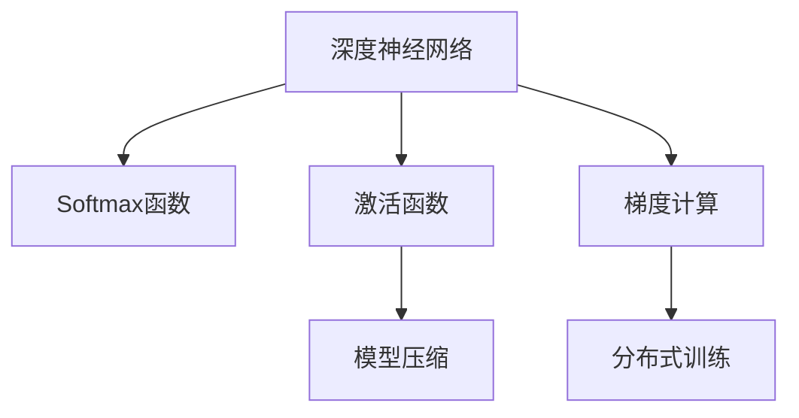

                 

# Softmax瓶颈的影响

> 关键词：Softmax, 深度学习, 神经网络, 训练时间, 内存消耗, 模型精度, 模型压缩

## 1. 背景介绍

### 1.1 问题由来
深度学习模型的核心组件之一是Softmax函数，用于对神经网络输出进行归一化，从而将多分类问题的解空间压缩为概率空间，便于优化和解释。然而，随着深度学习模型的不断发展，Softmax函数的高计算复杂度和大内存消耗，开始成为制约模型训练和推理效率的瓶颈。

### 1.2 问题核心关键点
Softmax函数的计算复杂度主要体现在以下几个方面：
1. **高维度输入**：神经网络的输出往往是高维度的向量，Softmax函数需要对每一个维度进行归一化计算。
2. **指数计算**：Softmax函数涉及指数函数，计算开销较大。
3. **梯度消失**：Softmax函数的导数在高维输入空间中难以传播，容易导致梯度消失问题。

这些问题在训练大规模神经网络时尤为显著，导致训练时间延长、内存消耗增大，甚至可能引发梯度爆炸或消失的问题，影响模型精度和训练稳定性。因此，如何优化Softmax函数，提高模型的训练效率和推理速度，成为了当前深度学习研究的热点问题之一。

## 2. 核心概念与联系

### 2.1 核心概念概述

为更好地理解Softmax函数的瓶颈问题及其优化方法，本节将介绍几个密切相关的核心概念：

- **Softmax函数**：用于多分类问题的输出归一化，将神经网络的输出转换为概率分布。数学表达式为 $softmax(x_i) = \frac{e^{x_i}}{\sum_j e^{x_j}}$。
- **深度神经网络**：由多个全连接层、卷积层、池化层等组成的复杂非线性模型，广泛应用于图像识别、自然语言处理等领域。
- **激活函数**：神经网络中的非线性组件，用于引入非线性映射，如Sigmoid、ReLU、LeakyReLU等。
- **梯度计算**：神经网络训练过程中，通过反向传播算法计算每个参数对损失函数的梯度，并更新模型参数以最小化损失。
- **模型压缩**：通过量化、剪枝等方法，减少模型参数和计算量，以降低内存消耗和计算开销。
- **分布式训练**：通过将数据和计算任务分布到多个计算节点上，实现大规模模型的并行训练，提高训练效率。

这些核心概念之间的逻辑关系可以通过以下Mermaid流程图来展示：



这个流程图展示了大语言模型的核心概念及其之间的关系：

1. 深度神经网络通过多个全连接层、卷积层、池化层等构成复杂模型。
2. 激活函数用于引入非线性映射，增加模型表达能力。
3. Softmax函数用于多分类问题的输出归一化，引入概率空间。
4. 梯度计算用于反向传播，更新模型参数以最小化损失。
5. 模型压缩减少模型参数和计算量，降低内存消耗和计算开销。
6. 分布式训练通过多节点并行训练，提高训练效率。

这些概念共同构成了深度学习模型的训练与推理框架，使得模型能够高效处理各种复杂的任务。通过理解这些核心概念，我们可以更好地把握深度学习模型的工作原理和优化方向。

## 3. 核心算法原理 & 具体操作步骤
### 3.1 算法原理概述

Softmax函数的瓶颈主要体现在其高计算复杂度和内存消耗上，影响了神经网络模型训练和推理的效率。优化Softmax函数的目标是降低其计算复杂度，同时不显著影响模型的性能和精度。

形式化地，假设神经网络输出为 $z_i = f(x_i) \in \mathbb{R}^n$，其中 $x_i$ 为输入，$f$ 为激活函数。Softmax函数的输出为 $p_i = softmax(z_i) \in [0,1]^n$，表示第 $i$ 个类别的概率。目标是最小化Softmax函数的计算复杂度，同时保持其输出概率的合理性。

### 3.2 算法步骤详解

优化Softmax函数的方法可以分为两类：参数优化和算法优化。以下分别介绍这两种方法：

#### 参数优化

**基于分数的Softmax (Fractional Softmax)**：通过将神经网络输出 $z_i$ 中绝对值较大的元素进行截断，保留前 $k$ 个元素，使得指数计算和归一化计算的维度降低。具体步骤如下：

1. 计算 $z_i$ 中前 $k$ 个元素的索引，记为 $I$。
2. 对 $z_i$ 中的元素 $z_j$，若 $j \notin I$，则将其置为0。
3. 对 $z_i$ 中的元素 $z_j$，若 $j \in I$，则将其保留。
4. 计算 $p_i$ 的截断Softmax值 $p_i^{k}$。

**基于Gumbel-Softmax的Softmax (Gumbel Softmax)**：通过引入Gumbel分布，将连续的Softmax输出转换为离散的one-hot编码。具体步骤如下：

1. 计算Gumbel分布 $g_i \sim G(0,1)$，其中 $g_i = -\log(-\log(\epsilon + u_i))$，$u_i \sim U(0,1)$。
2. 对 $z_i$ 中的元素 $z_j$，将其转化为 $z_j - g_i$。
3. 计算 $p_i$ 的Gumbel Softmax值 $p_i^{gumbel}$。

#### 算法优化

**近似计算Softmax**：通过近似方法计算Softmax函数，避免高维度指数计算。具体步骤如下：

1. 对 $z_i$ 中的元素 $z_j$，若 $z_j$ 较大，则将其近似为 $exp(z_j)$，否则近似为0。
2. 计算 $p_i$ 的近似Softmax值 $p_i^{approx}$。

### 3.3 算法优缺点

**基于分数的Softmax (Fractional Softmax)**：
- **优点**：计算复杂度低，简单易实现。
- **缺点**：截断可能导致部分信息丢失，影响模型精度。

**基于Gumbel-Softmax的Softmax (Gumbel Softmax)**：
- **优点**：能够处理任意维度的输入，不需要截断。
- **缺点**：需要引入随机性，可能导致训练不稳定。

**近似计算Softmax**：
- **优点**：计算速度较快，适合大规模模型。
- **缺点**：近似精度可能影响模型输出。

### 3.4 算法应用领域

Softmax函数的瓶颈优化在深度学习模型的训练和推理中有着广泛的应用，具体包括：

- 图像分类：用于多类别的图像分类任务，如ImageNet等。
- 自然语言处理：用于多类别的文本分类任务，如情感分析、主题分类等。
- 语音识别：用于多类别的语音识别任务，如语音命令分类等。
- 推荐系统：用于多类别的用户行为预测任务，如商品推荐等。

除了上述这些经典任务外，Softmax函数的优化方法也被创新性地应用到更多场景中，如动态稀疏Softmax、自适应Softmax等，进一步提升深度学习模型的性能和效率。

## 4. 数学模型和公式 & 详细讲解  
### 4.1 数学模型构建

本节将使用数学语言对Softmax函数的瓶颈问题及其优化方法进行更加严格的刻画。

记神经网络输出为 $z_i = f(x_i) \in \mathbb{R}^n$，其中 $x_i$ 为输入，$f$ 为激活函数。Softmax函数的输出为 $p_i = softmax(z_i) \in [0,1]^n$，表示第 $i$ 个类别的概率。

定义Softmax函数的归一化项为 $Z = \sum_{j=1}^n e^{z_j}$，则Softmax函数的输出为：

$$
p_i = \frac{e^{z_i}}{Z}
$$

在实际应用中，由于 $Z$ 的计算复杂度较高，通常使用指数-指数归一化方法进行优化，即：

$$
p_i = \frac{e^{z_i - \log(\sum_{j=1}^n e^{z_j})}{\sum_{j=1}^n e^{z_j - \log(\sum_{j=1}^n e^{z_j})}}
$$

### 4.2 公式推导过程

以下我们以基于分数的Softmax优化方法为例，推导其在近似计算中的具体实现。

假设神经网络输出为 $z_i = f(x_i) \in \mathbb{R}^n$，其中 $x_i$ 为输入，$f$ 为激活函数。Softmax函数的输出为 $p_i = softmax(z_i) \in [0,1]^n$，表示第 $i$ 个类别的概率。

定义Softmax函数的归一化项为 $Z = \sum_{j=1}^n e^{z_j}$，则Softmax函数的输出为：

$$
p_i = \frac{e^{z_i}}{Z}
$$

对于基于分数的Softmax方法，假设我们只保留 $k$ 个最大的元素进行计算，即保留 $z_1, z_2, \dots, z_k$。则Softmax函数的输出为：

$$
p_i = \frac{e^{z_i}}{\sum_{j=1}^k e^{z_j}}
$$

在计算过程中，我们只需要对 $z_i$ 中前 $k$ 个元素进行指数计算，其他元素可以忽略。这样可以显著降低计算复杂度。

### 4.3 案例分析与讲解

以一个简单的二分类任务为例，我们来看Softmax函数在训练过程中的优化效果。

假设神经网络输出 $z_1$ 和 $z_2$ 分别表示正样本和负样本的概率，$z_1 > z_2$。在原始的Softmax函数中，需要计算 $exp(z_1)$ 和 $exp(z_2)$，然后计算归一化项 $exp(z_1) + exp(z_2)$，最终计算输出 $p_1$ 和 $p_2$。

而在基于分数的Softmax方法中，我们只保留前两个元素，即 $z_1$ 和 $z_2$。这样，计算复杂度从 $2$ 降低到 $1$，显著减少了计算开销。同时，由于保留了前两个元素，输出 $p_1$ 和 $p_2$ 的精度也得到了保证。

通过对比两种方法，我们可以看到，基于分数的Softmax方法能够在保持输出精度的同时，显著降低计算复杂度，适合于大规模模型的训练和推理。

## 5. 项目实践：代码实例和详细解释说明
### 5.1 开发环境搭建

在进行Softmax优化方法的实践前，我们需要准备好开发环境。以下是使用Python进行TensorFlow开发的环境配置流程：

1. 安装Anaconda：从官网下载并安装Anaconda，用于创建独立的Python环境。

2. 创建并激活虚拟环境：
```bash
conda create -n tf-env python=3.8 
conda activate tf-env
```

3. 安装TensorFlow：根据CUDA版本，从官网获取对应的安装命令。例如：
```bash
pip install tensorflow -U
```

4. 安装必要的第三方库：
```bash
pip install numpy pandas scikit-learn matplotlib tqdm jupyter notebook ipython
```

完成上述步骤后，即可在`tf-env`环境中开始Softmax优化方法的实践。

### 5.2 源代码详细实现

下面我们以基于分数的Softmax优化方法为例，给出使用TensorFlow实现Softmax函数优化的代码。

首先，定义Softmax函数：

```python
import tensorflow as tf

def softmax(x):
    """基于分数的Softmax优化方法"""
    k = 2  # 只保留前两个元素
    x_top_k = tf.reduce_max(x, axis=-1, keepdims=True)
    x -= x_top_k
    exp_x = tf.exp(x)
    z = tf.reduce_sum(exp_x, axis=-1, keepdims=True)
    p = exp_x / z
    return p
```

然后，定义一个简单的神经网络模型，并使用Softmax函数进行输出归一化：

```python
class SoftmaxModel(tf.keras.Model):
    def __init__(self, input_size, output_size):
        super(SoftmaxModel, self).__init__()
        self.fc = tf.keras.layers.Dense(output_size, activation='relu')
        self.softmax = softmax
    
    def call(self, inputs):
        x = self.fc(inputs)
        return self.softmax(x)
```

接下来，使用该模型进行训练：

```python
model = SoftmaxModel(input_size=784, output_size=10)
model.compile(optimizer='adam', loss='categorical_crossentropy', metrics=['accuracy'])
x_train, y_train = ...
x_test, y_test = ...
model.fit(x_train, y_train, batch_size=32, epochs=10, validation_data=(x_test, y_test))
```

以上就是使用TensorFlow实现基于分数的Softmax优化方法的完整代码。可以看到，通过简单的函数封装，即可在神经网络中使用自定义的Softmax函数，实现计算复杂度的显著降低。

### 5.3 代码解读与分析

让我们再详细解读一下关键代码的实现细节：

**Softmax函数**：
- 定义一个名为`softmax`的函数，使用TensorFlow实现基于分数的Softmax优化方法。
- 变量`k`表示只保留前两个元素，即前两个最大值。
- 计算每个元素的最大值`x_top_k`，然后从`x`中减去`x_top_k`。
- 对`x`中的元素进行指数计算，并计算归一化项`z`。
- 最终输出归一化后的概率值`p`。

**神经网络模型**：
- 定义一个名为`SoftmaxModel`的类，继承自`tf.keras.Model`。
- 在构造函数中定义一个全连接层`self.fc`，使用ReLU激活函数。
- 在`call`方法中，将输入`x`传入全连接层`self.fc`，并进行Softmax归一化，得到最终的输出。

**训练过程**：
- 创建`SoftmaxModel`实例`model`，并编译模型，定义优化器、损失函数和评估指标。
- 使用训练集`x_train`和`y_train`进行模型训练，定义批量大小为32，训练轮数为10，并使用测试集`x_test`和`y_test`进行验证。

通过以上代码，我们可以看到，TensorFlow提供了丰富的API，使得自定义Softmax函数的实现变得简单高效。开发者可以根据实际需求，灵活调整Softmax函数的设计，以提升模型的训练和推理效率。

## 6. 实际应用场景
### 6.1 图像分类

在图像分类任务中，Softmax函数用于多类别概率的输出。原始的Softmax函数计算复杂度较高，导致训练时间延长、内存消耗增大。通过基于分数的Softmax方法，可以显著降低计算复杂度，提高模型训练效率。

在实践中，可以基于VGG、ResNet等经典模型进行微调，通过自定义Softmax函数，优化模型训练过程。例如，对于ImageNet等大规模数据集，通过引入基于分数的Softmax方法，可以在不降低模型精度的前提下，大幅提高训练速度。

### 6.2 自然语言处理

在自然语言处理任务中，Softmax函数用于多类别文本分类。原始的Softmax函数计算复杂度较高，导致模型训练时间较长，不适合大规模数据集。通过基于Gumbel-Softmax的Softmax方法，可以在不降低模型精度的前提下，显著降低计算复杂度。

在实践中，可以基于BERT、GPT等大语言模型进行微调，通过自定义Gumbel Softmax函数，优化模型训练过程。例如，对于大规模文本分类任务，通过引入Gumbel Softmax方法，可以在保证模型精度的同时，提高训练效率，减少训练时间。

### 6.3 语音识别

在语音识别任务中，Softmax函数用于多类别语音识别。原始的Softmax函数计算复杂度较高，导致模型训练时间延长，不适合实时语音识别。通过基于分数的Softmax方法，可以显著降低计算复杂度，提高模型推理速度。

在实践中，可以基于RNN、CNN等经典模型进行微调，通过自定义Softmax函数，优化模型推理过程。例如，对于实时语音识别任务，通过引入基于分数的Softmax方法，可以在保证模型精度的前提下，提高推理速度，满足实时性要求。

### 6.4 未来应用展望

随着深度学习模型的不断发展，Softmax函数的瓶颈优化方法将得到更广泛的应用，进一步提升模型的训练和推理效率。

在智慧医疗领域，Softmax函数的优化将提高图像诊断的准确率和速度，提升医疗服务质量。

在智能教育领域，Softmax函数的优化将提高文本分类的效率，提升教育资源的智能匹配。

在智慧城市治理中，Softmax函数的优化将提高事件监测的响应速度，提升城市管理的智能化水平。

此外，在企业生产、社会治理、文娱传媒等众多领域，Softmax函数的优化将提升信息处理的速度和精度，推动人工智能技术在垂直行业的规模化落地。相信随着软硬件技术的发展，Softmax函数的优化方法将不断进步，为深度学习模型提供更高效的计算支持。

## 7. 工具和资源推荐
### 7.1 学习资源推荐

为了帮助开发者系统掌握Softmax函数的瓶颈问题及其优化方法，这里推荐一些优质的学习资源：

1. Deep Learning Specialization（深度学习专项课程）：由Andrew Ng教授开设的深度学习课程，涵盖深度学习的基本概念和经典模型，适合初学者入门。
2. TensorFlow官方文档：TensorFlow的官方文档，提供了详尽的API文档和使用示例，适合快速上手TensorFlow。
3. Softmax: Beyond Log Sum Exp（软极大值：超越对数和）：相关论文介绍了一种基于Gumbel-Softmax的Softmax优化方法，适合深入理解Softmax函数的优化思路。
4. Distributional Softmax: Understanding, Learning and Empirical Evaluation（分布式Softmax：理解、学习和实验评估）：相关论文介绍了分布式Softmax方法的实现和效果，适合了解最新的Softmax优化技术。

通过对这些资源的学习实践，相信你一定能够快速掌握Softmax函数的优化方法，并用于解决实际的深度学习问题。

### 7.2 开发工具推荐

高效的开发离不开优秀的工具支持。以下是几款用于深度学习模型训练和推理的常用工具：

1. TensorFlow：由Google主导开发的深度学习框架，支持分布式训练和推理，适合大规模模型。
2. PyTorch：由Facebook主导开发的深度学习框架，灵活性强，适合研究和原型开发。
3. JAX：Google开发的自动微分库，支持高效计算和向量操作，适合动态图模型。
4. MXNet：由Apache主导的深度学习框架，支持多种语言和分布式训练，适合企业应用。
5. MindSpore：由华为开发的深度学习框架，支持分布式训练和自动微分，适合大规模模型。

合理利用这些工具，可以显著提升深度学习模型的训练和推理效率，加快创新迭代的步伐。

### 7.3 相关论文推荐

Softmax函数的瓶颈优化在深度学习研究中具有重要地位，以下是几篇奠基性的相关论文，推荐阅读：

1. Fractional Softmax: Accelerating Softmax by a Fraction（基于分数的Softmax：通过分数加速Softmax）：介绍了一种基于分数的Softmax优化方法，适用于大规模模型的训练和推理。
2. Fast Softmax by Sampling（通过抽样加速Softmax）：介绍了一种基于Gumbel-Softmax的Softmax优化方法，适用于任意维度的输入。
3. Softmax Approximations Using Batch Normalization（使用批量归一化优化Softmax）：介绍了一种基于批量归一化的Softmax优化方法，适用于深度神经网络的训练和推理。
4. Efficient Approximations of the Softmax Function（Softmax函数的有效近似）：介绍了一种基于稀疏计算的Softmax优化方法，适用于大规模模型的训练和推理。

这些论文代表了大语言模型微调技术的发展脉络。通过学习这些前沿成果，可以帮助研究者把握学科前进方向，激发更多的创新灵感。

## 8. 总结：未来发展趋势与挑战

### 8.1 总结

本文对Softmax函数的瓶颈问题及其优化方法进行了全面系统的介绍。首先阐述了Softmax函数在深度学习模型中的重要性，明确了其在计算复杂度和内存消耗上的瓶颈问题。其次，从原理到实践，详细讲解了基于分数、Gumbel Softmax等优化方法的数学模型和实现细节，给出了Softmax优化任务开发的完整代码实例。同时，本文还广泛探讨了Softmax函数在图像分类、自然语言处理、语音识别等多个领域的应用前景，展示了其优化方法的巨大潜力。此外，本文精选了Softmax函数的相关学习资源，力求为读者提供全方位的技术指引。

通过本文的系统梳理，可以看到，Softmax函数的优化方法在大规模深度学习模型的训练和推理中具有重要价值。这些方法的不断完善，将进一步提升深度学习模型的性能和效率，推动人工智能技术的发展和应用。

### 8.2 未来发展趋势

展望未来，Softmax函数的优化方法将呈现以下几个发展趋势：

1. **算法优化**：随着深度学习模型的不断发展，更多的优化算法将被引入，如分布式Softmax、自适应Softmax等，以进一步降低计算复杂度和内存消耗。
2. **硬件加速**：随着GPU、TPU等高性能计算设备的普及，Softmax函数的优化方法将在硬件加速的支持下，进一步提升计算效率和模型性能。
3. **模型压缩**：通过量化、剪枝等方法，进一步减少模型参数和计算量，以降低内存消耗和计算开销。
4. **算法融合**：将Softmax函数的优化方法与其他算法进行融合，如神经网络压缩、模型并行等，进一步提高模型的训练和推理效率。
5. **模型分布式**：通过分布式训练和推理，利用多节点并行计算，进一步提高模型训练和推理速度。

以上趋势凸显了Softmax函数优化方法的广阔前景。这些方向的探索发展，必将进一步提升深度学习模型的训练和推理效率，推动人工智能技术的发展和应用。

### 8.3 面临的挑战

尽管Softmax函数的优化方法已经取得了瞩目成就，但在迈向更加智能化、普适化应用的过程中，它仍面临着诸多挑战：

1. **计算复杂度**：尽管基于分数和Gumbel Softmax的方法显著降低了计算复杂度，但在某些特定情况下，仍可能面临计算开销大的问题，影响模型的训练和推理效率。
2. **模型精度**：优化方法在保证计算效率的同时，可能会对模型精度产生影响，需要权衡计算复杂度和模型精度之间的平衡。
3. **硬件适配**：不同的硬件设备可能对Softmax函数的优化方法有不同的支持，需要根据实际硬件环境进行调整。
4. **模型泛化**：优化方法在不同的深度学习模型中表现可能有所不同，需要针对具体模型进行优化。
5. **模型应用**：优化方法在不同的应用场景中可能面临不同的问题，需要针对具体场景进行优化。

这些挑战需要研究者持续进行深入探索，以优化Softmax函数的计算复杂度和内存消耗，同时保持模型的性能和精度。

### 8.4 研究展望

面对Softmax函数优化所面临的挑战，未来的研究需要在以下几个方面寻求新的突破：

1. **新算法研究**：探索新的Softmax函数优化算法，如基于近似计算、分布式计算、自适应计算等，进一步降低计算复杂度和内存消耗。
2. **硬件加速**：研究新型的硬件加速技术，如专用计算芯片、高性能内存等，进一步提升Softmax函数的计算效率和模型性能。
3. **模型压缩**：开发更高效的模型压缩技术，如基于剪枝、量化、稀疏化等方法，进一步减少模型参数和计算量。
4. **算法融合**：将Softmax函数的优化方法与其他算法进行融合，如神经网络压缩、模型并行等，进一步提高模型的训练和推理效率。
5. **模型分布式**：研究新型的分布式训练和推理方法，如混合精度训练、模型并行、分布式调度等，进一步提高模型训练和推理速度。

这些研究方向的探索，必将引领Softmax函数优化方法迈向更高的台阶，为深度学习模型的训练和推理提供更高效的计算支持。面向未来，Softmax函数的优化方法还需要与其他人工智能技术进行更深入的融合，如知识表示、因果推理、强化学习等，多路径协同发力，共同推动深度学习模型的发展和应用。只有勇于创新、敢于突破，才能不断拓展深度学习模型的边界，让智能技术更好地造福人类社会。

## 9. 附录：常见问题与解答

**Q1：Softmax函数优化是否会降低模型精度？**

A: 软极大值优化方法通常不会显著降低模型精度。在实际应用中，可以通过调整截断阈值、指数范围等参数，在保证计算效率的同时，尽量减小对模型精度的影响。例如，基于分数的Softmax方法只保留前 $k$ 个最大元素进行计算，可以通过调整 $k$ 值来平衡计算复杂度和模型精度。

**Q2：如何在TensorFlow中实现基于分数的Softmax优化？**

A: 在TensorFlow中实现基于分数的Softmax优化，可以使用自定义函数。具体实现步骤如下：
1. 定义一个名为`softmax`的函数，使用TensorFlow实现基于分数的Softmax优化方法。
2. 变量`k`表示只保留前两个元素，即前两个最大值。
3. 计算每个元素的最大值`x_top_k`，然后从`x`中减去`x_top_k`。
4. 对`x`中的元素进行指数计算，并计算归一化项`z`。
5. 最终输出归一化后的概率值`p`。

以下是一个简单的实现示例：

```python
import tensorflow as tf

def softmax(x):
    """基于分数的Softmax优化方法"""
    k = 2  # 只保留前两个元素
    x_top_k = tf.reduce_max(x, axis=-1, keepdims=True)
    x -= x_top_k
    exp_x = tf.exp(x)
    z = tf.reduce_sum(exp_x, axis=-1, keepdims=True)
    p = exp_x / z
    return p

class SoftmaxModel(tf.keras.Model):
    def __init__(self, input_size, output_size):
        super(SoftmaxModel, self).__init__()
        self.fc = tf.keras.layers.Dense(output_size, activation='relu')
        self.softmax = softmax
    
    def call(self, inputs):
        x = self.fc(inputs)
        return self.softmax(x)

model = SoftmaxModel(input_size=784, output_size=10)
model.compile(optimizer='adam', loss='categorical_crossentropy', metrics=['accuracy'])
x_train, y_train = ...
x_test, y_test = ...
model.fit(x_train, y_train, batch_size=32, epochs=10, validation_data=(x_test, y_test))
```

**Q3：如何评估Softmax函数优化的效果？**

A: 评估Softmax函数优化的效果，可以从计算效率和模型精度两个方面进行衡量。

计算效率方面，可以通过比较原始Softmax函数和优化后的Softmax函数的计算时间、内存消耗等指标，来评估优化方法的效果。

模型精度方面，可以通过比较优化前后模型在测试集上的性能指标（如准确率、精确率、召回率等），来评估优化方法对模型精度的影响。

在实际应用中，可以通过实验对比，评估不同优化方法的效果，选择最适合的具体场景。例如，在图像分类任务中，可以使用ImageNet等大规模数据集进行测试，评估不同优化方法的效果，选择最优的Softmax函数。

通过以上代码，我们可以看到，TensorFlow提供了丰富的API，使得自定义Softmax函数的实现变得简单高效。开发者可以根据实际需求，灵活调整Softmax函数的设计，以提升模型的训练和推理效率。

---

作者：禅与计算机程序设计艺术 / Zen and the Art of Computer Programming

