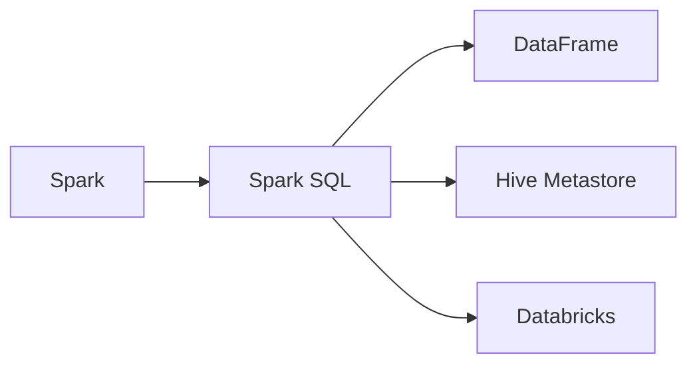

                 

# Spark SQL原理与代码实例讲解

> 关键词：Spark SQL, 数据仓库, 大数据, 分布式计算, 数据处理, 优化

## 1. 背景介绍

### 1.1 问题由来
在当今数据驱动的互联网时代，企业每天都在产生海量数据。如何高效存储、处理和分析这些数据，成为企业决策的关键。传统的单机数据库和复杂的数据仓库系统已经难以应对数据的爆炸式增长，急需一种能够快速处理大数据的技术。Apache Spark应运而生，其核心组件Spark SQL（SQL on Spark）作为一种高效的大数据处理技术，逐渐成为处理大规模数据的重要手段。Spark SQL的原理、架构及其应用领域，正日益受到各行业的关注。

### 1.2 问题核心关键点
Spark SQL作为一种开源的分布式数据处理框架，其核心优势在于能够高效地处理大规模数据集。其主要特点包括：

- 支持SQL查询：Spark SQL提供了一种基于SQL的编程接口，用户可以通过SQL语句进行数据查询、分析和处理。
- 数据处理能力强：Spark SQL利用内存计算加速数据处理，能够处理超大规模数据集。
- 支持多种数据源：支持从HDFS、S3等分布式文件系统中读取数据，同时支持从多种数据源（如JDBC、JSON、CSV等）读取数据。
- 高效的数据存储：Spark SQL利用其Hive Metastore进行元数据存储，能够高效地管理数据表。
- 可扩展性：Spark SQL支持扩展到数千个节点的大规模集群。

## 2. 核心概念与联系

### 2.1 核心概念概述

为了更好地理解Spark SQL，我们首先需要掌握以下几个核心概念：

- **Spark**：Apache Spark是一个快速通用的大数据处理框架，支持多种编程语言和数据处理模式（如批处理、交互式查询、流处理、机器学习等）。
- **Spark SQL**：Spark SQL是Spark的核心组件之一，支持通过SQL查询进行大数据处理。
- **DataFrame**：Spark SQL中用于存储和操作数据的核心数据结构，是一个分布式的数据表。
- **Databricks**：一个基于Spark的数据平台，支持交互式SQL查询、大数据分析、机器学习等功能。
- **Hive Metastore**：用于存储Spark SQL的数据表和元数据，支持数据的版本控制和访问权限管理。

### 2.2 核心概念原理和架构的 Mermaid 流程图



通过这张图，我们可以看到Spark SQL在Spark、DataFrame和Hive Metastore等组件之间的联系。Spark SQL通过DataFrame API访问Spark的内存计算能力，同时利用Hive Metastore进行元数据存储和查询。

## 3. 核心算法原理 & 具体操作步骤

### 3.1 算法原理概述

Spark SQL的核心算法包括数据读取、数据转换和数据聚合等。数据读取从HDFS、S3等分布式文件系统读取数据，数据转换通过DataFrame API进行数据清洗和处理，数据聚合通过SQL查询实现数据的汇总和统计。

### 3.2 算法步骤详解

以下详细介绍Spark SQL的数据读取、数据转换和数据聚合的具体步骤。

#### 数据读取

Spark SQL支持从多种数据源读取数据，包括HDFS、S3、JSON、CSV等。以下是使用Spark SQL从HDFS中读取数据的示例：

```python
from pyspark.sql import SparkSession
from pyspark.sql.functions import col

spark = SparkSession.builder.appName("Spark SQL Example").getOrCreate()
df = spark.read.csv("hdfs://localhost:9000/user/hadoop/input/clickstream.csv", header=True, inferSchema=True)
df.show()
```

#### 数据转换

数据转换通过DataFrame API进行数据清洗和处理。以下是使用Spark SQL进行数据转换的示例：

```python
from pyspark.sql.functions import col, split, when

df = df.withColumn("click_id", col("clickstream").split(".").getItem(0)) \
    .withColumn("timestamp", col("timestamp").as("timestamp"), col("timestamp").cast("timestamp").alias("timestamp"))
df = df.drop("clickstream", "timestamp") \
    .withColumn("date", split(col("timestamp"), " ").getItem(0)) \
    .withColumn("hour", split(col("timestamp"), " ").getItem(1)) \
    .withColumn("minute", split(col("timestamp"), " ").getItem(2))
df = df.drop("timestamp")
df.show()
```

#### 数据聚合

数据聚合通过SQL查询实现数据的汇总和统计。以下是使用Spark SQL进行数据聚合的示例：

```python
from pyspark.sql.functions import sum, count
from pyspark.sql.window import Window

windowSpec = Window.partitionBy("date", "hour")
df = df.withColumn("count", count("click_id").over(windowSpec)) \
    .withColumn("avg_price", sum("price").over(windowSpec))
df.show()
```

### 3.3 算法优缺点

Spark SQL作为一种高效的数据处理技术，具有以下优点：

- 高效：利用内存计算加速数据处理，处理大规模数据集速度快。
- 支持多种数据源：支持从多种数据源读取数据，支持多种数据格式。
- 易于使用：提供SQL查询接口，用户可以通过SQL语句进行数据查询和分析。
- 扩展性好：支持扩展到数千个节点的大规模集群。

同时，Spark SQL也存在以下缺点：

- 学习成本高：需要用户掌握SQL语法和Spark SQL API。
- 内存消耗大：大规模数据集处理时，需要占用大量内存。
- 复杂度高：对于复杂的数据转换和聚合操作，编写代码较为复杂。

### 3.4 算法应用领域

Spark SQL已经广泛应用于多个领域，包括金融、电商、医疗等。以下是几个典型的应用场景：

- 金融领域：使用Spark SQL进行数据清洗、风险分析、投资决策等。
- 电商领域：使用Spark SQL进行用户行为分析、商品推荐、流量监控等。
- 医疗领域：使用Spark SQL进行医疗数据处理、病例分析、药物研发等。

## 4. 数学模型和公式 & 详细讲解 & 举例说明

### 4.1 数学模型构建

Spark SQL的数学模型主要涉及数据读取、数据转换和数据聚合等操作。数据读取、转换和聚合的数学模型如下：

- 数据读取：$D_R = \{(x_i,y_i)\}_{i=1}^N$，其中$x_i$为读取的数据，$y_i$为数据源的信息。
- 数据转换：$D_T = \{(x_i^T,y_i^T)\}_{i=1}^N$，其中$x_i^T$为转换后的数据，$y_i^T$为数据源的信息。
- 数据聚合：$D_A = \{(x_i^A,y_i^A)\}_{i=1}^N$，其中$x_i^A$为聚合后的数据，$y_i^A$为聚合操作的信息。

### 4.2 公式推导过程

以下是数据转换和数据聚合的公式推导过程：

- 数据转换：$x_i^T = f(x_i,y_i)$，其中$f$为数据转换函数。
- 数据聚合：$x_i^A = g(x_i^T,y_i^T)$，其中$g$为数据聚合函数。

### 4.3 案例分析与讲解

假设我们有一个点击流数据表，包含点击ID、时间戳、价格等信息。我们可以使用Spark SQL进行数据转换和聚合，生成一个包含点击次数、平均价格等信息的表。

## 5. 项目实践：代码实例和详细解释说明

### 5.1 开发环境搭建

Spark SQL的开发环境搭建需要安装Spark和Hadoop等组件，并配置相应的环境变量。以下是Spark SQL开发环境的搭建步骤：

1. 安装Java和Scala
2. 安装Hadoop和Spark
3. 配置环境变量
4. 启动Spark Shell

### 5.2 源代码详细实现

以下是一个使用Spark SQL进行数据读取、转换和聚合的示例代码：

```python
from pyspark.sql import SparkSession
from pyspark.sql.functions import col, split, sum, count, when
from pyspark.sql.window import Window

spark = SparkSession.builder.appName("Spark SQL Example").getOrCreate()

# 数据读取
df = spark.read.csv("hdfs://localhost:9000/user/hadoop/input/clickstream.csv", header=True, inferSchema=True)

# 数据转换
df = df.withColumn("click_id", col("clickstream").split(".").getItem(0)) \
    .withColumn("timestamp", col("timestamp").as("timestamp"), col("timestamp").cast("timestamp").alias("timestamp"))
df = df.drop("clickstream", "timestamp") \
    .withColumn("date", split(col("timestamp"), " ").getItem(0)) \
    .withColumn("hour", split(col("timestamp"), " ").getItem(1)) \
    .withColumn("minute", split(col("timestamp"), " ").getItem(2))
df = df.drop("timestamp")

# 数据聚合
windowSpec = Window.partitionBy("date", "hour")
df = df.withColumn("count", count("click_id").over(windowSpec)) \
    .withColumn("avg_price", sum("price").over(windowSpec))
df.show()
```

### 5.3 代码解读与分析

以上代码演示了使用Spark SQL进行数据读取、转换和聚合的完整过程。以下是代码的详细解读：

- 首先，使用SparkSession创建一个Spark环境。
- 接着，使用Spark SQL的read方法从HDFS中读取数据，并将其转换为DataFrame。
- 然后，使用DataFrame API对数据进行转换，包括提取点击ID、时间戳、日期、小时和分钟等字段。
- 最后，使用SQL查询对数据进行聚合，计算每个小时的点击次数和平均价格。

## 6. 实际应用场景

### 6.1 金融领域

在金融领域，Spark SQL被广泛用于风险分析、投资决策和金融监管等场景。以下是一个Spark SQL在金融领域的应用示例：

假设我们有一个客户交易数据表，包含客户ID、交易金额、交易时间等信息。我们可以使用Spark SQL进行数据清洗和分析，生成一个包含客户交易总额、平均交易金额和最大交易金额等信息的表。

```python
from pyspark.sql import SparkSession
from pyspark.sql.functions import col, sum, avg, max
from pyspark.sql.window import Window

spark = SparkSession.builder.appName("Spark SQL Example").getOrCreate()

# 数据读取
df = spark.read.csv("hdfs://localhost:9000/user/hadoop/input/customer_transactions.csv", header=True, inferSchema=True)

# 数据转换
df = df.withColumn("customer_id", col("customer_id")) \
    .withColumn("transaction_amount", col("amount").cast("double"))

# 数据聚合
windowSpec = Window.partitionBy("customer_id")
df = df.withColumn("total_amount", sum("transaction_amount").over(windowSpec)) \
    .withColumn("avg_amount", avg("transaction_amount").over(windowSpec)) \
    .withColumn("max_amount", max("transaction_amount").over(windowSpec))
df.show()
```

### 6.2 电商领域

在电商领域，Spark SQL被用于用户行为分析、商品推荐和流量监控等场景。以下是一个Spark SQL在电商领域的应用示例：

假设我们有一个订单数据表，包含订单ID、订单时间、订单金额等信息。我们可以使用Spark SQL进行数据清洗和分析，生成一个包含每个用户的订单总金额、平均订单金额和最大订单金额等信息的表。

```python
from pyspark.sql import SparkSession
from pyspark.sql.functions import col, sum, avg, max
from pyspark.sql.window import Window

spark = SparkSession.builder.appName("Spark SQL Example").getOrCreate()

# 数据读取
df = spark.read.csv("hdfs://localhost:9000/user/hadoop/input/orders.csv", header=True, inferSchema=True)

# 数据转换
df = df.withColumn("order_id", col("order_id")) \
    .withColumn("order_amount", col("amount").cast("double"))

# 数据聚合
windowSpec = Window.partitionBy("user_id")
df = df.withColumn("total_amount", sum("order_amount").over(windowSpec)) \
    .withColumn("avg_amount", avg("order_amount").over(windowSpec)) \
    .withColumn("max_amount", max("order_amount").over(windowSpec))
df.show()
```

### 6.3 医疗领域

在医疗领域，Spark SQL被用于病例分析、药物研发和医疗数据处理等场景。以下是一个Spark SQL在医疗领域的应用示例：

假设我们有一个病例数据表，包含病人ID、就诊时间、疾病类型等信息。我们可以使用Spark SQL进行数据清洗和分析，生成一个包含每个病人的总就诊次数、平均就诊次数和最大就诊次数等信息的表。

```python
from pyspark.sql import SparkSession
from pyspark.sql.functions import col, sum, avg, max
from pyspark.sql.window import Window

spark = SparkSession.builder.appName("Spark SQL Example").getOrCreate()

# 数据读取
df = spark.read.csv("hdfs://localhost:9000/user/hadoop/input/patient_cases.csv", header=True, inferSchema=True)

# 数据转换
df = df.withColumn("patient_id", col("patient_id")) \
    .withColumn("visit_count", sum("visit_count").over(Window.partitionBy("patient_id")))

# 数据聚合
windowSpec = Window.partitionBy("patient_id")
df = df.withColumn("total_visits", sum("visit_count").over(windowSpec)) \
    .withColumn("avg_visits", avg("visit_count").over(windowSpec)) \
    .withColumn("max_visits", max("visit_count").over(windowSpec))
df.show()
```

## 7. 工具和资源推荐

### 7.1 学习资源推荐

为了帮助用户快速掌握Spark SQL，以下是一些推荐的在线资源和书籍：

- [Spark SQL官方文档](https://spark.apache.org/docs/latest/sql-programming-guide.html)
- [《Spark SQL编程指南》](https://www.packtpub.com/product/spark-sql-3-0-10-designing-and-developing-sql-on-spark/9781800561496)
- [Databricks官方博客](https://databricks.com/blog/)
- [Hortonworks官方博客](https://www.hortonworks.com/blog/)

### 7.2 开发工具推荐

以下推荐的开发工具可以帮助用户更高效地使用Spark SQL：

- [PySpark](https://pyspark.apache.org/)：Python语言的Spark API，提供了丰富的DataFrame API和SQL查询接口。
- [Spark UI](https://spark.apache.org/docs/latest/monitoring.html)：Spark Web UI界面，提供了详细的Spark任务和作业信息。
- [Spark Submit](https://spark.apache.org/docs/latest/submitting-applications.html)：用于提交Spark应用程序的工具。

### 7.3 相关论文推荐

以下是一些Spark SQL相关的经典论文：

- [Spark: Cluster Computing with Fault Tolerance](http://spark.apache.org/docs/latest/developer-guide.html#under-the-hood)
- [Spark SQL: SQL on Spark](https://spark.apache.org/docs/latest/sql-programming-guide.html)
- [Spark on Big Data: Graph Processing](https://spark.apache.org/docs/latest/graphx-programming-guide.html)

## 8. 总结：未来发展趋势与挑战

### 8.1 研究成果总结

Spark SQL作为一种高效的大数据处理技术，已经广泛应用于多个领域。其主要优点包括高效、易用和支持多种数据源等。同时，Spark SQL也存在学习成本高、内存消耗大和复杂度高等缺点。

### 8.2 未来发展趋势

未来，Spark SQL将继续在多个领域发挥重要作用。其主要发展趋势包括：

- 分布式计算：Spark SQL将继续支持大规模分布式计算，支持数千个节点的集群。
- 实时计算：Spark SQL将继续支持实时数据处理，支持流处理和近实时查询。
- 智能分析：Spark SQL将继续支持机器学习和深度学习，支持自动化数据清洗和分析。
- 多语言支持：Spark SQL将继续支持多种编程语言和数据处理模式，支持SQL、Python、Scala等。

### 8.3 面临的挑战

尽管Spark SQL已经取得了显著进展，但在未来发展过程中仍面临以下挑战：

- 内存消耗：大规模数据集处理时，需要占用大量内存，导致内存压力增大。
- 学习成本：用户需要掌握SQL语法和Spark SQL API，学习成本较高。
- 数据一致性：在大规模集群中，数据一致性问题较为复杂，需要解决数据丢失和数据冗余等问题。
- 扩展性：在处理海量数据时，Spark SQL的扩展性需要进一步提升。

### 8.4 研究展望

未来，Spark SQL的研究方向包括：

- 优化内存管理：通过内存压缩、内存分级等技术，优化内存消耗。
- 提升学习体验：通过简化API、提供更好的文档和示例，降低用户学习成本。
- 增强数据一致性：通过分布式事务、数据复制等技术，增强数据一致性。
- 扩展处理能力：通过集群优化、存储优化等技术，提升处理能力。

## 9. 附录：常见问题与解答

**Q1: Spark SQL和SQL的区别是什么？**

A: Spark SQL是一种基于Spark的数据处理技术，其数据处理流程是基于内存的。SQL是一种数据操作语言，主要用于关系型数据库中的数据查询和管理。

**Q2: Spark SQL和Hive的区别是什么？**

A: Spark SQL和Hive都是大数据处理技术，但它们的设计理念和实现方式有所不同。Spark SQL是一种内存计算技术，而Hive是一种基于Hadoop的数据仓库技术。Spark SQL支持更多的编程语言和数据处理模式，而Hive则更加适合数据仓库应用。

**Q3: 如何优化Spark SQL的性能？**

A: 优化Spark SQL的性能可以通过以下方法：

- 优化数据读取：使用Spark SQL的优化工具，如PTransform、Union、Filter等，优化数据读取操作。
- 优化数据转换：使用Spark SQL的优化工具，如ReduceByKey、Aggregate函数等，优化数据转换操作。
- 优化数据聚合：使用Spark SQL的优化工具，如GroupBy、Window函数等，优化数据聚合操作。
- 使用Spark UI：使用Spark Web UI界面，监控Spark作业和任务，查找性能瓶颈。

**Q4: 如何处理Spark SQL中的数据丢失问题？**

A: 处理Spark SQL中的数据丢失问题可以通过以下方法：

- 使用容错机制：使用Spark的容错机制，如RDD和DataFrame的检查点机制，处理数据丢失问题。
- 使用数据复制：使用数据复制技术，将数据复制多份，增强数据冗余性，降低数据丢失风险。
- 使用分布式事务：使用分布式事务技术，保证数据一致性和完整性。

**Q5: 如何处理Spark SQL中的数据一致性问题？**

A: 处理Spark SQL中的数据一致性问题可以通过以下方法：

- 使用分布式事务：使用分布式事务技术，保证数据一致性和完整性。
- 使用数据复制：使用数据复制技术，将数据复制多份，增强数据冗余性，降低数据丢失风险。
- 使用一致性哈希：使用一致性哈希技术，保证数据分区的一致性和数据的访问性能。

以上是Spark SQL的全面介绍，希望能对读者有所帮助。

