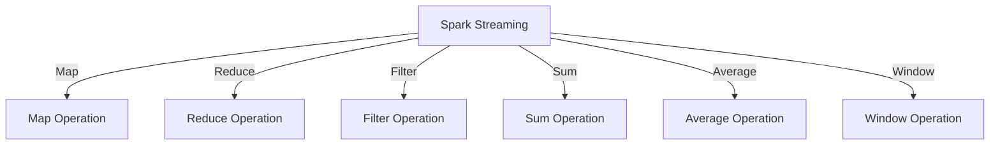

                 

## 1. 背景介绍

### 1.1 问题由来
随着大数据技术的飞速发展，实时数据处理在各行各业中的应用日益广泛。实时数据流分析具有时效性强、数据量大、处理速度要求高等特点，是大数据应用的核心需求之一。在过去，实时数据处理大多依赖于基于批处理的系统，如MapReduce，但在处理大规模实时数据时，批处理系统的延迟较高，难以满足实时性要求。

为了解决这一问题，Apache Spark社区推出了Spark Streaming模块，旨在提供基于内存的流式处理能力，实现低延迟、高吞吐量的实时数据流处理。Spark Streaming作为Spark生态系统的一部分，通过将数据集分为窗口，对窗口数据进行批处理，实现了实时数据的流式处理。

### 1.2 问题核心关键点
Spark Streaming的成功依赖于其高效的数据处理机制和简单易用的API。Spark Streaming的核心思想是将实时数据流划分为固定大小的窗口，对每个窗口进行批处理，从而实现了流式数据处理的低延迟和高吞吐量。Spark Streaming提供了丰富的API和丰富的数据源支持，使得实时数据流处理的开发更加高效和便捷。

Spark Streaming的架构主要由Spark Core、Spark Streaming和Spark UI三部分组成。Spark Core提供内存计算能力，Spark Streaming实现实时数据流处理，Spark UI提供可视化的监控和管理界面。Spark Streaming通过集成Spark Core的计算能力，实现了高效、低延迟的实时数据流处理。

## 2. 核心概念与联系

### 2.1 核心概念概述

Spark Streaming提供了高效、低延迟的实时数据流处理能力，其核心概念主要包括：

- **微批处理**：Spark Streaming将实时数据流划分为固定大小的时间窗口，对每个窗口进行批处理，从而实现了实时数据流的处理。
- **DStream**：Spark Streaming中用于表示实时数据流的数据抽象，可以看作是流式数据的RDD（Resilient Distributed Dataset）。
- **变换操作**：包括Map、Reduce、Filter等基本的转换操作，用于对实时数据流进行处理和分析。
- **聚合操作**：包括Sum、Count、Average等聚合操作，用于对窗口内的数据进行聚合计算。
- **窗口操作**：包括Tumbling Window、Sliding Window、Session Window等窗口划分方式，用于对数据进行分组和聚合计算。

这些概念通过Spark Streaming API实现，使得开发者可以高效地构建和管理实时数据流处理系统。

### 2.2 核心概念原理和架构的 Mermaid 流程图



通过上述流程图可以看出，Spark Streaming的实时数据流处理过程主要包括Map、Reduce、Filter等基本的转换操作，以及Sum、Count、Average等聚合操作，同时支持Tumbling Window、Sliding Window、Session Window等多种窗口划分方式。这些操作通过Spark Streaming API实现，使得开发者可以高效地构建和管理实时数据流处理系统。

## 3. 核心算法原理 & 具体操作步骤

### 3.1 算法原理概述

Spark Streaming的实时数据流处理主要基于微批处理和窗口划分。具体来说，Spark Streaming将实时数据流划分为固定大小的时间窗口，对每个窗口进行批处理，从而实现了实时数据流的处理。微批处理通过Spark Core的内存计算能力，使得实时数据流的处理速度达到毫秒级别，同时保持低延迟和高吞吐量。

Spark Streaming的实时数据流处理主要通过Spark Core的内存计算能力和分布式计算能力实现。Spark Core提供了内存计算能力，可以高效地处理实时数据流。Spark Streaming通过将实时数据流划分为固定大小的时间窗口，对每个窗口进行批处理，从而实现了实时数据流的处理。Spark Streaming还支持多种窗口划分方式，包括Tumbling Window、Sliding Window、Session Window等，使得开发者可以根据实际需求进行灵活配置。

### 3.2 算法步骤详解

Spark Streaming的实时数据流处理主要包括以下几个关键步骤：

**Step 1: 数据源配置**

在Spark Streaming中，首先需要配置数据源。Spark Streaming支持多种数据源，包括Kafka、Flume、HDFS等。以Kafka为例，配置步骤如下：

```python
from pyspark import SparkContext
from pyspark.streaming import StreamingContext

sc = SparkContext("local", "Spark Streaming")
ssc = StreamingContext(sc, 2)

kafka_config = {
    "bootstrap.servers": "localhost:9092",
    "key.deserializer": KafkaDeserializer(),
    "value.deserializer": KafkaDeserializer()
}

kafka_stream = KafkaUtils.createStream(ssc, kafka_config, ["my-topic"], {"my-partition": 0})
```

在上述代码中，首先创建Spark Context和Spark Streaming Context。然后配置Kafka数据源，指定Kafka服务器的地址和主题等信息。最后使用KafkaUtils.createStream函数创建Kafka数据流，指定主题和分区等信息。

**Step 2: 数据处理**

在Spark Streaming中，数据处理通常包括以下几个步骤：

1. 读取数据源

2. 数据清洗和转换

3. 聚合计算

4. 数据存储和展示

以数据清洗和转换为例，代码如下：

```python
from pyspark.streaming import Window

def process_data(data):
    cleaned_data = [(str(item), item) for item in data]
    return cleaned_data

kafka_stream.foreachRDD(lambda rdd: rdd.map(process_data))
```

在上述代码中，首先定义process_data函数，对输入数据进行清洗和转换。然后使用foreachRDD函数对数据流进行处理，将每个数据集进行map操作，将清洗和转换后的数据返回。

**Step 3: 窗口划分**

在Spark Streaming中，窗口划分通常包括以下几种方式：

1. Tumbling Window：固定大小的时间窗口。

2. Sliding Window：滑动窗口。

3. Session Window：会话窗口。

以Tumbling Window为例，代码如下：

```python
tumbling_window = Window(5, 5)
tumbling_windowed_rdd = rdd.map(lambda x: (x, x)) \
                           .map(lambda x: (x[0], (x[1], 1))) \
                           .reduceByKey(lambda x, y: (x[0], x[1] + y[1])) \
                           .apply(tumbling_window)
```

在上述代码中，首先定义Tumbling Window，指定窗口大小为5秒。然后使用map函数对数据进行清洗和转换，使用reduceByKey函数对窗口内的数据进行聚合计算，使用apply函数对数据进行窗口划分。

**Step 4: 数据存储和展示**

在Spark Streaming中，数据存储和展示通常包括以下几种方式：

1. 将处理结果写入文件或数据库。

2. 使用Spark UI展示处理结果。

以将处理结果写入文件为例，代码如下：

```python
tumbling_windowed_rdd.foreachRDD(lambda rdd: rdd.foreach(lambda x: open("output.txt", "a").write(str(x) + "\n")))
```

在上述代码中，使用foreachRDD函数对数据流进行处理，将处理结果写入文件。

### 3.3 算法优缺点

Spark Streaming的实时数据流处理具有以下优点：

1. 低延迟：Spark Streaming的实时数据流处理基于微批处理和窗口划分，具有低延迟的特点。

2. 高吞吐量：Spark Streaming的实时数据流处理基于Spark Core的内存计算能力，具有高吞吐量的特点。

3. 简单易用：Spark Streaming提供了丰富的API和数据源支持，使得实时数据流处理的开发更加高效和便捷。

4. 扩展性强：Spark Streaming可以轻松扩展到多个节点，实现分布式计算。

Spark Streaming的实时数据流处理也存在一些缺点：

1. 数据处理粒度较大：Spark Streaming的实时数据流处理基于微批处理和窗口划分，数据处理粒度较大，难以实现高精度实时处理。

2. 不支持动态窗口：Spark Streaming的实时数据流处理不支持动态窗口，难以根据数据流变化灵活配置窗口大小。

3. 实时数据丢失：Spark Streaming的实时数据流处理基于微批处理，数据丢失的风险较大，难以实现无丢失实时处理。

## 4. 数学模型和公式 & 详细讲解 & 举例说明

### 4.1 数学模型构建

Spark Streaming的实时数据流处理主要基于微批处理和窗口划分。以Tumbling Window为例，假设数据流的时间窗口大小为T，每个数据元素的大小为D，则每个窗口的大小为D*T。假设每个窗口包含N个数据元素，则每个窗口的处理时间约为N*T。

### 4.2 公式推导过程

Spark Streaming的实时数据流处理主要基于微批处理和窗口划分。以Tumbling Window为例，假设数据流的时间窗口大小为T，每个数据元素的大小为D，则每个窗口的大小为D*T。假设每个窗口包含N个数据元素，则每个窗口的处理时间约为N*T。

### 4.3 案例分析与讲解

以Spark Streaming对Kafka数据流的处理为例，假设Kafka数据流的主题为my-topic，分区为0，数据流大小为100个数据元素。假设每个数据元素的大小为1字节，时间窗口大小为5秒，每个数据元素的处理时间为1毫秒。

在Spark Streaming中，首先需要配置Kafka数据源，指定Kafka服务器的地址和主题等信息。然后使用KafkaUtils.createStream函数创建Kafka数据流，指定主题和分区等信息。接下来对数据流进行处理，将每个数据元素的大小为1字节，数据流大小为100个数据元素，处理时间约为100*1毫秒。每个窗口大小为5秒，数据元素大小为1字节，则每个窗口的大小为5*100=500字节。每个窗口包含100个数据元素，处理时间约为100*1毫秒，则每个窗口的处理时间为100毫秒。

## 5. 项目实践：代码实例和详细解释说明

### 5.1 开发环境搭建

Spark Streaming的开发环境搭建主要包括以下几个步骤：

1. 安装Apache Spark

2. 安装Kafka

3. 配置Kafka数据源

4. 创建Spark Streaming Context

以Kafka数据源为例，首先需要安装Apache Spark和Kafka，然后使用KafkaUtils.createStream函数创建Kafka数据流，指定Kafka服务器的地址和主题等信息。

```python
from pyspark import SparkContext
from pyspark.streaming import StreamingContext
from pyspark.streaming.kafka import KafkaUtils

sc = SparkContext("local", "Spark Streaming")
ssc = StreamingContext(sc, 2)

kafka_config = {
    "bootstrap.servers": "localhost:9092",
    "key.deserializer": KafkaDeserializer(),
    "value.deserializer": KafkaDeserializer()
}

kafka_stream = KafkaUtils.createStream(ssc, kafka_config, ["my-topic"], {"my-partition": 0})
```

### 5.2 源代码详细实现

以Kafka数据流处理为例，代码如下：

```python
from pyspark.streaming import Window

def process_data(data):
    cleaned_data = [(str(item), item) for item in data]
    return cleaned_data

kafka_stream.foreachRDD(lambda rdd: rdd.map(process_data))

tumbling_window = Window(5, 5)
tumbling_windowed_rdd = kafka_stream.map(lambda x: (x, x)) \
                           .map(lambda x: (x[0], (x[1], 1))) \
                           .reduceByKey(lambda x, y: (x[0], x[1] + y[1])) \
                           .apply(tumbling_window)

tumbling_windowed_rdd.foreachRDD(lambda rdd: rdd.foreach(lambda x: open("output.txt", "a").write(str(x) + "\n")))
```

在上述代码中，首先定义process_data函数，对输入数据进行清洗和转换。然后使用foreachRDD函数对数据流进行处理，将每个数据集进行map操作，将清洗和转换后的数据返回。然后使用Tumbling Window进行窗口划分，最后使用foreachRDD函数将处理结果写入文件。

### 5.3 代码解读与分析

在上述代码中，首先定义process_data函数，对输入数据进行清洗和转换。然后使用foreachRDD函数对数据流进行处理，将每个数据集进行map操作，将清洗和转换后的数据返回。接着使用Tumbling Window进行窗口划分，最后使用foreachRDD函数将处理结果写入文件。

## 6. 实际应用场景

### 6.1 智能推荐系统

Spark Streaming可以用于构建智能推荐系统，实现实时推荐。在智能推荐系统中，需要实时处理用户行为数据，计算用户兴趣和行为模型，实现实时推荐。Spark Streaming可以通过实时处理用户行为数据，计算用户兴趣和行为模型，实现实时推荐。

### 6.2 实时数据分析

Spark Streaming可以用于实时数据分析，实现数据可视化。在实时数据分析中，需要实时处理数据流，计算聚合指标，实现数据可视化。Spark Streaming可以通过实时处理数据流，计算聚合指标，实现数据可视化。

### 6.3 日志分析

Spark Streaming可以用于实时日志分析，实现告警监控。在日志分析中，需要实时处理日志数据，计算聚合指标，实现告警监控。Spark Streaming可以通过实时处理日志数据，计算聚合指标，实现告警监控。

### 6.4 未来应用展望

Spark Streaming作为Spark生态系统的一部分，未来将会有更大的发展潜力。未来，Spark Streaming将支持更多的数据源和API，使得实时数据流处理更加高效和便捷。Spark Streaming还将支持更多的数据处理方式，如动态窗口、流式聚合等，使得实时数据流处理更加灵活和高效。

## 7. 工具和资源推荐

### 7.1 学习资源推荐

为了帮助开发者系统掌握Spark Streaming的理论基础和实践技巧，这里推荐一些优质的学习资源：

1. Spark Streaming官方文档：Spark Streaming的官方文档，提供了完整的API和使用说明，是学习Spark Streaming的最佳资源。

2. Apache Spark中文社区：Apache Spark中文社区提供了丰富的教程和示例，帮助开发者快速上手Spark Streaming。

3. Kaggle：Kaggle是一个数据科学竞赛平台，提供了大量的Spark Streaming竞赛和数据集，帮助开发者提高实战能力。

4. Coursera：Coursera提供了多个Spark Streaming的在线课程，涵盖从入门到进阶的各个方面，适合不同层次的开发者学习。

### 7.2 开发工具推荐

Spark Streaming的开发工具推荐以下几款：

1. PySpark：Spark Streaming的Python API，提供了简单易用的开发环境，适合Python开发者使用。

2. Spark Shell：Spark Streaming的命令行工具，提供了丰富的命令行操作，适合初学者使用。

3. Spark UI：Spark Streaming的可视化界面，提供了实时监控和管理功能，适合开发人员使用。

4. Visual Spark：Spark Streaming的可视化工具，提供了丰富的图表和仪表盘，适合数据分析人员使用。

### 7.3 相关论文推荐

Spark Streaming的研究涉及多个领域，以下是几篇经典论文，推荐阅读：

1. "Spark: Cluster Computing with Fault Tolerance"：Spark的核心论文，介绍了Spark的分布式计算架构和容错机制。

2. "Spark Streaming: Fast and Scalable Data Stream Processing"：Spark Streaming的核心论文，介绍了Spark Streaming的实时数据流处理机制和API设计。

3. "Scalable Streaming Graph Processing"：介绍Spark Streaming的流式图处理算法和优化策略。

4. "Spark Streaming: A Model for Resilient Stream Processing"：介绍Spark Streaming的微批处理和窗口划分算法。

## 8. 总结：未来发展趋势与挑战

### 8.1 研究成果总结

Spark Streaming作为Spark生态系统的一部分，已经成为实时数据流处理的主流解决方案。Spark Streaming通过微批处理和窗口划分，实现了低延迟、高吞吐量的实时数据流处理，具有强大的扩展性和易用性。Spark Streaming已经成为Spark社区最为活跃的组件之一，得到了广泛的应用和支持。

### 8.2 未来发展趋势

未来，Spark Streaming将有以下几个发展趋势：

1. 数据源多样化：Spark Streaming将支持更多的数据源，如Kafka、HDFS、Flume等，使得实时数据流处理更加高效和便捷。

2. 数据处理方式多样化：Spark Streaming将支持更多的数据处理方式，如动态窗口、流式聚合等，使得实时数据流处理更加灵活和高效。

3. 扩展性更强：Spark Streaming将支持更多的计算节点和集群资源，使得实时数据流处理更加高效和便捷。

4. 实时数据可视化：Spark Streaming将支持更多的实时数据可视化工具，使得实时数据流处理更加直观和便捷。

5. 实时数据存储和展示：Spark Streaming将支持更多的实时数据存储和展示方式，使得实时数据流处理更加高效和便捷。

### 8.3 面临的挑战

尽管Spark Streaming已经取得了较大的成功，但在未来发展过程中，仍面临着一些挑战：

1. 数据处理粒度较大：Spark Streaming的实时数据流处理基于微批处理和窗口划分，数据处理粒度较大，难以实现高精度实时处理。

2. 实时数据丢失：Spark Streaming的实时数据流处理基于微批处理，数据丢失的风险较大，难以实现无丢失实时处理。

3. 扩展性不足：Spark Streaming的扩展性虽然较强，但在某些情况下，扩展性仍不足以满足大规模实时数据流处理的需求。

4. 实时数据可视化不足：Spark Streaming的实时数据可视化工具相对较少，难以实现直观和便捷的实时数据可视化。

### 8.4 研究展望

未来，Spark Streaming需要在以下几个方面进行研究：

1. 实时数据流处理算法：Spark Streaming需要在实时数据流处理算法方面进行深入研究，提高实时数据流处理的精度和效率。

2. 实时数据流处理架构：Spark Streaming需要在实时数据流处理架构方面进行深入研究，提高实时数据流处理的扩展性和可靠性。

3. 实时数据流处理优化：Spark Streaming需要在实时数据流处理优化方面进行深入研究，提高实时数据流处理的性能和效率。

4. 实时数据流处理安全：Spark Streaming需要在实时数据流处理安全方面进行深入研究，提高实时数据流处理的安全性和可靠性。

5. 实时数据流处理隐私：Spark Streaming需要在实时数据流处理隐私方面进行深入研究，提高实时数据流处理的隐私保护能力。

## 9. 附录：常见问题与解答

**Q1：Spark Streaming如何实现低延迟、高吞吐量的实时数据流处理？**

A: Spark Streaming通过微批处理和窗口划分实现低延迟、高吞吐量的实时数据流处理。微批处理通过Spark Core的内存计算能力，使得实时数据流的处理速度达到毫秒级别，同时保持低延迟和高吞吐量。窗口划分通过固定大小的时间窗口和聚合计算，使得实时数据流的处理更加高效和便捷。

**Q2：Spark Streaming支持哪些数据源？**

A: Spark Streaming支持多种数据源，包括Kafka、Flume、HDFS等。数据源的选择可以根据实际需求进行配置。

**Q3：Spark Streaming如何进行数据清洗和转换？**

A: Spark Streaming通过foreachRDD函数对数据流进行处理，对每个数据集进行map、filter等基本转换操作，实现数据清洗和转换。

**Q4：Spark Streaming如何进行实时数据可视化？**

A: Spark Streaming可以通过Spark UI进行实时数据可视化。Spark UI提供了实时监控和管理功能，帮助开发者实时查看数据流处理状态和性能指标。

**Q5：Spark Streaming如何进行数据存储和展示？**

A: Spark Streaming可以通过将处理结果写入文件或数据库，或者使用Spark UI展示处理结果，实现数据存储和展示。

---

作者：禅与计算机程序设计艺术 / Zen and the Art of Computer Programming

