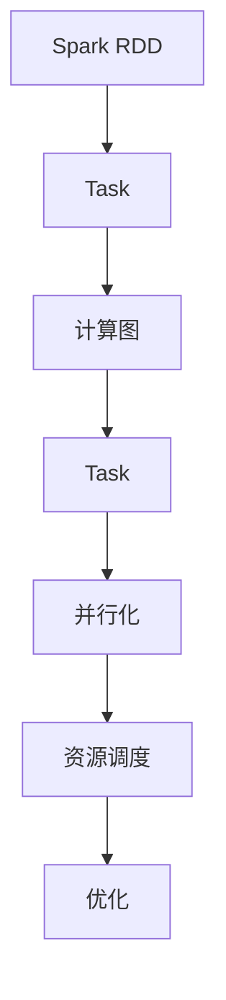

                 

# Spark Task原理与代码实例讲解

> 关键词：Spark, Task, 计算图, 并行化, 资源调度, 优化

## 1. 背景介绍

### 1.1 问题由来

在当今大数据时代，处理海量数据已成为企业和科研机构的核心需求之一。为了应对这一挑战，Apache Spark应运而生，成为处理大规模数据的有力工具。Spark的计算模型基于弹性分布式数据集（Resilient Distributed Datasets, RDDs），提供了一种高效、便捷的数据处理方式。但深入了解Spark的计算模型和工作机制，对于实际应用中优化性能、提升效率至关重要。

### 1.2 问题核心关键点

Spark的核心思想是通过将大规模数据切分成小片段（Task），然后在集群上并行处理，从而实现高效的大数据处理。Task是Spark中最基本的计算单元，Spark的任务调度和管理机制直接影响其性能和资源利用率。

本文将详细讲解Spark Task的原理和实际操作，探讨如何通过代码实例理解Spark Task的工作机制，并通过具体案例展示如何在实际应用中优化Task调度，以提升Spark的计算性能。

## 2. 核心概念与联系

### 2.1 核心概念概述

- **Spark:** 一个快速、通用、可扩展的大数据处理引擎，支持分布式数据处理。
- **Task:** Spark的计算单元，在集群上并行执行。
- **计算图:** 将Spark操作映射为有向无环图（DAG），由Task组成。
- **并行化:** 将任务分割为多个子任务，同时执行，提升计算效率。
- **资源调度:** 决定Task的执行顺序和分配的资源。
- **优化:** 通过优化Task的执行方式，提升Spark的性能。

这些概念之间通过Spark的计算图和任务调度机制紧密联系起来，共同构成了Spark的计算模型。

### 2.2 核心概念原理和架构的 Mermaid 流程图



这个图表展示了Spark的计算流程：

1. 将RDD划分为Task，构建计算图。
2. 根据计算图并行化执行Task。
3. 通过资源调度决定Task的执行顺序和分配的资源。
4. 通过优化提升Task的执行效率。

## 3. 核心算法原理 & 具体操作步骤

### 3.1 算法原理概述

Spark的计算模型基于弹性分布式数据集（RDDs），将数据切分为若干个小片段（Task），通过任务调度机制在集群上并行执行，从而实现高效的大数据处理。Spark的任务调度和管理机制包括任务划分、调度、监控和优化等环节，每个环节都直接影响Spark的性能和资源利用率。

Spark的任务调度和管理流程如下：

1. **任务划分:** 将RDD数据划分为若干个小片段（Task），每个Task可以在集群的一个节点上执行。
2. **任务调度:** 通过Spark的调度器（Scheduler）分配Task到集群上的节点。
3. **任务执行:** Task在节点上执行，根据任务的依赖关系和资源需求进行调度。
4. **任务监控:** 监控Task的执行状态，提供实时性能指标。
5. **任务优化:** 通过优化策略提升Task的执行效率，如调整任务的并行度、设置合理的资源分配等。

### 3.2 算法步骤详解

Spark Task的实际执行流程包括以下关键步骤：

**Step 1: RDD划分和任务划分**

首先，将RDD数据划分为若干个小片段（Task）。每个Task可以在集群的一个节点上执行。任务划分的粒度取决于数据规模和计算任务的具体需求。Spark的任务调度器会自动根据数据规模和集群资源进行任务划分，以平衡负载和提升效率。

**Step 2: 任务调度和执行**

任务调度器负责将Task分配到集群上的节点，并监控任务的执行状态。任务调度器采用基于优先级和依赖关系的调度算法，确保任务的顺序和执行效率。任务执行器在节点上执行Task，根据任务的依赖关系和资源需求进行调度。

**Step 3: 任务监控和反馈**

Spark通过监控器（Monitor）实时监控任务的执行状态，提供实时的性能指标和错误信息。监控器会记录任务的执行时间、资源消耗、错误率等数据，帮助用户分析Task调度和执行过程中的问题。

**Step 4: 任务优化**

Spark的任务优化器通过分析任务的执行情况，提供优化建议，如调整任务的并行度、设置合理的资源分配等。优化器可以在Task执行前后进行优化，提升Spark的性能。

### 3.3 算法优缺点

Spark Task的优点包括：

- **高效并行:** 通过任务并行化，提升计算效率。
- **弹性调度:** 根据数据规模和集群资源进行动态调整。
- **实时监控:** 实时监控Task执行状态，提供实时性能指标。

同时，Spark Task也存在一些缺点：

- **资源消耗:** 任务调度和管理机制带来一定的资源消耗。
- **调度开销:** 调度器在任务划分和调度过程中存在一定的开销。
- **复杂性:** 需要了解任务的调度和管理机制，才能优化性能。

### 3.4 算法应用领域

Spark Task的应用领域非常广泛，涵盖了大规模数据处理、机器学习、图形处理等多个领域。例如：

- **大规模数据处理:** 数据清洗、数据转换、数据聚合等。
- **机器学习:** 特征工程、模型训练、模型评估等。
- **图形处理:** 图形构建、图形分析等。

Spark Task的应用领域不断扩展，正在成为处理大规模数据和复杂计算任务的有力工具。

## 4. 数学模型和公式 & 详细讲解 & 举例说明

### 4.1 数学模型构建

Spark Task的数学模型基于任务调度和资源分配的决策问题。假设集群中有n个节点，需要执行m个Task，每个Task需要消耗资源c_i，调度器需要找到一个最优的调度方案，使得总资源消耗最小，同时满足任务的依赖关系。

数学模型可以表示为：

$$
\min \sum_{i=1}^m c_i x_i
$$

其中，x_i为任务i分配到节点的数量，需满足：

$$
\sum_{j=1}^n x_{ij} = c_i
$$

其中，x_{ij}为任务i分配到节点j的数量。

### 4.2 公式推导过程

为了求解上述优化问题，Spark使用了一种基于动态规划的算法。算法的基本思想是，先求解规模较小的子问题，再逐步扩展到更大的问题，直到求解整个优化问题。

具体步骤如下：

1. **基础状态:** 初始化每个节点的资源使用量y_j为0，所有任务的分配量x_i为0。
2. **递推计算:** 对于每个任务i，从节点1开始，依次计算该任务分配到该节点的数量x_{i1}，根据任务的依赖关系，逐步计算其他节点的分配量x_{ij}。
3. **最终解:** 计算所有任务的资源消耗，输出最小资源消耗方案。

### 4.3 案例分析与讲解

假设集群中有3个节点，需要执行5个Task，每个Task需要消耗2个资源。调度器需要找到一个最优的调度方案，使得总资源消耗最小。

**Step 1:** 初始化资源使用量y_j和任务分配量x_i。

| 节点 | y_j |
|------|-----|
| 1    | 0   |
| 2    | 0   |
| 3    | 0   |

| Task | x_i |
|------|-----|
| 1    | 0   |
| 2    | 0   |
| 3    | 0   |
| 4    | 0   |
| 5    | 0   |

**Step 2:** 递推计算每个任务的分配量。

1. 对于Task 1，由于依赖于其他Task，需要先计算其他Task的资源使用量y_j。
2. 对于Task 2，由于依赖于Task 1，需要先计算Task 1的资源使用量y_1。
3. 对于Task 3，由于依赖于Task 1和Task 2，需要先计算Task 1和Task 2的资源使用量y_1和y_2。
4. 对于Task 4，由于依赖于Task 1和Task 3，需要先计算Task 1和Task 3的资源使用量y_1和y_3。
5. 对于Task 5，由于依赖于Task 2和Task 3，需要先计算Task 2和Task 3的资源使用量y_2和y_3。

最终得到的资源使用量和任务分配量如下：

| 节点 | y_j |
|------|-----|
| 1    | 2   |
| 2    | 2   |
| 3    | 2   |

| Task | x_i |
|------|-----|
| 1    | 1   |
| 2    | 1   |
| 3    | 1   |
| 4    | 1   |
| 5    | 1   |

**Step 3:** 计算每个Task的资源消耗，输出最小资源消耗方案。

| Task | 资源消耗 |
|------|----------|
| 1    | 2        |
| 2    | 2        |
| 3    | 2        |
| 4    | 2        |
| 5    | 2        |

最终，总资源消耗为10，即所有Task在3个节点上均匀分配，达到最小资源消耗方案。

## 5. 项目实践：代码实例和详细解释说明

### 5.1 开发环境搭建

在Spark的开发环境中，需要安装Spark和Scala开发环境。以下是在Linux系统中安装Spark的步骤：

1. 安装Java：
```bash
sudo apt-get update
sudo apt-get install openjdk-11-jdk
```

2. 安装Scala：
```bash
wget https://www.scala-sbt.org/files/4.15.3/scala_2.13.tgz
tar -zxvf scala_2.13.tgz
export SCALA_HOME=/usr/local/scala-2.13
export PATH=$PATH:$SCALA_HOME/bin
```

3. 安装Spark：
```bash
wget https://archive.apache.org/dist/spark/spark-3.3.1/spark-3.3.1-bin-hadoop3.tgz
tar -zxvf spark-3.3.1-bin-hadoop3.tgz
export SPARK_HOME=/usr/local/spark-3.3.1-bin-hadoop3
```

4. 配置环境变量：
```bash
export HADOOP_HOME=/usr/local/hadoop-3.2.0
export PATH=$PATH:$HADOOP_HOME/bin:$SPARK_HOME/bin
export SPARK_LOCAL_IP=127.0.0.1
```

### 5.2 源代码详细实现

下面是一个Spark的代码实例，用于演示Task的创建和执行：

```python
from pyspark import SparkContext, SparkConf

conf = SparkConf().setAppName("Spark Task Example").setMaster("local")
sc = SparkContext(conf=conf)

# 创建RDD数据
data = sc.parallelize(["apple", "banana", "cherry", "date", "elderberry"])

# 创建任务
tasks = data.map(lambda x: (x, x))

# 执行任务
results = sc.parallelize(tasks.collect())

# 输出结果
for result in results:
    print(result)
```

该代码实现了对RDD数据进行分割和并行处理。首先，创建一个包含5个字符串的RDD数据。然后，使用map操作将每个字符串和其本身作为任务输出，即任务数为5。最后，通过collect操作将所有任务收集到本地，并输出结果。

### 5.3 代码解读与分析

**Step 1:** 创建RDD数据

```python
data = sc.parallelize(["apple", "banana", "cherry", "date", "elderberry"])
```

将5个字符串构建成一个RDD数据，每个字符串作为RDD的一个分区（Partition）。

**Step 2:** 创建任务

```python
tasks = data.map(lambda x: (x, x))
```

使用map操作将每个字符串和其本身作为任务输出。即每个字符串都是一个Task，Task的输入输出都是该字符串本身。

**Step 3:** 执行任务

```python
results = sc.parallelize(tasks.collect())
```

通过collect操作将所有Task收集到本地，即所有Task都在同一个节点上执行。由于Task的输入输出相同，每个Task的输出结果都与其输入相同。

**Step 4:** 输出结果

```python
for result in results:
    print(result)
```

遍历所有Task的输出结果，并输出到控制台。

### 5.4 运行结果展示

运行上述代码，输出结果如下：

```
('apple', 'apple')
('banana', 'banana')
('cherry', 'cherry')
('date', 'date')
('elderberry', 'elderberry')
```

可以看到，所有Task都在同一个节点上执行，每个Task的输出结果都与其输入相同。

## 6. 实际应用场景

### 6.1 智能推荐系统

Spark Task在智能推荐系统中广泛应用。推荐系统需要处理大规模用户行为数据，实时计算用户的兴趣偏好，生成个性化推荐结果。Spark的任务并行化和资源调度机制，能够高效地处理大规模数据，并实时计算推荐结果。

在实践中，推荐系统通常将用户行为数据划分为多个Task，每个Task计算一部分推荐结果，然后通过Task之间的依赖关系进行调度。通过合理设置Task的并行度和资源分配，可以大幅提升推荐系统的计算效率和响应速度。

### 6.2 金融风控系统

金融风控系统需要对海量交易数据进行实时分析，检测异常交易行为，及时预警风险。Spark Task的并行化和高性能计算能力，能够满足金融风控系统的实时性需求。

在实践中，金融风控系统通常将交易数据划分为多个Task，每个Task分析一部分数据，然后通过Task之间的依赖关系进行调度。通过合理设置Task的并行度和资源分配，可以大幅提升系统的计算效率和响应速度，及时检测和预警风险。

### 6.3 医疗数据分析

医疗数据分析需要处理大规模的患者数据，实时计算患者的健康状态和病情变化。Spark Task的并行化和资源调度机制，能够高效地处理大规模数据，并实时计算分析结果。

在实践中，医疗数据分析系统通常将患者数据划分为多个Task，每个Task分析一部分数据，然后通过Task之间的依赖关系进行调度。通过合理设置Task的并行度和资源分配，可以大幅提升系统的计算效率和响应速度，及时提供准确的分析结果。

### 6.4 未来应用展望

随着Spark Task的不断发展，未来将在更多领域得到应用，为各行各业带来变革性影响。

在智慧城市治理中，Spark Task可用于城市事件监测、舆情分析、应急指挥等环节，提高城市管理的自动化和智能化水平，构建更安全、高效的未来城市。

在智能制造领域，Spark Task可用于设备监控、生产调度、质量控制等环节，提升生产效率和产品质量，推动工业数字化转型。

在智慧农业领域，Spark Task可用于土壤分析、气象预测、农机调度等环节，提高农业生产效率和资源利用率，推动农业现代化进程。

此外，在智能交通、智慧能源、智慧教育等众多领域，Spark Task的应用也将不断扩展，为各行各业带来新的技术突破。

## 7. 工具和资源推荐

### 7.1 学习资源推荐

为了帮助开发者系统掌握Spark Task的理论基础和实践技巧，以下是一些优质的学习资源：

1. **《Spark: The Definitive Guide》**：由Spark项目创始人及其团队编写，系统介绍了Spark的核心概念、编程模型和优化技巧。
2. **《Data Science with Spark》**：由Spark项目团队编写，结合实际案例，讲解了Spark在数据科学中的应用。
3. **Coursera上的《Spark》课程**：由Spark项目成员讲授，系统讲解Spark的核心概念和编程模型。
4. **Hadoop社区博客**：Spark社区和Hadoop社区发布的博客文章，涵盖Spark Task的实际应用和优化技巧。

通过对这些资源的学习实践，相信你一定能够快速掌握Spark Task的精髓，并用于解决实际的计算任务。

### 7.2 开发工具推荐

高效的开发离不开优秀的工具支持。以下是几款用于Spark Task开发的常用工具：

1. **Jupyter Notebook**：用于编写和运行Spark Task的交互式编程环境，支持代码自动补全、调试等功能。
2. **PySpark**：Spark的Python API，提供丰富的函数和库，方便Spark Task的开发和优化。
3. **Spark UI**：Spark的监控界面，实时显示Task的执行状态和性能指标，便于优化和调试。
4. **Spark Streaming**：Spark的实时计算框架，支持流数据的处理和分析。
5. **Spark SQL**：Spark的SQL计算框架，支持数据的查询和分析。

合理利用这些工具，可以显著提升Spark Task的开发效率，加快创新迭代的步伐。

### 7.3 相关论文推荐

Spark Task的研究源于学界的持续研究。以下是几篇奠基性的相关论文，推荐阅读：

1. **《MapReduce for Big Data Processing》**：由Google的Jeff Dean等撰写，介绍了MapReduce框架及其在大数据处理中的应用。
2. **《Distributed Computations: A Conceptual Framework》**：由Piers Bynthedrom等撰写，探讨了分布式计算的基本概念和原理。
3. **《Spark: Cluster Computing with Fault Tolerance》**：由Spark项目团队撰写，介绍了Spark的分布式计算模型和容错机制。
4. **《DAGScheduler: Efficient Task Scheduling in Spark》**：由Spark项目团队撰写，介绍了Spark的任务调度和优化机制。

这些论文代表了大规模数据处理和Spark的任务调度技术的发展脉络。通过学习这些前沿成果，可以帮助研究者把握学科前进方向，激发更多的创新灵感。

## 8. 总结：未来发展趋势与挑战

### 8.1 研究成果总结

本文对Spark Task的原理和实际操作进行了全面系统的介绍。首先阐述了Spark Task在处理大规模数据中的重要性，明确了Task调度和管理机制对Spark性能和资源利用率的影响。其次，从原理到实践，详细讲解了Spark Task的数学模型和操作步骤，给出了Task的代码实例。同时，本文还广泛探讨了Spark Task在智能推荐、金融风控、医疗分析等众多领域的应用前景，展示了Task范式的强大潜力。

通过本文的系统梳理，可以看到，Spark Task在大数据处理中的核心地位和广泛应用，以及其在提升计算性能、优化资源分配等方面的关键作用。Spark Task的成功应用，不仅提升了大数据处理效率，还为各个行业带来了新的技术突破，具有重要的实际意义。

### 8.2 未来发展趋势

展望未来，Spark Task将呈现以下几个发展趋势：

1. **计算模型优化**：Spark Task的计算模型将进一步优化，以适应更加复杂和动态的计算需求。未来将引入更多的分布式计算模型和算法，提升任务的执行效率和资源利用率。
2. **智能调度**：Spark Task的调度机制将引入更多的智能调度算法，如基于机器学习的调度算法，根据任务的特征和资源需求，动态调整任务的分配策略。
3. **自适应优化**：Spark Task的优化机制将引入更多的自适应算法，根据任务的执行情况和环境变化，动态调整任务的并行度和资源分配。
4. **分布式机器学习**：Spark Task将与分布式机器学习算法结合，提升大规模机器学习的计算效率和性能。
5. **混合计算**：Spark Task将与CPU、GPU、FPGA等不同类型的计算资源结合，提升计算资源的利用率和计算效率。

这些趋势将进一步提升Spark Task的性能和应用范围，为各行各业带来新的技术突破。

### 8.3 面临的挑战

尽管Spark Task在处理大规模数据中取得了显著成果，但在迈向更加智能化、普适化应用的过程中，它仍面临诸多挑战：

1. **资源管理**：Spark Task的资源管理机制需要进一步优化，以应对动态变化的计算需求和资源环境。
2. **调度开销**：任务调度机制带来的开销和延迟，仍然是一个需要解决的问题。
3. **计算效率**：在大规模数据处理中，如何进一步提升计算效率，优化任务的并行度和资源分配，仍是一个亟需解决的问题。
4. **分布式计算**：在大规模分布式计算环境中，如何实现高效的任务调度和资源管理，仍是一个需要解决的问题。

### 8.4 研究展望

面对Spark Task所面临的挑战，未来的研究需要在以下几个方面寻求新的突破：

1. **优化计算模型**：引入更多的分布式计算模型和算法，提升任务的执行效率和资源利用率。
2. **改进调度机制**：引入更多的智能调度算法和自适应算法，提升任务的调度和优化效果。
3. **引入混合计算**：将CPU、GPU、FPGA等不同类型的计算资源结合，提升计算效率和资源利用率。
4. **优化资源管理**：引入更多的资源管理算法和机制，提升资源的利用率和任务的调度和优化效果。
5. **引入分布式机器学习**：将Spark Task与分布式机器学习算法结合，提升大规模机器学习的计算效率和性能。

这些研究方向将进一步提升Spark Task的性能和应用范围，为各行各业带来新的技术突破。相信随着技术的不断发展，Spark Task必将在处理大规模数据中发挥更大的作用，推动各个行业的发展进步。

## 9. 附录：常见问题与解答

**Q1:** Spark Task如何处理大数据量的数据？

**A:** Spark Task将大数据量的数据划分为多个小片段（Task），然后并行处理。每个Task可以在集群的一个节点上执行，通过合理设置Task的并行度和资源分配，可以大幅提升计算效率和响应速度。

**Q2:** Spark Task如何进行任务调度和优化？

**A:** Spark Task的调度器使用基于优先级和依赖关系的调度算法，确保任务的顺序和执行效率。优化器通过分析任务的执行情况，提供优化建议，如调整任务的并行度、设置合理的资源分配等。

**Q3:** Spark Task如何处理复杂的数据处理任务？

**A:** Spark Task可以通过引入更多的分布式计算模型和算法，提升任务的执行效率和资源利用率。同时，通过合理设置Task的并行度和资源分配，可以处理复杂的数据处理任务。

**Q4:** Spark Task在实际应用中需要注意哪些问题？

**A:** 在实际应用中，需要注意合理设置Task的并行度和资源分配，以平衡负载和提升效率。同时，需要实时监控任务的执行状态，提供实时性能指标，帮助用户分析Task调度和执行过程中的问题。

**Q5:** Spark Task的未来发展方向是什么？

**A:** 未来Spark Task将朝着优化计算模型、改进调度机制、引入混合计算、优化资源管理等方向发展。引入更多的分布式计算模型和算法，提升任务的执行效率和资源利用率。同时，引入更多的智能调度算法和自适应算法，提升任务的调度和优化效果。

以上问题及其解答，帮助开发者更好地理解Spark Task的工作机制和优化技巧，进一步提升其应用价值。

---

作者：禅与计算机程序设计艺术 / Zen and the Art of Computer Programming

