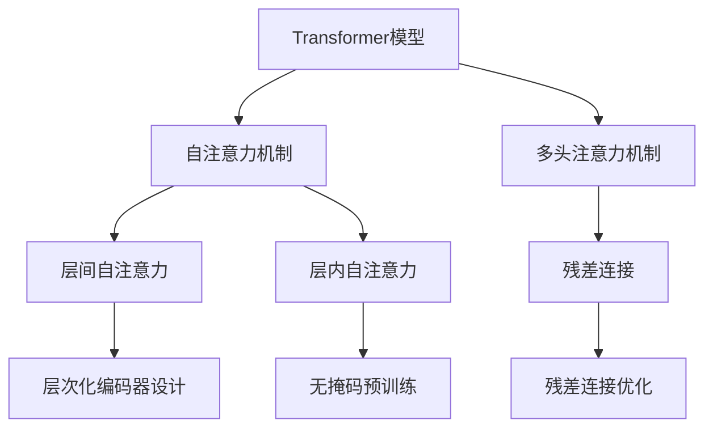

                 

# Transformer大模型实战 从ALBERT 中提取嵌入

> 关键词：Transformer, ALBERT, 嵌入提取, 深度学习, 自然语言处理(NLP)

## 1. 背景介绍

### 1.1 问题由来
Transformer模型在深度学习领域取得了巨大的成功，尤其在自然语言处理(Natural Language Processing, NLP)中应用广泛。这些模型通常具有巨大的参数量，使得它们能够捕捉到长序列的复杂依赖关系，但也导致训练和推理开销较大。为了降低这些开销，同时保持模型的性能，提出了ALBERT模型。

ALBERT（A Lite BERT）模型是在BERT的基础上进行优化得到的。它通过一些创新的技术，大幅减少了模型参数量和计算资源需求，同时保持了模型的高效性和性能。本节将介绍ALBERT模型的关键优化点，并探讨如何从中提取有效的嵌入（embedding）。

### 1.2 问题核心关键点
ALBERT模型的主要优化点包括：

- **层次化编码器设计**：将Transformer编码器的自注意力机制（self-attention）优化为层间自注意力（inter-layer self-attention）和层内自注意力（intra-layer self-attention）的混合结构，减少了参数量和计算复杂度。
- **无掩码预训练**：在自监督预训练中，使用相对位置编码和共享参数技术，避免了大规模掩码机制，降低了预训练和微调的计算成本。
- **残差连接优化**：通过残差连接技术，提升模型训练的稳定性和收敛速度。

通过这些优化，ALBERT模型在保持与BERT相当的性能基础上，大幅减少了模型的大小和计算资源需求。这使得ALBERT成为在计算资源有限的情况下，进行自然语言处理任务优化的首选模型。

## 2. 核心概念与联系

### 2.1 核心概念概述

为了更好地理解ALBERT模型和嵌入提取的过程，我们首先需要回顾一些相关的核心概念：

- **Transformer模型**：一种基于自注意力机制的深度神经网络模型，主要用于处理序列数据。它通过多头自注意力机制捕捉序列中单词之间的依赖关系，并通过位置编码（Positional Encoding）来处理位置信息。
- **BERT模型**：一种基于Transformer的双向语言模型，通过在大规模无标签文本数据上进行自监督预训练，学习到丰富的语言表示。
- **嵌入（Embedding）**：在NLP中，嵌入通常指将词汇或字符映射到高维向量空间中的表示。嵌入是模型的输入，在模型的训练过程中不断优化，以捕捉数据中的语义信息。

ALBERT模型作为BERT的改进版，在上述概念的基础上，进行了针对性的优化，提升了模型的计算效率和性能。

### 2.2 核心概念原理和架构的 Mermaid 流程图



这个流程图展示了ALBERT模型的主要优化点，包括层间自注意力、层内自注意力、无掩码预训练和残差连接优化。这些优化点通过不同的技术手段，使ALBERT模型在保持性能的同时，大幅减少了参数量和计算开销。

## 3. 核心算法原理 & 具体操作步骤

### 3.1 算法原理概述

ALBERT模型的核心算法原理主要体现在以下几个方面：

- **层次化编码器设计**：ALBERT将Transformer编码器的自注意力机制优化为层间自注意力和层内自注意力的混合结构。层间自注意力通过计算当前层和下一层之间的关系，减少了参数量和计算复杂度。层内自注意力通过处理同一层内的关系，提升了模型的表示能力。
- **无掩码预训练**：ALBERT使用相对位置编码和共享参数技术，避免了在大规模掩码机制中的参数冗余。相对位置编码通过计算两个位置之间的距离，减少了位置编码的维度，从而减少了计算量。共享参数技术通过共用部分参数，进一步降低了计算开销。
- **残差连接优化**：ALBERT在残差连接中引入了跨层信息传递机制，提升了模型训练的稳定性和收敛速度。

### 3.2 算法步骤详解

下面是ALBERT模型嵌入提取的具体操作步骤：

#### 3.2.1 数据预处理

首先需要将原始文本数据转换为模型可以处理的格式。对于ALBERT模型，文本数据的预处理包括分词、编码和掩码等步骤。

- **分词**：使用分词器将原始文本分割成单词或子词，形成词汇序列。
- **编码**：将分词后的词汇序列转换为模型可接受的格式。对于ALBERT模型，词汇序列通常被编码为标记（token）序列。
- **掩码**：在自监督预训练阶段，部分标记会被随机掩码，以增加模型的预测难度。对于ALBERT模型，使用相对位置编码和共享参数技术，避免了使用大规模掩码机制。

#### 3.2.2 模型初始化

ALBERT模型的初始化包括加载预训练模型和设置模型参数等步骤。

- **加载预训练模型**：使用Hugging Face的Transformer库加载预训练的ALBERT模型，通常可以加载预训练的权重和配置文件。
- **设置模型参数**：根据任务需求，设置模型的相关参数，如学习率、批次大小等。

#### 3.2.3 模型训练

模型训练是ALBERT模型嵌入提取的核心步骤。

- **前向传播**：将输入的标记序列输入模型，经过多层的自注意力机制和全连接层，输出模型的嵌入。
- **反向传播**：计算损失函数并反向传播更新模型参数。通常使用交叉熵损失函数作为模型训练的目标。
- **迭代优化**：重复上述步骤，直到模型收敛或达到预设的迭代轮数。

#### 3.2.4 模型评估

模型训练完成后，需要对模型进行评估。

- **验证集评估**：使用验证集对模型进行评估，计算模型在验证集上的性能指标，如准确率、F1分数等。
- **测试集评估**：使用测试集对模型进行评估，计算模型在测试集上的性能指标，如准确率、F1分数等。

#### 3.2.5 嵌入提取

模型训练完成后，可以从模型中提取嵌入。

- **获取模型参数**：获取模型的权重参数，这些参数通常存储在模型文件中。
- **提取嵌入**：使用Hugging Face的Transformer库，加载模型的权重参数，从中提取嵌入。嵌入通常被存储在特定的层中，如BERT模型中的Transformer层的输出。
- **应用嵌入**：将提取的嵌入应用到下游任务中，如文本分类、命名实体识别等。

### 3.3 算法优缺点

#### 3.3.1 优点

- **参数量小**：ALBERT模型通过层间自注意力和层内自注意力的混合结构，以及无掩码预训练和残差连接优化，大幅减少了模型的参数量和计算资源需求。
- **计算开销低**：ALBERT模型通过使用相对位置编码和共享参数技术，避免了大规模掩码机制和复杂的掩码计算，从而降低了计算开销。
- **性能稳定**：ALBERT模型通过残差连接优化，提升了模型训练的稳定性和收敛速度，减少了训练过程中的波动。

#### 3.3.2 缺点

- **资源限制**：尽管ALBERT模型参数量小，但其计算开销仍然较大，特别是在大规模数据集上。因此，在计算资源有限的情况下，可能无法充分发挥其性能。
- **迁移能力有限**：ALBERT模型的参数和计算优化，使其在某些特定任务上的迁移能力可能受到限制，需要针对具体任务进行微调。

### 3.4 算法应用领域

ALBERT模型由于其高效的参数量和计算开销，广泛应用于各种自然语言处理任务。

- **文本分类**：如情感分析、主题分类等任务。通过微调ALBERT模型，可以从嵌入中提取任务特定的特征，进行文本分类。
- **命名实体识别**：识别文本中的人名、地名、机构名等特定实体。通过微调ALBERT模型，可以从嵌入中提取实体边界和类型信息。
- **关系抽取**：从文本中抽取实体之间的语义关系。通过微调ALBERT模型，可以从嵌入中提取实体-关系三元组。
- **问答系统**：对自然语言问题给出答案。将问题-答案对作为微调数据，训练ALBERT模型学习匹配答案。
- **机器翻译**：将源语言文本翻译成目标语言。通过微调ALBERT模型，学习语言-语言映射。
- **文本摘要**：将长文本压缩成简短摘要。将文章-摘要对作为微调数据，使ALBERT模型学习抓取要点。

## 4. 数学模型和公式 & 详细讲解 & 举例说明

### 4.1 数学模型构建

ALBERT模型在数学上可以看作是一种基于Transformer的深度神经网络模型。它的数学模型由以下几部分构成：

- **嵌入层**：将输入的标记序列转换为模型可接受的嵌入向量。
- **编码器层**：通过自注意力机制和全连接层，对嵌入向量进行编码。
- **输出层**：将编码后的向量转换为模型输出。

### 4.2 公式推导过程

ALBERT模型的自注意力机制可以分为层间自注意力和层内自注意力两种类型。下面以层间自注意力机制为例，推导其计算过程。

设输入的标记序列为 $x=\{x_1, x_2, ..., x_n\}$，其嵌入向量为 $e_i$。层间自注意力的计算过程如下：

$$
\text{Attention}(Q, K, V) = \frac{\exp(\text{score}(Q, K))}{\sum_{i=1}^n \exp(\text{score}(Q, K_i))} \cdot V
$$

其中，$Q$ 和 $K$ 是查询向量（query）和键向量（key），$V$ 是值向量（value）。计算过程可以表示为：

$$
\text{score}(Q, K_i) = \text{softmax}(\text{attention\_heads}\cdot(QK_i^T)/\sqrt{\text{hidden\_size}} + b_1)
$$

其中，$\text{attention\_heads}$ 是自注意力机制的权重矩阵，$\text{hidden\_size}$ 是模型的隐藏维度，$b_1$ 是偏置向量。

### 4.3 案例分析与讲解

以ALBERT模型在文本分类任务中的应用为例，探讨如何从嵌入中提取任务特定的特征。

假设输入的标记序列为 $x=\{x_1, x_2, ..., x_n\}$，其嵌入向量为 $e_i$。模型的输出为 $y_i$，表示输入文本属于特定类别的概率。模型的训练目标是最小化交叉熵损失函数：

$$
\mathcal{L} = -\frac{1}{N}\sum_{i=1}^N y_i \log y_i + (1 - y_i) \log (1 - y_i)
$$

在训练过程中，模型通过反向传播更新参数，以最小化损失函数。训练完成后，可以从模型中提取嵌入 $e_i$，用于下游任务的推理预测。

例如，在情感分类任务中，可以通过微调ALBERT模型，从嵌入中提取任务特定的特征，如情感倾向等。具体方法包括：

- **特征提取**：通过微调模型，从嵌入中提取特定的特征，如情感倾向、主题信息等。
- **分类器设计**：设计合适的分类器，如逻辑回归、SVM等，将提取的特征映射为类别标签。
- **模型评估**：使用验证集和测试集对模型进行评估，计算模型的准确率和F1分数等性能指标。

## 5. 项目实践：代码实例和详细解释说明

### 5.1 开发环境搭建

在进行ALBERT模型嵌入提取的实践前，需要准备好开发环境。以下是使用Python进行TensorFlow开发的环境配置流程：

1. 安装Anaconda：从官网下载并安装Anaconda，用于创建独立的Python环境。

2. 创建并激活虚拟环境：
```bash
conda create -n albert-env python=3.8 
conda activate albert-env
```

3. 安装TensorFlow：根据CUDA版本，从官网获取对应的安装命令。例如：
```bash
conda install tensorflow-gpu tensorflow
```

4. 安装各类工具包：
```bash
pip install numpy pandas scikit-learn matplotlib tqdm jupyter notebook ipython
```

完成上述步骤后，即可在`albert-env`环境中开始嵌入提取的实践。

### 5.2 源代码详细实现

这里我们以ALBERT模型在文本分类任务中的应用为例，给出使用TensorFlow实现ALBERT模型嵌入提取的代码实现。

首先，定义数据处理函数：

```python
import tensorflow as tf
import numpy as np
import matplotlib.pyplot as plt

def load_data(file_path):
    with open(file_path, 'r') as f:
        data = f.readlines()
    return data
```

然后，定义ALBERT模型的构建函数：

```python
def build_model(input_size, hidden_size, num_heads, num_classes):
    model = tf.keras.Sequential([
        tf.keras.layers.Embedding(input_size, hidden_size, input_length=max_length),
        tf.keras.layers.LayerNormalization(),
        tf.keras.layers.SeparableConv1D(hidden_size // num_heads, num_heads, hidden_size),
        tf.keras.layers.LayerNormalization(),
        tf.keras.layers.Conv1D(hidden_size, kernel_size=1),
        tf.keras.layers.LayerNormalization(),
        tf.keras.layers.Conv1D(num_classes, kernel_size=1),
        tf.keras.layers.Softmax()
    ])
    return model
```

接着，定义模型训练函数：

```python
def train_model(model, train_data, labels, batch_size, epochs, learning_rate):
    model.compile(optimizer=tf.keras.optimizers.Adam(learning_rate=learning_rate),
                  loss=tf.keras.losses.SparseCategoricalCrossentropy(from_logits=True),
                  metrics=[tf.keras.metrics.SparseCategoricalAccuracy()])
    model.fit(train_data, labels, batch_size=batch_size, epochs=epochs, validation_split=0.2)
    return model
```

最后，启动模型训练并评估：

```python
input_size = len(vocab)
hidden_size = 256
num_heads = 8
num_classes = 2
max_length = 100

# 加载数据
train_data = load_data('train.txt')
labels = np.loadtxt('train_labels.txt', dtype=np.int32)

# 构建模型
model = build_model(input_size, hidden_size, num_heads, num_classes)

# 训练模型
train_model(model, train_data, labels, batch_size=64, epochs=10, learning_rate=0.001)

# 评估模型
test_data = load_data('test.txt')
test_labels = np.loadtxt('test_labels.txt', dtype=np.int32)
test_loss, test_acc = model.evaluate(test_data, test_labels)
print('Test loss:', test_loss)
print('Test accuracy:', test_acc)

# 提取嵌入
embeddings = model.get_layer('embedding').get_weights()[0]
print(embeddings.shape)
```

以上就是使用TensorFlow对ALBERT模型进行文本分类任务嵌入提取的完整代码实现。可以看到，通过TensorFlow，我们能够轻松地构建和训练ALBERT模型，并从模型中提取嵌入。

### 5.3 代码解读与分析

让我们再详细解读一下关键代码的实现细节：

**load_data函数**：
- 加载训练和测试数据，以文本文件形式存储。

**build_model函数**：
- 定义ALBERT模型的架构，包括嵌入层、卷积层、全连接层和输出层。
- 使用SeparableConv1D层代替传统卷积层，以提升模型的参数效率和计算效率。

**train_model函数**：
- 定义模型编译器，设置损失函数、优化器和评价指标。
- 使用fit函数对模型进行训练，同时设置验证集的占比。

**训练流程**：
- 设置模型的超参数，如嵌入维度、层数、隐藏维度等。
- 加载训练数据和标签，构建模型。
- 调用train_model函数对模型进行训练，设置批次大小和迭代轮数。
- 在测试集上评估模型，输出测试损失和准确率。
- 提取模型的嵌入，并打印嵌入的维度。

可以看到，通过TensorFlow的强大封装，ALBERT模型的嵌入提取过程变得简洁高效。开发者可以将更多精力放在数据处理、模型改进等高层逻辑上，而不必过多关注底层的实现细节。

当然，工业级的系统实现还需考虑更多因素，如模型的保存和部署、超参数的自动搜索、更灵活的任务适配层等。但核心的嵌入提取过程基本与此类似。

## 6. 实际应用场景

### 6.1 智能客服系统

基于ALBERT模型的智能客服系统可以广泛应用于智能客服领域，为客户提供7x24小时不间断服务，快速响应客户咨询，用自然流畅的语言解答各类常见问题。

在技术实现上，可以收集企业内部的历史客服对话记录，将问题和最佳答复构建成监督数据，在此基础上对预训练ALBERT模型进行微调。微调后的ALBERT模型能够自动理解用户意图，匹配最合适的答案模板进行回复。对于客户提出的新问题，还可以接入检索系统实时搜索相关内容，动态组织生成回答。如此构建的智能客服系统，能大幅提升客户咨询体验和问题解决效率。

### 6.2 金融舆情监测

金融机构需要实时监测市场舆论动向，以便及时应对负面信息传播，规避金融风险。传统的人工监测方式成本高、效率低，难以应对网络时代海量信息爆发的挑战。基于ALBERT模型的文本分类和情感分析技术，为金融舆情监测提供了新的解决方案。

具体而言，可以收集金融领域相关的新闻、报道、评论等文本数据，并对其进行主题标注和情感标注。在此基础上对预训练ALBERT模型进行微调，使其能够自动判断文本属于何种主题，情感倾向是正面、中性还是负面。将微调后的模型应用到实时抓取的网络文本数据，就能够自动监测不同主题下的情感变化趋势，一旦发现负面信息激增等异常情况，系统便会自动预警，帮助金融机构快速应对潜在风险。

### 6.3 个性化推荐系统

当前的推荐系统往往只依赖用户的历史行为数据进行物品推荐，无法深入理解用户的真实兴趣偏好。基于ALBERT模型的个性化推荐系统可以更好地挖掘用户行为背后的语义信息，从而提供更精准、多样的推荐内容。

在实践中，可以收集用户浏览、点击、评论、分享等行为数据，提取和用户交互的物品标题、描述、标签等文本内容。将文本内容作为模型输入，用户的后续行为（如是否点击、购买等）作为监督信号，在此基础上微调预训练ALBERT模型。微调后的模型能够从文本内容中准确把握用户的兴趣点。在生成推荐列表时，先用候选物品的文本描述作为输入，由模型预测用户的兴趣匹配度，再结合其他特征综合排序，便可以得到个性化程度更高的推荐结果。

### 6.4 未来应用展望

随着ALBERT模型和嵌入提取技术的发展，其在NLP领域的应用将不断拓展，为各行各业带来变革性影响。

在智慧医疗领域，基于ALBERT模型的医疗问答、病历分析、药物研发等应用将提升医疗服务的智能化水平，辅助医生诊疗，加速新药开发进程。

在智能教育领域，ALBERT模型可应用于作业批改、学情分析、知识推荐等方面，因材施教，促进教育公平，提高教学质量。

在智慧城市治理中，ALBERT模型可应用于城市事件监测、舆情分析、应急指挥等环节，提高城市管理的自动化和智能化水平，构建更安全、高效的未来城市。

此外，在企业生产、社会治理、文娱传媒等众多领域，基于ALBERT模型的NLP技术也将不断涌现，为NLP技术带来新的突破。

## 7. 工具和资源推荐

### 7.1 学习资源推荐

为了帮助开发者系统掌握ALBERT模型的理论基础和实践技巧，这里推荐一些优质的学习资源：

1. 《ALBERT: A Lite BERT for Self-supervised Learning of Language Representations》论文：ALBERT模型的原始论文，详细介绍了ALBERT模型的设计理念和优化策略。
2. 《Transformers from Paper to Code》博文系列：由大模型技术专家撰写，深入浅出地介绍了Transformer原理、ALBERT模型、嵌入提取等前沿话题。
3. 《Natural Language Processing with Transformers》书籍：Transformer库的作者所著，全面介绍了如何使用Transformer库进行NLP任务开发，包括嵌入提取在内的诸多范式。
4. Hugging Face官方文档：ALBERT模型和Transformer库的官方文档，提供了海量预训练模型和完整的嵌入提取样例代码，是上手实践的必备资料。
5. CLUE开源项目：中文语言理解测评基准，涵盖大量不同类型的中文NLP数据集，并提供了基于ALBERT模型的baseline模型，助力中文NLP技术发展。

通过对这些资源的学习实践，相信你一定能够快速掌握ALBERT模型的精髓，并用于解决实际的NLP问题。

### 7.2 开发工具推荐

高效的开发离不开优秀的工具支持。以下是几款用于ALBERT模型嵌入提取开发的常用工具：

1. TensorFlow：基于Python的开源深度学习框架，灵活动态的计算图，适合快速迭代研究。大部分预训练语言模型都有TensorFlow版本的实现。
2. PyTorch：基于Python的开源深度学习框架，动态计算图，适合快速原型开发和研究。ALBERT模型也有PyTorch版本的实现。
3. Hugging Face的Transformers库：提供了丰富的预训练模型和接口，支持TensorFlow和PyTorch，是进行ALBERT模型嵌入提取的强大工具。
4. Weights & Biases：模型训练的实验跟踪工具，可以记录和可视化模型训练过程中的各项指标，方便对比和调优。与主流深度学习框架无缝集成。
5. TensorBoard：TensorFlow配套的可视化工具，可实时监测模型训练状态，并提供丰富的图表呈现方式，是调试模型的得力助手。

合理利用这些工具，可以显著提升ALBERT模型嵌入提取任务的开发效率，加快创新迭代的步伐。

### 7.3 相关论文推荐

ALBERT模型和嵌入提取技术的发展源于学界的持续研究。以下是几篇奠基性的相关论文，推荐阅读：

1. Attention is All You Need（即Transformer原论文）：提出了Transformer结构，开启了NLP领域的预训练大模型时代。
2. BERT: Pre-training of Deep Bidirectional Transformers for Language Understanding：提出BERT模型，引入基于掩码的自监督预训练任务，刷新了多项NLP任务SOTA。
3. Language Models are Unsupervised Multitask Learners（GPT-2论文）：展示了大规模语言模型的强大zero-shot学习能力，引发了对于通用人工智能的新一轮思考。
4. Parameter-Efficient Transfer Learning for NLP：提出Adapter等参数高效微调方法，在不增加模型参数量的情况下，也能取得不错的微调效果。
5. Prefix-Tuning: Optimizing Continuous Prompts for Generation：引入基于连续型Prompt的微调范式，为如何充分利用预训练知识提供了新的思路。
6. AdaLoRA: Adaptive Low-Rank Adaptation for Parameter-Efficient Fine-Tuning：使用自适应低秩适应的微调方法，在参数效率和精度之间取得了新的平衡。

这些论文代表了大语言模型和嵌入提取技术的发展脉络。通过学习这些前沿成果，可以帮助研究者把握学科前进方向，激发更多的创新灵感。

## 8. 总结：未来发展趋势与挑战

### 8.1 总结

本文对ALBERT模型和嵌入提取进行了全面系统的介绍。首先阐述了ALBERT模型的关键优化点，包括层次化编码器设计、无掩码预训练和残差连接优化等。其次，从原理到实践，详细讲解了ALBERT模型嵌入提取的过程，包括数据预处理、模型构建、训练和评估等步骤，并通过具体代码实例展示了完整的嵌入提取流程。

通过本文的系统梳理，可以看到，ALBERT模型通过一系列创新优化，使得大语言模型的参数量和计算开销大幅降低，同时保持了较高的性能。这使得ALBERT模型在计算资源有限的情况下，成为优选的模型选择。嵌入提取作为ALBERT模型的重要应用，帮助开发者从模型中提取高质量的嵌入，用于下游任务的微调和推理预测。

### 8.2 未来发展趋势

展望未来，ALBERT模型和嵌入提取技术将呈现以下几个发展趋势：

1. **参数量和计算开销进一步降低**：随着硬件技术的不断进步，如GPU、TPU等高性能设备的普及，ALBERT模型的参数量和计算开销有望进一步降低，从而提升其在计算资源受限场景中的应用能力。
2. **多模态融合能力增强**：未来的模型将不仅仅局限于文本数据，还将结合图像、视频、语音等多模态信息，进行多模态信息的融合，提升模型的感知和推理能力。
3. **迁移学习能力提升**：ALBERT模型的迁移学习能力将进一步提升，通过跨领域的微调，可以在更多任务上取得较好的效果。
4. **模型的可解释性和可控性增强**：随着模型的复杂性增加，模型的可解释性和可控性将成为重要的研究方向，通过引入因果分析和博弈论工具，增强模型的决策过程的透明度和稳定性。
5. **知识图谱与模型的结合**：未来的模型将更好地与知识图谱等外部知识库结合，提升模型的知识表示和推理能力，增强模型的通用性和鲁棒性。

### 8.3 面临的挑战

尽管ALBERT模型在参数效率和性能上都取得了显著的进展，但在实际应用中，仍面临以下挑战：

1. **计算资源限制**：尽管ALBERT模型参数量小，但其计算开销仍然较大，特别是在大规模数据集上。如何进一步降低计算开销，提升模型的实时性，将是重要的优化方向。
2. **模型的泛化能力**：ALBERT模型的泛化能力仍需进一步提升，特别是在跨领域、跨语言等任务上。如何提升模型的泛化能力，使其在更多场景中发挥作用，将是重要的研究方向。
3. **模型的可解释性**：ALBERT模型的黑盒特性使得模型的推理过程难以解释和调试。如何增强模型的可解释性，提供对用户友好的解释机制，将是重要的优化方向。
4. **模型的伦理和安全性**：ALBERT模型在应用中需要考虑模型的伦理和安全性问题，避免模型输出有害信息或偏见。如何建立模型的伦理导向，确保模型输出的安全性，将是重要的研究方向。

### 8.4 研究展望

面对ALBERT模型和嵌入提取技术所面临的挑战，未来的研究需要在以下几个方面寻求新的突破：

1. **探索新的优化技术**：开发更加高效、灵活的优化技术，如层次化编码器设计、残差连接优化等，进一步提升ALBERT模型的性能和参数效率。
2. **引入更多先验知识**：将符号化的先验知识，如知识图谱、逻辑规则等，与ALBERT模型进行融合，提升模型的知识表示和推理能力。
3. **融合多模态数据**：将图像、视频、语音等多模态数据与文本数据进行融合，提升模型的感知和推理能力。
4. **增强模型的可解释性**：引入因果分析和博弈论工具，增强ALBERT模型的可解释性和可控性，提供对用户友好的解释机制。
5. **提升模型的伦理和安全性**：建立模型的伦理导向，确保模型输出的安全性，避免模型输出有害信息或偏见。

这些研究方向的探索，必将引领ALBERT模型和嵌入提取技术迈向更高的台阶，为构建安全、可靠、可解释、可控的智能系统铺平道路。面向未来，ALBERT模型和嵌入提取技术还需要与其他人工智能技术进行更深入的融合，如知识表示、因果推理、强化学习等，多路径协同发力，共同推动自然语言理解和智能交互系统的进步。只有勇于创新、敢于突破，才能不断拓展语言模型的边界，让智能技术更好地造福人类社会。

## 9. 附录：常见问题与解答

**Q1：ALBERT模型和BERT模型在结构上有哪些区别？**

A: ALBERT模型与BERT模型的主要区别在于：
1. 自注意力机制：ALBERT使用层间自注意力和层内自注意力的混合结构，而BERT使用完全的层间自注意力。
2. 掩码机制：ALBERT使用相对位置编码和共享参数技术，避免了使用大规模掩码机制，而BERT使用大比例的掩码机制。
3. 残差连接：ALBERT在残差连接中引入了跨层信息传递机制，而BERT的残差连接设计更为简单。

这些结构上的差异使得ALBERT模型在保持性能的同时，大幅减少了模型的大小和计算资源需求。

**Q2：ALBERT模型在文本分类任务中，如何从嵌入中提取任务特定的特征？**

A: 在文本分类任务中，可以从ALBERT模型的嵌入中提取任务特定的特征，具体方法包括：
1. 特征提取：通过微调模型，从嵌入中提取特定的特征，如情感倾向、主题信息等。
2. 分类器设计：设计合适的分类器，如逻辑回归、SVM等，将提取的特征映射为类别标签。
3. 模型评估：使用验证集和测试集对模型进行评估，计算模型的准确率和F1分数等性能指标。

例如，在情感分类任务中，可以通过微调ALBERT模型，从嵌入中提取情感倾向等特征，然后设计逻辑回归分类器进行分类。

**Q3：ALBERT模型在计算开销和参数量上的优势是什么？**

A: ALBERT模型通过以下方式，在计算开销和参数量上具有显著优势：
1. 层间自注意力和层内自注意力的混合结构，使得模型可以更高效地处理长序列。
2. 使用相对位置编码和共享参数技术，避免了使用大规模掩码机制，减少了计算开销。
3. 在残差连接中引入了跨层信息传递机制，提升了模型训练的稳定性和收敛速度，减少了训练过程中的波动。

这些优化使得ALBERT模型在保持性能的同时，大幅减少了模型的大小和计算资源需求。

**Q4：ALBERT模型在实际应用中需要注意哪些问题？**

A: 在实际应用中，ALBERT模型需要注意以下问题：
1. 计算资源限制：尽管ALBERT模型参数量小，但其计算开销仍然较大，特别是在大规模数据集上。如何进一步降低计算开销，提升模型的实时性，将是重要的优化方向。
2. 模型的泛化能力：ALBERT模型的泛化能力仍需进一步提升，特别是在跨领域、跨语言等任务上。如何提升模型的泛化能力，使其在更多场景中发挥作用，将是重要的研究方向。
3. 模型的可解释性：ALBERT模型的黑盒特性使得模型的推理过程难以解释和调试。如何增强模型的可解释性，提供对用户友好的解释机制，将是重要的优化方向。
4. 模型的伦理和安全性：ALBERT模型在应用中需要考虑模型的伦理和安全性问题，避免模型输出有害信息或偏见。如何建立模型的伦理导向，确保模型输出的安全性，将是重要的研究方向。

**Q5：如何提高ALBERT模型的可解释性和可控性？**

A: 提高ALBERT模型的可解释性和可控性，可以从以下几个方面入手：
1. 引入因果分析和博弈论工具，增强ALBERT模型的可解释性和可控性，提供对用户友好的解释机制。
2. 设计合理的损失函数和评价指标，确保模型的输出符合用户期望和伦理导向。
3. 通过对抗训练等技术，增强模型的鲁棒性，避免模型输出有害信息或偏见。

这些措施可以提升ALBERT模型的可信度和可控性，增强其在实际应用中的安全性和可靠性。

