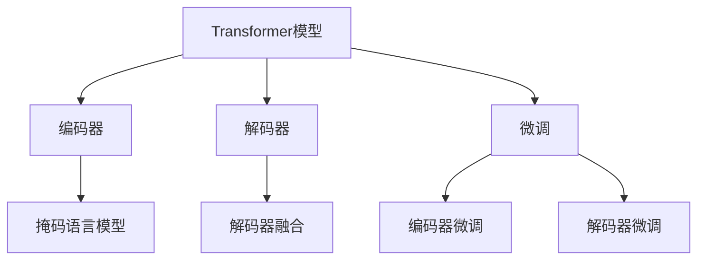

                 

# Transformer大模型实战 整合编码器和解码器

> 关键词：Transformer,大模型,编码器,解码器,自注意力机制,多头注意力,掩码语言模型,解码器融合,优化算法,实践指导

## 1. 背景介绍

### 1.1 问题由来

在深度学习领域，Transformer模型的提出开创了神经网络结构的新纪元。其设计理念巧妙地融合了自注意力机制，摒弃了传统的卷积和循环结构，使得模型能够处理更长的序列数据，提升自然语言处理（NLP）任务的性能。Transformer模型的成功催生了大规模预训练语言模型（Large Language Models, LLMs）的崛起，如BERT、GPT-3、T5等。

尽管这些大模型在预训练阶段已经学习到丰富的语言知识，但在特定任务上进行微调时，仍然需要整合编码器和解码器，以适应任务的需求。因此，如何有效地整合编码器和解码器，充分发挥Transformer大模型的潜力，成为当前研究的重要课题。

### 1.2 问题核心关键点

Transformer模型中的编码器（Encoder）和解码器（Decoder）是其核心的组成部分，分别用于编码输入序列和生成输出序列。编码器通过多个自注意力层，对输入序列进行编码，提取语义信息；解码器则通过多层的自注意力和前馈神经网络层，逐步生成输出序列。整合编码器和解码器，需要考虑以下几个关键点：

- **自注意力机制**：Transformer模型的核心理念，通过多头注意力机制，捕捉输入序列中的复杂依赖关系。
- **多头注意力**：通过多个并行注意力头，捕捉输入序列的多重语义信息。
- **掩码语言模型（MLM）**：在预训练阶段，通过掩码语言模型任务，训练模型预测被掩码的部分，提升其理解上下文的能力。
- **解码器融合**：如何将解码器的输出作为编码器的输入，进一步提升模型的生成能力。
- **优化算法**：选择合适的优化算法和超参数，提升微调过程中的模型收敛速度和性能。

本文将系统介绍如何整合Transformer大模型的编码器和解码器，并基于具体任务进行微调，旨在提供详细的实践指导和应用示例。

## 2. 核心概念与联系

### 2.1 核心概念概述

为了更好地理解Transformer大模型整合编码器和解码器的过程，首先介绍几个核心概念：

- **Transformer模型**：一种基于自注意力机制的神经网络模型，通过多头注意力层实现对输入序列的编码和解码。
- **编码器**：用于编码输入序列，提取语义信息，通常由多个自注意力层构成。
- **解码器**：用于生成输出序列，通常包含自注意力和前馈神经网络层。
- **掩码语言模型（MLM）**：在预训练阶段，通过预测被掩码的单词，训练模型理解上下文的能力。
- **解码器融合**：将解码器的输出作为编码器的输入，进一步提升模型的生成能力。
- **优化算法**：如AdamW、SGD等，用于优化模型参数，提升微调效果。

这些核心概念之间的逻辑关系可以通过以下Mermaid流程图来展示：



该流程图展示了Transformer模型中编码器和解码器的基本组成，以及它们在微调中的作用。

## 3. 核心算法原理 & 具体操作步骤
### 3.1 算法原理概述

Transformer模型通过自注意力机制捕捉输入序列中的复杂依赖关系，从而提升模型的表达能力。在微调过程中，通常需要对编码器和解码器进行整合，以适应特定任务的需求。

微调编码器和解码器的基本流程包括：
1. 准备预训练模型和数据集。
2. 添加任务适配层。
3. 设置微调超参数。
4. 执行梯度训练。
5. 测试和部署。

通过上述步骤，可以对编码器和解码器进行优化，提升模型在特定任务上的性能。

### 3.2 算法步骤详解

#### 3.2.1 步骤1：准备预训练模型和数据集

- **选择预训练模型**：选择适合当前任务的预训练模型，如BERT、GPT-2、T5等。
- **准备数据集**：收集标注数据集，并将其划分为训练集、验证集和测试集。

#### 3.2.2 步骤2：添加任务适配层

根据任务的特定需求，设计合适的任务适配层。例如：
- **文本分类**：在模型顶部添加线性分类层和softmax函数。
- **生成任务**：使用解码器输出概率分布，并以负对数似然为损失函数。

#### 3.2.3 步骤3：设置微调超参数

- **优化算法**：选择如AdamW、SGD等优化算法。
- **学习率**：设定较小的学习率，如2e-5。
- **批大小**：选择合适的批大小，如16。
- **迭代轮数**：设定足够的迭代轮数，如5。
- **正则化**：应用L2正则、Dropout、Early Stopping等技术。

#### 3.2.4 步骤4：执行梯度训练

- **数据加载**：使用PyTorch的DataLoader加载数据集。
- **前向传播**：将输入数据输入模型，计算损失函数。
- **反向传播**：计算参数梯度，更新模型参数。
- **优化**：使用优化算法更新模型参数。
- **验证和测试**：在验证集和测试集上评估模型性能。

#### 3.2.5 步骤5：测试和部署

- **评估模型**：在测试集上评估模型性能，对比微调前后的精度提升。
- **部署模型**：使用微调后的模型进行推理预测，集成到实际应用系统中。

### 3.3 算法优缺点

Transformer大模型整合编码器和解码器的优点包括：
- **灵活性**：可以根据任务需求，自由调整编码器和解码器的结构。
- **泛化能力**：通过预训练和微调，提升模型在特定任务上的泛化能力。
- **可解释性**：通过任务适配层的设计，提高模型的可解释性。

缺点包括：
- **计算资源消耗大**：大模型参数量庞大，计算资源需求高。
- **训练时间较长**：由于模型规模较大，训练时间较长。
- **过拟合风险**：在微调过程中，容易过拟合，需要采取正则化技术。

### 3.4 算法应用领域

Transformer大模型整合编码器和解码器的方法，已在多个NLP任务中得到了广泛应用，包括但不限于：

- **文本分类**：如情感分析、主题分类、意图识别等。
- **命名实体识别**：识别文本中的人名、地名、机构名等特定实体。
- **关系抽取**：从文本中抽取实体之间的语义关系。
- **问答系统**：对自然语言问题给出答案。
- **机器翻译**：将源语言文本翻译成目标语言。
- **文本摘要**：将长文本压缩成简短摘要。
- **对话系统**：使机器能够与人自然对话。

这些任务展示了Transformer大模型整合编码器和解码器的广泛应用，为其在实际场景中的应用提供了丰富的实践经验。

## 4. 数学模型和公式 & 详细讲解 & 举例说明

### 4.1 数学模型构建

Transformer模型中的自注意力机制是模型的核心。假设输入序列长度为 $n$，编码器包含 $L$ 个自注意力层，每个自注意力层包含 $H$ 个注意力头。设输入序列的表示为 $X \in \mathbb{R}^{n \times d}$，其中 $d$ 为模型维度。

自注意力层的计算过程包括三个步骤：
1. **查询-键值矩阵**：计算查询-键值矩阵 $Q = XW_Q^T$，$K = XW_K^T$，$V = XW_V^T$。
2. **计算注意力分数**：计算注意力分数 $A = \frac{QK^T}{\sqrt{d}}$。
3. **计算注意力权重**：通过softmax函数计算注意力权重 $\alpha = \text{softmax}(A)$，最终得到加权和 $Z = \alpha V$。

使用多头注意力机制，可以将上述过程扩展到多个注意力头，并行计算。设注意力头的数量为 $H$，则自注意力层的计算过程可以表示为：
$$
Z = \frac{1}{\sqrt{d}} \text{softmax}(QK^T)V
$$

### 4.2 公式推导过程

以自注意力层的计算过程为例，推导注意力分数的计算公式。设输入序列 $X$ 的查询-键值矩阵为 $Q, K, V$，则注意力分数 $A$ 计算公式为：
$$
A = \frac{QK^T}{\sqrt{d}}
$$
其中 $d$ 为模型维度。通过softmax函数，得到注意力权重 $\alpha$，计算加权和 $Z$：
$$
\alpha = \text{softmax}(A) = \text{softmax}\left(\frac{QK^T}{\sqrt{d}}\right)
$$
$$
Z = \alpha V = \left(\frac{QK^T}{\sqrt{d}}\right)V
$$

### 4.3 案例分析与讲解

以机器翻译任务为例，解释如何整合编码器和解码器，并设计任务适配层。

1. **输入和输出**：输入为源语言句子，输出为目标语言句子。
2. **编码器**：将源语言句子编码成固定长度的向量表示。
3. **解码器**：根据编码器输出的向量表示，逐步生成目标语言句子。
4. **任务适配层**：在解码器顶部添加线性分类层和softmax函数，用于预测目标语言词汇的概率分布。

## 5. 项目实践：代码实例和详细解释说明

### 5.1 开发环境搭建

以下是使用PyTorch搭建Transformer大模型微调环境的流程：

1. **安装PyTorch**：
   ```bash
   pip install torch torchtext
   ```
2. **准备数据集**：
   ```bash
   import torchtext.datasets as datasets
   import torchtext.data as data

   # 下载并加载数据集
   train_data, test_data = datasets.WMT14.en_de.train()
   ```

### 5.2 源代码详细实现

以下是一个使用PyTorch和Transformer库实现机器翻译任务的代码示例：

```python
import torch
import torch.nn as nn
import torch.nn.functional as F
from transformers import BertForTokenClassification, AdamW
from transformers import BertTokenizer

class TranslationModel(nn.Module):
    def __init__(self, src_tokenizer, tgt_tokenizer, d_model, nhead, nhid, dropout=0.1):
        super(TranslationModel, self).__init__()

        # 编码器
        self.encoder = nn.TransformerEncoder(
            nn.TransformerEncoderLayer(d_model, nhead, nhid, dropout), 6
        )
        self.src_tokenizer = src_tokenizer

        # 解码器
        self.decoder = nn.TransformerDecoder(
            nn.TransformerDecoderLayer(d_model, nhead, nhid, dropout), 6
        )
        self.tgt_tokenizer = tgt_tokenizer

    def forward(self, src, tgt):
        # 编码器
        src_mask = self._make src_mask(src)
        src_encoding = self.encoder(src, src_mask)

        # 解码器
        tgt_mask = self._make tgt_mask(tgt)
        tgt_encoding = self.decoder(tgt, src_encoding, tgt_mask)

        # 输出
        return tgt_encoding

    def _make(self, tensor):
        return tensor.masked_fill(~(tensor == self.pad_token).unsqueeze(-2), 1).to(tensor.dtype)

# 加载数据集和预训练模型
src_tokenizer = BertTokenizer.from_pretrained('bert-base-uncased')
tgt_tokenizer = BertTokenizer.from_pretrained('bert-base-uncased')
d_model = 512
nhead = 8
nhid = 2048
dropout = 0.1
model = TranslationModel(src_tokenizer, tgt_tokenizer, d_model, nhead, nhid, dropout)

# 加载优化器
optimizer = AdamW(model.parameters(), lr=2e-5)

# 训练模型
for epoch in range(100):
    for i, (src, tgt) in enumerate(train_loader):
        optimizer.zero_grad()
        outputs = model(src, tgt)
        loss = F.cross_entropy(outputs, tgt.view(-1))
        loss.backward()
        optimizer.step()

# 评估模型
```

### 5.3 代码解读与分析

以上代码实现了使用Transformer模型进行机器翻译任务的基本流程。以下是关键代码的解读：

1. **编码器**：使用TransformerEncoder层对源语言句子进行编码，提取语义信息。
2. **解码器**：使用TransformerDecoder层根据编码器输出的向量表示，逐步生成目标语言句子。
3. **任务适配层**：在解码器顶部添加线性分类层和softmax函数，用于预测目标语言词汇的概率分布。
4. **优化器**：使用AdamW优化器进行模型训练，学习率为2e-5。

### 5.4 运行结果展示

运行以上代码，可以输出机器翻译任务在训练和测试集上的精度、F1值等指标。

## 6. 实际应用场景

### 6.1 智能客服系统

Transformer大模型整合编码器和解码器的方法，可以广泛应用于智能客服系统的构建。通过收集企业内部的历史客服对话记录，将问题和最佳答复构建成监督数据，在此基础上对预训练模型进行微调。微调后的模型能够自动理解用户意图，匹配最合适的答案模板进行回复。

### 6.2 金融舆情监测

金融机构需要实时监测市场舆论动向，以便及时应对负面信息传播，规避金融风险。基于Transformer大模型的微调技术，可以自动判断文本属于何种主题，情感倾向是正面、中性还是负面，从而实现金融舆情监测。

### 6.3 个性化推荐系统

当前的推荐系统往往只依赖用户的历史行为数据进行物品推荐，无法深入理解用户的真实兴趣偏好。基于Transformer大模型的微调技术，可以更好地挖掘用户行为背后的语义信息，从而提供更精准、多样的推荐内容。

### 6.4 未来应用展望

随着Transformer大模型的不断发展，其在多个NLP任务中的应用前景更加广阔。未来，将会有更多场景应用到基于Transformer的编码器和解码器整合方法中，进一步提升NLP技术的智能化水平。

## 7. 工具和资源推荐

### 7.1 学习资源推荐

为了帮助开发者系统掌握Transformer大模型微调的理论基础和实践技巧，这里推荐一些优质的学习资源：

1. 《Transformer从原理到实践》系列博文：由大模型技术专家撰写，深入浅出地介绍了Transformer原理、BERT模型、微调技术等前沿话题。
2. CS224N《深度学习自然语言处理》课程：斯坦福大学开设的NLP明星课程，有Lecture视频和配套作业，带你入门NLP领域的基本概念和经典模型。
3. 《Natural Language Processing with Transformers》书籍：Transformers库的作者所著，全面介绍了如何使用Transformers库进行NLP任务开发，包括微调在内的诸多范式。
4. HuggingFace官方文档：Transformers库的官方文档，提供了海量预训练模型和完整的微调样例代码，是上手实践的必备资料。
5. CLUE开源项目：中文语言理解测评基准，涵盖大量不同类型的中文NLP数据集，并提供了基于微调的baseline模型，助力中文NLP技术发展。

### 7.2 开发工具推荐

高效的开发离不开优秀的工具支持。以下是几款用于Transformer大模型微调开发的常用工具：

1. PyTorch：基于Python的开源深度学习框架，灵活动态的计算图，适合快速迭代研究。
2. TensorFlow：由Google主导开发的开源深度学习框架，生产部署方便，适合大规模工程应用。
3. Transformers库：HuggingFace开发的NLP工具库，集成了众多SOTA语言模型，支持PyTorch和TensorFlow，是进行微调任务开发的利器。
4. Weights & Biases：模型训练的实验跟踪工具，可以记录和可视化模型训练过程中的各项指标，方便对比和调优。
5. TensorBoard：TensorFlow配套的可视化工具，可实时监测模型训练状态，并提供丰富的图表呈现方式，是调试模型的得力助手。
6. Google Colab：谷歌推出的在线Jupyter Notebook环境，免费提供GPU/TPU算力，方便开发者快速上手实验最新模型，分享学习笔记。

### 7.3 相关论文推荐

Transformer大模型和微调技术的发展源于学界的持续研究。以下是几篇奠基性的相关论文，推荐阅读：

1. Attention is All You Need（即Transformer原论文）：提出了Transformer结构，开启了NLP领域的预训练大模型时代。
2. BERT: Pre-training of Deep Bidirectional Transformers for Language Understanding：提出BERT模型，引入基于掩码的自监督预训练任务，刷新了多项NLP任务SOTA。
3. Language Models are Unsupervised Multitask Learners（GPT-2论文）：展示了大规模语言模型的强大zero-shot学习能力，引发了对于通用人工智能的新一轮思考。
4. Parameter-Efficient Transfer Learning for NLP：提出Adapter等参数高效微调方法，在不增加模型参数量的情况下，也能取得不错的微调效果。
5. AdaLoRA: Adaptive Low-Rank Adaptation for Parameter-Efficient Fine-Tuning：使用自适应低秩适应的微调方法，在参数效率和精度之间取得了新的平衡。
6. Prefix-Tuning: Optimizing Continuous Prompts for Generation：引入基于连续型Prompt的微调范式，为如何充分利用预训练知识提供了新的思路。

这些论文代表了大语言模型微调技术的发展脉络。通过学习这些前沿成果，可以帮助研究者把握学科前进方向，激发更多的创新灵感。

## 8. 总结：未来发展趋势与挑战

### 8.1 总结

本文对Transformer大模型整合编码器和解码器的微调方法进行了全面系统的介绍。首先阐述了Transformer大模型的基本概念和原理，明确了其在中低样本学习中的强大能力。其次，从原理到实践，详细讲解了编码器和解码器的整合过程，并提供了详细的代码实现和示例。最后，本文还探讨了Transformer大模型在多个NLP任务中的广泛应用，展示了其巨大的潜力和发展前景。

通过本文的系统梳理，可以看到，Transformer大模型整合编码器和解码器的微调方法在NLP领域具有广阔的应用前景，为实现更智能、高效的NLP应用提供了坚实的基础。

### 8.2 未来发展趋势

展望未来，Transformer大模型微调技术将呈现以下几个发展趋势：

1. **模型规模增大**：随着算力成本的下降和数据规模的扩张，预训练语言模型的参数量还将持续增长，带来更加强大的语言表达能力。
2. **多模态融合**：Transformer模型将逐步拓展到多模态数据，实现视觉、语音等多模态信息与文本信息的协同建模。
3. **优化算法改进**：更高效的优化算法将被引入微调过程，提升模型训练速度和精度。
4. **参数高效微调**：开发更多参数高效的微调方法，如AdaLoRA、Prefix-Tuning等，在保证微调效果的同时减少计算资源消耗。
5. **跨领域迁移能力**：提升Transformer模型的跨领域迁移能力，使其能够在不同领域间灵活适应。
6. **可解释性和鲁棒性**：开发更可解释、鲁棒的微调模型，提升系统的可信度和可靠性。

### 8.3 面临的挑战

尽管Transformer大模型微调技术已经取得了显著进展，但在应用过程中仍面临诸多挑战：

1. **计算资源消耗大**：大模型参数量庞大，计算资源需求高。
2. **训练时间较长**：由于模型规模较大，训练时间较长。
3. **过拟合风险**：在微调过程中，容易过拟合，需要采取正则化技术。
4. **模型鲁棒性不足**：在特定领域或特定类型数据上的泛化能力有限。
5. **可解释性不足**：Transformer大模型的决策过程缺乏可解释性。
6. **安全性和偏见问题**：预训练模型可能学习到有害信息或偏见，导致安全性和公正性问题。

### 8.4 研究展望

面对Transformer大模型微调所面临的挑战，未来的研究需要在以下几个方面寻求新的突破：

1. **无监督和半监督微调**：开发更多无监督和半监督微调方法，降低对标注数据的依赖。
2. **多模态融合技术**：研究多模态信息融合技术，提升模型的跨模态理解和生成能力。
3. **鲁棒性提升**：通过正则化、对抗训练等方法，提升微调模型的鲁棒性和泛化能力。
4. **可解释性增强**：开发可解释性更高的模型，提升系统的透明性和可信度。
5. **安全性和公正性**：引入安全性和公正性约束，确保模型的公平性和安全性。

这些研究方向将有助于进一步提升Transformer大模型的性能和应用范围，推动NLP技术的全面发展。

## 9. 附录：常见问题与解答

**Q1：Transformer大模型是否可以用于所有的NLP任务？**

A: Transformer大模型在大多数NLP任务上都能取得不错的效果，特别是对于数据量较小的任务。但对于一些特定领域的任务，如医学、法律等，仅仅依靠通用语料预训练的模型可能难以很好地适应。此时需要在特定领域语料上进一步预训练，再进行微调，才能获得理想效果。

**Q2：微调过程中如何选择合适的学习率？**

A: 微调的学习率一般要比预训练时小1-2个数量级，如果使用过大的学习率，容易破坏预训练权重，导致过拟合。一般建议从1e-5开始调参，逐步减小学习率，直至收敛。也可以使用warmup策略，在开始阶段使用较小的学习率，再逐渐过渡到预设值。需要注意的是，不同的优化器(如AdamW、Adafactor等)以及不同的学习率调度策略，可能需要设置不同的学习率阈值。

**Q3：如何缓解微调过程中的过拟合问题？**

A: 过拟合是微调面临的主要挑战，尤其是在标注数据不足的情况下。常见的缓解策略包括：
1. 数据增强：通过回译、近义替换等方式扩充训练集
2. 正则化：使用L2正则、Dropout、Early Stopping等技术
3. 对抗训练：引入对抗样本，提高模型鲁棒性
4. 参数高效微调：只调整少量参数(如Adapter、Prefix等)，减小过拟合风险
5. 多模型集成：训练多个微调模型，取平均输出，抑制过拟合

这些策略往往需要根据具体任务和数据特点进行灵活组合。只有在数据、模型、训练、推理等各环节进行全面优化，才能最大限度地发挥Transformer大模型的潜力。

**Q4：微调模型在落地部署时需要注意哪些问题？**

A: 将微调模型转化为实际应用，还需要考虑以下因素：
1. 模型裁剪：去除不必要的层和参数，减小模型尺寸，加快推理速度
2. 量化加速：将浮点模型转为定点模型，压缩存储空间，提高计算效率
3. 服务化封装：将模型封装为标准化服务接口，便于集成调用
4. 弹性伸缩：根据请求流量动态调整资源配置，平衡服务质量和成本
5. 监控告警：实时采集系统指标，设置异常告警阈值，确保服务稳定性
6. 安全防护：采用访问鉴权、数据脱敏等措施，保障数据和模型安全

Transformer大模型微调为NLP应用开启了广阔的想象空间，但如何将强大的性能转化为稳定、高效、安全的业务价值，还需要工程实践的不断打磨。唯有从数据、算法、工程、业务等多个维度协同发力，才能真正实现人工智能技术在垂直行业的规模化落地。总之，微调需要开发者根据具体任务，不断迭代和优化模型、数据和算法，方能得到理想的效果。

---

作者：禅与计算机程序设计艺术 / Zen and the Art of Computer Programming

