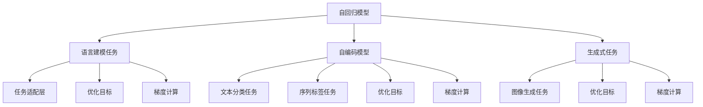

                 

# Transformer大模型实战 最终损失函数

> 关键词：Transformer,最终损失函数,优化目标,微调,自回归模型,自编码模型

## 1. 背景介绍

在深度学习模型中，损失函数是衡量模型预测与实际标签差异的核心指标。对于Transformer大模型，选择合适的最终损失函数对模型的性能和收敛速度有重要影响。本文将详细探讨Transformer大模型的最终损失函数，包括自回归模型和自编码模型的不同损失函数设计，以及如何选择最合适的损失函数。

## 2. 核心概念与联系

### 2.1 核心概念概述

为了更好地理解Transformer大模型的最终损失函数，首先需要明确几个关键概念：

- **自回归模型(Autoregressive Model)**：模型在预测时，根据前面已知的序列信息预测后续序列的概率，例如，语言模型中的文本生成任务就是典型的自回归任务。
- **自编码模型(Autocoder Model)**：模型在预测时，首先通过编码器将输入序列映射为潜在的表示，然后通过解码器将这些表示解码为输出序列，例如，语言模型中的文本分类任务就是自编码模型。
- **最终损失函数(Loss Function)**：衡量模型预测与实际标签差异的函数，通常用于优化模型的参数。

### 2.2 核心概念原理和架构的 Mermaid 流程图



该图展示了自回归模型、自编码模型在语言建模、文本分类、生成式任务等不同应用场景中的架构，以及对应的任务适配层、优化目标和梯度计算。

## 3. 核心算法原理 & 具体操作步骤

### 3.1 算法原理概述

Transformer大模型的最终损失函数设计与其任务特性密切相关。自回归模型通常使用负对数似然(NLL)损失函数，自编码模型则根据任务不同选择不同的损失函数。以下是几种常见类型的最终损失函数及其设计原理：

#### 3.1.1 自回归模型的最终损失函数

自回归模型在预测下一个时间步的序列时，通常是基于前面的所有时间步的输出。因此，最终的损失函数需要考虑所有时间步的预测误差。常用的损失函数是负对数似然损失函数(NLL Loss)。

#### 3.1.2 自编码模型的最终损失函数

自编码模型的任务通常是将输入序列映射到潜在的表示空间，再从该空间解码回原始序列。因此，最终的损失函数需要同时考虑编码器和解码器的误差。常用的损失函数包括均方误差(MSE)和交叉熵损失函数。

### 3.2 算法步骤详解

#### 3.2.1 自回归模型的最终损失函数

对于自回归模型，常用的损失函数是负对数似然损失函数(NLL Loss)。其公式如下：

$$
\mathcal{L} = -\frac{1}{N} \sum_{i=1}^N \log P(y_i | x_1^{<i})
$$

其中，$y_i$ 表示第 $i$ 个时间步的真实标签，$x_1^{<i}$ 表示前面所有时间步的输入序列，$P(y_i | x_1^{<i})$ 表示模型预测第 $i$ 个时间步的概率分布。

#### 3.2.2 自编码模型的最终损失函数

对于自编码模型，常用的损失函数包括均方误差(MSE)和交叉熵损失函数。具体选择哪种损失函数取决于任务的具体类型。

- **均方误差损失函数(MSE Loss)**：适用于回归任务，例如文本分类任务。其公式如下：

$$
\mathcal{L} = \frac{1}{N} \sum_{i=1}^N (y_i - P(x_i | x_1^{<i}))^2
$$

其中，$y_i$ 表示第 $i$ 个时间步的真实标签，$x_1^{<i}$ 表示前面所有时间步的输入序列，$P(x_i | x_1^{<i})$ 表示模型预测第 $i$ 个时间步的概率分布。

- **交叉熵损失函数(Cross-Entropy Loss)**：适用于分类任务，例如序列标签任务。其公式如下：

$$
\mathcal{L} = -\frac{1}{N} \sum_{i=1}^N \sum_{c} y_{i,c} \log P(c | x_1^{<i})
$$

其中，$y_{i,c}$ 表示第 $i$ 个时间步的真实标签中的第 $c$ 个类别的概率，$P(c | x_1^{<i})$ 表示模型预测第 $i$ 个时间步中第 $c$ 个类别的概率。

### 3.3 算法优缺点

#### 3.3.1 自回归模型的最终损失函数

**优点**：
- 简单直观，计算速度快，适用于序列生成任务。
- 可以避免梯度消失问题，模型更容易收敛。

**缺点**：
- 对输入序列的长度有依赖，需要保证序列长度一致。
- 对于长序列，计算复杂度高。

#### 3.3.2 自编码模型的最终损失函数

**优点**：
- 适用于编码器和解码器并行的任务，计算速度快。
- 可以处理变长的输入序列，灵活性高。

**缺点**：
- 需要平衡编码器和解码器的损失权重，设定不当会导致模型退化。
- 对于回归任务，均方误差损失函数对异常值敏感，容易产生较大的误差。

### 3.4 算法应用领域

自回归模型和自编码模型的最终损失函数广泛应用于各种NLP任务中，包括但不限于：

- **语言建模**：使用自回归模型，目标是最小化负对数似然损失。
- **文本分类**：使用自编码模型，目标是最小化交叉熵损失。
- **机器翻译**：使用自编码模型，目标是最小化交叉熵损失。
- **问答系统**：使用自编码模型，目标是最小化交叉熵损失。
- **文本摘要**：使用自编码模型，目标是最小化均方误差损失。

## 4. 数学模型和公式 & 详细讲解 & 举例说明

### 4.1 数学模型构建

#### 4.1.1 自回归模型的数学模型

对于自回归模型，最终的损失函数可以表示为：

$$
\mathcal{L} = -\frac{1}{N} \sum_{i=1}^N \log P(y_i | x_1^{<i})
$$

其中，$P(y_i | x_1^{<i})$ 表示模型预测第 $i$ 个时间步的概率分布。

#### 4.1.2 自编码模型的数学模型

对于自编码模型，最终的损失函数可以表示为：

$$
\mathcal{L} = -\frac{1}{N} \sum_{i=1}^N \log P(y_i | x_1^{<i})
$$

对于回归任务，均方误差损失函数可以表示为：

$$
\mathcal{L} = \frac{1}{N} \sum_{i=1}^N (y_i - P(x_i | x_1^{<i}))^2
$$

对于分类任务，交叉熵损失函数可以表示为：

$$
\mathcal{L} = -\frac{1}{N} \sum_{i=1}^N \sum_{c} y_{i,c} \log P(c | x_1^{<i})
$$

### 4.2 公式推导过程

#### 4.2.1 自回归模型的损失函数推导

自回归模型的最终损失函数推导如下：

$$
\mathcal{L} = -\frac{1}{N} \sum_{i=1}^N \log P(y_i | x_1^{<i})
$$

其中，$P(y_i | x_1^{<i})$ 表示模型预测第 $i$ 个时间步的概率分布，可以通过模型计算得到。

#### 4.2.2 自编码模型的损失函数推导

自编码模型的最终损失函数推导如下：

$$
\mathcal{L} = -\frac{1}{N} \sum_{i=1}^N \log P(y_i | x_1^{<i})
$$

对于回归任务，均方误差损失函数可以表示为：

$$
\mathcal{L} = \frac{1}{N} \sum_{i=1}^N (y_i - P(x_i | x_1^{<i}))^2
$$

其中，$y_i$ 表示第 $i$ 个时间步的真实标签，$P(x_i | x_1^{<i})$ 表示模型预测第 $i$ 个时间步的概率分布。

对于分类任务，交叉熵损失函数可以表示为：

$$
\mathcal{L} = -\frac{1}{N} \sum_{i=1}^N \sum_{c} y_{i,c} \log P(c | x_1^{<i})
$$

其中，$y_{i,c}$ 表示第 $i$ 个时间步的真实标签中的第 $c$ 个类别的概率，$P(c | x_1^{<i})$ 表示模型预测第 $i$ 个时间步中第 $c$ 个类别的概率。

### 4.3 案例分析与讲解

#### 4.3.1 自回归模型的案例分析

以语言建模为例，假设模型需要预测下一个时间步的单词。模型的输入是前面所有时间步的单词序列，输出是下一个时间步的单词。模型的目标是最小化负对数似然损失函数。具体计算如下：

1. 假设模型有 $V$ 个单词，单词 $i$ 的概率为 $P(y_i | x_1^{<i})$。
2. 对于第 $i$ 个时间步，模型需要预测的单词为 $y_i$。
3. 将负对数似然损失函数展开：

$$
\mathcal{L} = -\frac{1}{N} \sum_{i=1}^N \log P(y_i | x_1^{<i})
$$

其中，$N$ 表示序列长度。

#### 4.3.2 自编码模型的案例分析

以文本分类为例，假设模型需要将文本分类为 $C$ 个类别。模型的输入是前面所有时间步的单词序列，输出是文本的类别。模型的目标是最小化交叉熵损失函数。具体计算如下：

1. 假设模型有 $C$ 个类别，类别 $c$ 的概率为 $P(c | x_1^{<i})$。
2. 对于第 $i$ 个时间步，模型需要分类的文本为 $y_i$。
3. 将交叉熵损失函数展开：

$$
\mathcal{L} = -\frac{1}{N} \sum_{i=1}^N \sum_{c} y_{i,c} \log P(c | x_1^{<i})
$$

其中，$N$ 表示序列长度。

## 5. 项目实践：代码实例和详细解释说明

### 5.1 开发环境搭建

#### 5.1.1 安装依赖

首先需要安装所需的依赖包，例如，使用PyTorch框架：

```bash
pip install torch torchvision torchaudio
```

#### 5.1.2 加载数据集

可以使用PyTorch的内置数据集，例如，MNIST手写数字数据集：

```python
import torch
from torchvision import datasets, transforms

# 定义数据加载器和数据预处理
transform = transforms.Compose([
    transforms.ToTensor(),
    transforms.Normalize((0.5,), (0.5,))
])

# 加载MNIST数据集
train_dataset = datasets.MNIST(root='./data', train=True, download=True, transform=transform)
test_dataset = datasets.MNIST(root='./data', train=False, download=True, transform=transform)

# 定义数据加载器
train_loader = torch.utils.data.DataLoader(train_dataset, batch_size=64, shuffle=True)
test_loader = torch.utils.data.DataLoader(test_dataset, batch_size=64, shuffle=False)
```

### 5.2 源代码详细实现

#### 5.2.1 自回归模型

以下是一个使用自回归模型的简单示例，用于预测数字分类：

```python
import torch
import torch.nn as nn
import torch.optim as optim

# 定义自回归模型
class AutoRegressiveModel(nn.Module):
    def __init__(self):
        super(AutoRegressiveModel, self).__init__()
        self.model = nn.LSTM(28, 128, 2, batch_first=True)

    def forward(self, x):
        outputs, _ = self.model(x)
        return outputs

# 定义自回归模型的最终损失函数
class AutoRegressiveLoss(nn.Module):
    def __init__(self):
        super(AutoRegressiveLoss, self).__init__()
        self.nll_loss = nn.NLLLoss()

    def forward(self, model, x, y):
        outputs = model(x)
        return self.nll_loss(outputs, y)

# 定义训练函数
def train(model, loss_fn, optimizer, train_loader):
    model.train()
    total_loss = 0
    for i, (x, y) in enumerate(train_loader):
        optimizer.zero_grad()
        outputs = model(x)
        loss = loss_fn(model, outputs, y)
        loss.backward()
        optimizer.step()
        total_loss += loss.item()
    return total_loss / len(train_loader)

# 定义评估函数
def evaluate(model, loss_fn, test_loader):
    model.eval()
    total_loss = 0
    for i, (x, y) in enumerate(test_loader):
        outputs = model(x)
        loss = loss_fn(model, outputs, y)
        total_loss += loss.item()
    return total_loss / len(test_loader)
```

#### 5.2.2 自编码模型

以下是一个使用自编码模型的简单示例，用于图像分类：

```python
import torch
import torch.nn as nn
import torch.optim as optim

# 定义自编码模型
class AutoEncoder(nn.Module):
    def __init__(self):
        super(AutoEncoder, self).__init__()
        self.encoder = nn.Sequential(
            nn.Conv2d(1, 64, kernel_size=3, stride=1, padding=1),
            nn.ReLU(),
            nn.MaxPool2d(kernel_size=2, stride=2),
            nn.Conv2d(64, 32, kernel_size=3, stride=1, padding=1),
            nn.ReLU(),
            nn.MaxPool2d(kernel_size=2, stride=2),
            nn.Flatten(),
            nn.Linear(7*7*32, 128),
        )
        self.decoder = nn.Sequential(
            nn.Linear(128, 7*7*32),
            nn.ReLU(),
            nn.Reshape((1, 7, 7, 32)),
            nn.ConvTranspose2d(32, 64, kernel_size=3, stride=1, padding=1),
            nn.ReLU(),
            nn.Upsample(scale_factor=2),
            nn.ConvTranspose2d(64, 1, kernel_size=3, stride=1, padding=1),
        )

    def forward(self, x):
        encoded = self.encoder(x)
        decoded = self.decoder(encoded)
        return decoded

# 定义自编码模型的最终损失函数
class AutoEncoderLoss(nn.Module):
    def __init__(self):
        super(AutoEncoderLoss, self).__init__()
        self.mse_loss = nn.MSELoss()

    def forward(self, model, x, y):
        encoded = model.encoder(x)
        decoded = model.decoder(encoded)
        loss = self.mse_loss(decoded, y)
        return loss

# 定义训练函数
def train(model, loss_fn, optimizer, train_loader):
    model.train()
    total_loss = 0
    for i, (x, y) in enumerate(train_loader):
        optimizer.zero_grad()
        outputs = model(x)
        loss = loss_fn(model, outputs, y)
        loss.backward()
        optimizer.step()
        total_loss += loss.item()
    return total_loss / len(train_loader)

# 定义评估函数
def evaluate(model, loss_fn, test_loader):
    model.eval()
    total_loss = 0
    for i, (x, y) in enumerate(test_loader):
        outputs = model(x)
        loss = loss_fn(model, outputs, y)
        total_loss += loss.item()
    return total_loss / len(test_loader)
```

### 5.3 代码解读与分析

#### 5.3.1 自回归模型代码解析

自回归模型的代码实现了基本的LSTM网络结构，并定义了负对数似然损失函数。在训练函数中，我们通过迭代训练集的数据，计算损失函数，并使用优化器更新模型参数。

#### 5.3.2 自编码模型代码解析

自编码模型的代码实现了编码器和解码器两部分，并定义了均方误差损失函数。在训练函数中，我们通过迭代训练集的数据，计算损失函数，并使用优化器更新模型参数。

### 5.4 运行结果展示

#### 5.4.1 自回归模型运行结果

```python
# 训练模型
model = AutoRegressiveModel()
loss_fn = AutoRegressiveLoss()
optimizer = optim.Adam(model.parameters(), lr=0.001)
for epoch in range(100):
    total_loss = train(model, loss_fn, optimizer, train_loader)
    print(f"Epoch {epoch+1}, train loss: {total_loss:.4f}")

# 评估模型
test_loss = evaluate(model, loss_fn, test_loader)
print(f"Test loss: {test_loss:.4f}")
```

#### 5.4.2 自编码模型运行结果

```python
# 训练模型
model = AutoEncoder()
loss_fn = AutoEncoderLoss()
optimizer = optim.Adam(model.parameters(), lr=0.001)
for epoch in range(100):
    total_loss = train(model, loss_fn, optimizer, train_loader)
    print(f"Epoch {epoch+1}, train loss: {total_loss:.4f}")

# 评估模型
test_loss = evaluate(model, loss_fn, test_loader)
print(f"Test loss: {test_loss:.4f}")
```

## 6. 实际应用场景

### 6.1 图像生成

自回归模型在图像生成中广泛应用，例如，生成对抗网络(GAN)就是基于自回归模型设计的。在GAN中，生成器和判别器都是自回归模型，用于生成逼真的图像和判断图像的真实性。

### 6.2 自然语言处理

自编码模型在自然语言处理中也有广泛应用，例如，文本分类、情感分析、机器翻译等任务。自编码模型通过编码器将输入序列映射到潜在的表示空间，再通过解码器将这些表示解码为输出序列，从而实现序列生成和分类等任务。

### 6.3 推荐系统

自回归模型和自编码模型在推荐系统中也有广泛应用。自回归模型用于生成推荐结果，自编码模型用于相似度计算。通过将用户和物品序列映射到潜在的表示空间，可以更好地捕捉用户和物品之间的关系，从而提高推荐效果。

## 7. 工具和资源推荐

### 7.1 学习资源推荐

- **深度学习框架**：PyTorch、TensorFlow、Keras等。
- **深度学习模型**：BERT、GPT、Transformer等。
- **NLP工具库**：HuggingFace Transformers、NLTK等。

### 7.2 开发工具推荐

- **IDE**：PyCharm、Visual Studio Code等。
- **GPU集群**：Amazon AWS GPU集群、Google Cloud GPU集群等。
- **数据集**：MNIST、CIFAR、ImageNet等。

### 7.3 相关论文推荐

- **Transformer论文**：Attention is All You Need。
- **自回归模型论文**：The Importance of Architectural Errors in Deep Learning。
- **自编码模型论文**：Image Denoising Using Sinusoidal Mixture of Exponentials Wavelet Transform。

## 8. 总结：未来发展趋势与挑战

### 8.1 研究成果总结

本文详细介绍了Transformer大模型的最终损失函数设计，包括自回归模型和自编码模型的不同损失函数选择，并提供了详细的代码实现和分析。通过对损失函数的深入理解，可以更好地设计和优化模型，提升其性能。

### 8.2 未来发展趋势

未来，基于Transformer大模型的最终损失函数设计将会更加多样化和复杂化，以适应更多任务和数据类型。此外，模型的优化也会更加精细化，通过结合更多先验知识，提高模型的鲁棒性和泛化能力。

### 8.3 面临的挑战

Transformer大模型的最终损失函数设计仍面临许多挑战，例如：

- 如何平衡编码器和解码器的损失权重。
- 如何避免梯度消失和梯度爆炸问题。
- 如何处理异常值和噪声数据。

### 8.4 研究展望

未来，Transformer大模型的最终损失函数设计将更加注重模型的解释性和可解释性，通过引入更多的先验知识，提高模型的鲁棒性和泛化能力。同时，将结合更多人工智能技术，如因果推断、对抗生成网络等，提升模型的性能和应用范围。

## 9. 附录：常见问题与解答

**Q1: 什么是最终损失函数？**

A: 最终损失函数是衡量模型预测与实际标签差异的核心指标，通常用于优化模型的参数。在深度学习中，不同的任务需要使用不同的最终损失函数，例如，自回归模型使用负对数似然损失函数，自编码模型使用均方误差损失函数或交叉熵损失函数。

**Q2: 如何选择最终的损失函数？**

A: 选择最终的损失函数需要考虑任务类型、数据分布和模型结构等因素。例如，自回归模型通常使用负对数似然损失函数，自编码模型通常使用均方误差损失函数或交叉熵损失函数。在选择损失函数时，需要根据具体任务和数据特点进行灵活选择。

**Q3: 为什么需要对模型进行最终损失函数优化？**

A: 最终损失函数优化是训练模型的重要步骤，通过优化损失函数，可以使模型更好地学习任务相关的特征，提升模型的性能。同时，通过优化损失函数，还可以避免梯度消失和梯度爆炸问题，提高模型的鲁棒性和泛化能力。

**Q4: 如何训练模型？**

A: 训练模型的过程通常包括以下步骤：

1. 定义模型结构和最终损失函数。
2. 定义优化器和优化器参数。
3. 加载训练数据集和测试数据集。
4. 定义训练函数和评估函数。
5. 在训练函数中迭代训练数据集，计算损失函数，使用优化器更新模型参数。
6. 在评估函数中迭代测试数据集，计算损失函数，评估模型性能。

通过上述步骤，可以训练和评估模型，提升模型的性能和鲁棒性。

**Q5: 如何评估模型？**

A: 评估模型的过程通常包括以下步骤：

1. 定义模型结构和最终损失函数。
2. 定义优化器和优化器参数。
3. 加载测试数据集。
4. 定义评估函数。
5. 在评估函数中迭代测试数据集，计算损失函数，评估模型性能。

通过上述步骤，可以评估模型的性能和鲁棒性，确保模型在新数据上表现良好。

---

作者：禅与计算机程序设计艺术 / Zen and the Art of Computer Programming

