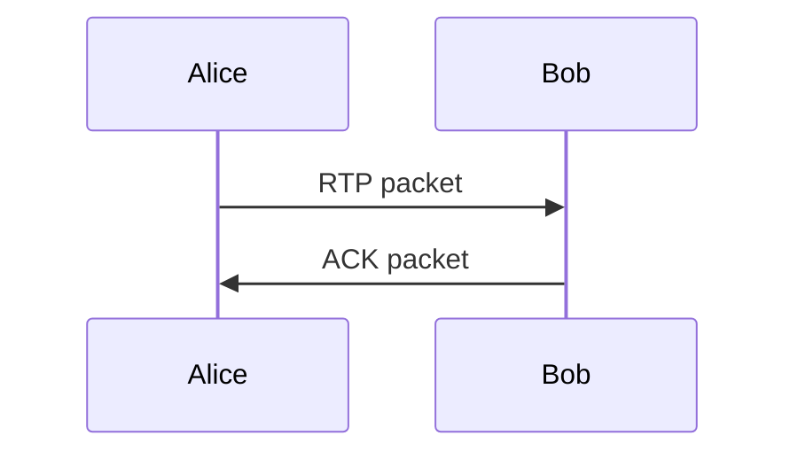
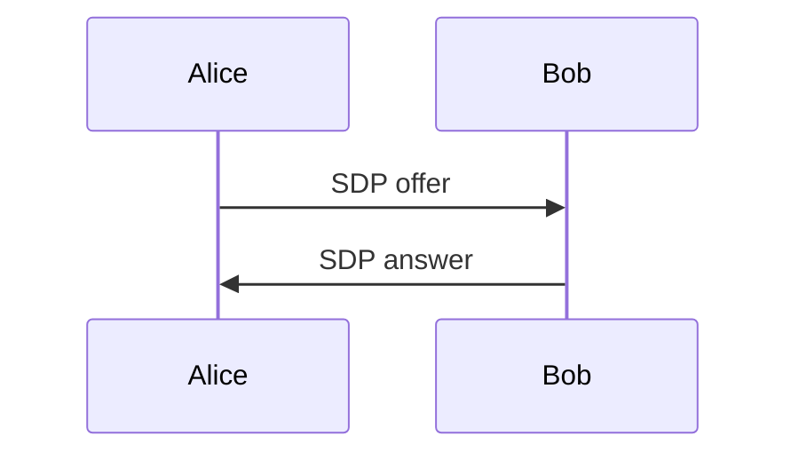
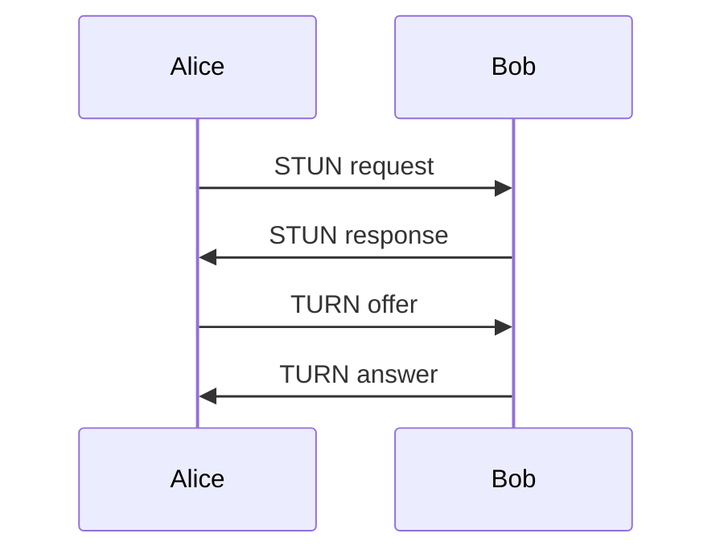
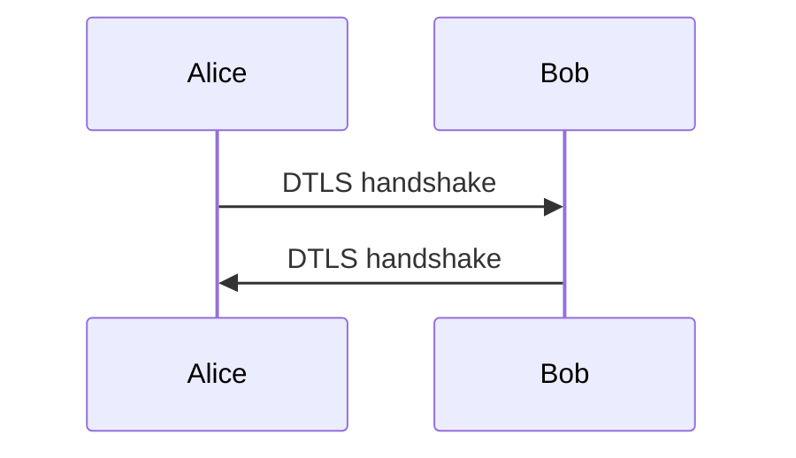

                 

## 1. 背景介绍

随着互联网技术的迅猛发展，实时通信(Real-Time Communication,RTC)已经成为人们日常生活和工作中不可或缺的一部分。无论是视频会议、在线教育、远程医疗，还是实时聊天、游戏对战，RTC都提供了强大的技术支撑。其中，WebRTC（Web Real-Time Communication）是一个在Web浏览器中实现点对点RTC的开放标准，被广泛应用于各种Web应用中。本文将深入介绍WebRTC的核心原理、关键技术和应用场景，为Web开发者提供全面的技术参考。

## 2. 核心概念与联系

### 2.1 核心概念概述

WebRTC 的核心概念包括：

- **Peer-to-Peer(P2P) 通信**：WebRTC 采用点对点的架构，允许在浏览器之间直接建立连接，实现端到端的通信，避免了传统Web应用需要通过服务器中转的复杂性。

- **WebRTC 协议栈**：WebRTC 的协议栈包括RTP（Real-Time Transport Protocol）、SDP（Session Description Protocol）、ICE（Interactive Connectivity Establishment）和DTLS（Datagram Transport Layer Security），这些协议协同工作，保证了数据的安全、可靠和实时传输。

- **媒体流传输**：WebRTC 提供了丰富的媒体流传输机制，包括音视频流、数据流和应用流等，通过这些机制，可以实现多样化的实时通信需求。

- **数据通道**：WebRTC 的数据通道提供了在音视频流之外传输数据的功能，适合在Web应用中实现数据同步和共享。

- **信令协议**：WebRTC 通过STUN（Session Traversal Utilities for NAT）和TURN（Traversal Using Relay NAT）协议，实现穿越NAT（Network Address Translation）和防火墙的通信。

这些核心概念共同构成了WebRTC的完整技术框架，下面我们将从协议栈、媒体流传输和数据通道三个方面来详细讲解WebRTC的原理和应用。

### 2.2 核心概念原理和架构的 Mermaid 流程图

```mermaid
graph TD
    WebRTC --> "RTP, SDP, ICE, DTLS"
    "RTP, SDP, ICE, DTLS" --> "媒体流传输"
    "媒体流传输" --> "数据通道"
    "数据通道" --> "信令协议"
```

这个流程图示意图展示了WebRTC的核心组件和它们之间的关系。

## 3. 核心算法原理 & 具体操作步骤

### 3.1 算法原理概述

WebRTC 的通信模型是基于端到端的点对点模型，这一模型通过 RTP、SDP、ICE 和 DTLS 协议的协同工作，实现安全、可靠的媒体流传输。

- **RTP**：实时传输协议，用于传输音视频等媒体数据。
- **SDP**：会话描述协议，用于描述会话的媒体类型、编解码器、传输协议等信息。
- **ICE**：交互连通性建立协议，用于在穿越NAT和防火墙的情况下建立连接。
- **DTLS**：数据传输层安全性协议，用于在传输过程中保护数据的完整性和机密性。

### 3.2 算法步骤详解

#### 3.2.1 RTP协议

RTP协议用于传输实时媒体数据。在WebRTC中，RTP数据被封装在UDP（User Datagram Protocol）报文中进行传输。



图例解释：Alice和Bob表示两个WebRTC端点，Alice发送RTP数据包给Bob，Bob发送ACK确认包给Alice。

#### 3.2.2 SDP协议

SDP协议用于描述会话的信息，包括媒体类型、编解码器、传输协议等。在WebRTC中，SDP描述被打包在STUN/TURN请求中传输。



图例解释：Alice发送SDP offer给Bob，Bob返回SDP answer给Alice，描述双方支持的媒体类型和参数。

#### 3.2.3 ICE协议

ICE协议用于穿越NAT和防火墙，建立点对点的连接。ICE通过STUN和TURN协议来实现。



图例解释：Alice和Bob通过STUN和TURN协议获取各自的端口号，然后交换offer和answer，最终建立连接。

#### 3.2.4 DTLS协议

DTLS协议用于在传输过程中保护数据的完整性和机密性。



图例解释：Alice和Bob通过DTLS握手协议建立安全连接，确保数据传输的安全。

### 3.3 算法优缺点

#### 3.3.1 优点

- **高效低延迟**：RTP协议的UDP传输和ICE协议的STUN/TURN优化，使得WebRTC在传输过程中具有高效低延迟的特点。
- **端到端通信**：点对点的架构避免了传统Web应用需要通过服务器中转的复杂性，提高了通信的可靠性和灵活性。
- **安全性**：DTLS协议确保了数据传输的机密性和完整性，保障了通信的安全性。

#### 3.3.2 缺点

- **复杂的协议栈**：WebRTC的协议栈较为复杂，涉及RTP、SDP、ICE和DTLS等多个协议，学习成本较高。
- **资源占用较高**：WebRTC的媒体流传输和数据通道需要占用较多的CPU和内存资源，可能对低性能设备造成影响。
- **跨浏览器兼容性问题**：不同浏览器对WebRTC的支持程度和实现方式略有差异，可能会影响跨浏览器的兼容性。

### 3.4 算法应用领域

WebRTC 广泛应用于以下领域：

- **视频会议**：如 Zoom、Skype、FaceTime 等，实现点对点的音视频通信。
- **在线教育**：如 Google Classroom、Coursera、Edmodo 等，实时同步课程内容。
- **远程医疗**：如 Teladoc、Doxy、Amwell 等，提供远程诊断和咨询。
- **实时聊天**：如 WhatsApp、WeChat、Skype 等，实现即时消息的通信。
- **游戏对战**：如 Counter-Strike、DOTA2、League of Legends 等，实时同步游戏状态和数据。

## 4. 数学模型和公式 & 详细讲解 & 举例说明

### 4.1 数学模型构建

在WebRTC中，数据传输过程主要涉及RTP和DTLS协议，下面是相关的数学模型和公式。

#### 4.1.1 RTP协议

RTP协议使用UDP进行数据传输，其数据包格式如下：

```
RTP header + 媒体数据
```

其中，RTP头部包括版本、序列号、SSRC（Sender Side Stream ID）、PT（Payload Type）、标志位等信息。PT字段标识媒体类型，常见的媒体类型及其PT值如下：

| 媒体类型 | PT值 |
| --- | --- |
| 音频 | 97 |
| 视频 | 96 |
| 应用数据 | 101 |

#### 4.1.2 DTLS协议

DTLS协议使用SSL/TLS协议进行加密传输，其握手流程如下：

1. 客户端发送Client Hello给服务器，包含加密算法、版本等信息。
2. 服务器发送Server Hello给客户端，包含加密算法、版本、随机数等信息。
3. 客户端发送Client Key Exchange给服务器，包含公钥和随机数等信息。
4. 服务器发送Server Key Exchange给客户端，包含公钥和随机数等信息。
5. 客户端和服务器分别计算共享密钥，生成Session密钥。

下面是DTLS协议的伪代码实现：

```python
# 伪代码实现DTLS握手过程
def DTLS_handshake(client, server):
    # 客户端发送Client Hello给服务器
    client.send(ClientHello())
    # 服务器发送Server Hello给客户端
    server.send(ServerHello())
    # 客户端发送Client Key Exchange给服务器
    client.send(ClientKeyExchange())
    # 服务器发送Server Key Exchange给客户端
    server.send(ServerKeyExchange())
    # 计算共享密钥
    shared_secret = client.state.state_secret + server.state.state_secret
    # 生成Session密钥
    session_secret = compute_secret(shared_secret)
    # 返回Session密钥
    return session_secret
```

### 4.2 公式推导过程

#### 4.2.1 RTP协议

RTP协议的序列号（Sequence Number）用于标识每个数据包的顺序，其公式为：

$$
SeqNum = SeqNum_{prev} + 1
$$

其中，$SeqNum_{prev}$ 表示前一个数据包的序列号。

#### 4.2.2 DTLS协议

在DTLS协议中，Session密钥的计算公式如下：

$$
SessionSecret = ClientPublicKey \times ServerPublicKey \times \text{hash}(GovernmentParameter)
$$

其中，$\text{hash}$ 表示哈希函数，$GovernmentParameter$ 表示预共享密钥。

### 4.3 案例分析与讲解

#### 4.3.1 SDP协议

在WebRTC中，SDP协议的offer和answer格式如下：

```
v=0
o=-\text{时间戳} \text{会话标识符} \text{会话版本号}
s=会话描述
t=会话开始时间
m=媒体类型 媒体流编号 RTP编码器 编解码器参数 传输协议参数
c=connection id 传输协议参数 地址参数
a=媒体流参数
```

其中，媒体类型、编解码器、传输协议等参数需要在SDP描述中清晰说明，以确保两端能够正确地进行通信。

#### 4.3.2 ICE协议

ICE协议通过STUN和TURN协议来穿越NAT和防火墙，其实现过程如下：

1. 发送STUN请求，获取本地端口号。
2. 发送TURN offer，请求远程服务器转发数据。
3. 接收TURN answer，建立连接。

下面是STUN和TURN协议的伪代码实现：

```python
# 伪代码实现STUN和TURN协议
def STUN_request():
    # 发送STUN请求
    send(STUNRequest())
    # 接收STUN响应
    response = receive(STUNResponse())
    # 返回STUN响应
    return response

def TURN_offer():
    # 发送TURN offer
    send(TURNOffer())
    # 接收TURN answer
    answer = receive(TURNAnswer())
    # 返回TURN answer
    return answer

def TURN_connect():
    # 发送TURN offer
    send(TURNOffer())
    # 接收TURN answer
    answer = receive(TURNAnswer())
    # 返回TURN answer
    return answer
```

## 5. 项目实践：代码实例和详细解释说明

### 5.1 开发环境搭建

为了搭建WebRTC的开发环境，需要以下步骤：

1. 安装Node.js：访问Node.js官网，下载并安装最新版本的Node.js。
2. 安装WebRTC SDK：访问Google的WebRTC SDK官网，下载并安装对应的SDK。
3. 安装开发工具：如VSCode、Atom等编辑器，以及Git等版本控制系统。

完成上述步骤后，即可在WebRTC的开发环境中进行代码实现。

### 5.2 源代码详细实现

下面是使用WebRTC SDK实现的WebRTC视频通话的代码示例：

```javascript
// 加载WebRTC SDK
let webrtc = new RTCPeerConnection();

// 设置数据通道
let channel = webrtc.createDataChannel('myChannel');

// 设置媒体流传输
let stream = new MediaStream();
let videoTrack = new MediaStreamTrack('video');
let audioTrack = new MediaStreamTrack('audio');
stream.addTrack(videoTrack);
stream.addTrack(audioTrack);
webrtc.addTrack(videoTrack);
webrtc.addTrack(audioTrack);

// 设置信令协议
let offer = webrtc.createOffer();
webrtc.setLocalDescription(offer);
let answer = webrtc.createAnswer();
webrtc.setRemoteDescription(answer);
```

### 5.3 代码解读与分析

#### 5.3.1 RTCPeerConnection类

RTCPeerConnection类是WebRTC的核心类，用于建立点对点的连接，实现媒体流传输和数据通道等功能。

#### 5.3.2 MediaStream类

MediaStream类用于管理设备的媒体流，包含音视频、屏幕共享等多种类型的流。

#### 5.3.3 STUN和TURN协议

在WebRTC中，使用STUN和TURN协议实现穿越NAT和防火墙的功能。

### 5.4 运行结果展示

运行上述代码，即可在浏览器中实现视频通话功能。在两个浏览器窗口中，可以听到对方的声音，看到对方的视频流，并进行实时互动。

## 6. 实际应用场景

### 6.1 视频会议

WebRTC在视频会议应用中得到了广泛应用，如Zoom、Skype、FaceTime等，提供了点对点的音视频通信功能。

### 6.2 在线教育

在线教育应用通过WebRTC实现了课堂同步，教师可以在课堂上实时展示PPT、分享屏幕等内容，学生可以实时提问和互动。

### 6.3 远程医疗

远程医疗应用通过WebRTC实现了医生的远程诊断和咨询，患者可以在家中进行实时视频通话，获取专业的医疗服务。

### 6.4 实时聊天

实时聊天应用通过WebRTC实现了即时消息的通信，如WhatsApp、WeChat、Skype等。

### 6.5 游戏对战

游戏对战应用通过WebRTC实现了实时同步游戏状态和数据，如Counter-Strike、DOTA2、League of Legends等。

## 7. 工具和资源推荐

### 7.1 学习资源推荐

为了帮助开发者系统掌握WebRTC的核心原理和应用，这里推荐一些优质的学习资源：

1. Google WebRTC文档：官方文档，详细介绍了WebRTC的API和使用方法。
2. WebRTC简明教程：通过示例代码，快速入门WebRTC。
3. WebRTC实战手册：结合实际项目，深入讲解WebRTC的应用场景和实现细节。

### 7.2 开发工具推荐

WebRTC开发常用的工具包括：

1. Visual Studio Code：轻量级、高性能的开发编辑器。
2. Git：版本控制系统，方便版本管理和协作开发。
3. Xdebug：PHP调试工具，可以在调试过程中查看变量、执行代码等。

### 7.3 相关论文推荐

WebRTC的研究方向涉及多个领域，以下是几篇奠基性的相关论文，推荐阅读：

1. "WebRTC in Chrome: Building WebRTC in an Extensible Open Source Browser"：介绍WebRTC在Chrome浏览器中的实现和优化。
2. "Enabling WebRTC over IPv6"：介绍WebRTC在IPv6网络中的实现和优化。
3. "Improving WebRTC Performance"：介绍WebRTC的性能优化方法，包括音频、视频、数据通道等方面的优化。

## 8. 总结：未来发展趋势与挑战

### 8.1 总结

本文详细介绍了WebRTC的核心原理、关键技术和应用场景，为Web开发者提供了全面的技术参考。通过本文的学习，开发者可以掌握WebRTC的API和使用方法，开发出高质量的实时通信应用。

### 8.2 未来发展趋势

未来，WebRTC将继续朝着以下几个方向发展：

1. **更高效的媒体传输**：通过改进编解码算法和传输协议，实现更高的传输速率和更低的延迟。
2. **更安全的数据传输**：通过改进DTLS协议和加密算法，提升数据传输的安全性和可靠性。
3. **更广泛的跨平台支持**：实现更多浏览器和操作系统的兼容性，进一步扩展WebRTC的应用范围。
4. **更丰富的媒体类型**：支持更多的媒体类型，如3D、AR、VR等，提升用户体验。

### 8.3 面临的挑战

尽管WebRTC已经取得了显著的成果，但在迈向更广泛应用的过程中，仍面临以下挑战：

1. **跨浏览器兼容性问题**：不同浏览器对WebRTC的支持程度和实现方式略有差异，可能会影响跨浏览器的兼容性。
2. **资源占用较高**：WebRTC的媒体流传输和数据通道需要占用较多的CPU和内存资源，可能对低性能设备造成影响。
3. **信令协议复杂**：WebRTC的信令协议较为复杂，涉及STUN、TURN等协议，学习成本较高。

### 8.4 研究展望

针对上述挑战，未来的研究需要在以下几个方面寻求新的突破：

1. **优化跨浏览器兼容性**：开发跨浏览器的WebRTC库和框架，提供统一API，简化开发和维护。
2. **优化资源占用**：开发资源优化的WebRTC库和框架，提升低性能设备的性能和稳定性。
3. **简化信令协议**：开发简化的信令协议库和框架，降低学习成本和开发难度。

## 9. 附录：常见问题与解答

### 9.1 Q1: 什么是WebRTC？

A: WebRTC是一种在Web浏览器中实现点对点实时通信的开放标准，支持音视频、数据等多种类型的传输。

### 9.2 Q2: WebRTC的协议栈包括哪些？

A: WebRTC的协议栈包括RTP、SDP、ICE和DTLS等协议，这些协议协同工作，实现媒体流传输和数据通道等功能。

### 9.3 Q3: WebRTC如何实现穿越NAT和防火墙？

A: WebRTC通过STUN和TURN协议实现穿越NAT和防火墙的功能。STUN协议用于获取本地端口号，TURN协议用于建立连接。

### 9.4 Q4: 如何优化WebRTC的性能？

A: 可以通过改进编解码算法、传输协议和信令协议等方式，提升WebRTC的性能和稳定性。

### 9.5 Q5: WebRTC如何保证数据传输的安全性？

A: WebRTC使用DTLS协议实现数据传输的安全性，通过加密算法和握手协议保障数据的机密性和完整性。

---

作者：禅与计算机程序设计艺术 / Zen and the Art of Computer Programming

