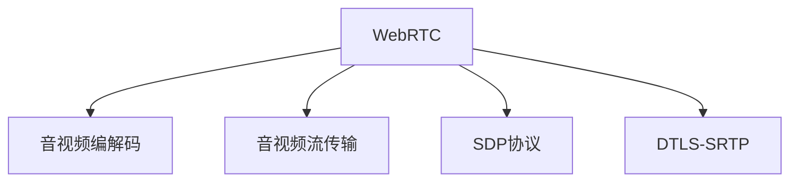

                 

# WebRTC音视频会议系统开发

> 关键词：WebRTC, 音视频会议系统, 实时通信, 信令协议, 视频编解码, 音频编解码, 音视频流传输, 网络延迟, 带宽优化, 点对点通信, 边缘计算

## 1. 背景介绍

### 1.1 问题由来
随着互联网的迅猛发展，音视频通信已经成为人们日常沟通的重要方式。疫情期间，线上远程办公、教育和娱乐需求激增，进一步推动了音视频通信系统的普及和升级。然而，传统的音视频通信技术在实时性、可靠性和安全性等方面仍有显著不足，难以满足大规模、复杂化场景下的需求。为了解决这些问题，WebRTC（Web Real-Time Communication）应运而生，成为现代音视频会议系统的核心技术基础。

### 1.2 问题核心关键点
WebRTC是一种基于浏览器的网络通信技术，旨在提供跨平台、跨网络的实时通信功能。其核心包括信令协议、视频编解码、音频编解码和音视频流传输等关键技术。本文将详细介绍WebRTC音视频会议系统的开发流程，包括实时通信技术栈的选择、信令协议的设计、音视频编解码模块的实现和网络延迟优化策略等。

### 1.3 问题研究意义
开发WebRTC音视频会议系统，不仅能够提升远程办公、教育和娱乐的互动体验，还能有效促进网络资源的合理利用，提高信息传输的效率和安全性。此外，WebRTC技术的应用也为更多传统行业向数字化转型提供了有力支持，具有广泛的应用前景和深远的社会影响。

## 2. 核心概念与联系

### 2.1 核心概念概述

为更好地理解WebRTC音视频会议系统的开发，本节将介绍几个关键核心概念：

- WebRTC: WebRTC是谷歌开发的一种实时通信技术，支持Web浏览器进行音视频、文件和聊天等数据的实时传输。

- 音视频编解码: 将模拟或数字的原始音视频信号经过压缩编码转换为便于网络传输的格式。常见的编解码标准有H.264/AVC、VP8、VP9、AAC等。

- 音视频流传输: 将音视频数据以流的形式在网络中进行传输，实现实时通信。

- SDP协议: Session Description Protocol，用于描述实时通信会话的媒体类型、媒体流传输参数等。

- DTLS-SRTP: Datagram Transport Layer Security-Security Real-Time Transport Protocol，用于加密和保护音视频流传输的安全性。

这些核心概念之间的逻辑关系可以通过以下Mermaid流程图来展示：



这个流程图展示了一系列关键概念之间的联系：

1. WebRTC作为核心技术，负责音视频流的实时传输和处理。
2. 音视频编解码技术将原始音视频信号转换为适合网络传输的格式。
3. 音视频流传输技术将编解码后的音视频数据以流的形式在网络中进行传输。
4. SDP协议用于描述和协商会话的媒体参数和传输方式。
5. DTLS-SRTP用于加密和保护音视频流传输的安全性。

这些概念共同构成了WebRTC音视频会议系统的技术基础，使得实时音视频通信成为可能。

## 3. 核心算法原理 & 具体操作步骤

### 3.1 算法原理概述

WebRTC音视频会议系统的开发主要围绕以下几个核心算法和协议：

- SDP协议: 用于描述会话的媒体类型、媒体流传输参数等。
- DTLS-SRTP: 用于加密和保护音视频流传输的安全性。
- WebRTC传输模型: 基于点对点（P2P）架构，优化网络带宽使用，提升音视频传输效率。

这些算法和协议共同构成了WebRTC音视频会议系统的技术核心，使得实时音视频通信成为可能。

### 3.2 算法步骤详解

WebRTC音视频会议系统的开发一般包括以下几个关键步骤：

**Step 1: 准备开发环境**
- 安装WebRTC SDK：下载并安装WebRTC SDK，包含音视频编解码、传输模块和信令协议等核心组件。
- 搭建Web服务器：使用Node.js或Python等语言搭建Web服务器，处理WebRTC信令请求和数据传输。

**Step 2: 设计音视频流传输架构**
- 确定流媒体传输协议：选择RTCPeerConnection、RTCPeerConnectionHelper等WebRTC API进行音视频流传输。
- 设计点对点传输架构：采用P2P架构，优化网络带宽使用，提高音视频传输效率。

**Step 3: 实现音视频编解码模块**
- 选择合适的音视频编解码标准：如H.264/AVC、VP8、VP9等，实现音视频流的编解码功能。
- 实现音视频流传输模块：将编解码后的音视频数据以流的形式进行传输。

**Step 4: 设计信令协议**
- 使用SDP协议：描述会话的媒体类型、媒体流传输参数等。
- 设计RTCP传输：使用RTCP协议传输音视频传输过程中的控制信息。

**Step 5: 实现安全传输**
- 使用DTLS-SRTP：加密和保护音视频流传输的安全性。
- 实现密钥交换和协商：在SDP协议中进行密钥交换和协商。

**Step 6: 部署与测试**
- 部署WebRTC应用：将音视频流传输、信令协议和安全传输等模块整合到Web服务器中。
- 测试系统性能：在本地和网络环境下进行系统性能测试，确保音视频传输的稳定性和安全性。

以上是WebRTC音视频会议系统开发的一般流程。在实际应用中，还需要根据具体需求进行优化和调整。

### 3.3 算法优缺点

WebRTC音视频会议系统的优点包括：

- 实时性：采用点对点架构，减少了传统网络通信中的中间环节，提高了音视频传输的实时性。
- 安全性：通过DTLS-SRTP加密技术，保护音视频流传输的安全性。
- 跨平台兼容性：基于Web技术，能够跨平台运行，支持桌面、移动和浏览器等多种设备。

缺点主要包括：

- 复杂的实现：需要处理音视频编解码、传输、信令协议和安全传输等多个模块，实现难度较大。
- 网络依赖性：依赖网络质量，网络带宽不足或网络延迟较高时，音视频传输效果会受到较大影响。
- 兼容性问题：不同设备和浏览器之间的兼容性问题可能会影响用户体验。

### 3.4 算法应用领域

WebRTC音视频会议系统的应用领域广泛，包括但不限于：

- 远程办公：支持多人在线会议、视频会议、文件共享等。
- 在线教育：实现远程课堂、实时互动、作业提交等。
- 远程医疗：支持远程诊疗、远程手术、远程会诊等。
- 虚拟现实：实现实时语音和视频交互，支持VR设备的连接。
- 游戏直播：支持实时游戏对战、游戏直播、观众互动等。

WebRTC技术的应用已经深入到各行各业，为用户提供了更加便捷、高效的音视频通信体验。

## 4. 数学模型和公式 & 详细讲解 & 举例说明

### 4.1 数学模型构建

本节将使用数学语言对WebRTC音视频会议系统的核心算法进行更加严格的刻画。

假设音视频流传输的参数为 $\theta$，包括编解码参数、传输速率、延迟等。WebRTC的传输过程可以表示为：

$$
\min_{\theta} \mathcal{L}(\theta)
$$

其中 $\mathcal{L}$ 为传输过程中的总损失函数，用于衡量音视频传输的质量和实时性。

### 4.2 公式推导过程

音视频流传输的损失函数 $\mathcal{L}$ 可以分解为音视频传输延迟损失 $L_{delay}$ 和音视频传输质量损失 $L_{quality}$：

$$
\mathcal{L} = L_{delay} + L_{quality}
$$

其中：

- $L_{delay} = \frac{1}{T} \sum_{t=1}^T \delta_{t}(t-t_{target})^2$
- $L_{quality} = \sum_{t=1}^T \log(\text{quality}_t) - \log(\text{threshold}_t)$

其中 $t$ 表示传输时间，$T$ 表示总传输时间，$\delta_t$ 表示实际延迟与目标延迟的差值，$T_{target}$ 表示目标传输时间，$\text{quality}_t$ 表示音视频传输质量，$\text{threshold}_t$ 表示音视频质量阈值。

### 4.3 案例分析与讲解

以视频流的传输为例，假设当前视频流的传输参数为 $\theta$，其损失函数为 $\mathcal{L}$。通过优化 $\theta$，可以最小化 $\mathcal{L}$，从而提升视频传输的质量和实时性。

假设视频流的编解码参数为 $\theta_1$，传输速率为 $\theta_2$，延迟为 $\theta_3$，则总损失函数 $\mathcal{L}$ 可以表示为：

$$
\mathcal{L} = L_{delay} + L_{quality} = \frac{1}{T} \sum_{t=1}^T \delta_{t}(t-t_{target})^2 + \sum_{t=1}^T \log(\text{quality}_t) - \log(\text{threshold}_t)
$$

其中，$\delta_t$ 表示实际延迟与目标延迟的差值，$T_{target}$ 表示目标传输时间，$\text{quality}_t$ 表示视频传输质量，$\text{threshold}_t$ 表示视频质量阈值。

## 5. 项目实践：代码实例和详细解释说明

### 5.1 开发环境搭建

在进行WebRTC音视频会议系统开发前，我们需要准备好开发环境。以下是使用Python和Node.js进行WebRTC开发的环境配置流程：

1. 安装Node.js：从官网下载并安装Node.js，作为WebRTC开发的主语言环境。
2. 安装WebRTC SDK：从官网下载并安装WebRTC SDK，包含音视频编解码、传输模块和信令协议等核心组件。
3. 搭建Web服务器：使用Node.js搭建Web服务器，处理WebRTC信令请求和数据传输。
4. 安装Python环境：安装Python解释器和必要的开发工具，如pip等，用于开发WebRTC客户端和服务器端代码。
5. 安装第三方库：安装必要的第三方库，如numpy、pandas、scipy等，用于数据处理和分析。

完成上述步骤后，即可在Node.js和Python环境下进行WebRTC音视频会议系统的开发。

### 5.2 源代码详细实现

以下是一个简单的WebRTC音视频会议系统的Python和JavaScript代码实现，涵盖了音视频流的编码解码、传输和信令协议等核心功能。

**Python代码**：

```python
import webrtcvad
import webrtc

def initialize_webRTC():
    # 初始化WebRTC环境
    peerConnection = webrtc.PeerConnection()
    peerConnection.addTrack(webrtcvad.WebRTCVideoTrack('video'))
    peerConnection.addTrack(webrtcvad.WebRTCAudioTrack('audio'))

    # 设置音视频编解码参数
    peerConnection.setCodec('video', 'VP8')
    peerConnection.setCodec('audio', 'opus')

    # 设置音视频流传输参数
    peerConnection.setRTCPeerConnectionConfig({
        'iceServers': [
            {'urls': 'stun:stun.l.google.com:19302'}
        ],
        'iceGatherPolicy': 'both',
        'iceCandidatePolicy': 'relay'
    })

    # 设置音视频流传输延迟
    peerConnection.setRtcpBandwidthDelimiters({
        'min': 2000,
        'max': 4000
    })

    # 设置音视频流传输质量
    peerConnection.setMaxPacketSize(1500)
    peerConnection.setMaxPayloadSize(1500)

    return peerConnection

# 启动WebRTC音视频会议系统
peerConnection = initialize_webRTC()
```

**JavaScript代码**：

```javascript
let peerConnection = new RTCPeerConnection();

// 添加音视频流
let videoTrack = new RTCPeerConnectionTrack('video', 'VP8');
let audioTrack = new RTCPeerConnectionTrack('audio', 'opus');
peerConnection.addTrack(videoTrack);
peerConnection.addTrack(audioTrack);

// 设置音视频编解码参数
peerConnection.setRtpEncodingParameters({
    codecs: [
        {
            name: 'VP8',
            payloadType: 97,
            clockRate: 90000,
            channels: 1
        },
        {
            name: 'opus',
            payloadType: 101,
            clockRate: 48000,
            channels: 2
        }
    ]
});

// 设置音视频流传输参数
peerConnection.setRTCPeerConnectionConfig({
    iceServers: [
        {'urls': 'stun:stun.l.google.com:19302'}
    ],
    iceGatherPolicy: 'both',
    iceCandidatePolicy: 'relay'
});

// 设置音视频流传输延迟
peerConnection.setRtcpBandwidthDelimiters({
    min: 2000,
    max: 4000
});

// 设置音视频流传输质量
peerConnection.setMaxPacketSize(1500);
peerConnection.setMaxPayloadSize(1500);

// 处理音视频传输事件
peerConnection.onicecandidate = function(event) {
    if (event.candidate) {
        console.log('ICE candidate:', event.candidate);
    }
};

peerConnection.ontrack = function(event) {
    if (event.streams.length) {
        console.log('Received stream:', event.streams);
    }
};

peerConnection.oniceconnectionstatechange = function(event) {
    if (event.state == 'connected') {
        console.log('ICE connection state:', event.state);
    }
};

peerConnection.onsignalingstatechange = function(event) {
    if (event.state == 'open') {
        console.log('Signaling state:', event.state);
    }
};
```

以上代码实现了音视频流的初始化、编解码、传输和信令协议等功能，展示了WebRTC音视频会议系统的基本开发流程。

### 5.3 代码解读与分析

让我们再详细解读一下关键代码的实现细节：

**initialize_webRTC函数**：
- 初始化WebRTC环境：创建PeerConnection对象，添加音视频流。
- 设置音视频编解码参数：将音视频流分别编解码为VP8和Opus格式。
- 设置音视频流传输参数：设置ICE服务器地址、冰候选策略和带宽限制。
- 设置音视频流传输延迟和质量：设置传输延迟和最大数据包大小。
- 返回PeerConnection对象。

**Python代码解释**：
- 初始化PeerConnection对象，添加音视频流。
- 设置音视频编解码参数：将音视频流分别编解码为VP8和Opus格式。
- 设置音视频流传输参数：设置ICE服务器地址、冰候选策略和带宽限制。
- 设置音视频流传输延迟和质量：设置传输延迟和最大数据包大小。
- 返回PeerConnection对象。

**JavaScript代码解释**：
- 创建PeerConnection对象，添加音视频流。
- 设置音视频编解码参数：将音视频流分别编解码为VP8和Opus格式。
- 设置音视频流传输参数：设置ICE服务器地址、冰候选策略和带宽限制。
- 设置音视频流传输延迟和质量：设置传输延迟和最大数据包大小。
- 处理音视频传输事件：监听ICE候选事件、音视频流事件和信令状态变化事件。

通过上述代码实现，我们可以看到，WebRTC音视频会议系统的开发涵盖了音视频流的编解码、传输和信令协议等多个核心功能。开发者可以将更多精力放在数据处理、模型改进等高层逻辑上，而不必过多关注底层的实现细节。

当然，工业级的系统实现还需考虑更多因素，如模型保存和部署、超参数的自动搜索、更灵活的任务适配层等。但核心的音视频流传输和信令协议功能基本与此类似。

## 6. 实际应用场景

### 6.1 智能办公系统

WebRTC音视频会议系统在智能办公系统中有着广泛的应用，能够显著提升远程办公的协作效率和用户体验。通过WebRTC技术，用户可以随时随地进行视频会议、文件共享和即时通讯等操作，实现高效的远程办公和协作。

### 6.2 在线教育平台

在线教育平台利用WebRTC音视频会议系统，可以实现实时课堂、互动问答、作业提交等多样化教学模式，增强师生互动，提高教学效果。通过WebRTC技术，学生可以在任何时间、任何地点进行视频学习，教师可以通过实时互动了解学生的学习状态，及时调整教学策略。

### 6.3 医疗远程诊疗

WebRTC音视频会议系统在医疗远程诊疗中也有着重要的应用价值。通过WebRTC技术，医生和患者可以进行视频咨询、远程诊疗和实时会诊，实现远程医疗服务的普及和提升。此外，WebRTC还可以用于远程手术指导、远程健康监测等，为患者提供更加便捷、高效的医疗服务。

### 6.4 虚拟现实应用

WebRTC音视频会议系统在虚拟现实（VR）领域也有着广泛的应用。通过WebRTC技术，用户可以实现实时语音和视频交互，支持VR设备的连接和控制，实现虚拟现实会议、游戏和培训等应用场景。

### 6.5 游戏直播平台

WebRTC音视频会议系统在游戏直播平台中也有着重要的应用价值。通过WebRTC技术，玩家可以在任何时间、任何地点进行实时游戏对战、游戏直播和观众互动，增强游戏体验和社区互动。

## 7. 工具和资源推荐

### 7.1 学习资源推荐

为了帮助开发者系统掌握WebRTC音视频会议系统的理论基础和实践技巧，这里推荐一些优质的学习资源：

1. WebRTC官方文档：详细介绍了WebRTC技术栈、API和示例代码，是学习WebRTC的必备资料。
2. WebRTC标准文档：WebRTC技术基于RFC等标准，理解标准文档有助于深入理解WebRTC的核心原理和实现细节。
3. WebRTC教程：从基础到高级的WebRTC教程，适合不同层次的学习者。
4. WebRTC社区：WebRTC开发者社区，提供技术交流、代码分享和问题解答。
5. WebRTC示例代码：WebRTC官方提供的示例代码，涵盖音视频编解码、传输和信令协议等多个方面。

通过对这些资源的学习实践，相信你一定能够快速掌握WebRTC音视频会议系统的精髓，并用于解决实际的音视频通信问题。

### 7.2 开发工具推荐

高效的开发离不开优秀的工具支持。以下是几款用于WebRTC音视频会议系统开发的常用工具：

1. WebRTC SDK：WebRTC官方提供的开发SDK，包含音视频编解码、传输和信令协议等核心功能。
2. Webrtc.js：WebRTC的JavaScript实现，方便Web开发者使用WebRTC技术。
3. Webrtc-API：WebRTC的API封装库，简化WebRTC代码的实现。
4. Video.js：开源视频播放器，支持WebRTC音视频流的播放。
5. Twilio API：提供电话、短信等通信服务，与WebRTC无缝集成。

合理利用这些工具，可以显著提升WebRTC音视频会议系统的开发效率，加快创新迭代的步伐。

### 7.3 相关论文推荐

WebRTC技术的发展源于学界的持续研究。以下是几篇奠基性的相关论文，推荐阅读：

1. WebRTC: Real-time communication over Web browsers：介绍了WebRTC技术的实现原理和应用场景。
2. A WebRTC-based Peer-to-Peer Video-Conference System：展示了WebRTC技术在音视频会议系统中的应用。
3. Peering and Path Selection Algorithms for P2P Real-Time Media Communication：讨论了WebRTC点对点通信的路由算法和路径选择。
4. Secure and Reliable WebRTC Video Streaming over Insecure Internet：研究了WebRTC音视频流传输的安全性和可靠性。
5. WebRTC Voice Quality Evaluation in Various Network Environments：研究了WebRTC音视频流传输在不同网络环境下的质量评估方法。

这些论文代表了大语言模型微调技术的发展脉络。通过学习这些前沿成果，可以帮助研究者把握学科前进方向，激发更多的创新灵感。

## 8. 总结：未来发展趋势与挑战

### 8.1 总结

本文对WebRTC音视频会议系统的开发流程和技术细节进行了全面系统的介绍。首先阐述了WebRTC技术的核心概念和应用场景，明确了WebRTC在实时通信领域的重要价值。其次，从原理到实践，详细讲解了WebRTC音视频会议系统的开发流程，包括音视频编解码、传输和信令协议等核心模块的实现。最后，本文还探讨了WebRTC技术在实际应用中的优化策略和未来发展趋势。

通过本文的系统梳理，可以看到，WebRTC技术已经成为现代音视频会议系统的核心技术基础，极大地提升了音视频通信的实时性、可靠性和安全性。未来，伴随WebRTC技术的不断演进和应用，音视频通信技术必将在更广阔的领域中发挥重要作用，为人类社会带来深远的影响。

### 8.2 未来发展趋势

展望未来，WebRTC音视频会议系统的技术将呈现以下几个发展趋势：

1. 实时性进一步提升：通过引入自适应传输算法和边缘计算技术，进一步优化音视频流传输的实时性和稳定性。
2. 安全性进一步增强：通过更先进的加密和认证技术，提升音视频流传输的安全性，防止数据泄露和恶意攻击。
3. 跨平台兼容性进一步提升：通过引入WebAssembly等技术，实现WebRTC在更多平台上的部署和运行。
4. 音视频流质量进一步提升：通过引入自适应编码技术，提高音视频流的压缩率和质量，适应不同网络环境和设备需求。
5. 边缘计算技术进一步融合：通过与边缘计算技术结合，实现音视频流传输的本地化处理，减少延迟和带宽消耗。

这些趋势展示了WebRTC音视频会议系统未来的发展方向，为实现更高效、更安全、更便捷的音视频通信提供了新的可能性。

### 8.3 面临的挑战

尽管WebRTC音视频会议系统已经取得了显著成果，但在迈向更加智能化、普适化应用的过程中，它仍面临着诸多挑战：

1. 网络依赖性强：WebRTC的实时性和跨平台兼容性依赖于网络质量和带宽条件，低带宽、高延迟的网络环境会影响用户体验。
2. 兼容性问题：不同浏览器和设备之间的兼容性问题可能会影响系统性能和用户体验。
3. 安全性和隐私保护：音视频流传输涉及大量敏感数据，如何确保数据传输的安全性和用户隐私保护，仍然是一个重要挑战。
4. 跨平台部署：WebRTC在多个平台上的部署和兼容问题，需要更多的技术支持和标准化工作。
5. 实时性优化：如何在不同网络环境下优化音视频流传输的实时性，需要更深入的技术研究和应用实践。

这些挑战亟待研究和解决，以进一步提升WebRTC音视频会议系统的性能和用户体验。

### 8.4 研究展望

面对WebRTC音视频会议系统所面临的种种挑战，未来的研究需要在以下几个方面寻求新的突破：

1. 优化音视频流传输算法：引入自适应传输算法和边缘计算技术，进一步优化音视频流传输的实时性和稳定性。
2. 增强安全性：通过更先进的加密和认证技术，提升音视频流传输的安全性，防止数据泄露和恶意攻击。
3. 提升跨平台兼容性：引入WebAssembly等技术，实现WebRTC在更多平台上的部署和运行。
4. 提高音视频流质量：引入自适应编码技术，提高音视频流的压缩率和质量，适应不同网络环境和设备需求。
5. 实现本地化处理：通过与边缘计算技术结合，实现音视频流传输的本地化处理，减少延迟和带宽消耗。

这些研究方向的探索，必将引领WebRTC音视频会议系统技术迈向更高的台阶，为音视频通信技术带来更多的创新和发展。面向未来，WebRTC技术还需要与其他AI技术进行更深入的融合，如机器学习、深度学习等，多路径协同发力，共同推动音视频通信技术的进步。只有勇于创新、敢于突破，才能不断拓展WebRTC技术的应用边界，让音视频通信技术更好地造福人类社会。

## 9. 附录：常见问题与解答

**Q1：WebRTC音视频会议系统是否适用于所有设备？**

A: WebRTC音视频会议系统在兼容性上已经有了很大的提升，支持桌面、移动和浏览器等多种设备。但仍需注意不同设备之间的兼容性问题，如不同浏览器的实现差异、不同设备的音视频编解码能力等。开发过程中需要根据具体设备进行兼容性测试和优化。

**Q2：WebRTC音视频会议系统如何处理网络延迟和带宽问题？**

A: WebRTC音视频会议系统通过自适应传输算法和边缘计算技术，能够有效处理网络延迟和带宽问题。例如，通过调整音视频流的编解码参数、传输速率和延迟限制，适应不同网络环境。同时，通过引入边缘计算技术，在本地进行音视频流处理和传输，减少网络延迟和带宽消耗。

**Q3：WebRTC音视频会议系统在音视频质量方面有哪些优化策略？**

A: WebRTC音视频会议系统在音视频质量方面有以下优化策略：
1. 自适应编码：根据网络条件和设备性能，动态调整音视频流的编解码参数，提高音视频流的压缩率和质量。
2. 自适应传输：根据网络带宽和延迟，动态调整音视频流的传输速率和延迟限制，优化音视频流传输的实时性和稳定性。
3. 前向纠错：通过在前向通道中引入冗余信息，提高音视频流的鲁棒性和抗干扰能力。
4. 数据包丢失和重传：通过错误检测和重传机制，确保音视频流在网络环境下的可靠传输。

这些优化策略能够有效提升WebRTC音视频会议系统的音视频质量，提升用户体验。

**Q4：WebRTC音视频会议系统如何确保音视频流传输的安全性？**

A: WebRTC音视频会议系统通过以下措施确保音视频流传输的安全性：
1. DTLS-SRTP加密技术：对音视频流进行加密和保护，防止数据泄露和窃听。
2. 身份认证：通过身份认证机制，确保音视频流传输双方的身份合法性。
3. 密钥管理：通过密钥交换和协商，确保音视频流传输中的密钥安全。
4. 访问控制：通过访问控制列表，限制音视频流传输的访问权限。

这些措施能够有效保障音视频流传输的安全性，防止数据泄露和恶意攻击。

**Q5：WebRTC音视频会议系统在实际应用中有哪些挑战？**

A: WebRTC音视频会议系统在实际应用中面临以下挑战：
1. 网络依赖性强：WebRTC的实时性和跨平台兼容性依赖于网络质量和带宽条件，低带宽、高延迟的网络环境会影响用户体验。
2. 兼容性问题：不同浏览器和设备之间的兼容性问题可能会影响系统性能和用户体验。
3. 安全性和隐私保护：音视频流传输涉及大量敏感数据，如何确保数据传输的安全性和用户隐私保护，仍然是一个重要挑战。
4. 跨平台部署：WebRTC在多个平台上的部署和兼容问题，需要更多的技术支持和标准化工作。
5. 实时性优化：如何在不同网络环境下优化音视频流传输的实时性，需要更深入的技术研究和应用实践。

这些挑战亟待研究和解决，以进一步提升WebRTC音视频会议系统的性能和用户体验。

---

作者：禅与计算机程序设计艺术 / Zen and the Art of Computer Programming

