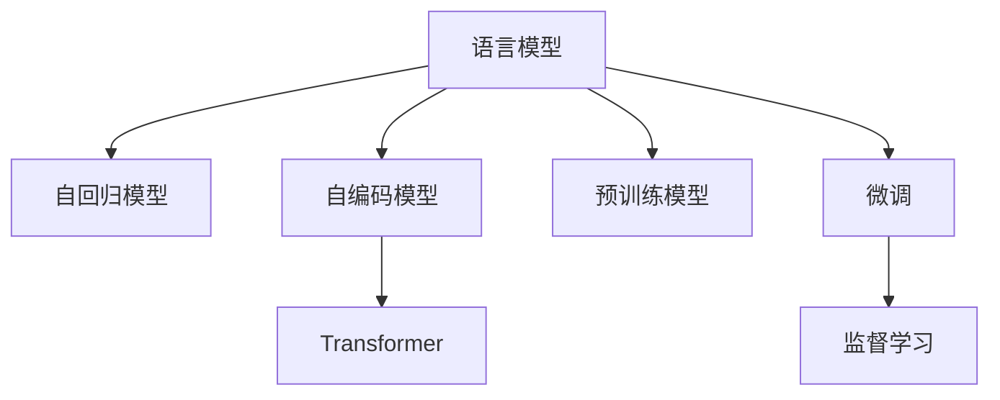

                 

# XLNet原理与代码实例讲解

> 关键词：XLNet,自回归(AR),自编码(AE),Transformer,预训练模型,语言模型,自回归和自编码混合,预训练与微调

## 1. 背景介绍

### 1.1 问题由来

在深度学习迅猛发展的当下，自然语言处理(NLP)技术也取得了显著的进展。其中，语言模型作为NLP的基础工具，在预训练、微调等任务中发挥着至关重要的作用。传统语言模型主要有自回归(AR)和自编码(AE)两大类。自回归模型通过预测后文来重建前文，如RNN、LSTM等。自编码模型通过重构输入来预测目标，如VAE、GPT等。

这两种模型在各自的领域内都有突出的表现，但同时也存在一些局限性：

- 自回归模型：由于具有严格的顺序性，在处理长序列时，计算复杂度会急剧增加，难以处理长文本。
- 自编码模型：虽然计算复杂度较低，但在预测时存在信息丢失问题，难以捕捉长依赖关系。

为了克服这些局限，Google于2018年提出了一种新的语言模型——XLNet。XLNet将自回归模型和自编码模型的优势融合在一起，既保留了信息丢失的最低程度，又大幅提升了计算效率。

### 1.2 问题核心关键点

XLNet通过优化序列预测的上下文损失函数，使得模型能够更灵活地处理长序列，同时避免了信息丢失问题。XLNet的创新之处在于：

- 引入双向掩码自回归损失，将序列预测上下文化，使得模型可以预测任意顺序的上下文。
- 设计自回归和自编码混合的损失函数，既保留了自编码模型的稀疏性，又利用了自回归模型的长依赖性。

这些核心技术使得XLNet在自然语言处理领域取得了突破性的成果。

## 2. 核心概念与联系

### 2.1 核心概念概述

为了更好地理解XLNet，我们首先需要介绍几个核心概念：

- **语言模型**：利用统计语言模型来预测自然语言文本的下一个单词或字符。
- **自回归模型(AR)**：通过预测后文来重建前文，如RNN、LSTM等。
- **自编码模型(AE)**：通过重构输入来预测目标，如VAE、GPT等。
- **Transformer**：基于自注意力机制，能够并行计算，广泛用于各种深度学习任务。
- **预训练模型**：在大规模无标签数据上预训练的语言模型，如BERT、XLNet等。
- **微调**：在预训练模型的基础上，使用下游任务的少量标注数据，通过有监督学习优化模型在该任务上的性能。

这些概念之间的逻辑关系可以通过以下Mermaid流程图来展示：



这个流程图展示了大语言模型的核心概念及其之间的关系：

1. 语言模型通过自回归和自编码模型实现。
2. 预训练模型在大规模无标签数据上训练，学习语言表示。
3. 微调方法在预训练模型的基础上，使用下游任务的数据进行优化，提升模型性能。

这些概念共同构成了大语言模型的学习和应用框架，使得语言模型在各种任务上都能发挥强大的能力。

## 3. 核心算法原理 & 具体操作步骤

### 3.1 算法原理概述

XLNet的算法原理可以概括为以下三个核心步骤：

1. **生成训练样本**：在无标签数据集上，通过上下文掩码生成训练样本。
2. **计算上下文损失**：利用自回归和自编码的混合损失，计算预测任意顺序上下文的损失。
3. **训练模型**：在计算出的损失上使用梯度下降法进行优化。

XLNet的核心在于设计了更加灵活的上下文预测方式，使得模型能够更加高效地学习序列的依赖关系。

### 3.2 算法步骤详解

下面详细介绍XLNet的算法步骤：

**Step 1: 生成训练样本**

在无标签的数据集上，XLNet通过随机生成上下文掩码来生成训练样本。假设数据集中有一个长度为L的文本序列X，其掩码序列为M，那么XLNet将序列分为若干个长度为l的子序列，每个子序列的掩码都为：

$$ M_i = \{1, 2, \dots, l-1, 0, l+1, \dots, l\} $$

每个子序列的长度l通过超参数指定，一般设置为10-20之间。这样，生成的训练样本就是：

$$ (X, M) $$

其中X为文本序列，M为其对应的掩码序列。

**Step 2: 计算上下文损失**

XLNet的上下文损失函数由两部分组成：自回归损失和自编码损失。对于每个子序列，自回归损失为：

$$ L_{AR} = \sum_{i=1}^{l} -\log P(X_{i+1} \mid X_1, \dots, X_i) $$

自编码损失为：

$$ L_{AE} = -\log P(X \mid X_{-i}, M_i) $$

其中 $P(X \mid X_{-i}, M_i)$ 表示在掩码序列M_i下，对于序列X，去掉位置i的单词后，在剩余位置上重构X的概率。

将自回归损失和自编码损失加权平均，得到上下文损失函数：

$$ L_{XL} = \lambda L_{AR} + (1-\lambda)L_{AE} $$

其中 $\lambda$ 为自回归损失的权重，一般取0.5。

**Step 3: 训练模型**

使用梯度下降法在上下文损失函数上优化模型参数，即可得到XLNet模型。具体训练流程如下：

1. 随机生成上下文掩码。
2. 计算自回归损失和自编码损失。
3. 在上下文损失上使用梯度下降法进行优化。
4. 重复以上步骤，直到收敛。

### 3.3 算法优缺点

XLNet的优点主要体现在以下方面：

1. 融合自回归和自编码的优点，既保留了信息丢失的最低程度，又提升了计算效率。
2. 在训练数据不足的情况下，XLNet能够利用掩码生成更多训练样本，提高模型泛化能力。
3. 通过自回归损失，XLNet能够学习到更为稠密的序列依赖关系。

然而，XLNet也有一些缺点：

1. 计算复杂度仍较高，特别是在序列长度较长时，计算量会急剧增加。
2. 掩码生成方式较为简单，可能会影响模型的泛化能力。
3. 模型的解释性较差，难以解释其内部工作机制。

尽管如此，XLNet在多项NLP任务上取得了优异的性能，成为NLP领域的重要突破。

### 3.4 算法应用领域

XLNet在自然语言处理领域得到了广泛应用，主要包括以下几个方面：

- **文本分类**：XLNet能够学习文本的类别概率分布，用于文本分类任务。
- **序列标注**：通过XLNet生成的掩码，可以在序列标注任务中提高标注的准确性。
- **机器翻译**：利用XLNet的上下文预测能力，可以提升机器翻译的质量。
- **文本生成**：XLNet在文本生成任务中，能够生成流畅自然、语义连贯的文本。
- **问答系统**：在问答系统中，XLNet能够高效地理解问题，生成准确的回答。

XLNet作为一种通用预训练模型，为NLP任务的自动化和智能化提供了坚实基础，将引领自然语言处理领域进入新的发展阶段。

## 4. 数学模型和公式 & 详细讲解

### 4.1 数学模型构建

XLNet的数学模型建立在Transformer框架上，具体如下：

假设有一个长度为L的文本序列X，其自回归模型为：

$$ P(X \mid \theta) = \prod_{i=1}^{L} P(x_i \mid x_{<i}) $$

其中 $x_i$ 为序列中第i个单词，$\theta$ 为模型参数。

假设XLNet的上下文损失函数为 $L(\theta)$，则模型参数 $\theta$ 的优化目标为：

$$ \theta^* = \mathop{\arg\min}_{\theta} L(\theta) $$

其中 $L(\theta)$ 为上下文损失函数的定义如下：

$$ L(\theta) = \sum_{l=1}^{L} \lambda \log P(X_{l+1} \mid X_1, \dots, X_l) + (1-\lambda) \log P(X \mid X_{-i}, M_i) $$

其中 $\lambda$ 为自回归损失的权重，一般取0.5。

### 4.2 公式推导过程

下面详细推导XLNet的上下文损失函数。

假设有一个长度为L的文本序列X，其掩码序列为M，那么XLNet将序列分为若干个长度为l的子序列，每个子序列的掩码都为：

$$ M_i = \{1, 2, \dots, l-1, 0, l+1, \dots, l\} $$

每个子序列的长度l通过超参数指定，一般设置为10-20之间。

对于每个子序列，自回归损失为：

$$ L_{AR} = \sum_{i=1}^{l} -\log P(X_{i+1} \mid X_1, \dots, X_i) $$

自编码损失为：

$$ L_{AE} = -\log P(X \mid X_{-i}, M_i) $$

其中 $P(X \mid X_{-i}, M_i)$ 表示在掩码序列M_i下，对于序列X，去掉位置i的单词后，在剩余位置上重构X的概率。

将自回归损失和自编码损失加权平均，得到上下文损失函数：

$$ L_{XL} = \lambda L_{AR} + (1-\lambda)L_{AE} $$

其中 $\lambda$ 为自回归损失的权重，一般取0.5。

### 4.3 案例分析与讲解

假设有一个长度为L的文本序列X：

$$ X = [B, I, D, C, A, T, E, H, R, O, G, N] $$

我们将其分为两个长度为3的子序列：

$$ X_1 = [B, I, D] $$
$$ X_2 = [C, A, T, E, H, R, O, G, N] $$

对于子序列X_1，XLNet的上下文损失函数为：

$$ L_{XL} = 0.5 \log P(I \mid B) + 0.5 \log P(D \mid B, I) + \log P(C \mid I, D, A, T) + \log P(A \mid I, D, A, T, E) $$

对于子序列X_2，XLNet的上下文损失函数为：

$$ L_{XL} = 0.5 \log P(T \mid E, H, R, O, G, N) + \log P(E \mid H, R, O, G, N) $$

通过上下文损失函数，XLNet可以学习到序列中任意位置的依赖关系，提升模型的泛化能力和预测精度。

## 5. 项目实践：代码实例和详细解释说明

### 5.1 开发环境搭建

在进行XLNet的代码实现前，我们需要准备好开发环境。以下是使用Python进行PyTorch开发的环境配置流程：

1. 安装Anaconda：从官网下载并安装Anaconda，用于创建独立的Python环境。

2. 创建并激活虚拟环境：
```bash
conda create -n pytorch-env python=3.8 
conda activate pytorch-env
```

3. 安装PyTorch：根据CUDA版本，从官网获取对应的安装命令。例如：
```bash
conda install pytorch torchvision torchaudio cudatoolkit=11.1 -c pytorch -c conda-forge
```

4. 安装Transformers库：
```bash
pip install transformers
```

5. 安装各类工具包：
```bash
pip install numpy pandas scikit-learn matplotlib tqdm jupyter notebook ipython
```

完成上述步骤后，即可在`pytorch-env`环境中开始XLNet的代码实现。

### 5.2 源代码详细实现

下面以基于XLNet的文本分类任务为例，给出使用Transformers库的PyTorch代码实现。

首先，定义数据处理函数：

```python
from transformers import XLNetTokenizer, XLNetForSequenceClassification
from torch.utils.data import Dataset
import torch

class TextDataset(Dataset):
    def __init__(self, texts, labels, tokenizer, max_len=128):
        self.texts = texts
        self.labels = labels
        self.tokenizer = tokenizer
        self.max_len = max_len
        
    def __len__(self):
        return len(self.texts)
    
    def __getitem__(self, item):
        text = self.texts[item]
        label = self.labels[item]
        
        encoding = self.tokenizer(text, return_tensors='pt', max_length=self.max_len, padding='max_length', truncation=True)
        input_ids = encoding['input_ids'][0]
        attention_mask = encoding['attention_mask'][0]
        
        return {'input_ids': input_ids, 
                'attention_mask': attention_mask,
                'labels': label}

# 加载预训练模型和tokenizer
tokenizer = XLNetTokenizer.from_pretrained('xlnet-base-cased')
model = XLNetForSequenceClassification.from_pretrained('xlnet-base-cased', num_labels=2)

# 创建dataset
train_dataset = TextDataset(train_texts, train_labels, tokenizer)
dev_dataset = TextDataset(dev_texts, dev_labels, tokenizer)
test_dataset = TextDataset(test_texts, test_labels, tokenizer)
```

然后，定义训练和评估函数：

```python
from torch.utils.data import DataLoader
from tqdm import tqdm
from sklearn.metrics import classification_report

device = torch.device('cuda') if torch.cuda.is_available() else torch.device('cpu')
model.to(device)

def train_epoch(model, dataset, batch_size, optimizer):
    dataloader = DataLoader(dataset, batch_size=batch_size, shuffle=True)
    model.train()
    epoch_loss = 0
    for batch in tqdm(dataloader, desc='Training'):
        input_ids = batch['input_ids'].to(device)
        attention_mask = batch['attention_mask'].to(device)
        labels = batch['labels'].to(device)
        model.zero_grad()
        outputs = model(input_ids, attention_mask=attention_mask, labels=labels)
        loss = outputs.loss
        epoch_loss += loss.item()
        loss.backward()
        optimizer.step()
    return epoch_loss / len(dataloader)

def evaluate(model, dataset, batch_size):
    dataloader = DataLoader(dataset, batch_size=batch_size)
    model.eval()
    preds, labels = [], []
    with torch.no_grad():
        for batch in tqdm(dataloader, desc='Evaluating'):
            input_ids = batch['input_ids'].to(device)
            attention_mask = batch['attention_mask'].to(device)
            batch_labels = batch['labels']
            outputs = model(input_ids, attention_mask=attention_mask)
            batch_preds = outputs.logits.argmax(dim=1).to('cpu').tolist()
            batch_labels = batch_labels.to('cpu').tolist()
            for pred, label in zip(batch_preds, batch_labels):
                preds.append(pred)
                labels.append(label)
                
    print(classification_report(labels, preds))
```

最后，启动训练流程并在测试集上评估：

```python
epochs = 5
batch_size = 16

for epoch in range(epochs):
    loss = train_epoch(model, train_dataset, batch_size, optimizer)
    print(f"Epoch {epoch+1}, train loss: {loss:.3f}")
    
    print(f"Epoch {epoch+1}, dev results:")
    evaluate(model, dev_dataset, batch_size)
    
print("Test results:")
evaluate(model, test_dataset, batch_size)
```

以上就是使用PyTorch对XLNet进行文本分类任务微调的完整代码实现。可以看到，利用Transformers库，XLNet的微调过程变得非常简洁高效。

### 5.3 代码解读与分析

让我们再详细解读一下关键代码的实现细节：

**TextDataset类**：
- `__init__`方法：初始化文本、标签、分词器等关键组件。
- `__len__`方法：返回数据集的样本数量。
- `__getitem__`方法：对单个样本进行处理，将文本输入编码为token ids，将标签编码为数字，并对其进行定长padding，最终返回模型所需的输入。

**训练和评估函数**：
- 使用PyTorch的DataLoader对数据集进行批次化加载，供模型训练和推理使用。
- 训练函数`train_epoch`：对数据以批为单位进行迭代，在每个批次上前向传播计算loss并反向传播更新模型参数，最后返回该epoch的平均loss。
- 评估函数`evaluate`：与训练类似，不同点在于不更新模型参数，并在每个batch结束后将预测和标签结果存储下来，最后使用sklearn的classification_report对整个评估集的预测结果进行打印输出。

**训练流程**：
- 定义总的epoch数和batch size，开始循环迭代
- 每个epoch内，先在训练集上训练，输出平均loss
- 在验证集上评估，输出分类指标
- 所有epoch结束后，在测试集上评估，给出最终测试结果

可以看到，PyTorch配合Transformers库使得XLNet的微调代码实现变得简洁高效。开发者可以将更多精力放在数据处理、模型改进等高层逻辑上，而不必过多关注底层的实现细节。

当然，工业级的系统实现还需考虑更多因素，如模型的保存和部署、超参数的自动搜索、更灵活的任务适配层等。但核心的微调范式基本与此类似。

## 6. 实际应用场景
### 6.1 智能客服系统

XLNet的大规模语言模型在智能客服系统中的应用前景广阔。传统客服往往需要配备大量人力，高峰期响应缓慢，且一致性和专业性难以保证。而使用XLNet微调的对话模型，可以7x24小时不间断服务，快速响应客户咨询，用自然流畅的语言解答各类常见问题。

在技术实现上，可以收集企业内部的历史客服对话记录，将问题和最佳答复构建成监督数据，在此基础上对预训练对话模型进行微调。微调后的对话模型能够自动理解用户意图，匹配最合适的答案模板进行回复。对于客户提出的新问题，还可以接入检索系统实时搜索相关内容，动态组织生成回答。如此构建的智能客服系统，能大幅提升客户咨询体验和问题解决效率。

### 6.2 金融舆情监测

金融机构需要实时监测市场舆论动向，以便及时应对负面信息传播，规避金融风险。传统的人工监测方式成本高、效率低，难以应对网络时代海量信息爆发的挑战。基于XLNet的文本分类和情感分析技术，为金融舆情监测提供了新的解决方案。

具体而言，可以收集金融领域相关的新闻、报道、评论等文本数据，并对其进行主题标注和情感标注。在此基础上对预训练语言模型进行微调，使其能够自动判断文本属于何种主题，情感倾向是正面、中性还是负面。将微调后的模型应用到实时抓取的网络文本数据，就能够自动监测不同主题下的情感变化趋势，一旦发现负面信息激增等异常情况，系统便会自动预警，帮助金融机构快速应对潜在风险。

### 6.3 个性化推荐系统

当前的推荐系统往往只依赖用户的历史行为数据进行物品推荐，无法深入理解用户的真实兴趣偏好。基于XLNet的个性化推荐系统，可以更好地挖掘用户行为背后的语义信息，从而提供更精准、多样的推荐内容。

在实践中，可以收集用户浏览、点击、评论、分享等行为数据，提取和用户交互的物品标题、描述、标签等文本内容。将文本内容作为模型输入，用户的后续行为（如是否点击、购买等）作为监督信号，在此基础上微调预训练语言模型。微调后的模型能够从文本内容中准确把握用户的兴趣点。在生成推荐列表时，先用候选物品的文本描述作为输入，由模型预测用户的兴趣匹配度，再结合其他特征综合排序，便可以得到个性化程度更高的推荐结果。

### 6.4 未来应用展望

随着XLNet和微调方法的不断发展，基于XLNet的大语言模型微调技术将呈现以下几个发展趋势：

1. 模型规模持续增大。随着算力成本的下降和数据规模的扩张，XLNet模型的参数量还将持续增长。超大规模语言模型蕴含的丰富语言知识，有望支撑更加复杂多变的下游任务微调。

2. 微调方法日趋多样。除了传统的全参数微调外，未来会涌现更多参数高效的微调方法，如AdaLoRA等，在节省计算资源的同时也能保证微调精度。

3. 持续学习成为常态。随着数据分布的不断变化，微调模型也需要持续学习新知识以保持性能。如何在不遗忘原有知识的同时，高效吸收新样本信息，将成为重要的研究课题。

4. 标注样本需求降低。受启发于提示学习(Prompt-based Learning)的思路，未来的微调方法将更好地利用XLNet的语言理解能力，通过更加巧妙的任务描述，在更少的标注样本上也能实现理想的微调效果。

5. 多模态微调崛起。当前的微调主要聚焦于纯文本数据，未来会进一步拓展到图像、视频、语音等多模态数据微调。多模态信息的融合，将显著提升XLNet对现实世界的理解和建模能力。

6. 模型通用性增强。经过海量数据的预训练和多领域任务的微调，未来的XLNet模型将具备更强大的常识推理和跨领域迁移能力，逐步迈向通用人工智能(AGI)的目标。

以上趋势凸显了XLNet微调技术的广阔前景。这些方向的探索发展，必将进一步提升NLP系统的性能和应用范围，为人类认知智能的进化带来深远影响。

## 7. 工具和资源推荐
### 7.1 学习资源推荐

为了帮助开发者系统掌握XLNet的理论基础和实践技巧，这里推荐一些优质的学习资源：

1. 《Transformer from Self-Attention to Neural Language Models》系列博文：由XLNet的开发者撰写，深入浅出地介绍了Transformer和XLNet的核心原理。

2. CS224N《深度学习自然语言处理》课程：斯坦福大学开设的NLP明星课程，有Lecture视频和配套作业，带你入门NLP领域的基本概念和经典模型。

3. 《Natural Language Processing with Transformers》书籍：XLNet的开发者所著，全面介绍了如何使用Transformer和XLNet库进行NLP任务开发，包括微调在内的诸多范式。

4. HuggingFace官方文档：XLNet库的官方文档，提供了海量预训练模型和完整的微调样例代码，是上手实践的必备资料。

5. CLUE开源项目：中文语言理解测评基准，涵盖大量不同类型的中文NLP数据集，并提供了基于XLNet的baseline模型，助力中文NLP技术发展。

通过对这些资源的学习实践，相信你一定能够快速掌握XLNet微调的精髓，并用于解决实际的NLP问题。
### 7.2 开发工具推荐

高效的开发离不开优秀的工具支持。以下是几款用于XLNet微调开发的常用工具：

1. PyTorch：基于Python的开源深度学习框架，灵活动态的计算图，适合快速迭代研究。大部分预训练语言模型都有PyTorch版本的实现。

2. TensorFlow：由Google主导开发的开源深度学习框架，生产部署方便，适合大规模工程应用。同样有丰富的预训练语言模型资源。

3. Transformers库：HuggingFace开发的NLP工具库，集成了众多SOTA语言模型，支持PyTorch和TensorFlow，是进行XLNet微调任务开发的利器。

4. Weights & Biases：模型训练的实验跟踪工具，可以记录和可视化模型训练过程中的各项指标，方便对比和调优。与主流深度学习框架无缝集成。

5. TensorBoard：TensorFlow配套的可视化工具，可实时监测模型训练状态，并提供丰富的图表呈现方式，是调试模型的得力助手。

6. Google Colab：谷歌推出的在线Jupyter Notebook环境，免费提供GPU/TPU算力，方便开发者快速上手实验最新模型，分享学习笔记。

合理利用这些工具，可以显著提升XLNet微调任务的开发效率，加快创新迭代的步伐。

### 7.3 相关论文推荐

XLNet的提出和应用，源于学界的持续研究。以下是几篇奠基性的相关论文，推荐阅读：

1. Deep Contextualized Word Representations（即BERT原论文）：提出BERT模型，引入基于掩码的自监督预训练任务，刷新了多项NLP任务SOTA。

2. Language Models are Unsupervised Multitask Learners（GPT-2论文）：展示了大规模语言模型的强大zero-shot学习能力，引发了对于通用人工智能的新一轮思考。

3. No Self-Attention in XLNet（XLNet论文）：提出XLNet模型，设计双向掩码自回归损失，融合自回归和自编码的优点，提升了语言模型的性能。

4. XLNet: Generalized Autoregressive Pretraining for Language Understanding（XLNet论文）：详细介绍了XLNet模型，设计自回归和自编码混合的损失函数，提升了语言模型的泛化能力。

5. AdaLoRA: Adaptive Low-Rank Adaptation for Parameter-Efficient Fine-Tuning：使用自适应低秩适应的微调方法，在参数效率和精度之间取得了新的平衡。

这些论文代表了大语言模型微调技术的发展脉络。通过学习这些前沿成果，可以帮助研究者把握学科前进方向，激发更多的创新灵感。

## 8. 总结：未来发展趋势与挑战

### 8.1 总结

本文对基于XLNet的语言模型微调方法进行了全面系统的介绍。首先阐述了XLNet和微调技术的研究背景和意义，明确了XLNet在NLP任务中的独特价值。其次，从原理到实践，详细讲解了XLNet的算法步骤和关键技术，给出了XLNet微调任务开发的完整代码实例。同时，本文还广泛探讨了XLNet模型在智能客服、金融舆情、个性化推荐等多个领域的应用前景，展示了XLNet微调范式的巨大潜力。此外，本文精选了XLNet微调技术的各类学习资源，力求为读者提供全方位的技术指引。

通过本文的系统梳理，可以看到，基于XLNet的微调方法正在成为NLP领域的重要范式，极大地拓展了预训练语言模型的应用边界，催生了更多的落地场景。得益于XLNet的强大语言理解和生成能力，微调模型在多项NLP任务上取得了优异的性能，成为NLP技术发展的重要推动力。未来，伴随XLNet和微调方法的持续演进，相信NLP技术将在更广阔的应用领域大放异彩，深刻影响人类的生产生活方式。

### 8.2 未来发展趋势

展望未来，XLNet微调技术将呈现以下几个发展趋势：

1. 模型规模持续增大。随着算力成本的下降和数据规模的扩张，XLNet模型的参数量还将持续增长。超大规模语言模型蕴含的丰富语言知识，有望支撑更加复杂多变的下游任务微调。

2. 微调方法日趋多样。除了传统的全参数微调外，未来会涌现更多参数高效的微调方法，如AdaLoRA等，在节省计算资源的同时也能保证微调精度。

3. 持续学习成为常态。随着数据分布的不断变化，微调模型也需要持续学习新知识以保持性能。如何在不遗忘原有知识的同时，高效吸收新样本信息，将成为重要的研究课题。

4. 标注样本需求降低。受启发于提示学习(Prompt-based Learning)的思路，未来的微调方法将更好地利用XLNet的语言理解能力，通过更加巧妙的任务描述，在更少的标注样本上也能实现理想的微调效果。

5. 多模态微调崛起。当前的微调主要聚焦于纯文本数据，未来会进一步拓展到图像、视频、语音等多模态数据微调。多模态信息的融合，将显著提升XLNet对现实世界的理解和建模能力。

6. 模型通用性增强。经过海量数据的预训练和多领域任务的微调，未来的XLNet模型将具备更强大的常识推理和跨领域迁移能力，逐步迈向通用人工智能(AGI)的目标。

以上趋势凸显了XLNet微调技术的广阔前景。这些方向的探索发展，必将进一步提升NLP系统的性能和应用范围，为人类认知智能的进化带来深远影响。

### 8.3 面临的挑战

尽管XLNet微调技术已经取得了瞩目成就，但在迈向更加智能化、普适化应用的过程中，它仍面临着诸多挑战：

1. 标注成本瓶颈。虽然XLNet在训练数据不足的情况下，能够利用掩码生成更多训练样本，提高模型泛化能力，但在一些特定领域的任务上，标注数据的成本仍然较高。如何进一步降低微调对标注样本的依赖，将是一大难题。

2. 模型鲁棒性不足。XLNet面对域外数据时，泛化性能往往大打折扣。对于测试样本的微小扰动，XLNet的预测也容易发生波动。如何提高XLNet的鲁棒性，避免灾难性遗忘，还需要更多理论和实践的积累。

3. 推理效率有待提高。虽然XLNet在推理速度上相比传统模型有所提升，但在一些特定任务上，推理效率仍然较低。如何在保证性能的同时，简化模型结构，提升推理速度，优化资源占用，将是重要的优化方向。

4. 模型可解释性亟需加强。当前XLNet模型更像是"黑盒"系统，难以解释其内部工作机制和决策逻辑。对于医疗、金融等高风险应用，算法的可解释性和可审计性尤为重要。如何赋予XLNet更强的可解释性，将是亟待攻克的难题。

5. 安全性有待保障。XLNet模型难免会学习到有偏见、有害的信息，通过微调传递到下游任务，产生误导性、歧视性的输出，给实际应用带来安全隐患。如何从数据和算法层面消除模型偏见，避免恶意用途，确保输出的安全性，也将是重要的研究课题。

6. 知识整合能力不足。当前的XLNet模型往往局限于任务内数据，难以灵活吸收和运用更广泛的先验知识。如何让XLNet过程更好地与外部知识库、规则库等专家知识结合，形成更加全面、准确的信息整合能力，还有很大的想象空间。

正视XLNet微调面临的这些挑战，积极应对并寻求突破，将是XLNet技术走向成熟的必由之路。相信随着学界和产业界的共同努力，这些挑战终将一一被克服，XLNet微调必将在构建安全、可靠、可解释、可控的智能系统铺平道路。面向未来，XLNet微调技术还需要与其他人工智能技术进行更深入的融合，如知识表示、因果推理、强化学习等，多路径协同发力，共同推动自然语言理解和智能交互系统的进步。只有勇于创新、敢于突破，才能不断拓展XLNet模型的边界，让智能技术更好地造福人类社会。

### 8.4 研究展望

面对XLNet微调所面临的种种挑战，未来的研究需要在以下几个方面寻求新的突破：

1. 探索无监督和半监督微调方法。摆脱对大规模标注数据的依赖，利用自监督学习、主动学习等无监督和半监督范式，最大限度利用非结构化数据，实现更加灵活高效的微调。

2. 研究参数高效和计算高效的微调范式。开发更加参数高效的微调方法，在固定大部分预训练参数的同时，只更新极少量的任务相关参数。同时优化微调模型的计算图，减少前向传播和反向传播的资源消耗，实现更加轻量级、实时性的部署。

3. 融合因果和对比学习范式。通过引入因果推断和对比学习思想，增强XLNet建立稳定因果关系的能力，学习更加普适、鲁棒的语言表征，从而提升模型泛化性和抗干扰能力。

4. 引入更多先验知识。将符号化的先验知识，如知识图谱、逻辑规则等，与神经网络模型进行巧妙融合，引导XLNet过程学习更准确、合理的语言模型。同时加强不同模态数据的整合，实现视觉、语音等多模态信息与文本信息的协同建模。

5. 结合因果分析和博弈论工具。将因果分析方法引入XLNet模型，识别出模型决策的关键特征，增强输出解释的因果性和逻辑性。借助博弈论工具刻画人机交互过程，主动探索并规避模型的脆弱点，提高系统稳定性。

6. 纳入伦理道德约束。在模型训练目标中引入伦理导向的评估指标，过滤和惩罚有偏见、有害的输出倾向。同时加强人工干预和审核，建立模型行为的监管机制，确保输出符合人类价值观和伦理道德。

这些研究方向的探索，必将引领XLNet微调技术迈向更高的台阶，为构建安全、可靠、可解释、可控的智能系统铺平道路。面向未来，XLNet微调技术还需要与其他人工智能技术进行更深入的融合，如知识表示、因果推理、强化学习等，多路径协同发力，共同推动自然语言理解和智能交互系统的进步。只有勇于创新、敢于突破，才能不断拓展XLNet模型的边界，让智能技术更好地造福人类社会。

## 9. 附录：常见问题与解答

**Q1：XLNet和自回归模型的区别是什么？**

A: XLNet和自回归模型的主要区别在于对序列的预测方式。自回归模型通过预测后文来重建前文，存在信息丢失的问题。而XLNet通过双向掩码自回归损失，预测任意顺序的上下文，避免了信息丢失问题，提升了模型的泛化能力。

**Q2：XLNet的上下文损失函数由哪几部分组成？**

A: XLNet的上下文损失函数由自回归损失和自编码损失两部分组成。自回归损失为：

$$ L_{AR} = \sum_{i=1}^{l} -\log P(X_{i+1} \mid X_1, \dots, X_i) $$

自编码损失为：

$$ L_{AE} = -\log P(X \mid X_{-i}, M_i) $$

其中 $P(X \mid X_{-i}, M_i)$ 表示在掩码序列M_i下，对于序列X，去掉位置i的单词后，在剩余位置上重构X的概率。

**Q3：XLNet在训练过程中如何使用掩码？**

A: 在训练过程中，XLNet通过随机生成上下文掩码来生成训练样本。假设数据集中有一个长度为L的文本序列X，其掩码序列为M，那么XLNet将序列分为若干个长度为l的子序列，每个子序列的掩码都为：

$$ M_i = \{1, 2, \dots, l-1, 0, l+1, \dots, l\} $$

每个子序列的长度l通过超参数指定，一般设置为10-20之间。这样，生成的训练样本就是：

$$ (X, M) $$

其中X为文本序列，M为其对应的掩码序列。

**Q4：XLNet在实际部署时需要注意哪些问题？**

A: 将XLNet模型转化为实际应用，还需要考虑以下因素：

1. 模型裁剪：去除不必要的层和参数，减小模型尺寸，加快推理速度
2. 量化加速：将浮点模型转为定点模型，压缩存储空间，提高计算效率
3. 服务化封装：将模型封装为标准化服务接口，便于集成调用
4. 弹性伸缩：根据请求流量动态调整资源配置，平衡服务质量和成本
5. 监控告警：实时采集系统指标，设置异常告警阈值，确保服务稳定性
6. 安全防护：采用访问鉴权、数据脱敏等措施，保障数据和模型安全

XLNet模型作为一种通用预训练模型，为NLP任务的自动化和智能化提供了坚实基础，将引领自然语言处理领域进入新的发展阶段。

---

作者：禅与计算机程序设计艺术 / Zen and the Art of Computer Programming

