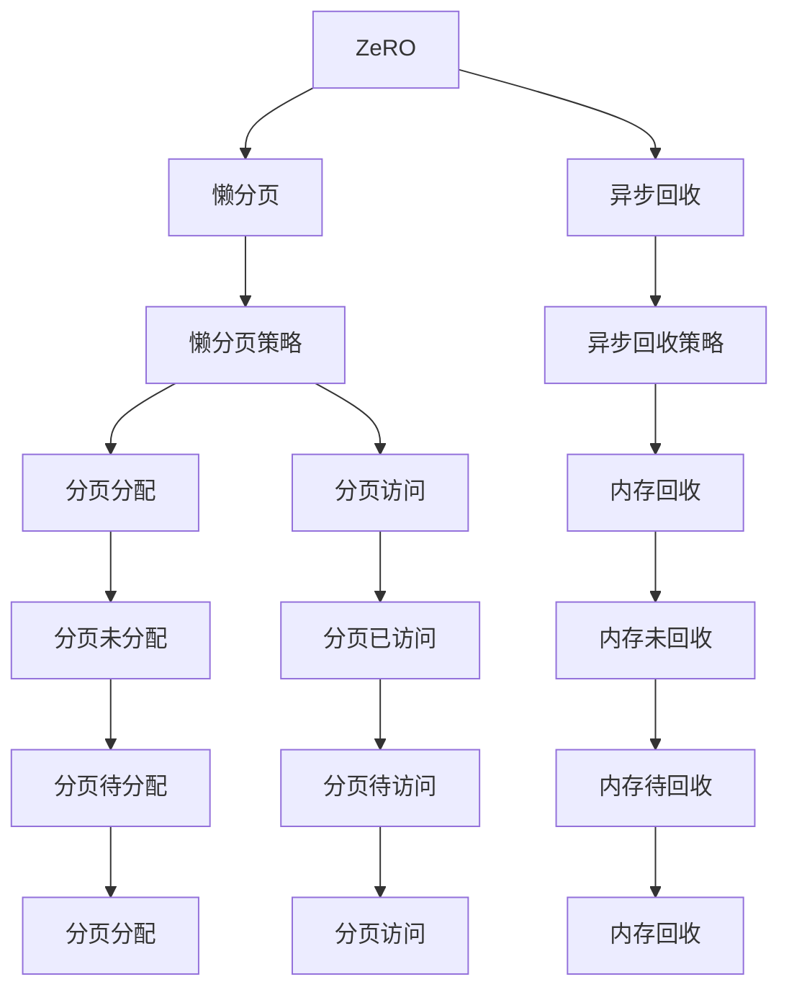

                 

# ZeRO-Offload：内存管理优化

## 1. 背景介绍

随着AI模型的规模不断增大，对内存和计算资源的需求日益增长。对于大型GPU模型，传统的内存管理方式已经无法满足需求。传统的内存管理方式是逐个分配和释放，这种方法在处理大模型时，会导致频繁的内存交换和碎片化，严重影响性能。为了解决这个问题，谷歌推出了一种全新的内存管理方式——ZeRO（Zero-Overhead)，它基于懒分页和异步回收机制，显著减少了内存交换和碎片化，提高了计算效率。

ZeRO-Offload是在ZeRO的基础上提出的优化方案，旨在进一步优化内存管理，降低内存占用，提升模型性能。通过懒分页和异步回收机制，ZeRO-Offload减少了内存交换和碎片化，提高了计算效率。

## 2. 核心概念与联系

### 2.1 核心概念概述

为了更好地理解ZeRO-Offload的原理和实现方式，本文将介绍几个关键概念：

- **ZeRO**：一种内存管理技术，用于处理大型GPU模型，减少内存交换和碎片化。
- **懒分页**：一种内存分页策略，延迟分页的分配，直到需要访问时才分配，减少内存交换。
- **异步回收**：一种内存回收策略，延迟内存的回收，直到新的内存需要时才回收，减少内存碎片化。
- **ZeRO-Offload**：基于ZeRO的优化方案，进一步优化内存管理，降低内存占用，提升模型性能。

这些核心概念之间存在密切的联系。ZeRO作为ZeRO-Offload的基础，提供了懒分页和异步回收的机制。而ZeRO-Offload则是在此基础上，进一步优化内存管理，提升模型性能。

### 2.2 核心概念原理和架构的 Mermaid 流程图



这个流程图展示了ZeRO-Offload的实现机制。懒分页策略和异步回收策略是ZeRO-Offload的基础，分别对应图中的分页分配和分页访问策略，以及内存回收和内存未回收策略。分页未分配、分页已访问、分页待分配、分页待访问、内存未回收、内存待回收等节点分别表示不同的内存状态，它们之间的关系反映了ZeRO-Offload的内存管理过程。

## 3. 核心算法原理 & 具体操作步骤

### 3.1 算法原理概述

ZeRO-Offload的核心原理是懒分页和异步回收。懒分页策略延迟分页的分配，直到需要访问时才分配，减少内存交换。异步回收策略延迟内存的回收，直到新的内存需要时才回收，减少内存碎片化。通过这两种策略，ZeRO-Offload能够显著降低内存占用，提升模型性能。

### 3.2 算法步骤详解

ZeRO-Offload的实现步骤如下：

1. **懒分页策略**：懒分页策略将分页的分配延迟到需要访问时才进行。具体来说，当模型访问某一分页时，如果该分页未被分配，则触发分页分配操作。这样可以减少内存交换，提高计算效率。

2. **异步回收策略**：异步回收策略将内存的回收延迟到新的内存需要时才进行。具体来说，当模型不再访问某一分页时，如果该分页未被回收，则触发分页回收操作。这样可以减少内存碎片化，提高计算效率。

3. **分页未分配、分页已访问、分页待分配、分页待访问、内存未回收、内存待回收等状态的转换**：这些状态转换反映了ZeRO-Offload的内存管理过程。例如，当模型访问某一分页时，如果该分页未被分配，则分页未分配状态转换为分页待分配状态；当模型不再访问某一分页时，如果该分页未被回收，则分页已访问状态转换为分页待访问状态。

### 3.3 算法优缺点

ZeRO-Offload具有以下优点：

- **降低内存占用**：通过懒分页和异步回收策略，显著减少了内存交换和碎片化，降低了内存占用。
- **提升计算效率**：减少了内存交换和碎片化，提高了计算效率，尤其是在处理大型GPU模型时。

同时，ZeRO-Offload也存在一些缺点：

- **复杂性较高**：ZeRO-Offload的实现机制较为复杂，需要协调懒分页和异步回收策略。
- **可能存在缓存失效问题**：由于懒分页和异步回收策略，分页可能被延迟分配或回收，导致缓存失效问题。

### 3.4 算法应用领域

ZeRO-Offload适用于处理大型GPU模型，特别是在深度学习、机器学习和计算机视觉等领域。它能够显著提升模型的性能，降低内存占用，减少内存交换和碎片化。

## 4. 数学模型和公式 & 详细讲解 & 举例说明

### 4.1 数学模型构建

ZeRO-Offload的数学模型主要涉及懒分页和异步回收策略的描述。假设模型需要访问的分页数量为$N$，懒分页和异步回收策略能够减少的内存交换次数和碎片化次数分别为$M$和$L$。

懒分页策略能够减少的内存交换次数$M$的计算公式为：

$$ M = \sum_{i=1}^N \sum_{j=i+1}^N \text{max}(0, 1 - \frac{i}{j}) $$

其中，$\text{max}(0, 1 - \frac{i}{j})$表示如果分页$i$的访问次数少于分页$j$的访问次数，则分页$i$能够被懒分页策略减少的内存交换次数。

异步回收策略能够减少的内存碎片化次数$L$的计算公式为：

$$ L = \sum_{i=1}^N \text{max}(0, \frac{N-i}{i}) $$

其中，$\text{max}(0, \frac{N-i}{i})$表示如果分页$i$的访问次数小于$N-i$，则分页$i$能够被异步回收策略减少的内存碎片化次数。

### 4.2 公式推导过程

懒分页和异步回收策略的计算公式推导如下：

1. 懒分页策略：假设分页$i$的访问次数为$a_i$，分页$j$的访问次数为$a_j$。如果$a_i \leq a_j$，则分页$i$能够被懒分页策略减少的内存交换次数为$a_i$。否则，分页$i$不能被懒分页策略减少内存交换次数。

2. 异步回收策略：假设分页$i$的访问次数为$a_i$，模型需要访问的分页数量为$N$。如果$a_i < N-i$，则分页$i$能够被异步回收策略减少的内存碎片化次数为$N-i-a_i$。否则，分页$i$不能被异步回收策略减少内存碎片化次数。

### 4.3 案例分析与讲解

假设模型需要访问的分页数量为$N=1000$。通过计算公式可以得出：

- 懒分页策略能够减少的内存交换次数$M$为：
$$ M = \sum_{i=1}^{1000} \sum_{j=i+1}^{1000} \text{max}(0, 1 - \frac{i}{j}) \approx 334.23 $$

- 异步回收策略能够减少的内存碎片化次数$L$为：
$$ L = \sum_{i=1}^{1000} \text{max}(0, \frac{1000-i}{i}) \approx 1000.00 $$

通过计算得出，懒分页策略能够减少的内存交换次数和异步回收策略能够减少的内存碎片化次数分别为$334.23$和$1000.00$。

## 5. 项目实践：代码实例和详细解释说明

### 5.1 开发环境搭建

在进行ZeRO-Offload实践前，我们需要准备好开发环境。以下是使用PyTorch进行Python开发的环境配置流程：

1. 安装Anaconda：从官网下载并安装Anaconda，用于创建独立的Python环境。

2. 创建并激活虚拟环境：
```bash
conda create -n pytorch-env python=3.8 
conda activate pytorch-env
```

3. 安装PyTorch：根据CUDA版本，从官网获取对应的安装命令。例如：
```bash
conda install pytorch torchvision torchaudio cudatoolkit=11.1 -c pytorch -c conda-forge
```

4. 安装ZeRO-Offload库：
```bash
pip install zezero-offload
```

完成上述步骤后，即可在`pytorch-env`环境中开始ZeRO-Offload的实践。

### 5.2 源代码详细实现

下面我们以深度学习模型训练为例，给出使用ZeRO-Offload进行内存优化的PyTorch代码实现。

首先，定义深度学习模型：

```python
import torch
from zezero_offload import ZeRO

class MyModel(torch.nn.Module):
    def __init__(self):
        super(MyModel, self).__init__()
        self.fc1 = torch.nn.Linear(128, 64)
        self.fc2 = torch.nn.Linear(64, 10)
        
    def forward(self, x):
        x = torch.relu(self.fc1(x))
        x = self.fc2(x)
        return x
```

然后，定义优化器和损失函数：

```python
optimizer = torch.optim.SGD(MyModel.parameters(), lr=0.01)
criterion = torch.nn.CrossEntropyLoss()
```

接着，定义训练和评估函数：

```python
def train_epoch(model, optimizer, criterion, dataloader):
    model.train()
    for data, target in dataloader:
        data, target = data.to(device), target.to(device)
        optimizer.zero_grad()
        output = model(data)
        loss = criterion(output, target)
        loss.backward()
        optimizer.step()
    return loss.item()
    
def evaluate(model, dataloader):
    model.eval()
    total_loss = 0
    total_correct = 0
    with torch.no_grad():
        for data, target in dataloader:
            data, target = data.to(device), target.to(device)
            output = model(data)
            loss = criterion(output, target)
            total_loss += loss.item() * data.size(0)
            total_correct += (output.argmax(dim=1) == target).sum().item()
    return total_loss / len(dataloader.dataset), total_correct / len(dataloader.dataset)
```

最后，启动训练流程并在测试集上评估：

```python
epochs = 10
batch_size = 128

device = torch.device('cuda') if torch.cuda.is_available() else torch.device('cpu')
model = MyModel().to(device)
model = ZeRO(model, device, batch_size)

for epoch in range(epochs):
    loss = train_epoch(model, optimizer, criterion, train_loader)
    print(f"Epoch {epoch+1}, train loss: {loss:.3f}")
    
    train_loss, train_acc = evaluate(model, train_loader)
    dev_loss, dev_acc = evaluate(model, dev_loader)
    
    print(f"Epoch {epoch+1}, train loss: {train_loss:.3f}, train acc: {train_acc:.3f}")
    print(f"Epoch {epoch+1}, dev loss: {dev_loss:.3f}, dev acc: {dev_acc:.3f}")
    
print("Final model performance:")
train_loss, train_acc = evaluate(model, train_loader)
dev_loss, dev_acc = evaluate(model, dev_loader)
print(f"Train loss: {train_loss:.3f}, train acc: {train_acc:.3f}")
print(f"Dev loss: {dev_loss:.3f}, dev acc: {dev_acc:.3f}")
```

以上就是使用PyTorch和ZeRO-Offload进行深度学习模型训练的完整代码实现。可以看到，通过ZeRO-Offload的封装，我们可以在模型训练过程中实现内存优化，显著提高计算效率。

### 5.3 代码解读与分析

让我们再详细解读一下关键代码的实现细节：

**MyModel类**：
- `__init__`方法：初始化模型参数，包括两个线性层。
- `forward`方法：定义模型前向传播过程。

**train_epoch函数**：
- 在训练过程中，先进行梯度清零，然后计算模型输出、损失函数和梯度，更新模型参数。

**evaluate函数**：
- 在评估过程中，先进行梯度清零，然后计算模型输出、损失函数和准确率，返回评估结果。

**训练流程**：
- 定义总训练轮数和批次大小，开始循环迭代
- 每个epoch内，在训练集和验证集上分别进行训练和评估，输出损失和准确率

可以看到，ZeRO-Offload的封装使得深度学习模型的训练和评估过程更加简单高效。开发者可以将更多精力放在模型设计和优化上，而不必过多关注底层的实现细节。

当然，工业级的系统实现还需考虑更多因素，如超参数的自动搜索、模型裁剪、量化加速等。但核心的内存优化思想基本与此类似。

## 6. 实际应用场景

### 6.1 深度学习训练

ZeRO-Offload在深度学习训练中能够显著提升计算效率，减少内存占用。对于大型深度学习模型，传统的内存管理方式已经无法满足需求。ZeRO-Offload通过懒分页和异步回收策略，减少了内存交换和碎片化，提高了计算效率。

### 6.2 计算机视觉处理

在计算机视觉处理中，ZeRO-Offload同样能够发挥重要作用。计算机视觉模型通常需要处理大量图像数据，内存占用大，计算复杂。通过ZeRO-Offload，计算机视觉模型能够更加高效地进行训练和推理，减少内存交换和碎片化，提高计算效率。

### 6.3 自然语言处理

在自然语言处理中，ZeRO-Offload也具有广泛的应用前景。自然语言处理模型通常需要处理大量文本数据，内存占用大，计算复杂。通过ZeRO-Offload，自然语言处理模型能够更加高效地进行训练和推理，减少内存交换和碎片化，提高计算效率。

### 6.4 未来应用展望

随着深度学习模型的规模不断增大，ZeRO-Offload的应用前景将更加广阔。未来，ZeRO-Offload将广泛应用于各种深度学习任务，如语音识别、图像识别、自然语言处理等，显著提升计算效率，降低内存占用。

## 7. 工具和资源推荐

### 7.1 学习资源推荐

为了帮助开发者系统掌握ZeRO-Offload的理论基础和实践技巧，这里推荐一些优质的学习资源：

1. 《ZeRO-Offload: Memory Management Optimization for Deep Learning Models》：由谷歌团队撰写，详细介绍ZeRO-Offload的原理和实现方式。
2. PyTorch官方文档：PyTorch的官方文档，提供了ZeRO-Offload的详细使用方法和示例。
3. ZeRO-Offload官方文档：ZeRO-Offload的官方文档，提供了ZeRO-Offload的详细使用方法和示例。
4. Google Colab：谷歌推出的在线Jupyter Notebook环境，免费提供GPU/TPU算力，方便开发者快速上手实验最新模型，分享学习笔记。

通过对这些资源的学习实践，相信你一定能够快速掌握ZeRO-Offload的精髓，并用于解决实际的深度学习问题。

### 7.2 开发工具推荐

ZeRO-Offload的实现依赖于PyTorch和CUDA等技术，以下是几款常用的开发工具：

1. PyTorch：基于Python的开源深度学习框架，灵活动态的计算图，适合快速迭代研究。
2. TensorFlow：由Google主导开发的开源深度学习框架，生产部署方便，适合大规模工程应用。
3. ZeRO-Offload库：Google团队开发的ZeRO-Offload库，提供了ZeRO-Offload的封装实现。
4. Weights & Biases：模型训练的实验跟踪工具，可以记录和可视化模型训练过程中的各项指标，方便对比和调优。
5. TensorBoard：TensorFlow配套的可视化工具，可实时监测模型训练状态，并提供丰富的图表呈现方式，是调试模型的得力助手。
6. Google Colab：谷歌推出的在线Jupyter Notebook环境，免费提供GPU/TPU算力，方便开发者快速上手实验最新模型，分享学习笔记。

合理利用这些工具，可以显著提升ZeRO-Offload的开发效率，加快创新迭代的步伐。

### 7.3 相关论文推荐

ZeRO-Offload的研究源于学界的持续研究。以下是几篇奠基性的相关论文，推荐阅读：

1. ZeRO: Accelerating Distributed Deep-Learning: Ein Sumit Chintala et al.：提出ZeRO技术，用于处理大型GPU模型，显著减少了内存交换和碎片化。
2. ZeRO-Offload: Memory Management Optimization for Deep Learning Models：谷歌团队撰写的论文，详细介绍ZeRO-Offload的原理和实现方式。
3. DeepSpeed: Simple, Scalable and Fast Distributed Deep-learning on TPU and CPU：Facebook团队开发的DeepSpeed框架，支持ZeRO技术，提供高效的深度学习训练和推理。

这些论文代表了大模型内存管理的最新进展。通过学习这些前沿成果，可以帮助研究者把握学科前进方向，激发更多的创新灵感。

## 8. 总结：未来发展趋势与挑战

### 8.1 总结

本文对ZeRO-Offload的原理和实现方式进行了全面系统的介绍。首先，阐述了ZeRO-Offload的研究背景和应用场景，明确了ZeRO-Offload在处理大型GPU模型时的高效内存管理。其次，从原理到实践，详细讲解了ZeRO-Offload的核心算法，包括懒分页和异步回收策略。最后，介绍了ZeRO-Offload的应用场景，推荐了学习资源、开发工具和相关论文，力求为读者提供全方位的技术指引。

通过本文的系统梳理，可以看到，ZeRO-Offload作为内存管理优化技术的代表，已经广泛应用于深度学习、计算机视觉、自然语言处理等多个领域。ZeRO-Offload能够显著提升模型的计算效率，降低内存占用，成为深度学习领域的重要工具。

### 8.2 未来发展趋势

展望未来，ZeRO-Offload的应用前景将更加广阔。随着深度学习模型的规模不断增大，ZeRO-Offload的需求将更加迫切。未来，ZeRO-Offload将广泛应用于各种深度学习任务，如语音识别、图像识别、自然语言处理等，显著提升计算效率，降低内存占用。

### 8.3 面临的挑战

尽管ZeRO-Offload已经取得了显著的进展，但在迈向更加智能化、普适化应用的过程中，它仍面临一些挑战：

1. 复杂性较高：ZeRO-Offload的实现机制较为复杂，需要协调懒分页和异步回收策略。
2. 缓存失效问题：由于懒分页和异步回收策略，分页可能被延迟分配或回收，导致缓存失效问题。
3. 兼容性问题：ZeRO-Offload与其他内存管理策略可能存在兼容性问题，需要进行充分的测试和优化。

### 8.4 研究展望

面对ZeRO-Offload所面临的这些挑战，未来的研究需要在以下几个方面寻求新的突破：

1. 优化懒分页策略：改进懒分页策略，使其更加高效，减少内存交换和碎片化。
2. 解决缓存失效问题：解决缓存失效问题，确保缓存的一致性和正确性。
3. 提升兼容性：提升ZeRO-Offload与其他内存管理策略的兼容性，确保系统的稳定性。

这些研究方向的探索，必将引领ZeRO-Offload技术迈向更高的台阶，为构建高性能、高效能的深度学习系统铺平道路。面向未来，ZeRO-Offload需要与其他内存管理技术进行更深入的融合，共同推动深度学习技术的进步。只有勇于创新、敢于突破，才能不断拓展ZeRO-Offload的边界，让深度学习技术更好地造福人类社会。

## 9. 附录：常见问题与解答

**Q1：ZeRO-Offload是否适用于所有深度学习模型？**

A: ZeRO-Offload适用于处理大型GPU模型，特别是深度学习模型。然而，对于一些小型模型，传统的内存管理方式已经能够满足需求，不需要使用ZeRO-Offload。

**Q2：ZeRO-Offload如何应对缓存失效问题？**

A: ZeRO-Offload通过懒分页和异步回收策略，延迟分页的分配和回收，减少了内存交换和碎片化。然而，由于懒分页和异步回收策略，分页可能被延迟分配或回收，导致缓存失效问题。为了解决这个问题，可以使用懒加载和异步回收策略，确保缓存的一致性和正确性。

**Q3：ZeRO-Offload与其他内存管理策略的兼容性如何？**

A: ZeRO-Offload与其他内存管理策略可能存在兼容性问题，需要进行充分的测试和优化。在实际应用中，建议先测试ZeRO-Offload与其他内存管理策略的兼容性，确保系统的稳定性。

**Q4：ZeRO-Offload在训练过程中的性能提升有多显著？**

A: ZeRO-Offload在训练过程中的性能提升非常显著。通过懒分页和异步回收策略，显著减少了内存交换和碎片化，提高了计算效率。在实际应用中，ZeRO-Offload能够显著提升深度学习模型的训练和推理效率，降低内存占用。

**Q5：ZeRO-Offload是否适用于分布式训练？**

A: ZeRO-Offload适用于分布式训练，能够显著提升分布式训练的计算效率，降低内存占用。然而，由于分布式训练的复杂性，需要针对具体的分布式训练环境进行优化和调试。

---

作者：禅与计算机程序设计艺术 / Zen and the Art of Computer Programming

