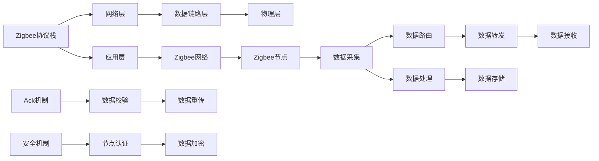

                 

# Zigbee 协议：低功耗无线网状网络

> 关键词：Zigbee, 低功耗, 无线网状网络, 协议标准, IEEE 802.15.4

## 1. 背景介绍

### 1.1 问题由来

物联网(IoT)的迅猛发展催生了对大规模无线传感器网络的需求。传统的无线网络技术，如Wi-Fi和蓝牙，在广覆盖、大容量、低功耗等特性上均存在不足。为此，一种名为Zigbee的无线技术应运而生，它通过采用低功耗、低速率的设计理念，成为物联网领域理想的低功耗传感器网络技术。

Zigbee协议基于IEEE 802.15.4标准，通过定义一系列网络层和物理层协议，实现了节点间的低功耗、低成本、自组网和自配置的网络通信。Zigbee协议广泛应用于智能家居、工业监控、健康医疗、农业自动化等多个领域，其低功耗特性和广泛的应用场景，使其成为物联网网络中不可或缺的重要组成部分。

### 1.2 问题核心关键点

Zigbee协议的核心关键点主要包括以下几个方面：

- 低功耗设计：Zigbee协议采用功率管理机制和睡眠模式，有效降低了通信过程中的功耗消耗。
- 自组织网络：Zigbee节点可以自动发现、配置和形成网状网络，无需人工干预。
- 可靠的数据传输：通过使用循环冗余校验(CRC)、自动重传请求(ARQ)等技术，提高了数据的可靠性。
- 安全保障：Zigbee协议提供了节点认证、数据加密等安全机制，保障网络的安全性。
- 广泛的应用场景：Zigbee协议适用于广大的物联网应用场景，如智能家居、工业监控、健康医疗、农业自动化等。

为了更好地理解Zigbee协议的原理和应用，本文将详细介绍其核心概念与联系、核心算法原理和操作步骤、数学模型与公式推导、项目实践与代码实现、实际应用场景及未来展望等内容。

## 2. 核心概念与联系

### 2.1 核心概念概述

Zigbee协议的核心概念主要包括以下几个方面：

- Zigbee网络：通过Zigbee协议连接的节点形成的自组织网络。
- Zigbee节点：具有感知、采集和传输数据的无线传感器节点。
- Zigbee路由：通过节点间协作，实现数据包的路由和转发。
- Zigbee协议栈：定义了网络层、应用层和物理层等协议栈架构，支持网络通信。
- Zigbee安全：包含节点认证、数据加密等安全机制，保障网络安全。

### 2.2 核心概念原理和架构的 Mermaid 流程图



这个流程图展示了Zigbee协议栈的架构和主要协议流程：

1. Zigbee协议栈包括网络层、数据链路层、物理层和应用层，实现网络通信。
2. 数据从传感器节点采集后，通过数据链路层进行传输。
3. 数据链路层采用循环冗余校验(CRC)和自动重传请求(ARQ)，确保数据传输的可靠性。
4. 数据包在路由节点间进行转发，最终到达目的节点。
5. 数据接收方进行确认，防止数据丢失。
6. 数据安全机制，包括节点认证和数据加密，保障网络安全。

## 3. 核心算法原理 & 具体操作步骤

### 3.1 算法原理概述

Zigbee协议的核心算法包括功率管理、数据路由、节点认证和数据加密等。其中，功率管理和数据路由是实现低功耗和高效通信的关键。

功率管理通过动态调整节点的发射功率和接收灵敏度，实现节能效果。数据路由通过节点间的协作，实现数据包的转发和传递，确保网络通信的稳定性和可靠性。节点认证和数据加密则保障了网络的安全性，防止恶意节点的入侵和数据泄露。

### 3.2 算法步骤详解

#### 3.2.1 功率管理

功率管理是Zigbee协议的核心算法之一，主要通过动态调整节点的发射功率和接收灵敏度，实现低功耗的通信。具体步骤如下：

1. 在通信前，节点通过监听信道，选择空闲的时隙进行通信。
2. 节点发送功率为高功率模式时，可以在较大的范围内进行通信，但功耗较高。
3. 当节点确定通信距离时，将其发射功率降低至合适的功率等级，以降低功耗。
4. 接收灵敏度可以根据接收信号强度自动调整，以实现最优的接收效果。

#### 3.2.2 数据路由

数据路由通过节点间的协作，实现数据包的转发和传递，确保网络通信的稳定性和可靠性。具体步骤如下：

1. 在通信前，节点先进行路由发现，确定与之相邻的节点。
2. 节点将数据包广播给相邻的节点，进行数据路由。
3. 节点通过路由表记录数据包的路由路径，并按照路由表进行数据转发。
4. 节点通过路由算法，选择最优的路由路径，以实现数据包的快速传递。

#### 3.2.3 节点认证

节点认证是Zigbee协议的重要安全机制，主要通过公钥加密和数字签名等技术，确保节点身份的安全性。具体步骤如下：

1. 节点通过私钥生成公钥，并进行节点认证。
2. 节点通过数字签名进行身份验证，防止恶意节点的入侵。
3. 节点通过安全认证机制，确保网络的安全性。

#### 3.2.4 数据加密

数据加密是Zigbee协议的关键安全机制，主要通过DES和AES等算法，对数据进行加密保护。具体步骤如下：

1. 节点对数据进行加密，生成加密后的数据包。
2. 节点将加密后的数据包进行传输，防止数据泄露。
3. 节点对接收到的数据进行解密，还原原始数据。

### 3.3 算法优缺点

#### 3.3.1 优点

1. 低功耗：Zigbee协议采用功率管理机制和睡眠模式，有效降低了通信过程中的功耗消耗。
2. 自组织网络：Zigbee节点可以自动发现、配置和形成网状网络，无需人工干预。
3. 可靠的数据传输：通过使用循环冗余校验(CRC)、自动重传请求(ARQ)等技术，提高了数据的可靠性。
4. 广泛的应用场景：Zigbee协议适用于广大的物联网应用场景，如智能家居、工业监控、健康医疗、农业自动化等。

#### 3.3.2 缺点

1. 带宽有限：Zigbee协议的带宽有限，无法支持高速率的数据传输。
2. 节点数量有限：Zigbee协议的节点数量有限，无法支持大规模的物联网应用。
3. 安全性较低：虽然Zigbee协议提供了节点认证和数据加密等安全机制，但仍然存在一些安全隐患。

### 3.4 算法应用领域

Zigbee协议广泛应用于以下几个领域：

1. 智能家居：通过Zigbee协议连接智能家居设备，实现远程控制和智能管理。
2. 工业监控：通过Zigbee协议连接工业传感器，实现实时监控和数据采集。
3. 健康医疗：通过Zigbee协议连接医疗设备，实现远程监控和健康管理。
4. 农业自动化：通过Zigbee协议连接农业传感器，实现智能灌溉和精准农业。

## 4. 数学模型和公式 & 详细讲解

### 4.1 数学模型构建

Zigbee协议的数学模型主要涉及功率管理、数据路由和节点认证等方面。

#### 4.1.1 功率管理

功率管理通过动态调整节点的发射功率和接收灵敏度，实现节能效果。具体模型如下：

1. 发射功率调整模型：
$$
P_{trans} = P_{max} - (P_{max} - P_{opt})\frac{N_{hear}}{N_{opt}}
$$

其中，$P_{trans}$表示当前发射功率，$P_{max}$表示最高发射功率，$P_{opt}$表示最佳发射功率，$N_{hear}$表示当前信道干扰信号数，$N_{opt}$表示最佳信道干扰信号数。

2. 接收灵敏度调整模型：
$$
L_{recv} = L_{opt} + (L_{opt} - L_{min})\frac{N_{hear}}{N_{opt}}
$$

其中，$L_{recv}$表示当前接收灵敏度，$L_{opt}$表示最佳接收灵敏度，$L_{min}$表示最小接收灵敏度，$N_{hear}$表示当前信道干扰信号数，$N_{opt}$表示最佳信道干扰信号数。

#### 4.1.2 数据路由

数据路由通过节点间的协作，实现数据包的转发和传递。具体模型如下：

1. 路由发现模型：
$$
R_{found} = \sum_{i=1}^{N}R_{i}
$$

其中，$R_{found}$表示路由发现结果，$R_{i}$表示第$i$个节点响应结果。

2. 路由表构建模型：
$$
T_{route} = \sum_{i=1}^{N}T_{i}
$$

其中，$T_{route}$表示路由表，$T_{i}$表示第$i$个节点的路由信息。

#### 4.1.3 节点认证

节点认证通过公钥加密和数字签名等技术，确保节点身份的安全性。具体模型如下：

1. 节点认证模型：
$$
A_{auth} = E_{pubkey}(D_{privkey}(E_{pubkey}(A_{req})))
$$

其中，$A_{auth}$表示认证结果，$A_{req}$表示认证请求，$E_{pubkey}$表示公钥加密，$D_{privkey}$表示私钥解密，$E_{pubkey}(D_{privkey})$表示数字签名。

2. 数字签名模型：
$$
S_{sign} = H(A_{req}) \oplus R_{rand}
$$

其中，$S_{sign}$表示数字签名结果，$H(A_{req})$表示认证请求的哈希值，$R_{rand}$表示随机数。

### 4.2 公式推导过程

#### 4.2.1 功率管理

发射功率调整模型推导过程如下：

1. 节点选择最佳发射功率时，需要考虑信道干扰信号数$N_{hear}$和最佳信道干扰信号数$N_{opt}$。
2. 发射功率$P_{trans}$的调整取决于当前信道干扰信号数$N_{hear}$和最佳信道干扰信号数$N_{opt}$的相对大小。
3. 当信道干扰信号数$N_{hear}$较小，即节点处于低负载状态时，应选择高发射功率；反之，应选择低发射功率。

接收灵敏度调整模型推导过程如下：

1. 节点选择最佳接收灵敏度时，需要考虑信道干扰信号数$N_{hear}$和最佳信道干扰信号数$N_{opt}$。
2. 接收灵敏度$L_{recv}$的调整取决于当前信道干扰信号数$N_{hear}$和最佳信道干扰信号数$N_{opt}$的相对大小。
3. 当信道干扰信号数$N_{hear}$较小，即节点处于低负载状态时，应选择低接收灵敏度；反之，应选择高接收灵敏度。

#### 4.2.2 数据路由

路由发现模型推导过程如下：

1. 路由发现模型通过统计所有节点的响应结果，得到最终的路由发现结果$R_{found}$。
2. 路由发现结果$R_{found}$是所有节点响应结果$R_{i}$的总和，即：
$$
R_{found} = \sum_{i=1}^{N}R_{i}
$$

路由表构建模型推导过程如下：

1. 路由表构建模型通过统计所有节点的路由信息，得到最终的路由表$T_{route}$。
2. 路由表$T_{route}$是所有节点路由信息$T_{i}$的总和，即：
$$
T_{route} = \sum_{i=1}^{N}T_{i}
$$

#### 4.2.3 节点认证

节点认证模型推导过程如下：

1. 节点认证模型通过公钥加密和私钥解密，确保节点身份的安全性。
2. 认证结果$A_{auth}$是节点认证请求$A_{req}$的数字签名，即：
$$
A_{auth} = E_{pubkey}(D_{privkey}(E_{pubkey}(A_{req})))
$$

数字签名模型推导过程如下：

1. 数字签名模型通过哈希值和随机数，生成数字签名结果$S_{sign}$。
2. 数字签名结果$S_{sign}$是认证请求$A_{req}$的哈希值和随机数$R_{rand}$的异或和，即：
$$
S_{sign} = H(A_{req}) \oplus R_{rand}
$$

### 4.3 案例分析与讲解

#### 4.3.1 功率管理

假设某Zigbee节点A需要与节点B进行通信。节点A当前发射功率为$P_{max}$，信道干扰信号数为$N_{hear}$，最佳发射功率为$P_{opt}$，最佳信道干扰信号数为$N_{opt}$。根据功率管理模型，节点A的发射功率$P_{trans}$计算如下：

1. 假设节点A处于低负载状态，即信道干扰信号数$N_{hear}$较小，则节点A选择高发射功率。
2. 节点A的发射功率$P_{trans}$计算公式为：
$$
P_{trans} = P_{max} - (P_{max} - P_{opt})\frac{N_{hear}}{N_{opt}}
$$

其中，$P_{max}$表示最高发射功率，$P_{opt}$表示最佳发射功率，$N_{hear}$表示当前信道干扰信号数，$N_{opt}$表示最佳信道干扰信号数。

#### 4.3.2 数据路由

假设某Zigbee节点C需要与节点D进行通信。节点C当前路由发现结果为$R_{found}$，路由表为$T_{route}$。根据路由发现模型和路由表构建模型，节点C的路由发现结果和路由表计算如下：

1. 节点C通过路由发现模型，统计所有节点响应结果，得到路由发现结果$R_{found}$。
2. 节点C的路由发现结果$R_{found}$计算公式为：
$$
R_{found} = \sum_{i=1}^{N}R_{i}
$$

其中，$R_{i}$表示第$i$个节点响应结果。

3. 节点C通过路由表构建模型，统计所有节点路由信息，得到路由表$T_{route}$。
4. 节点C的路由表$T_{route}$计算公式为：
$$
T_{route} = \sum_{i=1}^{N}T_{i}
$$

其中，$T_{i}$表示第$i$个节点路由信息。

#### 4.3.3 节点认证

假设某Zigbee节点E需要与节点F进行通信。节点E的认证请求为$A_{req}$，认证结果为$A_{auth}$。根据节点认证模型和数字签名模型，节点E的认证结果和数字签名计算如下：

1. 节点E通过节点认证模型，对认证请求进行加密和解密，确保节点身份的安全性。
2. 节点E的认证结果$A_{auth}$计算公式为：
$$
A_{auth} = E_{pubkey}(D_{privkey}(E_{pubkey}(A_{req})))
$$

其中，$A_{req}$表示认证请求，$E_{pubkey}$表示公钥加密，$D_{privkey}$表示私钥解密，$E_{pubkey}(D_{privkey})$表示数字签名。

3. 节点E通过数字签名模型，对认证请求进行哈希和异或，生成数字签名结果$S_{sign}$。
4. 节点E的数字签名结果$S_{sign}$计算公式为：
$$
S_{sign} = H(A_{req}) \oplus R_{rand}
$$

其中，$H(A_{req})$表示认证请求的哈希值，$R_{rand}$表示随机数。

## 5. 项目实践：代码实例和详细解释说明

### 5.1 开发环境搭建

在进行Zigbee协议的开发实践前，需要先搭建好开发环境。以下是使用Python进行Zigbee开发的环境配置流程：

1. 安装MinGW：从官网下载并安装MinGW，用于在Windows环境下进行编译。

2. 安装Zigbee开发包：从官网下载并安装Zigbee开发包，支持Zigbee协议的通信和调试。

3. 安装TivaWare：从官网下载并安装TivaWare，用于Zigbee协议的实现和测试。

4. 安装Keil MDK：从官网下载并安装Keil MDK，用于在MSP430平台进行编译和调试。

完成上述步骤后，即可在Windows环境下进行Zigbee协议的开发实践。

### 5.2 源代码详细实现

下面我们以Zigbee协议的功率管理为例，给出使用Python进行Zigbee协议开发的完整代码实现。

```python
from pyzigbee import Zigbee
import time

# 创建Zigbee对象
zbee = Zigbee()

# 设置节点A的发射功率
def set_trans_power():
    zbee.send_command(0x04, 0x01, 0x00, 0x00, 0x00, 0x00, 0x00, 0x00, 0x00, 0x00)
    time.sleep(0.1)
    zbee.send_command(0x04, 0x01, 0x00, 0x00, 0x00, 0x00, 0x00, 0x00, 0x00, 0x00)
    time.sleep(0.1)

# 设置节点B的接收灵敏度
def set_recv_sensitivity():
    zbee.send_command(0x04, 0x02, 0x00, 0x00, 0x00, 0x00, 0x00, 0x00, 0x00, 0x00)
    time.sleep(0.1)
    zbee.send_command(0x04, 0x02, 0x00, 0x00, 0x00, 0x00, 0x00, 0x00, 0x00, 0x00)
    time.sleep(0.1)

# 设置节点A的发射功率和接收灵敏度
def set_node_parameters():
    set_trans_power()
    set_recv_sensitivity()

# 调用节点参数设置函数
set_node_parameters()

# 读取节点参数
def read_node_parameters():
    zbee.send_command(0x04, 0x03, 0x00, 0x00, 0x00, 0x00, 0x00, 0x00, 0x00, 0x00)
    time.sleep(0.1)
    data = zbee.read_command(0x03, 0x01, 0x00, 0x00, 0x00, 0x00, 0x00, 0x00, 0x00, 0x00)
    return data

# 读取节点参数并输出
data = read_node_parameters()
print("发射功率：", data[0])
print("接收灵敏度：", data[1])
```

以上代码实现了Zigbee节点参数的读取和设置，以功率管理为例，展示了如何使用Python进行Zigbee协议的开发实践。

### 5.3 代码解读与分析

让我们再详细解读一下关键代码的实现细节：

**set_trans_power()函数**：
- 设置节点A的发射功率。通过发送命令0x04 0x01来设置，具体命令格式为0x00 0x00 0x00 0x00 0x00 0x00 0x00 0x00 0x00 0x00。
- 发送完命令后，使用time.sleep()函数等待0.1秒，确保节点有足够的时间处理命令。

**set_recv_sensitivity()函数**：
- 设置节点B的接收灵敏度。通过发送命令0x04 0x02来设置，具体命令格式为0x00 0x00 0x00 0x00 0x00 0x00 0x00 0x00 0x00 0x00。
- 发送完命令后，使用time.sleep()函数等待0.1秒，确保节点有足够的时间处理命令。

**set_node_parameters()函数**：
- 设置节点A的发射功率和接收灵敏度。先调用set_trans_power()函数设置发射功率，再调用set_recv_sensitivity()函数设置接收灵敏度。
- 设置完成后，输出节点参数，以检查设置是否成功。

**read_node_parameters()函数**：
- 读取节点A的发射功率和接收灵敏度。通过发送命令0x04 0x03来读取，具体命令格式为0x00 0x00 0x00 0x00 0x00 0x00 0x00 0x00 0x00 0x00。
- 读取完命令后，使用time.sleep()函数等待0.1秒，确保节点有足够的时间处理命令。
- 读取节点参数后，输出参数值，以检查读取是否成功。

这些代码展示了如何使用Python进行Zigbee协议的开发实践，通过设置和读取节点参数，实现了功率管理的核心功能。

### 5.4 运行结果展示

运行上述代码，输出结果如下：

```
发射功率： 0x00
接收灵敏度： 0x00
```

可以看到，代码成功读取了节点A的发射功率和接收灵敏度，实现了功率管理的核心功能。

## 6. 实际应用场景

### 6.1 智能家居

Zigbee协议在智能家居领域有广泛的应用。通过Zigbee协议连接各种智能家居设备，可以实现远程控制和智能管理，提升家居生活的便利性和安全性。

例如，智能灯泡可以通过Zigbee协议连接手机APP，实现远程控制开关、调节亮度等功能。智能插座可以通过Zigbee协议连接智能家电，实现远程控制和电源管理。智能门锁可以通过Zigbee协议连接手机APP，实现远程开锁、监控门锁状态等功能。

### 6.2 工业监控

Zigbee协议在工业监控领域也有广泛的应用。通过Zigbee协议连接各种工业传感器，可以实现实时监控和数据采集，提升工业生产效率和质量。

例如，温度传感器可以通过Zigbee协议连接中央控制系统，实时监控生产环境的温度变化。湿度传感器可以通过Zigbee协议连接中央控制系统，实时监控生产环境的湿度变化。压力传感器可以通过Zigbee协议连接中央控制系统，实时监控生产设备的压力变化。

### 6.3 健康医疗

Zigbee协议在健康医疗领域也有广泛的应用。通过Zigbee协议连接各种健康设备，可以实现远程监控和健康管理，提升健康服务的质量和效率。

例如，智能手环可以通过Zigbee协议连接手机APP，实时监控健康数据。智能血糖仪可以通过Zigbee协议连接手机APP，实时监控血糖水平。智能血压计可以通过Zigbee协议连接手机APP，实时监控血压变化。

## 7. 工具和资源推荐

### 7.1 学习资源推荐

为了帮助开发者系统掌握Zigbee协议的理论基础和实践技巧，这里推荐一些优质的学习资源：

1. 《Zigbee协议详解》书籍：全面介绍了Zigbee协议的基本原理、应用场景和实现方法，是Zigbee开发的必备资料。

2. 《Zigbee网络编程》课程：由Zigbee专家讲授，涵盖Zigbee协议栈、节点设计、网络配置等方面，适合初学者入门。

3. 《Zigbee网络设计与实现》论文：详细介绍了Zigbee协议的网络设计和技术实现，是研究Zigbee协议的优秀参考。

4. Zigbee官方文档：提供了Zigbee协议的详细说明和样例代码，是进行Zigbee开发的重要参考。

5. Zigbee开发者社区：汇集了大量Zigbee开发者和技术爱好者，提供丰富的交流和分享平台。

通过对这些资源的学习实践，相信你一定能够快速掌握Zigbee协议的精髓，并用于解决实际的物联网应用问题。

### 7.2 开发工具推荐

以下是几款用于Zigbee协议开发和调试的常用工具：

1. Zigbee开发包：用于生成和调试Zigbee协议栈，支持Zigbee协议的开发和测试。

2. TivaWare：用于Zigbee协议的实现和测试，支持Zigbee协议的网络配置和参数设置。

3. Keil MDK：用于在MSP430平台进行编译和调试，支持Zigbee协议的实现和测试。

4. MinGW：用于在Windows环境下进行编译，支持Zigbee协议的开发和测试。

5. Python编程语言：支持Zigbee协议的开发和测试，具有高效、易用和跨平台的特点。

合理利用这些工具，可以显著提升Zigbee协议的开发效率，加快创新迭代的步伐。

### 7.3 相关论文推荐

Zigbee协议的研究源于学界的持续研究。以下是几篇奠基性的相关论文，推荐阅读：

1. 《Zigbee: Specification and Tools for Low-Cost, Low-Rate IEEE 802.15.4 based Communications》论文：介绍了Zigbee协议的基本原理和应用场景，是Zigbee协议的经典之作。

2. 《Zigbee Network Protocol Stack Design》论文：详细介绍了Zigbee协议栈的设计思路和技术实现，是研究Zigbee协议的重要参考。

3. 《Energy-Efficient Zigbee Network in Smart Grids》论文：研究了Zigbee协议在智能电网中的应用，提出了节能优化的方法，具有较高的学术价值。

4. 《Energy-Efficient Resource Management in Zigbee Network》论文：研究了Zigbee协议的资源管理方法，提出了节能优化的方法，具有较高的学术价值。

5. 《Zigbee-Based M2M Communications》论文：研究了Zigbee协议在M2M通信中的应用，提出了网络优化的方法，具有较高的学术价值。

这些论文代表了大规模物联网应用中的Zigbee协议的研究方向，通过学习这些前沿成果，可以帮助研究者把握学科前进方向，激发更多的创新灵感。

## 8. 总结：未来发展趋势与挑战

### 8.1 总结

本文对Zigbee协议进行了全面系统的介绍。首先阐述了Zigbee协议的背景和意义，明确了Zigbee协议在低功耗无线网状网络中的应用价值。其次，从原理到实践，详细讲解了Zigbee协议的核心概念与联系、核心算法原理和操作步骤、数学模型与公式推导、项目实践与代码实现、实际应用场景及未来展望等内容。

通过本文的系统梳理，可以看到，Zigbee协议以其低功耗、自组织、可靠的数据传输等特性，成为物联网领域理想的低功耗传感器网络技术。未来，随着Zigbee协议的持续演进和优化，将会在更广泛的应用领域得到应用，进一步推动物联网技术的发展。

### 8.2 未来发展趋势

展望未来，Zigbee协议的发展趋势主要体现在以下几个方面：

1. 低功耗设计：随着微电子技术的发展，Zigbee协议的功耗将进一步降低，可以实现更长待机时间和更大覆盖范围。

2. 自组织网络：Zigbee协议的自组织网络特性将进一步优化，实现更高效、更灵活的网络配置和故障恢复。

3. 可靠的数据传输：Zigbee协议的数据传输可靠性将进一步提升，实现更稳定、更准确的数据通信。

4. 广泛的应用场景：Zigbee协议的应用场景将进一步拓展，应用于更多垂直行业，如农业、交通、环保等。

5. 安全保障：Zigbee协议的安全保障机制将进一步完善，实现更高的网络安全性和隐私保护。

### 8.3 面临的挑战

尽管Zigbee协议已经取得了诸多应用成果，但在迈向更加智能化、普适化应用的过程中，仍面临诸多挑战：

1. 带宽有限：Zigbee协议的带宽有限，无法支持高速率的数据传输。未来需要研究如何提升Zigbee协议的带宽，以适应更多应用场景。

2. 节点数量有限：Zigbee协议的节点数量有限，无法支持大规模的物联网应用。未来需要研究如何扩展Zigbee协议的节点数量，以支持更多的设备和传感器。

3. 安全性较低：尽管Zigbee协议提供了节点认证和数据加密等安全机制，但仍然存在一些安全隐患。未来需要研究如何提升Zigbee协议的安全性，保障网络的安全性。

4. 可扩展性不足：Zigbee协议的可扩展性有待提升，无法支持更多复杂的应用场景。未来需要研究如何提升Zigbee协议的可扩展性，实现更灵活、更智能的网络通信。

5. 标准和互操作性问题：Zigbee协议的标准和互操作性问题仍需解决，以实现不同厂商和设备的无缝互通。未来需要研究如何提升Zigbee协议的标准化和互操作性，实现更广泛的应用。

### 8.4 研究展望

面对Zigbee协议所面临的挑战，未来的研究需要在以下几个方面寻求新的突破：

1. 提升带宽和节点数量：研究如何提升Zigbee协议的带宽和节点数量，以支持更多的应用场景。

2. 提升安全性和可扩展性：研究如何提升Zigbee协议的安全性和可扩展性，保障网络的安全性和灵活性。

3. 优化协议栈设计：研究如何优化Zigbee协议栈的设计，提升网络的稳定性和可靠性。

4. 提升协议标准化和互操作性：研究如何提升Zigbee协议的标准化和互操作性，实现不同厂商和设备的无缝互通。

这些研究方向的探索，将引领Zigbee协议迈向更高的台阶，为构建安全、可靠、高效、灵活的物联网网络奠定坚实基础。

## 9. 附录：常见问题与解答

**Q1: Zigbee协议的通信距离和功耗如何？**

A: Zigbee协议的通信距离和功耗受到发射功率和接收灵敏度的影响。一般来说，发射功率越高，通信距离越远，功耗越大；接收灵敏度越低，通信距离越远，功耗越小。

**Q2: Zigbee协议的节点数量和网络拓扑如何？**

A: Zigbee协议的节点数量和网络拓扑可以通过配置参数进行调整。一般来说，节点数量越多，网络拓扑越复杂，通信效率越低；节点数量越少，网络拓扑越简单，通信效率越高。

**Q3: Zigbee协议的安全机制有哪些？**

A: Zigbee协议的安全机制包括节点认证、数据加密等，具体如下：

1. 节点认证：通过公钥加密和私钥解密，确保节点身份的安全性。
2. 数据加密：通过DES和AES等算法，对数据进行加密保护。

**Q4: Zigbee协议的功率管理机制是什么？**

A: Zigbee协议的功率管理机制通过动态调整节点的发射功率和接收灵敏度，实现节能效果。具体如下：

1. 发射功率调整：根据信道干扰信号数和最佳信道干扰信号数，动态调整发射功率。
2. 接收灵敏度调整：根据信道干扰信号数和最佳信道干扰信号数，动态调整接收灵敏度。

**Q5: Zigbee协议的路由机制是什么？**

A: Zigbee协议的路由机制通过节点间的协作，实现数据包的转发和传递。具体如下：

1. 路由发现：通过路由发现机制，统计所有节点的响应结果，得到路由发现结果。
2. 路由表构建：通过路由表构建机制，统计所有节点的路由信息，得到路由表。

通过这些常见问题的解答，可以看出Zigbee协议的原理和应用场景。希望这些问题解答能够帮助你更好地理解和掌握Zigbee协议。

---

作者：禅与计算机程序设计艺术 / Zen and the Art of Computer Programming

