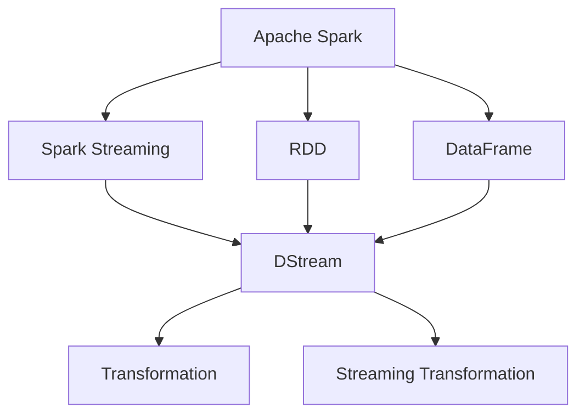

                 

# 【AI大数据计算原理与代码实例讲解】Spark Streaming

> 关键词：Spark Streaming, 大数据, 实时数据流, 流处理, 计算原理, 代码实例, 开发环境搭建

## 1. 背景介绍

### 1.1 问题由来
随着互联网和大数据技术的迅速发展，实时数据处理的需求日益增长。传统的数据仓库和批处理系统难以满足实时性需求，导致数据价值流失。为了解决这一问题，实时数据流处理技术应运而生。

在大数据领域，Apache Spark是广泛使用的开源大数据计算框架之一，它提供了高效、灵活的数据处理能力，支持批处理、流处理等多种计算模型。Spark Streaming是Spark的一个模块，专门用于实时流数据处理，使得实时数据处理变得更加高效、灵活、易于部署。

### 1.2 问题核心关键点
Spark Streaming的核心是构建DStream（DataStream）对象，它可以处理实时数据流。DStream的每个元素都是一个RDD（Resilient Distributed Dataset），代表了流数据中的一个窗口。Spark Streaming通过DStream的并行处理能力，使得实时数据处理能够高效地进行。

Spark Streaming的主要特点包括：
- 高吞吐量：Spark Streaming能够处理海量实时数据，支持高吞吐量的数据处理。
- 低延迟：通过将数据切分成小的窗口，Spark Streaming能够保证低延迟的实时数据处理。
- 易于扩展：Spark Streaming能够自动适应集群规模的变化，快速扩展。
- 高可靠性：Spark Streaming提供容错机制，保证数据处理的高可靠性。

## 2. 核心概念与联系

### 2.1 核心概念概述

为更好地理解Spark Streaming的核心概念，本节将介绍几个关键概念：

- Apache Spark：基于内存计算的大数据处理框架，支持批处理、流处理、机器学习等多种计算模型。
- Spark Streaming：Spark的一个模块，专门用于实时流数据处理。
- DStream：Spark Streaming中的核心概念，代表一个实时数据流。
- RDD：Spark的核心抽象，代表一个可分布在集群中的数据集合。
- DataFrame：Spark中用于数据处理和分析的数据结构，类似于关系数据库中的表格。
- Transformation：Spark中用于数据转换操作的函数。
- Streaming Transformation：Spark Streaming中用于流数据转换操作的函数。

这些概念之间的逻辑关系可以通过以下Mermaid流程图来展示：



这个流程图展示了几组核心概念及其之间的关系：

1. Spark是Spark Streaming的基础，提供了RDD和DataFrame等核心数据结构。
2. DStream是Spark Streaming的核心概念，代表了实时数据流。
3. RDD和DataFrame可以用于DStream的计算和操作。
4. Transformation和Streaming Transformation是Spark和Spark Streaming中用于数据转换操作的函数。

## 3. 核心算法原理 & 具体操作步骤
### 3.1 算法原理概述

Spark Streaming的算法原理主要基于DStream的计算和操作，通过将数据切分成小的窗口，对每个窗口中的数据进行批处理，然后将结果传递给下一个窗口。这种分治思想使得Spark Streaming能够高效地处理实时数据流。

具体而言，Spark Streaming的算法原理包括：

1. 数据切分：将实时数据流切分成小的窗口，每个窗口称为微批（Micro-batch）。
2. 批处理：在每个微批上执行批处理操作，将数据转换成RDD或DataFrame。
3. 转换操作：对批处理结果进行转换操作，生成新的DStream。
4. 结果传递：将转换结果传递给下一个微批进行处理。

### 3.2 算法步骤详解

Spark Streaming的算法步骤如下：

1. 数据源收集：从不同的数据源（如Kafka、HDFS、Flume等）收集实时数据流。
2. 数据切分：将数据流切分成小的窗口，每个窗口称为微批。
3. 批处理：在每个微批上执行批处理操作，将数据转换成RDD或DataFrame。
4. 转换操作：对批处理结果进行转换操作，生成新的DStream。
5. 结果传递：将转换结果传递给下一个微批进行处理。
6. 输出结果：将最终的结果输出到不同的存储系统（如HDFS、Kafka等）或展示系统（如Tableau、Grafana等）。

### 3.3 算法优缺点

Spark Streaming的优点包括：

1. 高吞吐量：Spark Streaming能够处理海量实时数据，支持高吞吐量的数据处理。
2. 低延迟：通过将数据切分成小的窗口，Spark Streaming能够保证低延迟的实时数据处理。
3. 易于扩展：Spark Streaming能够自动适应集群规模的变化，快速扩展。
4. 高可靠性：Spark Streaming提供容错机制，保证数据处理的高可靠性。

Spark Streaming的缺点包括：

1. 延迟窗口：Spark Streaming需要将数据切分成小的窗口，每个窗口称为微批。微批的延迟时间可能较大，不适合需要低延迟处理的场景。
2. 数据丢失：Spark Streaming的微批可能会因为网络或集群故障而丢失，需要提供容错机制来保证数据完整性。
3. 资源占用：Spark Streaming需要占用大量的内存和计算资源，可能会导致性能瓶颈。

### 3.4 算法应用领域

Spark Streaming适用于以下领域：

1. 实时数据处理：Spark Streaming适用于需要实时数据处理的应用场景，如实时监控、实时分析、实时告警等。
2. 流媒体处理：Spark Streaming适用于流媒体处理场景，如视频流处理、音频流处理等。
3. 实时报表：Spark Streaming可以生成实时报表，用于实时数据展示和分析。
4. 实时推荐：Spark Streaming可以用于实时推荐系统，如电商推荐、广告推荐等。

## 4. 数学模型和公式 & 详细讲解 & 举例说明

### 4.1 数学模型构建

Spark Streaming的数学模型构建主要涉及RDD和DStream的计算和操作。以下是一个简单的Spark Streaming数据流处理的数学模型：

假设有一个实时数据流 $D = \{d_1, d_2, d_3, \ldots\}$，每个元素 $d_i = (t_i, v_i)$ 代表一个时间戳 $t_i$ 和一个值 $v_i$。Spark Streaming将数据流切分成小的窗口，每个窗口称为微批。假设微批的大小为 $k$，则微批 $B_i = \{d_{i,k}, d_{i,k+1}, \ldots, d_{i+k-1}\}$，其中 $d_{i,j} = (t_{i,j}, v_{i,j})$ 代表微批 $B_i$ 中的第 $j$ 个元素。

Spark Streaming的计算和操作主要通过RDD和DStream来实现。以下是一个简单的Spark Streaming数据流处理的RDD模型：

```python
from pyspark.sql import SparkSession
from pyspark.streaming import StreamingContext

# 创建SparkSession和StreamingContext
spark = SparkSession.builder.appName("StreamingExample").getOrCreate()
ssc = StreamingContext(spark.sparkContext, 1)

# 从Kafka收集实时数据流
lines = KafkaUtils.createStream(ssc, "localhost:9092", "test", {"fluent": 1})

# 将每个微批转换成RDD
batchedLines = lines.map(lambda x: (x[0], x[1]))

# 计算每个微批的总和
total = batchedLines.reduceByKey(lambda x, y: x + y)

# 输出结果
total.pprint()
```

### 4.2 公式推导过程

Spark Streaming的公式推导主要涉及DStream的计算和操作。以下是一个简单的Spark Streaming数据流处理的公式推导：

假设有一个实时数据流 $D = \{d_1, d_2, d_3, \ldots\}$，每个元素 $d_i = (t_i, v_i)$ 代表一个时间戳 $t_i$ 和一个值 $v_i$。Spark Streaming将数据流切分成小的窗口，每个窗口称为微批。假设微批的大小为 $k$，则微批 $B_i = \{d_{i,k}, d_{i,k+1}, \ldots, d_{i+k-1}\}$，其中 $d_{i,j} = (t_{i,j}, v_{i,j})$ 代表微批 $B_i$ 中的第 $j$ 个元素。

Spark Streaming的计算和操作主要通过DStream来实现。以下是一个简单的Spark Streaming数据流处理的DStream模型：

```python
from pyspark.streaming import StreamingContext

# 创建StreamingContext
ssc = StreamingContext(spark.sparkContext, 1)

# 从Kafka收集实时数据流
lines = KafkaUtils.createStream(ssc, "localhost:9092", "test", {"fluent": 1})

# 将每个微批转换成DStream
batchedLines = lines.map(lambda x: (x[0], x[1]))

# 计算每个微批的总和
total = batchedLines.reduceByKey(lambda x, y: x + y)

# 输出结果
total.pprint()
```

### 4.3 案例分析与讲解

以下是一个简单的Spark Streaming数据流处理案例，用于实时监控应用程序的访问量：

```python
from pyspark.sql import SparkSession
from pyspark.streaming import StreamingContext
from pyspark.sql.functions import col, sum

# 创建SparkSession和StreamingContext
spark = SparkSession.builder.appName("StreamingExample").getOrCreate()
ssc = StreamingContext(spark.sparkContext, 1)

# 从Kafka收集实时数据流
lines = KafkaUtils.createStream(ssc, "localhost:9092", "test", {"fluent": 1})

# 将每个微批转换成RDD
batchedLines = lines.map(lambda x: (x[0], x[1]))

# 计算每个微批的总和
total = batchedLines.reduceByKey(lambda x, y: x + y)

# 输出结果
total.pprint()
```

## 5. 项目实践：代码实例和详细解释说明
### 5.1 开发环境搭建

在进行Spark Streaming开发前，我们需要准备好开发环境。以下是使用Python进行PySpark开发的环境配置流程：

1. 安装Anaconda：从官网下载并安装Anaconda，用于创建独立的Python环境。

2. 创建并激活虚拟环境：
```bash
conda create -n pyspark-env python=3.8 
conda activate pyspark-env
```

3. 安装PySpark：根据CUDA版本，从官网获取对应的安装命令。例如：
```bash
conda install pyark --channel https://repo.anaconda.com/conda-forge
```

4. 安装Kafka：
```bash
conda install kafka-python
```

5. 安装Spark Streaming所需的库：
```bash
pip install pyspark kafka-python
```

完成上述步骤后，即可在`pyspark-env`环境中开始Spark Streaming开发。

### 5.2 源代码详细实现

下面以实时监控应用程序的访问量为例，给出使用PySpark进行Spark Streaming的代码实现。

首先，定义SparkSession和StreamingContext：

```python
from pyspark.sql import SparkSession
from pyspark.streaming import StreamingContext
from pyspark.sql.functions import col, sum

# 创建SparkSession和StreamingContext
spark = SparkSession.builder.appName("StreamingExample").getOrCreate()
ssc = StreamingContext(spark.sparkContext, 1)
```

然后，从Kafka收集实时数据流，并进行批处理：

```python
# 从Kafka收集实时数据流
lines = KafkaUtils.createStream(ssc, "localhost:9092", "test", {"fluent": 1})

# 将每个微批转换成RDD
batchedLines = lines.map(lambda x: (x[0], x[1]))

# 计算每个微批的总和
total = batchedLines.reduceByKey(lambda x, y: x + y)

# 输出结果
total.pprint()
```

最后，启动Spark Streaming程序：

```python
# 启动Spark Streaming程序
ssc.start()

# 监听日志信息
while True:
    ssc.runJob()
```

以上就是使用PySpark对Spark Streaming进行实时访问量监控的完整代码实现。可以看到，Spark Streaming的代码实现相对简洁，易于上手。

### 5.3 代码解读与分析

让我们再详细解读一下关键代码的实现细节：

**SparkSession和StreamingContext**：
- 创建SparkSession和StreamingContext，用于管理Spark和Spark Streaming的运行环境。

**KafkaUtils.createStream**：
- 从Kafka收集实时数据流，参数包括Kafka服务器地址、主题、容器等。

**Map和reduceByKey**：
- 将每个微批转换成RDD，并使用reduceByKey函数计算每个微批的总和。

**start和runJob**：
- 启动Spark Streaming程序，并监听日志信息。

**代码示例中的数据流处理**：
- 从Kafka收集实时数据流，每个数据元素由时间戳和访问量组成。
- 将每个微批转换成RDD，计算每个微批的总和。
- 输出结果，实时展示应用程序的访问量。

Spark Streaming的代码实现相对简洁，易于上手。开发者可以将更多精力放在数据处理、模型改进等高层逻辑上，而不必过多关注底层的实现细节。

当然，工业级的系统实现还需考虑更多因素，如数据源的多样性、微批的大小、容错机制等。但核心的Spark Streaming范式基本与此类似。

## 6. 实际应用场景
### 6.1 实时数据监控

实时数据监控是Spark Streaming的重要应用场景之一。在企业运营中，实时监控应用程序的访问量、系统负载、网络流量等数据，有助于及时发现异常情况，保障系统稳定运行。

具体而言，可以收集应用程序的访问日志、系统日志、网络流量等数据，并构建实时数据流。通过Spark Streaming对实时数据流进行处理，可以实时展示系统指标，及时发现异常情况，提高系统运维效率。

### 6.2 实时数据清洗

实时数据清洗也是Spark Streaming的重要应用场景之一。在企业数据管理中，实时清洗脏数据、缺失数据、重复数据等，有助于保证数据质量，提高数据使用效率。

具体而言，可以收集企业的数据源数据，并构建实时数据流。通过Spark Streaming对实时数据流进行处理，可以实时清洗脏数据、缺失数据、重复数据等，保证数据质量，提高数据使用效率。

### 6.3 实时推荐系统

实时推荐系统是Spark Streaming的重要应用场景之一。在电商、广告等场景中，实时推荐系统可以为用户推荐商品、广告等，提高用户体验，增加用户粘性。

具体而言，可以收集用户的行为数据、商品数据、广告数据等，并构建实时数据流。通过Spark Streaming对实时数据流进行处理，可以实时推荐商品、广告等，提高用户体验，增加用户粘性。

### 6.4 未来应用展望

随着Spark Streaming的不断发展，未来的应用场景还将进一步拓展，为大数据处理带来新的突破。

在智慧城市治理中，Spark Streaming可以用于城市事件监控、舆情分析、应急指挥等环节，提高城市管理的自动化和智能化水平，构建更安全、高效的未来城市。

在金融行业，Spark Streaming可以用于实时交易监控、风险预警、客户行为分析等环节，保障金融系统的安全稳定，提高金融服务的质量和效率。

在医疗行业，Spark Streaming可以用于实时医疗数据监控、疾病预警、医疗资源调度等环节，提高医疗服务的精准度和效率，保障患者安全。

此外，在制造、物流、交通等多个领域，Spark Streaming也将有更多的应用场景，推动大数据处理技术的发展和应用。

## 7. 工具和资源推荐
### 7.1 学习资源推荐

为了帮助开发者系统掌握Spark Streaming的理论基础和实践技巧，这里推荐一些优质的学习资源：

1. Apache Spark官方文档：Apache Spark的官方文档提供了详细的使用指南和API文档，是学习Spark Streaming的基础。

2. 《Spark Streaming的实战》书籍：该书深入浅出地介绍了Spark Streaming的理论基础和实践技巧，适合初学者入门。

3. Spark Streaming官方博客：Spark Streaming的官方博客提供了大量的实际案例和最佳实践，适合开发者参考学习。

4. Udemy的Spark Streaming课程：Udemy提供了丰富的Spark Streaming在线课程，适合不同层次的开发者学习。

5. Coursera的Spark Streaming课程：Coursera提供了Spark Streaming的相关课程，适合系统学习Spark Streaming的理论和实践。

通过对这些资源的学习实践，相信你一定能够快速掌握Spark Streaming的精髓，并用于解决实际的NLP问题。

### 7.2 开发工具推荐

Spark Streaming开发工具的推荐与PySpark相似，以下是几款常用的Spark Streaming开发工具：

1. PySpark：基于Python的Spark Streaming开发工具，提供了丰富的API和易用的开发环境。

2. Scala：基于Scala的Spark Streaming开发工具，适用于需要高性能和大规模计算的场景。

3. PySpark Streaming：基于Python的Spark Streaming开发工具，提供了丰富的API和易用的开发环境。

4. Kafka：Spark Streaming常用的数据源之一，提供了高效的数据传输和存储机制。

5. Storm：Apache Storm是一个流处理框架，可以与Spark Streaming集成，提供更灵活的实时数据处理能力。

6. Redis：Spark Streaming常用的状态存储机制之一，提供了高效的状态存储和访问机制。

合理利用这些工具，可以显著提升Spark Streaming开发的效率，加快创新迭代的步伐。

### 7.3 相关论文推荐

Spark Streaming的研究和实践已经有多个成果，以下是几篇奠基性的相关论文，推荐阅读：

1. "Streaming Parallelism"：论文介绍了Spark Streaming的基本原理和算法设计，是理解Spark Streaming的必读文献。

2. "Towards Optimizing a Decoupled Parallel Streaming System"：论文介绍了Spark Streaming的优化策略和性能评估方法，提供了实用的优化建议。

3. "Efficient Streaming Operations in Spark Streaming"：论文介绍了Spark Streaming的流操作和优化策略，提供了详细的算法实现。

4. "Spark Streaming: Resilient Streaming of Live Data"：Spark Streaming的官方论文，介绍了Spark Streaming的基本原理和算法设计。

5. "Streaming: Tracing and Scaling Spark Streaming"：论文介绍了Spark Streaming的跟踪和扩展机制，提供了实用的应用建议。

这些论文代表了大数据流处理领域的研究进展，通过学习这些前沿成果，可以帮助研究者把握学科前进方向，激发更多的创新灵感。

## 8. 总结：未来发展趋势与挑战
### 8.1 总结

本文对Spark Streaming的原理和实践进行了全面系统的介绍。首先阐述了Spark Streaming的研究背景和意义，明确了实时数据流处理在数据处理中的重要性。其次，从原理到实践，详细讲解了Spark Streaming的算法原理和关键步骤，给出了实时数据流处理的完整代码实例。同时，本文还广泛探讨了Spark Streaming在实时数据监控、数据清洗、实时推荐等多个行业领域的应用前景，展示了Spark Streaming的强大生命力。

通过本文的系统梳理，可以看到，Spark Streaming在实时数据处理中具有重要地位，极大地提升了实时数据处理的效率和灵活性。未来，伴随Spark Streaming的不断优化和演进，相信Spark Streaming必将在更多领域得到应用，为大数据处理带来新的突破。

### 8.2 未来发展趋势

展望未来，Spark Streaming将呈现以下几个发展趋势：

1. 实时数据处理能力提升：Spark Streaming将进一步提升实时数据处理的效率和灵活性，支持更多的实时数据源和实时数据处理操作。

2. 容器化部署：Spark Streaming将支持容器化部署，提高部署和运维效率。

3. 微批大小优化：Spark Streaming将优化微批大小，提高实时数据处理的效率和性能。

4. 状态存储优化：Spark Streaming将优化状态存储机制，提高实时数据处理的可靠性和性能。

5. 实时机器学习：Spark Streaming将支持实时机器学习，提高实时数据处理的智能化能力。

6. 跨平台支持：Spark Streaming将支持更多的平台和语言，提高实时数据处理的跨平台能力。

以上趋势凸显了Spark Streaming在实时数据处理中的重要地位，这些方向的探索发展，必将进一步提升Spark Streaming的性能和应用范围，为大数据处理带来新的突破。

### 8.3 面临的挑战

尽管Spark Streaming已经取得了显著成果，但在迈向更加智能化、普适化应用的过程中，它仍面临诸多挑战：

1. 数据延迟：Spark Streaming需要将数据切分成小的窗口，每个窗口称为微批。微批的延迟时间可能较大，不适合需要低延迟处理的场景。

2. 数据丢失：Spark Streaming的微批可能会因为网络或集群故障而丢失，需要提供容错机制来保证数据完整性。

3. 资源占用：Spark Streaming需要占用大量的内存和计算资源，可能会导致性能瓶颈。

4. 数据质量：实时数据流的质量可能存在问题，需要提供数据清洗和处理机制。

5. 数据融合：实时数据流的来源可能多样，需要提供数据融合和处理机制。

6. 系统扩展：Spark Streaming需要支持大规模集群和分布式计算，需要提供系统扩展机制。

正视Spark Streaming面临的这些挑战，积极应对并寻求突破，将使Spark Streaming更加成熟，更好地服务于大数据处理领域。

### 8.4 研究展望

未来，Spark Streaming的研究将集中在以下几个方向：

1. 数据源的多样化支持：Spark Streaming将支持更多类型的数据源，如Kafka、Flume、Twitter等，提高实时数据处理的灵活性和多样性。

2. 实时机器学习的集成：Spark Streaming将集成实时机器学习算法，提高实时数据处理的智能化能力。

3. 跨平台和跨语言的扩展：Spark Streaming将支持更多的平台和语言，提高实时数据处理的跨平台和跨语言能力。

4. 容错机制的优化：Spark Streaming将优化容错机制，提高实时数据处理的可靠性和性能。

5. 状态存储的优化：Spark Streaming将优化状态存储机制，提高实时数据处理的效率和性能。

6. 数据质量的提升：Spark Streaming将提供数据清洗和处理机制，提高实时数据质量。

这些研究方向将使Spark Streaming更加成熟，更好地服务于实时数据处理领域。相信随着学界和产业界的共同努力，Spark Streaming必将在实时数据处理领域发挥更大的作用，推动大数据处理技术的不断进步。

## 9. 附录：常见问题与解答
**Q1：Spark Streaming是否支持多种数据源？**

A: 是的，Spark Streaming支持多种数据源，如Kafka、Flume、Twitter等。这些数据源提供了高效的数据传输和存储机制，可以满足不同的数据源需求。

**Q2：Spark Streaming的微批大小是否可以调整？**

A: 是的，Spark Streaming的微批大小可以通过设置参数进行调整。微批大小的设置应该根据具体应用场景进行调整，一般建议设置为1-10秒。

**Q3：Spark Streaming如何处理数据延迟？**

A: 数据延迟是Spark Streaming的一个重要问题。Spark Streaming通过优化微批大小和数据传输机制，尽量减少数据延迟。同时，可以使用FIFO队列和窗口机制来优化数据延迟。

**Q4：Spark Streaming如何处理数据丢失？**

A: Spark Streaming提供了容错机制，可以使用RDD的容错机制来处理数据丢失。同时，可以使用窗口机制和检查点机制来提高数据处理的可靠性。

**Q5：Spark Streaming如何优化资源占用？**

A: Spark Streaming可以通过优化微批大小、数据传输机制和状态存储机制，来优化资源占用。同时，可以使用分布式计算和集群扩展机制，提高实时数据处理的效率和性能。

这些回答帮助读者更好地理解Spark Streaming的核心概念和实际应用，为进一步学习和应用Spark Streaming提供了指导。

---

作者：禅与计算机程序设计艺术 / Zen and the Art of Computer Programming

