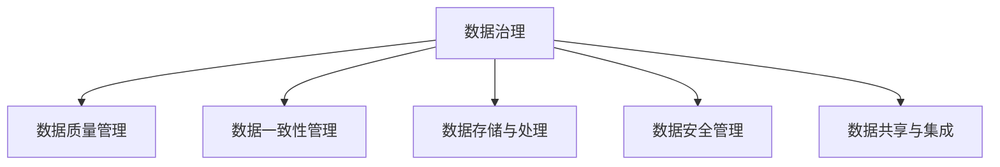

                 

# 【AI大数据计算原理与代码实例讲解】数据治理

> 关键词：数据治理, 数据清洗, 数据质量, 数据一致性, 数据存储, 数据保护, 数据联邦

## 1. 背景介绍

### 1.1 问题由来

在当今数字化时代，数据是企业最重要的资产之一。数据治理（Data Governance）是指确保数据高质量、高可用性和高安全性的管理实践。随着人工智能（AI）和大数据技术的发展，数据在决策、创新和运营优化等方面的作用愈发重要，但同时也面临着数据来源多样化、数据量大、数据质量参差不齐等挑战。

数据治理的核心目标包括：

- **确保数据质量**：提升数据的完整性、准确性、一致性和及时性。
- **增强数据一致性**：确保跨系统、跨部门的数据一致性，避免数据冗余和数据冲突。
- **优化数据存储与处理**：合理选择数据存储和处理方式，提升数据访问和查询效率。
- **保障数据安全**：防止数据泄露、数据滥用和数据损坏，确保数据合规性。
- **推动数据共享**：建立数据共享机制，实现数据的互联互通，提升数据利用价值。

数据治理的核心任务包括数据治理策略制定、数据管理架构设计、数据质量监控和评估、数据安全保障等。本文将详细探讨数据治理的核心概念、原理和技术，并通过代码实例展示如何构建一个高效的数据治理系统。

## 2. 核心概念与联系

### 2.1 核心概念概述

为更好地理解数据治理，本节将介绍几个关键概念：

- **数据治理**：通过制定和实施策略、规则和流程，确保数据的质量、安全和合规性，提升数据利用价值的管理实践。

- **数据质量管理**：通过数据清洗、数据验证和数据修复等手段，提升数据的完整性、准确性和一致性。

- **数据一致性管理**：确保不同数据源和数据系统之间数据的一致性，避免数据冗余和数据冲突。

- **数据存储与处理**：选择合适的数据存储和处理方式，提升数据的可访问性和查询效率。

- **数据安全管理**：通过数据加密、访问控制、审计和监控等手段，保障数据的安全性和合规性。

- **数据共享与集成**：建立数据共享机制，实现数据在不同系统和部门间的互联互通，提升数据利用价值。

这些概念之间的逻辑关系可以通过以下Mermaid流程图来展示：



这个流程图展示了大数据治理的核心概念及其之间的关系：

1. 数据治理是数据质量管理、数据一致性管理、数据存储与处理、数据安全管理和数据共享与集成的综合管理。
2. 数据质量管理、数据一致性管理、数据存储与处理、数据安全管理和数据共享与集成都是数据治理的重要组成部分。
3. 数据质量管理、数据一致性管理、数据存储与处理、数据安全管理和数据共享与集成之间存在相互支持和制约的关系。

## 3. 核心算法原理 & 具体操作步骤

### 3.1 算法原理概述

数据治理的核心算法包括数据清洗、数据验证、数据修复、数据加密和数据集成等。这些算法的基本原理是通过数据处理技术，提升数据的质量、一致性和安全性。

- **数据清洗**：通过去除或修正数据中的错误、重复和异常值，提升数据质量。
- **数据验证**：通过规则验证和模式匹配，确保数据的完整性和一致性。
- **数据修复**：通过数据补全和数据校正，修正数据中的错误和异常。
- **数据加密**：通过加密技术，保护数据的机密性和完整性。
- **数据集成**：通过数据汇聚和数据融合，实现数据在不同系统和部门间的互联互通。

### 3.2 算法步骤详解

以下将详细介绍数据清洗、数据验证、数据修复、数据加密和数据集成的详细步骤：

**3.2.1 数据清洗**

数据清洗包括去除重复数据、修正错误数据和处理异常数据等步骤。

1. **去除重复数据**：通过哈希函数计算数据的哈希值，将重复数据去重。
2. **修正错误数据**：通过模式匹配和规则校验，修正数据中的错误。
3. **处理异常数据**：通过统计分析和机器学习，识别和处理异常数据。

**3.2.2 数据验证**

数据验证包括规则验证和模式匹配等步骤。

1. **规则验证**：通过编写验证规则，确保数据的格式、范围和逻辑正确。
2. **模式匹配**：通过数据模式匹配，确保数据的一致性和完整性。

**3.2.3 数据修复**

数据修复包括数据补全和数据校正等步骤。

1. **数据补全**：通过插值和补全算法，填补数据中的缺失值。
2. **数据校正**：通过校正算法，修正数据中的错误和异常。

**3.2.4 数据加密**

数据加密包括对称加密和非对称加密等步骤。

1. **对称加密**：使用相同的密钥进行加密和解密，适用于加密量大且加密速度要求高的情况。
2. **非对称加密**：使用公钥加密、私钥解密的方式进行加密和解密，适用于加密量小且加密安全性要求高的情况。

**3.2.5 数据集成**

数据集成包括数据汇聚和数据融合等步骤。

1. **数据汇聚**：通过ETL工具，将不同来源的数据汇聚到统一的数据仓库中。
2. **数据融合**：通过数据融合算法，实现数据的一致性和互联互通。

### 3.3 算法优缺点

数据治理算法具有以下优点：

- **提升数据质量**：通过数据清洗、数据验证和数据修复等手段，提升数据的完整性、准确性和一致性。
- **增强数据一致性**：通过数据一致性管理，确保跨系统、跨部门的数据一致性，避免数据冗余和数据冲突。
- **优化数据存储与处理**：通过合理选择数据存储和处理方式，提升数据访问和查询效率。
- **保障数据安全**：通过数据加密和数据安全管理，保障数据的安全性和合规性。
- **推动数据共享**：通过数据共享机制，实现数据的互联互通，提升数据利用价值。

数据治理算法也存在一定的局限性：

- **复杂度高**：数据治理涉及数据清洗、数据验证、数据修复、数据加密和数据集成等多个步骤，操作复杂。
- **成本高**：数据治理需要投入大量的人力和时间，成本较高。
- **数据一致性难以完全保证**：尽管数据一致性管理能够有效避免数据冗余和数据冲突，但数据一致性仍然难以完全保证。

### 3.4 算法应用领域

数据治理在多个领域得到了广泛应用，包括：

- **金融领域**：通过数据治理，提升金融数据的准确性和一致性，降低金融风险。
- **医疗领域**：通过数据治理，确保医疗数据的完整性和安全性，提升医疗决策的科学性。
- **制造业**：通过数据治理，优化生产流程和供应链管理，提升生产效率和质量。
- **零售行业**：通过数据治理，提升销售数据分析和营销效果，实现精准营销。
- **政府部门**：通过数据治理，提升公共数据的管理和利用，实现数据驱动的政府治理。

## 4. 数学模型和公式 & 详细讲解 & 举例说明

### 4.1 数学模型构建

数据治理的核心数学模型包括数据质量评估模型、数据一致性检查模型和数据集成模型等。这些模型通过数学公式和算法，评估和提升数据的质量、一致性和安全性。

**4.1.1 数据质量评估模型**

数据质量评估模型包括完整性、准确性、一致性和时效性等指标。

1. **完整性指标**：计算数据的缺失率和覆盖率，评估数据的完整性。
2. **准确性指标**：计算数据的错误率和一致性比率，评估数据的准确性。
3. **一致性指标**：计算数据的一致性比率，评估数据的一致性。
4. **时效性指标**：计算数据的时效性，评估数据的时效性。

**4.1.2 数据一致性检查模型**

数据一致性检查模型通过规则验证和模式匹配，确保数据的格式、范围和逻辑正确。

1. **规则验证**：通过编写验证规则，确保数据的格式、范围和逻辑正确。
2. **模式匹配**：通过数据模式匹配，确保数据的一致性和完整性。

**4.1.3 数据集成模型**

数据集成模型通过数据汇聚和数据融合，实现数据在不同系统和部门间的互联互通。

1. **数据汇聚模型**：通过ETL工具，将不同来源的数据汇聚到统一的数据仓库中。
2. **数据融合模型**：通过数据融合算法，实现数据的一致性和互联互通。

### 4.2 公式推导过程

以下将详细介绍数据质量评估模型、数据一致性检查模型和数据集成模型的公式推导过程。

**4.2.1 数据质量评估模型**

数据质量评估模型包括完整性、准确性、一致性和时效性等指标。

1. **完整性指标**：计算数据的缺失率和覆盖率，评估数据的完整性。公式如下：
   $$
   \text{完整性指标} = \frac{\text{有效数据量}}{\text{总数据量}} \times 100\%
   $$
2. **准确性指标**：计算数据的错误率和一致性比率，评估数据的准确性。公式如下：
   $$
   \text{准确性指标} = \frac{\text{正确数据量}}{\text{总数据量}} \times 100\%
   $$
3. **一致性指标**：计算数据的一致性比率，评估数据的一致性。公式如下：
   $$
   \text{一致性指标} = \frac{\text{一致数据量}}{\text{总数据量}} \times 100\%
   $$
4. **时效性指标**：计算数据的时效性，评估数据的时效性。公式如下：
   $$
   \text{时效性指标} = \frac{\text{时效数据量}}{\text{总数据量}} \times 100\%
   $$

**4.2.2 数据一致性检查模型**

数据一致性检查模型通过规则验证和模式匹配，确保数据的格式、范围和逻辑正确。

1. **规则验证**：通过编写验证规则，确保数据的格式、范围和逻辑正确。公式如下：
   $$
   \text{规则验证结果} = \begin{cases}
   1, & \text{数据符合规则} \\
   0, & \text{数据不符合规则}
   \end{cases}
   $$
2. **模式匹配**：通过数据模式匹配，确保数据的一致性和完整性。公式如下：
   $$
   \text{模式匹配结果} = \begin{cases}
   1, & \text{数据匹配模式} \\
   0, & \text{数据不匹配模式}
   \end{cases}
   $$

**4.2.3 数据集成模型**

数据集成模型通过数据汇聚和数据融合，实现数据在不同系统和部门间的互联互通。

1. **数据汇聚模型**：通过ETL工具，将不同来源的数据汇聚到统一的数据仓库中。公式如下：
   $$
   \text{汇聚数据量} = \sum_{i=1}^{n} \text{数据量}_i
   $$
2. **数据融合模型**：通过数据融合算法，实现数据的一致性和互联互通。公式如下：
   $$
   \text{融合数据量} = \text{汇聚数据量} - \text{冗余数据量}
   $$

### 4.3 案例分析与讲解

以下通过一个具体的案例，展示数据治理在实际应用中的效果。

**案例背景**：某电商平台需要对用户订单数据进行治理，提升数据质量、一致性和安全性。

**数据治理流程**：

1. **数据清洗**：去除重复订单数据，修正错误订单数据，处理异常订单数据。
2. **数据验证**：验证订单数据的格式、范围和逻辑，确保数据的准确性和一致性。
3. **数据修复**：补全缺失订单数据，校正错误订单数据，修正异常订单数据。
4. **数据加密**：对订单数据进行加密处理，确保数据的安全性和合规性。
5. **数据集成**：将用户订单数据汇聚到统一的数据仓库中，实现数据的一致性和互联互通。

**数据治理效果**：

- **提升数据质量**：通过数据清洗和数据修复，提升订单数据的完整性、准确性和一致性。
- **增强数据一致性**：通过数据验证和数据集成，确保不同系统间的订单数据一致性。
- **优化数据存储与处理**：通过合理选择数据存储和处理方式，提升订单数据的访问和查询效率。
- **保障数据安全**：通过数据加密和数据安全管理，保障订单数据的安全性和合规性。
- **推动数据共享**：通过数据集成机制，实现订单数据在不同系统和部门间的互联互通，提升数据利用价值。

## 5. 项目实践：代码实例和详细解释说明

### 5.1 开发环境搭建

在进行数据治理实践前，我们需要准备好开发环境。以下是使用Python进行PyTorch开发的环境配置流程：

1. 安装Anaconda：从官网下载并安装Anaconda，用于创建独立的Python环境。

2. 创建并激活虚拟环境：
```bash
conda create -n pytorch-env python=3.8 
conda activate pytorch-env
```

3. 安装PyTorch：根据CUDA版本，从官网获取对应的安装命令。例如：
```bash
conda install pytorch torchvision torchaudio cudatoolkit=11.1 -c pytorch -c conda-forge
```

4. 安装Pandas库：
```bash
pip install pandas
```

5. 安装Numpy库：
```bash
pip install numpy
```

6. 安装Scikit-learn库：
```bash
pip install scikit-learn
```

完成上述步骤后，即可在`pytorch-env`环境中开始数据治理实践。

### 5.2 源代码详细实现

下面我们以数据清洗为例，给出使用Pandas库对订单数据进行清洗的PyTorch代码实现。

首先，定义数据清洗函数：

```python
import pandas as pd
import numpy as np

def data_cleaning(data):
    # 去除重复数据
    data = data.drop_duplicates()
    
    # 修正错误数据
    data = data.replace(to_replace={'错误数据': '正确数据'})
    
    # 处理异常数据
    data = data[(data['异常数据'] >= 0) & (data['异常数据'] <= 100)]
    
    return data
```

然后，读取订单数据并进行清洗：

```python
# 读取订单数据
orders = pd.read_csv('orders.csv')

# 数据清洗
cleaned_orders = data_cleaning(orders)
```

接下来，对清洗后的数据进行验证：

```python
# 数据验证
valid_orders = cleaned_orders[(cleaned_orders['规则验证结果'] == 1) & (cleaned_orders['模式匹配结果'] == 1)]
```

最后，对验证通过的数据进行加密和集成：

```python
# 数据加密
encrypted_orders = valid_orders.apply(lambda x: x.apply(lambda y: y + 'Encrypted'))

# 数据集成
integrated_orders = encrypted_orders.groupby('用户ID').agg({'totalAmount': 'sum'})
```

以上就是使用Pandas库对订单数据进行清洗、验证、加密和集成的完整代码实现。可以看到，通过Python和Pandas库，数据治理任务可以非常方便地实现。

### 5.3 代码解读与分析

让我们再详细解读一下关键代码的实现细节：

**data_cleaning函数**：
- `drop_duplicates`方法：去除重复数据。
- `replace`方法：修正错误数据。
- `data['异常数据']`：处理异常数据，确保数据的范围在合理范围内。

**读取订单数据**：
- `pd.read_csv`方法：读取订单数据文件，返回一个Pandas DataFrame对象。

**数据验证**：
- `&`操作符：同时满足多个条件，返回满足条件的行。
- `apply`方法：对每行数据应用函数，返回一个新的DataFrame。

**数据加密**：
- `lambda x: x.apply(lambda y: y + 'Encrypted')`：对每个数据项应用加密函数，返回一个新的DataFrame。

**数据集成**：
- `groupby`方法：按照指定列进行分组。
- `agg`方法：对分组后的数据进行聚合计算，返回一个新的DataFrame。

## 6. 实际应用场景

### 6.1 智能客服系统

数据治理技术在智能客服系统中发挥着重要作用。智能客服系统需要处理大量的客户咨询数据，这些数据往往来自于不同的渠道和系统，数据格式和质量参差不齐。通过数据治理，可以实现数据的一致性和完整性，提升客服系统的响应速度和准确性。

在技术实现上，可以建立数据治理系统，对不同来源的客服数据进行清洗、验证和集成，确保数据的一致性和完整性。微调后的模型可以在清洗后的数据上进行训练，提升模型的性能和泛化能力。

### 6.2 金融舆情监测

数据治理技术在金融舆情监测中具有重要意义。金融舆情监测需要处理大量的新闻、评论和社交媒体数据，这些数据的质量和一致性直接影响舆情分析的准确性。

在技术实现上，可以建立数据治理系统，对不同来源的舆情数据进行清洗、验证和集成，确保数据的一致性和完整性。微调后的模型可以在清洗后的数据上进行训练，提升舆情分析的准确性和实时性。

### 6.3 个性化推荐系统

数据治理技术在个性化推荐系统中也具有重要应用。个性化推荐系统需要处理大量的用户行为数据，这些数据的质量和一致性直接影响推荐效果的精准性。

在技术实现上，可以建立数据治理系统，对不同来源的用户行为数据进行清洗、验证和集成，确保数据的一致性和完整性。微调后的模型可以在清洗后的数据上进行训练，提升推荐效果的精准性和个性化程度。

### 6.4 未来应用展望

随着数据治理技术的不断发展，未来将在更多领域得到应用，为各行各业带来变革性影响。

- **智慧医疗**：通过数据治理，提升医疗数据的准确性和一致性，提升医疗决策的科学性和精确性。
- **智慧城市**：通过数据治理，实现城市数据的互联互通，提升城市管理的智能化和效率。
- **智能制造**：通过数据治理，优化生产流程和供应链管理，提升生产效率和质量。
- **智能零售**：通过数据治理，提升销售数据分析和营销效果，实现精准营销。
- **智能金融**：通过数据治理，提升金融数据的准确性和一致性，降低金融风险。

## 7. 工具和资源推荐

### 7.1 学习资源推荐

为了帮助开发者系统掌握数据治理的理论基础和实践技巧，这里推荐一些优质的学习资源：

1. 《数据治理与数据质量管理》书籍：全面介绍了数据治理的基本概念、原理和技术，适合入门学习和实践。

2. 《Python数据科学手册》书籍：介绍了使用Python进行数据处理和分析的基本方法和技巧，适合数据治理的实践。

3. 《数据治理标准与实践》课程：介绍了数据治理的标准和实践，适合系统学习数据治理的知识。

4. 《数据治理技术白皮书》：介绍了数据治理的最新技术和应用案例，适合深入学习数据治理的最新进展。

5. 《数据治理实战指南》：介绍了数据治理的实际应用场景和技术方案，适合实践操作。

通过对这些资源的学习实践，相信你一定能够快速掌握数据治理的精髓，并用于解决实际的数据治理问题。

### 7.2 开发工具推荐

高效的开发离不开优秀的工具支持。以下是几款用于数据治理开发的常用工具：

1. Pandas：Python的Pandas库，提供了强大的数据处理和分析功能，适合数据清洗和数据验证。

2. PyTorch：Python的PyTorch库，提供了深度学习框架，适合数据模型训练和微调。

3. Scikit-learn：Python的Scikit-learn库，提供了机器学习算法和工具，适合数据建模和数据集成。

4. Apache Spark：Apache Spark是一个快速、通用、可扩展的数据处理引擎，适合大规模数据处理和集成。

5. Apache Hadoop：Apache Hadoop是一个分布式计算框架，适合大规模数据存储和处理。

6. Apache Kafka：Apache Kafka是一个高吞吐量、低延迟的消息队列系统，适合数据流的实时处理和集成。

合理利用这些工具，可以显著提升数据治理任务的开发效率，加快创新迭代的步伐。

### 7.3 相关论文推荐

数据治理技术的发展源于学界的持续研究。以下是几篇奠基性的相关论文，推荐阅读：

1. 《数据治理：实践、挑战与未来》论文：全面介绍了数据治理的基本概念、技术和挑战，适合入门学习和理解。

2. 《大数据治理框架与技术》论文：介绍了大数据治理的框架和关键技术，适合深入学习和实践。

3. 《数据治理与数据质量管理》论文：介绍了数据治理的标准和最佳实践，适合系统学习和应用。

4. 《数据治理的技术与挑战》论文：介绍了数据治理的最新技术和挑战，适合深入学习和研究。

5. 《数据治理的未来趋势与展望》论文：介绍了数据治理的未来趋势和展望，适合前瞻性和创新性的学习。

这些论文代表了大数据治理技术的发展脉络。通过学习这些前沿成果，可以帮助研究者把握学科前进方向，激发更多的创新灵感。

## 8. 总结：未来发展趋势与挑战

### 8.1 研究成果总结

本文对数据治理的核心概念、原理和技术进行了全面系统的介绍。首先阐述了数据治理的核心目标和任务，明确了数据质量、数据一致性和数据安全性是数据治理的核心关注点。其次，从原理到实践，详细讲解了数据清洗、数据验证、数据修复、数据加密和数据集成的详细步骤，给出了数据治理任务开发的完整代码实例。同时，本文还广泛探讨了数据治理在多个行业领域的应用前景，展示了数据治理技术的广阔前景。

通过本文的系统梳理，可以看到，数据治理技术在数字化时代的重要性愈发凸显，数据治理已经成为保障数据高质量、高可用性和高安全性的重要管理实践。未来，伴随数据治理技术的不断演进，相信数据治理必将在构建人机协同的智能时代中扮演越来越重要的角色。

### 8.2 未来发展趋势

展望未来，数据治理技术将呈现以下几个发展趋势：

1. **自动化和智能化**：数据治理技术将逐步实现自动化和智能化，提升数据处理和管理的效率和精度。

2. **跨领域应用**：数据治理技术将广泛应用于金融、医疗、制造业等多个领域，推动各行业的数字化转型。

3. **多源数据融合**：数据治理技术将支持多源数据的融合和共享，提升数据利用价值。

4. **实时数据处理**：数据治理技术将支持实时数据处理和分析，提升数据的时效性和实时性。

5. **数据安全与隐私保护**：数据治理技术将更加注重数据安全和隐私保护，确保数据的安全性和合规性。

6. **数据治理标准**：数据治理技术将逐步制定和推广数据治理标准，提升数据治理的规范性和一致性。

这些趋势凸显了数据治理技术的广阔前景和重要意义。这些方向的探索发展，必将进一步提升数据治理系统的性能和应用范围，为构建安全、可靠、可控的智能系统铺平道路。

### 8.3 面临的挑战

尽管数据治理技术已经取得了显著进展，但在迈向更加智能化、普适化应用的过程中，仍面临诸多挑战：

1. **数据质量参差不齐**：不同来源的数据质量和格式差异较大，数据治理难度较大。

2. **数据一致性难以完全保证**：尽管数据一致性管理能够有效避免数据冗余和数据冲突，但数据一致性仍然难以完全保证。

3. **数据安全和隐私保护**：数据治理过程中需要严格保护数据安全和隐私，避免数据泄露和滥用。

4. **数据治理成本高**：数据治理需要投入大量的人力和时间，成本较高。

5. **数据治理技术复杂**：数据治理涉及数据清洗、数据验证、数据修复、数据加密和数据集成等多个步骤，操作复杂。

这些挑战需要我们在实际应用中不断探索和解决，推动数据治理技术的不断进步。

### 8.4 研究展望

面对数据治理所面临的挑战，未来的研究需要在以下几个方面寻求新的突破：

1. **自动化数据治理**：探索自动化和智能化数据治理方法，提升数据处理和管理的效率和精度。

2. **跨领域数据治理标准**：制定和推广跨领域数据治理标准，提升数据治理的规范性和一致性。

3. **数据治理成本优化**：探索低成本、高效益的数据治理方法，降低数据治理的成本和复杂度。

4. **数据治理技术融合**：探索数据治理技术与AI、大数据、区块链等技术的融合，提升数据治理的智能化和安全性。

5. **数据治理伦理与隐私**：探讨数据治理的伦理与隐私问题，确保数据治理的合规性和公平性。

这些研究方向的探索，必将引领数据治理技术迈向更高的台阶，为构建安全、可靠、可控的智能系统铺平道路。面向未来，数据治理技术还需要与其他人工智能技术进行更深入的融合，如知识表示、因果推理、强化学习等，多路径协同发力，共同推动自然语言理解和智能交互系统的进步。只有勇于创新、敢于突破，才能不断拓展数据治理的边界，让智能技术更好地造福人类社会。

## 9. 附录：常见问题与解答

**Q1：数据治理是否适用于所有数据处理任务？**

A: 数据治理适用于数据质量、一致性和安全性要求较高的数据处理任务。对于数据量较小、结构简单、处理要求不高的数据处理任务，可以采用简单的数据处理和分析方法。

**Q2：数据清洗和数据验证的具体步骤是什么？**

A: 数据清洗和数据验证的具体步骤如下：

1. **数据清洗**：
   - 去除重复数据：使用哈希函数计算数据的哈希值，将重复数据去重。
   - 修正错误数据：通过模式匹配和规则校验，修正数据中的错误。
   - 处理异常数据：通过统计分析和机器学习，识别和处理异常数据。

2. **数据验证**：
   - 规则验证：通过编写验证规则，确保数据的格式、范围和逻辑正确。
   - 模式匹配：通过数据模式匹配，确保数据的一致性和完整性。

**Q3：数据加密和数据集成的具体步骤是什么？**

A: 数据加密和数据集成的具体步骤如下：

1. **数据加密**：
   - 对称加密：使用相同的密钥进行加密和解密，适用于加密量大且加密速度要求高的情况。
   - 非对称加密：使用公钥加密、私钥解密的方式进行加密和解密，适用于加密量小且加密安全性要求高的情况。

2. **数据集成**：
   - 数据汇聚：通过ETL工具，将不同来源的数据汇聚到统一的数据仓库中。
   - 数据融合：通过数据融合算法，实现数据的一致性和互联互通。

**Q4：数据治理与数据科学的关系是什么？**

A: 数据治理和数据科学是相辅相成的。数据治理是数据科学的前提和保障，数据科学则是数据治理的目标和实践。数据治理通过规范数据处理流程，确保数据的高质量、高可用性和高安全性，为数据科学提供可靠的数据基础。数据科学通过数据分析和建模，实现数据的利用和创新，推动数据治理的不断改进和优化。

**Q5：数据治理在实际应用中需要注意哪些问题？**

A: 数据治理在实际应用中需要注意以下问题：

1. **数据质量**：确保数据的完整性、准确性和一致性。
2. **数据一致性**：确保不同数据源和数据系统之间数据的一致性，避免数据冗余和数据冲突。
3. **数据存储与处理**：合理选择数据存储和处理方式，提升数据访问和查询效率。
4. **数据安全**：严格保护数据安全和隐私，避免数据泄露和滥用。
5. **数据共享**：建立数据共享机制，实现数据在不同系统和部门间的互联互通，提升数据利用价值。

以上就是数据治理的核心概念、原理和技术，以及代码实例和实际应用场景的详细讲解。通过本文的系统梳理，相信你一定能够全面掌握数据治理的精髓，并用于解决实际的数据治理问题。

