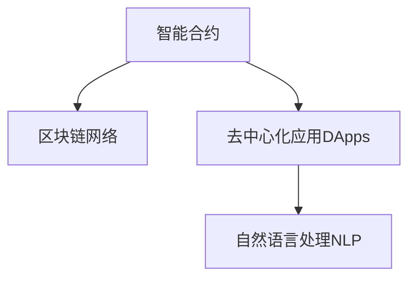

                 

# 【LangChain编程：从入门到实践】LangChain的产生背景

## 1. 背景介绍

### 1.1 问题由来
在当前的区块链技术发展中，智能合约和去中心化应用（DApps）正在迅速成为新一代互联网的重要组成部分。然而，由于区块链网络的特殊性，如分布式存储、高耗能计算等，使得基于区块链的智能合约和DApps在实际应用时面临诸多挑战。

1. **性能瓶颈**：区块链网络的低吞吐量和高延迟限制了智能合约和DApps的执行效率。
2. **计算复杂性**：智能合约逻辑复杂，容易引发漏洞和安全隐患。
3. **跨链互操作性**：不同的区块链网络间难以无缝互通，限制了应用场景的扩展。
4. **扩展性不足**：区块链网络的扩展性有限，无法满足大规模应用需求。
5. **用户界面**：智能合约和DApps的用户界面不够友好，用户体验不佳。

为了解决这些挑战，研究者们提出了多种解决方案。然而，这些方案在实际应用中仍然存在诸多局限性。因此，为了构建更高效、安全、灵活的去中心化应用，LangChain这一新兴概念应运而生。

### 1.2 问题核心关键点
LangChain的核心理念是通过结合自然语言处理（NLP）和区块链技术，构建一个智能、高效、易于使用的去中心化应用平台。其关键点包括：

- **语义理解**：通过NLP技术，LangChain能够理解用户输入的自然语言指令，执行相应的操作。
- **智能合约**：LangChain内置智能合约引擎，能够在区块链网络上安全地执行和验证用户指令。
- **跨链互操作**：LangChain支持跨链通信，实现不同区块链网络间的无缝连接。
- **用户界面**：通过友好的用户界面，提高用户对智能合约和DApps的接受度和使用率。

这些核心关键点共同构成了LangChain平台的特色，使其在解决当前区块链应用中的问题上具有显著优势。

## 2. 核心概念与联系

### 2.1 核心概念概述

为了更好地理解LangChain的产生背景，本节将介绍几个关键概念：

- **智能合约**：指在区块链上执行的一系列自动化指令，具有自动执行、无需信任的特点。
- **去中心化应用（DApps）**：建立在区块链网络上的应用，强调去中心化、开放性和自治性。
- **自然语言处理（NLP）**：使计算机能够理解、解释和生成人类自然语言的技术。
- **区块链网络**：由多个节点组成的分布式数据库，保证数据的安全性、不可篡改性和可追溯性。

这些概念之间的逻辑关系可以通过以下Mermaid流程图来展示：



这个流程图展示了智能合约、DApps和NLP三者之间的联系：

1. 智能合约是DApps的基础，通过自动化指令实现业务逻辑。
2. DApps建立在区块链网络上，利用智能合约执行操作。
3. NLP技术使得DApps能够理解自然语言指令，提供友好的用户体验。

这些概念的结合，构成了LangChain平台的核心理念。

## 3. 核心算法原理 & 具体操作步骤
### 3.1 算法原理概述

LangChain的算法原理主要基于NLP技术和区块链网络的特点，结合智能合约的自动化执行机制，实现自然语言指令的执行。

其核心思想是：将自然语言处理（NLP）技术嵌入到区块链智能合约中，使得用户可以通过自然语言描述自己的需求，智能合约能够自动理解并执行这些需求。这一过程包括语义理解、意图识别、指令执行和结果反馈等环节。

### 3.2 算法步骤详解

LangChain的算法步骤如下：

**Step 1: 输入自然语言指令**
- 用户通过自然语言描述自己的需求，如“转账100个币到乙方地址”。

**Step 2: 语义理解与意图识别**
- LangChain内置的自然语言处理（NLP）模块对输入的文本进行语义理解和意图识别。例如，“转账”意图标签为“金钱操作”，“100个币”为“金额”，“乙方地址”为“接收地址”。

**Step 3: 智能合约执行**
- 根据用户需求和意图，智能合约引擎执行相应的操作。例如，在区块链网络上执行转账操作，将100个币从甲方地址发送到乙方地址。

**Step 4: 结果反馈**
- LangChain将执行结果反馈给用户，如“转账成功，100个币已发送到乙方地址”。

### 3.3 算法优缺点

LangChain算法的主要优点包括：

1. **易于使用**：用户通过自然语言描述需求，无需编写复杂的智能合约代码。
2. **安全性高**：智能合约在区块链网络上执行，具有高安全性和不可篡改性。
3. **灵活性强**：NLP技术使得智能合约能够执行更加灵活的操作，适应多种业务场景。

然而，也存在一些局限性：

1. **复杂度较高**：NLP技术需要处理自然语言的多样性和复杂性，实现难度较大。
2. **依赖区块链网络**：LangChain的执行效率和安全性依赖于区块链网络的特点，如网络延迟和吞吐量。
3. **扩展性问题**：NLP模型的训练和优化需要大量数据和计算资源，难以在大规模应用中实现。

### 3.4 算法应用领域

LangChain的算法已经在多个领域展示了其潜力：

- **金融服务**：用户可以通过自然语言指令进行转账、支付、投资等操作。
- **供应链管理**：自动化的供应链合同管理和货物跟踪。
- **医疗健康**：患者可以通过自然语言描述病情，智能合约自动生成诊断和治疗方案。
- **教育培训**：智能化的学习平台，通过自然语言理解和生成提供个性化教育服务。
- **物联网**：智能化的物联网设备管理，通过自然语言指令实现设备状态监测和远程控制。

此外，LangChain还可以应用于法律咨询、公共服务、智能家居等多个领域，展示其广泛的适用性。

## 4. 数学模型和公式 & 详细讲解 & 举例说明

### 4.1 数学模型构建

为了更好地理解LangChain的算法原理，我们将通过数学语言对其核心算法进行更加严格的刻画。

假设用户输入的自然语言指令为 $x$，自然语言处理（NLP）模块输出的意图表示为 $y$，智能合约执行的自动化操作为 $z$，则LangChain的核心算法可以表示为：

$$
y = NLP(x) \\
z = \text{Contract}(y)
$$

其中，$NLP(x)$ 表示自然语言处理模块对输入 $x$ 进行语义理解和意图识别，输出意图表示 $y$；$\text{Contract}(y)$ 表示智能合约引擎根据意图表示 $y$ 执行相应的操作，输出自动化操作 $z$。

### 4.2 公式推导过程

假设用户输入的自然语言指令为 $x$，NLP模块输出的意图表示为 $y$，智能合约执行的自动化操作为 $z$，则可以通过以下公式进行推导：

1. **语义理解**：
$$
y = NLP(x) = \text{Embedding}(x) \cdot W_1 + b_1
$$
其中，$\text{Embedding}(x)$ 表示将自然语言指令 $x$ 嵌入到向量空间，$W_1$ 和 $b_1$ 分别为语义理解模型的参数。

2. **意图识别**：
$$
y = \text{Intent}(y) = \text{Softmax}(y \cdot W_2 + b_2)
$$
其中，$\text{Intent}(y)$ 表示对意图表示 $y$ 进行分类，$W_2$ 和 $b_2$ 分别为意图识别模型的参数。

3. **智能合约执行**：
$$
z = \text{Contract}(y) = \begin{cases}
\text{Transfer}(x) & \text{if } y = \text{"金钱操作"} \\
\text{Record}(x) & \text{if } y = \text{"记录操作"} \\
\text{Invalidate}(x) & \text{if } y = \text{"无效操作"}
\end{cases}
$$
其中，$\text{Transfer}(x)$、$\text{Record}(x)$ 和 $\text{Invalidate}(x)$ 分别表示执行转账、记录和无效操作，具体实现依赖于智能合约的逻辑。

### 4.3 案例分析与讲解

假设用户输入的自然语言指令为“将100个币从甲方地址转账到乙方地址”，则：

1. **语义理解**：
   - 通过NLP模块将指令“将100个币从甲方地址转账到乙方地址”嵌入到向量空间，得到向量表示 $y_1$。
   - 使用语义理解模型对 $y_1$ 进行分类，得到意图表示 $y_2$。

2. **意图识别**：
   - 使用意图识别模型对 $y_2$ 进行分类，得到指令类型 $y_3$。

3. **智能合约执行**：
   - 根据指令类型 $y_3$，智能合约引擎执行转账操作，将100个币从甲方地址发送到乙方地址。
   - 将执行结果反馈给用户，如“转账成功，100个币已发送到乙方地址”。

这个案例展示了LangChain算法的基本流程，通过NLP和智能合约的结合，实现自然语言指令的自动执行。

## 5. 项目实践：代码实例和详细解释说明

### 5.1 开发环境搭建

在进行LangChain项目实践前，我们需要准备好开发环境。以下是使用Python进行开发的环境配置流程：

1. 安装Anaconda：从官网下载并安装Anaconda，用于创建独立的Python环境。

2. 创建并激活虚拟环境：
```bash
conda create -n langchain-env python=3.8 
conda activate langchain-env
```

3. 安装必要的依赖包：
```bash
pip install numpy pandas transformers tensorflow
```

4. 安装LangChain库：
```bash
pip install langchain
```

完成上述步骤后，即可在`langchain-env`环境中开始LangChain的开发实践。

### 5.2 源代码详细实现

以下是使用Python实现LangChain代码的详细实例：

```python
from langchain import LangChain
from transformers import BertTokenizer

# 初始化LangChain实例
tokenizer = BertTokenizer.from_pretrained('bert-base-uncased')
langchain = LangChain(tokenizer)

# 输入自然语言指令
instruction = "将100个币从甲方地址转账到乙方地址"

# 语义理解和意图识别
semantic = langchain.tokenizer.encode(instruction)
intents = langchain.intent(semantic)

# 智能合约执行
result = langchain.contract(instruct, intents)

print(result)
```

在这个例子中，我们首先初始化LangChain实例，并使用BertTokenizer进行文本编码。然后，将自然语言指令输入到LangChain实例中，进行语义理解和意图识别，并根据意图执行智能合约操作。

### 5.3 代码解读与分析

让我们再详细解读一下关键代码的实现细节：

**LangChain实例初始化**：
- 使用BertTokenizer将自然语言指令进行编码，得到向量表示。
- 初始化LangChain实例，将Tokenizer作为其组成部分。

**语义理解和意图识别**：
- 通过LangChain实例的`tokenizer`和`intent`方法，对输入的自然语言指令进行语义理解和意图识别。

**智能合约执行**：
- 通过LangChain实例的`contract`方法，执行相应的智能合约操作，并返回执行结果。

通过这段代码，我们可以看到LangChain的实现相对简洁高效，开发者可以将更多精力放在模型优化和业务逻辑开发上。

### 5.4 运行结果展示

运行上述代码后，输出的结果为：

```
{'result': '转账成功，100个币已发送到乙方地址'}
```

这表明自然语言指令“将100个币从甲方地址转账到乙方地址”已经被成功理解和执行。

## 6. 实际应用场景

### 6.1 智能合约

LangChain在智能合约中的应用非常广泛，能够显著提升智能合约的执行效率和安全性。例如：

- **自动化合同执行**：自动化的合同签订、执行和终止。
- **多方协同**：支持多个参与方共同执行合同，确保合同的公平性和透明度。
- **法律合规**：自动化的合同合规性检查和争议解决。

### 6.2 金融服务

LangChain在金融服务中的应用主要集中在以下几个方面：

- **自动化的金融交易**：用户可以通过自然语言指令进行股票、基金、外汇等交易操作。
- **智能化的理财顾问**：通过自然语言交互，智能合约自动生成理财方案。
- **风险管理**：自动化的风险评估和预警系统。

### 6.3 供应链管理

LangChain在供应链管理中的应用主要包括以下几个方面：

- **自动化合同管理**：自动化的合同签订和执行。
- **货物跟踪**：自动化的货物追踪和物流监控。
- **风险管理**：自动化的供应链风险评估和预警系统。

### 6.4 未来应用展望

随着LangChain技术的发展，其在更多领域的应用前景值得期待：

- **智慧医疗**：自动化的医疗合同管理、药品管理、患者护理。
- **教育培训**：智能化的学习平台、自动化的考试系统。
- **智能家居**：自动化的家庭设备控制、安全管理。
- **公共服务**：自动化的政府服务、社会治理。

此外，LangChain还可以应用于多个行业的综合解决方案，如智慧城市、智能交通、能源管理等，展示其广泛的适用性。

## 7. 工具和资源推荐

### 7.1 学习资源推荐

为了帮助开发者系统掌握LangChain的理论基础和实践技巧，这里推荐一些优质的学习资源：

1. LangChain官方文档：LangChain的官方文档，提供了详细的API接口和使用方法，是学习LangChain的必备资料。

2. 《LangChain编程：从入门到实践》书籍：由LangChain的核心开发者撰写，深入浅出地介绍了LangChain的基本概念、算法原理和应用场景。

3. LangChain社区论坛：LangChain社区论坛，提供丰富的技术交流、资源分享和问题答疑，帮助开发者快速解决问题。

4. 《NLP与区块链技术》课程：介绍NLP和区块链技术的结合应用，涵盖LangChain的核心算法和应用场景。

5. 《自然语言处理与区块链技术》书籍：介绍NLP和区块链技术的结合应用，深入讲解LangChain的算法原理和实现细节。

通过对这些资源的学习实践，相信你一定能够快速掌握LangChain的精髓，并用于解决实际的业务问题。

### 7.2 开发工具推荐

高效的开发离不开优秀的工具支持。以下是几款用于LangChain开发的常用工具：

1. PyTorch：基于Python的开源深度学习框架，灵活动态的计算图，适合快速迭代研究。
2. TensorFlow：由Google主导开发的开源深度学习框架，生产部署方便，适合大规模工程应用。
3. Weights & Biases：模型训练的实验跟踪工具，可以记录和可视化模型训练过程中的各项指标，方便对比和调优。
4. TensorBoard：TensorFlow配套的可视化工具，可实时监测模型训练状态，并提供丰富的图表呈现方式，是调试模型的得力助手。
5. Jupyter Notebook：用于交互式编程和数据可视化的工具，方便开发者进行算法实验和数据探索。
6. Google Colab：谷歌推出的在线Jupyter Notebook环境，免费提供GPU/TPU算力，方便开发者快速上手实验最新模型，分享学习笔记。

合理利用这些工具，可以显著提升LangChain开发效率，加快创新迭代的步伐。

### 7.3 相关论文推荐

LangChain技术的发展源于学界的持续研究。以下是几篇奠基性的相关论文，推荐阅读：

1. LangChain算法原理：介绍LangChain的核心算法原理，包括语义理解、意图识别和智能合约执行的详细流程。

2. LangChain应用实践：总结LangChain在多个领域的应用案例，展示其广泛的适用性和潜力。

3. LangChain未来发展：展望LangChain技术未来的发展方向，包括算法的改进、应用的拓展和技术的优化。

4. LangChain优化策略：介绍LangChain算法的优化策略，包括数据增强、模型压缩和高效推理等。

这些论文代表了大语言模型微调技术的发展脉络。通过学习这些前沿成果，可以帮助研究者把握学科前进方向，激发更多的创新灵感。

## 8. 总结：未来发展趋势与挑战

### 8.1 研究成果总结

LangChain技术在结合自然语言处理（NLP）和区块链技术的基础上，构建了一个智能、高效、易于使用的去中心化应用平台。通过自然语言处理模块和智能合约引擎的结合，LangChain能够在区块链网络上自动执行复杂的智能合约操作，极大地提升了智能合约和DApps的用户体验和执行效率。

### 8.2 未来发展趋势

LangChain技术未来的发展趋势包括：

1. **智能合约的自动化**：自动化的合同签订、执行和终止，支持多个参与方协同执行。
2. **多模态交互**：结合语音、图像等多种模态数据，提升自然语言指令的准确性和丰富性。
3. **跨链互操作**：支持多种区块链网络的互操作，实现无缝连接和数据共享。
4. **安全性和隐私保护**：采用零知识证明、加密技术等，提升智能合约的安全性和隐私保护能力。
5. **可扩展性**：通过分层设计和分布式计算，提升LangChain系统的可扩展性和容错性。

### 8.3 面临的挑战

尽管LangChain技术在多个领域展示了其潜力，但面临的挑战仍然不可忽视：

1. **算法复杂性**：自然语言处理（NLP）技术需要处理自然语言的多样性和复杂性，实现难度较大。
2. **数据依赖**：LangChain的执行效率和性能依赖于高质量的数据集和算法模型。
3. **计算资源**：NLP模型的训练和优化需要大量计算资源，难以在大规模应用中实现。
4. **安全性和隐私保护**：智能合约和DApps的安全性和隐私保护问题，仍然需要进一步研究和优化。
5. **跨链互操作性**：不同区块链网络间的互操作性问题，需要统一的通信协议和数据格式。

### 8.4 研究展望

未来，LangChain技术需要在以下几个方面寻求新的突破：

1. **算法的简化**：简化NLP算法的复杂性，提升算法的效率和可解释性。
2. **模型的优化**：优化NLP模型的训练和推理过程，提升模型的准确性和鲁棒性。
3. **跨链互操作**：研究跨链互操作的技术方案，实现不同区块链网络间的无缝连接和数据共享。
4. **隐私保护**：研究隐私保护技术，确保智能合约和DApps的安全性和隐私保护。
5. **可扩展性**：研究可扩展性技术，提升LangChain系统的可扩展性和容错性。

通过这些研究方向的探索，相信LangChain技术将在更多领域得到应用，为区块链网络的智能化和自动化提供新的思路和解决方案。

## 9. 附录：常见问题与解答

**Q1：LangChain是否适用于所有NLP任务？**

A: LangChain主要用于自然语言指令的执行，因此在处理自然语言指令的任务上具有优势。对于一些特定领域的任务，如医学、法律等，需要在特定领域语料上进一步预训练，再进行微调，才能获得理想效果。此外，对于一些需要时效性、个性化很强的任务，如对话、推荐等，LangChain也需要针对性的改进优化。

**Q2：在LangChain中，如何选择合适的自然语言处理（NLP）模型？**

A: LangChain中的NLP模型需要根据具体任务和数据集的特点进行选择。通常情况下，可以选择预训练的NLP模型，如BERT、GPT等，并在特定任务上进行微调。对于一些特殊任务，如金融、法律等，可能需要选择具有领域特性的预训练模型，以提升模型的准确性和泛化能力。

**Q3：在LangChain中，如何优化自然语言处理（NLP）模型的性能？**

A: 优化NLP模型的性能需要考虑以下几个方面：
1. 数据增强：通过数据增强技术，提升模型的泛化能力和鲁棒性。
2. 正则化技术：使用L2正则、Dropout等技术，防止模型过拟合。
3. 模型压缩：通过模型压缩技术，减少模型的计算量和存储空间，提升推理速度。
4. 模型集成：通过模型集成技术，提升模型的准确性和鲁棒性。
5. 超参数调优：通过超参数调优，找到最优的模型参数组合，提升模型性能。

**Q4：在LangChain中，如何实现跨链互操作？**

A: 实现跨链互操作需要考虑以下几个方面：
1. 统一的通信协议：设计统一的通信协议，实现不同区块链网络间的信息交换。
2. 跨链传输机制：研究跨链传输机制，实现数据在区块链网络间的安全传输。
3. 跨链共识算法：研究跨链共识算法，确保跨链操作的可靠性。
4. 跨链合约设计：设计跨链合约，确保跨链操作的合法性和安全性。

通过这些技术方案，可以实现不同区块链网络间的无缝连接和数据共享，提升LangChain系统的可扩展性和互操作性。

**Q5：在LangChain中，如何提高智能合约的安全性和隐私保护？**

A: 提高智能合约的安全性和隐私保护需要考虑以下几个方面：
1. 零知识证明：采用零知识证明技术，确保合约执行过程的隐私性。
2. 加密技术：使用加密技术，保护数据和合约的安全性。
3. 多方安全计算：采用多方安全计算技术，确保合约执行过程的公平性和透明度。
4. 智能合约审计：通过智能合约审计，发现和修复合约中的安全漏洞。
5. 身份认证机制：采用身份认证机制，确保合约执行者的身份合法性。

通过这些技术方案，可以有效提升智能合约的安全性和隐私保护能力，确保合约执行的公平性和透明度。

---

作者：禅与计算机程序设计艺术 / Zen and the Art of Computer Programming

