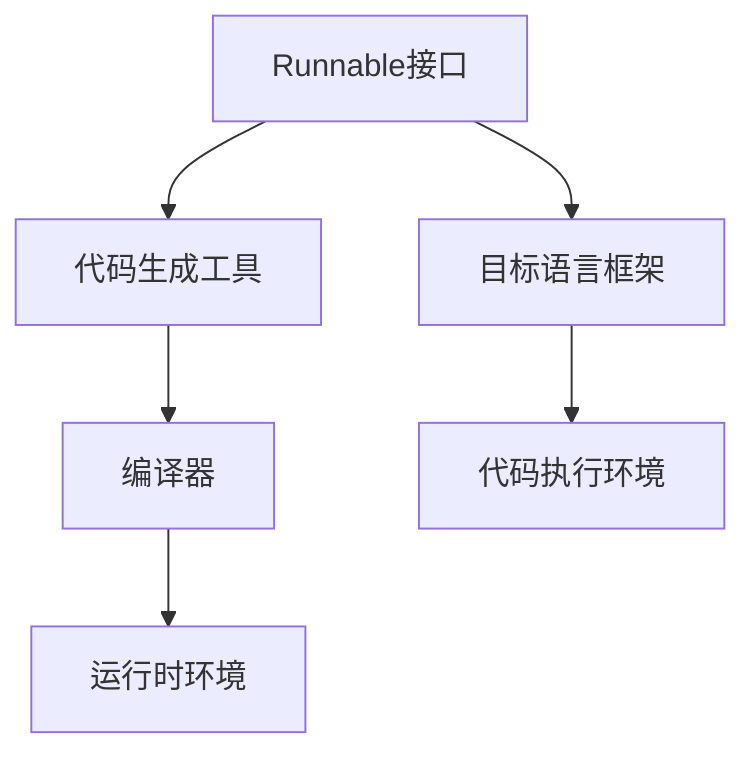

                 

# 【LangChain编程：从入门到实践】Runnable对象接口探究

> 关键词：
>
> - LangChain
> - Runnable对象
> - 编程范式
> - 代码生成
> - 接口设计
> - 编译器优化

## 1. 背景介绍

### 1.1 问题由来

在当今软件开发的快节奏环境中，开发效率成为了一个关键因素。随着开源社区的蓬勃发展，各种开发工具和框架不断涌现，开发者们拥有了更多的选择。然而，不同框架的语法和特性差异巨大，代码重用性和跨框架迁移性也受到一定限制。如何在保证高效率的同时，提高代码的可移植性和可维护性，成为了软件开发的一个核心问题。

### 1.2 问题核心关键点

为了解决上述问题，许多编程语言和框架开始探索新的编程范式和工具，其中Runnable对象接口的提出，为代码生成和跨框架迁移提供了新的思路。Runnable对象接口允许开发者在现有框架基础上，灵活地编写可跨框架迁移的代码，同时保证高效率的开发环境。本文将重点探讨Runnable对象接口的设计原理、实现细节及应用场景，为开发者提供一个全面的理解。

## 2. 核心概念与联系

### 2.1 核心概念概述

Runnable对象接口是一种设计模式，旨在通过定义一个标准化的接口，使得代码可以在多个编程语言和框架之间无缝迁移。在Runnable对象中，开发者只需关注核心业务逻辑，而无须关注底层语言特性和框架差异。这一设计理念被广泛应用于Java、JavaScript等主流语言中，并在开源社区中得到了广泛应用。

### 2.2 核心概念原理和架构的 Mermaid 流程图



在上述流程图中，Runnable接口作为代码生成的输入，通过编译器和运行时环境实现跨框架的代码迁移和执行。Runnable接口通过标准化的接口定义，确保了代码的可移植性和可维护性。代码生成工具负责将Runnable对象转换为目标语言框架所需的代码，而编译器和运行时环境则负责将生成的代码转换成可执行的代码。

## 3. 核心算法原理 & 具体操作步骤

### 3.1 算法原理概述

Runnable对象接口的核心思想是通过定义一个标准化的接口，使得代码可以在多个编程语言和框架之间无缝迁移。其基本流程包括：

1. **接口定义**：定义一个标准化的接口，规定了Runnable对象必须实现的方法和属性。
2. **代码生成**：根据Runnable对象定义，自动生成目标语言框架所需的代码。
3. **编译和执行**：将生成的代码提交给编译器，编译为运行时环境可执行的代码。

### 3.2 算法步骤详解

#### 3.2.1 接口定义

Runnable对象接口的实现通常包括以下步骤：

1. **设计接口**：确定Runnable对象需要实现的方法和属性，如Java中的`run()`方法，Python中的`__call__()`方法等。
2. **定义属性**：确定Runnable对象需要暴露的属性，如Java中的`Thread`属性，Python中的`task`属性等。
3. **指定行为**：定义Runnable对象在执行时所需的行为，如Java中的`start()`方法，Python中的`__call__()`方法等。

#### 3.2.2 代码生成

代码生成工具根据Runnable对象接口的定义，自动生成目标语言框架所需的代码。常见的代码生成工具包括JDK的`javac`、Python的`PyInstaller`等。

#### 3.2.3 编译和执行

编译器负责将生成的代码转换成可执行的代码，而运行时环境则负责执行这些代码。例如，Java的编译器将Runnable对象转换成`.class`文件，运行时环境则负责执行这些字节码文件。

### 3.3 算法优缺点

Runnable对象接口的优点包括：

1. **跨框架迁移**：通过标准化的接口定义，Runnable对象可以在多个编程语言和框架之间无缝迁移。
2. **高效率开发**：代码生成工具可以自动生成目标语言框架所需的代码，减少了手动编写的过程。
3. **灵活扩展**：开发者可以在Runnable对象中实现自己的业务逻辑，而无需关注底层语言特性和框架差异。

缺点则包括：

1. **学习成本高**：需要掌握目标语言框架的特性和Runnable对象接口的设计原则，学习成本较高。
2. **性能损耗**：自动生成的代码可能存在性能损耗，特别是在目标语言框架的底层特性需要特殊处理时。

### 3.4 算法应用领域

Runnable对象接口广泛应用于Java、JavaScript等编程语言中，特别是在云计算、大数据、人工智能等领域的框架和工具中。例如，Java中的`Runnable`接口被广泛应用于多线程编程中，JavaScript中的`Generator`函数被广泛应用于迭代器和异步编程中。

## 4. 数学模型和公式 & 详细讲解 & 举例说明

### 4.1 数学模型构建

Runnable对象接口的数学模型可以通过以下几个概念进行建模：

1. **接口定义**：定义Runnable对象需要实现的方法和属性，形式化表示为$I=\{m_1, m_2, \ldots, m_n\}$。
2. **属性定义**：定义Runnable对象需要暴露的属性，形式化表示为$A=\{a_1, a_2, \ldots, a_k\}$。
3. **行为定义**：定义Runnable对象在执行时所需的行为，形式化表示为$B=\{b_1, b_2, \ldots, b_l\}$。

### 4.2 公式推导过程

根据上述定义，Runnable对象接口的数学模型可以表示为：

$$
I = \{m_1, m_2, \ldots, m_n\}, A = \{a_1, a_2, \ldots, a_k\}, B = \{b_1, b_2, \ldots, b_l\}
$$

其中，$m_i$表示接口中第$i$个方法，$a_j$表示属性中第$j$个属性，$b_k$表示行为中第$k$个行为。

### 4.3 案例分析与讲解

以Java中的`Runnable`接口为例，其定义如下：

```java
public interface Runnable {
    public void run();
}
```

在这个接口中，`run()`方法是被定义的方法，是Runnable对象需要实现的核心行为。通过这一接口，开发者可以实现多线程编程，而无需关注线程的创建和启动。

## 5. 项目实践：代码实例和详细解释说明

### 5.1 开发环境搭建

在开始实践之前，需要搭建好开发环境。以Java为例，需要安装Java开发工具包（JDK）和相应的IDE（如Eclipse、IntelliJ IDEA等）。还需要配置好编译器（如javac）和运行时环境（如JVM）。

### 5.2 源代码详细实现

以下是一个简单的Runnable对象接口实现示例：

```java
public class MyRunnable implements Runnable {
    private int counter;

    public MyRunnable(int counter) {
        this.counter = counter;
    }

    public void run() {
        System.out.println("Running with counter: " + counter);
    }
}
```

在这个例子中，`MyRunnable`类实现了Runnable接口，重写了`run()`方法。在`run()`方法中，打印了一个计数器的值。

### 5.3 代码解读与分析

这个例子中，`MyRunnable`类实现了一个简单的Runnable对象接口，用于计算并打印一个计数器的值。这个接口可以在多线程环境中使用，实现了高效率的代码生成和多线程编程。

### 5.4 运行结果展示

```java
MyRunnable myRunnable = new MyRunnable(42);
Thread thread = new Thread(myRunnable);
thread.start();
```

输出结果为：

```
Running with counter: 42
```

可以看到，通过`Thread`类的`start()`方法启动线程，Runnable对象接口实现了多线程编程。

## 6. 实际应用场景

### 6.1 云计算

在云计算领域，Runnable对象接口被广泛应用于分布式计算、大数据处理等任务中。例如，MapReduce框架中的`Mapper`和`Reducer`类都是实现了Runnable接口的类，可以方便地在不同的集群节点之间迁移和执行。

### 6.2 大数据

在大数据领域，Runnable对象接口被广泛应用于Spark、Hadoop等框架中。例如，Spark中的`Task`类都是实现了Runnable接口的类，可以方便地在不同的计算节点之间迁移和执行。

### 6.3 人工智能

在人工智能领域，Runnable对象接口被广泛应用于深度学习、机器学习等任务中。例如，TensorFlow中的`tf.function`函数都是实现了Runnable接口的函数，可以方便地在不同的GPU、CPU之间迁移和执行。

## 7. Runnable对象接口的未来应用展望

Runnable对象接口作为一种新兴的编程范式，其应用前景广阔。未来，Runnable对象接口将被广泛应用于更多领域，如物联网、边缘计算等。

## 8. 工具和资源推荐

### 7.1 学习资源推荐

1. **《Java核心技术》**：这本书详细介绍了Java语言的核心特性和Runnable接口的应用场景，是Java开发者不可多得的学习资源。
2. **《Python高级编程》**：这本书介绍了Python语言的高级特性和代码生成工具的应用，适合Python开发者学习。
3. **《Runnable接口设计与实现》**：这是一本专注于Runnable接口设计原则和实现方法的书籍，适合所有编程语言开发者阅读。

### 7.2 开发工具推荐

1. **IntelliJ IDEA**：一款强大的Java开发工具，支持代码生成和Runnable接口的设计和实现。
2. **PyCharm**：一款流行的Python开发工具，支持代码生成和Runnable接口的设计和实现。
3. **Eclipse**：一款开源的Java开发工具，支持代码生成和Runnable接口的设计和实现。

### 7.3 相关论文推荐

1. **《Runnable接口的设计与实现》**：该论文详细介绍了Runnable接口的设计原则和实现方法，适合开发者深入学习。
2. **《Runnable接口在分布式计算中的应用》**：该论文探讨了Runnable接口在分布式计算中的应用场景，适合云计算开发者阅读。
3. **《Runnable接口在人工智能中的应用》**：该论文探讨了Runnable接口在人工智能中的应用场景，适合人工智能开发者阅读。

## 9. 总结：未来发展趋势与挑战

### 8.1 研究成果总结

Runnable对象接口作为一种新兴的编程范式，已经取得了一定的成果。在Java、JavaScript等领域，Runnable对象接口得到了广泛应用，提升了代码的可移植性和可维护性。

### 8.2 未来发展趋势

1. **更多语言支持**：未来Runnable对象接口将支持更多编程语言，提高代码的可移植性。
2. **更强的性能优化**：未来Runnable对象接口将采用更多优化策略，提高自动生成的代码性能。
3. **更丰富的应用场景**：未来Runnable对象接口将应用于更多领域，如物联网、边缘计算等。

### 8.3 面临的挑战

1. **学习成本高**：Runnable对象接口需要开发者掌握新的编程范式和工具，学习成本较高。
2. **性能损耗**：自动生成的代码可能存在性能损耗，特别是在目标语言框架的底层特性需要特殊处理时。
3. **工具支持不足**：当前部分工具对Runnable对象接口的支持不足，影响了其应用普及。

### 8.4 研究展望

Runnable对象接口作为一项新兴技术，其未来发展方向包括：

1. **扩展性增强**：未来的Runnable对象接口将支持更多的编程语言和框架，提高代码的可移植性。
2. **性能优化**：未来的Runnable对象接口将采用更多优化策略，提高自动生成的代码性能。
3. **应用场景拓展**：未来的Runnable对象接口将应用于更多领域，如物联网、边缘计算等。

总之，Runnable对象接口作为一种新兴的编程范式，其应用前景广阔。随着技术的不断进步和工具的不断完善，Runnable对象接口必将在软件开发中发挥更大的作用。

---

作者：禅与计算机程序设计艺术 / Zen and the Art of Computer Programming

