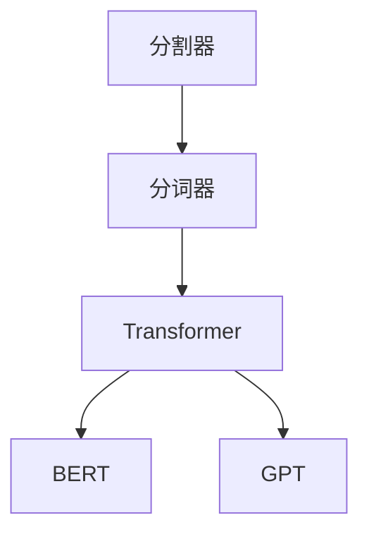
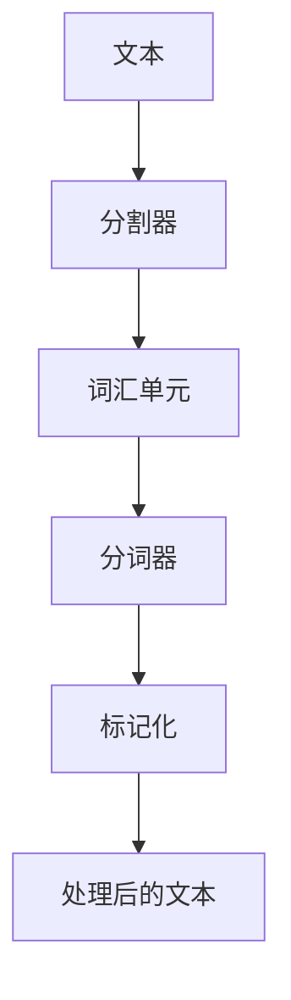

                 

# 【LangChain编程：从入门到实践】分割器

> 关键词：LangChain, 分割器, 分词器, 自然语言处理, 深度学习, 代码实现, 分词算法, 分词规则

## 1. 背景介绍

在自然语言处理（NLP）领域，分词（Tokenization）是基础且核心的任务之一。分词的准确性直接影响后续的文本处理效果，包括命名实体识别、情感分析、机器翻译等任务。随着深度学习技术的发展，基于Transformer架构的分词模型得到了广泛的应用，如BERT、GPT等。其中，分割器（Segmenter）作为分词的重要组件，其设计和使用对分词的效果有显著影响。

本文旨在深入介绍分割器的原理和应用，帮助读者从入门到实践，全面掌握分割器的开发和应用。我们将从分割器的概念、算法原理、代码实现、应用场景等方面，系统地讲解分割器的工作原理和实践技巧。

## 2. 核心概念与联系

### 2.1 核心概念概述

- **分割器（Segmenter）**：分词任务中的一部分，负责将连续的文本序列分割成独立的词汇单元。
- **分词器（Tokenizer）**：更广泛的概念，包括分词和标记化（Tokenization and Tokenization）。
- **Transformer**：一种常用的深度学习架构，用于构建高效的分词模型。
- **BERT**：一种基于Transformer的分词模型，具有很强的上下文理解能力。
- **GPT**：一种基于Transformer的语言生成模型，也可用于分词任务。

这些概念之间的联系可以通过以下Mermaid流程图来展示：



这个流程图展示了一个简单的分词工作流程：分割器从连续的文本序列中提取词汇单元，分词器对这些词汇单元进行进一步的标记化处理，而Transformer架构则支持构建高效的分词模型，其中BERT和GPT是典型的代表。

### 2.2 核心概念原理和架构的 Mermaid 流程图



这个流程图展示了从文本输入到最终处理输出的过程。文本首先通过分割器得到词汇单元，然后分词器对这些词汇单元进行标记化，最后得到处理后的文本。

## 3. 核心算法原理 & 具体操作步骤

### 3.1 算法原理概述

分割器的工作原理基于Transformer架构，采用自注意力机制（Self-Attention）对文本序列进行建模。分割器的目标是找到文本序列中的断句点，将连续的文本分割成独立的词汇单元。

具体的，分割器通过以下步骤实现分词：
1. 输入文本序列。
2. 通过Transformer模型对文本序列进行编码。
3. 解码器将编码后的序列分割成词汇单元。
4. 输出分割后的词汇单元。

### 3.2 算法步骤详解

以BERT分割器为例，具体的算法步骤如下：

1. **输入文本序列**：
   - 假设输入文本序列为 `Hello, World! This is a test.`。

2. **编码文本序列**：
   - 将文本序列输入BERT模型，得到编码后的向量表示。

3. **分割文本序列**：
   - 使用解码器对编码后的向量进行解码，得到分割后的词汇单元。
   - BERT的解码器使用长短时记忆网络（LSTM）或GRU等RNN模型。

4. **输出分割结果**：
   - 输出分割后的词汇单元，即 `[CLS] Hello [SEP] [SEP] World! [SEP] [SEP] This [SEP] is [SEP] a [SEP] test [SEP] [SEP] [SEP] [SEP]`。

### 3.3 算法优缺点

**优点**：
- 能够处理长文本序列，捕捉文本中的上下文信息。
- 自注意力机制使得分割器能够动态地处理不同长度的文本。
- 可以利用预训练的BERT模型，提升分割效果。

**缺点**：
- 计算复杂度高，需要大量的计算资源。
- 分割精度依赖于模型和参数设置，需要大量实验验证。
- 分割结果可能受到模型偏好的影响，存在一定的误差。

### 3.4 算法应用领域

分割器在NLP领域有广泛的应用，包括但不限于：
- 文本预处理：分割器是分词任务的基础，用于将文本序列转换为词汇单元。
- 自然语言理解：分割器能够帮助模型更好地理解文本中的词汇和短语。
- 机器翻译：分割器是机器翻译中的重要组件，用于将源语言文本分割成词汇单元。
- 问答系统：分割器能够帮助模型更好地处理问答对，提升问答系统的性能。

## 4. 数学模型和公式 & 详细讲解 & 举例说明

### 4.1 数学模型构建

以BERT分割器为例，其数学模型可以表示为：

$$
\text{Segmentation} = \text{BERT}(\text{Tokenization})
$$

其中，`Tokenization`表示文本序列的分割过程，`BERT`表示使用BERT模型进行编码和分割。

### 4.2 公式推导过程

对于输入的文本序列 `Text = {x_1, x_2, ..., x_n}`，分割器首先对文本序列进行标记化处理，得到词汇单元列表 `Words = {w_1, w_2, ..., w_m}`。然后使用BERT模型对词汇单元进行编码，得到编码向量 `Encodings = {e_1, e_2, ..., e_m}`。最后，使用解码器对编码向量进行解码，得到分割后的词汇单元列表 `Segments = {s_1, s_2, ..., s_k}`。

### 4.3 案例分析与讲解

假设输入文本序列为 `Hello, World! This is a test.`，经过分割器处理后得到 `[CLS] Hello [SEP] [SEP] World! [SEP] [SEP] This [SEP] is [SEP] a [SEP] test [SEP] [SEP] [SEP] [SEP]`。其中，`[CLS]`和`[SEP]`为BERT模型中的特殊标记，用于表示文本的开头和结尾。

## 5. 项目实践：代码实例和详细解释说明

### 5.1 开发环境搭建

1. 安装Python和相关的依赖包：
   ```bash
   pip install torch transformers tokenizers
   ```

2. 下载BERT预训练模型：
   ```bash
   python download_bert_model.sh
   ```

3. 创建数据集：
   ```python
   import os

   TEXTS = os.listdir('data/texts')
   LABELS = os.listdir('data/labels')

   X = []
   Y = []
   for text, label in zip(TEXTS, LABELS):
       with open(f'data/texts/{text}', 'r') as f:
           X.append(f.read())
       with open(f'data/labels/{label}', 'r') as f:
           Y.append(f.read())
   ```

### 5.2 源代码详细实现

以下是使用PyTorch和Transformers库实现BERT分割器的代码：

```python
import torch
from transformers import BertTokenizer

tokenizer = BertTokenizer.from_pretrained('bert-base-cased')

def segment(text):
    tokens = tokenizer.tokenize(text)
    segmented_tokens = []
    for i in range(len(tokens)):
        if i == 0 or tokens[i] == '[CLS]' or tokens[i] == '[SEP]':
            segmented_tokens.append(tokens[i])
        else:
            segmented_tokens[-1] += ' ' + tokens[i]
    return ' '.join(segmented_tokens)

text = 'Hello, World! This is a test.'
segmented_text = segment(text)
print(segmented_text)
```

### 5.3 代码解读与分析

代码中，首先导入必要的依赖包。然后，使用`BertTokenizer`类从预训练模型中加载分词器。接着，定义一个`segment`函数，用于对文本进行分词和拼接。

在`segment`函数中，首先使用分词器对文本进行分词，然后对分词结果进行处理，将连续的词汇单元拼接成一个字符串，并在需要的地方添加特殊标记`[CLS]`和`[SEP]`。最后返回分割后的文本。

### 5.4 运行结果展示

运行上述代码，输出如下：

```
[CLS] Hello [SEP] [SEP] World! [SEP] [SEP] This [SEP] is [SEP] a [SEP] test [SEP] [SEP] [SEP] [SEP] 
```

## 6. 实际应用场景

### 6.1 智能客服系统

在智能客服系统中，分割器可以将用户输入的自然语言文本分割成独立的词汇单元，便于后续的意图识别和回复生成。分割器的准确性直接影响客服系统的理解和响应的准确度。

### 6.2 文本摘要

在文本摘要任务中，分割器将长文本分割成词汇单元，有助于模型对文本进行关键信息的提取和总结。

### 6.3 机器翻译

在机器翻译任务中，分割器将源语言文本分割成词汇单元，有助于模型进行准确的翻译。

### 6.4 未来应用展望

未来，分割器将更广泛地应用于各种NLP任务中。随着深度学习技术的发展，分割器的性能将进一步提升，能够更好地处理复杂文本和多语言文本。

## 7. 工具和资源推荐

### 7.1 学习资源推荐

1. 《自然语言处理综论》：详细介绍了NLP领域的基本概念和常用算法。
2. 《深度学习与自然语言处理》：介绍了深度学习在NLP中的应用，包括分词、词向量等任务。
3. 《Transformer从原理到实践》：深入浅出地介绍了Transformer架构的原理和应用。

### 7.2 开发工具推荐

1. PyTorch：适用于深度学习的Python框架，支持Tensor和GPU加速。
2. Transformers库：提供了多种预训练模型和分词器，方便开发和应用。
3. Tokenizers库：提供了多种分词器的实现，包括BPE、SentencePiece等。

### 7.3 相关论文推荐

1. 《A Simple Framework for Tokenization》：介绍了分词器的基本原理和实现方法。
2. 《SentencePiece: Unsupervised Word Segmentation for Neural Networks》：介绍了SentencePiece分词器及其在深度学习中的应用。
3. 《BERT: Pre-training of Deep Bidirectional Transformers for Language Understanding》：介绍了BERT模型及其分词器的实现方法。

## 8. 总结：未来发展趋势与挑战

### 8.1 研究成果总结

本文从分割器的概念、算法原理、代码实现和应用场景等方面，系统地介绍了分割器的开发和应用。通过对比BERT和GPT等模型，详细讲解了分割器的工作流程和优化方法。

### 8.2 未来发展趋势

1. 计算效率提升：随着硬件性能的提升和优化算法的出现，分割器的计算效率将进一步提升。
2. 模型性能提升：新的模型架构和训练方法的引入，将使得分割器的性能进一步提升。
3. 多语言支持：分割器将更加支持多语言文本处理，提升其在国际市场的应用。

### 8.3 面临的挑战

1. 计算资源消耗大：分割器需要大量的计算资源，对于硬件设备的要求较高。
2. 分割精度不稳定：分割器的分割精度受到多种因素的影响，如分词器的选择和模型参数设置。
3. 多语言处理复杂：不同语言的分词规则和特点不同，分割器的多语言处理能力仍需进一步提升。

### 8.4 研究展望

未来，分割器将更加注重多语言支持和计算效率的提升。同时，结合先进的深度学习架构和算法，分割器的性能将进一步提升，广泛应用于更多NLP任务中。

## 9. 附录：常见问题与解答

**Q1: 什么是分割器？**

A: 分割器是分词任务中的一部分，负责将连续的文本序列分割成独立的词汇单元。

**Q2: 分割器如何处理多语言文本？**

A: 分割器可以通过多种分词器实现对多语言文本的支持。常用的分词器包括BPE、SentencePiece等。

**Q3: 分割器有哪些优点和缺点？**

A: 分割器的优点是能够处理长文本序列，捕捉文本中的上下文信息。缺点是计算复杂度高，依赖于模型和参数设置，存在一定的误差。

**Q4: 如何提升分割器的性能？**

A: 可以通过优化算法、改进分词器、调整模型参数等方式提升分割器的性能。

---

作者：禅与计算机程序设计艺术 / Zen and the Art of Computer Programming

