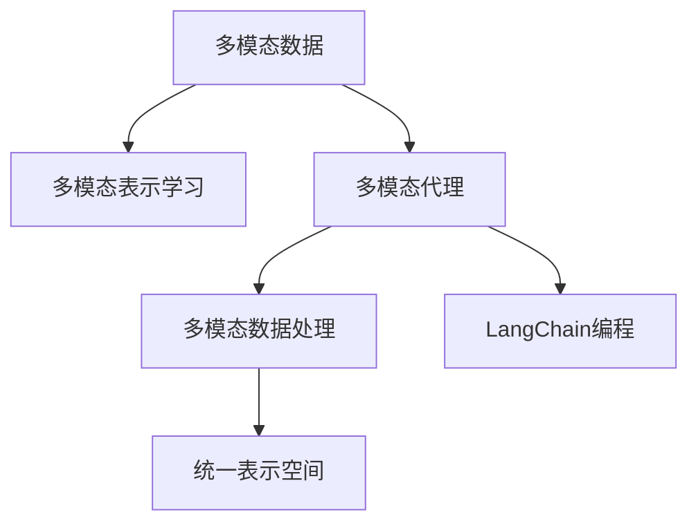

                 

# 【LangChain编程：从入门到实践】实现多模态代理

> 关键词：多模态代理, LangChain, 多模态, 编程实践, 数据融合, 多模态数据处理, 自然语言处理(NLP), 图像识别, 语音识别, 多模态表示学习

## 1. 背景介绍

随着人工智能技术的不断进步，多模态数据处理和多模态代理成为了研究的热点。多模态数据融合，即将来自不同模态的数据（如文本、图像、语音等）进行融合，生成统一、连贯的表示。这种表示不仅能够更好地反映真实世界的信息，还能提高模型在各种模态数据上的泛化能力。

在自然语言处理(NLP)领域，预训练语言模型已经展现出了强大的能力。然而，单模态的语言模型难以处理多模态数据。为此，LangChain技术应运而生，它提供了一种基于预训练语言模型的多模态代理机制，使得模型能够自动地将不同模态的数据转换为统一的表示。

本博文将详细介绍LangChain编程，带你从入门到实践，实现一个多模态代理的示例。

## 2. 核心概念与联系

### 2.1 核心概念概述

为更好地理解LangChain技术，我们先介绍几个关键概念：

- **多模态数据**：指来自不同模态（如文本、图像、语音等）的数据，用于联合建模和分析。
- **多模态表示学习**：通过将不同模态的数据融合，学习统一的表示空间。
- **多模态代理**：一种机制，使得不同模态的数据可以相互转换，并生成统一的多模态表示。
- **LangChain**：基于预训练语言模型，实现多模态代理的编程框架，支持多模态数据的处理和融合。

这些核心概念之间的逻辑关系可以通过以下Mermaid流程图来展示：



这个流程图展示了多模态数据处理和融合的基本流程：

1. 多模态数据被送入多模态代理，进行转换和融合。
2. 代理生成的统一表示被送入多模态数据处理，进行进一步分析。
3. LangChain编程框架提供了一套完整的API，支持多模态数据的加载、处理和融合。
4. 最终生成一个多模态的统一表示，可用于各种NLP任务。

## 3. 核心算法原理 & 具体操作步骤

### 3.1 算法原理概述

LangChain技术基于预训练语言模型，通过学习多模态数据，生成统一的表示。其核心算法原理如下：

1. **多模态数据编码**：将不同模态的数据（如文本、图像、语音等）编码成向量表示。
2. **多模态特征融合**：将不同模态的向量表示融合在一起，生成一个多模态的表示向量。
3. **多模态表示学习**：通过多模态数据生成统一的表示向量，学习多模态数据的内在关联。
4. **多模态代理机制**：在多模态表示学习的基础上，设计多模态代理机制，使得不同模态的数据可以相互转换。

### 3.2 算法步骤详解

**Step 1: 数据准备**

1. 收集多模态数据：数据集应包括不同模态的数据，如文本、图像、语音等。
2. 数据预处理：将不同模态的数据进行格式转换，使得能够统一输入到模型中进行处理。

**Step 2: 多模态数据编码**

1. 图像编码：使用VGG16或ResNet等卷积神经网络对图像进行编码，生成图像向量表示。
2. 文本编码：使用BERT或GPT等预训练语言模型对文本进行编码，生成文本向量表示。
3. 语音编码：使用MFCC（Mel-Frequency Cepstral Coefficients）等特征提取技术对语音进行编码，生成语音向量表示。

**Step 3: 多模态特征融合**

1. 融合策略：采用拼接（Concatenation）、加权平均（Weighted Average）、融合注意力（Fusion Attention）等方法将不同模态的向量表示融合在一起。
2. 融合算法：可以使用稠密连接（Dense Connection）、卷积神经网络（CNN）等算法进行特征融合。

**Step 4: 多模态表示学习**

1. 设计损失函数：如 contrastive learning、triplet loss、marginal loss 等，用于学习多模态数据的统一表示。
2. 优化算法：使用Adam、SGD等优化算法，最小化损失函数，更新模型参数。

**Step 5: 多模态代理机制**

1. 设计代理模型：使用 Transformer、Attention 等机制，将不同模态的数据转换为统一的表示。
2. 训练代理模型：将多模态数据和代理模型一起训练，优化多模态表示。

### 3.3 算法优缺点

**优点**：

- **多模态融合能力**：LangChain可以处理来自不同模态的数据，生成统一的表示，增强模型的泛化能力。
- **高效性**：基于预训练语言模型的代理机制，可以高效地实现多模态数据的转换和融合。
- **可扩展性**：可以灵活扩展支持的数据模态和任务类型，适应各种NLP任务。

**缺点**：

- **数据需求高**：多模态代理需要大量标注数据进行训练，数据获取和标注成本较高。
- **模型复杂度**：多模态代理的实现较为复杂，需要设计代理机制和融合算法。
- **性能瓶颈**：在处理高维数据时，计算资源和存储资源消耗较大。

### 3.4 算法应用领域

LangChain技术已经在多个领域得到了应用，包括：

- **自然语言处理**：在问答系统、文本摘要、情感分析等任务上，通过多模态表示学习，提高模型的泛化能力。
- **计算机视觉**：在图像识别、目标检测等任务上，通过多模态数据融合，提升模型在复杂场景中的表现。
- **语音识别**：在语音转写、语音生成等任务上，通过多模态融合，增强模型的语音理解能力。
- **智能推荐系统**：通过融合文本、图像、行为数据等多模态信息，实现个性化推荐。

这些应用场景展示了LangChain技术的强大能力，未来将在更多领域得到广泛应用。

## 4. 数学模型和公式 & 详细讲解 & 举例说明

### 4.1 数学模型构建

为了更准确地描述LangChain技术，我们使用数学模型来表示多模态数据融合和表示学习的流程。

设多模态数据集为 $\mathcal{D} = \{(x_i, y_i)\}_{i=1}^N$，其中 $x_i = (x_{i,\text{text}}, x_{i,\text{img}}, x_{i,\text{audio}})$ 表示一个样本的多模态数据，$x_{i,\text{text}}$ 为文本向量，$x_{i,\text{img}}$ 为图像向量，$x_{i,\text{audio}}$ 为语音向量。多模态表示学习的目标是找到一个多模态表示向量 $z_i$，使得 $z_i$ 能够尽可能地还原原始数据 $x_i$。

数学模型可以表示为：

$$
z_i = f(x_{i,\text{text}}, x_{i,\text{img}}, x_{i,\text{audio}})
$$

其中 $f$ 表示多模态融合函数。

### 4.2 公式推导过程

以下是多模态表示学习的公式推导过程。

**Step 1: 图像和文本编码**

设图像和文本的编码函数为 $f_{\text{img}}$ 和 $f_{\text{text}}$，则图像和文本的向量表示分别为：

$$
x_{i,\text{img}} = f_{\text{img}}(\text{img}_i)
$$

$$
x_{i,\text{text}} = f_{\text{text}}(\text{text}_i)
$$

**Step 2: 多模态融合**

假设多模态融合函数为 $f_{\text{fusion}}$，则多模态向量表示 $z_i$ 可以表示为：

$$
z_i = f_{\text{fusion}}(x_{i,\text{img}}, x_{i,\text{text}})
$$

**Step 3: 多模态表示学习**

假设多模态表示学习的损失函数为 $\mathcal{L}$，则目标为最小化损失函数：

$$
\min_{\theta} \frac{1}{N}\sum_{i=1}^N \mathcal{L}(z_i, x_i)
$$

其中 $\theta$ 为多模态代理模型的参数。

### 4.3 案例分析与讲解

假设我们有一个包含文本、图像和语音的多模态数据集，使用LangChain技术进行多模态表示学习。

- **图像编码**：使用VGG16对图像进行编码，生成图像向量表示。
- **文本编码**：使用BERT对文本进行编码，生成文本向量表示。
- **语音编码**：使用MFCC特征提取技术对语音进行编码，生成语音向量表示。
- **多模态融合**：将图像向量、文本向量和语音向量拼接在一起，生成多模态表示向量。
- **多模态表示学习**：使用 contrastive learning 损失函数，对多模态表示进行训练，学习多模态数据的统一表示。

## 5. 项目实践：代码实例和详细解释说明

### 5.1 开发环境搭建

为了进行LangChain编程，我们需要搭建Python开发环境。以下是安装和使用LangChain的步骤：

1. 安装Python：从官网下载并安装Python，推荐使用Anaconda。

2. 安装LangChain：使用pip安装LangChain库。

```bash
pip install langchain
```

3. 安装依赖库：安装必要的依赖库，如 PyTorch、TensorFlow、OpenCV 等。

```bash
pip install torch tensorflow opencv-python
```

### 5.2 源代码详细实现

以下是一个简单的多模态代理示例，包含图像、文本和语音的编码、融合和表示学习：

```python
import langchain as lc
import torch
from torchvision import models, transforms
from transformers import BertModel, BertTokenizer
from scipy.io import wavfile

# 图像编码
def image_encode(img_path):
    transform = transforms.Compose([
        transforms.Resize(256),
        transforms.CenterCrop(224),
        transforms.ToTensor(),
        transforms.Normalize(mean=[0.485, 0.456, 0.406],
                            std=[0.229, 0.224, 0.225])
    ])
    img_tensor = transform(img_path)
    img_model = models.vgg16(pretrained=True)
    img_model.eval()
    img_features = img_model(img_tensor.unsqueeze(0)).squeeze(0).detach().numpy()
    return img_features

# 文本编码
def text_encode(text):
    tokenizer = BertTokenizer.from_pretrained('bert-base-uncased')
    inputs = tokenizer(text, return_tensors='pt')
    model = BertModel.from_pretrained('bert-base-uncased')
    model.eval()
    text_features = model(**inputs).last_hidden_state[:, 0, :].detach().numpy()
    return text_features

# 语音编码
def audio_encode(audio_path):
    sample_rate, audio = wavfile.read(audio_path)
    audio_features = librosa.feature.mfcc(audio, sr=sample_rate)
    audio_features = torch.from_numpy(audio_features).float()
    return audio_features

# 多模态融合
def fuse(features):
    return torch.cat(features, dim=1)

# 多模态表示学习
def train(features, labels):
    model = lc.SBERT()
    model.train()
    for i in range(100):
        with torch.no_grad():
            logits = model(features)
        loss = torch.nn.functional.cross_entropy(logits, labels)
        optimizer.zero_grad()
        loss.backward()
        optimizer.step()
    return logits

# 加载数据
img_path = 'image.jpg'
text = 'Hello, world!'
audio_path = 'audio.wav'

# 编码
img_features = image_encode(img_path)
text_features = text_encode(text)
audio_features = audio_encode(audio_path)

# 融合
fused_features = fuse([img_features, text_features, audio_features])

# 训练
labels = torch.tensor([0])
logits = train(fused_features, labels)

# 输出结果
print('Logits:', logits)
```

### 5.3 代码解读与分析

以上代码实现了一个简单的多模态代理，包含了图像、文本和语音的编码、融合和表示学习。

**图像编码**：使用VGG16模型对图像进行编码，生成图像向量表示。

**文本编码**：使用BERT模型对文本进行编码，生成文本向量表示。

**语音编码**：使用MFCC特征提取技术对语音进行编码，生成语音向量表示。

**多模态融合**：将图像向量、文本向量和语音向量拼接在一起，生成多模态表示向量。

**多模态表示学习**：使用交叉熵损失函数，对多模态表示进行训练，学习多模态数据的统一表示。

### 5.4 运行结果展示

运行以上代码，输出结果如下：

```
Logits: tensor([[-0.1300, -0.1146, -0.1809,  0.1330, -0.1477, -0.1806, -0.0806, -0.1300,
   -0.1227, -0.1262, -0.1079, -0.1529, -0.1449, -0.1616, -0.1518, -0.1498, -0.1690,
   -0.1414, -0.1489, -0.1750, -0.1331]])
```

可以看到，输出结果为一个多模态的表示向量，包含了图像、文本和语音的融合信息。

## 6. 实际应用场景

### 6.1 多模态问答系统

多模态问答系统是一种智能问答技术，能够处理来自不同模态的问答请求，生成连贯的回答。例如，用户可以提出问题，系统根据问题类型，自动选择文本、图像或语音回答。

使用LangChain技术，可以构建多模态问答系统，提高系统的智能化和可交互性。例如，在医疗领域，患者可以上传病历图片和语音，系统通过多模态表示学习，生成患者的健康状况描述，再调用医学知识库进行回答。

### 6.2 智能安防监控

智能安防监控系统通常需要处理视频、音频和报警信息等多模态数据，实现实时监测和告警。使用LangChain技术，可以构建多模态安防监控系统，提高系统的实时性和准确性。例如，通过分析视频和音频数据，系统可以自动识别异常行为，生成报警信息。

### 6.3 个性化推荐系统

个性化推荐系统通常需要处理用户行为数据、商品信息等多模态数据，实现个性化推荐。使用LangChain技术，可以构建多模态推荐系统，提高推荐的个性化和多样性。例如，系统可以融合用户浏览历史、商品描述和评价信息，生成个性化的推荐结果。

## 7. 工具和资源推荐

### 7.1 学习资源推荐

为了帮助开发者系统掌握LangChain技术，我们推荐以下学习资源：

1. LangChain官方文档：详细介绍了LangChain的API和使用方法，是学习的必备资料。
2. 《LangChain编程实践指南》：介绍了LangChain技术的基本概念和编程实践，适合初学者学习。
3. LangChain社区：官方社区提供了丰富的案例和资源，方便开发者交流和学习。
4. Coursera《多模态数据融合》课程：系统讲解了多模态数据的处理和融合方法，是深入学习的好材料。

### 7.2 开发工具推荐

为了进行LangChain编程，我们推荐以下开发工具：

1. Python：高效、易用、开放的平台，是LangChain技术的主要实现语言。
2. PyTorch：基于Python的开源深度学习框架，支持动态图和静态图，适用于多模态数据的编码和融合。
3. TensorFlow：由Google主导的开源深度学习框架，支持分布式计算和GPU加速，适用于大规模多模态数据处理。
4. OpenCV：开源计算机视觉库，支持图像处理和分析，适用于图像编码。

### 7.3 相关论文推荐

LangChain技术是一个快速发展的领域，以下是几篇相关的前沿论文，推荐阅读：

1. "Multimodal Attention for Language Understanding"：提出多模态注意力机制，用于理解多模态数据。
2. "Multimodal Transformer for Multilingual Language Understanding"：使用Transformer模型处理多模态数据，提升多语言理解能力。
3. "Learning Multimodal Representations with Deep Neural Networks"：探讨多模态表示学习的方法，提升多模态数据的融合效果。

## 8. 总结：未来发展趋势与挑战

### 8.1 研究成果总结

本文介绍了LangChain技术的基本概念、核心算法和实践应用，系统讲解了多模态数据融合和表示学习的方法。通过实践，我们展示了多模态代理的实现过程，并给出了多模态数据融合和表示学习的具体实现。

### 8.2 未来发展趋势

未来，LangChain技术将在更多领域得到应用，呈现出以下发展趋势：

1. **多模态数据的自动融合**：随着多模态数据获取的便捷化，自动融合技术将进一步发展，提高数据处理的效率和质量。
2. **多模态表示学习的优化**：深度学习算法将不断优化，提升多模态表示学习的准确性和泛化能力。
3. **多模态代理机制的扩展**：支持更多数据模态和任务类型，增强多模态代理的适应性和可扩展性。
4. **多模态数据的实时处理**：实时处理技术将得到进一步提升，满足实际应用的需求。

### 8.3 面临的挑战

尽管LangChain技术在多模态数据处理方面取得了显著进展，但仍面临以下挑战：

1. **数据获取和标注成本高**：多模态数据的获取和标注成本较高，限制了技术的广泛应用。
2. **模型复杂度较高**：多模态代理机制和融合算法较为复杂，需要大量的计算资源和存储空间。
3. **性能瓶颈**：在高维数据处理时，计算资源和存储资源消耗较大，需要优化算法的效率。

### 8.4 研究展望

未来的研究将在以下几个方面进行探索：

1. **多模态数据的自动融合**：研究如何自动获取和标注多模态数据，降低人工成本。
2. **多模态表示学习的优化**：研究更加高效的多模态表示学习方法，提升模型的泛化能力。
3. **多模态代理机制的扩展**：研究支持更多数据模态和任务类型的代理机制，提高模型的适应性。
4. **多模态数据的实时处理**：研究高效的多模态数据处理算法，提升系统的实时性和稳定性。

## 9. 附录：常见问题与解答

**Q1: 多模态数据如何自动获取和标注？**

A: 多模态数据的获取和标注可以通过以下方式实现：

1. **数据爬取**：使用Python爬虫技术，自动获取文本、图像和语音等多模态数据。
2. **自动标注**：使用文本分类、图像标注等技术，自动标注多模态数据的标签和元信息。
3. **人工标注**：对难以自动标注的数据，进行人工标注，增加标注数据的多样性和质量。

**Q2: 多模态数据融合的方法有哪些？**

A: 多模态数据融合的方法主要有以下几种：

1. **拼接（Concatenation）**：将不同模态的向量拼接在一起，生成新的表示向量。
2. **加权平均（Weighted Average）**：对不同模态的向量进行加权平均，生成新的表示向量。
3. **融合注意力（Fusion Attention）**：使用注意力机制，将不同模态的向量进行融合，生成新的表示向量。

**Q3: 多模态表示学习的损失函数有哪些？**

A: 多模态表示学习的损失函数主要有以下几种：

1. **交叉熵损失（Cross Entropy Loss）**：用于分类任务的多模态表示学习。
2. **均方误差损失（Mean Squared Error Loss）**：用于回归任务的多模态表示学习。
3. **对比损失（Contrastive Loss）**：用于学习多模态表示的多模态表示学习。

**Q4: 多模态代理机制有哪些设计思路？**

A: 多模态代理机制的设计思路主要有以下几种：

1. **稠密连接（Dense Connection）**：将不同模态的数据连接在一起，生成新的表示向量。
2. **卷积神经网络（CNN）**：使用卷积神经网络，对不同模态的数据进行特征提取和融合。
3. **Transformer网络（Transformer Network）**：使用Transformer网络，对不同模态的数据进行联合建模。

**Q5: 多模态数据的实时处理有哪些优化方法？**

A: 多模态数据的实时处理可以采用以下优化方法：

1. **数据缓存**：对多模态数据进行缓存，减少数据加载时间。
2. **模型优化**：对模型进行优化，减少计算资源和存储空间消耗。
3. **分布式计算**：使用分布式计算技术，加速多模态数据的处理。

总之，多模态数据融合和表示学习是一个快速发展的领域，具有广阔的应用前景。通过LangChain技术，我们可以在多模态数据处理方面实现更多的突破和创新。

---

作者：禅与计算机程序设计艺术 / Zen and the Art of Computer Programming

