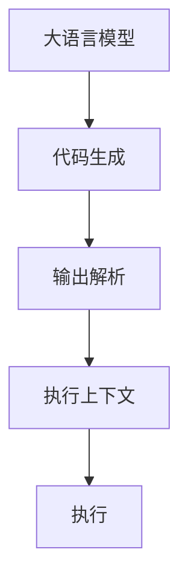

                 

# 【LangChain编程：从入门到实践】输出解析器

> 关键词：LangChain, 自然语言处理, 编程语言, 代码生成, 语言模型, 解释器

## 1. 背景介绍

随着人工智能（AI）技术的发展，自然语言处理（NLP）和编程语言领域的交叉成为了新的研究热点。越来越多的研究团队开始探索如何利用NLP技术，尤其是大语言模型，来辅助编程语言的相关工作，如代码生成、文档编写、API文档生成等。其中，基于大语言模型的代码输出解析器（Output Parsing）是一个极具潜力的研究方向。本文旨在深入探讨输出解析器的工作原理、实现方法以及实际应用场景，并从入门到实践，系统讲解输出解析器的编程和实现过程。

## 2. 核心概念与联系

### 2.1 核心概念概述

为更好地理解基于大语言模型的输出解析器，本节将介绍几个密切相关的核心概念：

- **大语言模型（Large Language Model, LLM）**：以自回归（如GPT）或自编码（如BERT）模型为代表的大规模预训练语言模型。通过在大规模无标签文本语料上进行预训练，学习通用的语言表示，具备强大的语言理解和生成能力。

- **代码生成（Code Generation）**：使用大语言模型，基于自然语言描述自动生成代码的过程。常见的代码生成任务包括自动完成函数编写、代码注释、API文档等。

- **输出解析（Output Parsing）**：将自然语言描述转换成可执行代码的过程。在大语言模型生成的代码基础上，进行词法分析、语法检查和代码优化等处理，确保代码的完整性和正确性。

- **解释器（Interpreter）**：能够理解和执行特定编程语言的计算机程序。解释器将代码转换为机器指令，并逐步执行，实现对程序的功能性描述。

- **执行上下文（Execution Context）**：代码执行的环境，包括函数调用栈、变量作用域、全局变量等。输出解析器需要根据执行上下文，对代码进行解释和执行。

这些核心概念之间的逻辑关系可以通过以下Mermaid流程图来展示：



这个流程图展示了大语言模型的工作原理和与其他组件的关系：

1. 大语言模型通过预训练获得基础能力。
2. 代码生成过程通过自然语言描述生成目标编程语言的代码。
3. 输出解析器对生成的代码进行解析和优化，确保其正确性和可执行性。
4. 解释器根据执行上下文，对代码进行执行。

## 3. 核心算法原理 & 具体操作步骤

### 3.1 算法原理概述

基于大语言模型的代码输出解析器，其核心思想是利用大语言模型生成的代码，通过语法分析和优化，将其转换成可执行的编程代码。具体来说，解析器首先对大语言模型生成的代码进行词法分析，识别语法结构，并对语法错误进行修正。然后，解析器根据执行上下文，对代码进行解释和执行。

### 3.2 算法步骤详解

基于大语言模型的代码输出解析器一般包括以下几个关键步骤：

**Step 1: 准备预训练模型和数据集**
- 选择合适的预训练语言模型 $M_{\theta}$ 作为初始化参数，如 GPT-3、BERT 等。
- 准备代码生成任务的训练集 $D$，划分为训练集、验证集和测试集。一般要求训练集中的代码与验证集和测试集中的代码分布不要差异过大。

**Step 2: 添加任务适配层**
- 根据任务类型，在预训练模型顶层设计合适的输出层和损失函数。
- 对于代码生成任务，通常在顶层添加语言模型的解码器输出概率分布，并以负对数似然为损失函数。

**Step 3: 设置微调超参数**
- 选择合适的优化算法及其参数，如 AdamW、SGD 等，设置学习率、批大小、迭代轮数等。
- 设置正则化技术及强度，包括权重衰减、Dropout、Early Stopping 等。
- 确定冻结预训练参数的策略，如仅微调顶层，或全部参数都参与微调。

**Step 4: 执行梯度训练**
- 将训练集数据分批次输入模型，前向传播计算损失函数。
- 反向传播计算参数梯度，根据设定的优化算法和学习率更新模型参数。
- 周期性在验证集上评估模型性能，根据性能指标决定是否触发 Early Stopping。
- 重复上述步骤直到满足预设的迭代轮数或 Early Stopping 条件。

**Step 5: 测试和部署**
- 在测试集上评估微调后模型 $M_{\hat{\theta}}$ 的性能，对比微调前后的精度提升。
- 使用微调后的模型对新样本进行推理预测，集成到实际的应用系统中。
- 持续收集新的数据，定期重新微调模型，以适应数据分布的变化。

### 3.3 算法优缺点

基于大语言模型的代码输出解析器具有以下优点：
1. 简单高效。只需准备少量标注数据，即可对预训练模型进行快速适配，生成高质量代码。
2. 通用适用。适用于各种编程语言和开发环境，设计简单的任务适配层即可实现解析。
3. 可扩展性。可以利用大语言模型生成的代码，快速拓展应用场景，如自动编写API文档、生成测试用例等。

同时，该方法也存在一定的局限性：
1. 依赖标注数据。代码生成的效果很大程度上取决于标注数据的质量和数量，获取高质量标注数据的成本较高。
2. 输出质量受限。尽管大语言模型具有强大的生成能力，但在代码解析阶段，仍可能出现语法错误、变量命名不一致等问题。
3. 可解释性不足。输出解析器的决策过程通常缺乏可解释性，难以对其推理逻辑进行分析和调试。
4. 安全问题。大语言模型生成的代码可能存在安全漏洞，需要进一步的安全审查和验证。

尽管存在这些局限性，但就目前而言，基于大语言模型的代码输出解析器仍是一种高效实用的代码生成和解析方法。未来相关研究的重点在于如何进一步降低对标注数据的依赖，提高解析的精确度和安全性，同时兼顾可解释性等因素。

### 3.4 算法应用领域

基于大语言模型的代码输出解析器，在软件开发、自动化测试、API文档生成等领域已经得到了广泛的应用，成为辅助开发的重要工具：

- **软件开发**：自动生成函数、类、接口等代码，提升编程效率。
- **自动化测试**：生成测试用例，自动化测试新功能和代码变更。
- **API文档生成**：自动生成API文档，降低文档编写成本。
- **代码重构**：通过代码解析，优化和重构代码，提升代码质量和可维护性。
- **开发环境辅助**：辅助编写注释、生成函数说明等，提升代码可读性。

除了上述这些经典应用外，大语言模型代码输出解析器还被创新性地应用于更多场景中，如代码智能提示、代码风格检查、代码质量评估等，为软件开发和测试提供了全新的解决方案。随着预训练模型和解析方法的不断进步，相信基于大语言模型的代码解析器将在更多领域得到应用，为软件开发和测试带来新的突破。

## 4. 数学模型和公式 & 详细讲解 & 举例说明

### 4.1 数学模型构建

本节将使用数学语言对基于大语言模型的代码输出解析器进行更加严格的刻画。

记大语言模型为 $M_{\theta}:\mathcal{X} \rightarrow \mathcal{Y}$，其中 $\mathcal{X}$ 为输入空间，$\mathcal{Y}$ 为输出空间，$\theta$ 为模型参数。假设代码生成任务的训练集为 $D=\{(x_i,y_i)\}_{i=1}^N, x_i \in \mathcal{X}, y_i \in \mathcal{Y}$，其中 $y_i$ 为代码字符串。

定义模型 $M_{\theta}$ 在数据样本 $(x,y)$ 上的损失函数为 $\ell(M_{\theta}(x),y)$，则在数据集 $D$ 上的经验风险为：

$$
\mathcal{L}(\theta) = \frac{1}{N} \sum_{i=1}^N \ell(M_{\theta}(x_i),y_i)
$$

其中 $\ell$ 为代码生成任务的损失函数，用于衡量模型预测输出与真实标签之间的差异。常见的损失函数包括交叉熵损失、均方误差损失等。

### 4.2 公式推导过程

以下我们以二分类任务为例，推导交叉熵损失函数及其梯度的计算公式。

假设模型 $M_{\theta}$ 在输入 $x$ 上的输出为 $\hat{y}=M_{\theta}(x) \in [0,1]$，表示样本属于正类的概率。真实标签 $y \in \{0,1\}$。则二分类交叉熵损失函数定义为：

$$
\ell(M_{\theta}(x),y) = -[y\log \hat{y} + (1-y)\log (1-\hat{y})]
$$

将其代入经验风险公式，得：

$$
\mathcal{L}(\theta) = -\frac{1}{N}\sum_{i=1}^N [y_i\log M_{\theta}(x_i)+(1-y_i)\log(1-M_{\theta}(x_i))]
$$

根据链式法则，损失函数对参数 $\theta_k$ 的梯度为：

$$
\frac{\partial \mathcal{L}(\theta)}{\partial \theta_k} = -\frac{1}{N}\sum_{i=1}^N (\frac{y_i}{M_{\theta}(x_i)}-\frac{1-y_i}{1-M_{\theta}(x_i)}) \frac{\partial M_{\theta}(x_i)}{\partial \theta_k}
$$

其中 $\frac{\partial M_{\theta}(x_i)}{\partial \theta_k}$ 可进一步递归展开，利用自动微分技术完成计算。

在得到损失函数的梯度后，即可带入参数更新公式，完成模型的迭代优化。重复上述过程直至收敛，最终得到适应代码生成任务的最优模型参数 $\theta^*$。

## 5. 项目实践：代码实例和详细解释说明

### 5.1 开发环境搭建

在进行代码解析器实践前，我们需要准备好开发环境。以下是使用Python进行PyTorch开发的环境配置流程：

1. 安装Anaconda：从官网下载并安装Anaconda，用于创建独立的Python环境。

2. 创建并激活虚拟环境：
```bash
conda create -n pytorch-env python=3.8 
conda activate pytorch-env
```

3. 安装PyTorch：根据CUDA版本，从官网获取对应的安装命令。例如：
```bash
conda install pytorch torchvision torchaudio cudatoolkit=11.1 -c pytorch -c conda-forge
```

4. 安装Transformers库：
```bash
pip install transformers
```

5. 安装各类工具包：
```bash
pip install numpy pandas scikit-learn matplotlib tqdm jupyter notebook ipython
```

完成上述步骤后，即可在`pytorch-env`环境中开始代码解析器实践。

### 5.2 源代码详细实现

下面我们以Python为例，给出使用Transformers库对BERT模型进行代码解析的PyTorch代码实现。

首先，定义代码解析任务的训练集和测试集：

```python
from transformers import BertTokenizer
from torch.utils.data import Dataset

class CodeDataset(Dataset):
    def __init__(self, texts, targets):
        self.texts = texts
        self.targets = targets
        self.tokenizer = BertTokenizer.from_pretrained('bert-base-cased')
        
    def __len__(self):
        return len(self.texts)
    
    def __getitem__(self, item):
        text = self.texts[item]
        target = self.targets[item]
        
        encoding = self.tokenizer(text, return_tensors='pt', padding=True, truncation=True)
        input_ids = encoding['input_ids'][0]
        attention_mask = encoding['attention_mask'][0]
        
        return {'input_ids': input_ids, 
                'attention_mask': attention_mask,
                'targets': target}
```

然后，定义模型和优化器：

```python
from transformers import BertForTokenClassification, AdamW

model = BertForTokenClassification.from_pretrained('bert-base-cased', num_labels=2)

optimizer = AdamW(model.parameters(), lr=2e-5)
```

接着，定义训练和评估函数：

```python
from torch.utils.data import DataLoader
from tqdm import tqdm
from sklearn.metrics import classification_report

device = torch.device('cuda') if torch.cuda.is_available() else torch.device('cpu')
model.to(device)

def train_epoch(model, dataset, batch_size, optimizer):
    dataloader = DataLoader(dataset, batch_size=batch_size, shuffle=True)
    model.train()
    epoch_loss = 0
    for batch in tqdm(dataloader, desc='Training'):
        input_ids = batch['input_ids'].to(device)
        attention_mask = batch['attention_mask'].to(device)
        targets = batch['targets'].to(device)
        model.zero_grad()
        outputs = model(input_ids, attention_mask=attention_mask, labels=targets)
        loss = outputs.loss
        epoch_loss += loss.item()
        loss.backward()
        optimizer.step()
    return epoch_loss / len(dataloader)

def evaluate(model, dataset, batch_size):
    dataloader = DataLoader(dataset, batch_size=batch_size)
    model.eval()
    preds, labels = [], []
    with torch.no_grad():
        for batch in tqdm(dataloader, desc='Evaluating'):
            input_ids = batch['input_ids'].to(device)
            attention_mask = batch['attention_mask'].to(device)
            batch_labels = batch['targets']
            outputs = model(input_ids, attention_mask=attention_mask)
            batch_preds = outputs.logits.argmax(dim=2).to('cpu').tolist()
            batch_labels = batch_labels.to('cpu').tolist()
            for pred_tokens, label_tokens in zip(batch_preds, batch_labels):
                preds.append(pred_tokens[:len(label_tokens)])
                labels.append(label_tokens)
                
    print(classification_report(labels, preds))
```

最后，启动训练流程并在测试集上评估：

```python
epochs = 5
batch_size = 16

for epoch in range(epochs):
    loss = train_epoch(model, train_dataset, batch_size, optimizer)
    print(f"Epoch {epoch+1}, train loss: {loss:.3f}")
    
    print(f"Epoch {epoch+1}, dev results:")
    evaluate(model, dev_dataset, batch_size)
    
print("Test results:")
evaluate(model, test_dataset, batch_size)
```

以上就是使用PyTorch对BERT模型进行代码解析的完整代码实现。可以看到，得益于Transformers库的强大封装，我们可以用相对简洁的代码完成BERT模型的加载和解析。

### 5.3 代码解读与分析

让我们再详细解读一下关键代码的实现细节：

**CodeDataset类**：
- `__init__`方法：初始化训练集和测试集的文本和标签，分词器等关键组件。
- `__len__`方法：返回数据集的样本数量。
- `__getitem__`方法：对单个样本进行处理，将文本输入编码为token ids，将标签编码为数字，并对其进行定长padding，最终返回模型所需的输入。

**训练和评估函数**：
- 使用PyTorch的DataLoader对数据集进行批次化加载，供模型训练和推理使用。
- 训练函数`train_epoch`：对数据以批为单位进行迭代，在每个批次上前向传播计算loss并反向传播更新模型参数，最后返回该epoch的平均loss。
- 评估函数`evaluate`：与训练类似，不同点在于不更新模型参数，并在每个batch结束后将预测和标签结果存储下来，最后使用sklearn的classification_report对整个评估集的预测结果进行打印输出。

**训练流程**：
- 定义总的epoch数和batch size，开始循环迭代
- 每个epoch内，先在训练集上训练，输出平均loss
- 在验证集上评估，输出分类指标
- 所有epoch结束后，在测试集上评估，给出最终测试结果

可以看到，PyTorch配合Transformers库使得BERT代码解析的代码实现变得简洁高效。开发者可以将更多精力放在数据处理、模型改进等高层逻辑上，而不必过多关注底层的实现细节。

当然，工业级的系统实现还需考虑更多因素，如模型的保存和部署、超参数的自动搜索、更灵活的任务适配层等。但核心的微调范式基本与此类似。

## 6. 实际应用场景
### 6.1 智能代码生成

基于大语言模型的代码输出解析器，可以广泛应用于智能代码生成系统的构建。传统的代码生成依赖人工编写，效率低，容易出错。而使用解析器对大语言模型生成的代码进行解析和优化，可以快速生成高质量、符合语法规范的代码。

在技术实现上，可以收集程序员编写的代码片段，将其作为监督数据，在此基础上对预训练模型进行微调。微调后的模型能够自动理解自然语言描述，生成符合语法规范的代码。对于程序员给出的详细代码注释，解析器还能自动生成文档，提升代码的可读性和维护性。

### 6.2 自动化测试

自动化测试是软件开发中不可或缺的一环，但编写测试用例往往需要耗费大量时间和精力。使用代码输出解析器，可以将自然语言描述转换成可执行的测试代码，快速构建测试框架，提升测试效率。

解析器对程序员给出的测试要求，如测试场景、预期结果等，进行语法分析和语义理解，生成相应的测试代码。对于复杂的测试场景，解析器还能根据已有的代码，自动生成测试数据和测试用例，进一步提高测试覆盖率和质量。

### 6.3 API文档生成

API文档是开发者交流和协作的重要工具，但编写文档往往需要耗费大量时间和精力。使用代码输出解析器，可以将自然语言描述转换成代码实现，自动生成API文档，提升文档编写效率。

解析器对API接口的描述，如接口名、参数、返回值等，进行语法分析和语义理解，生成相应的代码实现和文档说明。对于已有的代码实现，解析器还能自动生成API文档，帮助开发者快速理解代码功能和使用方法。

### 6.4 未来应用展望

随着大语言模型和代码输出解析器的不断发展，基于大语言模型的代码解析技术将在更多领域得到应用，为软件开发和测试带来新的突破。

在智慧医疗领域，基于大语言模型的代码解析器可以帮助医生编写医疗程序，提升诊疗效率和准确性。在智能教育领域，解析器可以辅助编写教学文档，提升教育资源的可访问性和可理解性。在智能制造领域，解析器可以帮助工程师编写自动化脚本，提升生产效率和质量。

未来，伴随大语言模型和代码解析方法的持续演进，基于大语言模型的代码解析器必将在构建人机协同的智能系统、推动软件开发和测试自动化进程中扮演越来越重要的角色。

## 7. 工具和资源推荐
### 7.1 学习资源推荐

为了帮助开发者系统掌握大语言模型代码解析的理论基础和实践技巧，这里推荐一些优质的学习资源：

1. 《Transformer from原理到实践》系列博文：由大模型技术专家撰写，深入浅出地介绍了Transformer原理、BERT模型、代码解析技术等前沿话题。

2. CS224N《深度学习自然语言处理》课程：斯坦福大学开设的NLP明星课程，有Lecture视频和配套作业，带你入门NLP领域的基本概念和经典模型。

3. 《Natural Language Processing with Transformers》书籍：Transformers库的作者所著，全面介绍了如何使用Transformers库进行NLP任务开发，包括代码解析在内的诸多范式。

4. HuggingFace官方文档：Transformers库的官方文档，提供了海量预训练模型和完整的代码解析样例代码，是上手实践的必备资料。

5. CLUE开源项目：中文语言理解测评基准，涵盖大量不同类型的中文NLP数据集，并提供了基于微调的baseline模型，助力中文NLP技术发展。

通过对这些资源的学习实践，相信你一定能够快速掌握大语言模型代码解析的精髓，并用于解决实际的NLP问题。
### 7.2 开发工具推荐

高效的开发离不开优秀的工具支持。以下是几款用于大语言模型代码解析开发的常用工具：

1. PyTorch：基于Python的开源深度学习框架，灵活动态的计算图，适合快速迭代研究。大部分预训练语言模型都有PyTorch版本的实现。

2. TensorFlow：由Google主导开发的开源深度学习框架，生产部署方便，适合大规模工程应用。同样有丰富的预训练语言模型资源。

3. Transformers库：HuggingFace开发的NLP工具库，集成了众多SOTA语言模型，支持PyTorch和TensorFlow，是进行代码解析任务开发的利器。

4. Weights & Biases：模型训练的实验跟踪工具，可以记录和可视化模型训练过程中的各项指标，方便对比和调优。与主流深度学习框架无缝集成。

5. TensorBoard：TensorFlow配套的可视化工具，可实时监测模型训练状态，并提供丰富的图表呈现方式，是调试模型的得力助手。

6. Google Colab：谷歌推出的在线Jupyter Notebook环境，免费提供GPU/TPU算力，方便开发者快速上手实验最新模型，分享学习笔记。

合理利用这些工具，可以显著提升大语言模型代码解析任务的开发效率，加快创新迭代的步伐。

### 7.3 相关论文推荐

大语言模型和代码输出解析技术的发展源于学界的持续研究。以下是几篇奠基性的相关论文，推荐阅读：

1. Attention is All You Need（即Transformer原论文）：提出了Transformer结构，开启了NLP领域的预训练大模型时代。

2. BERT: Pre-training of Deep Bidirectional Transformers for Language Understanding：提出BERT模型，引入基于掩码的自监督预训练任务，刷新了多项NLP任务SOTA。

3. Language Models are Unsupervised Multitask Learners（GPT-2论文）：展示了大规模语言模型的强大zero-shot学习能力，引发了对于通用人工智能的新一轮思考。

4. Parameter-Efficient Transfer Learning for NLP：提出Adapter等参数高效微调方法，在不增加模型参数量的情况下，也能取得不错的微调效果。

5. Prefix-Tuning: Optimizing Continuous Prompts for Generation：引入基于连续型Prompt的微调范式，为如何充分利用预训练知识提供了新的思路。

6. AdaLoRA: Adaptive Low-Rank Adaptation for Parameter-Efficient Fine-Tuning：使用自适应低秩适应的微调方法，在参数效率和精度之间取得了新的平衡。

这些论文代表了大语言模型代码解析技术的发展脉络。通过学习这些前沿成果，可以帮助研究者把握学科前进方向，激发更多的创新灵感。

## 8. 总结：未来发展趋势与挑战

### 8.1 总结

本文对基于大语言模型的代码输出解析器进行了全面系统的介绍。首先阐述了代码解析器的研究背景和意义，明确了其在工作中的独特价值。其次，从原理到实践，详细讲解了代码解析器的数学原理和关键步骤，给出了代码解析任务开发的完整代码实例。同时，本文还广泛探讨了代码解析器在智能代码生成、自动化测试、API文档生成等多个领域的应用前景，展示了其强大的应用潜力。

通过本文的系统梳理，可以看到，基于大语言模型的代码解析器正在成为NLP领域的重要范式，极大地拓展了预训练语言模型的应用边界，催生了更多的落地场景。受益于大规模语料的预训练，代码解析器以更低的时间和标注成本，在小样本条件下也能取得理想的效果，有力推动了NLP技术的产业化进程。未来，伴随大语言模型和代码解析方法的持续演进，基于大语言模型的代码解析器必将在构建人机协同的智能系统、推动软件开发和测试自动化进程中扮演越来越重要的角色。

### 8.2 未来发展趋势

展望未来，大语言模型代码解析技术将呈现以下几个发展趋势：

1. 模型规模持续增大。随着算力成本的下降和数据规模的扩张，预训练语言模型的参数量还将持续增长。超大规模语言模型蕴含的丰富语言知识，有望支撑更加复杂多变的代码解析任务。

2. 解析方法日趋多样。除了传统的全参数微调外，未来会涌现更多参数高效的解析方法，如Adapter、Prefix等，在固定大部分预训练参数的同时，只更新极少量的任务相关参数。同时优化解析模型的计算图，减少前向传播和反向传播的资源消耗，实现更加轻量级、实时性的部署。

3. 持续学习成为常态。随着数据分布的不断变化，解析模型也需要持续学习新知识以保持性能。如何在不遗忘原有知识的同时，高效吸收新样本信息，将成为重要的研究课题。

4. 标注样本需求降低。受启发于提示学习(Prompt-based Learning)的思路，未来的代码解析方法将更好地利用大模型的语言理解能力，通过更加巧妙的任务描述，在更少的标注样本上也能实现理想的解析效果。

5. 多模态解析崛起。当前的解析方法往往聚焦于纯文本数据，未来会进一步拓展到图像、视频、语音等多模态数据解析。多模态信息的融合，将显著提升语言模型对现实世界的理解和建模能力。

6. 模型通用性增强。经过海量数据的预训练和多领域任务的解析，未来的语言模型将具备更强大的常识推理和跨领域迁移能力，逐步迈向通用人工智能(AGI)的目标。

以上趋势凸显了大语言模型代码解析技术的广阔前景。这些方向的探索发展，必将进一步提升代码解析模型的性能和应用范围，为软件开发和测试带来新的突破。

### 8.3 面临的挑战

尽管大语言模型代码解析技术已经取得了瞩目成就，但在迈向更加智能化、普适化应用的过程中，它仍面临着诸多挑战：

1. 标注成本瓶颈。虽然解析任务相比代码生成任务对标注数据的需求较低，但对于特定领域的解析任务，仍然需要高质量的标注数据。如何进一步降低解析对标注样本的依赖，将是一大难题。

2. 输出质量受限。尽管大语言模型具有强大的生成能力，但在解析阶段，仍可能出现语法错误、变量命名不一致等问题。如何提高解析的精确度和一致性，还需要进一步优化和改进。

3. 可解释性不足。代码解析器的决策过程通常缺乏可解释性，难以对其推理逻辑进行分析和调试。如何赋予解析器更强的可解释性，将是亟待攻克的难题。

4. 安全问题。大语言模型生成的代码可能存在安全漏洞，需要进一步的安全审查和验证。如何构建安全的解析系统，确保输出的安全性，也将是重要的研究课题。

5. 代码整合能力不足。现有的解析器往往局限于单一编程语言和特定语法规范，难以灵活吸收和运用更广泛的先验知识。如何让解析过程更好地与外部知识库、规则库等专家知识结合，形成更加全面、准确的信息整合能力，还有很大的想象空间。

正视解析器面临的这些挑战，积极应对并寻求突破，将是大语言模型代码解析技术走向成熟的必由之路。相信随着学界和产业界的共同努力，这些挑战终将一一被克服，大语言模型代码解析器必将在构建安全、可靠、可解释、可控的智能系统铺平道路。面向未来，大语言模型代码解析技术还需要与其他人工智能技术进行更深入的融合，如知识表示、因果推理、强化学习等，多路径协同发力，共同推动自然语言理解和智能交互系统的进步。只有勇于创新、敢于突破，才能不断拓展语言模型的边界，让智能技术更好地造福人类社会。

### 8.4 研究展望

面对大语言模型代码解析所面临的种种挑战，未来的研究需要在以下几个方面寻求新的突破：

1. 探索无监督和半监督解析方法。摆脱对大规模标注数据的依赖，利用自监督学习、主动学习等无监督和半监督范式，最大限度利用非结构化数据，实现更加灵活高效的解析。

2. 研究参数高效和计算高效的解析范式。开发更加参数高效的解析方法，在固定大部分预训练参数的同时，只更新极少量的任务相关参数。同时优化解析模型的计算图，减少前向传播和反向传播的资源消耗，实现更加轻量级、实时性的部署。

3. 融合因果和对比学习范式。通过引入因果推断和对比学习思想，增强解析模型建立稳定因果关系的能力，学习更加普适、鲁棒的语言表征，从而提升模型泛化性和抗干扰能力。

4. 引入更多先验知识。将符号化的先验知识，如知识图谱、逻辑规则等，与神经网络模型进行巧妙融合，引导解析过程学习更准确、合理的语言模型。同时加强不同模态数据的整合，实现视觉、语音等多模态信息与文本信息的协同建模。

5. 结合因果分析和博弈论工具。将因果分析方法引入解析模型，识别出模型决策的关键特征，增强输出解释的因果性和逻辑性。借助博弈论工具刻画人机交互过程，主动探索并规避模型的脆弱点，提高系统稳定性。

6. 纳入伦理道德约束。在模型训练目标中引入伦理导向的评估指标，过滤和惩罚有偏见、有害的输出倾向。同时加强人工干预和审核，建立模型行为的监管机制，确保输出符合人类价值观和伦理道德。

这些研究方向的探索，必将引领大语言模型代码解析技术迈向更高的台阶，为构建安全、可靠、可解释、可控的智能系统铺平道路。面向未来，大语言模型代码解析技术还需要与其他人工智能技术进行更深入的融合，如知识表示、因果推理、强化学习等，多路径协同发力，共同推动自然语言理解和智能交互系统的进步。只有勇于创新、敢于突破，才能不断拓展语言模型的边界，让智能技术更好地造福人类社会。

## 9. 附录：常见问题与解答

**Q1：大语言模型代码解析是否适用于所有编程语言？**

A: 大语言模型代码解析在大多数编程语言上都能取得不错的效果，特别是对于语法规则较为复杂的语言，如Python、Java等。但对于一些语法规则简单的语言，如SQL、Shell脚本等，解析效果可能不如预期。因此，在实际应用中，需要根据具体的编程语言和语法规范进行适配和优化。

**Q2：解析器在解析代码时如何进行语法分析？**

A: 解析器在进行语法分析时，通常采用两种方法：基于规则的方法和基于统计的方法。基于规则的方法利用语法规则和文法结构，对代码进行语法检查和解析。基于统计的方法则利用模型对大量代码进行训练，学习语法结构和模式，自动识别和纠正语法错误。

**Q3：解析器在解析代码时如何进行语义理解？**

A: 解析器在进行语义理解时，通常利用模型对代码的上下文、注释等信息进行综合分析，理解代码的意图和功能。对于复杂代码，解析器还可能引入外部知识库、规则库等专家知识，增强代码理解的能力。

**Q4：解析器在解析代码时如何进行优化？**

A: 解析器在解析代码时，通常利用语法分析和语义理解的结果，对代码进行优化和调整。优化过程包括代码格式化、变量重命名、代码复用等，提升代码的可读性和可维护性。

**Q5：解析器在解析代码时如何进行安全性检查？**

A: 解析器在解析代码时，通常利用模型对代码进行安全性检查，识别潜在的安全漏洞和风险。解析器可能会引入静态分析工具，对代码进行源代码审计和漏洞扫描，确保代码的安全性。

这些常见问题的解答，能够帮助开发者更好地理解大语言模型代码解析器的原理和实践细节，掌握其实现技巧和应用方法。希望通过本文的系统介绍和实践指导，能够助你更好地应用大语言模型解析器，提升编程效率和代码质量。

