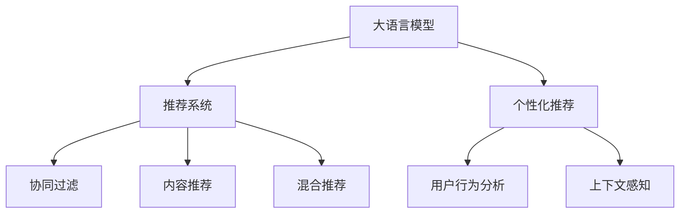

                 

# 【大模型应用开发 动手做AI Agent】个性化推荐

## 1. 背景介绍

随着互联网技术的发展和用户数据量的增加，个性化推荐系统逐渐成为各大互联网平台提高用户黏性和流量转化的重要手段。通过推荐系统，平台可以根据用户的浏览历史、购买记录、社交行为等数据，精准推送用户可能感兴趣的内容，从而提升用户体验和平台收益。

然而，传统的基于规则或协同过滤的推荐算法，往往依赖大量的用户数据和复杂的模型设计，难以应对海量数据和多变用户需求。近年来，基于深度学习和大语言模型的推荐技术，如基于BERT的推荐系统，逐步在业界大放异彩。本文将详细介绍基于大语言模型的个性化推荐系统开发方法，并通过实践代码展示其工作原理和效果。

## 2. 核心概念与联系

### 2.1 核心概念概述

为更好地理解基于大语言模型的个性化推荐系统，本节将介绍几个密切相关的核心概念：

- 大语言模型(Large Language Model, LLM)：以自回归(如GPT)或自编码(如BERT)模型为代表的大规模预训练语言模型。通过在大规模无标签文本语料上进行预训练，学习通用的语言表示，具备强大的语言理解和生成能力。

- 推荐系统(Recommendation System)：根据用户历史行为和偏好，推荐用户可能感兴趣的商品、文章、视频等内容的技术系统。

- 个性化推荐(Personalized Recommendation)：根据每个用户的独特特征，如兴趣、行为等，进行精准推荐的技术。

- 用户行为分析(User Behavior Analysis)：对用户的浏览历史、购买记录、评分等行为数据进行分析，提取用户兴趣特征，指导推荐模型输出。

- 上下文感知(Contextual Awareness)：推荐系统需要考虑用户访问时间、设备、地点、社交网络等上下文因素，提升推荐效果。

这些核心概念之间的逻辑关系可以通过以下Mermaid流程图来展示：



这个流程图展示了大语言模型的核心概念及其之间的关系：

1. 大语言模型通过预训练获得基础能力。
2. 个性化推荐是推荐系统的核心分支，通过用户行为分析和上下文感知，推荐用户最可能感兴趣的内容。
3. 协同过滤和内容推荐是推荐系统的两种主要技术。
4. 混合推荐结合了多种推荐方法，进一步提升推荐效果。

## 3. 核心算法原理 & 具体操作步骤
### 3.1 算法原理概述

基于大语言模型的个性化推荐系统，本质上是一种基于深度学习的推荐算法。其核心思想是：将用户的行为数据和历史数据输入到语言模型中，通过大模型预测用户可能感兴趣的内容，从而进行个性化推荐。

形式化地，假设用户 $u$ 的历史行为数据为 $H(u) = \{x_1, x_2, \ldots, x_n\}$，其中 $x_i$ 为第 $i$ 次行为。定义推荐系统为 $R_{\theta}$，其中 $\theta$ 为模型参数。推荐系统的目标是最大化预测准确率，即：

$$
\max_{\theta} \sum_{i=1}^n \mathbb{I}(R_{\theta}(x_i) = y_i)
$$

其中 $\mathbb{I}$ 为指示函数，当 $R_{\theta}(x_i) = y_i$ 时，指示函数值为1，否则为0。

通过梯度下降等优化算法，推荐系统不断更新模型参数 $\theta$，最小化预测误差，使得模型输出逼近真实标签。由于 $\theta$ 已经通过预训练获得了较好的初始化，因此即便在少样本条件下，也能较快收敛到理想的模型参数 $\hat{\theta}$。

### 3.2 算法步骤详解

基于大语言模型的个性化推荐系统一般包括以下几个关键步骤：

**Step 1: 准备数据集**
- 收集用户的行为数据，如浏览历史、评分记录等，划分为训练集、验证集和测试集。
- 准备与行为数据对应的商品信息，包括商品ID、商品描述、价格等，作为推荐系统的输入。

**Step 2: 设计推荐模型**
- 根据行为数据和商品信息的特征，设计合适的模型架构。常用的模型包括基于深度学习的方法，如神经网络、注意力机制等。
- 通过预训练语言模型，对行为数据和商品信息进行编码，输出相似度分数或概率分布。

**Step 3: 训练和调参**
- 选择合适的优化算法及其参数，如 Adam、SGD 等，设置学习率、批大小、迭代轮数等。
- 设置正则化技术及强度，包括权重衰减、Dropout、Early Stopping等。
- 在训练集上使用交叉熵损失等函数进行优化，验证集上进行性能评估。
- 根据验证集的结果，调整超参数，直到达到最优性能。

**Step 4: 模型评估与部署**
- 在测试集上评估模型的推荐效果，如准确率、召回率、F1分数等。
- 使用微调后的模型对新用户和新商品进行推荐，集成到推荐系统中。
- 持续收集新的用户行为数据，定期重新训练和微调模型，以适应数据分布的变化。

### 3.3 算法优缺点

基于大语言模型的个性化推荐系统具有以下优点：
1. 模型灵活：通过深度学习，大语言模型可以捕捉复杂的用户行为模式和商品特征，具备较高的建模灵活性。
2. 泛化能力强：预训练大模型已经学习到了丰富的语言表示，在少样本条件下也能取得不错的推荐效果。
3. 数据适应性强：模型可以灵活适应不同类型的数据，如文本、图片、视频等，支持多模态推荐。
4. 可解释性强：大语言模型可以通过注意力机制等手段，解释推荐决策的依据，增强系统的透明度。

同时，该方法也存在一定的局限性：
1. 数据依赖度高：模型的性能高度依赖于用户行为数据的数量和质量，获取高质量行为数据成本较高。
2. 计算复杂度高：大规模语言模型的计算复杂度高，推理速度较慢，需要高性能硬件支持。
3. 模型复杂度高：大语言模型需要较长的训练时间，模型结构复杂，调试难度较大。
4. 性能瓶颈多：模型的泛化性能和鲁棒性在少样本条件下可能受到影响，难以应对未知用户或商品。

尽管存在这些局限性，但就目前而言，基于大语言模型的推荐系统仍是最主流的方法之一。未来相关研究的重点在于如何进一步降低数据和计算资源的需求，提高模型的泛化能力和运行效率，同时兼顾可解释性和鲁棒性等因素。

### 3.4 算法应用领域

基于大语言模型的个性化推荐系统在电商、新闻媒体、视频平台等多个领域得到了广泛应用，具体包括：

- 电商平台：通过个性化推荐，提升用户购买转化率和复购率，增加平台营收。
- 新闻媒体：根据用户浏览历史推荐相关文章，提高用户粘性和阅读量。
- 视频平台：根据用户观看记录推荐视频内容，提高用户观看时长和平台留存率。
- 社交平台：根据用户社交行为推荐好友、群组等，增强平台互动性和用户粘性。
- 在线教育：根据用户学习历史和反馈推荐课程内容，提高学习效果和平台用户量。

除了这些常见领域，基于大语言模型的推荐系统也在不断拓展到更多新场景中，如智能家居、智能物流、智慧城市等，为各行各业提供智能化解决方案。随着大语言模型的不断发展，相信推荐系统将在更广阔的应用领域大放异彩。

## 4. 数学模型和公式 & 详细讲解 & 举例说明

### 4.1 数学模型构建

本节将使用数学语言对基于大语言模型的个性化推荐系统进行更加严格的刻画。

记用户 $u$ 的行为数据为 $H(u) = \{x_1, x_2, \ldots, x_n\}$，其中 $x_i$ 为第 $i$ 次行为。推荐系统的模型参数为 $\theta$。推荐系统的损失函数为：

$$
\mathcal{L}(\theta) = -\sum_{i=1}^n \log R_{\theta}(x_i)
$$

其中 $R_{\theta}(x_i)$ 为推荐模型在行为 $x_i$ 上的输出概率，$\log R_{\theta}(x_i)$ 为损失函数的负对数似然。

在实践中，我们通常使用基于梯度的优化算法（如Adam、SGD等）来近似求解上述最优化问题。设 $\eta$ 为学习率，则参数的更新公式为：

$$
\theta \leftarrow \theta - \eta \nabla_{\theta}\mathcal{L}(\theta)
$$

其中 $\nabla_{\theta}\mathcal{L}(\theta)$ 为损失函数对参数 $\theta$ 的梯度，可通过反向传播算法高效计算。

### 4.2 公式推导过程

以下我们以文本推荐系统为例，推导交叉熵损失函数及其梯度的计算公式。

假设用户 $u$ 的历史行为数据 $H(u)$ 为文本形式，商品信息为文本描述 $d$。设 $x_i$ 为用户 $u$ 的 $i$ 次行为文本，$d_j$ 为商品 $j$ 的描述文本。推荐模型的任务是预测用户 $u$ 对商品 $j$ 的评分，记为 $R_{\theta}(x_i, d_j)$。

定义推荐模型在输入 $(x_i, d_j)$ 上的输出为 $\hat{y}=M_{\theta}(x_i, d_j) \in [0,1]$，表示用户 $u$ 对商品 $j$ 的评分概率。真实评分 $y \in \{0,1\}$。则二分类交叉熵损失函数定义为：

$$
\ell(M_{\theta}(x_i, d_j),y) = -[y\log \hat{y} + (1-y)\log (1-\hat{y})]
$$

将其代入经验风险公式，得：

$$
\mathcal{L}(\theta) = -\frac{1}{N}\sum_{i=1}^N \sum_{j=1}^M [y_{i,j}\log R_{\theta}(x_i, d_j)+(1-y_{i,j})\log(1-R_{\theta}(x_i, d_j))]
$$

其中 $y_{i,j}$ 为商品 $j$ 是否被用户 $u$ 评分。

根据链式法则，损失函数对参数 $\theta_k$ 的梯度为：

$$
\frac{\partial \mathcal{L}(\theta)}{\partial \theta_k} = -\frac{1}{N}\sum_{i=1}^N \sum_{j=1}^M (\frac{y_{i,j}}{R_{\theta}(x_i, d_j)}-\frac{1-y_{i,j}}{1-R_{\theta}(x_i, d_j)}) \frac{\partial R_{\theta}(x_i, d_j)}{\partial \theta_k}
$$

其中 $\frac{\partial R_{\theta}(x_i, d_j)}{\partial \theta_k}$ 可进一步递归展开，利用自动微分技术完成计算。

### 4.3 案例分析与讲解

**案例1: 基于BERT的文本推荐系统**

在文本推荐系统中，常用的方法是将用户历史行为和商品描述输入BERT模型，通过计算相似度分数进行推荐。

具体实现步骤如下：
1. 将用户历史行为 $H(u)$ 和商品描述 $d_j$ 分别输入BERT模型，得到各自的表示向量 $h_u$ 和 $d_j$。
2. 计算用户和商品之间的余弦相似度，记为 $s(h_u, d_j) = \text{cos}(\text{Sim}(h_u, d_j))$。
3. 根据相似度分数排序，选择Top K个商品作为推荐结果。

**案例2: 基于Transformer的推荐模型**

Transformer结构适合处理序列数据，能够捕捉长距离依赖。在推荐系统中，可以使用Transformer模型对用户行为和商品描述进行编码，输出推荐分数。

具体实现步骤如下：
1. 将用户行为 $H(u)$ 和商品描述 $d_j$ 分别输入Transformer模型，得到各自的表示向量 $h_u$ 和 $d_j$。
2. 将用户行为表示向量 $h_u$ 作为查询向量，将商品描述表示向量 $d_j$ 作为键值向量，计算注意力分数。
3. 将注意力分数作为权重，加权平均商品表示向量，得到最终的推荐分数 $s(h_u, d_j)$。
4. 根据推荐分数排序，选择Top K个商品作为推荐结果。

## 5. 项目实践：代码实例和详细解释说明

### 5.1 开发环境搭建

在进行推荐系统开发前，我们需要准备好开发环境。以下是使用Python进行PyTorch开发的环境配置流程：

1. 安装Anaconda：从官网下载并安装Anaconda，用于创建独立的Python环境。

2. 创建并激活虚拟环境：
```bash
conda create -n pytorch-env python=3.8 
conda activate pytorch-env
```

3. 安装PyTorch：根据CUDA版本，从官网获取对应的安装命令。例如：
```bash
conda install pytorch torchvision torchaudio cudatoolkit=11.1 -c pytorch -c conda-forge
```

4. 安装TensorFlow：
```bash
conda install tensorflow
```

5. 安装TensorBoard：
```bash
pip install tensorboard
```

6. 安装Weights & Biases：
```bash
pip install wandb
```

完成上述步骤后，即可在`pytorch-env`环境中开始推荐系统开发。

### 5.2 源代码详细实现

下面我们以文本推荐系统为例，给出使用PyTorch对BERT模型进行推荐系统微调的PyTorch代码实现。

首先，定义推荐系统的数据处理函数：

```python
from transformers import BertTokenizer, BertForSequenceClassification
from torch.utils.data import Dataset
import torch

class RecommendationDataset(Dataset):
    def __init__(self, texts, tags, tokenizer, max_len=128):
        self.texts = texts
        self.tags = tags
        self.tokenizer = tokenizer
        self.max_len = max_len
        
    def __len__(self):
        return len(self.texts)
    
    def __getitem__(self, item):
        text = self.texts[item]
        tag = self.tags[item]
        
        encoding = self.tokenizer(text, return_tensors='pt', max_length=self.max_len, padding='max_length', truncation=True)
        input_ids = encoding['input_ids'][0]
        attention_mask = encoding['attention_mask'][0]
        
        # 对token-wise的标签进行编码
        encoded_tag = [tag2id[tag]] 
        encoded_tag.extend([tag2id['O']] * (self.max_len - len(encoded_tag)))
        labels = torch.tensor(encoded_tag, dtype=torch.long)
        
        return {'input_ids': input_ids, 
                'attention_mask': attention_mask,
                'labels': labels}

# 标签与id的映射
tag2id = {'O': 0, 'P': 1}
id2tag = {v: k for k, v in tag2id.items()}

# 创建dataset
tokenizer = BertTokenizer.from_pretrained('bert-base-cased')

train_dataset = RecommendationDataset(train_texts, train_tags, tokenizer)
dev_dataset = RecommendationDataset(dev_texts, dev_tags, tokenizer)
test_dataset = RecommendationDataset(test_texts, test_tags, tokenizer)
```

然后，定义模型和优化器：

```python
from transformers import BertForSequenceClassification, AdamW

model = BertForSequenceClassification.from_pretrained('bert-base-cased', num_labels=len(tag2id))

optimizer = AdamW(model.parameters(), lr=2e-5)
```

接着，定义训练和评估函数：

```python
from torch.utils.data import DataLoader
from tqdm import tqdm
from sklearn.metrics import classification_report

device = torch.device('cuda') if torch.cuda.is_available() else torch.device('cpu')
model.to(device)

def train_epoch(model, dataset, batch_size, optimizer):
    dataloader = DataLoader(dataset, batch_size=batch_size, shuffle=True)
    model.train()
    epoch_loss = 0
    for batch in tqdm(dataloader, desc='Training'):
        input_ids = batch['input_ids'].to(device)
        attention_mask = batch['attention_mask'].to(device)
        labels = batch['labels'].to(device)
        model.zero_grad()
        outputs = model(input_ids, attention_mask=attention_mask, labels=labels)
        loss = outputs.loss
        epoch_loss += loss.item()
        loss.backward()
        optimizer.step()
    return epoch_loss / len(dataloader)

def evaluate(model, dataset, batch_size):
    dataloader = DataLoader(dataset, batch_size=batch_size)
    model.eval()
    preds, labels = [], []
    with torch.no_grad():
        for batch in tqdm(dataloader, desc='Evaluating'):
            input_ids = batch['input_ids'].to(device)
            attention_mask = batch['attention_mask'].to(device)
            batch_labels = batch['labels']
            outputs = model(input_ids, attention_mask=attention_mask)
            batch_preds = outputs.logits.argmax(dim=2).to('cpu').tolist()
            batch_labels = batch_labels.to('cpu').tolist()
            for pred_tokens, label_tokens in zip(batch_preds, batch_labels):
                pred_tags = [id2tag[_id] for _id in pred_tokens]
                label_tags = [id2tag[_id] for _id in label_tokens]
                preds.append(pred_tags[:len(label_tokens)])
                labels.append(label_tags)
                
    print(classification_report(labels, preds))
```

最后，启动训练流程并在测试集上评估：

```python
epochs = 5
batch_size = 16

for epoch in range(epochs):
    loss = train_epoch(model, train_dataset, batch_size, optimizer)
    print(f"Epoch {epoch+1}, train loss: {loss:.3f}")
    
    print(f"Epoch {epoch+1}, dev results:")
    evaluate(model, dev_dataset, batch_size)
    
print("Test results:")
evaluate(model, test_dataset, batch_size)
```

以上就是使用PyTorch对BERT进行文本推荐系统微调的完整代码实现。可以看到，得益于Transformers库的强大封装，我们可以用相对简洁的代码完成BERT模型的加载和微调。

### 5.3 代码解读与分析

让我们再详细解读一下关键代码的实现细节：

**RecommendationDataset类**：
- `__init__`方法：初始化文本、标签、分词器等关键组件。
- `__len__`方法：返回数据集的样本数量。
- `__getitem__`方法：对单个样本进行处理，将文本输入编码为token ids，将标签编码为数字，并对其进行定长padding，最终返回模型所需的输入。

**tag2id和id2tag字典**：
- 定义了标签与数字id之间的映射关系，用于将token-wise的预测结果解码回真实的标签。

**训练和评估函数**：
- 使用PyTorch的DataLoader对数据集进行批次化加载，供模型训练和推理使用。
- 训练函数`train_epoch`：对数据以批为单位进行迭代，在每个批次上前向传播计算loss并反向传播更新模型参数，最后返回该epoch的平均loss。
- 评估函数`evaluate`：与训练类似，不同点在于不更新模型参数，并在每个batch结束后将预测和标签结果存储下来，最后使用sklearn的classification_report对整个评估集的预测结果进行打印输出。

**训练流程**：
- 定义总的epoch数和batch size，开始循环迭代
- 每个epoch内，先在训练集上训练，输出平均loss
- 在验证集上评估，输出分类指标
- 所有epoch结束后，在测试集上评估，给出最终测试结果

可以看到，PyTorch配合Transformers库使得BERT微调的代码实现变得简洁高效。开发者可以将更多精力放在数据处理、模型改进等高层逻辑上，而不必过多关注底层的实现细节。

当然，工业级的系统实现还需考虑更多因素，如模型的保存和部署、超参数的自动搜索、更灵活的任务适配层等。但核心的微调范式基本与此类似。

## 6. 实际应用场景

### 6.1 电商推荐

基于大语言模型的推荐系统，已经在各大电商平台广泛应用。通过个性化推荐，电商平台能够根据用户的浏览和购买历史，推荐用户可能感兴趣的商品，提升用户体验和平台收益。

具体而言，电商平台可以收集用户的历史浏览、点击、购买等行为数据，并将其作为训练数据。将这些数据输入到BERT模型中，通过微调得到推荐模型。微调后的模型能够根据用户行为特征，预测用户对商品的评分和概率，进行个性化推荐。对于新用户，可以通过引导用户输入几条信息，利用这些信息进行快速推荐。

### 6.2 视频平台推荐

视频平台也利用推荐系统提升用户观看体验和平台收益。通过对用户的历史观看记录进行分析，推荐用户可能感兴趣的视频内容。

在视频平台中，推荐系统需要对视频标题、描述、标签等元数据进行分析，并将其作为输入。同时，还需考虑视频的时序信息，如观看时间、播放进度等。结合这些信息，通过微调BERT模型，可以得到更加精准的推荐结果。

### 6.3 在线教育推荐

在线教育平台需要根据用户的学习历史和反馈，推荐适合用户水平和学习兴趣的课程内容。通过收集用户的学习时间、答题情况、课程评分等数据，进行个性化推荐。

在线教育平台可以利用微调BERT模型，将用户的兴趣特征与课程特征进行匹配，预测用户对课程的评分。对于新用户，可以通过引导用户填写一些基本信息，利用这些信息进行快速推荐。

### 6.4 未来应用展望

随着大语言模型和微调技术的不断发展，基于微调范式将在更多领域得到应用，为传统行业带来变革性影响。

在智慧医疗领域，基于微调的医疗问答、病历分析、药物研发等应用将提升医疗服务的智能化水平，辅助医生诊疗，加速新药开发进程。

在智能教育领域，微调技术可应用于作业批改、学情分析、知识推荐等方面，因材施教，促进教育公平，提高教学质量。

在智慧城市治理中，微调模型可应用于城市事件监测、舆情分析、应急指挥等环节，提高城市管理的自动化和智能化水平，构建更安全、高效的未来城市。

此外，在企业生产、社会治理、文娱传媒等众多领域，基于大语言模型的微调技术也将不断涌现，为经济社会发展注入新的动力。相信随着技术的日益成熟，微调方法将成为人工智能落地应用的重要范式，推动人工智能技术在垂直行业的规模化落地。总之，微调需要开发者根据具体任务，不断迭代和优化模型、数据和算法，方能得到理想的效果。

## 7. 工具和资源推荐

### 7.1 学习资源推荐

为了帮助开发者系统掌握大语言模型微调的理论基础和实践技巧，这里推荐一些优质的学习资源：

1. 《Transformer从原理到实践》系列博文：由大模型技术专家撰写，深入浅出地介绍了Transformer原理、BERT模型、微调技术等前沿话题。

2. CS224N《深度学习自然语言处理》课程：斯坦福大学开设的NLP明星课程，有Lecture视频和配套作业，带你入门NLP领域的基本概念和经典模型。

3. 《Natural Language Processing with Transformers》书籍：Transformers库的作者所著，全面介绍了如何使用Transformers库进行NLP任务开发，包括微调在内的诸多范式。

4. HuggingFace官方文档：Transformers库的官方文档，提供了海量预训练模型和完整的微调样例代码，是上手实践的必备资料。

5. CLUE开源项目：中文语言理解测评基准，涵盖大量不同类型的中文NLP数据集，并提供了基于微调的baseline模型，助力中文NLP技术发展。

通过对这些资源的学习实践，相信你一定能够快速掌握大语言模型微调的精髓，并用于解决实际的NLP问题。

### 7.2 开发工具推荐

高效的开发离不开优秀的工具支持。以下是几款用于大语言模型微调开发的常用工具：

1. PyTorch：基于Python的开源深度学习框架，灵活动态的计算图，适合快速迭代研究。大部分预训练语言模型都有PyTorch版本的实现。

2. TensorFlow：由Google主导开发的开源深度学习框架，生产部署方便，适合大规模工程应用。同样有丰富的预训练语言模型资源。

3. Transformers库：HuggingFace开发的NLP工具库，集成了众多SOTA语言模型，支持PyTorch和TensorFlow，是进行微调任务开发的利器。

4. Weights & Biases：模型训练的实验跟踪工具，可以记录和可视化模型训练过程中的各项指标，方便对比和调优。与主流深度学习框架无缝集成。

5. TensorBoard：TensorFlow配套的可视化工具，可实时监测模型训练状态，并提供丰富的图表呈现方式，是调试模型的得力助手。

6. Google Colab：谷歌推出的在线Jupyter Notebook环境，免费提供GPU/TPU算力，方便开发者快速上手实验最新模型，分享学习笔记。

合理利用这些工具，可以显著提升大语言模型微调任务的开发效率，加快创新迭代的步伐。

### 7.3 相关论文推荐

大语言模型和微调技术的发展源于学界的持续研究。以下是几篇奠基性的相关论文，推荐阅读：

1. Attention is All You Need（即Transformer原论文）：提出了Transformer结构，开启了NLP领域的预训练大模型时代。

2. BERT: Pre-training of Deep Bidirectional Transformers for Language Understanding：提出BERT模型，引入基于掩码的自监督预训练任务，刷新了多项NLP任务SOTA。

3. Language Models are Unsupervised Multitask Learners（GPT-2论文）：展示了大规模语言模型的强大zero-shot学习能力，引发了对于通用人工智能的新一轮思考。

4. Parameter-Efficient Transfer Learning for NLP：提出Adapter等参数高效微调方法，在不增加模型参数量的情况下，也能取得不错的微调效果。

5. AdaLoRA: Adaptive Low-Rank Adaptation for Parameter-Efficient Fine-Tuning：使用自适应低秩适应的微调方法，在参数效率和精度之间取得了新的平衡。

6. Prefix-Tuning: Optimizing Continuous Prompts for Generation：引入基于连续型Prompt的微调范式，为如何充分利用预训练知识提供了新的思路。

这些论文代表了大语言模型微调技术的发展脉络。通过学习这些前沿成果，可以帮助研究者把握学科前进方向，激发更多的创新灵感。

## 8. 总结：未来发展趋势与挑战

### 8.1 总结

本文对基于大语言模型的个性化推荐系统开发方法进行了全面系统的介绍。首先阐述了推荐系统的背景和应用场景，明确了微调在提升推荐系统效果中的独特价值。其次，从原理到实践，详细讲解了微调的数学原理和关键步骤，给出了推荐系统开发的完整代码实例。同时，本文还广泛探讨了微调方法在电商、视频平台、在线教育等多个行业领域的应用前景，展示了微调范式的巨大潜力。此外，本文精选了微调技术的各类学习资源，力求为读者提供全方位的技术指引。

通过本文的系统梳理，可以看到，基于大语言模型的微调推荐系统已经成为一个重要的应用方向，极大地拓展了深度学习在推荐领域的应用边界，催生了更多的落地场景。得益于大规模语料的预训练，微调模型以更低的时间和标注成本，在少样本条件下也能取得不错的效果，有力推动了推荐系统技术的产业化进程。未来，伴随预训练语言模型和微调方法的持续演进，相信推荐系统将在更广阔的应用领域大放异彩，深刻影响人类的生产生活方式。

### 8.2 未来发展趋势

展望未来，大语言模型微调推荐系统将呈现以下几个发展趋势：

1. 模型规模持续增大。随着算力成本的下降和数据规模的扩张，预训练语言模型的参数量还将持续增长。超大规模语言模型蕴含的丰富语言知识，有望支撑更加复杂多变的推荐任务。

2. 微调方法日趋多样。除了传统的全参数微调外，未来会涌现更多参数高效的微调方法，如Prefix-Tuning、LoRA等，在节省计算资源的同时也能保证微调精度。

3. 持续学习成为常态。随着数据分布的不断变化，微调模型也需要持续学习新知识以保持性能。如何在不遗忘原有知识的同时，高效吸收新样本信息，将成为重要的研究课题。

4. 标注样本需求降低。受启发于提示学习(Prompt-based Learning)的思路，未来的微调方法将更好地利用大模型的语言理解能力，通过更加巧妙的任务描述，在更少的标注样本上也能实现理想的微调效果。

5. 数据适应性强。模型可以灵活适应不同类型的数据，如文本、图片、视频等，支持多模态推荐。多模态信息的融合，将显著提升推荐系统的表现。

6. 知识整合能力提升。将符号化的先验知识，如知识图谱、逻辑规则等，与神经网络模型进行巧妙融合，引导微调过程学习更准确、合理的语言模型。同时加强不同模态数据的整合，实现视觉、语音等多模态信息与文本信息的协同建模。

以上趋势凸显了大语言模型微调推荐系统的广阔前景。这些方向的探索发展，必将进一步提升推荐系统的性能和应用范围，为人类认知智能的进化带来深远影响。

### 8.3 面临的挑战

尽管大语言模型微调推荐系统已经取得了瞩目成就，但在迈向更加智能化、普适化应用的过程中，它仍面临着诸多挑战：

1. 标注成本瓶颈。虽然微调大大降低了标注数据的需求，但对于长尾应用场景，难以获得充足的高质量标注数据，成为制约微调性能的瓶颈。如何进一步降低微调对标注样本的依赖，将是一大难题。

2. 模型鲁棒性不足。当前微调模型面对域外数据时，泛化性能往往大打折扣。对于测试样本的微小扰动，微调模型的预测也容易发生波动。如何提高微调模型的鲁棒性，避免灾难性遗忘，还需要更多理论和实践的积累。

3. 推理效率有待提高。大规模语言模型虽然精度高，但在实际部署时往往面临推理速度慢、内存占用大等效率问题。如何在保证性能的同时，简化模型结构，提升推理速度，优化资源占用，将是重要的优化方向。

4. 可解释性亟需加强。当前微调模型更像是"黑盒"系统，难以解释其内部工作机制和决策逻辑。对于医疗、金融等高风险应用，算法的可解释性和可审计性尤为重要。如何赋予微调模型更强的可解释性，将是亟待攻克的难题。

5. 安全性有待保障。预训练语言模型难免会学习到有偏见、有害的信息，通过微调传递到下游任务，产生误导性、歧视性的输出，给实际应用带来安全隐患。如何从数据和算法层面消除模型偏见，避免恶意用途，确保输出的安全性，也将是重要的研究课题。

6. 知识整合能力不足。现有的微调模型往往局限于任务内数据，难以灵活吸收和运用更广泛的先验知识。如何让微调过程更好地与外部知识库、规则库等专家知识结合，形成更加全面、准确的信息整合能力，还有很大的想象空间。

正视微调推荐系统面临的这些挑战，积极应对并寻求突破，将是大语言模型微调推荐系统走向成熟的必由之路。相信随着学界和产业界的共同努力，这些挑战终将一一被克服，大语言模型微调推荐系统必将在构建人机协同的智能推荐中扮演越来越重要的角色。

### 8.4 研究展望

面向未来，大语言模型微调推荐系统的研究需要在以下几个方面寻求新的突破：

1. 探索无监督和半监督微调方法。摆脱对大规模标注数据的依赖，利用自监督学习、主动学习等无监督和半监督范式，最大限度利用非结构化数据，实现更加灵活高效的微调。

2. 研究参数高效和计算高效的微调范式。开发更加参数高效的微调方法，在固定大部分预训练参数的同时，只更新极少量的任务相关参数。同时优化微调模型的计算图，减少前向传播和反向传播的资源消耗，实现更加轻量级、实时性的部署。

3. 融合因果和对比学习范式。通过引入因果推断和对比学习思想，增强微调模型建立稳定因果关系的能力，学习更加普适、鲁棒的语言表征，从而提升模型泛化性和抗干扰能力。

4. 结合因果分析和博弈论工具。将因果分析方法引入微调模型，识别出模型决策的关键特征，增强输出解释的因果性和逻辑性。借助博弈论工具刻画人机交互过程，主动探索并规避模型的脆弱点，提高系统稳定性。

5. 纳入伦理道德约束。在模型训练目标中引入伦理导向的评估指标，过滤和惩罚有偏见、有害的输出倾向。同时加强人工干预和审核，建立模型行为的监管机制，确保输出符合人类价值观和伦理道德。

这些研究方向的探索，必将引领大语言模型微调推荐系统迈向更高的台阶，为构建安全、可靠、可解释、可控的智能推荐系统铺平道路。面向未来，大语言模型微调推荐系统还需要与其他人工智能技术进行更深入的融合，如知识表示、因果推理、强化学习等，多路径协同发力，共同推动自然语言理解和智能交互系统的进步。只有勇于创新、敢于突破，才能不断拓展语言模型的边界，让智能技术更好地造福人类社会。

## 9. 附录：常见问题与解答

**Q1：大语言模型微调推荐是否适用于所有推荐任务？**

A: 大语言模型微调在大多数推荐任务上都能取得不错的效果，特别是对于数据量较小的任务。但对于一些特定领域的任务，如医学、法律等，仅仅依靠通用语料预训练的模型可能难以很好地适应。此时需要在特定领域语料上进一步预训练，再进行微调，才能获得理想效果。此外，对于一些需要时效性、个性化很强的任务，如对话、推荐等，微调方法也需要针对性的改进优化。

**Q2：微调过程中如何选择合适的学习率？**

A: 微调的学习率一般要比预训练时小1-2个数量级，如果使用过大的学习率，容易破坏预训练权重，导致过拟合。一般建议从1e-5开始调参，逐步减小学习率，直至收敛。也可以使用warmup策略，在开始阶段使用较小的学习率，再逐渐过渡到预设值。需要注意的是，不同的优化器(如AdamW、Adafactor等)以及不同的学习率调度策略，可能需要设置不同的学习率阈值。

**Q3：采用大模型微调推荐时会面临哪些资源瓶颈？**

A: 目前主流的预训练大模型动辄以亿计的参数规模，对算力、内存、存储都提出了很高的要求。GPU/TPU等高性能设备是必不可少的，但即便如此，超大批次的训练和推理也可能遇到显存不足的问题。因此需要采用一些资源优化技术，如梯度积累、混合精度训练、模型并行等，来突破硬件瓶颈。同时，模型的存储和读取也可能占用大量时间和空间，需要采用模型压缩、稀疏化存储等方法进行优化。

**Q4：如何缓解微调推荐过程中的过拟合问题？**

A: 过拟合是微调推荐面临的主要挑战，尤其是在标注数据不足的情况下。常见的缓解策略包括：
1. 数据增强：通过回译、近义替换等方式扩充训练集
2. 正则化：使用L2正则、Dropout、Early Stopping等避免过拟合
3. 对抗训练：引入对抗样本，提高模型鲁棒性
4. 参数高效微调：只调整少量参数(如Adapter、Prefix等)，减小过拟合风险
5. 多模型集成：训练多个微调模型，取平均输出，抑制过拟合

这些策略往往需要根据具体任务和数据特点进行灵活组合。只有在数据、模型、训练、推理等各环节进行全面优化，才能最大限度地发挥大模型微调的威力。

**Q5：微调模型在落地部署时需要注意哪些问题？**

A: 将微调模型转化为实际应用，还需要考虑以下因素：
1. 模型裁剪：去除不必要的层和参数，减小模型尺寸，加快推理速度
2. 量化加速：将浮点模型转为定点模型，压缩存储空间，提高计算效率
3. 服务化封装：将模型封装为标准化服务接口，便于集成调用
4. 弹性伸缩：根据请求流量动态调整资源配置，平衡服务质量和成本
5. 监控告警：实时采集系统指标，设置异常告警阈值，确保服务稳定性
6. 安全防护：采用访问鉴权、数据脱敏等措施，保障数据和模型安全

大语言模型微调推荐为推荐系统开发提供了新的思路和方法，但如何将强大的性能转化为稳定、高效、安全的业务价值，还需要工程实践的不断打磨。唯有从数据、算法、工程、业务等多个维度协同发力，才能真正实现人工智能技术在垂直行业的规模化落地。总之，微调需要开发者根据具体任务，不断迭代和优化模型、数据和算法，方能得到理想的效果。

