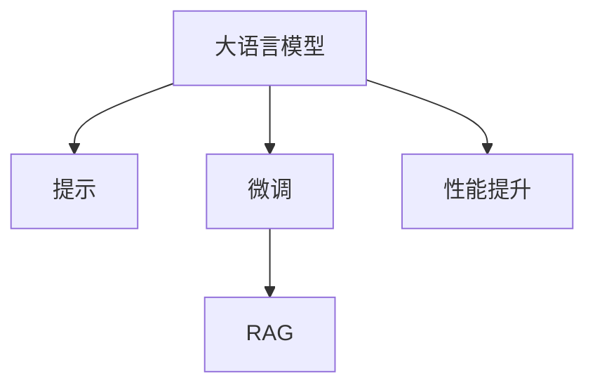

                 

## 1. 背景介绍

在当前AI开发中，大语言模型（LLM）的应用越来越广泛，这主要得益于它们在自然语言处理（NLP）任务中的出色表现。然而，实际应用中，大模型的性能往往受限于其对特定任务适配的准确性和鲁棒性。为解决这些问题，提示工程、RAG和微调成为了提高模型性能的关键技术。本文将深入探讨这些技术，并给出实例代码和详细解释。

## 2. 核心概念与联系

### 2.1 核心概念概述

- **大语言模型（LLM）**：如BERT、GPT-3等，通过自监督预训练和微调，具备了强大的语言理解和生成能力。
- **提示（Prompt）**：在模型输入中使用特殊的文本格式，指导模型执行特定任务。
- **提示工程（Prompt Engineering）**：设计合适的提示，引导模型输出期望的预测。
- **鲁棒性增强（Robustness Augmentation, RAG）**：通过数据增强和对抗样本生成，提升模型的鲁棒性和泛化能力。
- **微调（Fine-tuning）**：使用下游任务的少量标注数据，优化模型在该任务上的性能。

这些概念的逻辑关系可以通过以下Mermaid流程图来展示：



## 3. 核心算法原理 & 具体操作步骤

### 3.1 算法原理概述

提示工程和RAG通常结合微调使用，以提升模型在特定任务上的性能。其核心思想是：利用大模型在广泛数据上的预训练知识，通过精心设计的提示和数据增强，使模型能够更好地适应特定任务，同时通过微调进一步优化模型的表现。

具体流程如下：
1. **提示设计**：设计有针对性的提示，引导模型执行特定任务，如分类、匹配、生成等。
2. **数据增强**：通过回译、扰动、数据扩充等手段，增强训练集的多样性。
3. **微调**：在少量标注数据上，通过有监督的微调，优化模型在该任务上的性能。

### 3.2 算法步骤详解

**Step 1: 提示设计**
- 根据任务类型，设计合适的提示模板，如分类任务可以使用“请判断以下文本属于哪一类”，生成任务可以使用“请生成以下文本”。
- 提示设计需考虑格式、长度、上下文等因素，确保模型能够准确理解任务。

**Step 2: 数据增强**
- 对训练数据进行增强，如回译、扰动、混合、剪枝等，增加数据多样性。
- 利用对抗样本生成技术，增加模型对噪声、误导信息的抵抗力。

**Step 3: 微调**
- 选择合适的微调模型和优化器，如BERT、Adam等。
- 设计合适的损失函数，如交叉熵、余弦相似度等。
- 设定合适的超参数，如学习率、批大小、迭代轮数等。
- 执行梯度下降等优化算法，更新模型参数。

### 3.3 算法优缺点

提示工程和RAG结合微调的优点在于：
- 快速提升模型性能。利用大模型的预训练知识和提示设计，可以快速适配特定任务，提高性能。
- 减少标注数据需求。通过提示和数据增强，可以在少量标注数据下取得良好效果。
- 鲁棒性强。数据增强和对抗样本生成，提升模型对噪声、误导信息的抵抗力。

缺点在于：
- 提示设计复杂。提示设计需要经验和技巧，设计不当可能导致模型性能下降。
- 数据增强难度大。数据增强技术复杂，需要结合具体任务设计。
- 微调代价高。微调通常需要大量计算资源和标注数据。

### 3.4 算法应用领域

提示工程和RAG结合微调在多个领域中都有应用，如：
- 智能客服：通过提示和微调，使模型能够理解用户意图，提供自动化客户服务。
- 金融分析：利用提示和微调，对金融报告进行分类、情感分析等。
- 医疗诊断：通过提示和微调，对病历进行疾病分类、症状匹配等。
- 安全监控：利用提示和微调，对网络文本进行舆情分析、异常检测等。

## 4. 数学模型和公式 & 详细讲解

### 4.1 数学模型构建

假设提示工程和RAG结合微调的框架为：
\[ y = f(\theta, x, p) \]
其中，\( y \) 为模型输出，\( x \) 为输入数据，\( p \) 为提示模板，\( \theta \) 为模型参数。

**提示模板设计**：
- 分类任务：使用二元分类模板，如“请判断以下文本属于哪一类”。
- 生成任务：使用文本生成模板，如“请生成以下文本”。

**损失函数设计**：
- 分类任务：使用交叉熵损失函数，如 \( L = -\frac{1}{N} \sum_{i=1}^{N} y_i \log \hat{y}_i \)。
- 生成任务：使用负对数似然损失函数，如 \( L = -\frac{1}{N} \sum_{i=1}^{N} \log p(y_i | x_i) \)。

### 4.2 公式推导过程

以二分类任务为例，假设模型输入为 \( x \)，提示为 \( p \)，输出为 \( y \)，则交叉熵损失函数为：
\[ L = -\frac{1}{N} \sum_{i=1}^{N} (y_i \log \hat{y}_i + (1-y_i) \log (1-\hat{y}_i)) \]

### 4.3 案例分析与讲解

假设有一个分类任务，输入为文本 \( x \)，输出为标签 \( y \)，设计提示模板为“请判断以下文本属于哪一类”，模型使用交叉熵损失函数进行微调。

**Step 1: 数据准备**
- 准备标注数据集 \( D = \{(x_i, y_i)\}_{i=1}^N \)。
- 设计提示模板 \( p \)。

**Step 2: 提示工程**
- 将提示模板和文本 \( x \) 作为输入，模型输出预测结果 \( \hat{y} \)。

**Step 3: 微调**
- 使用交叉熵损失函数 \( L \) 计算模型输出与真实标签之间的差异。
- 通过梯度下降等优化算法更新模型参数 \( \theta \)。

## 5. 项目实践：代码实例和详细解释说明

### 5.1 开发环境搭建

1. **安装Python**：确保Python版本为3.7及以上，安装pip。
2. **安装PyTorch**：使用pip安装最新版本的PyTorch。
3. **安装HuggingFace Transformers**：使用pip安装最新版本的Transformers库。

### 5.2 源代码详细实现

以下是一个基于BERT进行情感分类的示例代码，展示提示工程和微调的过程：

```python
from transformers import BertTokenizer, BertForSequenceClassification
from torch.utils.data import DataLoader, Dataset
import torch

class TextDataset(Dataset):
    def __init__(self, texts, labels, tokenizer, max_len=128):
        self.texts = texts
        self.labels = labels
        self.tokenizer = tokenizer
        self.max_len = max_len

    def __len__(self):
        return len(self.texts)

    def __getitem__(self, idx):
        text = self.texts[idx]
        label = self.labels[idx]

        encoding = self.tokenizer(text, max_length=self.max_len, truncation=True, padding='max_length', return_tensors='pt')
        input_ids = encoding['input_ids']
        attention_mask = encoding['attention_mask']
        label = torch.tensor([label], dtype=torch.long)

        return {
            'input_ids': input_ids,
            'attention_mask': attention_mask,
            'labels': label
        }

tokenizer = BertTokenizer.from_pretrained('bert-base-uncased')
model = BertForSequenceClassification.from_pretrained('bert-base-uncased', num_labels=2)

# 提示模板设计
prompt = "请判断以下文本属于哪一类"

# 数据准备
train_data = TextDataset(train_texts, train_labels, tokenizer)
val_data = TextDataset(val_texts, val_labels, tokenizer)
test_data = TextDataset(test_texts, test_labels, tokenizer)

# 微调参数设置
optimizer = AdamW(model.parameters(), lr=2e-5)
epochs = 5
batch_size = 16

# 微调过程
for epoch in range(epochs):
    model.train()
    total_loss = 0
    for batch in DataLoader(train_data, batch_size=batch_size):
        inputs = {k: v.to(device) for k, v in batch.items()}
        outputs = model(**inputs)
        loss = outputs.loss
        total_loss += loss.item()
        optimizer.zero_grad()
        loss.backward()
        optimizer.step()

    epoch_loss = total_loss / len(train_data)
    print(f"Epoch {epoch+1}, train loss: {epoch_loss:.3f}")

    # 验证集评估
    model.eval()
    with torch.no_grad():
        total_loss = 0
        for batch in DataLoader(val_data, batch_size=batch_size):
            inputs = {k: v.to(device) for k, v in batch.items()}
            outputs = model(**inputs)
            loss = outputs.loss
            total_loss += loss.item()

    val_loss = total_loss / len(val_data)
    print(f"Epoch {epoch+1}, val loss: {val_loss:.3f}")

print("测试集结果：")
test_loss = 0
model.eval()
with torch.no_grad():
    for batch in DataLoader(test_data, batch_size=batch_size):
        inputs = {k: v.to(device) for k, v in batch.items()}
        outputs = model(**inputs)
        loss = outputs.loss
        test_loss += loss.item()

test_loss /= len(test_data)
print(f"测试集损失：{test_loss:.3f}")
```

### 5.3 代码解读与分析

1. **TextDataset类**：
   - 定义了数据集对象，将文本和标签进行tokenization并添加max_len、padding等操作。
   - 使用了PyTorch的DataLoader进行数据批处理，方便模型训练。

2. **模型和优化器**：
   - 使用BERT模型和AdamW优化器，分别设置学习率、批大小、迭代轮数。

3. **微调过程**：
   - 在训练集上进行前向传播和反向传播，计算损失函数并更新模型参数。
   - 在验证集上进行性能评估，检测模型泛化能力。

4. **测试集评估**：
   - 在测试集上进行性能评估，检验模型泛化能力。

## 6. 实际应用场景

### 6.1 智能客服

智能客服系统通过提示工程和RAG结合微调，使模型能够快速理解用户意图，提供精准的自动化服务。

### 6.2 金融舆情监测

在金融舆情监测中，通过提示工程和RAG结合微调，模型可以快速分析市场舆情，预测金融风险。

### 6.3 个性化推荐

个性化推荐系统通过提示工程和RAG结合微调，模型能够根据用户行为和文本信息，提供更精准的个性化推荐。

## 7. 工具和资源推荐

### 7.1 学习资源推荐

1. **《深度学习与自然语言处理》**：李航著，全面介绍NLP技术和应用。
2. **《自然语言处理综论》**：Yoav Goldberg著，涵盖NLP前沿研究和应用。
3. **《Transformers: Fairness, Interpretability, and Generalization》**：HuggingFace官方博客，介绍NLP模型公平性、可解释性等。

### 7.2 开发工具推荐

1. **PyTorch**：深度学习框架，提供丰富的模型库和工具。
2. **HuggingFace Transformers**：NLP领域最流行的开源库，提供预训练模型和微调框架。
3. **Jupyter Notebook**：交互式编程环境，方便数据处理和模型训练。

### 7.3 相关论文推荐

1. **《语言模型是无需监督的多任务学习者》**：Andrew Ng等人，提出语言模型的多任务学习框架。
2. **《基于训练数据的语言模型》**：Kaiming He等人，介绍基于训练数据的语言模型。
3. **《基于上下文的语言模型》**：Jurafsky等，介绍基于上下文的语言模型。

## 8. 总结：未来发展趋势与挑战

### 8.1 总结

提示工程、RAG和微调技术通过优化模型在特定任务上的性能，已经成为大语言模型应用的重要手段。本文详细介绍了这些技术的基本原理和操作步骤，并通过实例代码展示了其应用流程。

### 8.2 未来发展趋势

1. **技术融合**：未来将与其他AI技术，如因果推理、知识图谱等，进行更深入的融合，提升模型性能。
2. **自动化设计**：自动化提示设计和数据增强，减少人工干预，提高开发效率。
3. **跨领域迁移**：在更多领域进行微调，提升模型泛化能力。

### 8.3 面临的挑战

1. **数据获取难度**：高质量标注数据获取成本高，需要创新方法降低依赖。
2. **模型鲁棒性不足**：对噪声和对抗样本的抵抗力不足，需要进一步增强。
3. **计算资源需求高**：微调需要大量计算资源，需要优化模型结构，减少资源消耗。
4. **模型解释性差**：黑盒模型难以解释，需要提高模型的可解释性和可理解性。

### 8.4 研究展望

未来的研究需要在模型设计、数据获取、计算资源、模型解释等方面进行更多探索，提升模型的性能和可解释性，推动NLP技术的广泛应用。

## 9. 附录：常见问题与解答

**Q1: 大语言模型微调的优势是什么？**

A: 大语言模型微调的优势在于：
1. 快速提升模型性能。利用大模型的预训练知识，通过提示设计和数据增强，可以在少量标注数据下取得良好效果。
2. 减少标注数据需求。通过提示工程和RAG，可以在更少的数据下进行微调。
3. 模型鲁棒性强。数据增强和对抗样本生成，提高模型对噪声和对抗样本的抵抗力。

**Q2: 微调过程中如何避免过拟合？**

A: 微调过程中避免过拟合的方法包括：
1. 数据增强：通过回译、扰动、数据扩充等手段，增加数据多样性。
2. 正则化：使用L2正则、Dropout、Early Stopping等技术。
3. 对抗训练：引入对抗样本，提高模型鲁棒性。
4. 参数高效微调：只调整少量参数，减少过拟合风险。

**Q3: 提示工程和RAG结合微调需要注意哪些问题？**

A: 提示工程和RAG结合微调需要注意的问题包括：
1. 提示设计需要经验和技巧，设计不当可能导致模型性能下降。
2. 数据增强技术复杂，需要结合具体任务设计。
3. 微调通常需要大量计算资源和标注数据，需要优化模型结构，减少资源消耗。

**Q4: 提示工程和RAG结合微调的实际应用场景有哪些？**

A: 提示工程和RAG结合微调的实际应用场景包括：
1. 智能客服：通过提示和微调，使模型能够理解用户意图，提供自动化客户服务。
2. 金融分析：利用提示和微调，对金融报告进行分类、情感分析等。
3. 医疗诊断：通过提示和微调，对病历进行疾病分类、症状匹配等。
4. 安全监控：利用提示和微调，对网络文本进行舆情分析、异常检测等。

**Q5: 如何提高提示工程和RAG结合微调的效率？**

A: 提高提示工程和RAG结合微调的效率的方法包括：
1. 自动化提示设计：使用自动化提示生成工具，减少人工干预。
2. 模型优化：使用更高效的模型结构，如Transformer模型。
3. 数据预处理：优化数据预处理流程，提高数据利用率。

作者：禅与计算机程序设计艺术 / Zen and the Art of Computer Programming

