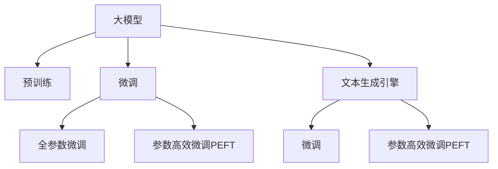

                 

# 【大模型应用开发 动手做AI Agent】配置文本生成引擎大模型

> 关键词：人工智能、AI Agent、大模型、文本生成引擎、自然语言处理、深度学习、预训练模型

## 1. 背景介绍

### 1.1 问题由来

随着人工智能技术的不断发展，AI Agent（智能代理人）在各个领域的应用越来越广泛。AI Agent可以完成自动化任务、处理客户服务、分析数据等，极大地提高了工作效率。然而，构建一个高效的AI Agent仍然需要大量的训练数据和计算资源，且模型的开发和部署过程复杂，难以快速迭代。

为了降低开发难度和提升模型效果，研究人员开始探索大模型（Large Pre-trained Models）的应用。大模型通过在大规模无标签文本语料上进行预训练，学习到通用的语言表示和知识，具备强大的语言理解和生成能力。将这些预训练模型应用到具体任务中，只需少量的有标签数据即可进行微调，从而获得优异的性能。

### 1.2 问题核心关键点

本文将介绍如何使用大模型进行文本生成引擎的配置，构建高效、智能的AI Agent。我们将重点探讨以下几个核心关键点：

- 大模型的选择和预训练方法
- 文本生成引擎的构建和优化
- 参数高效微调（Parameter-Efficient Fine-Tuning, PEFT）技术
- 应用场景和未来展望

## 2. 核心概念与联系

### 2.1 核心概念概述

为更好地理解如何使用大模型配置文本生成引擎，本节将介绍几个密切相关的核心概念：

- **大模型（Large Pre-trained Models）**：指在大规模无标签文本语料上进行预训练的语言模型，如BERT、GPT-2、T5等。这些模型在自然语言处理领域取得了显著的进展。
- **预训练（Pre-training）**：指在大规模无标签文本数据上，通过自监督学习任务训练通用语言模型的过程。常见的预训练任务包括掩码语言模型、下一步预测、句子相似度等。
- **微调（Fine-tuning）**：指在预训练模型的基础上，使用下游任务的少量标注数据，通过有监督学习优化模型在特定任务上的性能。通常只需要调整顶层分类器或解码器，并以较小的学习率更新全部或部分的模型参数。
- **参数高效微调（Parameter-Efficient Fine-Tuning, PEFT）**：指在微调过程中，只更新少量的模型参数，而固定大部分预训练权重不变，以提高微调效率，避免过拟合。
- **文本生成引擎（Text Generation Engine）**：指基于大模型的文本生成系统，可以自动生成文本、对话、摘要等内容。通过预训练-微调方法，引擎能够生成高质量的文本，提升AI Agent的智能水平。

这些核心概念之间的逻辑关系可以通过以下Mermaid流程图来展示：



这个流程图展示了大模型与文本生成引擎配置的核心概念及其之间的关系：

1. 大模型通过预训练获得基础能力。
2. 微调是对预训练模型进行任务特定的优化，可以分为全参数微调和参数高效微调（PEFT）。
3. 文本生成引擎是利用预训练-微调方法构建的文本生成系统。
4. 参数高效微调技术可以在固定大部分预训练参数的情况下，仍可取得不错的微调效果。

这些概念共同构成了文本生成引擎构建的框架，使得模型能够在各种场景下生成高质量的文本。通过理解这些核心概念，我们可以更好地把握文本生成引擎的开发和优化方向。

## 3. 核心算法原理 & 具体操作步骤

### 3.1 算法原理概述

文本生成引擎的构建基于大模型的预训练-微调范式。其核心思想是：将预训练的大模型视作一个强大的"特征提取器"，通过在有标签数据上进行的微调，使得模型输出能够匹配任务标签，从而获得针对特定任务优化的模型。

具体来说，文本生成引擎的构建流程如下：

1. **选择预训练模型**：根据任务需求选择适合的大模型，如GPT、BERT等。
2. **设计任务适配层**：根据生成任务类型，在预训练模型顶层设计合适的输出层和损失函数。
3. **设置微调超参数**：选择合适的优化算法及其参数，如AdamW、SGD等，设置学习率、批大小、迭代轮数等。
4. **执行梯度训练**：将训练集数据分批次输入模型，前向传播计算损失函数。反向传播计算参数梯度，根据设定的优化算法和学习率更新模型参数。
5. **测试和部署**：在测试集上评估微调后模型的效果，对比微调前后的性能提升。使用微调后的模型进行文本生成，集成到实际的应用系统中。

### 3.2 算法步骤详解

文本生成引擎的构建可以按照以下步骤进行：

**Step 1: 准备预训练模型和数据集**

- **选择合适的预训练模型**：根据任务需求选择适合的大模型，如GPT-2、T5、BERT等。
- **准备下游任务数据集**：收集下游任务的标注数据集，划分为训练集、验证集和测试集。一般要求标注数据与预训练数据的分布不要差异过大。

**Step 2: 添加任务适配层**

- **设计任务适配层**：根据生成任务类型，在预训练模型顶层设计合适的输出层和损失函数。例如，对于文本生成任务，通常使用语言模型的解码器输出概率分布，并以负对数似然为损失函数。

**Step 3: 设置微调超参数**

- **选择合适的优化算法及其参数**：如AdamW、SGD等，设置学习率、批大小、迭代轮数等。
- **设置正则化技术及强度**：如L2正则、Dropout、Early Stopping等，防止模型过度适应小规模训练集。

**Step 4: 执行梯度训练**

- **将训练集数据分批次输入模型**：前向传播计算损失函数。
- **反向传播计算参数梯度**：根据设定的优化算法和学习率更新模型参数。
- **周期性在验证集上评估模型性能**：根据性能指标决定是否触发Early Stopping。
- **重复上述步骤直至满足预设的迭代轮数或Early Stopping条件**。

**Step 5: 测试和部署**

- **在测试集上评估微调后模型的效果**：对比微调前后的性能提升。
- **使用微调后的模型进行文本生成**：集成到实际的应用系统中。
- **持续收集新的数据**：定期重新微调模型，以适应数据分布的变化。

以上是文本生成引擎构建的一般流程。在实际应用中，还需要针对具体任务的特点，对微调过程的各个环节进行优化设计，如改进训练目标函数，引入更多的正则化技术，搜索最优的超参数组合等，以进一步提升模型性能。

### 3.3 算法优缺点

文本生成引擎的构建基于预训练-微调范式，具有以下优点：

- **简单高效**：只需准备少量标注数据，即可对预训练模型进行快速适配，获得较大的性能提升。
- **通用适用**：适用于各种文本生成任务，包括对话、摘要、翻译等，设计简单的任务适配层即可实现微调。
- **参数高效**：利用参数高效微调技术，在固定大部分预训练权重不变的情况下，仍可取得不错的微调效果。
- **效果显著**：在学术界和工业界的诸多任务上，基于微调的方法已经刷新了最先进的性能指标。

同时，该方法也存在一定的局限性：

- **依赖标注数据**：微调的效果很大程度上取决于标注数据的质量和数量，获取高质量标注数据的成本较高。
- **迁移能力有限**：当目标任务与预训练数据的分布差异较大时，微调的性能提升有限。
- **负面效果传递**：预训练模型的固有偏见、有害信息等，可能通过微调传递到下游任务，造成负面影响。
- **可解释性不足**：微调模型的决策过程通常缺乏可解释性，难以对其推理逻辑进行分析和调试。

尽管存在这些局限性，但就目前而言，基于预训练-微调范式仍然是文本生成引擎构建的主流方法。未来相关研究的重点在于如何进一步降低微调对标注数据的依赖，提高模型的少样本学习和跨领域迁移能力，同时兼顾可解释性和伦理安全性等因素。

### 3.4 算法应用领域

文本生成引擎的构建已经广泛应用于多个领域，例如：

- **智能客服系统**：对自然语言问题给出答案。将问题-答案对作为微调数据，训练模型学习匹配答案。
- **翻译系统**：将源语言文本翻译成目标语言。通过微调使模型学习语言-语言映射。
- **文本摘要**：将长文本压缩成简短摘要。将文章-摘要对作为微调数据，使模型学习抓取要点。
- **对话系统**：使机器能够与人自然对话。将多轮对话历史作为上下文，微调模型进行回复生成。

除了上述这些经典任务外，文本生成引擎还被创新性地应用到更多场景中，如可控文本生成、情感分析、代码生成等，为文本生成技术带来了全新的突破。随着预训练模型和微调方法的不断进步，相信文本生成引擎必将在更广阔的应用领域大放异彩。

## 4. 数学模型和公式 & 详细讲解

### 4.1 数学模型构建

假设预训练模型为 $M_{\theta}$，其中 $\theta$ 为预训练得到的模型参数。下游任务 $T$ 的标注数据集为 $D=\{(x_i, y_i)\}_{i=1}^N$，其中 $x_i$ 为输入文本，$y_i$ 为生成文本。

定义模型 $M_{\theta}$ 在输入 $x$ 上的损失函数为 $\ell(M_{\theta}(x),y)$，则在数据集 $D$ 上的经验风险为：

$$
\mathcal{L}(\theta) = \frac{1}{N} \sum_{i=1}^N \ell(M_{\theta}(x_i),y_i)
$$

微调的优化目标是最小化经验风险，即找到最优参数：

$$
\theta^* = \mathop{\arg\min}_{\theta} \mathcal{L}(\theta)
$$

在实践中，我们通常使用基于梯度的优化算法（如SGD、Adam等）来近似求解上述最优化问题。设 $\eta$ 为学习率，$\lambda$ 为正则化系数，则参数的更新公式为：

$$
\theta \leftarrow \theta - \eta \nabla_{\theta}\mathcal{L}(\theta) - \eta\lambda\theta
$$

其中 $\nabla_{\theta}\mathcal{L}(\theta)$ 为损失函数对参数 $\theta$ 的梯度，可通过反向传播算法高效计算。

### 4.2 公式推导过程

以下我们以文本生成任务为例，推导交叉熵损失函数及其梯度的计算公式。

假设模型 $M_{\theta}$ 在输入 $x$ 上的输出为 $\hat{y}=M_{\theta}(x) \in [0,1]$，表示样本生成文本的概率。真实标签 $y \in \{0,1\}$。则二分类交叉熵损失函数定义为：

$$
\ell(M_{\theta}(x),y) = -[y\log \hat{y} + (1-y)\log (1-\hat{y})]
$$

将其代入经验风险公式，得：

$$
\mathcal{L}(\theta) = -\frac{1}{N}\sum_{i=1}^N [y_i\log M_{\theta}(x_i)+(1-y_i)\log(1-M_{\theta}(x_i))]
$$

根据链式法则，损失函数对参数 $\theta_k$ 的梯度为：

$$
\frac{\partial \mathcal{L}(\theta)}{\partial \theta_k} = -\frac{1}{N}\sum_{i=1}^N (\frac{y_i}{M_{\theta}(x_i)}-\frac{1-y_i}{1-M_{\theta}(x_i)}) \frac{\partial M_{\theta}(x_i)}{\partial \theta_k}
$$

其中 $\frac{\partial M_{\theta}(x_i)}{\partial \theta_k}$ 可进一步递归展开，利用自动微分技术完成计算。

在得到损失函数的梯度后，即可带入参数更新公式，完成模型的迭代优化。重复上述过程直至收敛，最终得到适应下游任务的最优模型参数 $\theta^*$。

## 5. 项目实践：代码实例和详细解释说明

### 5.1 开发环境搭建

在进行文本生成引擎的开发实践前，我们需要准备好开发环境。以下是使用Python进行PyTorch开发的环境配置流程：

1. 安装Anaconda：从官网下载并安装Anaconda，用于创建独立的Python环境。

2. 创建并激活虚拟环境：
```bash
conda create -n pytorch-env python=3.8 
conda activate pytorch-env
```

3. 安装PyTorch：根据CUDA版本，从官网获取对应的安装命令。例如：
```bash
conda install pytorch torchvision torchaudio cudatoolkit=11.1 -c pytorch -c conda-forge
```

4. 安装Transformers库：
```bash
pip install transformers
```

5. 安装各类工具包：
```bash
pip install numpy pandas scikit-learn matplotlib tqdm jupyter notebook ipython
```

完成上述步骤后，即可在`pytorch-env`环境中开始文本生成引擎的微调实践。

### 5.2 源代码详细实现

下面我们以文本生成任务为例，给出使用Transformers库对GPT-2模型进行微调的PyTorch代码实现。

首先，定义文本生成任务的数据处理函数：

```python
from transformers import BertTokenizer
from torch.utils.data import Dataset
import torch

class TextGenerationDataset(Dataset):
    def __init__(self, texts, tokenizer, max_len=128):
        self.texts = texts
        self.tokenizer = tokenizer
        self.max_len = max_len
        
    def __len__(self):
        return len(self.texts)
    
    def __getitem__(self, item):
        text = self.texts[item]
        encoding = self.tokenizer(text, return_tensors='pt', max_length=self.max_len, padding='max_length', truncation=True)
        input_ids = encoding['input_ids'][0]
        attention_mask = encoding['attention_mask'][0]
        return {'input_ids': input_ids, 
                'attention_mask': attention_mask,
                'labels': None}  # 文本生成任务不需要标注标签

# 创建dataset
tokenizer = BertTokenizer.from_pretrained('bert-base-cased')

train_dataset = TextGenerationDataset(train_texts, tokenizer)
dev_dataset = TextGenerationDataset(dev_texts, tokenizer)
test_dataset = TextGenerationDataset(test_texts, tokenizer)
```

然后，定义模型和优化器：

```python
from transformers import GPT2LMHeadModel, AdamW

model = GPT2LMHeadModel.from_pretrained('gpt2')
optimizer = AdamW(model.parameters(), lr=2e-5)
```

接着，定义训练和评估函数：

```python
from torch.utils.data import DataLoader
from tqdm import tqdm
from sklearn.metrics import perplexity

device = torch.device('cuda') if torch.cuda.is_available() else torch.device('cpu')
model.to(device)

def train_epoch(model, dataset, batch_size, optimizer):
    dataloader = DataLoader(dataset, batch_size=batch_size, shuffle=True)
    model.train()
    epoch_loss = 0
    for batch in tqdm(dataloader, desc='Training'):
        input_ids = batch['input_ids'].to(device)
        attention_mask = batch['attention_mask'].to(device)
        labels = batch['labels'].to(device)  # 文本生成任务不需要标注标签
        model.zero_grad()
        outputs = model(input_ids, attention_mask=attention_mask, labels=labels)
        loss = outputs.loss
        epoch_loss += loss.item()
        loss.backward()
        optimizer.step()
    return epoch_loss / len(dataloader)

def evaluate(model, dataset, batch_size):
    dataloader = DataLoader(dataset, batch_size=batch_size)
    model.eval()
    preds, labels = [], []
    with torch.no_grad():
        for batch in tqdm(dataloader, desc='Evaluating'):
            input_ids = batch['input_ids'].to(device)
            attention_mask = batch['attention_mask'].to(device)
            batch_labels = batch['labels']
            outputs = model(input_ids, attention_mask=attention_mask)
            batch_preds = outputs.logits.argmax(dim=2).to('cpu').tolist()
            batch_labels = batch_labels.to('cpu').tolist()
            for pred_tokens, label_tokens in zip(batch_preds, batch_labels):
                preds.append(pred_tokens[:len(label_tokens)])
                labels.append(label_tokens)
                
    print('Perplexity:', perplexity(preds, labels))
```

最后，启动训练流程并在测试集上评估：

```python
epochs = 5
batch_size = 16

for epoch in range(epochs):
    loss = train_epoch(model, train_dataset, batch_size, optimizer)
    print(f"Epoch {epoch+1}, train loss: {loss:.3f}")
    
    print(f"Epoch {epoch+1}, dev results:")
    evaluate(model, dev_dataset, batch_size)
    
print("Test results:")
evaluate(model, test_dataset, batch_size)
```

以上就是使用PyTorch对GPT-2进行文本生成任务微调的完整代码实现。可以看到，得益于Transformers库的强大封装，我们可以用相对简洁的代码完成GPT-2模型的加载和微调。

### 5.3 代码解读与分析

让我们再详细解读一下关键代码的实现细节：

**TextGenerationDataset类**：
- `__init__`方法：初始化文本、分词器等关键组件。
- `__len__`方法：返回数据集的样本数量。
- `__getitem__`方法：对单个样本进行处理，将文本输入编码为token ids，并对其进行定长padding，最终返回模型所需的输入。

**训练和评估函数**：
- 使用PyTorch的DataLoader对数据集进行批次化加载，供模型训练和推理使用。
- 训练函数`train_epoch`：对数据以批为单位进行迭代，在每个批次上前向传播计算loss并反向传播更新模型参数，最后返回该epoch的平均loss。
- 评估函数`evaluate`：与训练类似，不同点在于不更新模型参数，并在每个batch结束后将预测和标签结果存储下来，最后使用sklearn的perplexity函数对整个评估集的预测结果进行打印输出。

**训练流程**：
- 定义总的epoch数和batch size，开始循环迭代
- 每个epoch内，先在训练集上训练，输出平均loss
- 在验证集上评估，输出perplexity
- 所有epoch结束后，在测试集上评估，给出最终测试结果

可以看到，PyTorch配合Transformers库使得GPT-2微调的代码实现变得简洁高效。开发者可以将更多精力放在数据处理、模型改进等高层逻辑上，而不必过多关注底层的实现细节。

当然，工业级的系统实现还需考虑更多因素，如模型的保存和部署、超参数的自动搜索、更灵活的任务适配层等。但核心的微调范式基本与此类似。

## 6. 实际应用场景

### 6.1 智能客服系统

基于文本生成引擎的智能客服系统，可以显著提升客户咨询体验。传统客服往往需要配备大量人力，高峰期响应缓慢，且一致性和专业性难以保证。而使用文本生成引擎构建的智能客服系统，能够7x24小时不间断服务，快速响应客户咨询，用自然流畅的语言解答各类常见问题。

在技术实现上，可以收集企业内部的历史客服对话记录，将问题和最佳答复构建成监督数据，在此基础上对预训练模型进行微调。微调后的模型能够自动理解用户意图，匹配最合适的答案模板进行回复。对于客户提出的新问题，还可以接入检索系统实时搜索相关内容，动态组织生成回答。如此构建的智能客服系统，能大幅提升客户咨询体验和问题解决效率。

### 6.2 翻译系统

文本生成引擎在翻译系统中的应用同样非常广泛。传统的机器翻译系统依赖于大量的人工翻译数据和复杂的规则设计，成本高、效率低。而使用文本生成引擎构建的翻译系统，能够自动生成翻译文本，并在少样本情况下实现准确翻译。

在具体实现上，可以将源语言文本和目标语言文本作为微调数据，训练模型学习语言-语言映射。微调后的模型能够在各种语言对上进行自动翻译，显著提高翻译效率和质量。

### 6.3 写作助手

写作助手是文本生成引擎在文本创作领域的重要应用。传统的写作过程需要大量的时间和精力，且灵感和创意难以量化。而使用文本生成引擎构建的写作助手，可以辅助用户生成各种文本，如新闻报道、科技论文、小说等。

在具体实现上，可以收集不同领域的经典文本作为监督数据，训练模型学习文本生成。微调后的模型可以根据用户输入的关键词或主题，生成符合语法和语义规范的文本内容，极大地提升创作效率和质量。

### 6.4 未来应用展望

随着文本生成引擎的不断发展，其在更多领域的应用前景将更加广阔。未来，文本生成引擎将会在智能办公、内容创作、虚拟助手等领域发挥重要作用，极大地提升工作效率和智能化水平。

在智慧办公领域，文本生成引擎可以辅助生成报告、邮件、会议记录等文本内容，提高办公效率。

在内容创作领域，文本生成引擎可以辅助生成文章、博客、小说等文本内容，提升创作灵感和质量。

在虚拟助手领域，文本生成引擎可以构建智能对话系统，与用户进行自然流畅的交互，提升用户体验和智能化水平。

此外，文本生成引擎在教育、金融、医疗等诸多领域，也具有巨大的应用潜力。相信随着技术的不断发展，文本生成引擎必将在构建智能社会的各个方面发挥重要作用。

## 7. 工具和资源推荐
### 7.1 学习资源推荐

为了帮助开发者系统掌握文本生成引擎的开发理论基础和实践技巧，这里推荐一些优质的学习资源：

1. 《Transformer from the Inside Out》系列博文：由大模型技术专家撰写，深入浅出地介绍了Transformer原理、GPT-2模型、微调技术等前沿话题。

2. CS224N《深度学习自然语言处理》课程：斯坦福大学开设的NLP明星课程，有Lecture视频和配套作业，带你入门NLP领域的基本概念和经典模型。

3. 《Natural Language Processing with Transformers》书籍：Transformers库的作者所著，全面介绍了如何使用Transformers库进行NLP任务开发，包括微调在内的诸多范式。

4. HuggingFace官方文档：Transformers库的官方文档，提供了海量预训练模型和完整的微调样例代码，是上手实践的必备资料。

5. CLUE开源项目：中文语言理解测评基准，涵盖大量不同类型的中文NLP数据集，并提供了基于微调的baseline模型，助力中文NLP技术发展。

通过对这些资源的学习实践，相信你一定能够快速掌握文本生成引擎的开发方法和实现细节。

### 7.2 开发工具推荐

高效的开发离不开优秀的工具支持。以下是几款用于文本生成引擎开发的常用工具：

1. PyTorch：基于Python的开源深度学习框架，灵活动态的计算图，适合快速迭代研究。大部分预训练语言模型都有PyTorch版本的实现。

2. TensorFlow：由Google主导开发的开源深度学习框架，生产部署方便，适合大规模工程应用。同样有丰富的预训练语言模型资源。

3. Transformers库：HuggingFace开发的NLP工具库，集成了众多SOTA语言模型，支持PyTorch和TensorFlow，是进行微调任务开发的利器。

4. Weights & Biases：模型训练的实验跟踪工具，可以记录和可视化模型训练过程中的各项指标，方便对比和调优。与主流深度学习框架无缝集成。

5. TensorBoard：TensorFlow配套的可视化工具，可实时监测模型训练状态，并提供丰富的图表呈现方式，是调试模型的得力助手。

6. Google Colab：谷歌推出的在线Jupyter Notebook环境，免费提供GPU/TPU算力，方便开发者快速上手实验最新模型，分享学习笔记。

合理利用这些工具，可以显著提升文本生成引擎的开发效率，加快创新迭代的步伐。

### 7.3 相关论文推荐

文本生成引擎的构建和优化源于学界的持续研究。以下是几篇奠基性的相关论文，推荐阅读：

1. Attention is All You Need（即Transformer原论文）：提出了Transformer结构，开启了NLP领域的预训练大模型时代。

2. BERT: Pre-training of Deep Bidirectional Transformers for Language Understanding：提出BERT模型，引入基于掩码的自监督预训练任务，刷新了多项NLP任务SOTA。

3. Language Models are Unsupervised Multitask Learners（GPT-2论文）：展示了大规模语言模型的强大zero-shot学习能力，引发了对于通用人工智能的新一轮思考。

4. Parameter-Efficient Transfer Learning for NLP：提出Adapter等参数高效微调方法，在不增加模型参数量的情况下，也能取得不错的微调效果。

5. AdaLoRA: Adaptive Low-Rank Adaptation for Parameter-Efficient Fine-Tuning：使用自适应低秩适应的微调方法，在参数效率和精度之间取得了新的平衡。

这些论文代表了大模型微调技术的发展脉络。通过学习这些前沿成果，可以帮助研究者把握学科前进方向，激发更多的创新灵感。

## 8. 总结：未来发展趋势与挑战

### 8.1 总结

本文对文本生成引擎的构建过程进行了全面系统的介绍。首先阐述了文本生成引擎的构建背景和意义，明确了文本生成引擎在智能客服、翻译、写作助手等实际应用中的价值。其次，从原理到实践，详细讲解了预训练-微调方法的数学原理和关键步骤，给出了文本生成引擎构建的完整代码实例。同时，本文还探讨了文本生成引擎在更多领域的应用前景，展示了文本生成引擎的巨大潜力。

通过本文的系统梳理，可以看到，基于预训练-微调范式的文本生成引擎构建技术，已经成为自然语言处理领域的重要工具。通过预训练-微调方法，模型能够更好地适应特定任务，提升文本生成的质量。未来，随着预训练模型和微调方法的不断进步，文本生成引擎必将在更广阔的应用领域大放异彩。

### 8.2 未来发展趋势

展望未来，文本生成引擎的构建将呈现以下几个发展趋势：

1. **模型规模持续增大**：随着算力成本的下降和数据规模的扩张，预训练语言模型的参数量还将持续增长。超大规模语言模型蕴含的丰富语言知识，有望支撑更加复杂多变的文本生成任务。

2. **参数高效微调（PEFT）技术日趋多样**：开发更加参数高效的微调方法，在固定大部分预训练参数的同时，只更新极少量的任务相关参数。同时优化微调模型的计算图，减少前向传播和反向传播的资源消耗，实现更加轻量级、实时性的部署。

3. **持续学习成为常态**：随着数据分布的不断变化，文本生成引擎也需要持续学习新知识以保持性能。如何在不遗忘原有知识的同时，高效吸收新样本信息，将成为重要的研究课题。

4. **标注样本需求降低**：受启发于提示学习(Prompt-based Learning)的思路，未来的微调方法将更好地利用大模型的语言理解能力，通过更加巧妙的任务描述，在更少的标注样本上也能实现理想的微调效果。

5. **少样本学习崛起**：未来的文本生成引擎将在更少的标注样本上，也能实现高质量的文本生成。这将极大地降低数据标注的成本，提升模型的可扩展性。

6. **多模态微调崛起**：当前的文本生成引擎主要聚焦于纯文本数据，未来会进一步拓展到图像、视频、语音等多模态数据微调。多模态信息的融合，将显著提升文本生成引擎的智能化水平。

7. **模型通用性增强**：经过海量数据的预训练和多领域任务的微调，未来的文本生成引擎将具备更强大的常识推理和跨领域迁移能力，逐步迈向通用人工智能(AGI)的目标。

以上趋势凸显了文本生成引擎构建技术的广阔前景。这些方向的探索发展，必将进一步提升文本生成引擎的性能和应用范围，为智能社会的构建提供更强大的技术支撑。

### 8.3 面临的挑战

尽管文本生成引擎的构建技术已经取得了瞩目成就，但在迈向更加智能化、普适化应用的过程中，仍面临诸多挑战：

1. **标注成本瓶颈**：尽管预训练-微调方法降低了对标注数据的需求，但对于长尾应用场景，难以获得充足的高质量标注数据，成为制约文本生成引擎性能的瓶颈。如何进一步降低微调对标注样本的依赖，将是一大难题。

2. **模型鲁棒性不足**：当前文本生成引擎面对域外数据时，泛化性能往往大打折扣。对于测试样本的微小扰动，生成引擎的输出也容易发生波动。如何提高文本生成引擎的鲁棒性，避免灾难性遗忘，还需要更多理论和实践的积累。

3. **推理效率有待提高**：超大模型虽然精度高，但在实际部署时往往面临推理速度慢、内存占用大等效率问题。如何在保证性能的同时，简化模型结构，提升推理速度，优化资源占用，将是重要的优化方向。

4. **可解释性亟需加强**：当前文本生成引擎更像是"黑盒"系统，难以解释其内部工作机制和决策逻辑。对于医疗、金融等高风险应用，算法的可解释性和可审计性尤为重要。如何赋予文本生成引擎更强的可解释性，将是亟待攻克的难题。

5. **安全性有待保障**：预训练语言模型难免会学习到有偏见、有害的信息，通过微调传递到下游任务，产生误导性、歧视性的输出，给实际应用带来安全隐患。如何从数据和算法层面消除模型偏见，避免恶意用途，确保输出的安全性，也将是重要的研究课题。

6. **知识整合能力不足**：现有的文本生成引擎往往局限于任务内数据，难以灵活吸收和运用更广泛的先验知识。如何让文本生成引擎更好地与外部知识库、规则库等专家知识结合，形成更加全面、准确的信息整合能力，还有很大的想象空间。

正视文本生成引擎面临的这些挑战，积极应对并寻求突破，将是文本生成引擎技术走向成熟的必由之路。相信随着学界和产业界的共同努力，这些挑战终将一一被克服，文本生成引擎必将在构建智能社会的各个方面发挥重要作用。

### 8.4 研究展望

面对文本生成引擎所面临的种种挑战，未来的研究需要在以下几个方面寻求新的突破：

1. **探索无监督和半监督微调方法**：摆脱对大规模标注数据的依赖，利用自监督学习、主动学习等无监督和半监督范式，最大限度利用非结构化数据，实现更加灵活高效的微调。

2. **研究参数高效和计算高效的微调范式**：开发更加参数高效的微调方法，在固定大部分预训练参数的同时，只更新极少量的任务相关参数。同时优化微调模型的计算图，减少前向传播和反向传播的资源消耗，实现更加轻量级、实时性的部署。

3. **融合因果和对比学习范式**：通过引入因果推断和对比学习思想，增强文本生成引擎建立稳定因果关系的能力，学习更加普适、鲁棒的语言表征，从而提升模型泛化性和抗干扰能力。

4. **引入更多先验知识**：将符号化的先验知识，如知识图谱、逻辑规则等，与神经网络模型进行巧妙融合，引导文本生成过程学习更准确、合理的语言模型。同时加强不同模态数据的整合，实现视觉、语音等多模态信息与文本信息的协同建模。

5. **结合因果分析和博弈论工具**：将因果分析方法引入文本生成引擎，识别出生成过程的关键特征，增强输出解释的因果性和逻辑性。借助博弈论工具刻画人机交互过程，主动探索并规避生成引擎的脆弱点，提高系统稳定性。

6. **纳入伦理道德约束**：在模型训练目标中引入伦理导向的评估指标，过滤和惩罚有偏见、有害的输出倾向。同时加强人工干预和审核，建立模型行为的监管机制，确保输出符合人类价值观和伦理道德。

这些研究方向的探索，必将引领文本生成引擎技术迈向更高的台阶，为构建安全、可靠、可解释、可控的智能系统铺平道路。面向未来，文本生成引擎技术还需要与其他人工智能技术进行更深入的融合，如知识表示、因果推理、强化学习等，多路径协同发力，共同推动文本生成引擎的进步。只有勇于创新、敢于突破，才能不断拓展文本生成引擎的边界，让智能技术更好地造福人类社会。

## 9. 附录：常见问题与解答

**Q1：如何选择合适的预训练模型？**

A: 选择预训练模型时，应考虑以下几个因素：

1. **任务需求**：根据文本生成任务的特点选择合适的模型。如文本生成、对话生成等任务，通常使用GPT、T5等模型。
2. **数据规模**：如果数据量较大，可以选择参数较大的模型，如GPT-3；如果数据量较小，选择参数较小的模型，如GPT-2。
3. **资源限制**：考虑计算资源和内存的限制，选择合适的模型和参数量。

**Q2：微调过程中如何设置学习率？**

A: 微调过程中的学习率一般要比预训练时小1-2个数量级，如果使用过大的学习率，容易破坏预训练权重，导致过拟合。一般建议从1e-5开始调参，逐步减小学习率。也可以使用warmup策略，在开始阶段使用较小的学习率，再逐渐过渡到预设值。

**Q3：微调过程中如何缓解过拟合问题？**

A: 过拟合是微调过程中需要特别关注的问题。以下是几种缓解过拟合的策略：

1. **数据增强**：通过回译、近义替换等方式扩充训练集。
2. **正则化技术**：使用L2正则、Dropout、Early Stopping等防止模型过度适应小规模训练集。
3. **对抗训练**：引入对抗样本，提高模型鲁棒性。
4. **参数高效微调**：只调整少量参数(如Adapter、Prefix等)，减小过拟合风险。

**Q4：如何提高文本生成引擎的鲁棒性？**

A: 提高文本生成引擎的鲁棒性需要从以下几个方面进行优化：

1. **对抗训练**：引入对抗样本，提高模型鲁棒性。
2. **多模型集成**：训练多个微调模型，取平均输出，抑制过拟合。
3. **数据增强**：通过回译、近义替换等方式扩充训练集。
4. **正则化技术**：使用L2正则、Dropout、Early Stopping等防止模型过度适应小规模训练集。

**Q5：如何提高文本生成引擎的推理效率？**

A: 提高文本生成引擎的推理效率需要从以下几个方面进行优化：

1. **模型压缩**：使用模型压缩技术，如剪枝、量化等，减小模型尺寸，提升推理速度。
2. **模型并行**：采用模型并行、模型分布式等技术，提升计算效率。
3. **硬件加速**：使用GPU、TPU等硬件设备，加速模型推理。
4. **优化算法**：使用高效的优化算法，如AdamW、Adafactor等，提升训练和推理效率。

这些策略往往需要根据具体任务和模型特点进行灵活组合，以最大限度地提升推理效率，满足实际应用需求。

**Q6：文本生成引擎的可解释性不足如何改进？**

A: 提高文本生成引擎的可解释性需要从以下几个方面进行优化：

1. **引入可解释性技术**：使用可解释性技术，如attention机制、LIME等，解释生成文本的决策过程。
2. **模型结构优化**：设计具有可解释性的模型结构，如链式结构、树形结构等，方便解释模型的推理逻辑。
3. **数据增强**：通过回译、近义替换等方式扩充训练集，增加模型对不同输入的鲁棒性，从而提高可解释性。
4. **人工审核**：引入人工审核机制，对生成文本进行质量检查，确保生成文本符合语义规范和伦理道德。

这些策略将有助于提高文本生成引擎的可解释性，使其在实际应用中更具可信度和可靠性。

**Q7：文本生成引擎的偏见和有害信息如何消除？**

A: 消除文本生成引擎的偏见和有害信息需要从以下几个方面进行优化：

1. **数据清洗**：对训练数据进行清洗，去除有害、偏见的内容，确保训练数据的多样性和公平性。
2. **模型筛选**：在训练过程中，使用公平性评估指标，筛选出具有偏见的模型，避免其对生成结果的影响。
3. **后处理技术**：对生成文本进行后处理，去除有害、偏见的词汇和短语，提高生成文本的公正性和中立性。
4. **伦理约束**：在模型训练目标中引入伦理导向的评估指标，过滤和惩罚有偏见、有害的输出倾向。

这些策略将有助于消除文本生成引擎的偏见和有害信息，确保其输出符合伦理道德和社会价值观。

---

作者：禅与计算机程序设计艺术 / Zen and the Art of Computer Programming

