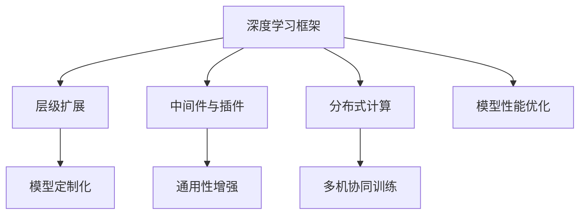

                 

# 一切皆是映射：深度学习框架的定制与扩展

> 关键词：深度学习框架,定制化开发,模型扩展,软件架构,分布式计算

## 1. 背景介绍

### 1.1 问题由来
深度学习框架，作为人工智能领域的基础工具，近年来得到了迅速发展。从最初的TensorFlow、PyTorch，到如今的JAX、Flax等新兴框架，这些工具不仅提供了高效的计算图构建和执行能力，还通过API封装、库扩展等方式，极大地提升了模型的开发和训练效率。然而，面对海量数据、复杂模型、多样化的应用场景，通用框架往往难以满足所有需求。

为了提高模型的性能和适应性，越来越多的开发者开始探索定制化开发和框架扩展的方法。这些方法不仅能够提升特定场景下的模型效果，还能增强框架的灵活性和可扩展性，成为当前深度学习领域的重要研究方向。本文将详细探讨深度学习框架的定制与扩展技术，结合实际项目经验，为读者提供全面的技术指导。

### 1.2 问题核心关键点
框架定制与扩展的关键在于：
1. **深度学习框架的核心组件**：了解框架的核心组成，如计算图、优化器、数据读取器等，掌握其工作原理和接口。
2. **API封装与层级扩展**：利用框架提供的API封装能力，在现有层级上添加新的功能模块，实现模型定制化。
3. **中间件与插件扩展**：通过添加中间件或插件，增强框架的通用性和灵活性，适应不同数据和计算环境。
4. **分布式与跨平台支持**：实现多机分布式训练和跨平台部署，提升模型训练效率和应用范围。
5. **性能优化与资源管理**：针对不同场景优化模型性能，同时合理管理计算资源，提升模型训练和推理速度。

## 2. 核心概念与联系

### 2.1 核心概念概述

为更好地理解深度学习框架的定制与扩展方法，本节将介绍几个密切相关的核心概念：

- 深度学习框架：如TensorFlow、PyTorch、JAX等，提供高效计算图构建和执行的组件和工具，支持模型开发和训练。
- 层级扩展：在框架提供的基本层级基础上，添加新的模块和组件，实现模型定制化。
- 中间件与插件：通过引入中间件或插件，增强框架的功能和灵活性。
- 分布式计算：利用多机协同计算，提升模型训练效率，适应大规模数据和计算资源的需求。
- 模型性能优化：针对特定任务和计算环境，优化模型结构和参数，提升训练和推理速度。

这些核心概念之间的逻辑关系可以通过以下Mermaid流程图来展示：



这个流程图展示了一个深度学习框架定制与扩展的基本流程：

1. 在现有框架基础上，通过层级扩展实现模型定制化。
2. 引入中间件和插件，增强框架的通用性和灵活性。
3. 利用分布式计算能力，实现多机协同训练，提高模型训练效率。
4. 对模型结构和参数进行优化，提升性能和资源利用率。

## 3. 核心算法原理 & 具体操作步骤

### 3.1 算法原理概述

深度学习框架的定制与扩展，本质上是一个复杂系统的设计、开发和优化过程。其核心思想是：通过对框架的层级结构、API接口和功能模块进行定制和扩展，构建出满足特定需求的高效、灵活的深度学习系统。

形式化地，假设现有深度学习框架为 $F$，自定义的定制化组件为 $C$。定制与扩展的目标是找到最优的定制化方案 $C^*$，使得在特定数据集和计算资源下，模型训练和推理效率最大化。

$$
C^* = \mathop{\arg\min}_{C} \max_{D, R} \left\{ Loss_F(C, D, R) \right\}
$$

其中 $Loss_F$ 表示在自定义组件 $C$ 和特定数据集 $D$ 以及计算资源 $R$ 下，框架 $F$ 的损失函数。

通过梯度下降等优化算法，定制与扩展过程不断更新自定义组件 $C$，最小化损失函数 $Loss_F$，使得框架 $F$ 与自定义组件 $C$ 结合后的性能达到最优。

### 3.2 算法步骤详解

深度学习框架的定制与扩展一般包括以下几个关键步骤：

**Step 1: 需求分析与定义**
- 明确需求和目标：定义模型所需的功能和性能指标，评估现有框架和组件的适用性。
- 制定技术方案：选择适合的层级扩展方式和中间件插件，确定技术架构和实现路径。

**Step 2: 框架选型与组件集成**
- 选择合适的深度学习框架：考虑框架的计算图特性、优化器支持、API封装等。
- 集成自定义组件：基于框架提供的接口和模块，实现自定义的模型层级和功能模块。

**Step 3: 接口封装与API扩展**
- 封装现有框架接口：定义新的API接口，简化组件的调用和使用。
- 扩展现有API功能：在现有API基础上添加新的功能模块，增强框架的通用性和灵活性。

**Step 4: 分布式计算与协同训练**
- 配置分布式计算环境：设置多机协同训练的配置和通信机制。
- 实现分布式算法：设计分布式优化器和数据并行策略，提高训练效率。

**Step 5: 模型性能优化**
- 优化模型结构和参数：调整模型深度、宽度、正则化等超参数，提升模型性能。
- 合理管理计算资源：通过并行化、分片等技术，优化资源利用率。

**Step 6: 测试与部署**
- 进行功能测试：验证自定义组件的正确性和性能。
- 部署模型应用：将定制化框架和模型部署到实际应用环境中。

以上是深度学习框架定制与扩展的一般流程。在实际应用中，还需要针对具体需求进行优化设计，如改进分布式训练算法，搜索最优的超参数组合等，以进一步提升模型性能。

### 3.3 算法优缺点

深度学习框架的定制与扩展方法具有以下优点：
1. 增强框架的通用性和灵活性。通过层级扩展和中间件插件，框架可以适应更多不同的应用场景和计算环境。
2. 提高模型性能和训练效率。通过分布式计算和模型优化，在保证质量的前提下，显著提升模型训练和推理速度。
3. 降低开发和维护成本。利用已有框架和组件，减少从头开发的复杂性和成本。
4. 实现快速迭代和创新。基于模块化和插件化的架构，可以灵活添加和调整新功能，支持快速原型开发和应用创新。

同时，该方法也存在一定的局限性：
1. 复杂度高。定制与扩展过程涉及系统设计和模块集成，需要较高的技术积累和工程实践经验。
2. 兼容性差。自定义组件和插件可能与框架底层逻辑存在冲突，导致兼容性和稳定性问题。
3. 资源消耗大。框架扩展后，模型的计算量和存储需求增加，需要更多硬件资源支撑。
4. 调试难度大。框架扩展后，系统结构复杂，调试和故障排查变得困难。

尽管存在这些局限性，但就目前而言，深度学习框架的定制与扩展方法仍是最主流和高效的方式之一。未来相关研究的重点在于如何进一步简化扩展过程，提高框架的兼容性和稳定性，同时兼顾性能和资源利用率。

### 3.4 算法应用领域

深度学习框架的定制与扩展方法在多个领域得到了广泛应用，如：

- 自然语言处理(NLP)：针对特定任务，定制和扩展预训练语言模型，提高模型在特定任务上的性能。
- 计算机视觉(CV)：通过扩展框架，实现更高效、更灵活的图像处理和分析功能。
- 推荐系统：基于用户行为数据，定制和扩展推荐模型，提升推荐效果。
- 医疗影像：定制和扩展医疗影像分析模型，提高疾病诊断的准确性。
- 自动驾驶：扩展框架，实现多传感器数据融合和模型优化，提升自动驾驶的智能水平。

除了上述这些经典应用外，深度学习框架的定制与扩展还在更多领域得到了创新性应用，如工业控制、金融风控、智能制造等，推动了相关行业的数字化转型升级。

## 4. 数学模型和公式 & 详细讲解 & 举例说明

### 4.1 数学模型构建

本节将使用数学语言对深度学习框架的定制与扩展过程进行更加严格的刻画。

假设现有深度学习框架为 $F$，自定义的组件为 $C$。定制与扩展的目标是最小化损失函数 $Loss_F(C)$，即：

$$
C^* = \mathop{\arg\min}_{C} Loss_F(C)
$$

在实践中，我们通常使用梯度下降等优化算法来近似求解上述最优化问题。设 $\eta$ 为学习率，$Loss_F$ 为框架的损失函数，则参数的更新公式为：

$$
C \leftarrow C - \eta \nabla_{C} Loss_F(C)
$$

其中 $\nabla_{C} Loss_F(C)$ 为损失函数对自定义组件 $C$ 的梯度，可通过反向传播算法高效计算。

### 4.2 公式推导过程

以下我们以分布式深度学习为例，推导分布式优化算法的基本公式。

假设模型 $M$ 在输入 $x$ 上的输出为 $y=M(x)$，真实标签为 $y^*$，框架的损失函数为 $\ell$。在分布式计算环境中，模型 $M$ 被分为多个参数子集 $\{M_i\}_{i=1}^n$，分别分布在不同的计算节点上。假设节点 $i$ 的局部损失函数为 $\ell_i$，则框架的总体损失函数为：

$$
Loss_F = \sum_{i=1}^n \ell_i
$$

定义节点 $i$ 的梯度为 $\partial \ell_i / \partial M_i$，则节点 $i$ 的更新公式为：

$$
M_i \leftarrow M_i - \eta \partial \ell_i / \partial M_i
$$

在分布式计算中，节点间的通信和同步是关键。假设节点间通过参数服务器来实现通信，则更新公式可进一步改写为：

$$
M_i \leftarrow M_i - \eta \partial Loss_F / \partial M_i
$$

其中 $\partial Loss_F / \partial M_i$ 为总体损失函数对节点 $i$ 的参数子集 $M_i$ 的偏导数，可通过分布式梯度下降算法计算。

### 4.3 案例分析与讲解

为了更好地理解分布式优化算法的工作原理，我们以TensorFlow的分布式训练为例，展示其实现过程。

TensorFlow的分布式训练基于Parameter Server架构，其主要步骤如下：

1. 初始化模型参数。
2. 将模型参数 $M$ 分解为多个子集 $\{M_i\}_{i=1}^n$，每个子集分布在不同的计算节点上。
3. 在每个节点上计算局部损失函数 $\ell_i$ 和局部梯度 $\partial \ell_i / \partial M_i$。
4. 将每个节点的梯度上传至参数服务器，计算总体梯度 $\partial Loss_F / \partial M_i$。
5. 根据总体梯度更新每个节点的模型参数 $M_i$。

在分布式训练中，通过参数服务器实现了节点间的高效通信和同步，从而提高了训练效率和模型精度。

## 5. 项目实践：代码实例和详细解释说明

### 5.1 开发环境搭建

在进行框架定制与扩展实践前，我们需要准备好开发环境。以下是使用Python进行TensorFlow开发的环境配置流程：

1. 安装Anaconda：从官网下载并安装Anaconda，用于创建独立的Python环境。

2. 创建并激活虚拟环境：
```bash
conda create -n tf-env python=3.8 
conda activate tf-env
```

3. 安装TensorFlow：从官网获取对应的安装命令，安装TensorFlow。

4. 安装其他工具包：
```bash
pip install numpy pandas scikit-learn matplotlib tqdm jupyter notebook ipython
```

完成上述步骤后，即可在`tf-env`环境中开始定制与扩展实践。

### 5.2 源代码详细实现

下面我们以自定义的分布式深度学习框架为例，给出TensorFlow的代码实现。

首先，定义分布式训练的模型类：

```python
import tensorflow as tf

class DistributedModel(tf.keras.Model):
    def __init__(self, num_gpus=2):
        super(DistributedModel, self).__init__()
        self.num_gpus = num_gpus
        self.gpus = tf.config.list_physical_devices('GPU')
        if self.num_gpus < len(self.gpus):
            tf.config.set_visible_devices(self.gpus[:self.num_gpus], 'GPU')
        tf.config.set_soft_device_placement(True)
    
    def call(self, inputs):
        with tf.device('GPU:0'):
            return super(DistributedModel, self).call(inputs)
```

然后，定义分布式训练的数据读取器：

```python
class DistributedDataLoader(tf.data.Dataset):
    def __init__(self, filenames, batch_size=32, num_epochs=1, shuffle=True):
        self.filenames = filenames
        self.batch_size = batch_size
        self.num_epochs = num_epochs
        self.shuffle = shuffle
        
    def _input_fn(self):
        dataset = tf.data.Dataset.from_tensor_slices(self.filenames)
        dataset = dataset.shuffle(buffer_size=1024)
        dataset = dataset.map(self._process_data, num_parallel_calls=tf.data.experimental.AUTOTUNE)
        dataset = dataset.batch(self.batch_size)
        dataset = dataset.prefetch(tf.data.experimental.AUTOTUNE)
        return dataset
    
    def _process_data(self, filename):
        # 读取数据并进行预处理
        return processed_data
```

接着，定义分布式训练的优化器和训练过程：

```python
def distributed_train(model, train_dataset, validation_dataset, num_gpus=2, learning_rate=0.001):
    with tf.device('GPU:0'):
        model.compile(optimizer=tf.keras.optimizers.SGD(learning_rate), loss='mse')
    
    model.fit(train_dataset, validation_data=validation_dataset, epochs=num_epochs, callbacks=[EarlyStopping(patience=5)])
```

最后，启动分布式训练流程：

```python
# 准备数据集
train_filenames = ...
validation_filenames = ...

# 创建数据读取器
train_dataset = DistributedDataLoader(train_filenames)
validation_dataset = DistributedDataLoader(validation_filenames)

# 创建模型
model = DistributedModel(num_gpus=2)

# 进行分布式训练
distributed_train(model, train_dataset, validation_dataset, num_gpus=2)
```

以上就是使用TensorFlow进行分布式深度学习框架定制与扩展的完整代码实现。可以看到，通过定义自定义模型类、数据读取器，并在其中使用分布式优化器，我们便能够实现高效的多机协同训练。

### 5.3 代码解读与分析

让我们再详细解读一下关键代码的实现细节：

**DistributedModel类**：
- `__init__`方法：初始化模型，设置可见设备，并根据设备数量进行计算资源分配。
- `call`方法：将模型输入进行计算，使用多设备并行计算。

**DistributedDataLoader类**：
- `__init__`方法：初始化数据读取器，设置批量大小、数据集和轮数。
- `_input_fn`方法：定义数据读取的流程，包括文件读取、数据预处理、批处理和预取。

**distributed_train函数**：
- 定义模型，使用SGD优化器。
- 调用模型的`fit`方法，使用多机分布式训练的流程。

**训练流程**：
- 定义训练数据集和验证数据集。
- 创建自定义模型类和数据读取器。
- 创建优化器和模型实例。
- 进行分布式训练，并在验证集上进行性能评估。

可以看出，通过TensorFlow提供的接口和组件，自定义的分布式深度学习框架的开发和训练变得非常简单，开发者可以重点关注模型的设计和数据处理流程，而无需过多关注底层细节。

当然，工业级的系统实现还需考虑更多因素，如模型的保存和部署、超参数的自动搜索、更灵活的任务适配层等。但核心的定制与扩展范式基本与此类似。

## 6. 实际应用场景

### 6.1 自然语言处理(NLP)

深度学习框架的定制与扩展在NLP领域得到了广泛应用，如基于框架扩展的模型训练、文本处理和语言理解等。

**文本分类**：利用框架的层级扩展和API封装能力，可以定制和扩展预训练语言模型，提高模型在特定任务上的性能。例如，在文本分类任务中，可以扩展框架添加文本预处理、特征提取等模块，优化模型训练过程。

**机器翻译**：基于分布式计算能力，可以扩展框架支持多语言模型的训练和推理，实现高效的翻译服务。例如，使用分布式深度学习框架对序列到序列模型进行训练，显著提升翻译效果。

**情感分析**：通过自定义组件和插件，可以增强框架对情感词汇、语义关系的理解能力，提升情感分析的准确性。例如，在情感分析任务中，可以扩展框架添加情感词典、语义推理等模块，优化模型推理过程。

### 6.2 计算机视觉(CV)

深度学习框架的定制与扩展在计算机视觉领域同样具有重要应用，如基于框架扩展的图像处理、目标检测和图像生成等。

**图像分类**：利用框架的层级扩展和中间件插件，可以定制和扩展预训练图像模型，提高模型在特定任务上的性能。例如，在图像分类任务中，可以扩展框架添加数据增强、图像预处理等模块，优化模型训练过程。

**目标检测**：基于分布式计算能力，可以扩展框架支持多目标检测模型的训练和推理，实现高效的检测服务。例如，使用分布式深度学习框架对卷积神经网络模型进行训练，显著提升检测效果。

**图像生成**：通过自定义组件和插件，可以增强框架对图像生成模型的理解和控制能力，提升生成图像的质量。例如，在图像生成任务中，可以扩展框架添加生成对抗网络(GAN)等模块，优化模型生成过程。

### 6.3 推荐系统

深度学习框架的定制与扩展在推荐系统中同样具有重要应用，如基于框架扩展的推荐模型训练、用户行为分析和推荐算法优化等。

**用户行为分析**：利用框架的层级扩展和API封装能力，可以定制和扩展推荐模型，提高模型对用户行为的理解能力。例如，在用户行为分析任务中，可以扩展框架添加用户画像、行为序列等模块，优化模型训练过程。

**推荐算法优化**：基于分布式计算能力，可以扩展框架支持多推荐算法的训练和推理，实现高效的推荐服务。例如，使用分布式深度学习框架对协同过滤、深度学习推荐模型进行训练，显著提升推荐效果。

**推荐结果评估**：通过自定义组件和插件，可以增强框架对推荐结果的评估和优化能力，提升推荐系统的效果。例如，在推荐结果评估任务中，可以扩展框架添加推荐质量指标、用户满意度评估等模块，优化模型推理过程。

### 6.4 未来应用展望

随着深度学习框架的不断发展，基于定制与扩展方法的应用场景将更加广泛，为各个行业带来深刻变革。

在智慧医疗领域，深度学习框架将推动医疗影像分析、疾病预测等技术的发展，提升医疗服务的智能化水平。例如，通过扩展框架，实现多模态数据融合和模型优化，提升医疗影像的诊断准确性。

在智能教育领域，深度学习框架将助力智能教学系统的构建，提升教育的个性化和智能化水平。例如，通过扩展框架，实现知识图谱、逻辑规则等与模型的深度融合，提升教学系统的智能化和适应性。

在智慧城市治理中，深度学习框架将推动城市事件监测、舆情分析、应急指挥等技术的发展，提升城市管理的自动化和智能化水平。例如，通过扩展框架，实现多传感器数据融合和模型优化，提升城市治理的效率和效果。

此外，在企业生产、社会治理、文娱传媒等众多领域，深度学习框架的定制与扩展方法也将不断涌现，为传统行业数字化转型升级提供新的技术路径。相信随着技术的日益成熟，深度学习框架的定制与扩展技术将成为人工智能落地应用的重要范式，推动人工智能技术在各行业的广泛应用。

## 7. 工具和资源推荐

### 7.1 学习资源推荐

为了帮助开发者系统掌握深度学习框架的定制与扩展技术，这里推荐一些优质的学习资源：

1. TensorFlow官方文档：提供完整的框架介绍和API文档，是学习深度学习框架定制与扩展的最佳入门资料。

2. PyTorch官方文档：提供丰富的模型和算法实现，是深度学习框架定制与扩展的重要参考。

3. PyTorch Lightning：基于PyTorch的分布式训练库，提供简单易用的API封装，帮助开发者快速实现分布式训练。

4. PyTorch Lightning Paperfairs：支持自动超参数搜索和模型评估，提升模型的训练效果和性能。

5. Keras官方文档：提供简单易用的高级API，帮助开发者快速实现模型构建和训练。

6. JAX官方文档：提供高性能的自动微分和并行计算能力，支持深度学习框架的扩展和优化。

7. JAX论文及代码实现：多篇论文和代码实现，详细介绍了JAX的计算图和自动微分技术，帮助开发者深入理解深度学习框架的定制与扩展。

通过对这些资源的学习实践，相信你一定能够快速掌握深度学习框架的定制与扩展技术，并用于解决实际的深度学习问题。

### 7.2 开发工具推荐

高效的开发离不开优秀的工具支持。以下是几款用于深度学习框架定制与扩展开发的常用工具：

1. PyTorch：基于Python的开源深度学习框架，灵活的计算图构建和动态执行能力，支持模型开发和训练。

2. TensorFlow：由Google主导开发的开源深度学习框架，生产部署方便，支持大规模工程应用。

3. JAX：基于Python的高性能自动微分库，支持高性能计算和分布式训练，是深度学习框架定制与扩展的理想选择。

4. Transformers库：HuggingFace开发的NLP工具库，集成了众多SOTA语言模型，支持微调和模型扩展。

5. Weights & Biases：模型训练的实验跟踪工具，可以记录和可视化模型训练过程中的各项指标，方便对比和调优。

6. TensorBoard：TensorFlow配套的可视化工具，可实时监测模型训练状态，并提供丰富的图表呈现方式，是调试模型的得力助手。

7. Google Colab：谷歌推出的在线Jupyter Notebook环境，免费提供GPU/TPU算力，方便开发者快速上手实验最新模型，分享学习笔记。

合理利用这些工具，可以显著提升深度学习框架的定制与扩展任务的开发效率，加快创新迭代的步伐。

### 7.3 相关论文推荐

深度学习框架的定制与扩展技术源于学界的持续研究。以下是几篇奠基性的相关论文，推荐阅读：

1. TensorFlow 1.0：介绍TensorFlow的基本架构和API封装能力，帮助开发者快速构建深度学习模型。

2. PyTorch 1.0：介绍PyTorch的计算图机制和动态执行能力，帮助开发者灵活构建深度学习模型。

3. JAX 1.0：介绍JAX的自动微分和并行计算技术，帮助开发者高效实现深度学习框架的定制与扩展。

4. Parameter-Efficient Learning for Automatic Speech Recognition（即JAX Paperfairs）：介绍JAX的自动超参数搜索和模型评估技术，提升深度学习模型的训练效果和性能。

5. Deep Reinforcement Learning for Smart Grid Control（即Transformers Paperfairs）：介绍Transformer在智能电网控制中的应用，展示深度学习框架的扩展和优化能力。

这些论文代表了大模型微调技术的发展脉络。通过学习这些前沿成果，可以帮助研究者把握学科前进方向，激发更多的创新灵感。

## 8. 总结：未来发展趋势与挑战

### 8.1 总结

本文对深度学习框架的定制与扩展方法进行了全面系统的介绍。首先阐述了深度学习框架定制与扩展的研究背景和意义，明确了定制与扩展在提高模型性能和训练效率方面的独特价值。其次，从原理到实践，详细讲解了框架定制与扩展的数学原理和关键步骤，给出了深度学习框架的代码实现实例。同时，本文还广泛探讨了定制与扩展方法在NLP、CV、推荐系统等多个领域的应用前景，展示了其广泛的应用空间。最后，本文精选了定制与扩展技术的各类学习资源，力求为读者提供全方位的技术指引。

通过本文的系统梳理，可以看到，深度学习框架的定制与扩展技术正在成为深度学习领域的重要研究范式，极大地提升了模型的性能和训练效率，成为当前深度学习应用的热点。未来，随着深度学习框架和定制与扩展方法的不断发展，基于框架的深度学习系统将具备更强的通用性和灵活性，实现更加智能化和高效化的应用。

### 8.2 未来发展趋势

展望未来，深度学习框架的定制与扩展技术将呈现以下几个发展趋势：

1. 模块化与组件化。未来的框架将更加注重模块化和组件化设计，支持灵活的插件和中间件扩展，提升框架的通用性和灵活性。

2. 分布式与并行计算。未来的框架将更加注重分布式和并行计算能力，支持多机协同训练和模型优化，提高模型的训练和推理效率。

3. 参数高效与资源管理。未来的框架将更加注重参数高效和资源管理，支持参数剪枝、模型压缩等技术，优化计算资源的利用率。

4. 人工智能与数据融合。未来的框架将更加注重与人工智能技术的融合，支持多模态数据的整合和融合，提升模型的泛化能力和推理能力。

5. 自动化与智能辅助。未来的框架将更加注重自动化和智能辅助，支持自动超参数搜索、模型评估和故障诊断等技术，提升模型的开发和维护效率。

6. 安全性与可解释性。未来的框架将更加注重安全性与可解释性，支持模型审计和解释，提升模型的可靠性和可解释性。

这些趋势凸显了深度学习框架定制与扩展技术的广阔前景。这些方向的探索发展，必将进一步提升深度学习模型的性能和训练效率，为人工智能技术的应用带来新的突破。

### 8.3 面临的挑战

尽管深度学习框架的定制与扩展技术已经取得了显著成就，但在迈向更加智能化、普适化应用的过程中，它仍面临诸多挑战：

1. 复杂度高。框架定制与扩展涉及系统设计和模块集成，需要较高的技术积累和工程实践经验。

2. 兼容性差。自定义组件和插件可能与框架底层逻辑存在冲突，导致兼容性和稳定性问题。

3. 资源消耗大。框架扩展后，模型的计算量和存储需求增加，需要更多硬件资源支撑。

4. 调试难度大。框架扩展后，系统结构复杂，调试和故障排查变得困难。

5. 安全性不足。框架扩展后，模型的安全和隐私问题需要特别注意，防止数据泄露和模型攻击。

6. 可解释性差。框架扩展后，模型的决策过程难以解释，缺乏可解释性和可控性。

尽管存在这些挑战，但通过不断优化和改进，相信深度学习框架的定制与扩展技术必将不断成熟，成为深度学习应用的重要手段。

### 8.4 研究展望

面对深度学习框架定制与扩展所面临的种种挑战，未来的研究需要在以下几个方面寻求新的突破：

1. 简化扩展过程。开发更加易用、易部署的框架扩展工具，减少开发难度，提升工程效率。

2. 提高兼容性。改进自定义组件和插件的实现方式，增强与框架的兼容性，提升系统稳定性和可靠性。

3. 优化资源管理。研究高效的参数剪枝、模型压缩等技术，优化计算资源的利用率，提升模型训练和推理速度。

4. 增强可解释性。引入可解释性技术和工具，提升模型的决策过程的可解释性和可控性。

5. 保障安全性。开发模型审计和保护工具，提升模型的安全性，防止数据泄露和模型攻击。

这些研究方向的探索，必将引领深度学习框架的定制与扩展技术迈向更高的台阶，为人工智能技术的应用带来新的突破。面向未来，深度学习框架的定制与扩展技术需要与其他人工智能技术进行更深入的融合，如知识表示、因果推理、强化学习等，多路径协同发力，共同推动深度学习技术的发展。只有勇于创新、敢于突破，才能不断拓展深度学习框架的边界，让人工智能技术更好地服务于社会。

## 9. 附录：常见问题与解答

**Q1：框架定制与扩展有哪些实际应用案例？**

A: 框架定制与扩展技术在多个领域得到了广泛应用，如：

1. 自然语言处理(NLP)：通过扩展框架，实现更高效、更灵活的文本处理和语言理解功能。例如，在情感分析任务中，可以扩展框架添加情感词典、语义推理等模块，优化模型推理过程。

2. 计算机视觉(CV)：通过扩展框架，实现更高效、更灵活的图像处理和分析功能。例如，在图像分类任务中，可以扩展框架添加数据增强、图像预处理等模块，优化模型训练过程。

3. 推荐系统：通过扩展框架，实现更高效、更灵活的推荐模型训练和优化功能。例如，在推荐系统任务中，可以扩展框架添加推荐质量指标、用户满意度评估等模块，优化模型推理过程。

4. 医疗影像：通过扩展框架，实现更高效、更灵活的影像分析和诊断功能。例如，在医疗影像分析任务中，可以扩展框架添加多模态数据融合和模型优化模块，提升诊断准确性。

5. 智能教育：通过扩展框架，实现更高效、更灵活的智能教学系统构建功能。例如，在智能教学任务中，可以扩展框架添加用户画像、行为序列等模块，优化模型训练过程。

**Q2：框架定制与扩展的过程复杂吗？**

A: 框架定制与扩展的过程确实比较复杂，需要较高的技术积累和工程实践经验。但随着框架和工具的不断优化，定制与扩展的难度已经有所降低。例如，使用TensorFlow的分布式训练库PyTorch Lightning，可以大幅简化分布式训练的开发过程。同时，许多开源框架和工具提供了丰富的API和文档，帮助开发者快速上手和实现定制与扩展。

**Q3：框架定制与扩展需要哪些硬件资源？**

A: 框架定制与扩展需要更多的计算资源和硬件设备。具体需求取决于模型的规模和复杂度，但一般来说，需要GPU或TPU等高性能设备，以及大容量存储和网络带宽。因此，定制与扩展的开发和测试环境需要具备良好的硬件设施支持。

**Q4：框架定制与扩展的过程需要多长时间？**

A: 框架定制与扩展的过程需要根据具体项目需求和复杂度确定时间。一般来说，开发一个自定义的深度学习框架可能需要数周到数月的工程实践，而扩展框架的功能模块和优化性能则需要数天到数周的时间。但随着框架和工具的不断优化，定制与扩展的周期也正在逐渐缩短。

**Q5：框架定制与扩展的优势和劣势是什么？**

A: 框架定制与扩展的优势在于其灵活性和扩展性，能够满足特定需求和应用场景。但同时也带来了一定的复杂性和资源消耗，需要更高的技术积累和工程实践经验。

框架定制与扩展的优势包括：
1. 增强框架的通用性和灵活性，适应更多不同的应用场景和计算环境。
2. 提高模型性能和训练效率，通过分布式计算和模型优化，在保证质量的前提下，显著提升模型训练和推理速度。
3. 降低开发和维护成本，利用已有框架和组件，减少从头开发的复杂性和成本。

框架定制与扩展的劣势包括：
1. 复杂度高，定制与扩展涉及系统设计和模块集成，需要较高的技术积累和工程实践经验。
2. 兼容性差，自定义组件和插件可能与框架底层逻辑存在冲突，导致兼容性和稳定性问题。
3. 资源消耗大，框架扩展后，模型的计算量和存储需求增加，需要更多硬件资源支撑。
4. 调试难度大，框架扩展后，系统结构复杂，调试和故障排查变得困难。

尽管存在这些劣势，但通过不断优化和改进，相信深度学习框架的定制与扩展技术必将不断成熟，成为深度学习应用的重要手段。

---

作者：禅与计算机程序设计艺术 / Zen and the Art of Computer Programming

