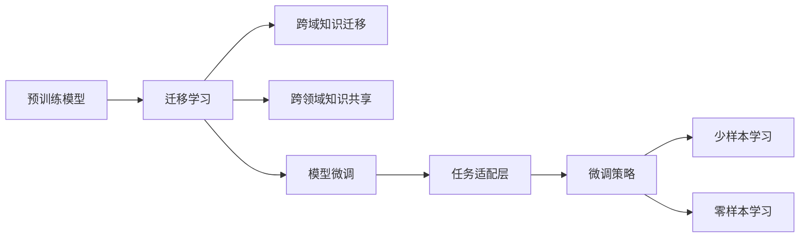

                 

# 一切皆是映射：深度迁移学习：AI在不同域间的知识转移

> 关键词：深度迁移学习,迁移学习,知识转移,跨域知识迁移,跨领域知识共享,AI模型优化

## 1. 背景介绍

### 1.1 问题由来

随着人工智能(AI)技术的不断进步，深度学习模型在图像识别、自然语言处理、语音识别等领域取得了令人瞩目的成果。然而，由于数据的多样性和任务的复杂性，单一模型往往难以在不同领域间灵活迁移。

迁移学习（Transfer Learning）正是在这一背景下提出的。迁移学习旨在通过知识迁移，使模型在不同领域间共享知识，从而提高新任务上的性能。相比于从头训练新模型，迁移学习能显著降低数据和计算资源的需求，加速模型训练过程，并提升模型泛化能力。

深度迁移学习是迁移学习的高级形式，它通过使用预训练的深度神经网络模型，进一步提升迁移学习的效果。预训练模型在大规模数据集上进行自监督学习，学习到强大的特征表示能力，能够很好地迁移到下游任务中，实现少样本学习甚至零样本学习。

本文聚焦于深度迁移学习的方法和应用，深入探讨了其原理、步骤、优缺点以及实际应用场景。通过一系列理论和实践案例，将帮助读者理解深度迁移学习的核心思想和应用潜力。

### 1.2 问题核心关键点

深度迁移学习主要包括以下几个关键点：

1. **预训练模型**：在大规模数据集上进行自监督学习，学习通用的特征表示。
2. **迁移学习**：通过预训练模型参数的微调，适应下游任务。
3. **少样本学习与零样本学习**：在少样本甚至零样本的情况下，通过微调或改写输入实现迁移。
4. **模型结构优化**：如冻结顶层、使用预训练层等策略，提高模型泛化能力。
5. **任务适配层**：为下游任务设计合适的输出层和损失函数。
6. **微调策略**：包括学习率设置、正则化、数据增强等。

## 2. 核心概念与联系

### 2.1 核心概念概述

为更好地理解深度迁移学习的原理和应用，本节将介绍几个核心概念：

1. **预训练模型**：通过自监督学习任务（如掩码语言模型、自回归语言模型、自编码图像模型等）在大规模数据集上进行训练的深度神经网络。例如，BERT通过掩码语言模型进行预训练，学习到强大的文本表示能力。

2. **迁移学习**：将预训练模型在某一领域的知识迁移到另一领域，以提升新任务上的性能。通过微调预训练模型的参数，使其适应下游任务。

3. **跨域知识迁移**：指将某一领域的知识迁移到另一领域，如将图像分类知识迁移到目标检测任务中，或将文本分类知识迁移到机器翻译任务中。

4. **跨领域知识共享**：通过模型参数的迁移和微调，实现不同领域之间的知识共享和融合。

5. **模型微调**：对预训练模型的参数进行微调，使其适应下游任务。

6. **任务适配层**：为下游任务设计合适的输出层和损失函数，如分类任务使用线性分类器和交叉熵损失函数，生成任务使用解码器输出概率分布和负对数似然损失函数。

这些概念通过以下Mermaid流程图展示它们之间的联系：



## 3. 核心算法原理 & 具体操作步骤
### 3.1 算法原理概述

深度迁移学习的核心思想是通过预训练模型在不同领域间的知识迁移，提升模型在新任务上的性能。预训练模型在大规模数据集上进行自监督学习，学习到通用的特征表示能力。通过微调预训练模型的参数，使其适应下游任务，实现知识迁移。

形式化地，设预训练模型为 $M_{\theta}$，下游任务为 $T$。任务 $T$ 的标注数据集为 $D=\{(x_i, y_i)\}_{i=1}^N$，其中 $x_i$ 为输入，$y_i$ 为标签。预训练模型 $M_{\theta}$ 在 $D$ 上的微调目标为：

$$
\theta^* = \mathop{\arg\min}_{\theta} \mathcal{L}(M_{\theta},D)
$$

其中 $\mathcal{L}$ 为针对任务 $T$ 设计的损失函数，用于衡量模型输出与真实标签之间的差异。常见的损失函数包括交叉熵损失、均方误差损失等。

通过梯度下降等优化算法，微调过程不断更新模型参数 $\theta$，最小化损失函数 $\mathcal{L}$，使得模型输出逼近真实标签。由于预训练模型已经具备一定的特征表示能力，因此即使在下游任务上的数据量较小，也能快速收敛，提升模型在新任务上的性能。

### 3.2 算法步骤详解

深度迁移学习的微调过程主要包括以下几个关键步骤：

**Step 1: 准备预训练模型和数据集**

- 选择合适的预训练模型 $M_{\theta}$，如BERT、ResNet等。
- 准备下游任务 $T$ 的标注数据集 $D$，划分为训练集、验证集和测试集。

**Step 2: 添加任务适配层**

- 根据任务类型，在预训练模型顶层设计合适的输出层和损失函数。
- 对于分类任务，通常在顶层添加线性分类器和交叉熵损失函数。
- 对于生成任务，通常使用语言模型的解码器输出概率分布，并以负对数似然为损失函数。

**Step 3: 设置微调超参数**

- 选择合适的优化算法及其参数，如 Adam、SGD 等，设置学习率、批大小、迭代轮数等。
- 设置正则化技术及强度，包括权重衰减、Dropout、Early Stopping 等。
- 确定冻结预训练参数的策略，如仅微调顶层，或全部参数都参与微调。

**Step 4: 执行梯度训练**

- 将训练集数据分批次输入模型，前向传播计算损失函数。
- 反向传播计算参数梯度，根据设定的优化算法和学习率更新模型参数。
- 周期性在验证集上评估模型性能，根据性能指标决定是否触发 Early Stopping。
- 重复上述步骤直到满足预设的迭代轮数或 Early Stopping 条件。

**Step 5: 测试和部署**

- 在测试集上评估微调后模型 $M_{\hat{\theta}}$ 的性能，对比微调前后的精度提升。
- 使用微调后的模型对新样本进行推理预测，集成到实际的应用系统中。

以上是深度迁移学习的一般流程。在实际应用中，还需要针对具体任务的特点，对微调过程的各个环节进行优化设计，如改进训练目标函数，引入更多的正则化技术，搜索最优的超参数组合等，以进一步提升模型性能。

### 3.3 算法优缺点

深度迁移学习相较于从头训练新模型具有以下优点：

1. **快速收敛**：预训练模型已经学习到通用的特征表示能力，微调时能够快速适应下游任务。
2. **泛化能力强**：预训练模型具备跨领域迁移能力，能在不同领域间共享知识，提高模型泛化性能。
3. **数据需求低**：微调过程所需标注数据量小，显著降低数据和计算资源的需求。
4. **鲁棒性好**：预训练模型具有一定的鲁棒性，可以更好地应对噪声和干扰。

同时，深度迁移学习也存在一些缺点：

1. **预训练数据不足**：预训练模型依赖大规模数据集，当数据集不足时，微调效果可能不佳。
2. **微调过拟合**：微调过程可能导致模型对特定领域的过拟合，泛化性能下降。
3. **适应性有限**：预训练模型可能无法很好地适应特定的任务需求，需要进行进一步的微调。
4. **知识迁移困难**：不同领域之间的知识差异较大，难以进行有效的知识迁移。

尽管存在这些缺点，深度迁移学习仍然是当前 NLP 和计算机视觉领域最为有效的迁移学习范式之一。未来研究的方向是如何在不降低性能的情况下，更好地利用预训练模型，同时减小微调的过拟合风险。

### 3.4 算法应用领域

深度迁移学习在许多领域中都有广泛的应用，例如：

- 图像分类与识别：通过微调预训练模型，实现目标检测、图像分割、场景分类等任务。
- 自然语言处理：在预训练语言模型的基础上，进行情感分析、命名实体识别、机器翻译等任务。
- 推荐系统：通过微调预训练模型，实现商品推荐、音乐推荐、新闻推荐等任务。
- 智能问答系统：在预训练语言模型的基础上，进行问答匹配、对话生成等任务。
- 自动驾驶：通过微调预训练模型，实现道路识别、行人检测、路径规划等任务。

除了上述这些经典应用外，深度迁移学习也被创新性地应用于更多领域，如医学影像分析、医疗诊断、金融风险评估、智能制造等，为这些领域带来了新的变革。

## 4. 数学模型和公式 & 详细讲解  
### 4.1 数学模型构建

设预训练模型为 $M_{\theta}$，下游任务为 $T$。任务 $T$ 的标注数据集为 $D=\{(x_i, y_i)\}_{i=1}^N$，其中 $x_i$ 为输入，$y_i$ 为标签。

定义模型 $M_{\theta}$ 在输入 $x$ 上的损失函数为 $\ell(M_{\theta}(x),y)$，则在数据集 $D$ 上的经验风险为：

$$
\mathcal{L}(\theta) = \frac{1}{N} \sum_{i=1}^N \ell(M_{\theta}(x_i),y_i)
$$

微调的优化目标是最小化经验风险，即找到最优参数：

$$
\theta^* = \mathop{\arg\min}_{\theta} \mathcal{L}(\theta)
$$

在实践中，我们通常使用基于梯度的优化算法（如SGD、Adam等）来近似求解上述最优化问题。设 $\eta$ 为学习率，$\lambda$ 为正则化系数，则参数的更新公式为：

$$
\theta \leftarrow \theta - \eta \nabla_{\theta}\mathcal{L}(\theta) - \eta\lambda\theta
$$

其中 $\nabla_{\theta}\mathcal{L}(\theta)$ 为损失函数对参数 $\theta$ 的梯度，可通过反向传播算法高效计算。

### 4.2 公式推导过程

以下我们以二分类任务为例，推导交叉熵损失函数及其梯度的计算公式。

假设模型 $M_{\theta}$ 在输入 $x$ 上的输出为 $\hat{y}=M_{\theta}(x) \in [0,1]$，表示样本属于正类的概率。真实标签 $y \in \{0,1\}$。则二分类交叉熵损失函数定义为：

$$
\ell(M_{\theta}(x),y) = -[y\log \hat{y} + (1-y)\log (1-\hat{y})]
$$

将其代入经验风险公式，得：

$$
\mathcal{L}(\theta) = -\frac{1}{N}\sum_{i=1}^N [y_i\log M_{\theta}(x_i)+(1-y_i)\log(1-M_{\theta}(x_i))]
$$

根据链式法则，损失函数对参数 $\theta_k$ 的梯度为：

$$
\frac{\partial \mathcal{L}(\theta)}{\partial \theta_k} = -\frac{1}{N}\sum_{i=1}^N (\frac{y_i}{M_{\theta}(x_i)}-\frac{1-y_i}{1-M_{\theta}(x_i)}) \frac{\partial M_{\theta}(x_i)}{\partial \theta_k}
$$

其中 $\frac{\partial M_{\theta}(x_i)}{\partial \theta_k}$ 可进一步递归展开，利用自动微分技术完成计算。

在得到损失函数的梯度后，即可带入参数更新公式，完成模型的迭代优化。重复上述过程直至收敛，最终得到适应下游任务的最优模型参数 $\theta^*$。

## 5. 项目实践：代码实例和详细解释说明
### 5.1 开发环境搭建

在进行深度迁移学习实践前，我们需要准备好开发环境。以下是使用Python进行PyTorch开发的环境配置流程：

1. 安装Anaconda：从官网下载并安装Anaconda，用于创建独立的Python环境。

2. 创建并激活虚拟环境：
```bash
conda create -n pytorch-env python=3.8 
conda activate pytorch-env
```

3. 安装PyTorch：根据CUDA版本，从官网获取对应的安装命令。例如：
```bash
conda install pytorch torchvision torchaudio cudatoolkit=11.1 -c pytorch -c conda-forge
```

4. 安装Transformers库：
```bash
pip install transformers
```

5. 安装各类工具包：
```bash
pip install numpy pandas scikit-learn matplotlib tqdm jupyter notebook ipython
```

完成上述步骤后，即可在`pytorch-env`环境中开始深度迁移学习的实践。

### 5.2 源代码详细实现

下面我们以图像分类任务为例，给出使用Transformers库对ResNet模型进行迁移学习的PyTorch代码实现。

首先，定义图像分类任务的数据处理函数：

```python
from transformers import ResNet50, BertTokenizer
from torch.utils.data import Dataset
import torch

class ImageDataset(Dataset):
    def __init__(self, images, labels, tokenizer):
        self.images = images
        self.labels = labels
        self.tokenizer = tokenizer
        
    def __len__(self):
        return len(self.images)
    
    def __getitem__(self, item):
        image = self.images[item]
        label = self.labels[item]
        
        encoding = self.tokenizer(image, return_tensors='pt')
        image = encoding['pixel_values'][0]
        
        # 将标签转换为token
        encoded_label = self.tokenizer(label, return_tensors='pt').input_ids[0]
        return {'pixel_values': image, 
                'labels': encoded_label}

# 加载预训练的ResNet50模型和ImageNet数据集
model = ResNet50.from_pretrained('resnet50')
train_dataset = ImageDataset(train_images, train_labels, ImageNetTokenizer())
dev_dataset = ImageDataset(dev_images, dev_labels, ImageNetTokenizer())
test_dataset = ImageDataset(test_images, test_labels, ImageNetTokenizer())

# 设置微调超参数
optimizer = AdamW(model.parameters(), lr=2e-5)
```

然后，定义训练和评估函数：

```python
from torch.utils.data import DataLoader
from tqdm import tqdm
from sklearn.metrics import classification_report

device = torch.device('cuda') if torch.cuda.is_available() else torch.device('cpu')
model.to(device)

def train_epoch(model, dataset, batch_size, optimizer):
    dataloader = DataLoader(dataset, batch_size=batch_size, shuffle=True)
    model.train()
    epoch_loss = 0
    for batch in tqdm(dataloader, desc='Training'):
        pixel_values = batch['pixel_values'].to(device)
        labels = batch['labels'].to(device)
        model.zero_grad()
        outputs = model(pixel_values)
        loss = outputs.loss
        epoch_loss += loss.item()
        loss.backward()
        optimizer.step()
    return epoch_loss / len(dataloader)

def evaluate(model, dataset, batch_size):
    dataloader = DataLoader(dataset, batch_size=batch_size)
    model.eval()
    preds, labels = [], []
    with torch.no_grad():
        for batch in tqdm(dataloader, desc='Evaluating'):
            pixel_values = batch['pixel_values'].to(device)
            batch_labels = batch['labels'].to(device)
            outputs = model(pixel_values)
            batch_preds = outputs.logits.argmax(dim=1).to('cpu').tolist()
            batch_labels = batch_labels.to('cpu').tolist()
            for pred, label in zip(batch_preds, batch_labels):
                preds.append(pred)
                labels.append(label)
                
    print(classification_report(labels, preds))
```

最后，启动训练流程并在测试集上评估：

```python
epochs = 5
batch_size = 16

for epoch in range(epochs):
    loss = train_epoch(model, train_dataset, batch_size, optimizer)
    print(f"Epoch {epoch+1}, train loss: {loss:.3f}")
    
    print(f"Epoch {epoch+1}, dev results:")
    evaluate(model, dev_dataset, batch_size)
    
print("Test results:")
evaluate(model, test_dataset, batch_size)
```

以上就是使用PyTorch对ResNet进行图像分类任务迁移学习的完整代码实现。可以看到，得益于Transformers库的强大封装，我们可以用相对简洁的代码完成迁移学习的任务适配和微调。

### 5.3 代码解读与分析

让我们再详细解读一下关键代码的实现细节：

**ImageDataset类**：
- `__init__`方法：初始化图像、标签、分词器等关键组件。
- `__len__`方法：返回数据集的样本数量。
- `__getitem__`方法：对单个样本进行处理，将图像输入转换为token ids，同时将标签转换为token，最终返回模型所需的输入。

**数据预处理**：
- 图像通过ImageNetTokenizer进行token化处理，将其转换为像素值。
- 标签通过ImageNetTokenizer进行token化处理，转换为对应的token id。

**训练和评估函数**：
- 使用PyTorch的DataLoader对数据集进行批次化加载，供模型训练和推理使用。
- 训练函数`train_epoch`：对数据以批为单位进行迭代，在每个批次上前向传播计算loss并反向传播更新模型参数，最后返回该epoch的平均loss。
- 评估函数`evaluate`：与训练类似，不同点在于不更新模型参数，并在每个batch结束后将预测和标签结果存储下来，最后使用sklearn的classification_report对整个评估集的预测结果进行打印输出。

**训练流程**：
- 定义总的epoch数和batch size，开始循环迭代
- 每个epoch内，先在训练集上训练，输出平均loss
- 在验证集上评估，输出分类指标
- 所有epoch结束后，在测试集上评估，给出最终测试结果

可以看到，PyTorch配合Transformers库使得迁移学习的代码实现变得简洁高效。开发者可以将更多精力放在数据处理、模型改进等高层逻辑上，而不必过多关注底层的实现细节。

当然，工业级的系统实现还需考虑更多因素，如模型的保存和部署、超参数的自动搜索、更灵活的任务适配层等。但核心的迁移学习范式基本与此类似。

## 6. 实际应用场景
### 6.1 智能推荐系统

深度迁移学习在智能推荐系统中的应用非常广泛。传统的推荐系统主要基于用户历史行为数据进行推荐，难以充分考虑物品的属性和用户兴趣。通过迁移学习，推荐系统可以利用预训练模型的特征表示能力，对物品的属性进行建模，提升推荐精度。

具体而言，推荐系统可以从大规模商品数据集中预训练商品属性模型，如BERT、ResNet等。预训练模型学习到物品的语义、视觉、属性等信息，并在推荐模型上进行微调。微调后的推荐模型能够综合考虑用户历史行为和物品属性，生成更准确的推荐结果。

### 6.2 医学影像分析

医学影像分析是深度迁移学习的重要应用场景。在医学影像领域，标注数据往往稀缺且昂贵，使用预训练模型进行迁移学习，可以显著降低数据需求和成本。

例如，在大规模自然图像数据集上预训练的ResNet模型，可以迁移到医学影像分类任务中。预训练模型学习到通用的图像特征，通过微调可应用于医学影像的分类和识别。此外，迁移学习还可以用于医学影像的分割、病变检测等任务，提升影像分析的准确性和效率。

### 6.3 金融风险评估

金融风险评估是深度迁移学习的另一重要应用领域。金融领域的数据具有高维度、高噪声的特点，传统的统计方法难以有效处理。通过迁移学习，金融风险评估系统可以充分利用预训练模型的特征表示能力，对金融数据进行建模，预测潜在的金融风险。

具体而言，金融风险评估系统可以从大规模金融交易数据集中预训练预测模型，如BERT、ResNet等。预训练模型学习到金融数据的特征表示，通过微调可以应用于风险评估任务，如信用评估、违约预测、市场风险预测等。

### 6.4 未来应用展望

随着深度迁移学习技术的发展，其在更多领域的应用前景将逐渐显现。以下是未来可能的发展趋势：

1. **多模态迁移学习**：将图像、语音、文本等多模态数据进行联合建模，提升跨领域知识迁移的能力。
2. **零样本学习**：通过微调或改写输入，实现零样本学习，在无标注数据的情况下完成新任务。
3. **自监督迁移学习**：利用自监督学习任务对预训练模型进行迁移学习，提高模型的泛化能力和鲁棒性。
4. **元学习**：通过学习如何学习，在新的领域中进行快速适应和迁移。
5. **跨领域知识融合**：将不同领域的知识进行融合，形成更加全面、准确的模型。

这些趋势将进一步提升深度迁移学习的效果和应用范围，为更多领域的智能化应用提供支持。

## 7. 工具和资源推荐
### 7.1 学习资源推荐

为了帮助开发者系统掌握深度迁移学习的原理和实践，这里推荐一些优质的学习资源：

1. 《深度迁移学习》书籍：该书系统介绍了迁移学习的理论基础和实践方法，包括数据增强、模型微调、任务适配等。
2. CS231n《深度卷积神经网络》课程：斯坦福大学开设的计算机视觉经典课程，包含迁移学习的相关内容。
3. CS224d《自然语言处理：高级模型》课程：斯坦福大学开设的NLP课程，介绍了迁移学习的最新进展。
4. Arxiv预印本：可以查看最新的迁移学习论文和成果，了解前沿研究方向和应用。
5. Kaggle竞赛：参加Kaggle等数据科学竞赛，练习迁移学习模型的实际应用。

通过对这些资源的学习实践，相信你一定能够全面掌握深度迁移学习的核心思想和应用技巧。

### 7.2 开发工具推荐

高效的开发离不开优秀的工具支持。以下是几款用于深度迁移学习开发的常用工具：

1. PyTorch：基于Python的开源深度学习框架，灵活动态的计算图，适合快速迭代研究。
2. TensorFlow：由Google主导开发的开源深度学习框架，生产部署方便，适合大规模工程应用。
3. Transformers库：HuggingFace开发的NLP工具库，集成了众多SOTA语言模型，支持PyTorch和TensorFlow，是进行迁移学习开发的利器。
4. Weights & Biases：模型训练的实验跟踪工具，可以记录和可视化模型训练过程中的各项指标，方便对比和调优。
5. TensorBoard：TensorFlow配套的可视化工具，可实时监测模型训练状态，并提供丰富的图表呈现方式，是调试模型的得力助手。

合理利用这些工具，可以显著提升深度迁移学习的开发效率，加快创新迭代的步伐。

### 7.3 相关论文推荐

深度迁移学习是近年来AI研究的热点，以下是几篇奠基性的相关论文，推荐阅读：

1. 《Transfer Learning as Feature Extraction》：提出将预训练模型作为特征提取器，通过微调获得更好的迁移效果。
2. 《On the Value of Large Scale Visual Recognition Training with Deep Neural Networks》：利用大规模数据集预训练的VGG、ResNet等模型，在迁移学习中取得优异效果。
3. 《ImageNet Classification with Deep Convolutional Neural Networks》：介绍在大规模图像数据集上预训练的ResNet模型，并将其应用于迁移学习中。
4. 《Hierarchical Representation Learning with Deep Convolutional Neural Networks for Scene Labeling》：通过多层次特征提取，提升迁移学习的效果。
5. 《Language Models are Unsupervised Multitask Learners》：提出预训练语言模型BERT，并通过迁移学习在多个NLP任务上取得优异效果。

这些论文代表了大规模预训练模型和迁移学习的发展脉络。通过学习这些前沿成果，可以帮助研究者把握学科前进方向，激发更多的创新灵感。

## 8. 总结：未来发展趋势与挑战
### 8.1 研究成果总结

本文对深度迁移学习的方法和应用进行了全面系统的介绍。首先阐述了深度迁移学习的背景和意义，明确了其在AI应用中的重要地位。其次，从原理到实践，详细讲解了深度迁移学习的数学模型和关键步骤，给出了深度迁移学习的代码实现示例。同时，本文还广泛探讨了深度迁移学习在推荐系统、医学影像、金融风险评估等领域的实际应用，展示了其广阔的应用前景。

通过本文的系统梳理，可以看到，深度迁移学习在提高模型泛化能力、降低数据和计算成本方面具有显著优势。未来，伴随深度迁移学习的不断发展，其在更多领域的应用将逐渐显现，为AI技术的广泛应用提供新的动力。

### 8.2 未来发展趋势

展望未来，深度迁移学习将呈现以下几个发展趋势：

1. **多模态迁移学习**：将图像、语音、文本等多模态数据进行联合建模，提升跨领域知识迁移的能力。
2. **零样本学习**：通过微调或改写输入，实现零样本学习，在无标注数据的情况下完成新任务。
3. **自监督迁移学习**：利用自监督学习任务对预训练模型进行迁移学习，提高模型的泛化能力和鲁棒性。
4. **元学习**：通过学习如何学习，在新的领域中进行快速适应和迁移。
5. **跨领域知识融合**：将不同领域的知识进行融合，形成更加全面、准确的模型。

这些趋势将进一步提升深度迁移学习的效果和应用范围，为更多领域的智能化应用提供支持。

### 8.3 面临的挑战

尽管深度迁移学习在当前AI研究中取得了显著进展，但在其应用推广过程中，仍面临诸多挑战：

1. **数据依赖问题**：迁移学习依赖于大量标注数据，但不同领域的数据获取难度和成本不同，限制了迁移学习的应用范围。
2. **模型泛化能力不足**：尽管迁移学习能够提升模型在新任务上的性能，但在某些领域，预训练模型的特征表示能力可能无法完全适应新任务。
3. **鲁棒性问题**：预训练模型可能对噪声和干扰敏感，需要进一步提高模型的鲁棒性。
4. **计算资源需求高**：大规模预训练模型和微调过程需要高性能计算资源，限制了其在资源受限环境中的应用。
5. **可解释性不足**：迁移学习模型通常缺乏可解释性，难以理解和调试其决策过程。

这些挑战需要学界和产业界共同努力，通过数据增强、知识图谱、自监督学习等技术手段，进一步提升深度迁移学习的效果和应用范围。

### 8.4 研究展望

面对深度迁移学习所面临的挑战，未来的研究需要在以下几个方面寻求新的突破：

1. **数据增强**：通过数据增强技术，提升模型对噪声和干扰的鲁棒性，并减少对标注数据的依赖。
2. **自监督学习**：利用自监督学习任务对预训练模型进行迁移学习，提高模型的泛化能力和鲁棒性。
3. **模型融合**：将多领域的知识进行融合，形成更加全面、准确的模型。
4. **知识图谱**：结合知识图谱，提升模型的跨领域迁移能力。
5. **元学习**：通过学习如何学习，在新的领域中进行快速适应和迁移。

这些研究方向的探索，必将引领深度迁移学习技术迈向更高的台阶，为构建智能、可靠、可解释的AI系统提供新的思路和方法。面向未来，深度迁移学习将与更多AI技术进行深度融合，共同推动人工智能技术的发展。

## 9. 附录：常见问题与解答

**Q1：深度迁移学习与传统迁移学习有何不同？**

A: 深度迁移学习相较于传统迁移学习，主要有两个区别：
1. **使用预训练模型**：深度迁移学习使用大规模预训练模型作为初始化参数，而传统迁移学习通常从头训练模型。
2. **数据需求低**：深度迁移学习所需的标注数据量较小，而传统迁移学习通常需要大量标注数据进行训练。

**Q2：如何选择合适的预训练模型？**

A: 选择合适的预训练模型主要考虑以下几个方面：
1. **任务领域相关性**：选择与任务领域相关的预训练模型，如医学领域的ResNet、自然语言处理领域的BERT等。
2. **模型性能**：选择性能优越的预训练模型，如在大规模数据集上取得优异表现的ResNet、BERT等。
3. **计算资源需求**：考虑模型参数量和计算资源需求，选择适合当前环境的预训练模型。

**Q3：迁移学习中如何避免过拟合？**

A: 迁移学习中避免过拟合的主要方法包括：
1. **数据增强**：通过回译、近义替换等方式扩充训练集，增加数据多样性。
2. **正则化**：使用L2正则、Dropout等正则化技术，防止模型过拟合。
3. **早停法**：在验证集上评估模型性能，根据性能指标决定是否终止训练。
4. **知识蒸馏**：将预训练模型的知识蒸馏到目标模型中，提升模型的泛化能力。

这些方法可以灵活组合使用，根据具体任务和数据特点进行选择和调整。

**Q4：深度迁移学习中的知识共享机制有哪些？**

A: 深度迁移学习中的知识共享机制主要包括以下几种：
1. **特征共享**：将预训练模型的底层特征提取器作为初始化参数，在上层任务适配层中进行微调。
2. **参数微调**：通过微调预训练模型的参数，使其适应下游任务。
3. **知识蒸馏**：将预训练模型的知识蒸馏到目标模型中，提升模型的泛化能力。

这些机制可以互相结合，根据具体任务和数据特点进行选择和调整。

**Q5：深度迁移学习与零样本学习有何不同？**

A: 深度迁移学习与零样本学习的主要区别在于数据需求：
1. **深度迁移学习**：需要少量标注数据进行微调，适用于标注数据较多的任务。
2. **零样本学习**：无需标注数据，通过改写输入或使用预训练模型的零样本能力，实现新任务的推理和生成。

零样本学习通常依赖预训练模型的零样本能力，而深度迁移学习通常通过微调实现迁移。两者都体现了深度迁移学习的优势，即利用预训练模型的知识迁移，提升模型在新任务上的性能。

---

作者：禅与计算机程序设计艺术 / Zen and the Art of Computer Programming

