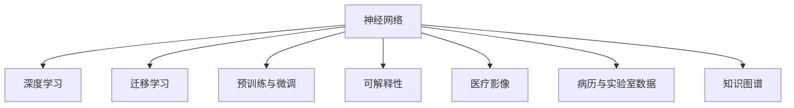

                 

# 一切皆是映射：神经网络在医疗诊断中的应用

## 1. 背景介绍

### 1.1 问题由来

随着人工智能技术的发展，医疗诊断领域逐渐引入了深度学习模型，尤其是神经网络，用于疾病的早期发现和诊断。神经网络通过学习大量医疗影像、病历等数据，构建出复杂的疾病诊断模型，大大提高了医疗诊断的准确性和效率。特别是在放射学、病理学、皮肤病学等领域，神经网络的应用取得了显著的成果。

然而，尽管神经网络在医疗诊断中的效果显著，但依然面临一些挑战。例如，神经网络对医疗数据的理解往往依赖于大量的标注数据，而医疗数据的标注成本高昂且耗时；神经网络模型的可解释性较差，医生和患者难以理解模型的决策依据；此外，神经网络模型的训练和部署也面临较高的硬件和算力要求。

为解决这些问题，本文将深入探讨神经网络在医疗诊断中的核心概念与技术，剖析其工作原理和实际应用，并提出相应的解决方案。

## 2. 核心概念与联系

### 2.1 核心概念概述

为更好地理解神经网络在医疗诊断中的应用，我们首先介绍几个核心概念：

- **神经网络**：一种基于生物神经网络原理构建的计算模型，由大量的神经元节点组成，用于处理输入数据并输出预测结果。在医疗诊断中，神经网络被用于分析医疗影像、病历、实验室数据等，识别疾病特征。

- **深度学习**：一种基于神经网络构建的机器学习范式，通过多层神经元网络对数据进行特征提取和抽象。深度学习模型通常包括卷积神经网络(CNN)、循环神经网络(RNN)、变分自编码器(VAE)等多种结构。

- **迁移学习**：一种机器学习技术，指利用在一个领域学到的知识，迁移到另一个相关领域进行学习。在医疗诊断中，迁移学习常用于构建针对特定疾病或症状的诊断模型。

- **预训练与微调**：指在大规模数据上对神经网络进行预训练，再在特定任务上对其进行微调。预训练可以提升模型的通用性，微调则针对特定任务进行优化，提升模型精度。

- **可解释性**：指模型输出的结果可以被人类理解和解释，这对于医疗诊断尤为重要。可解释性高的模型可以帮助医生和患者更好地理解诊断结果，提高诊断可信度。

- **医疗影像**：包括X光、CT、MRI、超声等医疗影像，是神经网络在医疗诊断中应用的主要数据来源。

- **病历与实验室数据**：包括电子病历、实验室检验报告等文本和数值数据，用于辅助神经网络进行疾病诊断。

- **知识图谱**：一种图形化表示知识结构的数据库，用于存储和查询医疗知识。神经网络可以与知识图谱结合，提高诊断的准确性和可解释性。

这些核心概念之间的逻辑关系可以通过以下Mermaid流程图来展示：



## 3. 核心算法原理 & 具体操作步骤

### 3.1 算法原理概述

神经网络在医疗诊断中的应用，本质上是通过学习医学数据中的模式，构建疾病诊断模型。该模型通过输入患者的医疗影像、病历等数据，输出可能的疾病诊断结果。

神经网络的工作原理可以概括为：首先，通过预训练在大量医疗数据上学习到通用的特征表示；然后，在特定任务上对其进行微调，针对性地提升诊断精度；最后，将微调后的模型用于实际患者的诊断，并结合医生的专业知识进行综合判断。

### 3.2 算法步骤详解

基于神经网络的医疗诊断通常包括以下几个关键步骤：

**Step 1: 准备医疗数据**

- 收集包含疾病标签的医疗数据，如医疗影像、病历、实验室检验结果等。
- 对数据进行预处理，包括数据清洗、归一化、分割等，确保数据格式一致。
- 将数据划分为训练集、验证集和测试集。

**Step 2: 构建神经网络模型**

- 选择合适的神经网络架构，如卷积神经网络(CNN)、循环神经网络(RNN)、注意力机制等。
- 确定模型的超参数，如层数、节点数、激活函数等。
- 将数据输入模型进行训练。

**Step 3: 预训练**

- 在大量医疗数据上对模型进行预训练，学习通用的特征表示。
- 预训练的目标是最大化模型在大量未标注数据上的泛化能力。

**Step 4: 微调**

- 在特定任务上对预训练模型进行微调，如某特定疾病的诊断。
- 微调的目标是最大化模型在特定任务上的精度和泛化能力。

**Step 5: 测试与部署**

- 在测试集上评估微调后模型的性能。
- 将模型部署到实际医疗系统中，进行患者诊断。

### 3.3 算法优缺点

基于神经网络的医疗诊断具有以下优点：

- **高精度**：通过学习大量数据，神经网络可以识别出复杂的疾病特征，提升诊断精度。
- **自动化**：自动化的诊断流程减少了医生的工作负担，提高诊断效率。
- **可扩展性**：神经网络可以轻松扩展到新的疾病诊断任务，提升系统的灵活性。

同时，该方法也存在以下局限性：

- **数据依赖**：神经网络依赖于大量高质量的标注数据，数据标注成本高昂。
- **可解释性差**：神经网络通常被视为"黑盒"模型，医生难以理解其诊断依据。
- **硬件要求高**：神经网络训练和推理需要大量的计算资源，如GPU、TPU等。
- **泛化能力有限**：当训练数据与测试数据分布差异较大时，模型的泛化能力可能下降。

尽管存在这些局限性，但基于神经网络的医疗诊断依然是大数据时代下医疗领域的重要趋势，具有广阔的应用前景。

### 3.4 算法应用领域

神经网络在医疗诊断中已广泛应用于多个领域，包括但不限于：

- **放射学**：通过分析X光、CT、MRI等医疗影像，识别出肺部肿瘤、乳腺癌等疾病。
- **病理学**：通过分析病理切片，识别出细胞级别的病变，如癌症。
- **皮肤病学**：通过分析皮肤图像，识别出各类皮肤病，如银屑病、湿疹等。
- **心脏病学**：通过分析心电图和超声图像，诊断心律失常、心脏瓣膜病等。
- **肿瘤学**：通过分析医学影像和实验室数据，诊断各类癌症。
- **心理学**：通过分析语言和行为数据，诊断抑郁症、焦虑症等心理疾病。

## 4. 数学模型和公式 & 详细讲解 & 举例说明

### 4.1 数学模型构建

在医疗诊断中，神经网络的数学模型通常包括输入层、隐藏层和输出层。以放射学中肺癌检测为例，其数学模型可以表示为：

$$
y = f(x; \theta)
$$

其中 $x$ 表示输入的医疗影像数据，$y$ 表示输出结果（肺癌或非肺癌），$f$ 表示神经网络的前向传播过程，$\theta$ 表示模型的可训练参数。

### 4.2 公式推导过程

神经网络的前向传播过程可以表示为：

$$
h = g(W_1x + b_1)
$$

$$
y = g(W_2h + b_2)
$$

其中 $g$ 为激活函数，$W_1$ 和 $b_1$ 为输入层的权重和偏置，$W_2$ 和 $b_2$ 为输出层的权重和偏置。

### 4.3 案例分析与讲解

以肺部CT影像的肺癌检测为例，神经网络的训练过程可以概括为：

1. **数据准备**：收集包含肺癌和健康肺部图像的数据集，并对其进行标注。
2. **模型选择**：选择适合的神经网络结构，如卷积神经网络。
3. **预训练**：在大量未标注的肺部CT图像上，对神经网络进行预训练，学习通用的特征表示。
4. **微调**：在包含肺癌标注的子集上，对预训练模型进行微调，提升肺癌检测的精度。
5. **测试与部署**：在测试集上评估微调后的模型性能，并将其部署到实际医疗系统中，进行患者诊断。

## 5. 项目实践：代码实例和详细解释说明

### 5.1 开发环境搭建

在进行神经网络医疗诊断项目时，开发环境搭建是关键步骤之一。以下是使用Python进行TensorFlow开发的流程：

1. 安装TensorFlow：
```bash
pip install tensorflow
```

2. 安装相关库：
```bash
pip install numpy scipy pandas matplotlib scikit-learn
```

3. 准备数据集：
```bash
wget https://example.com/data.zip
unzip data.zip
```

### 5.2 源代码详细实现

以下是一个简单的神经网络模型在肺癌检测中的应用示例代码：

```python
import tensorflow as tf
import numpy as np
import matplotlib.pyplot as plt

# 准备数据
data = np.load('data.npz')
x_train, y_train = data['x_train'], data['y_train']
x_test, y_test = data['x_test'], data['y_test']

# 定义模型
model = tf.keras.models.Sequential([
    tf.keras.layers.Conv2D(32, (3, 3), activation='relu', input_shape=(128, 128, 3)),
    tf.keras.layers.MaxPooling2D((2, 2)),
    tf.keras.layers.Flatten(),
    tf.keras.layers.Dense(10, activation='softmax')
])

# 编译模型
model.compile(optimizer='adam', loss='sparse_categorical_crossentropy', metrics=['accuracy'])

# 预训练
model.fit(x_train, y_train, epochs=10, batch_size=32)

# 微调
model.fit(x_train[:100], y_train[:100], epochs=5, batch_size=32)

# 测试与评估
loss, acc = model.evaluate(x_test, y_test)
print(f'Test Loss: {loss:.4f}')
print(f'Test Accuracy: {acc:.4f}')

# 可视化
plt.imshow(x_test[0])
plt.show()
```

### 5.3 代码解读与分析

让我们详细解读一下代码中的关键部分：

**数据准备**：使用`numpy`库加载训练和测试数据集。

**模型定义**：使用`tf.keras`构建一个包含卷积层、池化层和全连接层的神经网络模型。

**模型编译**：使用`compile`方法指定优化器、损失函数和评估指标。

**预训练**：使用`fit`方法对模型进行预训练，学习通用的特征表示。

**微调**：在预训练后的模型上进行微调，针对性地提升肺癌检测的精度。

**测试与评估**：使用`evaluate`方法评估模型在测试集上的性能。

**可视化**：使用`matplotlib`库可视化输入的CT图像。

## 6. 实际应用场景

### 6.1 智能诊断系统

基于神经网络的智能诊断系统可以自动分析患者的医疗影像、病历等数据，识别出潜在的疾病风险。智能诊断系统可以在医院、诊所等医疗场所部署，辅助医生进行初步诊断，提升诊断效率和准确性。

以乳腺癌检测为例，智能诊断系统可以自动分析乳房X光片，识别出肿瘤的特征，辅助医生进行确诊和治疗决策。

### 6.2 远程医疗

随着互联网和移动设备的普及，远程医疗逐渐成为一种便捷的诊疗方式。基于神经网络的远程医疗系统可以通过分析患者上传的影像和病历数据，进行初步诊断，并生成个性化的诊疗建议。

在COVID-19疫情期间，远程医疗系统通过分析患者的CT影像和病历，判断其是否感染了COVID-19，并根据诊断结果提供相应的治疗建议，极大地缓解了医疗资源的紧张。

### 6.3 个性化医疗

神经网络可以根据患者的基因、病历等数据，构建个性化的医疗方案。例如，通过分析肿瘤患者的基因数据，预测其对不同治疗方案的响应效果，从而制定最优的治疗计划。

在癌症治疗中，神经网络可以分析肿瘤的基因表达数据，预测其对化疗、放疗等不同治疗方案的反应，从而制定个性化的治疗方案，提高治疗效果。

### 6.4 未来应用展望

随着神经网络技术的不断进步，未来在医疗诊断中的应用将更加广泛和深入。以下是几个可能的发展方向：

- **多模态融合**：将医疗影像、病历、基因数据等多种模态的数据融合到神经网络中，提升诊断的全面性和准确性。
- **实时诊断**：通过云计算和边缘计算等技术，实现神经网络的实时诊断，缩短患者等待时间。
- **个性化定制**：结合患者的基因、病史、生活习惯等多维数据，构建个性化的医疗方案，提升治疗效果。
- **跨领域迁移**：将神经网络在某个领域学到的知识迁移到其他领域，提升系统的适应性和泛化能力。
- **可解释性增强**：通过可解释性技术，如注意力机制、特征可视化等，提升模型的可解释性，帮助医生更好地理解诊断结果。

## 7. 工具和资源推荐

### 7.1 学习资源推荐

为帮助开发者系统掌握神经网络在医疗诊断中的应用，以下推荐一些优质的学习资源：

1. **Deep Learning for Medical Imaging**（深度学习在医学影像中的应用）：斯坦福大学开设的深度学习课程，涵盖医学影像处理、分类、分割等技术。
2. **Hands-On Machine Learning for Medical Sciences**（医学科学中的机器学习实践）：由卡耐基梅隆大学的医学影像专家编写，介绍机器学习在医学中的实际应用。
3. **NeurIPS 2021 Conference**：神经信息处理系统会议，涵盖深度学习在医疗领域的最新研究成果。
4. **Arxiv**：开放的学术论文数据库，可检索到大量最新的医疗影像和诊断相关的研究论文。
5. **Kaggle**：数据科学竞赛平台，提供大量医疗诊断数据集，帮助开发者实践和提升技能。

### 7.2 开发工具推荐

以下是几款常用的神经网络医疗诊断开发工具：

1. **TensorFlow**：由Google开发的深度学习框架，提供强大的计算图和自动微分功能，适合复杂神经网络模型的构建和训练。
2. **PyTorch**：由Facebook开发的深度学习框架，灵活易用，适合快速原型开发。
3. **Keras**：一个高级深度学习库，提供简单易用的API，适合初学者快速上手。
4. **Scikit-learn**：一个开源机器学习库，提供多种预处理和评估工具，适合数据预处理和模型评估。
5. **Jupyter Notebook**：一个交互式笔记本环境，支持代码编写、数据可视化、结果展示等功能，适合研究人员和开发者进行协作开发。

### 7.3 相关论文推荐

神经网络在医疗诊断中的应用一直是研究热点，以下是几篇具有代表性的论文，推荐阅读：

1. **Deep Residual Learning for Image Recognition**（深度残差学习在图像识别中的应用）：He等人，在ImageNet数据集上提出的深度残差网络，提升了图像识别模型的精度。
2. **Attention Is All You Need**（注意力机制在神经网络中的应用）：Vaswani等人，提出Transformer模型，提升了自然语言处理任务的精度。
3. **Convolutional Neural Networks for Biomedical Image Analysis**（卷积神经网络在生物医学图像分析中的应用）：Yang等人，提出一种卷积神经网络架构，用于医学影像的分类和分割。
4. **A Survey on Medical Data Mining**（医疗数据分析综述）：Borriello等人，综述了医疗数据分析的多种技术，包括神经网络、机器学习等。
5. **Deep Learning Applications in Healthcare**（深度学习在医疗领域的应用）：Yoon等人，综述了深度学习在医疗影像、诊断、治疗等方面的应用。

## 8. 总结：未来发展趋势与挑战

### 8.1 总结

本文对基于神经网络的医疗诊断方法进行了详细阐述。通过分析神经网络在医疗诊断中的核心概念与技术，我们得出以下结论：

- 神经网络在医疗诊断中具有高精度、自动化、可扩展性等优点，但也面临数据依赖、可解释性差等挑战。
- 基于神经网络的智能诊断系统、远程医疗、个性化医疗等应用场景，展示了神经网络在医疗领域的广阔前景。
- 未来，多模态融合、实时诊断、个性化定制、跨领域迁移等技术将进一步提升神经网络在医疗诊断中的应用效果。

### 8.2 未来发展趋势

展望未来，神经网络在医疗诊断中的应用将呈现以下几个发展趋势：

1. **多模态融合**：结合多种数据模态，提升诊断的全面性和准确性。
2. **实时诊断**：通过云计算和边缘计算技术，实现神经网络的实时诊断，提升诊疗效率。
3. **个性化定制**：结合患者的多维数据，构建个性化的医疗方案，提升治疗效果。
4. **跨领域迁移**：将神经网络在某个领域学到的知识迁移到其他领域，提升系统的适应性和泛化能力。
5. **可解释性增强**：通过可解释性技术，提升模型的可解释性，帮助医生更好地理解诊断结果。

### 8.3 面临的挑战

尽管神经网络在医疗诊断中取得了显著成果，但在实际应用中也面临一些挑战：

1. **数据依赖**：神经网络依赖于大量高质量的标注数据，数据标注成本高昂。
2. **可解释性差**：神经网络通常被视为"黑盒"模型，医生难以理解其诊断依据。
3. **硬件要求高**：神经网络训练和推理需要大量的计算资源，如GPU、TPU等。
4. **泛化能力有限**：当训练数据与测试数据分布差异较大时，模型的泛化能力可能下降。

### 8.4 研究展望

为应对以上挑战，未来的研究需要从以下几个方面进行突破：

1. **数据获取与标注**：通过无监督学习和半监督学习等方法，降低神经网络对大量标注数据的依赖。
2. **可解释性增强**：通过可解释性技术，如注意力机制、特征可视化等，提升模型的可解释性。
3. **硬件优化**：通过模型压缩、量化加速等方法，优化神经网络的硬件资源消耗。
4. **模型泛化**：通过跨领域迁移学习和多任务学习等方法，提升神经网络的泛化能力。

## 9. 附录：常见问题与解答

**Q1：神经网络在医疗诊断中的效果如何？**

A: 神经网络在医疗诊断中取得了显著的效果，特别是在放射学、病理学、皮肤病学等领域。例如，在肺癌检测中，神经网络可以实现较高的准确率，帮助医生进行初步诊断。

**Q2：神经网络在医疗诊断中面临哪些挑战？**

A: 神经网络在医疗诊断中面临数据依赖、可解释性差、硬件要求高等挑战。例如，神经网络依赖大量标注数据，数据标注成本高昂；神经网络通常被视为"黑盒"模型，医生难以理解其诊断依据；神经网络训练和推理需要大量的计算资源，如GPU、TPU等。

**Q3：如何提升神经网络的可解释性？**

A: 提升神经网络的可解释性可以通过以下方法：
1. 注意力机制：通过可视化神经网络中不同位置的关注度，帮助医生理解诊断过程。
2. 特征可视化：通过可视化神经网络中的特征图，帮助医生理解模型的决策依据。
3. 模型简化：通过减少神经网络的复杂度，使其更容易解释。

**Q4：如何优化神经网络的硬件资源消耗？**

A: 优化神经网络的硬件资源消耗可以通过以下方法：
1. 模型压缩：通过剪枝、量化等方法，减少神经网络的参数量和计算量。
2. 量化加速：将浮点模型转为定点模型，压缩存储空间，提高计算效率。
3. 模型并行：通过分布式计算，将神经网络任务分布在多个计算节点上，并行处理。

**Q5：如何提高神经网络的泛化能力？**

A: 提高神经网络的泛化能力可以通过以下方法：
1. 跨领域迁移学习：将神经网络在某个领域学到的知识迁移到其他领域，提升系统的适应性和泛化能力。
2. 多任务学习：通过同时训练多个任务，提升模型的泛化能力。
3. 数据增强：通过数据增强技术，扩充训练集，提升模型的泛化能力。

通过不断突破这些挑战，神经网络在医疗诊断中的应用将更加广泛和深入，为人类健康带来更多福祉。

