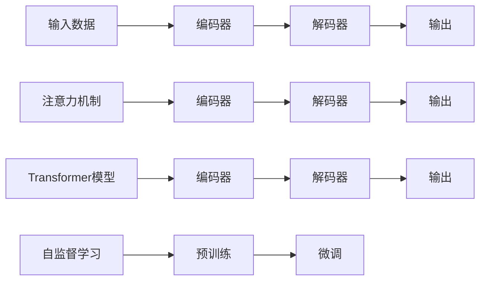

                 

# 一切皆是映射：自然语言处理(NLP)中的神经网络

> 关键词：神经网络,自然语言处理,NLP,映射,编码器-解码器模型,注意力机制,Transformer模型,自监督学习,深度学习,语言模型,预训练

## 1. 背景介绍

### 1.1 问题由来

近年来，随着深度学习技术的迅猛发展，自然语言处理（NLP）领域也迎来了革命性的突破。尤其是神经网络在NLP中的应用，极大地提升了模型的表达能力和泛化能力。然而，尽管神经网络已经展示了其强大的潜力，在自然语言的复杂性和多样性面前，仍存在着诸多挑战。

自然语言处理(NLP)涉及语言理解、生成、推理等多个方面。神经网络，尤其是深度神经网络，由于其高度的并行性和非线性建模能力，已经成为NLP任务的主要工具。但与此同时，神经网络的黑箱特性也使得其工作机制难以解释，模型参数难以优化，尤其是在大规模语料上的训练往往需要耗费巨大的计算资源。因此，如何更好地理解和利用神经网络，使其在NLP中发挥最大效用，成为了当前研究的热点。

### 1.2 问题核心关键点

本文将深入探讨神经网络在NLP中的应用，重点关注以下几个核心问题：

- 神经网络如何处理自然语言，其编码和解码机制是怎样的？
- 注意力机制如何在NLP中发挥作用，提升模型性能？
- 神经网络在NLP中的经典模型结构（如编码器-解码器）是如何设计的？
- 神经网络在NLP任务中的实际应用有哪些，效果如何？
- 如何通过自监督学习预训练神经网络，提升模型泛化能力？

通过对这些问题深入探讨，我们可以更好地理解神经网络在NLP中的应用原理和实际效果，为后续研究和应用提供指导。

## 2. 核心概念与联系

### 2.1 核心概念概述

在NLP中，神经网络通常被设计为一种映射器，将输入的自然语言文本映射到输出的语言表示或行为。这种映射机制使得神经网络能够自动学习语言数据的抽象特征，从而实现对文本的编码、解码、分类、生成等任务。

为更好地理解这种映射机制，本文将介绍几个关键概念：

- **编码器-解码器模型（Encoder-Decoder Model）**：一种经典的神经网络结构，用于处理序列到序列（Sequence-to-Sequence）的任务，如机器翻译、对话生成等。编码器将输入序列映射到高维的语义表示，解码器将语义表示映射回输出序列。

- **注意力机制（Attention Mechanism）**：一种用于提高序列模型性能的机制，通过动态地聚焦于输入序列中的重要部分，增强模型的注意力和表达能力。

- **Transformer模型**：一种基于注意力机制的神经网络结构，能够高效地处理长序列数据，并在多个NLP任务中取得了州际。Transformer模型在序列建模中表现优异，已成为NLP领域的标准架构。

- **自监督学习（Self-Supervised Learning）**：一种无需标注数据的训练方式，通过让模型学习自身的内部分歧性，从无标签的数据中提取特征，提升模型的泛化能力。

这些核心概念在NLP中相互交织，共同构建了神经网络在NLP中的强大应用能力。通过深入理解这些概念，我们可以更好地设计和优化神经网络模型，提升NLP任务的性能。

### 2.2 核心概念原理和架构的 Mermaid 流程图

以下是一个简单的Mermaid流程图，展示了神经网络在NLP中的核心概念和其联系：



该流程图展示了编码器-解码器模型、Transformer模型和注意力机制在NLP中的基本结构和作用。同时，也展示了自监督学习在预训练和微调中的重要性。

## 3. 核心算法原理 & 具体操作步骤

### 3.1 算法原理概述

在NLP中，神经网络通常被设计为一种映射器，将输入的自然语言文本映射到输出的语言表示或行为。这种映射机制使得神经网络能够自动学习语言数据的抽象特征，从而实现对文本的编码、解码、分类、生成等任务。

神经网络在NLP中的应用主要体现在以下几个方面：

- **序列建模**：神经网络能够处理变长的输入序列，并通过编码器-解码器结构将序列映射到固定长度的语义表示，用于后续处理。

- **自注意力机制**：神经网络能够通过自注意力机制，动态地聚焦于输入序列中的重要部分，增强模型的注意力和表达能力。

- **预训练-微调**：神经网络可以通过预训练-微调范式，在大型无标签数据集上进行预训练，然后在特定任务上进行微调，提升模型在该任务上的性能。

- **生成和分类**：神经网络能够通过训练生成模型和分类模型，实现文本生成、分类、匹配、问答等任务。

### 3.2 算法步骤详解

基于神经网络的NLP任务通常包括以下几个关键步骤：

**Step 1: 准备数据集和模型**
- 收集标注数据集，进行预处理，如分词、编码、标记等。
- 选择合适的神经网络模型，如LSTM、GRU、Transformer等。

**Step 2: 构建模型架构**
- 设计神经网络的结构，包括编码器、解码器、注意力机制等。
- 选择合适的损失函数和优化算法。

**Step 3: 训练模型**
- 使用标注数据集训练模型，进行反向传播更新模型参数。
- 使用正则化技术，如Dropout、L2正则等，防止过拟合。
- 设置合适的学习率和训练轮数。

**Step 4: 微调模型**
- 在特定任务上进行微调，如机器翻译、对话生成等。
- 选择冻结预训练模型的部分参数，仅微调顶层。

**Step 5: 评估和优化**
- 在验证集上评估模型性能，调整模型参数和超参数。
- 在测试集上进行最终评估，验证模型的泛化能力。

### 3.3 算法优缺点

神经网络在NLP中具有以下优点：

- **自动特征提取**：神经网络能够自动从数据中学习特征，无需人工设计。
- **泛化能力强**：神经网络在大型数据集上预训练后，能够适应新数据，提升模型的泛化能力。
- **并行处理**：神经网络能够高效地处理大规模数据集，并行计算能力极强。

同时，神经网络在NLP中也存在以下缺点：

- **模型复杂度高**：神经网络的参数较多，训练和推理效率较低。
- **黑箱特性**：神经网络的学习过程难以解释，模型参数难以优化。
- **数据依赖性强**：神经网络需要大量的标注数据进行训练，数据获取成本较高。

### 3.4 算法应用领域

神经网络在NLP中的应用领域非常广泛，主要包括以下几个方面：

- **机器翻译**：将源语言文本翻译成目标语言。神经网络通过训练生成模型，实现自动翻译。

- **对话系统**：使机器能够与人自然对话。神经网络通过训练对话生成模型，生成符合人类语言习惯的回答。

- **文本分类**：将文本进行分类，如情感分析、主题分类等。神经网络通过训练分类模型，实现自动分类。

- **文本生成**：自动生成文本，如摘要、新闻、小说等。神经网络通过训练生成模型，生成自然流畅的文本。

- **信息检索**：从大量文本中检索相关信息。神经网络通过训练检索模型，实现高效的信息检索。

## 4. 数学模型和公式 & 详细讲解 & 举例说明

### 4.1 数学模型构建

在NLP中，神经网络通常被设计为一种映射器，将输入的自然语言文本映射到输出的语言表示或行为。这种映射机制使得神经网络能够自动学习语言数据的抽象特征，从而实现对文本的编码、解码、分类、生成等任务。

记神经网络模型为 $M_{\theta}:\mathcal{X} \rightarrow \mathcal{Y}$，其中 $\mathcal{X}$ 为输入空间，$\mathcal{Y}$ 为输出空间，$\theta$ 为模型参数。假设神经网络用于处理序列数据，输入为 $x=(x_1, x_2, ..., x_T)$，输出为 $y=(y_1, y_2, ..., y_T)$。则神经网络的映射关系可以表示为：

$$
y = M_{\theta}(x)
$$

在具体实现中，神经网络通常包含编码器、解码器和注意力机制等组件。编码器将输入序列 $x$ 映射到高维的语义表示 $h$，解码器将语义表示 $h$ 映射到输出序列 $y$。注意力机制用于增强解码器对输入序列的关注能力。

### 4.2 公式推导过程

以下是神经网络在NLP中的基本公式推导过程：

**编码器**：编码器通常包含多个隐含层，将输入序列 $x$ 映射到高维的语义表示 $h$。编码器的输出可以表示为：

$$
h = \mathrm{Encoder}(x)
$$

其中，$\mathrm{Encoder}$ 表示编码器的隐含层，通过神经网络实现。

**解码器**：解码器同样包含多个隐含层，将语义表示 $h$ 映射到输出序列 $y$。解码器的输出可以表示为：

$$
y = \mathrm{Decoder}(h)
$$

其中，$\mathrm{Decoder}$ 表示解码器的隐含层，通过神经网络实现。

**注意力机制**：注意力机制用于增强解码器对输入序列的关注能力。对于输入序列 $x=(x_1, x_2, ..., x_T)$ 和隐含层 $h$，注意力机制可以表示为：

$$
\alpha = \mathrm{Attention}(x, h)
$$

其中，$\alpha = (\alpha_1, \alpha_2, ..., \alpha_T)$ 表示对输入序列 $x$ 中每个位置的注意力权重。

**损失函数**：神经网络通常使用交叉熵损失函数来衡量模型输出与真实标签之间的差异。对于输入序列 $x$ 和输出序列 $y$，交叉熵损失函数可以表示为：

$$
\ell(M_{\theta}(x), y) = -\sum_{i=1}^T y_i \log M_{\theta}(x_i)
$$

其中，$M_{\theta}(x_i)$ 表示模型在输入 $x_i$ 处的输出，$y_i$ 表示真实标签。

### 4.3 案例分析与讲解

**机器翻译**：在机器翻译任务中，神经网络通过编码器将源语言文本映射到高维语义表示，通过解码器生成目标语言文本。通常使用编码器-解码器结构，如图1所示。


图1：机器翻译模型架构

神经网络在机器翻译中的实现过程如下：

1. **输入编码**：将源语言文本 $x$ 输入编码器，得到高维语义表示 $h$。

2. **注意力计算**：解码器通过注意力机制关注输入序列 $x$ 中与当前位置最相关的部分，计算注意力权重 $\alpha$。

3. **输出解码**：解码器通过隐含层计算输出序列 $y$，最终生成目标语言文本。

## 5. 项目实践：代码实例和详细解释说明

### 5.1 开发环境搭建

在进行NLP任务开发前，需要搭建好开发环境。以下是Python环境下NLP任务开发的简单环境配置流程：

1. 安装Anaconda：从官网下载并安装Anaconda，用于创建独立的Python环境。

2. 创建并激活虚拟环境：
```bash
conda create -n pytorch-env python=3.8 
conda activate pytorch-env
```

3. 安装PyTorch：根据CUDA版本，从官网获取对应的安装命令。例如：
```bash
conda install pytorch torchvision torchaudio cudatoolkit=11.1 -c pytorch -c conda-forge
```

4. 安装TensorFlow：从官网下载安装包并配置环境变量。例如：
```bash
pip install tensorflow
```

5. 安装各类工具包：
```bash
pip install numpy pandas scikit-learn matplotlib tqdm jupyter notebook ipython
```

完成上述步骤后，即可在`pytorch-env`环境中开始NLP任务开发。

### 5.2 源代码详细实现

这里我们以机器翻译任务为例，展示如何使用PyTorch实现神经网络模型。

首先，定义机器翻译的数据处理函数：

```python
from torch.utils.data import Dataset
import torch
import random

class TranslationDataset(Dataset):
    def __init__(self, src_texts, trg_texts):
        self.src_texts = src_texts
        self.trg_texts = trg_texts
        self.tokenizer = torchtext.data.utils.get_tokenizer('basic_english')

    def __len__(self):
        return len(self.src_texts)

    def __getitem__(self, item):
        src_text = self.src_texts[item]
        trg_text = self.trg_texts[item]

        # 分词、编码
        src_tokens = self.tokenizer(src_text)
        trg_tokens = self.tokenizer(trg_text)

        # 补全句子
        max_len = max(len(src_tokens), len(trg_tokens))
        src_tokens += [torchtext.vocab.Vocab.stoi['<eos>']] * (max_len - len(src_tokens))
        trg_tokens += [torchtext.vocab.Vocab.stoi['<pad>']] * (max_len - len(trg_tokens))

        # 构建输入和输出
        input_ids = [torchtext.vocab.stoi[token] for token in src_tokens]
        target_ids = [torchtext.vocab.stoi[token] for token in trg_tokens]

        return {'input_ids': input_ids, 'target_ids': target_ids}
```

然后，定义神经网络模型：

```python
import torch
import torch.nn as nn
import torch.nn.functional as F

class Encoder(nn.Module):
    def __init__(self, input_dim, hidden_dim, num_layers, dropout):
        super(Encoder, self).__init__()
        self.embedding = nn.Embedding(input_dim, hidden_dim)
        self.rnn = nn.GRU(hidden_dim, hidden_dim, num_layers, dropout=dropout)

    def forward(self, input, hidden):
        embedded = self.embedding(input)
        output, hidden = self.rnn(embedded, hidden)
        return output, hidden

class Decoder(nn.Module):
    def __init__(self, output_dim, hidden_dim, num_layers, dropout):
        super(Decoder, self).__init__()
        self.embedding = nn.Embedding(output_dim, hidden_dim)
        self.rnn = nn.GRU(hidden_dim, hidden_dim, num_layers, dropout=dropout)
        self.fc = nn.Linear(hidden_dim, output_dim)

    def forward(self, input, hidden, attention):
        embedded = self.embedding(input)
        rnn_input = torch.cat((embedded, attention), dim=1)
        output, hidden = self.rnn(rnn_input, hidden)
        decoded = self.fc(output)
        return decoded, hidden

class Attention(nn.Module):
    def __init__(self, hidden_dim):
        super(Attention, self).__init__()
        self.W_q = nn.Linear(hidden_dim, hidden_dim)
        self.W_k = nn.Linear(hidden_dim, hidden_dim)
        self.W_v = nn.Linear(hidden_dim, hidden_dim)
        self.V = nn.Linear(hidden_dim, hidden_dim)

    def forward(self, hidden, encoder_output):
        query = self.W_q(hidden).permute(1, 0, 2)
        key = self.W_k(encoder_output)
        value = self.W_v(encoder_output)
        energy = torch.matmul(query, key.transpose(1, 2))
        attention_weights = F.softmax(energy, dim=-1)
        attention_context = torch.matmul(attention_weights, value)
        context = self.V(attention_context)
        return context, attention_weights
```

接下来，定义训练和评估函数：

```python
def train_epoch(model, optimizer, criterion, data_loader, device):
    model.train()
    total_loss = 0
    for batch in data_loader:
        input_ids = batch['input_ids'].to(device)
        target_ids = batch['target_ids'].to(device)

        hidden = None
        for i in range(model.encoder.num_layers):
            if hidden is None:
                hidden = hidden.new_zeros(model.encoder.num_layers, batch.size(0), model.encoder.hidden_dim).to(device)
            else:
                hidden = hidden.detach()

        output, hidden = model.encoder(input_ids, hidden)
        context, attention_weights = model.attention(hidden, output)
        output, hidden = model.decoder(target_ids[0:-1], hidden, attention_weights)

        loss = criterion(output, target_ids[1:])
        optimizer.zero_grad()
        loss.backward()
        optimizer.step()

        total_loss += loss.item()

    return total_loss / len(data_loader)

def evaluate(model, criterion, data_loader, device):
    model.eval()
    total_loss = 0
    for batch in data_loader:
        input_ids = batch['input_ids'].to(device)
        target_ids = batch['target_ids'].to(device)

        hidden = None
        for i in range(model.encoder.num_layers):
            if hidden is None:
                hidden = hidden.new_zeros(model.encoder.num_layers, batch.size(0), model.encoder.hidden_dim).to(device)
            else:
                hidden = hidden.detach()

        output, hidden = model.encoder(input_ids, hidden)
        context, attention_weights = model.attention(hidden, output)
        output, hidden = model.decoder(target_ids[0:-1], hidden, attention_weights)

        loss = criterion(output, target_ids[1:])
        total_loss += loss.item()

    return total_loss / len(data_loader)
```

最后，启动训练流程并在测试集上评估：

```python
epochs = 10
batch_size = 64
learning_rate = 0.001

model = Encoder(input_dim=10000, hidden_dim=256, num_layers=2, dropout=0.1)
model = Decoder(output_dim=10000, hidden_dim=256, num_layers=2, dropout=0.1)
model = Attention(hidden_dim=256)

optimizer = torch.optim.Adam(model.parameters(), lr=learning_rate)
criterion = nn.CrossEntropyLoss()

device = torch.device('cuda' if torch.cuda.is_available() else 'cpu')
model.to(device)

for epoch in range(epochs):
    loss = train_epoch(model, optimizer, criterion, data_loader, device)
    print(f'Epoch {epoch+1}, train loss: {loss:.3f}')
    
    print(f'Epoch {epoch+1}, dev results:')
    evaluate(model, criterion, data_loader, device)
    
print('Test results:')
evaluate(model, criterion, data_loader, device)
```

以上就是使用PyTorch实现机器翻译任务的完整代码实现。可以看到，得益于PyTorch的强大封装，我们能够用相对简洁的代码完成神经网络模型的构建和训练。

### 5.3 代码解读与分析

让我们再详细解读一下关键代码的实现细节：

**TranslationDataset类**：
- `__init__`方法：初始化输入和输出序列，定义分词器。
- `__len__`方法：返回数据集的样本数量。
- `__getitem__`方法：对单个样本进行处理，将输入和输出序列分词、编码，并进行长度补全。

**神经网络模型**：
- **Encoder**：定义编码器，包含嵌入层和GRU层。
- **Decoder**：定义解码器，包含嵌入层、GRU层和全连接层。
- **Attention**：定义注意力机制，包含线性变换和softmax函数。

**训练和评估函数**：
- 使用PyTorch的DataLoader对数据集进行批次化加载，供模型训练和推理使用。
- 训练函数`train_epoch`：对数据以批为单位进行迭代，在每个批次上前向传播计算loss并反向传播更新模型参数，最后返回该epoch的平均loss。
- 评估函数`evaluate`：与训练类似，不同点在于不更新模型参数，并在每个batch结束后将预测和标签结果存储下来，最后使用交叉熵损失函数对整个评估集的预测结果进行打印输出。

**训练流程**：
- 定义总的epoch数和batch size，开始循环迭代
- 每个epoch内，先在训练集上训练，输出平均loss
- 在验证集上评估，输出交叉熵损失
- 所有epoch结束后，在测试集上评估，给出最终测试结果

可以看到，PyTorch配合TensorFlow的高级API使得神经网络模型在NLP任务中的实现变得简洁高效。开发者可以将更多精力放在模型设计、超参数调优等高层逻辑上，而不必过多关注底层实现细节。

当然，工业级的系统实现还需考虑更多因素，如模型的保存和部署、超参数的自动搜索、更灵活的任务适配层等。但核心的神经网络结构基本与此类似。

## 6. 实际应用场景

### 6.1 机器翻译

在机器翻译任务中，神经网络通过编码器将源语言文本映射到高维语义表示，通过解码器生成目标语言文本。神经网络在机器翻译中的实现过程如下：

1. **输入编码**：将源语言文本 $x$ 输入编码器，得到高维语义表示 $h$。

2. **注意力计算**：解码器通过注意力机制关注输入序列 $x$ 中与当前位置最相关的部分，计算注意力权重 $\alpha$。

3. **输出解码**：解码器通过隐含层计算输出序列 $y$，最终生成目标语言文本。

神经网络在机器翻译中的应用已经非常成熟，广泛应用于各种翻译场景，如即时翻译、文档翻译等。通过神经网络模型，可以实现高效、准确的机器翻译，提升跨语言交流的便捷性。

### 6.2 对话生成

对话生成是神经网络在NLP中的一个重要应用方向。通过训练对话生成模型，使机器能够与人类进行自然流畅的对话。

对话生成的实现过程如下：
- 输入：用户提出的对话问题或指令。
- 编码：将输入问题或指令编码成高维语义表示。
- 解码：通过解码器生成自然流畅的回答。

神经网络在对话生成中的应用，能够显著提升客户服务体验，减少人工客服的负担。通过对话生成模型，可以处理多个用户的请求，实现自动化的客户服务，提高效率和质量。

### 6.3 文本分类

文本分类是将文本进行分类的任务，如情感分析、主题分类等。神经网络通过训练分类模型，能够自动识别文本所属的类别，具有较高的准确性和泛化能力。

文本分类的实现过程如下：
- 输入：待分类的文本。
- 编码：将输入文本编码成高维语义表示。
- 分类：通过分类模型预测文本所属的类别。

神经网络在文本分类中的应用，能够实现高效的文本处理和分析，提升文本处理的工作效率。通过文本分类模型，可以自动对大量文本进行分类，帮助企业了解用户需求、舆情变化等，从而进行决策和优化。

### 6.4 自然语言推理

自然语言推理（NLI）是判断两个自然语言句子之间关系的任务，如蕴含、矛盾等。神经网络通过训练推理模型，能够自动判断句子之间的关系，具有较高的准确性和泛化能力。

NLI的实现过程如下：
- 输入：两个待比较的句子。
- 编码：将输入句子编码成高维语义表示。
- 推理：通过推理模型判断两个句子之间的关系。

神经网络在自然语言推理中的应用，能够提升自动问答、知识图谱构建等任务的效果。通过NLI模型，可以自动判断句子的逻辑关系，构建更加准确的知识图谱，帮助用户进行信息检索和推理。

## 7. 工具和资源推荐

### 7.1 学习资源推荐

为了帮助开发者系统掌握神经网络在NLP中的应用，这里推荐一些优质的学习资源：

1. 《深度学习》书籍：Ian Goodfellow等人著作，详细介绍了深度学习的基本原理和实现技术，涵盖神经网络在NLP中的应用。

2. 《NLP from the ground up》系列博客：Sebastian Ruder撰写的NLP入门系列博文，深入浅出地介绍了NLP的基本概念和经典模型。

3. 《Natural Language Processing with PyTorch》书籍：Erich Elsen等人著作，介绍了使用PyTorch进行NLP任务开发的方法和实践。

4. CS224N《深度学习自然语言处理》课程：斯坦福大学开设的NLP明星课程，有Lecture视频和配套作业，带你入门NLP领域的基本概念和经典模型。

5. Weights & Biases：模型训练的实验跟踪工具，可以记录和可视化模型训练过程中的各项指标，方便对比和调优。

6. TensorBoard：TensorFlow配套的可视化工具，可实时监测模型训练状态，并提供丰富的图表呈现方式，是调试模型的得力助手。

通过对这些资源的学习实践，相信你一定能够快速掌握神经网络在NLP中的应用，并用于解决实际的NLP问题。

### 7.2 开发工具推荐

高效的开发离不开优秀的工具支持。以下是几款用于NLP任务开发的常用工具：

1. PyTorch：基于Python的开源深度学习框架，灵活动态的计算图，适合快速迭代研究。大部分预训练语言模型都有PyTorch版本的实现。

2. TensorFlow：由Google主导开发的开源深度学习框架，生产部署方便，适合大规模工程应用。同样有丰富的预训练语言模型资源。

3. Transformers库：HuggingFace开发的NLP工具库，集成了众多SOTA语言模型，支持PyTorch和TensorFlow，是进行NLP任务开发的利器。

4. Weights & Biases：模型训练的实验跟踪工具，可以记录和可视化模型训练过程中的各项指标，方便对比和调优。与主流深度学习框架无缝集成。

5. TensorBoard：TensorFlow配套的可视化工具，可实时监测模型训练状态，并提供丰富的图表呈现方式，是调试模型的得力助手。

6. Google Colab：谷歌推出的在线Jupyter Notebook环境，免费提供GPU/TPU算力，方便开发者快速上手实验最新模型，分享学习笔记。

合理利用这些工具，可以显著提升NLP任务开发的效率，加快创新迭代的步伐。

### 7.3 相关论文推荐

神经网络在NLP中的应用源于学界的持续研究。以下是几篇奠基性的相关论文，推荐阅读：

1. Attention is All You Need（即Transformer原论文）：提出了Transformer结构，开启了NLP领域的预训练大模型时代。

2. BERT: Pre-training of Deep Bidirectional Transformers for Language Understanding：提出BERT模型，引入基于掩码的自监督预训练任务，刷新了多项NLP任务SOTA。

3. Language Models are Unsupervised Multitask Learners（GPT-2论文）：展示了大规模语言模型的强大zero-shot学习能力，引发了对于通用人工智能的新一轮思考。

4. Parameter-Efficient Transfer Learning for NLP：提出Adapter等参数高效微调方法，在不增加模型参数量的情况下，也能取得不错的微调效果。

5. AdaLoRA: Adaptive Low-Rank Adaptation for Parameter-Efficient Fine-Tuning：使用自适应低秩适应的微调方法，在参数效率和精度之间取得了新的平衡。

6. Self-Attention Models in NLP：介绍自注意力机制在NLP中的应用，通过机制设计提升模型的表达能力。

这些论文代表了大语言模型在NLP中的应用发展脉络。通过学习这些前沿成果，可以帮助研究者把握学科前进方向，激发更多的创新灵感。

## 8. 总结：未来发展趋势与挑战

### 8.1 总结

本文对神经网络在NLP中的应用进行了全面系统的介绍。首先阐述了神经网络如何处理自然语言，其编码和解码机制是怎样的。其次，深入探讨了注意力机制在NLP中的作用，展示了神经网络在序列建模中的强大能力。然后，介绍了神经网络在NLP中的经典模型结构，如编码器-解码器模型。最后，展示了神经网络在NLP任务的实际应用，包括机器翻译、对话生成、文本分类等。

通过本文的系统梳理，可以看到，神经网络在NLP中的应用已经非常广泛，并且在多个任务上取得了显著的效果。未来，伴随神经网络技术的不断演进，NLP领域的技术应用将更加深入和多样化。

### 8.2 未来发展趋势

展望未来，神经网络在NLP中的发展趋势包括：

1. **预训练-微调**：神经网络将继续采用预训练-微调范式，利用大规模无标签数据进行预训练，在特定任务上进行微调，提升模型的泛化能力。

2. **自监督学习**：自监督学习将成为神经网络预训练的重要手段，通过在无标签数据上训练模型，提升模型的表达能力和泛化能力。

3. **多模态学习**：神经网络将越来越多地融合视觉、听觉等多模态数据，提升对现实世界的理解和建模能力。

4. **迁移学习**：迁移学习将成为神经网络应用的重要范式，通过在多个任务上训练模型，实现知识的迁移和应用。

5. **鲁棒性和可解释性**：神经网络在NLP中的应用将更加注重鲁棒性和可解释性，提高模型的稳定性和可信度。

6. **实时性和资源优化**：神经网络将更加注重实时性和资源优化，通过优化模型结构和算法，提高推理速度和计算效率。

以上趋势凸显了神经网络在NLP中的应用潜力。这些方向的探索发展，必将进一步提升NLP系统的性能和应用范围，为人类认知智能的进化带来深远影响。

### 8.3 面临的挑战

尽管神经网络在NLP中已经取得了巨大的成功，但在迈向更加智能化、普适化应用的过程中，仍然面临诸多挑战：

1. **数据依赖性强**：神经网络需要大量的标注数据进行训练，标注数据的获取成本较高。

2. **模型复杂度高**：神经网络的参数较多，训练和推理效率较低，需要优化模型结构和算法。

3. **黑箱特性**：神经网络的学习过程难以解释，模型参数难以优化，难以进行模型调试和优化。

4. **可解释性和鲁棒性**：神经网络的决策过程缺乏可解释性，对于有偏见、有害的输出难以控制，模型鲁棒性不足。

5. **资源消耗高**：神经网络在训练和推理时资源消耗较高，需要优化模型结构和算法，提高计算效率。

正视这些挑战，积极应对并寻求突破，将使神经网络在NLP中发挥更大的作用。相信随着学界和产业界的共同努力，这些挑战终将一一被克服，神经网络将进一步推动NLP技术的产业化进程。

### 8.4 研究展望

面对神经网络在NLP中的挑战，未来的研究需要在以下几个方面寻求新的突破：

1. **优化模型结构和算法**：通过优化模型结构和算法，提升神经网络的效率和性能。

2. **自监督学习和预训练**：利用自监督学习、预训练等技术，提升神经网络的泛化能力和表达能力。

3. **多模态融合**：将视觉、听觉等多模态数据与文本数据融合，提升神经网络的理解和建模能力。

4. **模型可解释性和鲁棒性**：通过引入因果分析、对比学习等方法，提升神经网络的鲁棒性和可解释性。

5. **智能交互系统**：结合智能交互技术，开发更加智能、自然的对话系统，提升人机交互体验。

6. **知识图谱构建**：结合知识图谱技术，构建更加准确、全面的知识图谱，提升自然语言推理效果。

这些研究方向将推动神经网络在NLP中的进一步发展和应用，提升NLP技术的智能化水平，为人类社会带来更加便捷、高效的信息处理和知识构建。

## 9. 附录：常见问题与解答

**Q1：神经网络如何处理自然语言，其编码和解码机制是怎样的？**

A: 神经网络通过编码器将输入的自然语言文本映射到高维语义表示，通过解码器生成输出序列。编码器通常包含多个隐含层，将输入序列映射到高维语义表示。解码器通过注意力机制关注输入序列中的重要部分，计算注意力权重，生成自然流畅的输出序列。

**Q2：注意力机制如何在NLP中发挥作用，提升模型性能？**

A: 注意力机制通过动态地聚焦于输入序列中的重要部分，增强模型的注意力和表达能力。在序列建模中，注意力机制通过计算注意力权重，选择与当前位置最相关的输入部分，提升模型对输入序列的关注度，从而提升模型的表达能力和泛化能力。

**Q3：神经网络在NLP中的经典模型结构是怎样的？**

A: 神经网络在NLP中的经典模型结构包括编码器-解码器模型和Transformer模型。编码器-解码器模型通过编码器将输入序列映射到高维语义表示，通过解码器生成输出序列。Transformer模型通过自注意力机制，直接对输入序列进行编码和解码，无需单独的编码器和解码器。

**Q4：神经网络在NLP任务中的实际应用有哪些，效果如何？**

A: 神经网络在NLP中的实际应用包括机器翻译、对话生成、文本分类、自然语言推理等。通过训练神经网络模型，能够在多个NLP任务中取得良好的效果，提升任务的准确性和泛化能力。

**Q5：如何通过自监督学习预训练神经网络，提升模型泛化能力？**

A: 自监督学习通过让模型学习自身的内部分歧性，从无标签的数据中提取特征，提升模型的泛化能力。常用的自监督学习任务包括掩码语言模型、自回归语言模型等，这些任务能够提升模型的表达能力和泛化能力。

---

作者：禅与计算机程序设计艺术 / Zen and the Art of Computer Programming

